# API参考文档

<cite>
**本文引用的文件**   
- [README.md](file://README.md)
- [docs/folium/api.md](file://docs/folium/api.md)
- [mods/README.md](file://mods/README.md)
- [src/types/appPlayback.ts](file://src/types/appPlayback.ts)
- [src/types/lyricApi.ts](file://src/types/lyricApi.ts)
- [src/types/obsBrowserSource.ts](file://src/types/obsBrowserSource.ts)
- [electron/main.cjs](file://electron/main.cjs)
- [electron/stageApi.cjs](file://electron/stageApi.cjs)
- [electron/discordPresence.cjs](file://electron/discordPresence.cjs)
- [electron/preload.cjs](file://electron/preload.cjs)
- [test/manual/stage-client/API_SCHEMA.md](file://test/manual/stage-client/API_SCHEMA.md)
- [src/utils/stageClientDemo.ts](file://src/utils/stageClientDemo.ts)
</cite>

## 目录
1. [简介](#简介)
2. [项目结构](#项目结构)
3. [核心组件](#核心组件)
4. [架构总览](#架构总览)
5. [详细组件分析](#详细组件分析)
6. [依赖关系分析](#依赖关系分析)
7. [性能与稳定性考虑](#性能与稳定性考虑)
8. [故障排查指南](#故障排查指南)
9. [结论](#结论)
10. [附录：数据类型与常量](#附录数据类型与常量)

## 简介
本文件为 Folia Major 的 API 参考文档，覆盖内部 API、外部集成接口、数据类型定义、事件系统、错误处理规范与使用示例。Folia 是一个以全屏沉浸式歌词播放为核心的音乐播放器，提供桌面端与 Web 部署能力，并支持模组系统 Folium、Stage 外部输入、OBS 浏览器源、Discord Rich Presence 等扩展能力。

- 应用定位与获取方式见仓库说明。
- 模组系统 Folium 的完整契约由 `docs/folium/api.md` 自动生成，是第三方扩展的核心入口。
- Stage API、OBS 集成、Discord Rich Presence 等外部集成在 Electron 主进程与类型文件中集中实现。

**章节来源**
- [README.md:32-38](file://README.md#L32-L38)
- [README.md:155-173](file://README.md#L155-L173)

## 项目结构
从 API 视角，Folia Major 的关键代码分布在以下位置：
- 前端与运行时契约：`docs/folium/api.md`、`mods/README.md`
- 播放状态与窗口间数据模型：`src/types/appPlayback.ts`
- 本地歌词服务状态契约：`src/types/lyricApi.ts`
- OBS 浏览器源契约：`src/types/obsBrowserSource.ts`
- Electron 主进程 HTTP 与 IPC 路由：`electron/main.cjs`
- Stage API 实现：`electron/stageApi.cjs`
- Discord Rich Presence 控制器：`electron/discordPresence.cjs`
- 预加载桥接（IPC 暴露）：`electron/preload.cjs`
- Stage 客户端测试契约与构建工具：`test/manual/stage-client/API_SCHEMA.md`、`src/utils/stageClientDemo.ts`

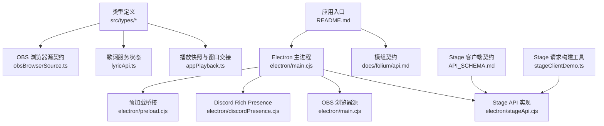

**图表来源**
- [README.md:155-173](file://README.md#L155-L173)
- [docs/folium/api.md:1-23](file://docs/folium/api.md#L1-L23)
- [electron/main.cjs:1945-1990](file://electron/main.cjs#L1945-L1990)
- [electron/stageApi.cjs:550-591](file://electron/stageApi.cjs#L550-L591)
- [electron/discordPresence.cjs:103-141](file://electron/discordPresence.cjs#L103-L141)
- [electron/preload.cjs:235-272](file://electron/preload.cjs#L235-L272)
- [src/types/appPlayback.ts:53-111](file://src/types/appPlayback.ts#L53-L111)
- [src/types/lyricApi.ts:4-10](file://src/types/lyricApi.ts#L4-L10)
- [src/types/obsBrowserSource.ts:29-129](file://src/types/obsBrowserSource.ts#L29-L129)
- [test/manual/stage-client/API_SCHEMA.md:45-74](file://test/manual/stage-client/API_SCHEMA.md#L45-L74)
- [src/utils/stageClientDemo.ts:260-294](file://src/utils/stageClientDemo.ts#L260-L294)

**章节来源**
- [docs/folium/api.md:1-23](file://docs/folium/api.md#L1-L23)
- [mods/README.md:176-187](file://mods/README.md#L176-L187)
- [src/types/appPlayback.ts:53-111](file://src/types/appPlayback.ts#L53-L111)
- [src/types/lyricApi.ts:4-10](file://src/types/lyricApi.ts#L4-L10)
- [src/types/obsBrowserSource.ts:29-129](file://src/types/obsBrowserSource.ts#L29-L129)
- [electron/main.cjs:1945-1990](file://electron/main.cjs#L1945-L1990)
- [electron/stageApi.cjs:550-591](file://electron/stageApi.cjs#L550-L591)
- [electron/discordPresence.cjs:103-141](file://electron/discordPresence.cjs#L103-L141)
- [electron/preload.cjs:235-272](file://electron/preload.cjs#L235-L272)
- [test/manual/stage-client/API_SCHEMA.md:45-74](file://test/manual/stage-client/API_SCHEMA.md#L45-L74)
- [src/utils/stageClientDemo.ts:260-294](file://src/utils/stageClientDemo.ts#L260-L294)

## 核心组件
本节聚焦三类核心 API：
- 内部 API：状态管理、播放控制、歌词系统、可视化渲染
- 外部集成 API：Stage API、OBS 集成、Discord Rich Presence
- 数据类型与常量：核心数据结构、枚举、接口、常量

### 内部 API：状态管理与播放控制
- 播放快照包含当前歌曲、歌词、封面、音频源、队列、FM 模式、播放器状态、时间与行索引。
- 窗口间播放交接对象用于在主窗口与 Stage 窗口之间传递 UI、Now Playing、Stage 与播放快照。
- Stage 歌词时钟与 Now Playing 时钟分别描述歌词时间轴与媒体会话时间轴。

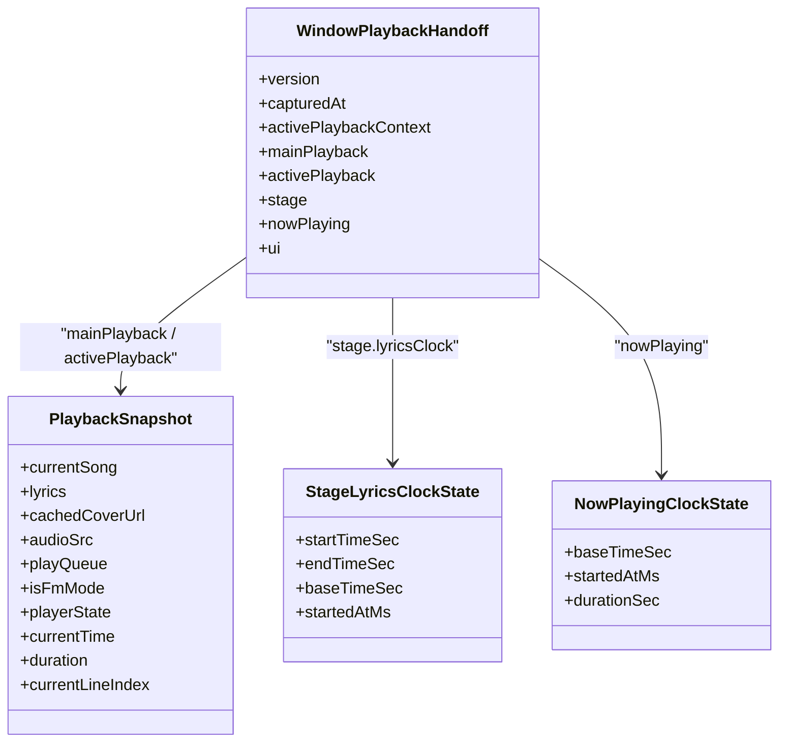

**图表来源**
- [src/types/appPlayback.ts:53-111](file://src/types/appPlayback.ts#L53-L111)

**章节来源**
- [src/types/appPlayback.ts:53-111](file://src/types/appPlayback.ts#L53-L111)

### 内部 API：歌词系统与可视化渲染
- 歌词服务状态契约描述本地歌词服务的启用、运行、端口、URL 与错误信息。
- Folium 模组契约提供歌词变换、歌词辅助函数、主题辅助函数、舞台上下文、音频带与频谱等可视化能力。
- OBS 浏览器源契约定义配置、时钟、音频与事件流，供 OBS 页面消费。

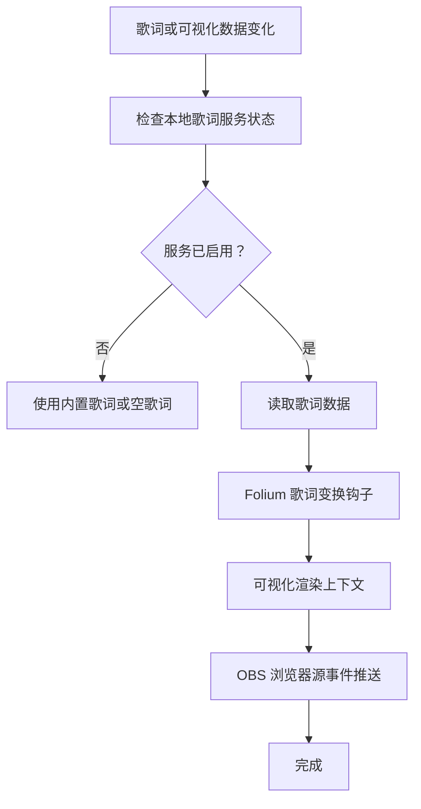

**图表来源**
- [src/types/lyricApi.ts:4-10](file://src/types/lyricApi.ts#L4-L10)
- [docs/folium/api.md:552-568](file://docs/folium/api.md#L552-L568)
- [docs/folium/api.md:494-521](file://docs/folium/api.md#L494-L521)
- [src/types/obsBrowserSource.ts:103-129](file://src/types/obsBrowserSource.ts#L103-L129)

**章节来源**
- [src/types/lyricApi.ts:4-10](file://src/types/lyricApi.ts#L4-L10)
- [docs/folium/api.md:552-568](file://docs/folium/api.md#L552-L568)
- [docs/folium/api.md:494-521](file://docs/folium/api.md#L494-L521)
- [src/types/obsBrowserSource.ts:103-129](file://src/types/obsBrowserSource.ts#L103-L129)

### 外部集成 API：Stage API
- Stage API 提供健康检查、状态查询、歌词写入与会话管理。
- 客户端通过 JSON 请求构建工具生成标准请求，服务端返回统一的状态对象。
- 主进程通过 IPC 暴露 Stage 控制能力，包括启用、令牌再生、状态清理、外部播放请求完成、播放器快照发布与控制请求完成。

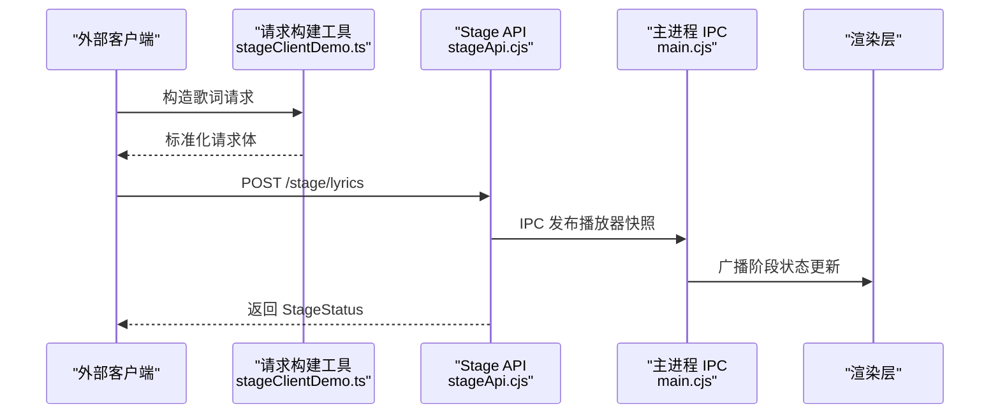

**图表来源**
- [src/utils/stageClientDemo.ts:260-294](file://src/utils/stageClientDemo.ts#L260-L294)
- [electron/stageApi.cjs:550-591](file://electron/stageApi.cjs#L550-L591)
- [electron/main.cjs:6349-6391](file://electron/main.cjs#L6349-L6391)
- [test/manual/stage-client/API_SCHEMA.md:330-370](file://test/manual/stage-client/API_SCHEMA.md#L330-L370)

**章节来源**
- [test/manual/stage-client/API_SCHEMA.md:45-74](file://test/manual/stage-client/API_SCHEMA.md#L45-L74)
- [test/manual/stage-client/API_SCHEMA.md:330-370](file://test/manual/stage-client/API_SCHEMA.md#L330-L370)
- [src/utils/stageClientDemo.ts:260-294](file://src/utils/stageClientDemo.ts#L260-L294)
- [electron/stageApi.cjs:550-591](file://electron/stageApi.cjs#L550-L591)
- [electron/main.cjs:6349-6391](file://electron/main.cjs#L6349-L6391)

### 外部集成 API：OBS 集成
- OBS 浏览器源在本地启动 HTTP 服务，提供状态、SSE 事件与静态资源。
- 配置对象包含播放上下文、歌曲信息、歌词、主题、可视化模式、背景与字幕设置。
- 时钟与音频事件按帧推送，供 OBS 页面渲染。

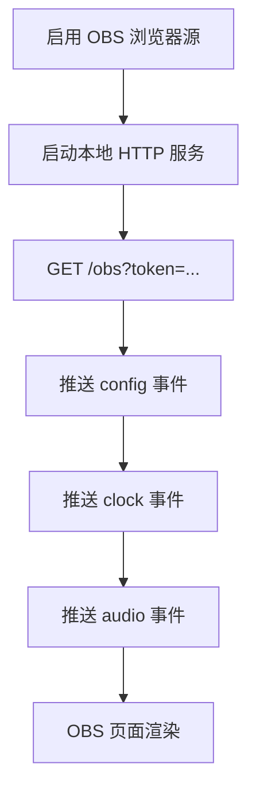

**图表来源**
- [electron/main.cjs:1945-1990](file://electron/main.cjs#L1945-L1990)
- [electron/main.cjs:4298-4333](file://electron/main.cjs#L4298-L4333)
- [src/types/obsBrowserSource.ts:29-129](file://src/types/obsBrowserSource.ts#L29-L129)

**章节来源**
- [electron/main.cjs:1945-1990](file://electron/main.cjs#L1945-L1990)
- [electron/main.cjs:4298-4333](file://electron/main.cjs#L4298-L4333)
- [src/types/obsBrowserSource.ts:29-129](file://src/types/obsBrowserSource.ts#L29-L129)

### 外部集成 API：Discord Rich Presence
- Discord Rich Presence 控制器根据播放快照构建活动信息，维护连接状态并周期性更新。
- 应用 ID 与图片 URL 会进行规范化校验，避免无效值导致异常。
- 当无有效活动或连接断开时，控制器会清理活动并上报错误。

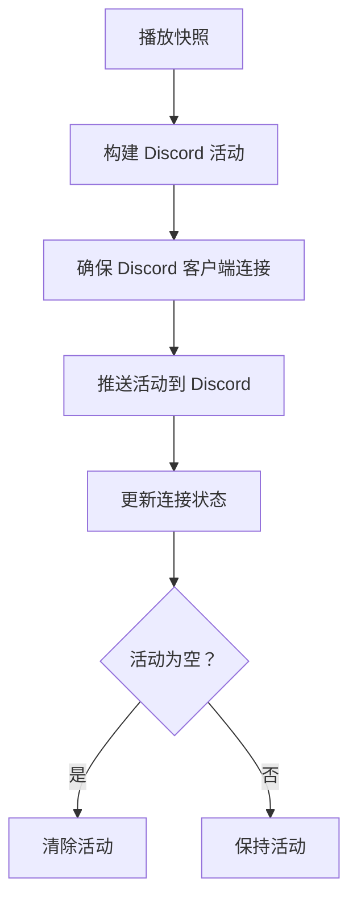

**图表来源**
- [electron/discordPresence.cjs:47-101](file://electron/discordPresence.cjs#L47-L101)
- [electron/discordPresence.cjs:103-141](file://electron/discordPresence.cjs#L103-L141)
- [electron/discordPresence.cjs:228-264](file://electron/discordPresence.cjs#L228-L264)

**章节来源**
- [electron/discordPresence.cjs:47-101](file://electron/discordPresence.cjs#L47-L101)
- [electron/discordPresence.cjs:103-141](file://electron/discordPresence.cjs#L103-L141)
- [electron/discordPresence.cjs:228-264](file://electron/discordPresence.cjs#L228-L264)

## 架构总览
Folia Major 的 API 架构围绕“状态—事件—渲染”展开：
- 状态层：播放快照、歌词服务状态、OBS 配置与时钟、Stage 会话状态
- 事件层：Folium 事件总线、OBS SSE 事件、Stage WebSocket/IPC 事件、Discord 活动更新
- 渲染层：Folium 可视化挂载点、OBS 浏览器源页面、Stage 外部输入渲染

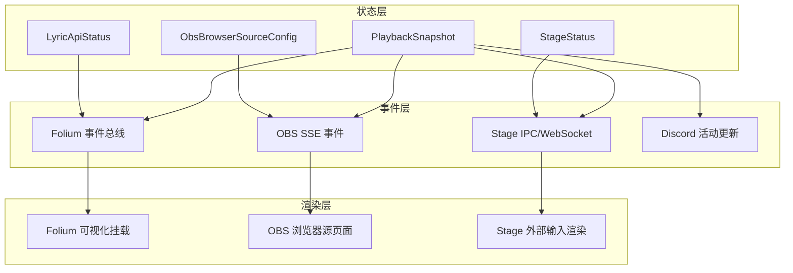

**图表来源**
- [src/types/appPlayback.ts:53-111](file://src/types/appPlayback.ts#L53-L111)
- [src/types/lyricApi.ts:4-10](file://src/types/lyricApi.ts#L4-L10)
- [src/types/obsBrowserSource.ts:29-129](file://src/types/obsBrowserSource.ts#L29-L129)
- [test/manual/stage-client/API_SCHEMA.md:45-74](file://test/manual/stage-client/API_SCHEMA.md#L45-L74)
- [docs/folium/api.md:523-641](file://docs/folium/api.md#L523-L641)
- [electron/main.cjs:4298-4333](file://electron/main.cjs#L4298-L4333)
- [electron/stageApi.cjs:550-591](file://electron/stageApi.cjs#L550-L591)
- [electron/discordPresence.cjs:228-264](file://electron/discordPresence.cjs#L228-L264)

## 详细组件分析

### Folium 模组 API
- 客户端入口 `activate(folium)` 提供注册表、事件、播放、UI、网络、存储、RPC、歌词与主题辅助函数。
- 注册表支持可视化模式、调参、命令、背景、舞台图层、设置分区、播放器面板标签、进度条按钮与样式注入。
- 宿主容器与上下文提供时钟、主题、设置、音频、显示参数与表面信息。
- 事件系统分为通知型与钩子型，支持优先级与取消/替换行为。
- 服务层提供播放控制、文件选择、图标、嵌入页面与网络访问。

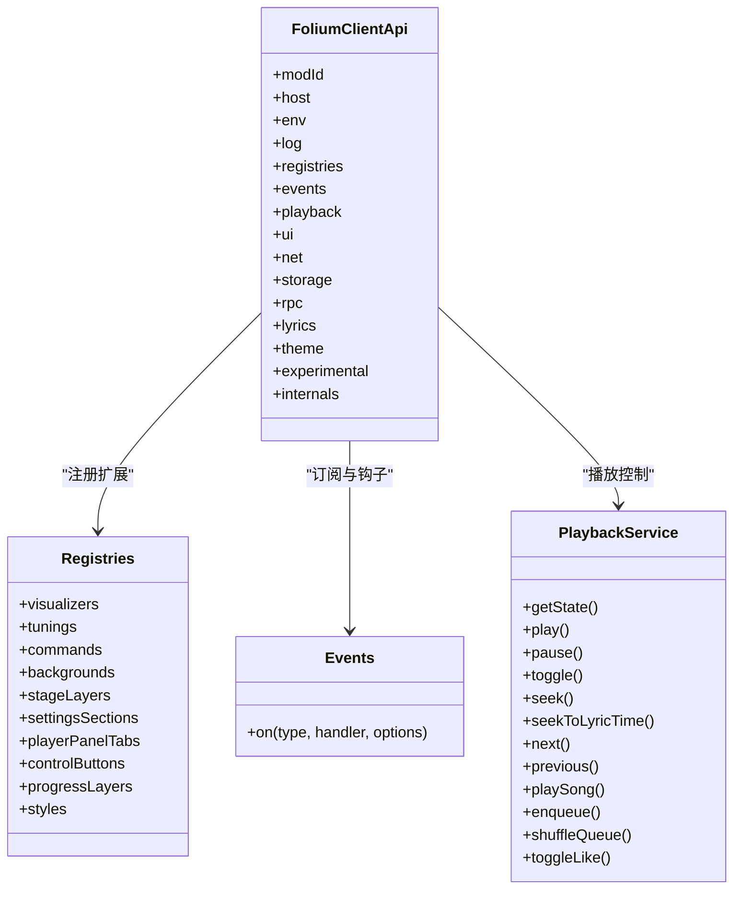

**图表来源**
- [docs/folium/api.md:77-99](file://docs/folium/api.md#L77-L99)
- [docs/folium/api.md:111-373](file://docs/folium/api.md#L111-L373)
- [docs/folium/api.md:523-641](file://docs/folium/api.md#L523-L641)
- [docs/folium/api.md:647-740](file://docs/folium/api.md#L647-L740)

**章节来源**
- [docs/folium/api.md:77-99](file://docs/folium/api.md#L77-L99)
- [docs/folium/api.md:111-373](file://docs/folium/api.md#L111-L373)
- [docs/folium/api.md:523-641](file://docs/folium/api.md#L523-L641)
- [docs/folium/api.md:647-740](file://docs/folium/api.md#L647-L740)

### Stage API 流程
- 客户端通过 `buildStageLyricsRequest` 构造歌词请求，携带标题、艺术家、专辑与歌词来源。
- 服务端将当前 Stage 输入切换为歌词模式，并返回统一状态对象。
- 主进程通过 IPC 通道与渲染层交互，完成外部播放请求、播放器控制与队列操作。

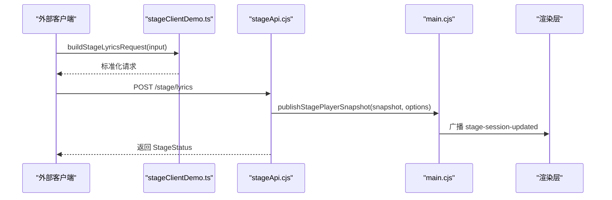

**图表来源**
- [src/utils/stageClientDemo.ts:270-294](file://src/utils/stageClientDemo.ts#L270-L294)
- [electron/stageApi.cjs:550-591](file://electron/stageApi.cjs#L550-L591)
- [electron/main.cjs:6369-6375](file://electron/main.cjs#L6369-L6375)
- [electron/preload.cjs:253-257](file://electron/preload.cjs#L253-L257)

**章节来源**
- [src/utils/stageClientDemo.ts:270-294](file://src/utils/stageClientDemo.ts#L270-L294)
- [electron/stageApi.cjs:550-591](file://electron/stageApi.cjs#L550-L591)
- [electron/main.cjs:6369-6375](file://electron/main.cjs#L6369-L6375)
- [electron/preload.cjs:253-257](file://electron/preload.cjs#L253-L257)

### OBS 浏览器源事件流
- 主进程启动本地 HTTP 服务，监听 `/obs` 路径，验证 token 后建立连接。
- 首次连接推送 config、clock、audio 三个初始事件。
- 后续变更通过 SSE 推送事件，OBS 页面消费并渲染。

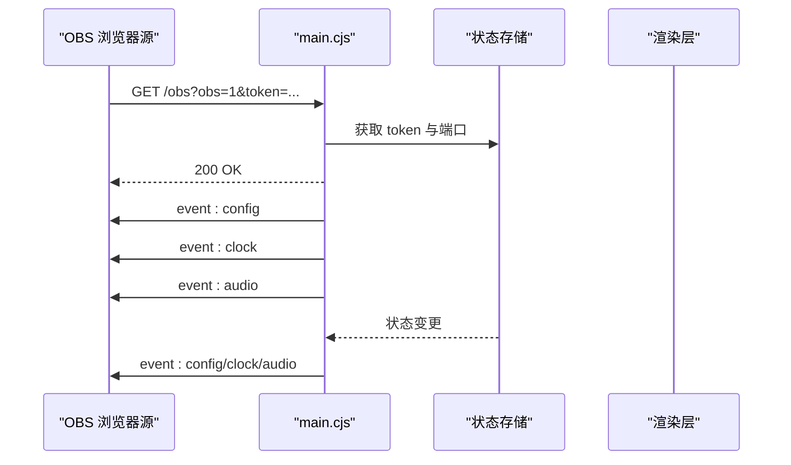

**图表来源**
- [electron/main.cjs:1945-1990](file://electron/main.cjs#L1945-L1990)
- [electron/main.cjs:4298-4333](file://electron/main.cjs#L4298-L4333)
- [src/types/obsBrowserSource.ts:103-129](file://src/types/obsBrowserSource.ts#L103-L129)

**章节来源**
- [electron/main.cjs:1945-1990](file://electron/main.cjs#L1945-L1990)
- [electron/main.cjs:4298-4333](file://electron/main.cjs#L4298-L4333)
- [src/types/obsBrowserSource.ts:103-129](file://src/types/obsBrowserSource.ts#L103-L129)

### Discord Rich Presence 更新流程
- 控制器根据播放快照构建活动，若活动为空则清除现有活动。
- 连接建立成功后周期性推送活动，避免频繁刷新。
- 连接断开或异常时更新状态并记录错误。

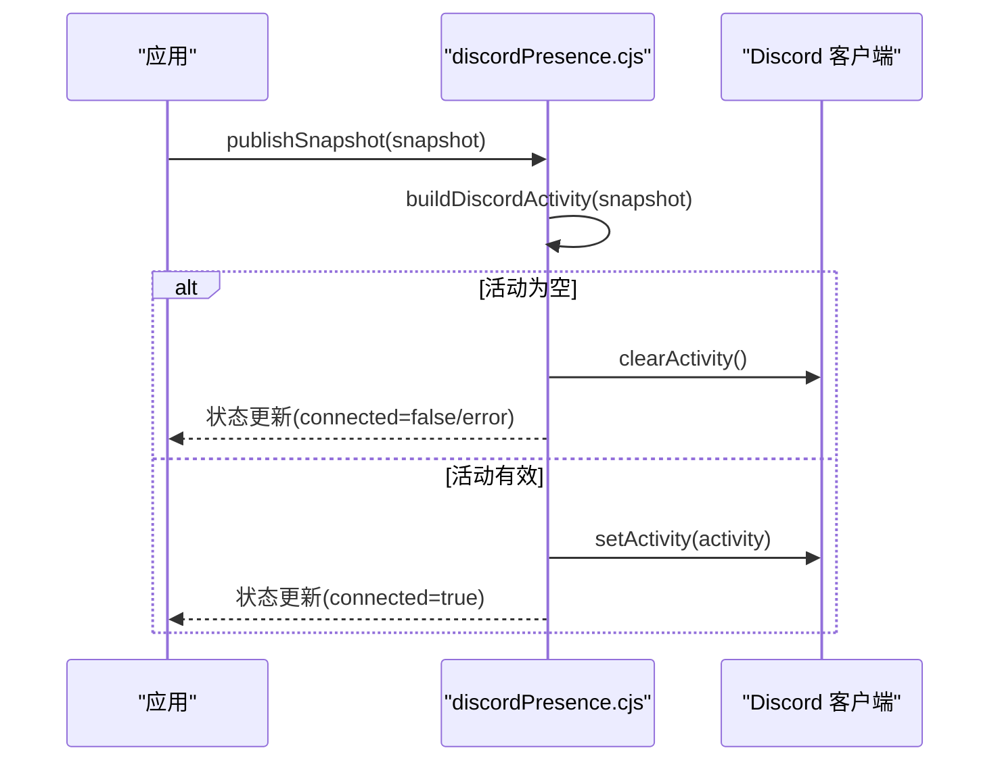

**图表来源**
- [electron/discordPresence.cjs:47-101](file://electron/discordPresence.cjs#L47-L101)
- [electron/discordPresence.cjs:228-264](file://electron/discordPresence.cjs#L228-L264)

**章节来源**
- [electron/discordPresence.cjs:47-101](file://electron/discordPresence.cjs#L47-L101)
- [electron/discordPresence.cjs:228-264](file://electron/discordPresence.cjs#L228-L264)

## 依赖关系分析
- Folium 模组依赖宿主提供的注册表、事件与服务；导出窗口限制部分能力。
- Stage API 依赖主进程 IPC 与渲染层状态同步。
- OBS 浏览器源依赖主进程 HTTP 服务与 SSE 推送。
- Discord Rich Presence 依赖本地 Discord 客户端与应用配置。

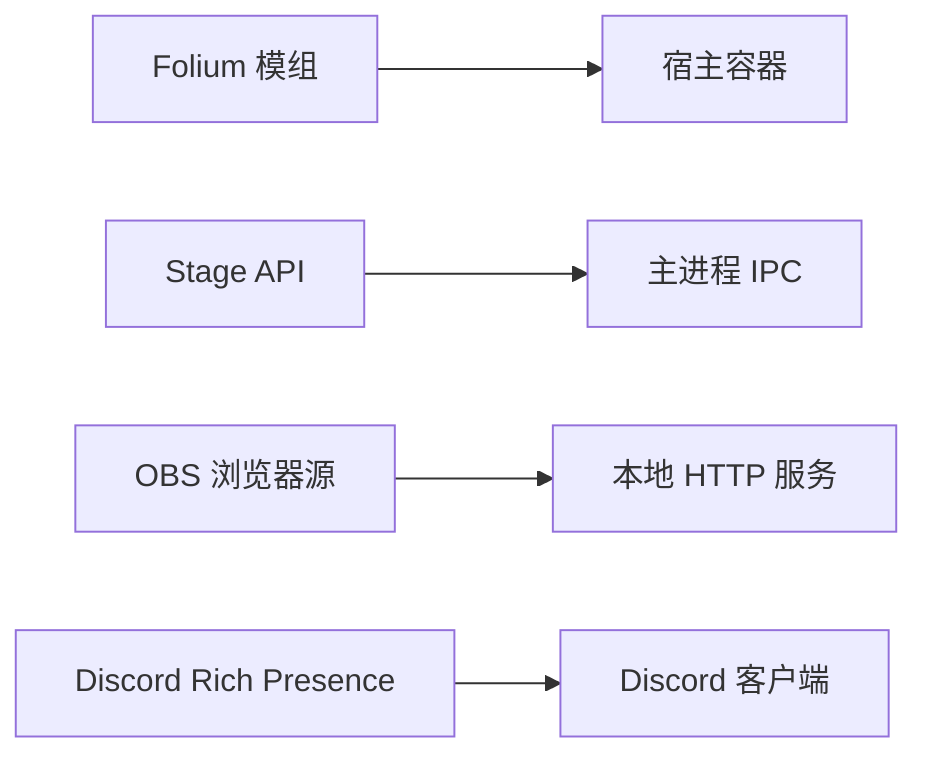

**图表来源**
- [docs/folium/api.md:47-99](file://docs/folium/api.md#L47-L99)
- [electron/stageApi.cjs:550-591](file://electron/stageApi.cjs#L550-L591)
- [electron/main.cjs:1945-1990](file://electron/main.cjs#L1945-L1990)
- [electron/discordPresence.cjs:103-141](file://electron/discordPresence.cjs#L103-L141)

**章节来源**
- [docs/folium/api.md:47-99](file://docs/folium/api.md#L47-L99)
- [electron/stageApi.cjs:550-591](file://electron/stageApi.cjs#L550-L591)
- [electron/main.cjs:1945-1990](file://electron/main.cjs#L1945-L1990)
- [electron/discordPresence.cjs:103-141](file://electron/discordPresence.cjs#L103-L141)

## 性能与稳定性考虑
- Folium 事件处理器每个处理器拥有独立错误边界；同步处理器超过 16ms 会记录警告。
- OBS 浏览器源事件序列化后批量推送，减少重复计算。
- Discord Rich Presence 存在更新间隔阈值，避免频繁调用 Discord IPC。
- Stage 播放器请求具备超时机制，防止阻塞。

**章节来源**
- [docs/folium/api.md:633-641](file://docs/folium/api.md#L633-L641)
- [electron/main.cjs:4316-4333](file://electron/main.cjs#L4316-L4333)
- [electron/discordPresence.cjs:1-3](file://electron/discordPresence.cjs#L1-L3)
- [electron/stageApi.cjs:1528-1546](file://electron/stageApi.cjs#L1528-L1546)

## 故障排查指南
- Stage 播放器请求超时：检查渲染层是否及时完成请求，确认 requestId 与通道匹配。
- OBS 浏览器源无法连接：确认 token 正确、端口可用、服务已启用。
- Discord Rich Presence 未更新：检查应用 ID 是否合法、Discord 客户端是否连接、活动是否为空。
- Folium 权限不足：确认模组清单声明了所需权限，导出窗口中部分服务不可用。

**章节来源**
- [electron/stageApi.cjs:1528-1546](file://electron/stageApi.cjs#L1528-L1546)
- [electron/main.cjs:1945-1990](file://electron/main.cjs#L1945-L1990)
- [electron/discordPresence.cjs:103-141](file://electron/discordPresence.cjs#L103-L141)
- [docs/folium/api.md:643-740](file://docs/folium/api.md#L643-L740)

## 结论
Folia Major 的 API 体系以 Folium 模组为核心扩展点，结合 Stage 外部输入、OBS 浏览器源与 Discord Rich Presence 形成完整的生态。通过清晰的数据类型定义、事件系统与错误处理机制，第三方开发者可以安全地集成与扩展播放体验。建议在开发过程中优先遵循契约文档，关注权限与上下文限制，并利用测试契约与构建工具快速验证集成效果。

## 附录：数据类型与常量
- 播放快照与窗口交接对象定义于 `src/types/appPlayback.ts`。
- 本地歌词服务状态定义于 `src/types/lyricApi.ts`。
- OBS 浏览器源配置、时钟、音频与事件定义于 `src/types/obsBrowserSource.ts`。
- Stage 公共对象与接口定义于 `test/manual/stage-client/API_SCHEMA.md`。
- Folium 版本与基础类型定义于 `docs/folium/api.md`。

**章节来源**
- [src/types/appPlayback.ts:53-111](file://src/types/appPlayback.ts#L53-L111)
- [src/types/lyricApi.ts:4-10](file://src/types/lyricApi.ts#L4-L10)
- [src/types/obsBrowserSource.ts:29-129](file://src/types/obsBrowserSource.ts#L29-L129)
- [test/manual/stage-client/API_SCHEMA.md:45-74](file://test/manual/stage-client/API_SCHEMA.md#L45-L74)
- [docs/folium/api.md:1-23](file://docs/folium/api.md#L1-L23)