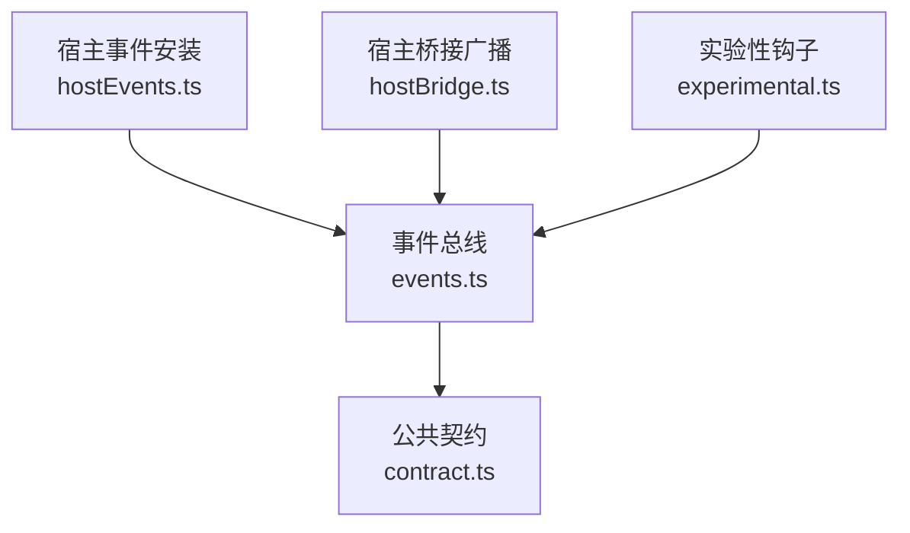
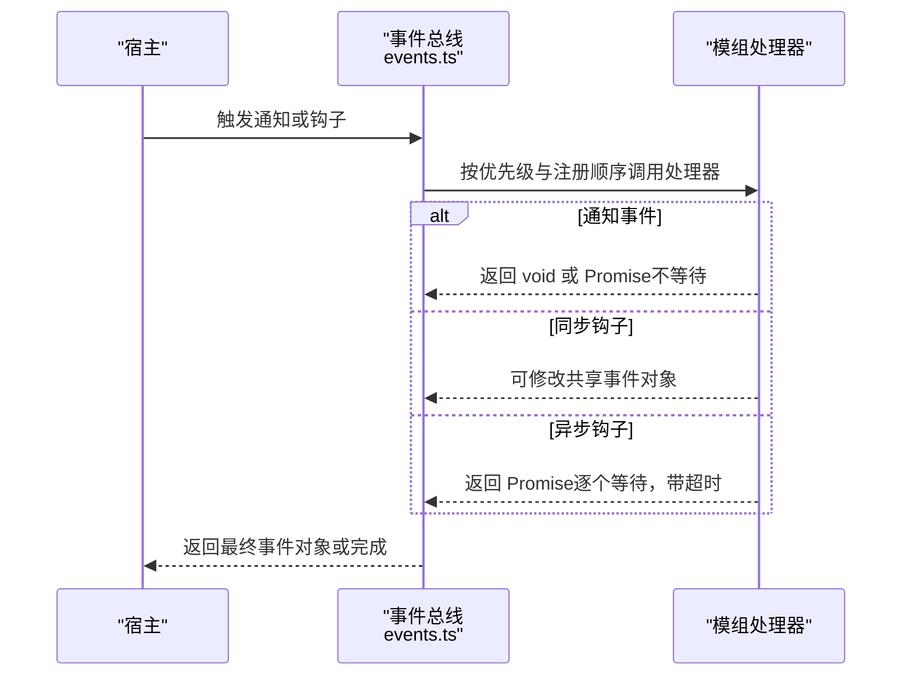
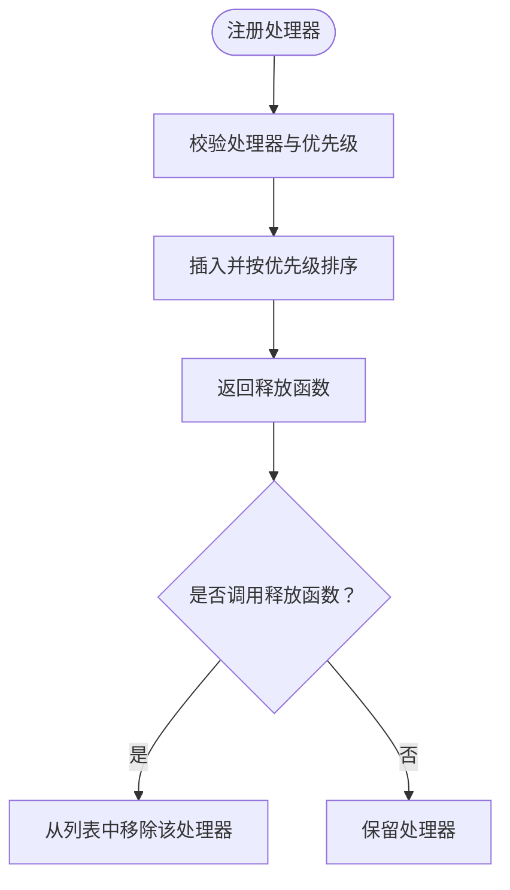
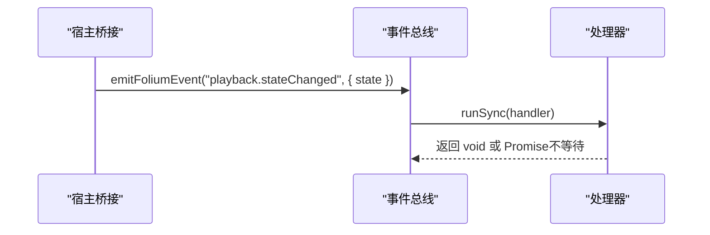
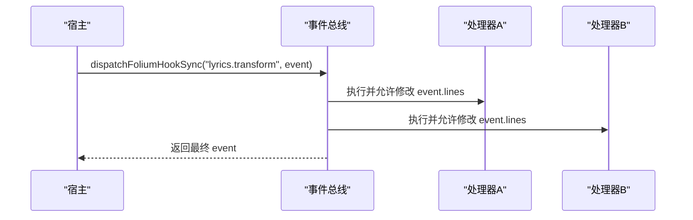
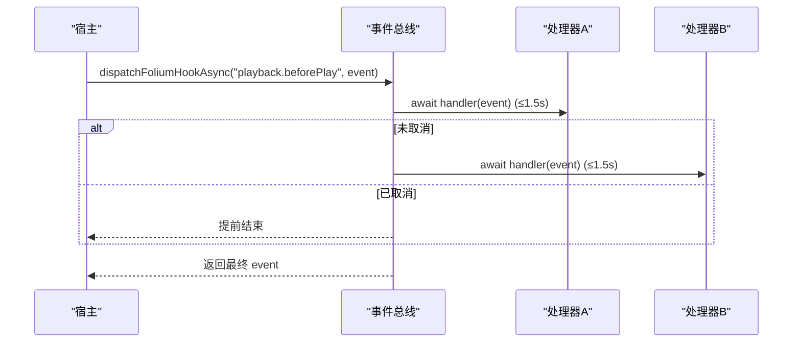
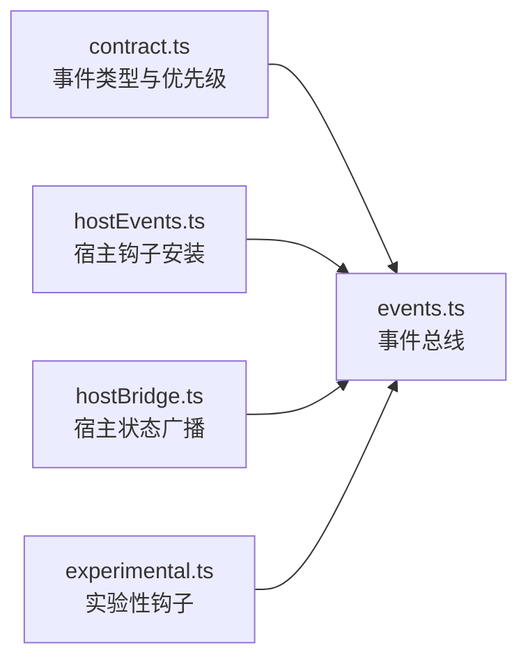

# 事件系统

<cite>
**本文引用的文件**   
- [events.ts](file://src/mods/folium/events.ts)
- [contract.ts](file://src/mods/folium/contract.ts)
- [hostEvents.ts](file://src/mods/folium/hostEvents.ts)
- [hostBridge.ts](file://src/mods/folium/hostBridge.ts)
- [experimental.ts](file://src/mods/folium/experimental.ts)
- [foliumEvents.test.ts](file://test/unit/mod-system/foliumEvents.test.ts)
- [foliumHostEvents.test.ts](file://test/unit/mod-system/foliumHostEvents.test.ts)
- [foliumSeekDetection.test.ts](file://test/unit/mod-system/foliumSeekDetection.test.ts)
</cite>

## 目录
1. [引言](#引言)
2. [项目结构](#项目结构)
3. [核心组件](#核心组件)
4. [架构总览](#架构总览)
5. [详细组件分析](#详细组件分析)
6. [依赖关系分析](#依赖关系分析)
7. [性能与异步模型](#性能与异步模型)
8. [事件类型与数据格式](#事件类型与数据格式)
9. [使用示例与最佳实践](#使用示例与最佳实践)
10. [故障排查](#故障排查)
11. [结论](#结论)

## 引言
本文件为 Folia Major 的 Folium 模组事件系统提供完整技术文档。内容覆盖事件类型定义、命名规范、触发时机、监听机制、优先级与生命周期管理、事件载荷结构、异步处理模型，以及内存泄漏防护、性能优化和调试技巧。读者可据此在模组开发中通过事件系统进行组件通信、扩展播放行为、改写歌词或拦截歌曲播放。

## 项目结构
Folium 事件系统位于 `src/mods/folium` 下，核心由“事件总线实现”“公共契约类型”“宿主桥接与钩子安装”“实验性钩子”四部分组成：

**图表来源**
- [events.ts:1-139](file://src/mods/folium/events.ts#L1-L139)
- [contract.ts:728-834](file://src/mods/folium/contract.ts#L728-L834)
- [hostEvents.ts:38-77](file://src/mods/folium/hostEvents.ts#L38-L77)
- [hostBridge.ts:140-160](file://src/mods/folium/hostBridge.ts#L140-L160)
- [experimental.ts:70-86](file://src/mods/folium/experimental.ts#L70-L86)

**章节来源**
- [events.ts:1-139](file://src/mods/folium/events.ts#L1-L139)
- [contract.ts:728-834](file://src/mods/folium/contract.ts#L728-L834)

## 核心组件
- 事件总线：负责处理器注册、排序、同步/异步分发、超时与错误隔离。
- 公共契约：定义所有事件类型、载荷结构与优先级枚举，是模组与宿主之间的稳定接口。
- 宿主事件安装：将宿主状态变化映射为事件通知，并安装歌词改写与播放前钩子。
- 宿主桥接：监听播放器状态、主题等变化，向外广播通知事件。
- 实验性钩子：在 Omni 在线歌词与音频源解析后触发可改写钩子。

**章节来源**
- [events.ts:18-139](file://src/mods/folium/events.ts#L18-L139)
- [contract.ts:728-834](file://src/mods/folium/contract.ts#L728-L834)
- [hostEvents.ts:38-100](file://src/mods/folium/hostEvents.ts#L38-L100)
- [hostBridge.ts:140-160](file://src/mods/folium/hostBridge.ts#L140-L160)
- [experimental.ts:70-86](file://src/mods/folium/experimental.ts#L70-L86)

## 架构总览
事件系统采用“通知 + 钩子”的双通道模型：

- 通知事件：只读、不可变载荷，按注册顺序调用处理器；不等待 Promise。
- 钩子事件：共享同一事件对象，处理器可修改；支持同步与异步两种模式，异步模式下每个处理器有超时保护。

**图表来源**
- [events.ts:92-139](file://src/mods/folium/events.ts#L92-L139)
- [hostEvents.ts:33-59](file://src/mods/folium/hostEvents.ts#L33-L59)

## 详细组件分析

### 事件总线与监听机制
- 处理器注册：通过 `addFoliumEventHandler` 添加处理器，返回一个释放函数用于移除单个处理器；也可通过 `removeFoliumEventHandlers` 按模组标识批量移除。
- 优先级：支持 `highest`、`high`、`normal`、`low`、`lowest`，同优先级保持注册顺序。
- 生命周期：处理器由注册它的模组拥有；模组卸载时统一清理，避免内存泄漏。
- 查询能力：可通过 `hasFoliumEventHandlers` 判断某类事件是否存在处理器。

**图表来源**
- [events.ts:43-74](file://src/mods/folium/events.ts#L43-L74)

**章节来源**
- [events.ts:43-74](file://src/mods/folium/events.ts#L43-L74)
- [foliumEvents.test.ts:56-75](file://test/unit/mod-system/foliumEvents.test.ts#L56-L75)

### 通知事件分发
- 方法：`emitFoliumEvent(type, payload)`。
- 语义：同步、fire-and-forget；载荷被冻结，处理器无法修改。
- 适用场景：播放状态变更、视图切换、主题变化等“事后通知”。

**图表来源**
- [events.ts:92-98](file://src/mods/folium/events.ts#L92-L98)
- [hostBridge.ts:140-160](file://src/mods/folium/hostBridge.ts#L140-L160)

**章节来源**
- [events.ts:92-98](file://src/mods/folium/events.ts#L92-L98)
- [hostBridge.ts:140-160](file://src/mods/folium/hostBridge.ts#L140-L160)

### 同步钩子分发
- 方法：`dispatchFoliumHookSync(type, event)`。
- 语义：处理器依次接收同一个事件对象，可修改；返回值不等待。
- 典型用途：歌词改写 `lyrics.transform`。

**图表来源**
- [events.ts:100-106](file://src/mods/folium/events.ts#L100-L106)
- [hostEvents.ts:33-33](file://src/mods/folium/hostEvents.ts#L33-L33)

**章节来源**
- [events.ts:100-106](file://src/mods/folium/events.ts#L100-L106)
- [hostEvents.ts:33-33](file://src/mods/folium/hostEvents.ts#L33-L33)

### 异步钩子分发
- 方法：`dispatchFoliumHookAsync(type, event, stop?)`。
- 语义：处理器串行等待；每个处理器最多运行 1.5 秒，超时会被记录并跳过后续等待；支持提前终止链（如取消）。
- 典型用途：播放前拦截 `playback.beforePlay`、Omni 歌词与音频源改写。

**图表来源**
- [events.ts:114-139](file://src/mods/folium/events.ts#L114-L139)
- [hostEvents.ts:43-62](file://src/mods/folium/hostEvents.ts#L43-L62)

**章节来源**
- [events.ts:114-139](file://src/mods/folium/events.ts#L114-L139)
- [hostEvents.ts:43-62](file://src/mods/folium/hostEvents.ts#L43-L62)
- [foliumEvents.test.ts:77-96](file://test/unit/mod-system/foliumEvents.test.ts#L77-L96)

### 宿主事件安装与触发点
- 歌词改写钩子：在歌词管线末尾注入 `lyrics.transform`，保证输入始终为未改写的原始歌词，不会叠加到自身输出。
- 播放前钩子：在歌曲开始播放前注入 `playback.beforePlay`，支持取消或替换歌曲。
- 通知广播：播放状态、歌曲切换、歌词就绪、视图切换、可视化模式切换、主题变化、点赞状态变化等，均通过 `emitFoliumEvent` 广播。

```mermaid
flowchart TD
A["歌词到达"] --> B["dispatchFoliumHookSync('lyrics.transform')"]
C["准备播放歌曲"] --> D["dispatchFoliumHookAsync('playback.beforePlay')"]
E["播放器状态变化"] --> F["emitFoliumEvent('playback.stateChanged')"]
G["歌曲切换"] --> H["emitFoliumEvent('playback.songChanged')"]
I["歌词就绪"] --> J["emitFoliumEvent('lyrics.loaded')"]
K["视图切换"] --> L["emitFoliumEvent('app.viewChanged')"]
M["可视化模式切换"] --> N["emitFoliumEvent('visualizer.modeChanged')"]
O["主题变化"] --> P["emitFoliumEvent('theme.changed')"]
Q["点赞状态变化"] --> R["emitFoliumEvent('playback.likeChanged')"]
```

**图表来源**
- [hostEvents.ts:33-100](file://src/mods/folium/hostEvents.ts#L33-L100)
- [hostBridge.ts:140-160](file://src/mods/folium/hostBridge.ts#L140-L160)

**章节来源**
- [hostEvents.ts:33-100](file://src/mods/folium/hostEvents.ts#L33-L100)
- [hostBridge.ts:140-160](file://src/mods/folium/hostBridge.ts#L140-L160)

### 实验性钩子
- 条件：需在模组清单声明 `experimental: ["omni.hooks"]`。
- 事件：
  - `omni.lyricsResolved`：在线歌曲歌词可用后，可改写行数组。
  - `omni.audioSourceResolved`：在线音频地址解析后，可替换 URL。

**章节来源**
- [contract.ts:787-818](file://src/mods/folium/contract.ts#L787-L818)
- [experimental.ts:70-86](file://src/mods/folium/experimental.ts#L70-L86)

## 依赖关系分析
- 事件总线依赖公共契约中的事件类型与优先级枚举。
- 宿主事件安装依赖事件总线提供的同步/异步钩子分发能力。
- 宿主桥接依赖事件总线进行通知广播。
- 实验性钩子依赖事件总线进行异步钩子分发。

**图表来源**
- [contract.ts:728-834](file://src/mods/folium/contract.ts#L728-L834)
- [events.ts:1-139](file://src/mods/folium/events.ts#L1-L139)
- [hostEvents.ts:33-100](file://src/mods/folium/hostEvents.ts#L33-L100)
- [hostBridge.ts:140-160](file://src/mods/folium/hostBridge.ts#L140-L160)
- [experimental.ts:70-86](file://src/mods/folium/experimental.ts#L70-L86)

**章节来源**
- [contract.ts:728-834](file://src/mods/folium/contract.ts#L728-L834)
- [events.ts:1-139](file://src/mods/folium/events.ts#L1-L139)
- [hostEvents.ts:33-100](file://src/mods/folium/hostEvents.ts#L33-L100)
- [hostBridge.ts:140-160](file://src/mods/folium/hostBridge.ts#L140-L160)
- [experimental.ts:70-86](file://src/mods/folium/experimental.ts#L70-L86)

## 性能与异步模型
- 同步预算：单个同步处理器超过 16ms 会发出警告日志，便于定位慢处理器。
- 异步超时：每个异步处理器最多等待 1.5 秒；超时会被记录并跳过后续等待，防止卡顿。
- 错误边界：每个处理器独立捕获异常，并通过统一报告机制上报问题，不影响其他处理器或宿主。
- 建议：
  - 避免在同步处理器中进行重计算或网络请求。
  - 在异步钩子中使用合理的超时与取消逻辑。
  - 及时释放处理器，避免内存泄漏。

**章节来源**
- [events.ts:26-29](file://src/mods/folium/events.ts#L26-L29)
- [events.ts:76-90](file://src/mods/folium/events.ts#L76-L90)
- [events.ts:114-139](file://src/mods/folium/events.ts#L114-L139)

## 事件类型与数据格式

### 事件分类与命名规范
- 通知事件（只读、不可变载荷）：
  - `playback.songChanged`：显示歌曲变更。
  - `playback.stateChanged`：播放状态变更（playing/paused/stopped）。
  - `playback.seeked`：用户或模组拖动进度条。
  - `lyrics.loaded`：歌词就绪（在歌词改写之后）。
  - `app.viewChanged`：应用视图切换（home/player）。
  - `visualizer.modeChanged`：歌词动画模式变更。
  - `theme.changed`：主题或昼夜模式变更。
  - `playback.likeChanged`：点赞状态变更。
- 钩子事件（可写、共享事件对象）：
  - `lyrics.transform`：同步改写歌词。
  - `playback.beforePlay`：异步拦截播放，支持取消或替换。
  - `omni.lyricsResolved`：实验性，改写在线歌词。
  - `omni.audioSourceResolved`：实验性，替换在线音频 URL。

命名遵循“领域.动作”风格，例如 `playback.*`、`lyrics.*`、`app.*`、`visualizer.*`、`theme.*`、`omni.*`。

**章节来源**
- [contract.ts:733-818](file://src/mods/folium/contract.ts#L733-L818)

### 事件载荷结构
- 通用字段：
  - `song`：当前歌曲 DTO，可能为 null。
  - `lines`：歌词行数组，仅在歌词相关事件中有效。
  - `state`：播放状态枚举。
  - `position`：播放位置（秒）。
  - `view`：视图名称。
  - `mode`：可视化模式 ID。
  - `theme`：主题 DTO。
  - `liked`：点赞布尔值。
  - `url`：音频 URL（仅 Omni 音频源事件）。
  - `isPureMusic`：是否为纯音乐（仅 Omni 歌词事件）。
- 必需字段与可选参数：
  - 各事件的必需字段见对应接口定义；可选字段以 `?` 标注。
  - 对于歌词行，`renderHints` 由宿主根据时间重新计算，不应由处理器直接赋值。

**章节来源**
- [contract.ts:201-243](file://src/mods/folium/contract.ts#L201-L243)
- [contract.ts:733-818](file://src/mods/folium/contract.ts#L733-L818)

### 优先级与生命周期
- 优先级枚举：`highest`、`high`、`normal`、`low`、`lowest`。
- 生命周期：
  - 注册：`addFoliumEventHandler(modId, type, handler, priority)`。
  - 单处理器释放：返回的释放函数。
  - 模组级释放：`removeFoliumEventHandlers(modId)`。
  - 存在性检查：`hasFoliumEventHandlers(type)`。

**章节来源**
- [contract.ts:730-731](file://src/mods/folium/contract.ts#L730-L731)
- [events.ts:43-74](file://src/mods/folium/events.ts#L43-L74)

## 使用示例与最佳实践

### 在模组中订阅事件
- 订阅通知事件：
  - 使用 `folium.events.on('playback.stateChanged', handler)`。
  - 在 React 组件中，于挂载时订阅，卸载时调用返回的释放函数。
- 订阅钩子事件：
  - 使用 `folium.events.on('lyrics.transform', handler)` 或 `folium.events.on('playback.beforePlay', handler)`。
  - 注意钩子事件可修改共享事件对象，需遵循不可变原则与幂等性要求。

**章节来源**
- [contract.ts:823-834](file://src/mods/folium/contract.ts#L823-L834)

### 组件通信示例
- 播放状态驱动 UI：
  - 订阅 `playback.stateChanged`，更新按钮文本与图标。
- 歌词渲染增强：
  - 订阅 `lyrics.transform`，对 `event.lines` 追加自定义行或高亮标记。
- 播放前拦截：
  - 订阅 `playback.beforePlay`，根据业务规则调用 `event.cancel()` 或 `event.replaceWith(song)`。

**章节来源**
- [hostEvents.ts:33-62](file://src/mods/folium/hostEvents.ts#L33-L62)
- [foliumHostEvents.test.ts:91-111](file://test/unit/mod-system/foliumHostEvents.test.ts#L91-L111)

### 最佳实践
- 内存泄漏防护：
  - 始终保存并调用释放函数；或在模组卸载时调用 `removeFoliumEventHandlers(modId)`。
- 性能优化：
  - 同步处理器控制在 16ms 内；复杂逻辑放入异步钩子或后台任务。
  - 避免在高频事件（如 `playback.seeked`）中执行昂贵操作。
- 调试技巧：
  - 关注控制台警告与统一问题报告，定位慢处理器与超时。
  - 使用 `hasFoliumEventHandlers` 辅助诊断事件是否被订阅。

**章节来源**
- [events.ts:26-29](file://src/mods/folium/events.ts#L26-L29)
- [events.ts:76-90](file://src/mods/folium/events.ts#L76-L90)
- [events.ts:114-139](file://src/mods/folium/events.ts#L114-L139)

## 故障排查
- 常见问题：
  - 处理器未触发：检查事件类型是否正确、是否已订阅、是否存在处理器。
  - 处理器抛出异常：查看统一问题报告，确认是否被错误边界捕获。
  - 异步钩子超时：检查处理器耗时，必要时拆分逻辑或使用取消信号。
  - 歌词改写无效：确保改写的是新数组，且行对象符合 `FoliumLine` 结构。
- 定位步骤：
  - 使用 `hasFoliumEventHandlers` 验证订阅。
  - 观察控制台警告与问题报告，定位慢处理器与超时。
  - 在测试用例中模拟事件流，验证处理器行为。

**章节来源**
- [events.ts:76-90](file://src/mods/folium/events.ts#L76-L90)
- [events.ts:114-139](file://src/mods/folium/events.ts#L114-L139)
- [foliumEvents.test.ts:77-102](file://test/unit/mod-system/foliumEvents.test.ts#L77-L102)
- [foliumSeekDetection.test.ts:29-68](file://test/unit/mod-system/foliumSeekDetection.test.ts#L29-L68)

## 结论
Folium 事件系统通过“通知 + 钩子”双通道模型，为模组提供了稳定、可扩展的组件通信机制。其严格的类型契约、优先级控制、异步超时与错误边界，确保了宿主与模组之间的解耦与健壮性。开发者应遵循命名规范、载荷结构与生命周期管理，结合性能与调试建议，构建高质量的模组功能。