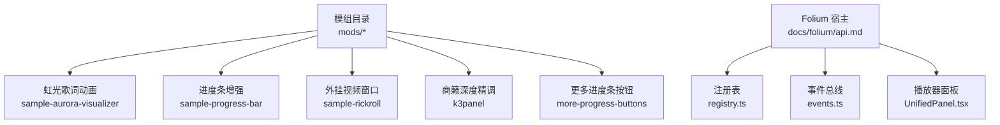
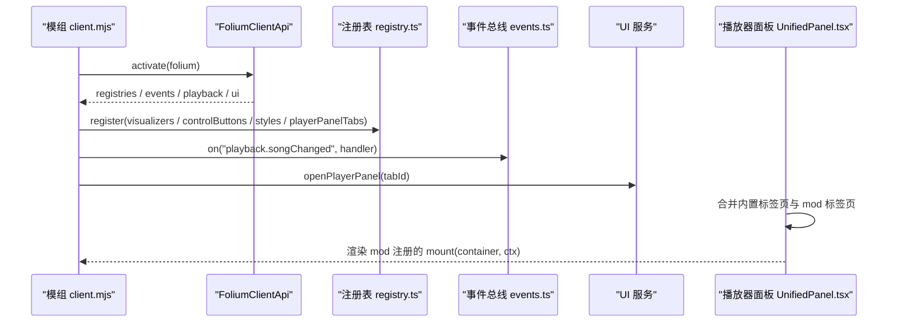
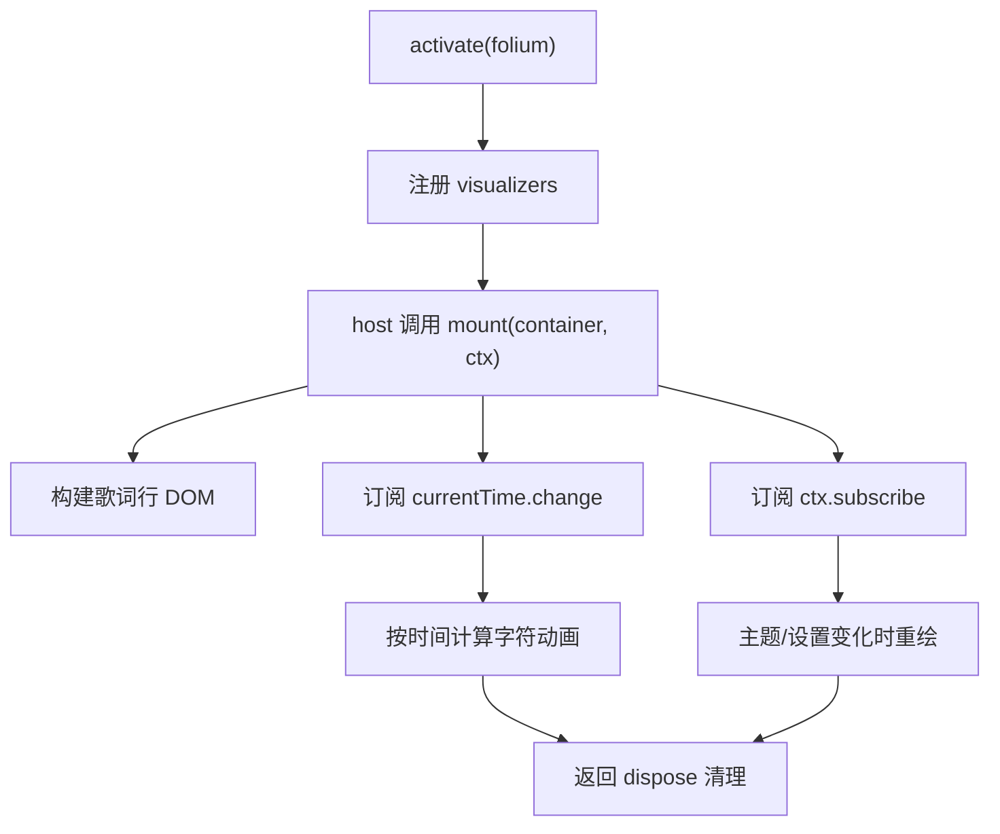
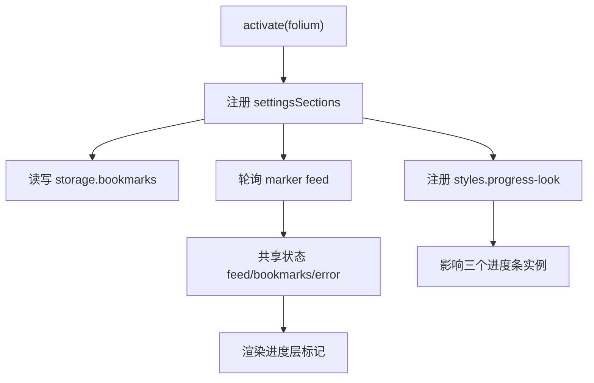
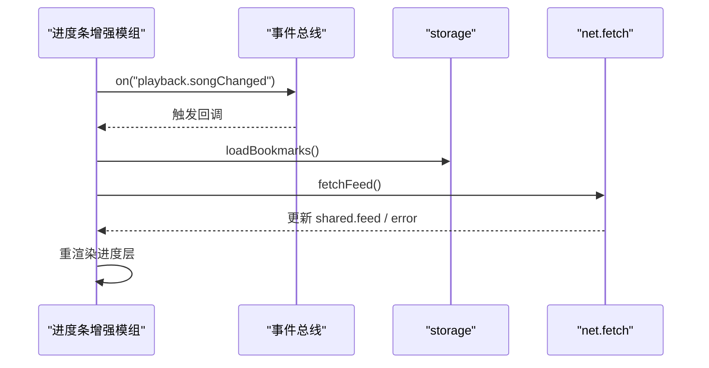
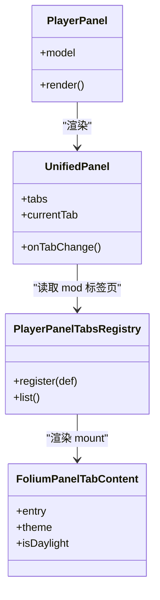
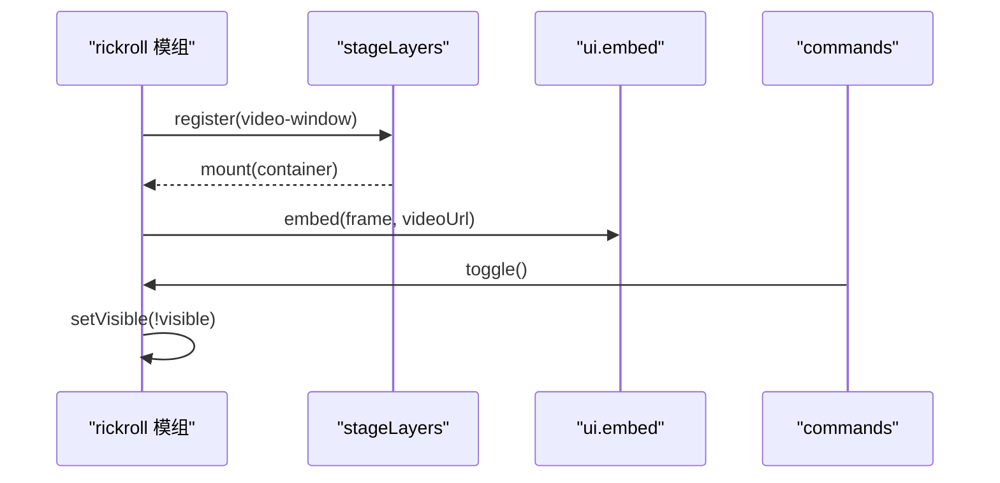
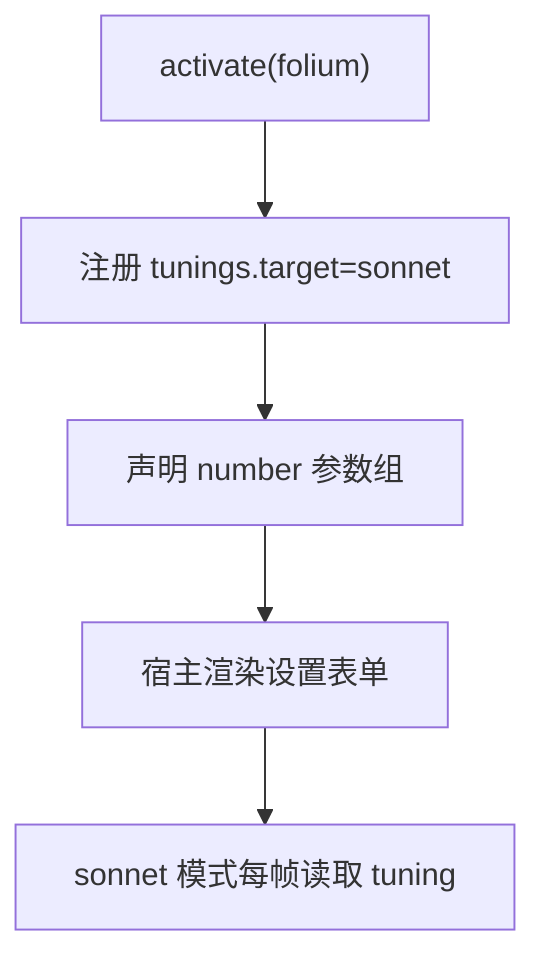
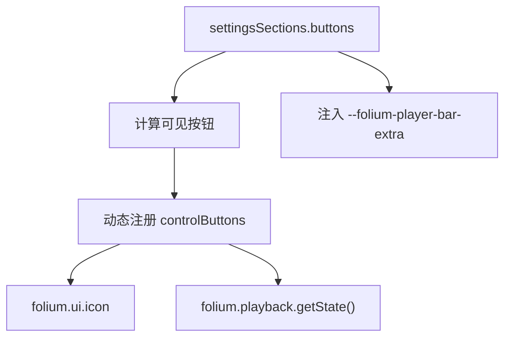
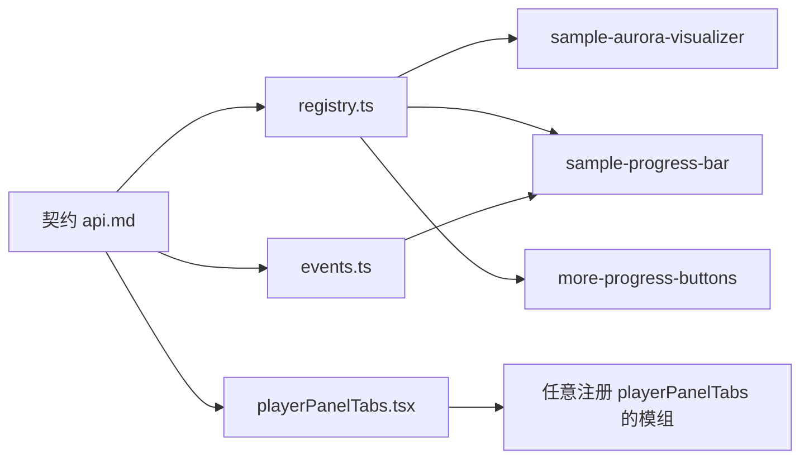

# 使用示例

<cite>
**本文引用的文件**   
- [Folium API 参考](file://docs/folium/api.md)
- [Folium 事件总线实现](file://src/mods/folium/events.ts)
- [Folium 注册表核心实现](file://src/mods/folium/registry.ts)
- [播放器面板标签页注册表](file://src/mods/folium/registries/playerPanelTabs.tsx)
- [播放器面板入口组件](file://src/components/app/PlayerPanel.tsx)
- [统一播放器面板容器](file://src/components/UnifiedPanel.tsx)
- [播放器面板快捷键钩子](file://src/hooks/usePlayerPanelTabShortcut.ts)
- [虹光歌词动画示例模组](file://mods/sample-aurora-visualizer/client.mjs)
- [进度条增强示例模组](file://mods/sample-progress-bar/client.mjs)
- [外挂视频窗口示例模组](file://mods/sample-rickroll/client.mjs)
- [商籁深度精调示例模组](file://mods/k3panel/client.mjs)
- [更多进度条按钮示例模组](file://mods/more-progress-buttons/client.mjs)
</cite>

## 目录
1. [引言](#引言)
2. [项目结构](#项目结构)
3. [核心组件](#核心组件)
4. [架构总览](#架构总览)
5. [详细示例与代码级分析](#详细示例与代码级分析)
6. [依赖关系分析](#依赖关系分析)
7. [性能与可维护性建议](#性能与可维护性建议)
8. [常见问题排查](#常见问题排查)
9. [结论](#结论)

## 引言
本文面向 Folia Major 的 Folium 模组开发者，目标是提供一套“可直接对照仓库源码”的使用示例库。内容覆盖：
- 基础模组创建、注册表使用、事件监听与状态管理
- 可视化效果开发：歌词动画、3D 场景思路、动画节奏与性能优化
- 播放器面板扩展：自定义标签页、控件添加、用户交互处理
- 主题与外观定制：颜色方案、布局调整、样式覆盖
- 常见问题与最佳实践

所有示例都基于仓库中已有的模组和文档，不凭空构造接口；需要运行或复用时，请从对应示例模组的 `client.mjs` 入手，并配合 [Folium API 参考](file://docs/folium/api.md) 中的契约类型进行扩展。

## 项目结构
Folium 模组通常以 ESM 模块形式存在，宿主通过 `folia-mod://` 加载。一个最小可用模组包含：
- `mod.json`：模组清单（id、名称、权限、入口等）
- `client.mjs`：渲染端入口，导出 `activate(folium)`
- 可选 `main.cjs` / `index.cjs`：主进程能力（RPC、导出、文件系统）

仓库中的示例模组集中在 `mods/` 下，例如：
- `sample-aurora-visualizer`：歌词动画模式
- `sample-progress-bar`：进度条按钮、进度层、样式注入、设置分区
- `sample-rickroll`：播放器页面舞台层 + 外部页面嵌入
- `k3panel`：对内置视觉模式的参数微调
- `more-progress-buttons`：多按钮、动态注册、主题变量控制宽度

**图表来源**
- [Folium API 参考:1-24](file://docs/folium/api.md#L1-L24)
- [Folium 注册表核心实现:1-10](file://src/mods/folium/registry.ts#L1-L10)
- [Folium 事件总线实现:1-17](file://src/mods/folium/events.ts#L1-L17)
- [统一播放器面板容器:268-301](file://src/components/UnifiedPanel.tsx#L268-L301)

**章节来源**
- [Folium API 参考:1-24](file://docs/folium/api.md#L1-L24)

## 核心组件
本节把 Folium 模组开发拆成五个关键维度，并用仓库中的实际文件说明它们如何协作。

| 维度 | 核心概念 | 主要文件 | 典型用法 |
|---|---|---|---|
| 模组入口 | `activate(folium)` | 各示例 `client.mjs` | 获取 `folium.registries`、`folium.events`、`folium.playback`、`folium.ui` |
| 注册表 | `register(def)` 返回句柄 | `registry.ts`、各 `registries/*` | 注册视觉模式、设置分区、进度按钮、样式、面板标签页 |
| 事件系统 | 通知与钩子 | `events.ts`、`contract.ts` | 订阅播放、歌词、主题、视图变化；改写歌词或拦截播放 |
| 播放器面板 | 标签页挂载点 | `playerPanelTabs.tsx`、`UnifiedPanel.tsx` | 注册面板标签页并通过 `openPlayerPanel(id)` 打开 |
| 主题与外观 | 主题对象、CSS 变量、样式注入 | `api.md`、`appearanceCodec.ts`、示例 CSS | 读取主题、注入 `@layer folium-mods` 下的稳定目标样式 |

**章节来源**
- [Folium API 参考:25-109](file://docs/folium/api.md#L25-L109)
- [Folium 注册表核心实现:10-43](file://src/mods/folium/registry.ts#L10-L43)
- [Folium 事件总线实现:18-65](file://src/mods/folium/events.ts#L18-L65)
- [播放器面板标签页注册表:10-24](file://src/mods/folium/registries/playerPanelTabs.tsx#L10-L24)

## 架构总览
Folium 的运行时可以理解为“宿主提供能力，模组声明行为”。

**图表来源**
- [Folium API 参考:77-99](file://docs/folium/api.md#L77-L99)
- [Folium 注册表核心实现:45-103](file://src/mods/folium/registry.ts#L45-L103)
- [Folium 事件总线实现:43-65](file://src/mods/folium/events.ts#L43-L65)
- [统一播放器面板容器:268-301](file://src/components/UnifiedPanel.tsx#L268-L301)

## 详细示例与代码级分析

### 示例一：创建一个基础歌词动画模组
适用目标：学习 Folium 模组的最小生命周期、歌词数据访问、时钟订阅、主题与字体解析。

推荐对照文件：
- [虹光歌词动画示例模组](file://mods/sample-aurora-visualizer/client.mjs)
- [Folium API 参考：FoliumVisualizerDef、FoliumStageContext、FoliumMount:115-129](file://docs/folium/api.md#L115-L129)

要点说明：
- 模组默认导出 `activate(folium)`，在激活时调用 `folium.registries.visualizers.register(...)`。
- `mount(container, ctx)` 负责一次性构建 DOM，并在每帧根据 `ctx.currentTime` 更新样式。
- 歌词行来自 `ctx.lines`，当前行索引通过 `ctx.getLineIndex()` 读取；静态预览时使用 `staticMode` 与 `staticLineIndex`。
- 主题与字体通过 `ctx.getTheme()`、`ctx.getDisplay().lyricsFontScale` 以及 `folium.theme.resolveFontStack`、`resolveFontWeight` 获取，保证与内置模式一致。
- 必须返回清理函数，取消时间订阅、变更订阅并移除 DOM。

**图表来源**
- [虹光歌词动画示例模组:61-118](file://mods/sample-aurora-visualizer/client.mjs#L61-L118)
- [Folium API 参考:379-390](file://docs/folium/api.md#L379-L390)

**章节来源**
- [虹光歌词动画示例模组:1-128](file://mods/sample-aurora-visualizer/client.mjs#L1-L128)
- [Folium API 参考:115-129](file://docs/folium/api.md#L115-L129)
- [Folium API 参考:494-521](file://docs/folium/api.md#L494-L521)

### 示例二：使用注册表与设置分区
适用目标：学习设置分区、持久化值、动态样式注入、外部数据轮询。

推荐对照文件：
- [进度条增强示例模组](file://mods/sample-progress-bar/client.mjs)
- [Folium API 参考：FoliumSettingsSectionDef、FoliumParam、FoliumStyleDef:227-240](file://docs/folium/api.md#L227-L240)

要点说明：
- 使用 `folium.registries.settingsSections.register` 定义一组设置字段，包括文本、数字、布尔值。
- 设置值通过 `settings.params.get()` 读取，通过 `settings.params.set()` 写入，并通过 `subscribe` 响应变化。
- 使用 `folium.registries.styles.register` 注入 CSS，并通过开关动态启用或注销样式。
- 使用 `folium.storage` 保存每个歌曲的书签位置，随歌曲切换重新加载。
- 使用 `folium.net.fetch` 拉取标记数据，支持 URL 模板替换 `{songId}`、`{title}`、`{artist}`。

**图表来源**
- [进度条增强示例模组:72-103](file://mods/sample-progress-bar/client.mjs#L72-L103)
- [进度条增强示例模组:159-169](file://mods/sample-progress-bar/client.mjs#L159-L169)
- [进度条增强示例模组:171-196](file://mods/sample-progress-bar/client.mjs#L171-L196)
- [进度条增强示例模组:198-253](file://mods/sample-progress-bar/client.mjs#L198-L253)

**章节来源**
- [进度条增强示例模组:1-275](file://mods/sample-progress-bar/client.mjs#L1-L275)
- [Folium API 参考:227-240](file://docs/folium/api.md#L227-L240)
- [Folium API 参考:305-315](file://docs/folium/api.md#L305-L315)
- [Folium API 参考:46-58](file://docs/folium/api.md#L46-L58)
- [Folium API 参考:732-740](file://docs/folium/api.md#L732-L740)

### 示例三：事件监听与状态管理
适用目标：学习订阅播放、歌词、主题、视图变化，以及异步钩子与优先级。

推荐对照文件：
- [进度条增强示例模组](file://mods/sample-progress-bar/client.mjs)
- [Folium 事件总线实现](file://src/mods/folium/events.ts)
- [Folium API 参考：FoliumEventMap、FoliumEvents:523-641](file://docs/folium/api.md#L523-L641)

要点说明：
- 使用 `folium.events.on(type, handler)` 订阅通知类事件，如 `playback.songChanged`、`theme.changed`、`app.viewChanged`。
- 事件处理器有优先级：`highest`、`high`、`normal`、`low`、`lowest`；同优先级按注册顺序执行。
- 同步处理器超过预算会记录警告；异步钩子有超时保护，避免阻塞播放。
- 示例模组在歌曲变化时重新加载书签和标记数据，体现“事件驱动的状态刷新”。

**图表来源**
- [进度条增强示例模组:255-266](file://mods/sample-progress-bar/client.mjs#L255-L266)
- [Folium 事件总线实现:43-65](file://src/mods/folium/events.ts#L43-L65)
- [Folium 事件总线实现:92-138](file://src/mods/folium/events.ts#L92-L138)

**章节来源**
- [进度条增强示例模组:255-275](file://mods/sample-progress-bar/client.mjs#L255-L275)
- [Folium 事件总线实现:1-138](file://src/mods/folium/events.ts#L1-L138)
- [Folium API 参考:523-641](file://docs/folium/api.md#L523-L641)

### 示例四：播放器面板扩展与自定义标签页
适用目标：学习注册面板标签页、打开指定标签页、与宿主面板容器集成。

推荐对照文件：
- [播放器面板标签页注册表](file://src/mods/folium/registries/playerPanelTabs.tsx)
- [统一播放器面板容器](file://src/components/UnifiedPanel.tsx)
- [播放器面板入口组件](file://src/components/app/PlayerPanel.tsx)
- [Folium API 参考：FoliumPlayerPanelTabDef、FoliumPanelContext:242-253](file://docs/folium/api.md#L242-L253)

要点说明：
- 模组通过 `folium.registries.playerPanelTabs.register({ id, label, order, mount })` 注册标签页。
- 宿主在 `UnifiedPanel.tsx` 中合并内置标签页与 `folium:` 前缀的 mod 标签页。
- 当标签页被选中时，宿主通过 `FoliumMountHost` 调用 `mount(container, ctx)`，传入面板上下文。
- 可通过 `folium.ui.openPlayerPanel(tabId)` 直接打开某个 mod 标签页。

**图表来源**
- [播放器面板入口组件:1-18](file://src/components/app/PlayerPanel.tsx#L1-L18)
- [统一播放器面板容器:268-301](file://src/components/UnifiedPanel.tsx#L268-L301)
- [播放器面板标签页注册表:17-24](file://src/mods/folium/registries/playerPanelTabs.tsx#L17-L24)
- [播放器面板标签页注册表:63-93](file://src/mods/folium/registries/playerPanelTabs.tsx#L63-L93)

**章节来源**
- [播放器面板标签页注册表:1-93](file://src/mods/folium/registries/playerPanelTabs.tsx#L1-L93)
- [统一播放器面板容器:268-301](file://src/components/UnifiedPanel.tsx#L268-L301)
- [播放器面板入口组件:1-18](file://src/components/app/PlayerPanel.tsx#L1-L18)
- [Folium API 参考:242-253](file://docs/folium/api.md#L242-L253)

### 示例五：舞台层与外部页面嵌入
适用目标：学习在播放器页面插入浮窗、控制点击穿透、使用命令开关界面。

推荐对照文件：
- [外挂视频窗口示例模组](file://mods/sample-rickroll/client.mjs)
- [Folium API 参考：FoliumStageLayerDef、FoliumCommandDef、FoliumUiService.embed:212-225](file://docs/folium/api.md#L212-L225)

要点说明：
- 使用 `folium.registries.stageLayers.register` 将浮窗放在 `player.stage.front`。
- 层本身是点击穿透的，只有浮窗元素设置 `pointer-events:auto` 接收鼠标。
- 使用 `folium.ui.embed` 安全嵌入外部页面，需要在清单中配置允许的来源。
- 使用 `folium.registries.commands.register` 暴露命令，用于显示或隐藏浮窗。

**图表来源**
- [外挂视频窗口示例模组:23-58](file://mods/sample-rickroll/client.mjs#L23-L58)
- [外挂视频窗口示例模组:60-68](file://mods/sample-rickroll/client.mjs#L60-L68)

**章节来源**
- [外挂视频窗口示例模组:1-70](file://mods/sample-rickroll/client.mjs#L1-L70)
- [Folium API 参考:201-225](file://docs/folium/api.md#L201-L225)

### 示例六：对内置视觉模式做深度参数调节
适用目标：学习使用 tunings 扩展内置模式，而不写 Node 代码。

推荐对照文件：
- [商籁深度精调示例模组](file://mods/k3panel/client.mjs)
- [Folium API 参考：FoliumTuningDef、FoliumParam:131-143](file://docs/folium/api.md#L131-L143)

要点说明：
- 通过 `folium.registries.tunings.register` 为内置模式 `sonnet` 增加数值型参数。
- 参数键名必须与内置模式声明的可调参白名单匹配。
- 宿主会在模式下拉框下方渲染表单，并持久化这些值。

**图表来源**
- [商籁深度精调示例模组:27-42](file://mods/k3panel/client.mjs#L27-L42)

**章节来源**
- [商籁深度精调示例模组:1-44](file://mods/k3panel/client.mjs#L1-L44)
- [Folium API 参考:131-143](file://docs/folium/api.md#L131-L143)

### 示例七：动态注册进度条按钮与主题变量
适用目标：学习根据设置动态注册/注销按钮、使用图标、监听喜爱状态、通过 CSS 变量调整布局。

推荐对照文件：
- [更多进度条按钮示例模组](file://mods/more-progress-buttons/client.mjs)
- [Folium API 参考：FoliumControlButtonDef、FoliumProgressContext、FoliumPlaybackService:270-303](file://docs/folium/api.md#L270-L303)

要点说明：
- 按钮通过 `folium.registries.controlButtons.register` 注册到 `progress.leading` 或 `progress.trailing`。
- 使用 `folium.ui.icon` 获取宿主图标，避免自带 SVG 资源。
- 使用 `folium.playback.getState()` 读取 `liked`、`canLike`，并订阅 `playback.likeChanged`、`playback.songChanged`、`playback.stateChanged`。
- 通过 `folium.registries.styles.register` 注入 `--folium-player-bar-extra`，让悬浮胶囊宽度补偿按钮占用的空间。

**图表来源**
- [更多进度条按钮示例模组:44-60](file://mods/more-progress-buttons/client.mjs#L44-L60)
- [更多进度条按钮示例模组:74-120](file://mods/more-progress-buttons/client.mjs#L74-L120)
- [更多进度条按钮示例模组:122-153](file://mods/more-progress-buttons/client.mjs#L122-L153)

**章节来源**
- [更多进度条按钮示例模组:1-155](file://mods/more-progress-buttons/client.mjs#L1-L155)
- [Folium API 参考:270-303](file://docs/folium/api.md#L270-L303)

## 依赖关系分析
Folium 的核心依赖可以分为三层：

1. **契约层**：`docs/folium/api.md` 描述模组能使用的公开类型与服务。
2. **宿主实现层**：`registry.ts`、`events.ts`、`playerPanelTabs.tsx` 等提供注册表、事件总线、面板标签页挂载逻辑。
3. **模组层**：`mods/*` 中的示例模组消费上述能力，组合出可视化、UI 扩展、主题样式等行为。

**图表来源**
- [Folium API 参考:1-24](file://docs/folium/api.md#L1-L24)
- [Folium 注册表核心实现:1-10](file://src/mods/folium/registry.ts#L1-L10)
- [Folium 事件总线实现:1-17](file://src/mods/folium/events.ts#L1-L17)
- [播放器面板标签页注册表:1-24](file://src/mods/folium/registries/playerPanelTabs.tsx#L1-L24)

**章节来源**
- [Folium 注册表核心实现:45-103](file://src/mods/folium/registry.ts#L45-L103)
- [Folium 事件总线实现:43-65](file://src/mods/folium/events.ts#L43-L65)

## 性能与可维护性建议
结合示例与宿主实现，可以总结以下实践：

- **避免在事件处理器中做昂贵计算**  
  事件总线会对同步处理器超过预算的情况发出警告，因此复杂逻辑应拆分到轻量回调中，或使用节流、防抖。
- **正确订阅与清理**  
  所有 `currentTime.on`、`ctx.subscribe`、`events.on` 都应返回 disposer，并在卸载时调用，防止内存泄漏。
- **只修改宿主提供的稳定目标**  
  样式注入应使用 `@layer folium-mods` 和宿主公开属性选择器，不要依赖内部 DOM 结构。
- **使用注册表句柄管理生命周期**  
  动态注册样式、按钮、标签页时，保留 `handle.unregister()`，并根据设置开关增删条目。
- **优先使用共享工具**  
  歌词分割、关键词着色、字体栈解析应使用 `folium.lyrics` 与 `folium.theme`，保证与内置模式一致。
- **谨慎使用实验接口**  
  实验接口需要显式启用，且 minor 版本可能变化；生产模组应做版本探测与降级。

[本节为通用指导，不直接分析具体文件]

## 常见问题排查
| 问题 | 可能原因 | 排查建议 |
|---|---|---|
| 注册时报重复 id | 同一模组内重复注册相同本地 id | 检查 `def.id`，确保唯一；不同模组可使用相同本地 id |
| 样式没有生效 | 使用了非公开 DOM 节点或未注入到 `@layer folium-mods` | 改用宿主公开属性选择器，并通过 `styles.register` 注入 |
| 事件处理器不执行 | 未正确订阅或已提前清理 | 检查 `events.on` 返回值是否被释放，确认事件类型拼写 |
| 异步钩子卡住播放 | 处理器耗时过长或 Promise 永不 resolve | 检查 `playback.beforePlay` 等钩子，添加超时与取消逻辑 |
| 面板标签页打不开 | 标签 id 未加前缀或未注册 | 使用 `folium.ui.openPlayerPanel(modLocalId)`，并确保已注册 `playerPanelTabs` |
| 外部页面嵌入失败 | 未在清单中声明来源或权限 | 检查 `embedOrigins` 与 `net.embed` 权限 |

**章节来源**
- [Folium 注册表核心实现:76-103](file://src/mods/folium/registry.ts#L76-L103)
- [Folium 事件总线实现:76-138](file://src/mods/folium/events.ts#L76-L138)
- [Folium API 参考:305-315](file://docs/folium/api.md#L305-L315)
- [Folium API 参考:690-705](file://docs/folium/api.md#L690-L705)

## 结论
Folium 模组开发的核心路径是：
- 用 `activate(folium)` 拿到能力入口
- 用 `registries` 声明行为：视觉模式、设置分区、进度按钮、样式、面板标签页
- 用 `events` 订阅状态变化，保持 UI 与播放状态一致
- 用 `playback`、`ui`、`net`、`storage` 完成控制、交互、网络与持久化
- 用 `folium.theme` 与 `folium.lyrics` 复用宿主内置逻辑，保证体验一致性

如果你希望快速上手，建议从 `mods/sample-aurora-visualizer` 开始理解歌词动画，再阅读 `mods/sample-progress-bar` 掌握设置、存储、网络与样式注入，最后通过 `mods/more-progress-buttons` 和 `mods/k3panel` 理解动态注册与内置模式扩展。播放器面板扩展则可以直接参考 `src/mods/folium/registries/playerPanelTabs.tsx` 与 `src/components/UnifiedPanel.tsx` 的集成方式。

[本节为总结性内容，不直接分析具体文件]