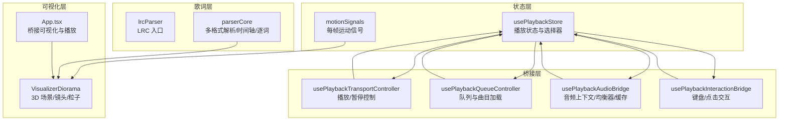
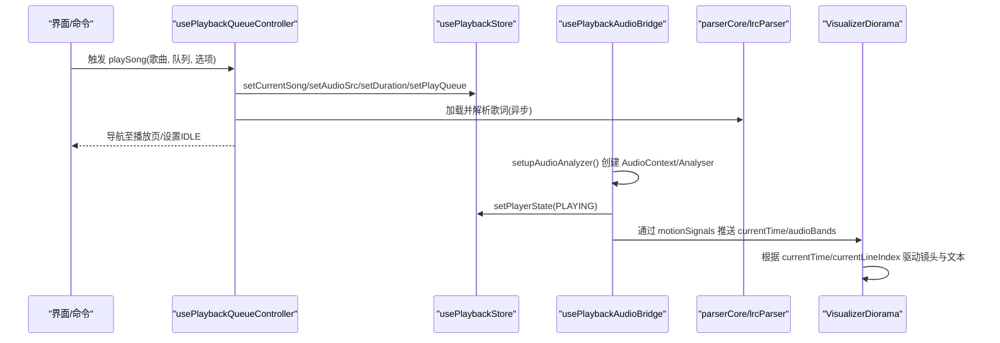
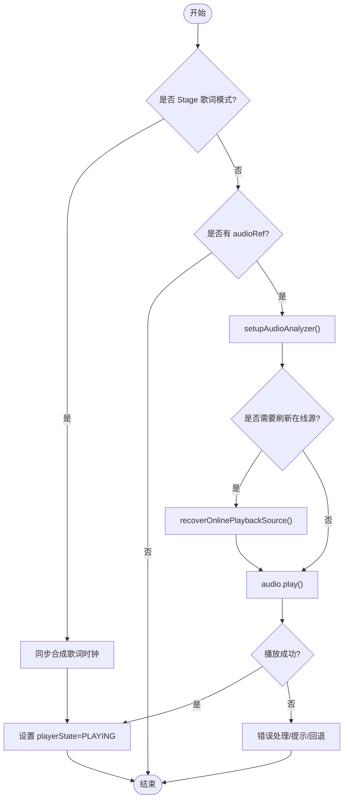
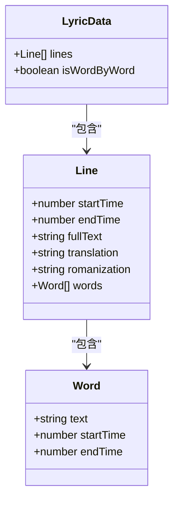
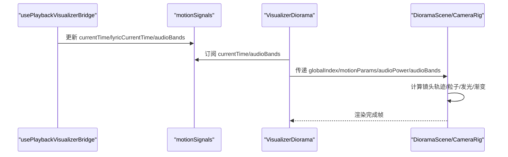
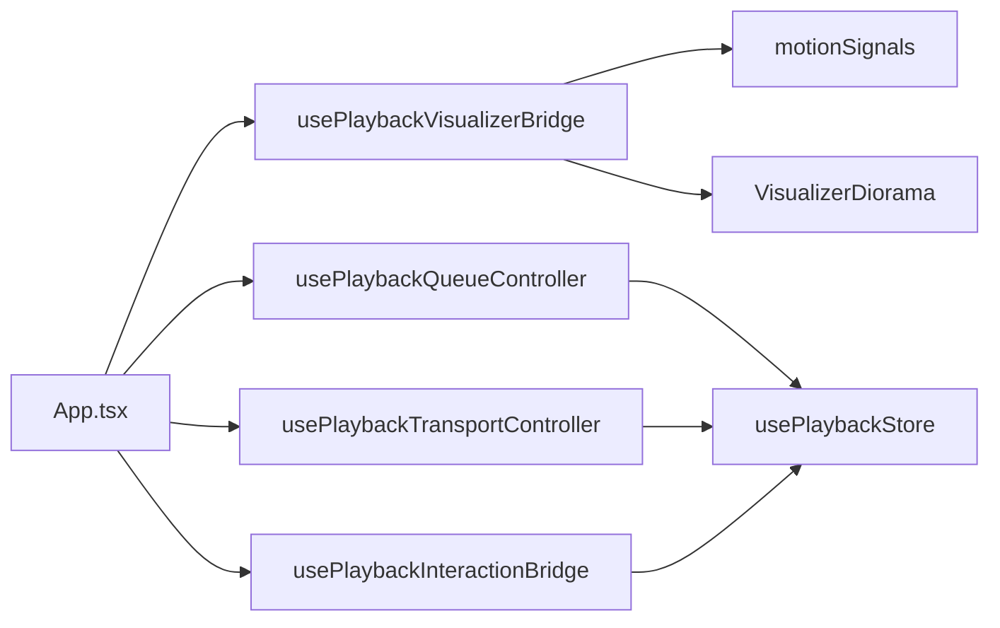

# 内部API接口

<cite>
**本文引用的文件**   
- [usePlaybackStore.ts](file://src/stores/usePlaybackStore.ts)
- [usePlaybackTransportController.ts](file://src/hooks/usePlaybackTransportController.ts)
- [usePlaybackQueueController.ts](file://src/hooks/usePlaybackQueueController.ts)
- [usePlaybackAudioBridge.ts](file://src/hooks/usePlaybackAudioBridge.ts)
- [usePlaybackInteractionBridge.ts](file://src/hooks/usePlaybackInteractionBridge.ts)
- [motionSignals.ts](file://src/stores/motionSignals.ts)
- [lrcParser.ts](file://src/utils/lrcParser.ts)
- [parserCore.ts](file://src/utils/lyrics/parserCore.ts)
- [VisualizerDiorama.tsx](file://src/components/visualizer/diorama/VisualizerDiorama.tsx)
- [App.tsx](file://src/App.tsx)
</cite>

## 目录
1. [简介](#简介)
2. [项目结构](#项目结构)
3. [核心组件](#核心组件)
4. [架构总览](#架构总览)
5. [详细组件分析](#详细组件分析)
6. [依赖关系分析](#依赖关系分析)
7. [性能考虑](#性能考虑)
8. [故障排查指南](#故障排查指南)
9. [结论](#结论)
10. [附录](#附录)

## 简介
本文件面向扩展开发者，系统化梳理 Folia Major 的内部 API，重点覆盖：
- 状态管理 API：播放状态、用户偏好、应用配置等核心状态的读写入口。
- 播放控制 API：音频播放、暂停、跳转、音量控制、队列管理等调用方法。
- 歌词系统 API：歌词解析、时间轴同步、逐词高亮等接口规范与数据模型。
- 可视化渲染 API：3D 场景控制、频谱数据获取、动画参数调整等能力说明。

文档以“从高层到代码级”的方式组织，配合时序图、流程图和类图帮助快速理解调用链与数据流，并提供可操作的示例路径与参数说明，便于在插件或扩展中安全使用这些内部接口。

## 项目结构
围绕播放与可视化的关键模块分布如下：
- 状态层：Zustand store 集中维护播放相关状态，导出稳定 setter 与选择器。
- 桥接层：多个 hook 将 UI 交互、音频上下文、可视化管线与状态层解耦。
- 歌词层：统一解析多种歌词格式，输出带时间戳的行与词级时间轴。
- 可视化层：基于 React Three Fiber 的 3D 场景，消费运动信号与频谱数据。

**图示来源**
- [usePlaybackStore.ts:1-177](file://src/stores/usePlaybackStore.ts#L1-L177)
- [motionSignals.ts:1-61](file://src/stores/motionSignals.ts#L1-L61)
- [usePlaybackTransportController.ts:1-170](file://src/hooks/usePlaybackTransportController.ts#L1-L170)
- [usePlaybackQueueController.ts:1-800](file://src/hooks/usePlaybackQueueController.ts#L1-L800)
- [usePlaybackAudioBridge.ts:1-343](file://src/hooks/usePlaybackAudioBridge.ts#L1-L343)
- [usePlaybackInteractionBridge.ts:1-381](file://src/hooks/usePlaybackInteractionBridge.ts#L1-L381)
- [lrcParser.ts:1-7](file://src/utils/lrcParser.ts#L1-L7)
- [parserCore.ts:1-800](file://src/utils/lyrics/parserCore.ts#L1-L800)
- [VisualizerDiorama.tsx:1-498](file://src/components/visualizer/diorama/VisualizerDiorama.tsx#L1-L498)
- [App.tsx:1515-1536](file://src/App.tsx#L1515-L1536)

**章节来源**
- [usePlaybackStore.ts:1-177](file://src/stores/usePlaybackStore.ts#L1-L177)
- [motionSignals.ts:1-61](file://src/stores/motionSignals.ts#L1-L61)
- [usePlaybackTransportController.ts:1-170](file://src/hooks/usePlaybackTransportController.ts#L1-L170)
- [usePlaybackQueueController.ts:1-800](file://src/hooks/usePlaybackQueueController.ts#L1-L800)
- [usePlaybackAudioBridge.ts:1-343](file://src/hooks/usePlaybackAudioBridge.ts#L1-L343)
- [usePlaybackInteractionBridge.ts:1-381](file://src/hooks/usePlaybackInteractionBridge.ts#L1-L381)
- [lrcParser.ts:1-7](file://src/utils/lrcParser.ts#L1-L7)
- [parserCore.ts:1-800](file://src/utils/lyrics/parserCore.ts#L1-L800)
- [VisualizerDiorama.tsx:1-498](file://src/components/visualizer/diorama/VisualizerDiorama.tsx#L1-L498)
- [App.tsx:1515-1536](file://src/App.tsx#L1515-L1536)

## 核心组件
- 播放状态存储（usePlaybackStore）
  - 提供 currentSong、audioSrc、lyrics、duration、playerState、playQueue、replayGainMode、isFmMode、activePlaybackContext 等字段。
  - 导出稳定的模块级 setter（如 setPlayerState、setPlayQueue、setReplayGainMode），避免 React 重渲染开销。
  - 提供 display 层选择器（selectDisplay*），用于过渡期显示一致性。
- 播放传输控制器（usePlaybackTransportController）
  - 封装 resumePlayback/pausePlayback，处理 Stage 纯歌词模式、在线源恢复、错误提示与状态同步。
- 播放队列控制器（usePlaybackQueueController）
  - 负责 playSong、队列追加/去重、在线音源加载、歌词预取、主题恢复、附近歌曲预取等。
- 音频桥接（usePlaybackAudioBridge）
  - 创建 AudioContext/AnalyserNode，构建播放图、均衡器与效果链，自动 autoplay、ReplayGain、媒体缓存。
- 交互桥接（usePlaybackInteractionBridge）
  - 统一键盘/点击事件：空格播放/暂停、左右箭头跳转、上一首/下一首、面板开关、调试窗口快捷键等。
- 运动信号（motionSignals）
  - 全局 MotionValue：currentTime、lyricCurrentTime、audioPower、bass/lowMid/mid/vocal/treble、spectrum。
- 歌词解析（lrcParser + parserCore）
  - 支持 LRC/YRC/QRC/VTT/TTML 等格式，输出 Line[] 与 Word[]，含翻译/注音对齐、插空行、逐词时间轴。
- 可视化（VisualizerDiorama）
  - 3D 走廊式镜头飞行、段落序列、转场、粒子/发光/渐变强度可调，消费 currentTime/audioBands 等信号。

**章节来源**
- [usePlaybackStore.ts:1-177](file://src/stores/usePlaybackStore.ts#L1-L177)
- [usePlaybackTransportController.ts:1-170](file://src/hooks/usePlaybackTransportController.ts#L1-L170)
- [usePlaybackQueueController.ts:1-800](file://src/hooks/usePlaybackQueueController.ts#L1-L800)
- [usePlaybackAudioBridge.ts:1-343](file://src/hooks/usePlaybackAudioBridge.ts#L1-L343)
- [usePlaybackInteractionBridge.ts:1-381](file://src/hooks/usePlaybackInteractionBridge.ts#L1-L381)
- [motionSignals.ts:1-61](file://src/stores/motionSignals.ts#L1-L61)
- [lrcParser.ts:1-7](file://src/utils/lrcParser.ts#L1-L7)
- [parserCore.ts:1-800](file://src/utils/lyrics/parserCore.ts#L1-L800)
- [VisualizerDiorama.tsx:1-498](file://src/components/visualizer/diorama/VisualizerDiorama.tsx#L1-L498)

## 架构总览
下图展示一次“播放一首在线歌曲”的端到端流程，涵盖队列、音频、歌词与可视化联动。

**图示来源**
- [usePlaybackQueueController.ts:440-690](file://src/hooks/usePlaybackQueueController.ts#L440-L690)
- [usePlaybackStore.ts:85-138](file://src/stores/usePlaybackStore.ts#L85-L138)
- [usePlaybackAudioBridge.ts:133-164](file://src/hooks/usePlaybackAudioBridge.ts#L133-L164)
- [motionSignals.ts:31-47](file://src/stores/motionSignals.ts#L31-L47)
- [VisualizerDiorama.tsx:100-141](file://src/components/visualizer/diorama/VisualizerDiorama.tsx#L100-L141)

## 详细组件分析

### 状态管理 API（播放状态、用户偏好、应用配置）
- 核心状态字段
  - 当前曲目：currentSong
  - 音频源：audioSrc
  - 歌词：lyrics
  - 时长：duration
  - 播放状态：playerState
  - 当前歌词行索引：currentLineIndex
  - 播放队列：playQueue
  - 播放上下文：activePlaybackContext（main/stage）
  - 随机模式：isFmMode
  - 响度补偿模式：replayGainMode
  - 歌词时间偏移：lyricTimelineOffsetMs
  - 过渡显示快照：transitionDisplay（封面/歌词/时长冻结）
- 写入接口（模块级 setter，稳定引用）
  - setCurrentSong / setAudioSrc / setLyricsState / setActiveLocalLyricsSource
  - setCachedCoverUrl / setDuration / setPlayerState / setCurrentLineIndex
  - setPlayQueue / setActivePlaybackContext / setIsFmMode / setReplayGainMode
  - setLyricTimelineOffsetMs / setTransitionDisplay
- 读取接口（选择器，避免直接读 raw 字段）
  - selectCoverUrl / selectDisplaySong / selectDisplayLyrics / selectDisplayCoverUrl
  - selectDisplayDuration / selectDisplayPlayerState / selectIsShowingTail

使用建议
- 所有跨组件共享的状态变更优先使用模块级 setter，避免传入大量回调。
- 显示层（进度条、遥控器、命令面板）应使用 selectDisplay* 选择器，保证过渡期行为一致。
- replayGainMode 会持久化到 localStorage，并在 AudioContext 就绪后应用到当前轨道。

**章节来源**
- [usePlaybackStore.ts:35-138](file://src/stores/usePlaybackStore.ts#L35-L138)
- [usePlaybackStore.ts:142-177](file://src/stores/usePlaybackStore.ts#L142-L177)
- [usePlaybackAudioBridge.ts:204-206](file://src/hooks/usePlaybackAudioBridge.ts#L204-L206)

### 播放控制 API（播放、暂停、跳转、音量、队列）
- 播放/暂停
  - resumePlayback：处理 Stage 歌词模式、AudioContext 恢复、在线源恢复、错误提示与状态同步。
  - pausePlayback：处理过渡期取消混音、音量平滑、状态同步。
- 跳转
  - 键盘左右箭头：按 5 秒步进；Stage 歌词模式走合成时钟，主播放走 currentTime 与 audioRef.currentTime。
  - seekDuringTransition：在混音期间将 seek 路由到正在显示的轨道，避免误操作下一轨。
- 音量
  - syncOutputGain：由 AudioBridge 暴露，Transport 与 Interaction 在播放/暂停时调用，确保输出增益平滑。
- 队列
  - appendOnlineSongsToMainQueue：按 queueAddBehavior 追加/插入/替换，去重与消息提示。
  - getNextPlayableQueueSong：按 loopMode 计算下一首可播曲目。
  - playSong：统一入口，处理本地/Navidrome/在线三种来源，歌词加载、主题恢复、附近歌曲预取。

**图示来源**
- [usePlaybackTransportController.ts:68-132](file://src/hooks/usePlaybackTransportController.ts#L68-L132)
- [usePlaybackInteractionBridge.ts:246-325](file://src/hooks/usePlaybackInteractionBridge.ts#L246-L325)
- [usePlaybackQueueController.ts:440-690](file://src/hooks/usePlaybackQueueController.ts#L440-L690)

**章节来源**
- [usePlaybackTransportController.ts:1-170](file://src/hooks/usePlaybackTransportController.ts#L1-L170)
- [usePlaybackInteractionBridge.ts:1-381](file://src/hooks/usePlaybackInteractionBridge.ts#L1-L381)
- [usePlaybackQueueController.ts:1-800](file://src/hooks/usePlaybackQueueController.ts#L1-L800)

### 歌词系统 API（解析、时间轴、逐词高亮）
- 解析入口
  - lrcParser.parseLRC：对外暴露 LRC 解析，内部委托 parserCore.parseLRC。
- 多格式支持
  - parserCore 提供 parseLRC/parseYRC/parseQRC/parseVTT/parseTTML 等，统一输出 LyricData。
- 数据结构
  - LyricData.lines：Line[]，包含 startTime/endTime/fullText/translation/romanization/words。
  - Word：text/startTime/endTime，用于逐词高亮。
- 时间轴与对齐
  - findTranslationsForSortedStartTimes：按时间窗匹配翻译/注音行。
  - attachInterludes：为长间隙插入占位行，保持视觉连贯。
  - finalizeParsedLyricLines：合并插空行并进行渲染标注。
- 与播放同步
  - usePlaybackVisualizerBridge（被 App.tsx 调用）驱动 lyricCurrentTime 与 currentLineIndex，供可视化消费。

**图示来源**
- [parserCore.ts:428-487](file://src/utils/lyrics/parserCore.ts#L428-L487)
- [parserCore.ts:489-568](file://src/utils/lyrics/parserCore.ts#L489-L568)
- [parserCore.ts:570-700](file://src/utils/lyrics/parserCore.ts#L570-L700)
- [parserCore.ts:780-800](file://src/utils/lyrics/parserCore.ts#L780-L800)
- [lrcParser.ts:1-7](file://src/utils/lrcParser.ts#L1-L7)

**章节来源**
- [lrcParser.ts:1-7](file://src/utils/lrcParser.ts#L1-L7)
- [parserCore.ts:1-800](file://src/utils/lyrics/parserCore.ts#L1-L800)
- [App.tsx:1515-1536](file://src/App.tsx#L1515-L1536)

### 可视化渲染 API（3D 场景、频谱、动画参数）
- 输入信号
  - currentTime：当前播放位置（秒）。
  - audioBands：bass/lowMid/mid/vocal/treble/spectrum。
  - audioPower：整体能量 0..1。
- 3D 场景控制（Diorama）
  - 镜头飞行：CameraRig 根据 globalIndex 与 motionParams 执行贝塞尔曲线飞行。
  - 段落序列：dioramaSequencer 管理 corridor segment，支持切歌/单曲循环无缝衔接。
  - 转场：TRANSITION_DURATION 内同时挂载 outgoing/incoming 场景，实现无黑屏切换。
- 动画参数
  - dioramaTuning：geometryVisibility/particleDensity/particleScale/particleGlowEnabled/particleGlowIntensity/showParticles/backgroundParticleCircumference/backgroundParticleRadial/glowEnabled/glowIntensity/soulEnabled/soulActiveEnabled/soulIntensity/gradientEnabled/gradientIntensity/keywordColoringEnabled。
  - theme.animationIntensity：与播放器面板强度芯片一致的动画强度基线。
- 字幕与文本
  - VisualizerSubtitleOverlay：承载翻译与下一行提示，受 subtitleFontScale/subtitleOverlayOpacity 等控制。
  - 3D 文本：Canvas 内 rasterized，继承项目字体栈与主题样式。

**图示来源**
- [motionSignals.ts:31-47](file://src/stores/motionSignals.ts#L31-L47)
- [VisualizerDiorama.tsx:100-141](file://src/components/visualizer/diorama/VisualizerDiorama.tsx#L100-L141)
- [VisualizerDiorama.tsx:395-455](file://src/components/visualizer/diorama/VisualizerDiorama.tsx#L395-L455)

**章节来源**
- [motionSignals.ts:1-61](file://src/stores/motionSignals.ts#L1-L61)
- [VisualizerDiorama.tsx:1-498](file://src/components/visualizer/diorama/VisualizerDiorama.tsx#L1-L498)

## 依赖关系分析
- 低耦合高内聚
  - 状态层（usePlaybackStore）仅维护数据与选择器，不感知 UI 细节。
  - 桥接层（Transport/Queue/Audio/Interaction）组合状态与外部资源（HTMLMediaElement、AudioContext、网络服务）。
  - 歌词层独立于播放与可视化，输出标准 LyricData。
  - 可视化层只消费 motionSignals 与 props，不直接写播放状态。
- 关键依赖链
  - App.tsx 组装 usePlaybackVisualizerBridge，连接 audioRef/analyserRef 与可视化。
  - usePlaybackQueueController 依赖 onlineMusic 服务、prefetchService、themeCache 等。
  - usePlaybackAudioBridge 依赖 playbackGraph/equalizer/effectChain/automix crossfade。
  - usePlaybackInteractionBridge 依赖 appViewStore、audioSettingsStore、statusMessageStore。

**图示来源**
- [App.tsx:1515-1536](file://src/App.tsx#L1515-L1536)
- [usePlaybackQueueController.ts:1-800](file://src/hooks/usePlaybackQueueController.ts#L1-L800)
- [usePlaybackTransportController.ts:1-170](file://src/hooks/usePlaybackTransportController.ts#L1-L170)
- [usePlaybackInteractionBridge.ts:1-381](file://src/hooks/usePlaybackInteractionBridge.ts#L1-L381)
- [motionSignals.ts:1-61](file://src/stores/motionSignals.ts#L1-L61)
- [usePlaybackStore.ts:1-177](file://src/stores/usePlaybackStore.ts#L1-L177)
- [VisualizerDiorama.tsx:1-498](file://src/components/visualizer/diorama/VisualizerDiorama.tsx#L1-L498)

**章节来源**
- [App.tsx:1515-1536](file://src/App.tsx#L1515-L1536)
- [usePlaybackQueueController.ts:1-800](file://src/hooks/usePlaybackQueueController.ts#L1-L800)
- [usePlaybackTransportController.ts:1-170](file://src/hooks/usePlaybackTransportController.ts#L1-L170)
- [usePlaybackInteractionBridge.ts:1-381](file://src/hooks/usePlaybackInteractionBridge.ts#L1-L381)
- [motionSignals.ts:1-61](file://src/stores/motionSignals.ts#L1-L61)
- [usePlaybackStore.ts:1-177](file://src/stores/usePlaybackStore.ts#L1-L177)
- [VisualizerDiorama.tsx:1-498](file://src/components/visualizer/diorama/VisualizerDiorama.tsx#L1-L498)

## 性能考虑
- 避免每帧写入 React state
  - motionSignals 使用 MotionValue，避免每秒 60 次重渲染。
- 稳定回调与引用
  - 模块级 setter 与 useStableActionSurface 减少依赖数组变化导致的无效重渲染。
- 音频图与设备初始化
  - AudioContext/Analyser 仅在首次需要时创建，避免重复 createMediaElementSource 报错。
- 歌词解析与渲染
  - 解析结果复用，插空行与翻译对齐算法优化，避免频繁重建。
- 可视化
  - 3D 场景使用 Canvas 与 R3F，合理设置 dpr/antialias，按需启用粒子与发光。

[本节为通用指导，不直接分析具体文件]

## 故障排查指南
- 播放失败（NotAllowedError/AbortError/NotSupportedError）
  - 现象：点击播放无响应或立即暂停。
  - 排查：检查浏览器策略（需用户手势）、在线源失效、元素 error 状态。
  - 处理：Transport 捕获异常并提示；AudioBridge 对 AbortError 重置 autoplay 意图。
- 过渡期误操作
  - 现象：混音期间按下暂停/跳转导致跳到下一轨。
  - 处理：pauseDuringTransition/seekDuringTransition 将操作路由到正在显示的轨道。
- 歌词不同步
  - 现象：歌词行与音乐错位。
  - 排查：检查 lyricTimelineOffsetMs、lyricCurrentTime 与 currentTime 的关系。
- 可视化卡顿
  - 现象：3D 场景掉帧。
  - 排查：降低 particleDensity/particleScale、关闭 glow/gradient、减小 dpr。

**章节来源**
- [usePlaybackTransportController.ts:103-132](file://src/hooks/usePlaybackTransportController.ts#L103-L132)
- [usePlaybackAudioBridge.ts:293-325](file://src/hooks/usePlaybackAudioBridge.ts#L293-L325)
- [usePlaybackInteractionBridge.ts:246-325](file://src/hooks/usePlaybackInteractionBridge.ts#L246-L325)

## 结论
Folia Major 的内部 API 以 Zustand store 为中心，通过多个桥接 hook 将 UI、音频、歌词与可视化解耦。开发者在扩展功能时，应优先使用模块级 setter 与选择器访问状态，通过 Transport/Queue/Audio/Interaction 提供的接口进行播放控制，借助 parserCore 统一解析歌词，并通过 motionSignals 与 VisualizerDiorama 的参数驱动 3D 场景。遵循上述规范可获得更稳定、高性能且易维护的集成体验。

[本节为总结性内容，不直接分析具体文件]

## 附录
- 常用参数速查
  - 播放状态：playerState（IDLE/PLAYING/PAUSED）
  - 队列行为：queueAddBehavior（next/end/replace）
  - 循环模式：loopMode（off/all/one）
  - 响度补偿：replayGainMode（off/track/album）
  - 歌词偏移：lyricTimelineOffsetMs
  - 可视化调参：dioramaTuning 各项布尔/数值开关
- 示例调用路径
  - 播放/暂停：usePlaybackTransportController.resumePlayback/pausePlayback
  - 播放歌曲：usePlaybackQueueController.playSong
  - 修改音量：syncOutputGain(targetVolume, smoothing)
  - 解析歌词：lrcParser.parseLRC(lrcString, translationString)
  - 3D 场景：VisualizerDiorama props（dioramaTuning/theme/animationIntensity）

[本节为补充信息，不直接分析具体文件]