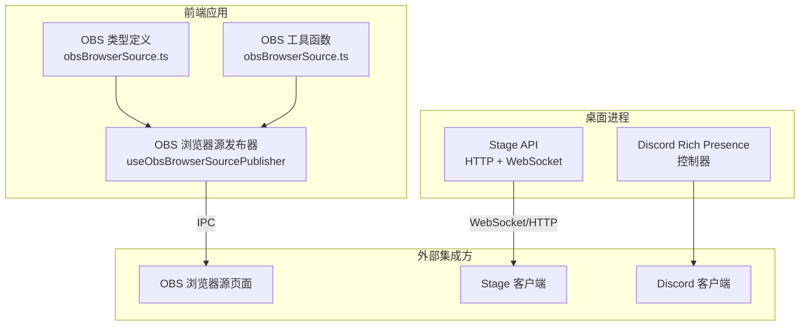
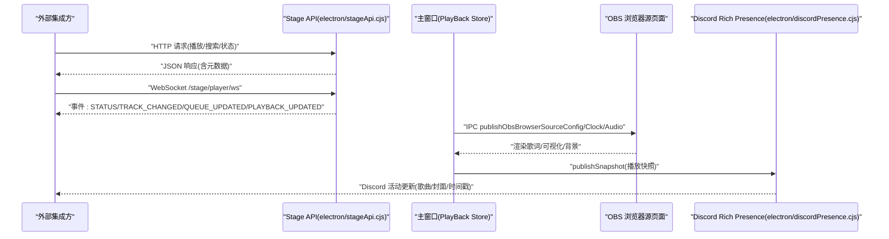
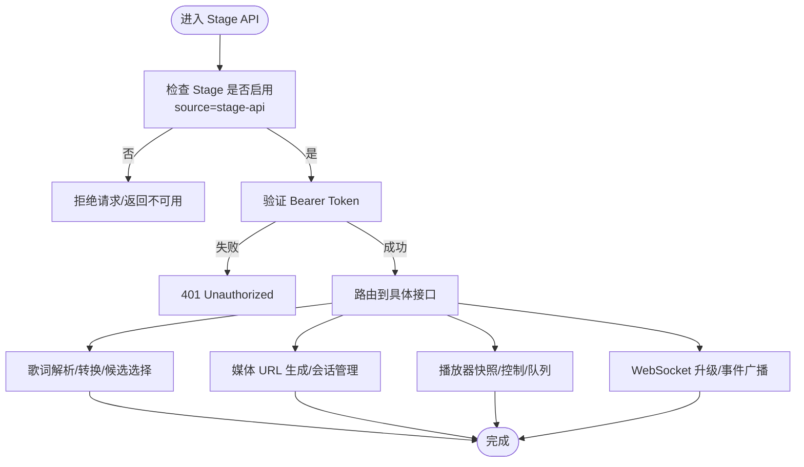
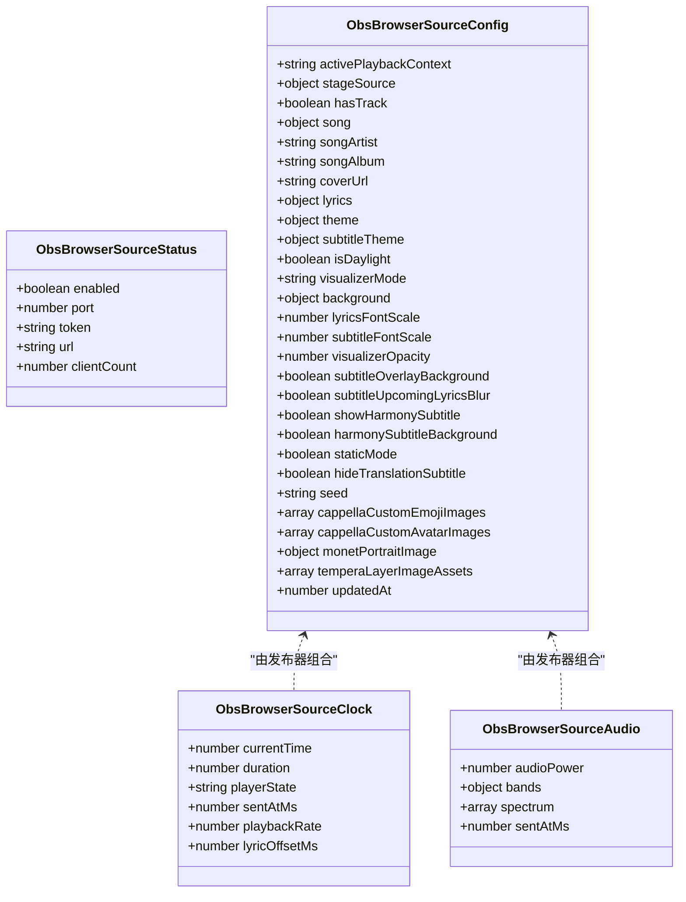
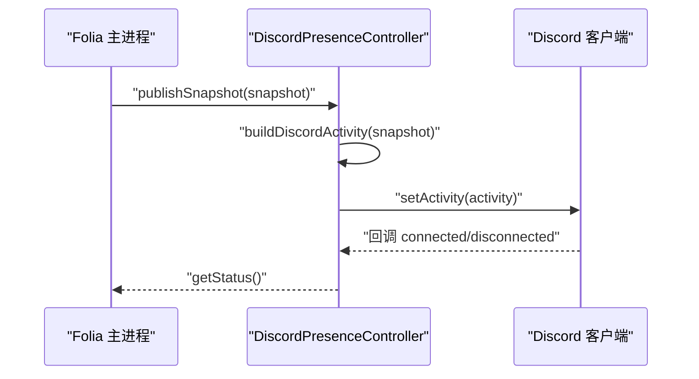
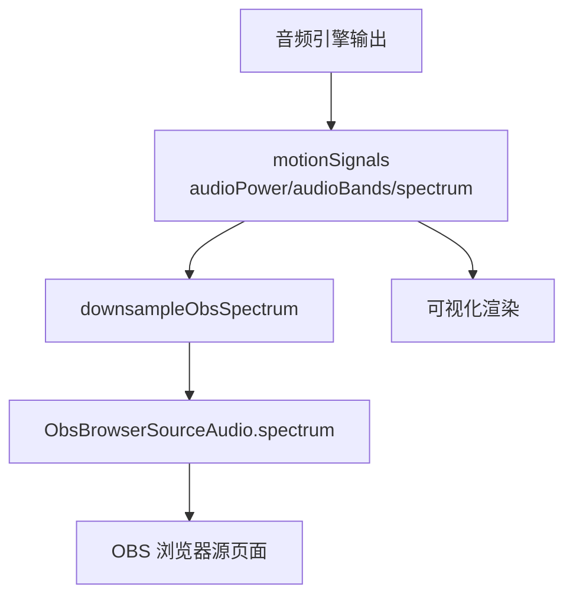
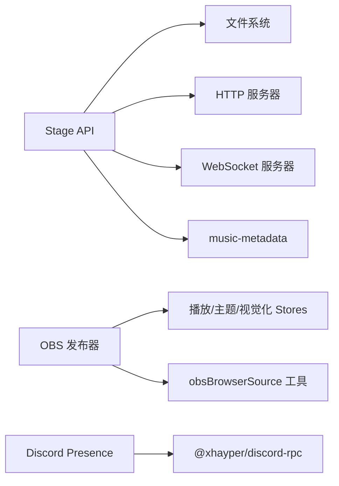

# 外部集成API

<cite>
**本文引用的文件**   
- [electron/stageApi.cjs](file://electron/stageApi.cjs)
- [electron/discordPresence.cjs](file://electron/discordPresence.cjs)
- [src/types/obsBrowserSource.ts](file://src/types/obsBrowserSource.ts)
- [src/utils/obsBrowserSource.ts](file://src/utils/obsBrowserSource.ts)
- [src/hooks/useObsBrowserSourcePublisher.ts](file://src/hooks/useObsBrowserSourcePublisher.ts)
- [stage-client.html](file://stage-client.html)
</cite>

## 目录
1. [简介](#简介)
2. [项目结构](#项目结构)
3. [核心组件](#核心组件)
4. [架构总览](#架构总览)
5. [详细组件分析](#详细组件分析)
6. [依赖关系分析](#依赖关系分析)
7. [性能考虑](#性能考虑)
8. [故障排查指南](#故障排查指南)
9. [结论](#结论)
10. [附录](#附录)

## 简介
本文件面向第三方开发者，系统化说明 Folia Major 的外部集成 API，包括：
- Stage API：浏览器源集成、实时数据推送、事件监听、播放控制与队列管理。
- OBS 集成 API：浏览器源配置、NowPlaying 数据同步、音频频谱与可视化数据推送、自定义资源注入。
- Discord Rich Presence API：游戏状态显示、歌曲信息同步、连接状态与错误处理。
- Web Audio API 封装接口：用于获取音频分析与可视化所需的数据（频段、频谱、响度等）。

文档提供请求响应示例与错误处理方案，帮助实现与 Folia Major 的深度集成。

## 项目结构
Folia Major 的外部集成能力主要分布在以下位置：
- electron/stageApi.cjs：Stage API 的 HTTP/WebSocket 服务、鉴权、会话管理、播放器快照与事件广播。
- src/hooks/useObsBrowserSourcePublisher.ts：OBS 浏览器源发布器，负责将播放状态、歌词、主题、音频数据推送到本地 OBS 渲染页面。
- src/types/obsBrowserSource.ts：OBS 浏览器源的数据契约（配置、时钟、音频、事件类型）。
- src/utils/obsBrowserSource.ts：OBS 浏览器源的纯函数工具（时间计算、频谱下采样、图片资源转换、配置签名去重）。
- electron/discordPresence.cjs：Discord Rich Presence 控制器，维护连接、活动更新与状态。
- stage-client.html：Stage 客户端示例入口（供外部工具或浏览器源使用）。

**图表来源** 
- [electron/stageApi.cjs:169-240](file://electron/stageApi.cjs#L169-L240)
- [src/hooks/useObsBrowserSourcePublisher.ts:113-174](file://src/hooks/useObsBrowserSourcePublisher.ts#L113-L174)
- [src/types/obsBrowserSource.ts:29-129](file://src/types/obsBrowserSource.ts#L29-L129)
- [src/utils/obsBrowserSource.ts:15-107](file://src/utils/obsBrowserSource.ts#L15-L107)
- [electron/discordPresence.cjs:103-141](file://electron/discordPresence.cjs#L103-L141)

**章节来源**
- [electron/stageApi.cjs:1-240](file://electron/stageApi.cjs#L1-L240)
- [src/hooks/useObsBrowserSourcePublisher.ts:1-174](file://src/hooks/useObsBrowserSourcePublisher.ts#L1-L174)
- [src/types/obsBrowserSource.ts:1-129](file://src/types/obsBrowserSource.ts#L1-L129)
- [src/utils/obsBrowserSource.ts:1-107](file://src/utils/obsBrowserSource.ts#L1-L107)
- [electron/discordPresence.cjs:1-141](file://electron/discordPresence.cjs#L1-L141)

## 核心组件
- Stage API：提供 HTTP 与 WebSocket 接口，支持歌词会话、媒体会话、播放控制、队列操作、状态查询与事件广播；内置鉴权、端口与令牌管理、会话清理与资源访问 URL 生成。
- OBS 浏览器源发布器：将当前播放上下文、歌词、主题、背景、字幕、视觉化模式、音频信号等打包为配置与实时时钟/音频流，通过 IPC 发送到 OBS 浏览器源页面。
- Discord Rich Presence 控制器：根据播放快照构建 Discord 活动，维护连接、刷新频率与错误状态，支持应用 ID 校验与图片 URL 规范化。
- Web Audio 封装：通过运动信号暴露音频功率、频段值与频谱数组，供可视化与 OBS 浏览器源消费。

**章节来源**
- [electron/stageApi.cjs:169-240](file://electron/stageApi.cjs#L169-L240)
- [src/hooks/useObsBrowserSourcePublisher.ts:113-174](file://src/hooks/useObsBrowserSourcePublisher.ts#L113-L174)
- [electron/discordPresence.cjs:103-141](file://electron/discordPresence.cjs#L103-L141)
- [src/hooks/useObsBrowserSourcePublisher.ts:318-338](file://src/hooks/useObsBrowserSourcePublisher.ts#L318-L338)

## 架构总览
下图展示外部集成方与 Folia Major 各组件之间的交互关系。

**图表来源** 
- [electron/stageApi.cjs:648-676](file://electron/stageApi.cjs#L648-L676)
- [src/hooks/useObsBrowserSourcePublisher.ts:340-422](file://src/hooks/useObsBrowserSourcePublisher.ts#L340-L422)
- [electron/discordPresence.cjs:228-264](file://electron/discordPresence.cjs#L228-L264)

## 详细组件分析

### Stage API 规范
- 鉴权与端口
  - 端口：从设置读取，未配置则回退默认端口。
  - Token：Bearer 鉴权，首次缺失时可自动生成并持久化。
- 状态与启用
  - 支持三种来源：now-playing、playercap、stage-api；仅当启用且 source=stage-api 时开放 Stage API。
  - 状态对象包含 enabled、modeEnabled、source、port、token、activeEntryKind、lyricsSession、mediaSession。
- 媒体资源
  - 当前媒体 URL：/stage/media/current/{audio|cover}，支持版本参数 v。
  - 会话媒体 URL：/stage/media/session/{sessionId}/{audio|cover}。
- 歌词与会话
  - 支持 lrc、enhanced-lrc、vtt、yrc、qrc 格式检测与转换。
  - 自动选择最佳候选（优先增强型词级时间轴），翻译标签识别。
- 播放器快照与控制
  - 快照字段：playbackContext、current、playerState、positionMs、durationMs、sampledAtMs、updatedAt、controlCapabilities、queueCapabilities、queue。
  - 控制能力：play/pause/resume/seek/previous/next（受 playbackContext 限制）。
  - 队列能力：append/insertNext/remove/move/select/clear（normal-playback 可编辑）。
- WebSocket 事件
  - 端点：/stage/player/ws，需 Bearer Token。
  - 事件：STATUS、TRACK_CHANGED、QUEUE_UPDATED、PLAYBACK_UPDATED。
- 错误模型
  - 统一错误类 StageApiError，包含 statusCode、code、details。
  - 常见错误码：STAGE_API_ERROR、STAGE_PLAY_CANCELED 等。

**图表来源** 
- [electron/stageApi.cjs:211-240](file://electron/stageApi.cjs#L211-L240)
- [electron/stageApi.cjs:648-676](file://electron/stageApi.cjs#L648-L676)
- [electron/stageApi.cjs:794-800](file://electron/stageApi.cjs#L794-L800)

**章节来源**
- [electron/stageApi.cjs:169-240](file://electron/stageApi.cjs#L169-L240)
- [electron/stageApi.cjs:291-341](file://electron/stageApi.cjs#L291-L341)
- [electron/stageApi.cjs:343-415](file://electron/stageApi.cjs#L343-L415)
- [electron/stageApi.cjs:448-520](file://electron/stageApi.cjs#L448-L520)
- [electron/stageApi.cjs:648-676](file://electron/stageApi.cjs#L648-L676)
- [electron/stageApi.cjs:794-800](file://electron/stageApi.cjs#L794-L800)

#### 请求与响应示例（Stage API）
- 查询状态
  - 方法：GET
  - 路径：/stage/status
  - 头部：Authorization: Bearer {token}
  - 响应体：{ enabled, modeEnabled, source, port, token, activeEntryKind, lyricsSession, mediaSession }
- 上传歌词
  - 方法：POST
  - 路径：/stage/lyrics
  - 内容类型：multipart/form-data
  - 字段：text、format(lrc|enhanced-lrc|vtt|yrc|qrc)、metadata
  - 响应体：{ sessionId, format, hasTimeline }
- 播放控制
  - 方法：POST
  - 路径：/stage/player/control
  - 头部：Authorization: Bearer {token}
  - 请求体：{ action: play|pause|resume|seek|previous|next, positionMs? }
  - 响应体：{ success, controlCapabilities }
- WebSocket 订阅
  - 协议：ws://127.0.0.1:{port}/stage/player/ws
  - 头部：Authorization: Bearer {token}
  - 事件：STATUS、TRACK_CHANGED、QUEUE_UPDATED、PLAYBACK_UPDATED

**章节来源**
- [electron/stageApi.cjs:291-341](file://electron/stageApi.cjs#L291-L341)
- [electron/stageApi.cjs:648-676](file://electron/stageApi.cjs#L648-L676)

### OBS 集成 API 规范
- 浏览器源状态
  - 通过 Electron IPC 获取 ObsBrowserSourceStatus：enabled、port、token、url、clientCount。
- 配置发布
  - 使用 useObsBrowserSourcePublisher 将 ObsBrowserSourceConfig 打包并通过 window.electron.publishObsBrowserSourceConfig 发送。
  - 配置包含：activePlaybackContext、stageSource、hasTrack、song、songArtist、songAlbum、coverUrl、lyrics、theme、subtitleTheme、isDaylight、visualizerMode、background、字体缩放、透明度、字幕选项、seed、自定义图像、Tempera 图层资产、updatedAt。
- 时钟与音频
  - 时钟：ObsBrowserSourceClock，包含 currentTime、duration、playerState、sentAtMs、playbackRate、lyricOffsetMs。
  - 音频：ObsBrowserSourceAudio，包含 audioPower、bands(bass/lowMid/mid/vocal/treble)、spectrum、sentAtMs。
- 资源处理
  - blob URL 转 data URL，避免跨域问题。
  - 自定义图像（Cappella 表情/头像、Monet 背景/肖像、Tempera 图层）在发布前转换为可被 OBS 页面消费的 URL。
- 去重与节流
  - 配置签名指纹（忽略 updatedAt），避免重复发布。
  - 时钟跳变阈值与最小间隔，减少 IPC 压力。

**图表来源** 
- [src/types/obsBrowserSource.ts:29-129](file://src/types/obsBrowserSource.ts#L29-L129)
- [src/hooks/useObsBrowserSourcePublisher.ts:249-338](file://src/hooks/useObsBrowserSourcePublisher.ts#L249-L338)

**章节来源**
- [src/types/obsBrowserSource.ts:29-129](file://src/types/obsBrowserSource.ts#L29-L129)
- [src/utils/obsBrowserSource.ts:15-107](file://src/utils/obsBrowserSource.ts#L15-L107)
- [src/hooks/useObsBrowserSourcePublisher.ts:113-174](file://src/hooks/useObsBrowserSourcePublisher.ts#L113-L174)
- [src/hooks/useObsBrowserSourcePublisher.ts:249-338](file://src/hooks/useObsBrowserSourcePublisher.ts#L249-L338)
- [src/hooks/useObsBrowserSourcePublisher.ts:340-422](file://src/hooks/useObsBrowserSourcePublisher.ts#L340-L422)

#### 请求与响应示例（OBS 浏览器源）
- 获取状态
  - 调用：window.electron.getObsBrowserSourceStatus()
  - 返回：ObsBrowserSourceStatus
- 发布配置
  - 调用：window.electron.publishObsBrowserSourceConfig(config)
  - 参数：ObsBrowserSourceConfig
  - 返回：Promise<boolean>
- 发布时钟
  - 调用：window.electron.publishObsBrowserSourceClock(clock)
  - 参数：ObsBrowserSourceClock
  - 返回：Promise<boolean]
- 发布音频
  - 调用：window.electron.publishObsBrowserSourceAudio(audio)
  - 参数：ObsBrowserSourceAudio
  - 返回：Promise<boolean>

**章节来源**
- [src/hooks/useObsBrowserSourcePublisher.ts:175-184](file://src/hooks/useObsBrowserSourcePublisher.ts#L175-L184)
- [src/hooks/useObsBrowserSourcePublisher.ts:340-422](file://src/hooks/useObsBrowserSourcePublisher.ts#L340-L422)

### Discord Rich Presence API 规范
- 应用 ID 校验
  - 仅接受 16-24 位数字字符串，否则视为无效。
- 图片 URL 规范化
  - 仅允许 https/http，排除 localhost/127.0.0.1/::1 及 .localhost 域名，http 自动升级为 https。
- 活动构建
  - name: "Folia"
  - type: LISTENING
  - details: 歌曲标题（截断至 128 字符）
  - state: 艺术家名或“Paused - 艺术家”
  - largeImageKey: 封面图 URL（可选）
  - smallImageText: Playing/Paused
  - startTimestamp/endTimestamp：基于快照时间与时长计算
- 连接与刷新
  - 使用 @xhayper/discord-rpc 建立 IPC 连接。
  - 每 15 秒内不重复推送相同活动。
  - 断开/销毁时清理活动与客户端。

**图表来源** 
- [electron/discordPresence.cjs:52-88](file://electron/discordPresence.cjs#L52-L88)
- [electron/discordPresence.cjs:166-226](file://electron/discordPresence.cjs#L166-L226)
- [electron/discordPresence.cjs:228-264](file://electron/discordPresence.cjs#L228-L264)

**章节来源**
- [electron/discordPresence.cjs:8-45](file://electron/discordPresence.cjs#L8-L45)
- [electron/discordPresence.cjs:52-88](file://electron/discordPresence.cjs#L52-L88)
- [electron/discordPresence.cjs:103-141](file://electron/discordPresence.cjs#L103-L141)
- [electron/discordPresence.cjs:166-226](file://electron/discordPresence.cjs#L166-L226)
- [electron/discordPresence.cjs:228-264](file://electron/discordPresence.cjs#L228-L264)

#### 请求与响应示例（Discord Rich Presence）
- 获取状态
  - 调用：discordPresence.getStatus()
  - 返回：{ enabled, configured, connected, error, applicationId, updatedAt }
- 发布快照
  - 调用：discordPresence.publishSnapshot(snapshot)
  - 参数：{ hasTrack, title, artist, duration, currentTime, coverUrl, playerState, updatedAt }
  - 返回：Promise<status>

**章节来源**
- [electron/discordPresence.cjs:143-141](file://electron/discordPresence.cjs#L143-L141)
- [electron/discordPresence.cjs:228-264](file://electron/discordPresence.cjs#L228-L264)

### Web Audio API 封装接口
- 暴露的信号
  - audioPower：整体响度
  - audioBands：频段值（bass、lowMid、mid、vocal、treble）
  - spectrum：频谱数组（Uint8Array）
- 用途
  - 驱动可视化效果（如频谱柱状图、波形、粒子系统）。
  - 提供给 OBS 浏览器源进行低延迟可视化渲染。
- 数据处理
  - downsampleObsSpectrum：将高频频谱下采样到固定桶数（默认 256），降低传输与渲染开销。
  - resolveObsBrowserSourceCoverUrl：将 blob URL 转为 data URL，解决跨域问题。

**图表来源** 
- [src/hooks/useObsBrowserSourcePublisher.ts:327-338](file://src/hooks/useObsBrowserSourcePublisher.ts#L327-L338)
- [src/utils/obsBrowserSource.ts:185-209](file://src/utils/obsBrowserSource.ts#L185-L209)

**章节来源**
- [src/hooks/useObsBrowserSourcePublisher.ts:327-338](file://src/hooks/useObsBrowserSourcePublisher.ts#L327-L338)
- [src/utils/obsBrowserSource.ts:185-209](file://src/utils/obsBrowserSource.ts#L185-L209)

## 依赖关系分析
- Stage API 依赖
  - 文件系统与 HTTP：用于会话目录、媒体文件、HTTP 服务器。
  - WebSocket：用于播放器事件广播。
  - music-metadata：用于音频元数据解析（懒加载）。
- OBS 发布器依赖
  - React Hooks 与 Stores：读取播放状态、主题、视觉化设置、字体设置、资产库。
  - utils/obsBrowserSource：配置签名、时钟时间计算、频谱下采样、图片资源转换。
- Discord Presence 依赖
  - @xhayper/discord-rpc：与 Discord 客户端通信。
  - 主进程设置：读取应用 ID 与启用开关。

**图表来源** 
- [electron/stageApi.cjs:1-20](file://electron/stageApi.cjs#L1-L20)
- [electron/stageApi.cjs:787-792](file://electron/stageApi.cjs#L787-L792)
- [src/hooks/useObsBrowserSourcePublisher.ts:47-56](file://src/hooks/useObsBrowserSourcePublisher.ts#L47-L56)
- [electron/discordPresence.cjs:196-211](file://electron/discordPresence.cjs#L196-L211)

**章节来源**
- [electron/stageApi.cjs:1-20](file://electron/stageApi.cjs#L1-L20)
- [electron/stageApi.cjs:787-792](file://electron/stageApi.cjs#L787-L792)
- [src/hooks/useObsBrowserSourcePublisher.ts:47-56](file://src/hooks/useObsBrowserSourcePublisher.ts#L47-L56)
- [electron/discordPresence.cjs:196-211](file://electron/discordPresence.cjs#L196-L211)

## 性能考虑
- Stage API
  - 会话保留上限：最多保留最近 N 个会话，防止磁盘膨胀。
  - 队列最大长度限制：默认 100，最大 500，避免过大队列导致内存压力。
  - 请求超时：外部播放与播放器控制请求设置超时，避免阻塞。
- OBS 浏览器源
  - 配置签名去重：避免重复发布相同配置，减少 IPC 与渲染开销。
  - 时钟跳变阈值与最小间隔：仅在显著跳变或超过最小间隔时立即刷新，降低 IPC 频率。
  - 频谱下采样：将原始频谱压缩到固定桶数，降低传输与渲染成本。
  - 图片资源转换：blob URL 转 data URL，避免跨域导致的额外网络请求。
- Discord Presence
  - 活动更新节流：相同活动在 15 秒内不重复推送。
  - 连接重试与清理：断开后清理客户端，避免资源泄漏。

[本节为通用性能建议，无需特定文件引用]

## 故障排查指南
- Stage API
  - 401 Unauthorized：Token 缺失或不匹配，检查 Authorization 头与生成的 Token。
  - 503 Service Unavailable：Stage 未启用或 source 非 stage-api，检查设置与启用状态。
  - 播放请求取消：外部播放请求超时或被取消，检查请求超时与状态。
  - 会话清理失败：工作目录删除失败，查看日志中的 workingDirectory 与 reason。
- OBS 浏览器源
  - 配置发布失败：检查 status.enabled 与 publishObsBrowserSourceConfig 是否存在。
  - 时钟发布失败：检查 publishObsBrowserSourceClock 与 interval 是否正确启动。
  - 音频发布失败：检查 publishObsBrowserSourceAudio 与频谱数据是否为空。
  - 图片资源解析失败：blob URL 无法读取或 fetch 失败，检查网络权限与 CORS。
- Discord Presence
  - 应用 ID 无效：确保为 16-24 位数字字符串。
  - 图片 URL 非法：仅允许 https/http，排除本地地址。
  - 连接失败：检查 Discord 客户端是否运行、应用 ID 是否正确、权限是否开启。
  - 活动未更新：检查 lastActivityKey 与更新时间间隔，确认活动是否变化。

**章节来源**
- [electron/stageApi.cjs:56-64](file://electron/stageApi.cjs#L56-L64)
- [electron/stageApi.cjs:678-688](file://electron/stageApi.cjs#L678-L688)
- [electron/stageApi.cjs:700-712](file://electron/stageApi.cjs#L700-L712)
- [src/hooks/useObsBrowserSourcePublisher.ts:340-422](file://src/hooks/useObsBrowserSourcePublisher.ts#L340-L422)
- [electron/discordPresence.cjs:8-45](file://electron/discordPresence.cjs#L8-L45)
- [electron/discordPresence.cjs:166-226](file://electron/discordPresence.cjs#L166-L226)

## 结论
Folia Major 提供了完善的外部集成能力：
- Stage API 以 HTTP/WebSocket 为核心，支持歌词、媒体、播放控制与队列管理，具备鉴权、会话管理与错误模型。
- OBS 集成通过发布器将播放状态、歌词、主题、音频数据高效推送到浏览器源页面，并提供资源转换与去重优化。
- Discord Rich Presence 控制器维护连接与活动更新，支持应用 ID 校验与图片 URL 规范化。
- Web Audio 封装提供音频分析与可视化所需的数据，配合 OBS 浏览器源实现低延迟渲染。

第三方开发者可依据本文档的接口规范与示例，快速实现与 Folia Major 的深度集成。

[本节为总结性内容，无需特定文件引用]

## 附录
- Stage 客户端示例入口：stage-client.html（供外部工具或浏览器源参考）。

**章节来源**
- [stage-client.html](file://stage-client.html)