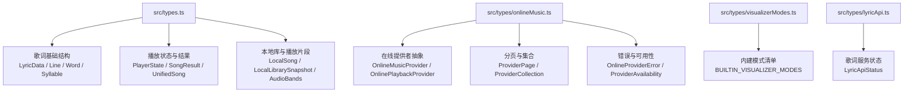
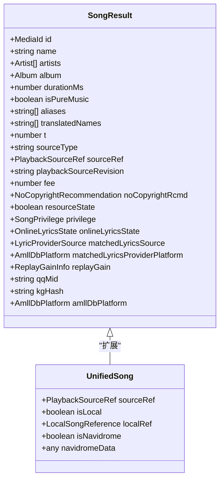
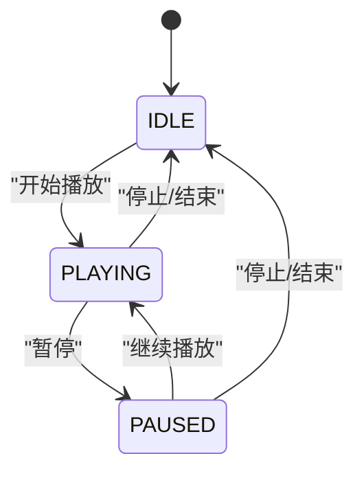
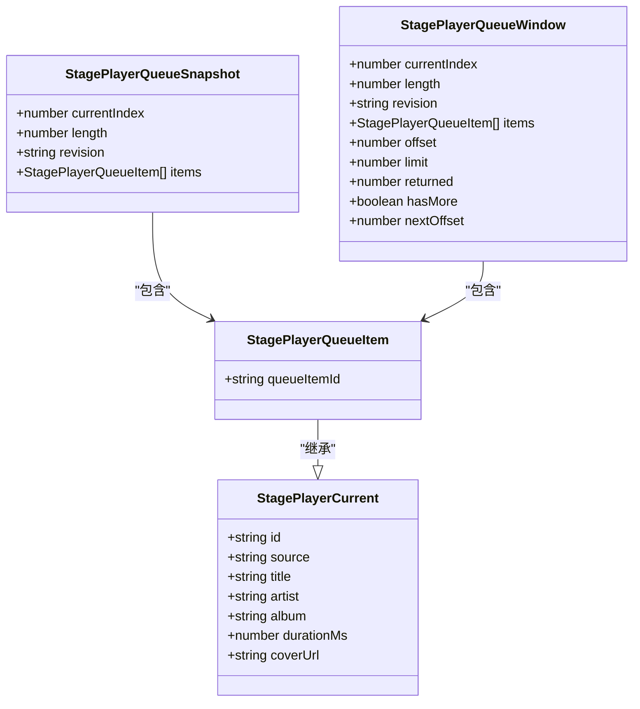
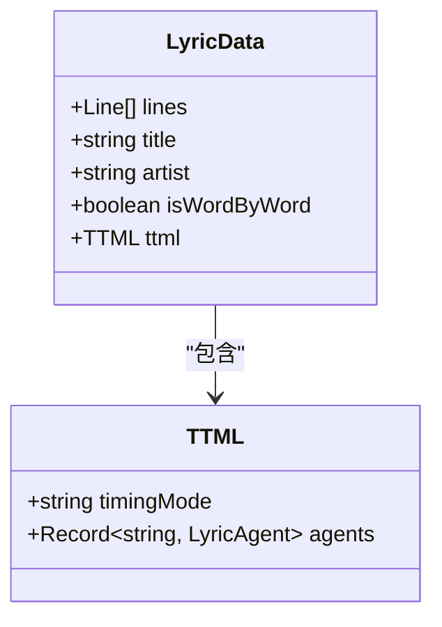
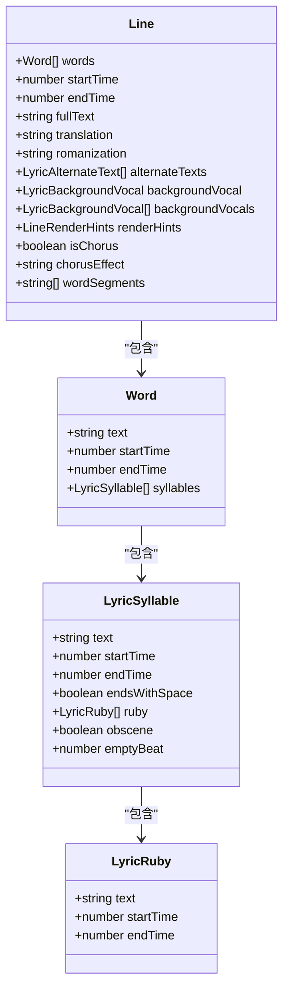
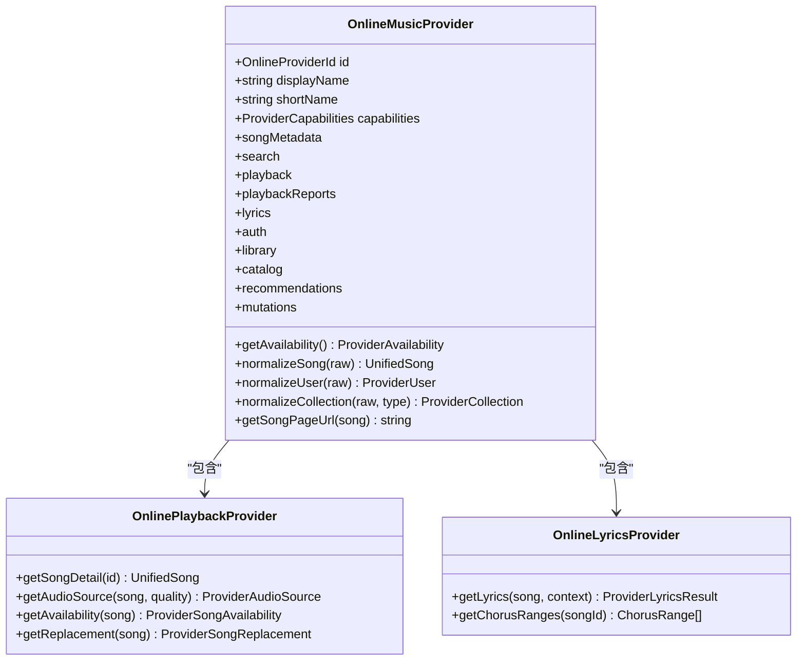
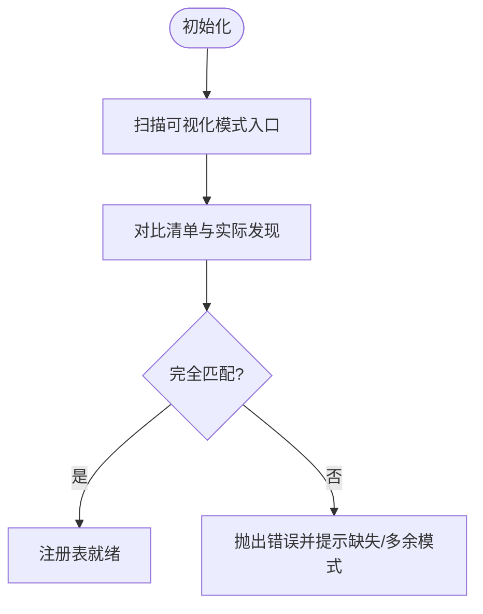
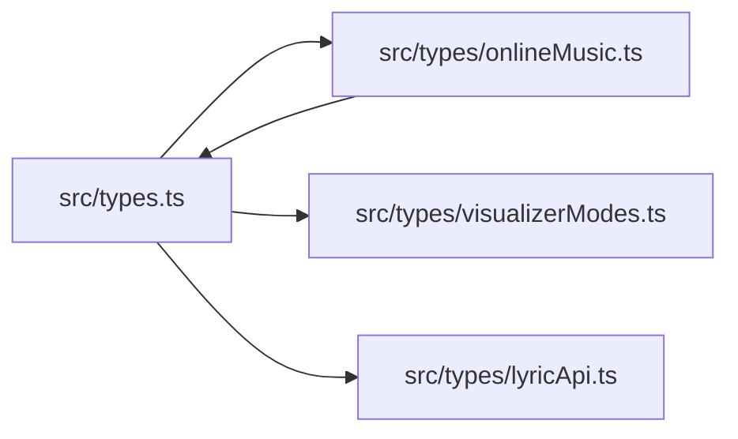

# 数据类型定义

<cite>
**本文引用的文件**   
- [src/types.ts](file://src/types.ts)
- [src/types/onlineMusic.ts](file://src/types/onlineMusic.ts)
- [src/types/visualizerModes.ts](file://src/types/visualizerModes.ts)
- [src/types/lyricApi.ts](file://src/types/lyricApi.ts)
</cite>

## 目录
1. [引言](#引言)
2. [项目结构](#项目结构)
3. [核心播放与队列类型](#核心播放与队列类型)
4. [歌词系统数据模型](#歌词系统数据模型)
5. [在线音乐服务接口规范](#在线音乐服务接口规范)
6. [可视化模式与配置类型](#可视化模式与配置类型)
7. [枚举、常量与泛型约束](#枚举常量与泛型约束)
8. [依赖关系分析](#依赖关系分析)
9. [性能与健壮性建议](#性能与健壮性建议)
10. [故障排查指南](#故障排查指南)
11. [结论](#结论)

## 引言
本文面向 Folia Major 的开发者与维护者，系统性梳理音乐播放、歌词、在线音乐服务以及可视化模式相关的数据类型。文档重点覆盖以下目标：
- 明确 SongResult、PlayerState、QueueItem 等核心实体的字段含义与约束。
- 说明 LyricData、LyricSegment、TimeLinePoint 等歌词相关类型的结构与用途。
- 解释 ProviderResponse、SearchResult、PlaylistInfo 等在线音乐服务接口的契约。
- 描述 VisualizerConfig、AnimationParams、RenderContext 等可视化类型的使用方式。
- 汇总枚举、常量与泛型约束，帮助读者快速建立准确的数据类型参考。

需要特别说明的是：仓库中部分名称（如 QueueItem、ProviderResponse、SearchResult、PlaylistInfo、VisualizerConfig、AnimationParams、RenderContext）在顶层 types 或 onlineMusic 中以不同命名出现，例如 StagePlayerQueueItem、ProviderPage、UnifiedSong、ProviderCollection、OnlineMusicProvider 等。本文会同时给出“用户期望名称”和“代码实际名称”的对照，避免误解。

## 项目结构
Folia Major 的核心类型主要分布在以下位置：
- src/types.ts：应用级通用类型，包括歌词基础结构、播放器状态、歌曲结果、本地库、统一歌曲、音频频段等。
- src/types/onlineMusic.ts：在线音乐提供者抽象、能力声明、资源引用、错误类型、分页、收藏集合等。
- src/types/visualizerModes.ts：内建可视化模式清单与校验工具。
- src/types/lyricApi.ts：桌面端歌词服务的运行时状态。

**图表来源**
- [src/types.ts:76-85](file://src/types.ts#L76-L85)
- [src/types.ts:1288-1313](file://src/types.ts#L1288-L1313)
- [src/types/onlineMusic.ts:337-357](file://src/types/onlineMusic.ts#L337-L357)
- [src/types/onlineMusic.ts:74-79](file://src/types/onlineMusic.ts#L74-L79)
- [src/types/onlineMusic.ts:202-212](file://src/types/onlineMusic.ts#L202-L212)
- [src/types/visualizerModes.ts:15-30](file://src/types/visualizerModes.ts#L15-L30)
- [src/types/lyricApi.ts:4-10](file://src/types/lyricApi.ts#L4-L10)

**章节来源**
- [src/types.ts:1-1489](file://src/types.ts#L1-L1489)
- [src/types/onlineMusic.ts:1-380](file://src/types/onlineMusic.ts#L1-L380)
- [src/types/visualizerModes.ts:1-75](file://src/types/visualizerModes.ts#L1-L75)
- [src/types/lyricApi.ts:1-11](file://src/types/lyricApi.ts#L1-L11)

## 核心播放与队列类型
本节聚焦音乐播放相关的关键实体，尤其是 SongResult、PlayerState，以及与队列相关的 StagePlayerQueueItem 等。

### SongResult：统一歌曲结果
SongResult 是跨来源（在线、云盘、本地映射等）的统一歌曲表示，承载标题、艺人、专辑、时长、权限、ReplayGain、在线歌词状态、匹配来源等信息。它被扩展为 UnifiedSong，以支持本地文件和 Navidrome 源。

关键字段与约束要点：
- id：媒体标识，类型为 MediaId（字符串或数字）。
- name：歌曲名。
- artists：艺人列表。
- album：专辑信息。
- durationMs：时长（毫秒）。
- isPureMusic：是否纯音乐。
- aliases / translatedNames：别名与译名。
- t：业务标记位（0|1|2）。
- sourceType：来源类型（netease/cloud）。
- sourceRef：播放来源引用（在线/本地/navidrome/stage）。
- playbackSourceRevision：用于拒绝陈旧字节流的身份标识。
- fee / privilege：付费与权限信息。
- noCopyrightRcmd：无版权推荐。
- resourceState：资源可用状态。
- onlineLyricsState：在线歌词状态。
- matchedLyricsSource / matchedLyricsProviderPlatform：歌词匹配来源与平台。
- replayGain：重放增益信息。
- qqMid / kgHash / amllDbPlatform：第三方平台标识。

**图表来源**
- [src/types.ts:1288-1313](file://src/types.ts#L1288-L1313)
- [src/types.ts:1468-1474](file://src/types.ts#L1468-L1474)

**章节来源**
- [src/types.ts:1288-1313](file://src/types.ts#L1288-L1313)
- [src/types.ts:1468-1474](file://src/types.ts#L1468-L1474)

### PlayerState：播放器状态枚举
PlayerState 使用枚举表达播放器的三种基本状态：空闲、播放中、暂停。该枚举常用于 UI 状态同步与逻辑分支判断。

**图表来源**
- [src/types.ts:1199-1203](file://src/types.ts#L1199-L1203)

**章节来源**
- [src/types.ts:1199-1203](file://src/types.ts#L1199-L1203)

### QueueItem：队列项
在顶层 types 中未直接定义名为 QueueItem 的类型；与之对应的是 StagePlayerQueueItem，它是 StagePlayerCurrent 的扩展，增加 queueItemId 以标识队列中的具体条目。

StagePlayerQueueItem 关键字段：
- id：当前条目标识。
- source：来源标识。
- title / artist / album：曲目基本信息。
- durationMs：时长。
- coverUrl：封面地址。
- queueItemId：队列项唯一标识。

此外，StagePlayerQueueSnapshot 与 StagePlayerQueueWindow 提供队列快照与窗口化查询能力，包含 currentIndex、length、items、offset、limit、returned、hasMore、nextOffset 等字段，便于前端高效渲染与滚动加载。

**图表来源**
- [src/types.ts:259-267](file://src/types.ts#L259-L267)
- [src/types.ts:287-289](file://src/types.ts#L287-L289)
- [src/types.ts:297-308](file://src/types.ts#L297-L308)

**章节来源**
- [src/types.ts:259-267](file://src/types.ts#L259-L267)
- [src/types.ts:287-308](file://src/types.ts#L287-L308)

## 歌词系统数据模型
歌词系统围绕结构化行、词、音节、注音、翻译、罗马音、背景人声、渲染提示等进行建模，并支持多种输入格式与来源。

### LyricData：歌词数据结构
LyricData 是歌词的主容器，包含：
- lines：歌词行数组。
- title / artist：可选的标题与艺人。
- isWordByWord：是否逐字模式。
- ttml：TTML 扩展，包含 timingMode 与 agents 映射。

**图表来源**
- [src/types.ts:76-85](file://src/types.ts#L76-L85)

**章节来源**
- [src/types.ts:76-85](file://src/types.ts#L76-L85)

### Line、Word、LyricRuby、LyricSyllable：歌词细粒度结构
- Line：一行歌词，包含 words、startTime、endTime、fullText，以及 translation、romanization、alternateTexts、backgroundVocal(s)、renderHints、isChorus、chorusEffect、wordSegments 等。
- Word：一个词，包含 text、startTime、endTime、syllables。
- LyricRuby：注音，包含 text、startTime、endTime。
- LyricSyllable：音节，包含 text、startTime、endTime、endsWithSpace、ruby、obscene、emptyBeat。

这些结构共同支撑逐字高亮、多语言翻译、罗马音、背景人声、段落标记与渲染优化。

**图表来源**
- [src/types.ts:28-74](file://src/types.ts#L28-L74)

**章节来源**
- [src/types.ts:28-74](file://src/types.ts#L28-L74)

### LyricSegment、TimeLinePoint：歌词分段与时间轴点
在提供的源码范围内，未找到名为 LyricSegment 或 TimeLinePoint 的直接类型定义。歌词分段与时间轴功能更多由 utils/lyrics 下的解析器与渲染辅助实现（例如 lrcParser、yrcParser、webLyricSource 等），以及 StageLyricsSession 等会话结构承载歌词来源与更新时间。若需严格依据仓库内容，应视为“未在顶层类型中显式定义”，而由其他模块内部实现。

**章节来源**
- [src/types.ts:193-199](file://src/types.ts#L193-L199)

## 在线音乐服务接口规范
在线音乐服务通过一组 Provider 接口暴露搜索、播放、歌词、认证、收藏、目录、推荐与变更能力。公共契约集中在 src/types/onlineMusic.ts。

### ProviderCapabilities：提供者能力声明
ProviderCapabilities 描述一个在线音乐提供者支持的功能集，包括 search、playback、lyrics、auth、userLibrary、playlists、albums、artists、recommendations、mutations、personalFmModes、wordByWordLyrics、userCloud、historyRecommendations、playlistSubscription、playlistTrackMutations、likes、userAlbums、playbackReports 等。

**章节来源**
- [src/types/onlineMusic.ts:31-53](file://src/types/onlineMusic.ts#L31-L53)

### ProviderPage：分页响应
ProviderPage<T> 是通用的分页结构，包含 items、total、hasMore、nextOffset。

**章节来源**
- [src/types/onlineMusic.ts:74-79](file://src/types/onlineMusic.ts#L74-L79)

### ProviderCollection：集合（歌单/专辑/艺人/电台/云盘）
ProviderCollection 描述在线平台的集合实体，包含 id、name、type、coverUrl、description、trackCount、albumCount、isOwned、creator、artists、aliases、publishedAt、publisher、playCount、updatedAt、tracksUpdatedAt、isLiked、providerData 等。

**章节来源**
- [src/types/onlineMusic.ts:154-174](file://src/types/onlineMusic.ts#L154-L174)

### OnlineMusicProvider：在线音乐提供者主接口
OnlineMusicProvider 聚合多个子能力接口：
- id / displayName / shortName：提供者标识与显示名。
- getAvailability：可用性检查。
- capabilities：能力声明。
- normalizeSong / normalizeUser / normalizeCollection：原始数据规范化。
- songMetadata：元数据增强。
- getSongPageUrl：歌曲页面链接。
- search：搜索。
- playback：播放与音质选择。
- playbackReports：播放报告。
- lyrics：歌词获取。
- auth：认证与扫码登录。
- library：用户收藏与歌单。
- catalog：目录与专辑/艺人/歌单详情。
- recommendations：推荐与个人 FM。
- mutations：点赞、更新歌单、订阅等变更操作。

**图表来源**
- [src/types/onlineMusic.ts:337-357](file://src/types/onlineMusic.ts#L337-L357)
- [src/types/onlineMusic.ts:218-223](file://src/types/onlineMusic.ts#L218-L223)
- [src/types/onlineMusic.ts:243-246](file://src/types/onlineMusic.ts#L243-L246)

**章节来源**
- [src/types/onlineMusic.ts:337-357](file://src/types/onlineMusic.ts#L337-L357)
- [src/types/onlineMusic.ts:218-223](file://src/types/onlineMusic.ts#L218-L223)
- [src/types/onlineMusic.ts:243-246](file://src/types/onlineMusic.ts#L243-L246)

### SearchResult、PlaylistInfo、ProviderResponse：名称对照
- SearchResult：在顶层 types 中未直接定义名为 SearchResult 的类型；与之最接近的是 SearchResponse（包含 result.songs、result.songCount、code），以及 OnlineSearchProvider.searchSongs 返回 ProviderPage<UnifiedSong>。
- PlaylistInfo：未直接定义；与之对应的是 ProviderCollection（type 可为 'playlist'）与 OnlineCatalogProvider.getPlaylistDetail/getPlaylistTracks。
- ProviderResponse：未直接定义；与之对应的是 ProviderPage、SearchResponse、ProviderCollection 等具体响应结构。

因此，当外部文档或调用方使用 SearchResult、PlaylistInfo、ProviderResponse 时，应映射到：
- SearchResult → SearchResponse 或 ProviderPage<UnifiedSong>
- PlaylistInfo → ProviderCollection
- ProviderResponse → 根据上下文选择 ProviderPage / SearchResponse / ProviderCollection

**章节来源**
- [src/types.ts:1327-1333](file://src/types.ts#L1327-L1333)
- [src/types/onlineMusic.ts:74-79](file://src/types/onlineMusic.ts#L74-L79)
- [src/types/onlineMusic.ts:154-174](file://src/types/onlineMusic.ts#L154-L174)
- [src/types/onlineMusic.ts:288-300](file://src/types/onlineMusic.ts#L288-L300)

## 可视化模式与配置类型
可视化模式涉及主题、内置模式清单、背景模式、各模式的调优参数与默认值。

### VisualizerMode 与内建模式清单
- VisualizerMode：允许内建模式或任意字符串（用于 mod 投稿模式）。
- BUILTIN_VISUALIZER_MODES：权威的内建模式列表，包含 classic、cadenza、cappella、claddagh、diorama、fume、lumiere、monet、partita、pendolo、sonnet、still、tempera、tilt。
- DEFAULT_VISUALIZER_MODE：默认模式为 classic。
- isBuiltinVisualizerMode：判定是否为内建模式。
- assertBuiltinModeList：初始化断言，确保清单与 entry 目录一致。

**图表来源**
- [src/types/visualizerModes.ts:15-30](file://src/types/visualizerModes.ts#L15-L30)
- [src/types/visualizerModes.ts:42-43](file://src/types/visualizerModes.ts#L42-L43)
- [src/types/visualizerModes.ts:51-52](file://src/types/visualizerModes.ts#L51-L52)
- [src/types/visualizerModes.ts:60-73](file://src/types/visualizerModes.ts#L60-L73)

**章节来源**
- [src/types/visualizerModes.ts:1-75](file://src/types/visualizerModes.ts#L1-L75)

### 可视化调优参数（示例）
- ClassicTuning / CadenzaTuning / PartitaTuning / FumeTuning / CladdaghTuning / CappellaTuning / TiltTuning / PendoloTuning / SonnetTuning / TemperaTuning / LumiereTuning / DioramaTuning / MonetTuning 等，均提供详细可调参数与默认值。
- 背景模式包括 MonetBackgroundTuning、NomandBackgroundTuning、LatentBackgroundTuning、SoraBackgroundTuning、TideBackgroundTuning 等。

这些类型主要用于 UI 设置面板与渲染引擎的参数传递，不在此展开全部字段，但可参考相应接口定义。

**章节来源**
- [src/types.ts:389-401](file://src/types.ts#L389-L401)
- [src/types.ts:403-417](file://src/types.ts#L403-L417)
- [src/types.ts:419-431](file://src/types.ts#L419-L431)
- [src/types.ts:433-453](file://src/types.ts#L433-L453)
- [src/types.ts:455-469](file://src/types.ts#L455-L469)
- [src/types.ts:474-484](file://src/types.ts#L474-L484)
- [src/types.ts:488-498](file://src/types.ts#L488-L498)
- [src/types.ts:500-524](file://src/types.ts#L500-L524)
- [src/types.ts:528-579](file://src/types.ts#L528-L579)
- [src/types.ts:619-694](file://src/types.ts#L619-L694)
- [src/types.ts:701-780](file://src/types.ts#L701-L780)
- [src/types.ts:841-898](file://src/types.ts#L841-L898)
- [src/types.ts:919-1045](file://src/types.ts#L919-L1045)
- [src/types.ts:1047-1145](file://src/types.ts#L1047-L1145)
- [src/types.ts:1110-1133](file://src/types.ts#L1110-L1133)

### VisualizerConfig、AnimationParams、RenderContext：名称对照
在提供的源码范围内，未找到名为 VisualizerConfig、AnimationParams、RenderContext 的直接类型定义。可视化配置通常由各模式的 Tuning 类型与 Theme 组合而成；动画参数与渲染上下文可能由组件层或渲染引擎内部持有。若需严格依据仓库内容，应视为“未在顶层类型中显式定义”。

**章节来源**
- [src/types.ts:87-102](file://src/types.ts#L87-L102)
- [src/types.ts:120-122](file://src/types.ts#L120-L122)

## 枚举、常量与泛型约束
### 枚举
- PlayerState：IDLE、PLAYING、PAUSED。

**章节来源**
- [src/types.ts:1199-1203](file://src/types.ts#L1199-L1203)

### 常量
- DEFAULT_CLASSIC_TUNING / DEFAULT_CADENZA_TUNING / DEFAULT_PARTITA_TUNING / DEFAULT_FUME_TUNING / DEFAULT_CLADDAGH_TUNING / DEFAULT_CAPPELLA_TUNING / DEFAULT_TILT_TUNING / DEFAULT_PENDOLO_TUNING / DEFAULT_SONNET_TUNING / DEFAULT_TEMPERA_TUNING / DEFAULT_LUMIERE_TUNING / DEFAULT_DIORAMA_GEOMETRY_VISIBILITY / DEFAULT_DIORAMA_TUNING / DEFAULT_MONET_BACKGROUND_TUNING / DEFAULT_NOMAND_BACKGROUND_TUNING / DEFAULT_LATENT_BACKGROUND_TUNING / DEFAULT_SORA_BACKGROUND_TUNING / DEFAULT_TIDE_BACKGROUND_TUNING / DEFAULT_MONET_TUNING / DEFAULT_VISUALIZER_MODE / DEFAULT_VISUALIZER_BACKGROUND_MODE。
- DIORAMA_* 系列常量：粒子密度、圆周、径向、缩放、辉光强度等范围与步长。
- TEMPERA_MAX_LAYER_IMAGES：Tempera 图层图片上限。

**章节来源**
- [src/types.ts:396-401](file://src/types.ts#L396-L401)
- [src/types.ts:411-417](file://src/types.ts#L411-L417)
- [src/types.ts:426-431](file://src/types.ts#L426-L431)
- [src/types.ts:444-453](file://src/types.ts#L444-L453)
- [src/types.ts:463-469](file://src/types.ts#L463-L469)
- [src/types.ts:480-484](file://src/types.ts#L480-L484)
- [src/types.ts:494-498](file://src/types.ts#L494-L498)
- [src/types.ts:513-524](file://src/types.ts#L513-L524)
- [src/types.ts:558-579](file://src/types.ts#L558-L579)
- [src/types.ts:609-617](file://src/types.ts#L609-L617)
- [src/types.ts:672-694](file://src/types.ts#L672-L694)
- [src/types.ts:757-780](file://src/types.ts#L757-L780)
- [src/types.ts:807-839](file://src/types.ts#L807-L839)
- [src/types.ts:878-898](file://src/types.ts#L878-L898)
- [src/types.ts:1047-1145](file://src/types.ts#L1047-L1145)
- [src/types.ts:1110-1133](file://src/types.ts#L1110-L1133)
- [src/types/visualizerModes.ts:42-43](file://src/types/visualizerModes.ts#L42-L43)

### 泛型与联合类型
- ProviderPage<T>：泛型分页。
- PlaybackSourceRef：联合类型，区分 online/local/navidrome/stage。
- StageLyricSource：联合类型，区分 embedded/local/netease/navidrome/qrc。
- VisualizerMode / VisualizerBackgroundMode：允许内建模式加任意字符串（mod 模式）。
- SubtitleContentMode：translation | romanization | none。
- HomeViewTab：playlist | local | albums | navidrome | radio。
- PlaybackContext：main | stage。
- StageSource：stage-api | now-playing | playercap。
- StageLoopMode：off | all | one。
- QueueAddBehavior：append | next。
- StageActiveEntryKind：lyrics | media。
- AudioQualityPreference：standard | high | lossless | hires。
- ProviderCatalogEntityKind：album | artist | playlist。
- QrLoginState：waiting | scanned | confirmed | expired | error。
- QrLoginFailureKind：start-error | check-error | expired-after-scan | account-refresh-failed。
- ProviderErrorCode：auth-required | unsupported | not-public | unavailable | not-playable | network | invalid-response。

**章节来源**
- [src/types/onlineMusic.ts:5-8](file://src/types/onlineMusic.ts#L5-L8)
- [src/types/onlineMusic.ts:19-29](file://src/types/onlineMusic.ts#L19-L29)
- [src/types/onlineMusic.ts:74-79](file://src/types/onlineMusic.ts#L74-L79)
- [src/types.ts:46-46](file://src/types.ts#L46-L46)
- [src/types.ts:124-130](file://src/types.ts#L124-L130)
- [src/types.ts:126-130](file://src/types.ts#L126-L130)
- [src/types.ts:186-191](file://src/types.ts#L186-L191)
- [src/types.ts:120-122](file://src/types.ts#L120-L122)
- [src/types/onlineMusic.ts:176-181](file://src/types/onlineMusic.ts#L176-L181)
- [src/types/onlineMusic.ts:185-200](file://src/types/onlineMusic.ts#L185-L200)

## 依赖关系分析
类型之间的依赖主要体现在：
- SongResult 依赖 Artist、Album、PlaybackSourceRef、OnlineLyricsState、LyricProviderSource、AmllDbPlatform、ReplayGainInfo。
- UnifiedSong 扩展 SongResult，引入 LocalSongReference 与 Navidrome 数据。
- OnlineMusicProvider 聚合多个子接口，形成松耦合的提供者抽象。
- visualizerModes.ts 仅依赖 types.ts 中的 VisualizerMode 与 VisualizerBackgroundMode，保持轻量校验职责。
- lyricApi.ts 独立于其他类型，仅提供歌词服务运行状态。

**图表来源**
- [src/types.ts:1288-1313](file://src/types.ts#L1288-L1313)
- [src/types/onlineMusic.ts:1-5](file://src/types/onlineMusic.ts#L1-L5)
- [src/types/visualizerModes.ts:1-2](file://src/types/visualizerModes.ts#L1-L2)
- [src/types/lyricApi.ts:1-2](file://src/types/lyricApi.ts#L1-L2)

**章节来源**
- [src/types.ts:1288-1313](file://src/types.ts#L1288-L1313)
- [src/types/onlineMusic.ts:1-5](file://src/types/onlineMusic.ts#L1-L5)
- [src/types/visualizerModes.ts:1-2](file://src/types/visualizerModes.ts#L1-L2)
- [src/types/lyricApi.ts:1-2](file://src/types/lyricApi.ts#L1-L2)

## 性能与健壮性建议
- 使用 playbackSourceRevision 防止陈旧字节流导致的播放异常。
- 对 ProviderPage 的 hasMore 与 nextOffset 进行边界检查，避免无限请求。
- 在歌词渲染中利用 renderHints、isChorus、chorusEffect 等字段减少不必要的计算与绘制。
- 使用 isBuiltinVisualizerMode 与 assertBuiltinModeList 保证可视化模式清单一致性，避免运行时崩溃。
- 对于大型歌词数据集，优先使用 Line.wordSegments 与 Word.syllables 的精细控制，避免过度分割带来的性能开销。

[本节为通用建议，不直接分析具体文件]

## 故障排查指南
- 在线提供者错误：使用 OnlineProviderError 的 code 与 message 定位问题，常见码包括 auth-required、unsupported、not-public、unavailable、not-playable、network、invalid-response。
- 二维码登录失败：QrLoginState 与 QrLoginFailureKind 帮助区分等待、扫描、确认、过期、错误等阶段，结合 getQrLoginDiagnostics 输出诊断信息。
- 歌词服务状态：LyricApiStatus 的 enabled、running、port、url、error 字段可用于检查桌面端歌词服务是否正常运行。

**章节来源**
- [src/types/onlineMusic.ts:202-212](file://src/types/onlineMusic.ts#L202-L212)
- [src/types/onlineMusic.ts:176-181](file://src/types/onlineMusic.ts#L176-L181)
- [src/types/onlineMusic.ts:185-200](file://src/types/onlineMusic.ts#L185-L200)
- [src/types/lyricApi.ts:4-10](file://src/types/lyricApi.ts#L4-L10)

## 结论
本文基于仓库源码，系统梳理了 Folia Major 中与音乐播放、歌词、在线音乐服务、可视化模式相关的数据类型。针对用户期望的名称（如 QueueItem、ProviderResponse、SearchResult、PlaylistInfo、VisualizerConfig、AnimationParams、RenderContext），给出了与代码实际定义的映射关系，并提供了类图、流程图与状态图以帮助理解。开发者可据此建立准确的数据类型参考，并在扩展功能时遵循现有约束与最佳实践。