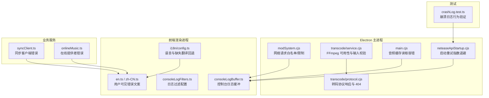
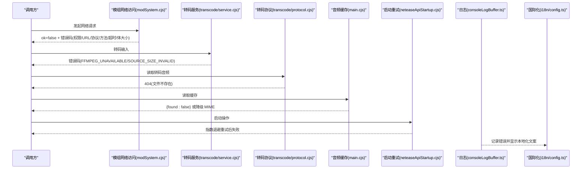
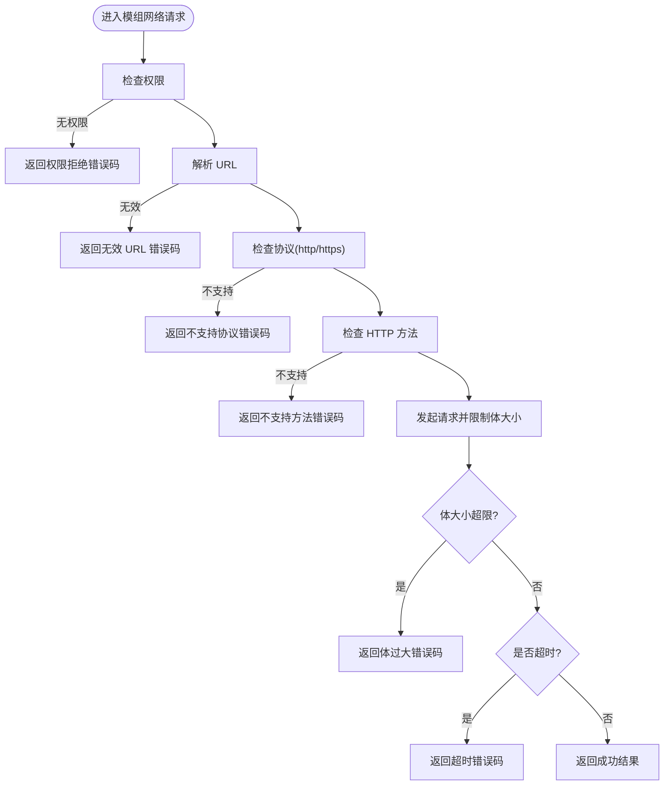
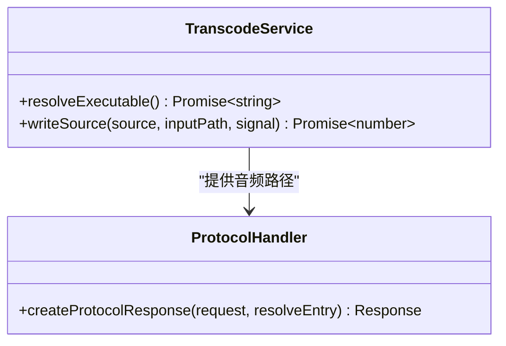
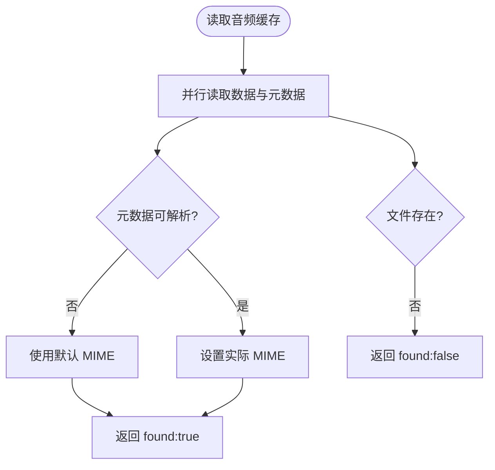
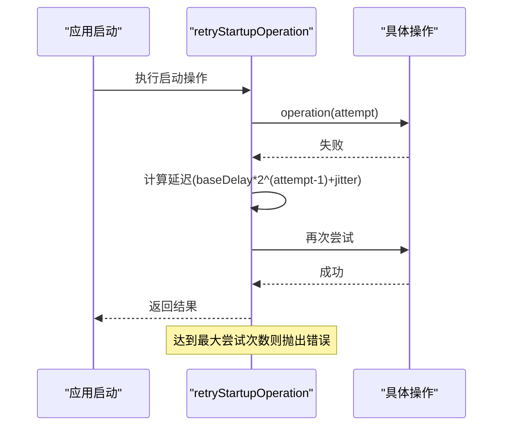
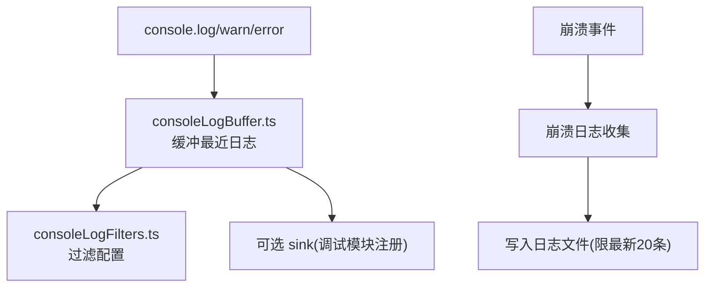
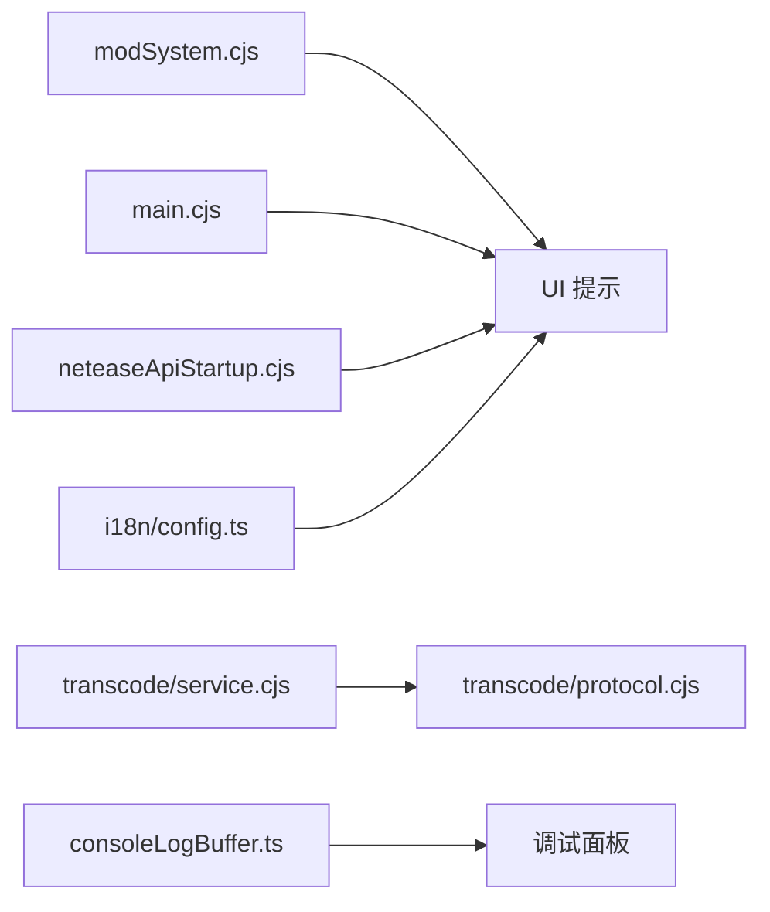

# 错误处理规范

<cite>
**本文引用的文件**   
- [electron/transcode/service.cjs](file://electron/transcode/service.cjs)
- [electron/transcode/protocol.cjs](file://electron/transcode/protocol.cjs)
- [electron/main.cjs](file://electron/main.cjs)
- [electron/modSystem/modSystem.cjs](file://electron/modSystem/modSystem.cjs)
- [electron/neteaseApiStartup.cjs](file://electron/neteaseApiStartup.cjs)
- [src/services/sync/syncClient.ts](file://src/services/sync/syncClient.ts)
- [src/types/onlineMusic.ts](file://src/types/onlineMusic.ts)
- [src/utils/consoleLogBuffer.ts](file://src/utils/consoleLogBuffer.ts)
- [src/utils/consoleLogFilters.ts](file://src/utils/consoleLogFilters.ts)
- [src/i18n/config.ts](file://src/i18n/config.ts)
- [src/i18n/locales/en.ts](file://src/i18n/locales/en.ts)
- [src/i18n/locales/zh-CN.ts](file://src/i18n/locales/zh-CN.ts)
- [test/unit/electron/crashLog.test.ts](file://test/unit/electron/crashLog.test.ts)
</cite>

## 目录
1. [引言](#引言)
2. [项目结构](#项目结构)
3. [核心组件](#核心组件)
4. [架构总览](#架构总览)
5. [详细组件分析](#详细组件分析)
6. [依赖关系分析](#依赖关系分析)
7. [性能与稳定性考虑](#性能与稳定性考虑)
8. [故障排查指南](#故障排查指南)
9. [结论](#结论)
10. [附录：错误分类与恢复策略速查](#附录错误分类与恢复策略速查)

## 引言
本规范面向 Folia Major 的错误处理体系，覆盖错误分类、错误码规范、异常处理流程、日志与崩溃报告、以及错误恢复策略。目标是让开发者在浏览器渲染进程、Electron 主进程、转码服务、在线服务调用等边界上，都能以一致的方式捕获、分类、上报并恢复错误，同时为用户提供可理解、可操作的提示。

## 项目结构
本项目错误处理相关代码分布在以下层次：
- Electron 主进程与系统能力层：网络访问限制、权限校验、转码可用性检查、启动重试、崩溃日志。
- 前端渲染进程层：控制台日志缓冲与过滤、国际化错误消息、UI 状态提示。
- 业务服务层：同步客户端错误、在线音乐提供者错误、音频缓存读取。
- 测试层：崩溃日志行为与边界条件的验证。

图示来源
- [electron/modSystem/modSystem.cjs:873-956](file://electron/modSystem/modSystem.cjs#L873-L956)
- [electron/transcode/service.cjs:128-151](file://electron/transcode/service.cjs#L128-L151)
- [electron/transcode/protocol.cjs:61-88](file://electron/transcode/protocol.cjs#L61-L88)
- [electron/main.cjs:3767-3806](file://electron/main.cjs#L3767-L3806)
- [electron/neteaseApiStartup.cjs:80-104](file://electron/neteaseApiStartup.cjs#L80-L104)
- [src/utils/consoleLogBuffer.ts:1-109](file://src/utils/consoleLogBuffer.ts#L1-L109)
- [src/utils/consoleLogFilters.ts:22-59](file://src/utils/consoleLogFilters.ts#L22-L59)
- [src/i18n/config.ts:84-113](file://src/i18n/config.ts#L84-L113)
- [src/i18n/locales/en.ts:121-223](file://src/i18n/locales/en.ts#L121-L223)
- [src/i18n/locales/zh-CN.ts:121-223](file://src/i18n/locales/zh-CN.ts#L121-L223)
- [src/services/sync/syncClient.ts:19-25](file://src/services/sync/syncClient.ts#L19-L25)
- [src/types/onlineMusic.ts:202-210](file://src/types/onlineMusic.ts#L202-L210)
- [test/unit/electron/crashLog.test.ts:98-218](file://test/unit/electron/crashLog.test.ts#L98-L218)

章节来源
- [electron/modSystem/modSystem.cjs:873-956](file://electron/modSystem/modSystem.cjs#L873-L956)
- [electron/transcode/service.cjs:128-151](file://electron/transcode/service.cjs#L128-L151)
- [electron/transcode/protocol.cjs:61-88](file://electron/transcode/protocol.cjs#L61-L88)
- [electron/main.cjs:3767-3806](file://electron/main.cjs#L3767-L3806)
- [electron/neteaseApiStartup.cjs:80-104](file://electron/neteaseApiStartup.cjs#L80-L104)
- [src/utils/consoleLogBuffer.ts:1-109](file://src/utils/consoleLogBuffer.ts#L1-L109)
- [src/utils/consoleLogFilters.ts:22-59](file://src/utils/consoleLogFilters.ts#L22-L59)
- [src/i18n/config.ts:84-113](file://src/i18n/config.ts#L84-L113)
- [src/i18n/locales/en.ts:121-223](file://src/i18n/locales/en.ts#L121-L223)
- [src/i18n/locales/zh-CN.ts:121-223](file://src/i18n/locales/zh-CN.ts#L121-L223)
- [src/services/sync/syncClient.ts:19-25](file://src/services/sync/syncClient.ts#L19-L25)
- [src/types/onlineMusic.ts:202-210](file://src/types/onlineMusic.ts#L202-L210)
- [test/unit/electron/crashLog.test.ts:98-218](file://test/unit/electron/crashLog.test.ts#L98-L218)

## 核心组件
- 网络访问与权限控制（Electron 主进程）
  - 对模组网络请求进行权限、URL、协议与方法白名单校验，返回结构化错误码。
  - 超时与体大小限制，避免资源滥用。
- 转码与音频解码容错
  - FFmpeg 不可用或输入尺寸非法时抛出明确错误码。
  - 转码协议层对文件不存在返回 404，避免上层崩溃。
- 音频缓存读取
  - 元数据解析失败降级为默认 MIME；文件缺失返回未命中结果而非抛错。
- 启动重试机制
  - 网易云 API 启动采用指数退避加抖动重试，最终耗尽次数后抛出错误。
- 控制台日志缓冲与过滤
  - 记录最近若干行日志，支持按作用域和级别隐藏，持久化过滤配置。
- 国际化错误消息
  - i18next 初始化、语言检测、缺失键中文回退，统一对外展示错误文案。
- 业务错误类型
  - 同步客户端错误类、在线提供者错误类，便于区分错误来源。

章节来源
- [electron/modSystem/modSystem.cjs:873-956](file://electron/modSystem/modSystem.cjs#L873-L956)
- [electron/transcode/service.cjs:128-151](file://electron/transcode/service.cjs#L128-L151)
- [electron/transcode/protocol.cjs:61-88](file://electron/transcode/protocol.cjs#L61-L88)
- [electron/main.cjs:3767-3806](file://electron/main.cjs#L3767-L3806)
- [electron/neteaseApiStartup.cjs:80-104](file://electron/neteaseApiStartup.cjs#L80-L104)
- [src/utils/consoleLogBuffer.ts:1-109](file://src/utils/consoleLogBuffer.ts#L1-L109)
- [src/utils/consoleLogFilters.ts:22-59](file://src/utils/consoleLogFilters.ts#L22-L59)
- [src/i18n/config.ts:84-113](file://src/i18n/config.ts#L84-L113)
- [src/services/sync/syncClient.ts:19-25](file://src/services/sync/syncClient.ts#L19-L25)
- [src/types/onlineMusic.ts:202-210](file://src/types/onlineMusic.ts#L202-L210)

## 架构总览
错误处理贯穿“调用方 → 服务层 → 系统能力层 → 日志与 UI”的链路。关键路径包括：
- 模组网络请求：权限校验 → URL/协议/方法校验 → 超时与体大小限制 → 序列化错误。
- 转码流程：FFmpeg 可用性检查 → 输入校验 → 流式读取 → 协议响应。
- 音频缓存：并行读取数据与元数据 → 元数据解析容错 → 返回命中或未命中。
- 启动阶段：指数退避重试 → 回调通知 → 最终失败抛出。
- 日志与 UI：控制台缓冲 → 过滤 → 国际化文案 → 用户提示。

图示来源
- [electron/modSystem/modSystem.cjs:873-956](file://electron/modSystem/modSystem.cjs#L873-L956)
- [electron/transcode/service.cjs:128-151](file://electron/transcode/service.cjs#L128-L151)
- [electron/transcode/protocol.cjs:61-88](file://electron/transcode/protocol.cjs#L61-L88)
- [electron/main.cjs:3767-3806](file://electron/main.cjs#L3767-L3806)
- [electron/neteaseApiStartup.cjs:80-104](file://electron/neteaseApiStartup.cjs#L80-L104)
- [src/utils/consoleLogBuffer.ts:1-109](file://src/utils/consoleLogBuffer.ts#L1-L109)
- [src/i18n/config.ts:84-113](file://src/i18n/config.ts#L84-L113)

## 详细组件分析

### 网络错误与权限控制（Electron 主进程）
- 权限校验：若模组未声明所需权限，直接返回权限拒绝错误码。
- URL 校验：无效 URL 返回无效 URL 错误码。
- 协议与方法白名单：仅允许 http/https，且方法受限。
- 超时与体大小：超过最大体大小会中止读取并返回体过大错误；超时通过控制器信号判断。
- 错误序列化：非超时错误会被序列化后返回，便于上层分类处理。

图示来源
- [electron/modSystem/modSystem.cjs:873-956](file://electron/modSystem/modSystem.cjs#L873-L956)

章节来源
- [electron/modSystem/modSystem.cjs:873-956](file://electron/modSystem/modSystem.cjs#L873-L956)

### 音频解码与转码错误
- FFmpeg 可用性：若未打包或不可用，抛出 FFMPEG_UNAVAILABLE。
- 输入尺寸校验：本地音频为空或超出上限，抛出 SOURCE_SIZE_INVALID。
- 转码协议响应：文件不存在时返回 404，避免上层崩溃。

图示来源
- [electron/transcode/service.cjs:128-151](file://electron/transcode/service.cjs#L128-L151)
- [electron/transcode/protocol.cjs:61-88](file://electron/transcode/protocol.cjs#L61-L88)

章节来源
- [electron/transcode/service.cjs:128-151](file://electron/transcode/service.cjs#L128-L151)
- [electron/transcode/protocol.cjs:61-88](file://electron/transcode/protocol.cjs#L61-L88)

### 文件系统与权限错误
- 音频缓存读取：并行读取数据与元数据；元数据解析失败时忽略并保留默认 MIME；文件缺失返回未命中。
- 文件系统权限：本地歌曲需要重新授权或重新导入文件夹时，给出用户友好提示。

图示来源
- [electron/main.cjs:3767-3806](file://electron/main.cjs#L3767-L3806)

章节来源
- [electron/main.cjs:3767-3806](file://electron/main.cjs#L3767-L3806)

### 异步操作与 Promise 错误处理
- 启动重试：指数退避加抖动，最多 N 次尝试；每次失败回调 onRetry；耗尽后抛出错误。
- 渲染进程 Promise：常见模式为 .catch(() => {}) 忽略非关键错误，或在关键路径中完整捕获并上报。

图示来源
- [electron/neteaseApiStartup.cjs:80-104](file://electron/neteaseApiStartup.cjs#L80-L104)

章节来源
- [electron/neteaseApiStartup.cjs:80-104](file://electron/neteaseApiStartup.cjs#L80-L104)

### 日志记录机制
- 控制台日志缓冲：维护最近约 1000 条日志，包含时间戳、级别、作用域与文本；可通过 sink 扩展输出目标。
- 日志过滤：支持隐藏作用域与级别，配置持久化到 localStorage；存储失败时静默降级。
- 崩溃日志：Electron 主进程收集环境信息与堆栈，限制最新文件数量，防止磁盘写满；无法写入时不抛错。

图示来源
- [src/utils/consoleLogBuffer.ts:1-109](file://src/utils/consoleLogBuffer.ts#L1-L109)
- [src/utils/consoleLogFilters.ts:22-59](file://src/utils/consoleLogFilters.ts#L22-L59)
- [test/unit/electron/crashLog.test.ts:98-218](file://test/unit/electron/crashLog.test.ts#L98-L218)

章节来源
- [src/utils/consoleLogBuffer.ts:1-109](file://src/utils/consoleLogBuffer.ts#L1-L109)
- [src/utils/consoleLogFilters.ts:22-59](file://src/utils/consoleLogFilters.ts#L22-L59)
- [test/unit/electron/crashLog.test.ts:98-218](file://test/unit/electron/crashLog.test.ts#L98-L218)

### 错误码规范与业务错误扩展
- 标准错误码示例
  - 网络访问：permission-denied、net-invalid-url、net-unsupported-protocol、net-unsupported-method、net-body-too-large、net-timeout。
  - 转码：FFMPEG_UNAVAILABLE、SOURCE_SIZE_INVALID。
  - 协议：HTTP 404（文件不存在）。
- 业务错误类型
  - SyncClientError：同步客户端错误。
  - OnlineProviderError：在线音乐提供者错误。
- 扩展建议
  - 新增错误码应遵循语义清晰、前缀分域的原则（如 net-*、transcode-*）。
  - 将错误码与用户可见文案解耦，通过 i18n key 映射。

章节来源
- [electron/modSystem/modSystem.cjs:873-956](file://electron/modSystem/modSystem.cjs#L873-L956)
- [electron/transcode/service.cjs:128-151](file://electron/transcode/service.cjs#L128-L151)
- [electron/transcode/protocol.cjs:61-88](file://electron/transcode/protocol.cjs#L61-L88)
- [src/services/sync/syncClient.ts:19-25](file://src/services/sync/syncClient.ts#L19-L25)
- [src/types/onlineMusic.ts:202-210](file://src/types/onlineMusic.ts#L202-L210)

### 国际化支持与用户友好提示
- i18n 配置：支持 system/en/zh-CN/in 语言；缺失键通过中文回退；文档 lang 属性与托盘菜单语言同步。
- 错误文案：status.notifications 等命名空间下提供播放、同步、登录、转码等场景的用户可见文案。
- 最佳实践
  - 所有面向用户的错误信息必须走 i18n key，禁止硬编码字符串。
  - 对技术性错误（如错误码）仅在调试面板或崩溃报告中暴露。

章节来源
- [src/i18n/config.ts:84-113](file://src/i18n/config.ts#L84-L113)
- [src/i18n/locales/en.ts:121-223](file://src/i18n/locales/en.ts#L121-L223)
- [src/i18n/locales/zh-CN.ts:121-223](file://src/i18n/locales/zh-CN.ts#L121-L223)

## 依赖关系分析
- 低耦合高内聚
  - 网络访问限制集中在 modSystem.cjs，其他模块通过返回值中的 ok 与 error 字段消费。
  - 转码服务与协议分离，service.cjs 负责资源准备与校验，protocol.cjs 负责响应构造。
- 外部依赖
  - i18next 用于多语言；localStorage 用于日志过滤与语言偏好；Electron API 用于对话框与 Shell。
- 潜在循环依赖
  - consoleLogBuffer.ts 刻意保持无依赖，通过 sink 注入实现扩展，避免启动期依赖问题。

图示来源
- [electron/modSystem/modSystem.cjs:873-956](file://electron/modSystem/modSystem.cjs#L873-L956)
- [electron/transcode/service.cjs:128-151](file://electron/transcode/service.cjs#L128-L151)
- [electron/transcode/protocol.cjs:61-88](file://electron/transcode/protocol.cjs#L61-L88)
- [electron/main.cjs:3767-3806](file://electron/main.cjs#L3767-L3806)
- [electron/neteaseApiStartup.cjs:80-104](file://electron/neteaseApiStartup.cjs#L80-L104)
- [src/utils/consoleLogBuffer.ts:1-109](file://src/utils/consoleLogBuffer.ts#L1-L109)
- [src/i18n/config.ts:84-113](file://src/i18n/config.ts#L84-L113)

章节来源
- [electron/modSystem/modSystem.cjs:873-956](file://electron/modSystem/modSystem.cjs#L873-L956)
- [electron/transcode/service.cjs:128-151](file://electron/transcode/service.cjs#L128-L151)
- [electron/transcode/protocol.cjs:61-88](file://electron/transcode/protocol.cjs#L61-L88)
- [electron/main.cjs:3767-3806](file://electron/main.cjs#L3767-L3806)
- [electron/neteaseApiStartup.cjs:80-104](file://electron/neteaseApiStartup.cjs#L80-L104)
- [src/utils/consoleLogBuffer.ts:1-109](file://src/utils/consoleLogBuffer.ts#L1-L109)
- [src/i18n/config.ts:84-113](file://src/i18n/config.ts#L84-L113)

## 性能与稳定性考虑
- 日志缓冲上限：限制在约 1000 条，避免长会话内存增长。
- 崩溃日志轮转：只保留最新 20 条，防止崩溃循环写满磁盘。
- 启动重试退避：指数退避加随机抖动，降低雪崩风险。
- 网络体大小限制：避免大响应阻塞内存与带宽。
- 元数据解析容错：解析失败不影响正常播放，仅降级 MIME。

[本节为通用指导，无需列出具体文件来源]

## 故障排查指南
- 快速定位
  - 打开调试面板查看控制台日志缓冲，确认错误发生时的作用域与级别。
  - 检查国际化文案是否正确显示，必要时切换语言复现。
- 常见问题
  - 模组网络请求被拒：检查权限声明、URL 合法性、协议与方法是否在白名单。
  - 转码失败：确认 FFmpeg 可用，检查本地音频大小是否在支持范围。
  - 音频缓存未命中：检查文件是否存在，元数据是否损坏。
  - 启动失败：观察重试次数与延迟，确认后端服务可用性。
- 崩溃日志
  - 崩溃日志文件位于用户数据目录，最多保留 20 条；无法写入时不会抛错，需检查磁盘权限。

章节来源
- [src/utils/consoleLogBuffer.ts:1-109](file://src/utils/consoleLogBuffer.ts#L1-L109)
- [src/utils/consoleLogFilters.ts:22-59](file://src/utils/consoleLogFilters.ts#L22-L59)
- [electron/modSystem/modSystem.cjs:873-956](file://electron/modSystem/modSystem.cjs#L873-L956)
- [electron/transcode/service.cjs:128-151](file://electron/transcode/service.cjs#L128-L151)
- [electron/main.cjs:3767-3806](file://electron/main.cjs#L3767-L3806)
- [electron/neteaseApiStartup.cjs:80-104](file://electron/neteaseApiStartup.cjs#L80-L104)
- [test/unit/electron/crashLog.test.ts:98-218](file://test/unit/electron/crashLog.test.ts#L98-L218)

## 结论
Folia Major 的错误处理以“分类清晰、错误码规范、日志完备、恢复稳健”为核心原则。通过 Electron 主进程的权限与资源限制、转码与缓存的容错设计、启动阶段的指数退避重试、前端日志缓冲与国际化文案，系统在复杂环境下仍能保持稳定并提供友好的用户体验。建议在新增功能时严格遵循本规范，确保错误可观测、可诊断、可恢复。

[本节为总结性内容，无需列出具体文件来源]

## 附录：错误分类与恢复策略速查
- 网络错误
  - 分类：权限拒绝、无效 URL、不支持协议、不支持方法、体过大、超时。
  - 恢复：提示用户检查权限与网络；对超时可重试一次；体过大提示压缩或更换源。
- 音频解码与转码错误
  - 分类：FFmpeg 不可用、输入尺寸非法、协议 404。
  - 恢复：引导安装或修复 FFmpeg；提示重新选择音频；对 404 跳过或提示文件位置变更。
- 文件系统与权限错误
  - 分类：文件缺失、权限丢失、元数据损坏。
  - 恢复：重新授权文件或重新导入文件夹；降级 MIME 继续播放。
- 异步与启动错误
  - 分类：启动操作失败、Promise 未捕获。
  - 恢复：指数退避重试；对非关键 Promise 使用 .catch 忽略；关键路径完整捕获并上报。
- 日志与崩溃
  - 分类：控制台日志、崩溃日志。
  - 恢复：启用日志缓冲与过滤；检查崩溃日志文件；无法写入时不抛错。

[本节为概念性汇总，无需列出具体文件来源]