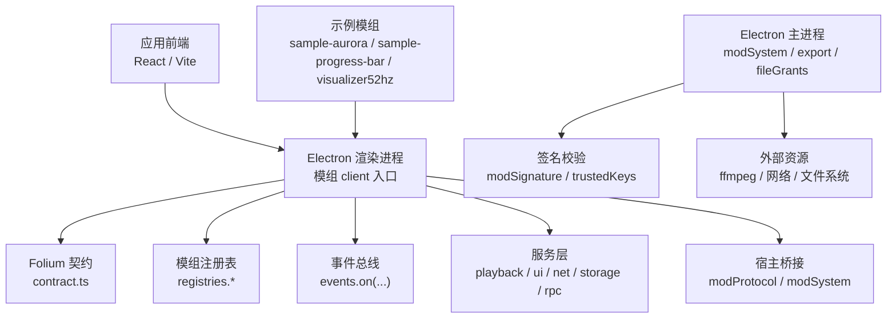
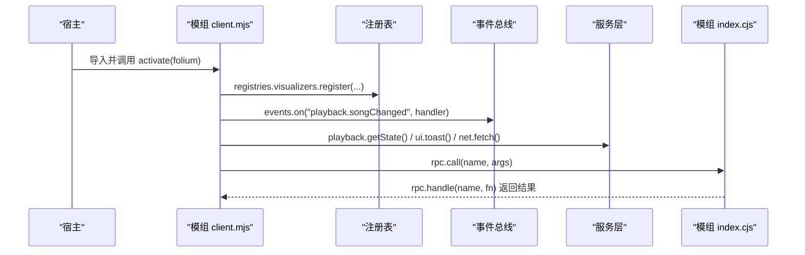
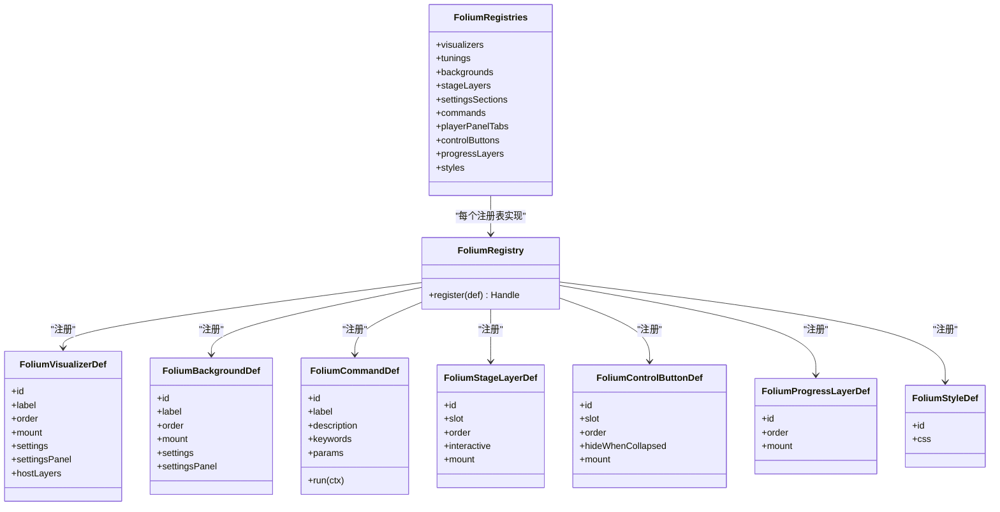
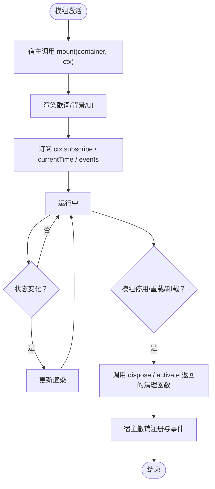
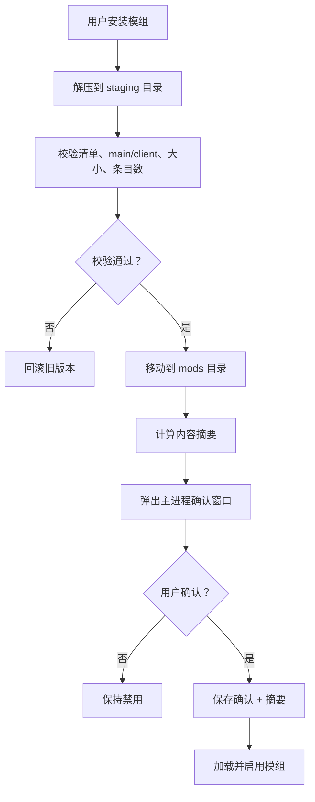
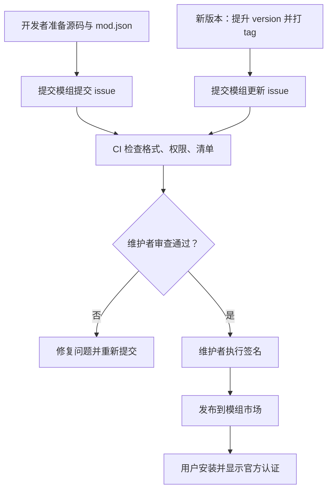
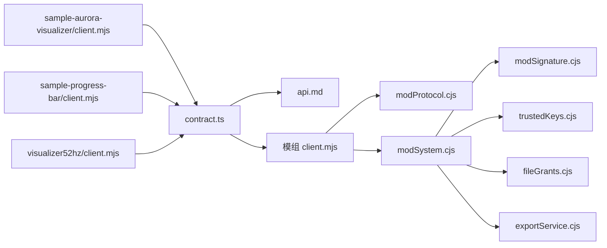
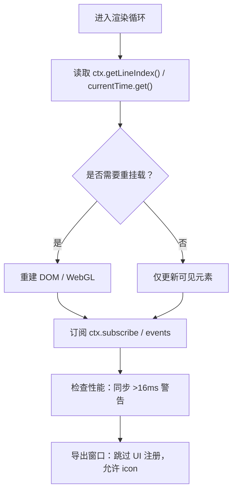
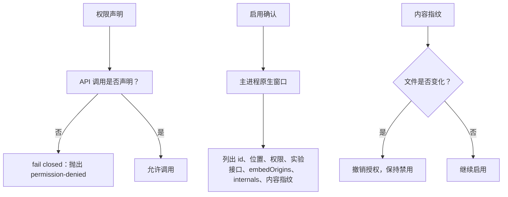
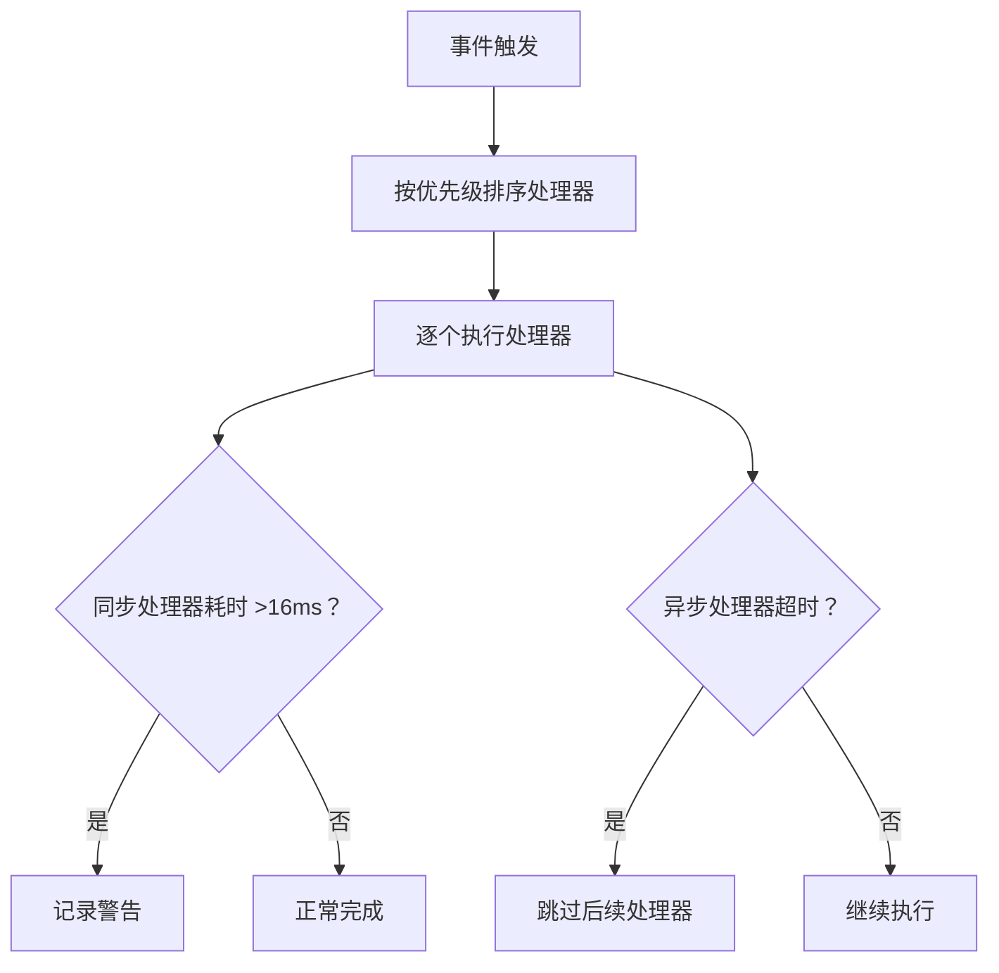

# Folium模组系统

<cite>
**本文引用的文件**   
- [mods/README.md](file://mods/README.md)
- [src/mods/folium/contract.ts](file://src/mods/folium/contract.ts)
- [docs/folium/api.md](file://docs/folium/api.md)
- [docs/folium/contributing.md](file://docs/folium/contributing.md)
- [electron/modSystem/modSignature.cjs](file://electron/modSystem/modSignature.cjs)
- [electron/modSystem/trustedKeys.cjs](file://electron/modSystem/trustedKeys.cjs)
- [electron/modSystem/modSystem.cjs](file://electron/modSystem/modSystem.cjs)
- [electron/modSystem/modProtocol.cjs](file://electron/modSystem/modProtocol.cjs)
- [electron/modSystem/fileGrants.cjs](file://electron/modSystem/fileGrants.cjs)
- [electron/modSystem/exportService.cjs](file://electron/modSystem/exportService.cjs)
- [mods/sample-aurora-visualizer/client.mjs](file://mods/sample-aurora-visualizer/client.mjs)
- [mods/sample-progress-bar/client.mjs](file://mods/sample-progress-bar/client.mjs)
- [mods/visualizer52hz/client.mjs](file://mods/visualizer52hz/client.mjs)
</cite>

## 目录
1. [引言](#引言)
2. [项目结构](#项目结构)
3. [核心组件](#核心组件)
4. [架构总览](#架构总览)
5. [详细组件分析](#详细组件分析)
6. [依赖关系分析](#依赖关系分析)
7. [性能与运行时特性](#性能与运行时特性)
8. [安全模型与沙箱边界](#安全模型与沙箱边界)
9. [模组市场工作流](#模组市场工作流)
10. [开发API与事件系统](#开发api与事件系统)
11. [调试、监控与错误处理](#调试监控与错误处理)
12. [从第一个模组到发布](#从第一个模组到发布)
13. [故障排查](#故障排查)
14. [结论](#结论)

## 引言
Folium 是 Folia Major 的模组平台，采用“注册表 + 事件总线 + 服务”的扩展模型：模组通过注册表向宿主注入歌词动画、背景、UI 扩展、命令等能力；通过事件总线介入播放、歌词、主题等生命周期；通过服务访问播放控制、网络、文件系统、导出等宿主能力。该系统的契约类型集中在 `src/mods/folium/contract.ts`，对外文档由 `docs/folium/api.md` 自动生成，规范与安全规则在 `mods/README.md` 中定义，开发与贡献指南在 `docs/folium/contributing.md` 中说明。

## 项目结构
Folium 相关代码分布在以下位置：
- 契约与 API 文档：`src/mods/folium/contract.ts`、`docs/folium/api.md`
- 平台规范与安全规则：`mods/README.md`
- Electron 主进程模组系统：`electron/modSystem/*`
- 示例模组：`mods/sample-*`、`mods/visualizer52hz`
- 开发指南：`docs/folium/contributing.md`

**图表来源**
- [src/mods/folium/contract.ts:1092-1183](file://src/mods/folium/contract.ts#L1092-L1183)
- [mods/README.md:155-189](file://mods/README.md#L155-L189)
- [electron/modSystem/modProtocol.cjs](file://electron/modSystem/modProtocol.cjs)
- [electron/modSystem/modSystem.cjs](file://electron/modSystem/modSystem.cjs)

**章节来源**
- [src/mods/folium/contract.ts:1-20](file://src/mods/folium/contract.ts#L1-L20)
- [mods/README.md:1-12](file://mods/README.md#L1-L12)

## 核心组件
Folium 的核心由四类对象组成：
- 客户端 API：`folium.registries`、`folium.events`、`folium.playback`、`folium.ui`、`folium.net`、`folium.storage`、`folium.rpc`、`folium.lyrics`、`folium.theme`、`folium.experimental`、`folium.internals`
- 注册表条目：歌词动画、背景、舞台图层、设置分区、命令、播放器面板标签、进度条按钮与轨道层、样式
- 上下文对象：`FoliumStageContext`、`FoliumBackgroundContext`、`FoliumPanelContext`、`FoliumSettingsPanelContext`、`FoliumProgressContext`
- 事件系统：通知型事件与钩子型事件，支持优先级和错误隔离

这些类型的完整定义来自契约文件，并在 API 文档中以表格形式列出。

**章节来源**
- [src/mods/folium/contract.ts:468-726](file://src/mods/folium/contract.ts#L468-L726)
- [src/mods/folium/contract.ts:728-834](file://src/mods/folium/contract.ts#L728-L834)
- [src/mods/folium/contract.ts:836-987](file://src/mods/folium/contract.ts#L836-L987)
- [docs/folium/api.md:111-373](file://docs/folium/api.md#L111-L373)
- [docs/folium/api.md:523-641](file://docs/folium/api.md#L523-L641)
- [docs/folium/api.md:643-740](file://docs/folium/api.md#L643-L740)

## 架构总览
Folium 的运行路径分为两条：
- 渲染端：模组 `client.mjs` 暴露默认函数 `activate(folium)`，宿主通过协议加载并执行，随后调用注册表、订阅事件、挂载 UI。
- 主进程：模组可选 `index.cjs` 暴露 Node 侧能力，通过 `api.rpc.handle` 与渲染端 `folium.rpc.call` 通信，负责导出、文件授权、网络代理等。

**图表来源**
- [mods/README.md:155-189](file://mods/README.md#L155-L189)
- [src/mods/folium/contract.ts:1092-1183](file://src/mods/folium/contract.ts#L1092-L1183)
- [docs/folium/api.md:77-109](file://docs/folium/api.md#L77-L109)

**章节来源**
- [mods/README.md:155-189](file://mods/README.md#L155-L189)
- [src/mods/folium/contract.ts:1092-1183](file://src/mods/folium/contract.ts#L1092-L1183)

## 详细组件分析

### 模组注册机制
Folium 提供统一的注册表接口：`register(def)` 返回 `{ id, unregister() }`，宿主为条目生成带命名空间的完整 ID。可注册的条目包括：
- 歌词动画模式：`registries.visualizers`
- 内置模式调参：`registries.tunings`
- 背景类型：`registries.backgrounds`
- 播放页图层：`registries.stageLayers`（需 `ui.stage`）
- 模组设置分区：`registries.settingsSections`
- 命令：`registries.commands`
- 播放器面板标签：`registries.playerPanelTabs`
- 进度条按钮：`registries.controlButtons`
- 进度条轨道层：`registries.progressLayers`
- 公开 CSS 样式：`registries.styles`

**图表来源**
- [src/mods/folium/contract.ts:468-726](file://src/mods/folium/contract.ts#L468-L726)
- [docs/folium/api.md:111-373](file://docs/folium/api.md#L111-L373)

**章节来源**
- [mods/README.md:190-209](file://mods/README.md#L190-L209)
- [src/mods/folium/contract.ts:468-726](file://src/mods/folium/contract.ts#L468-L726)

### 生命周期管理
模组的界面类条目统一遵循 `mount(container, ctx) => dispose?` 约定：
- 宿主创建容器，传入主题变量和上下文。
- 模组只操作容器内部 DOM。
- 宿主在移除容器时调用清理函数。
- `activate` 也可返回清理函数，用于释放定时器、帧循环、WebGL 上下文等。
- 模组禁用、重载或卸载时，宿主先调用清理函数，再撤销注册和事件处理器。

**图表来源**
- [mods/README.md:150-169](file://mods/README.md#L150-L169)
- [docs/folium/contributing.md:148-168](file://docs/folium/contributing.md#L148-L168)

**章节来源**
- [mods/README.md:150-169](file://mods/README.md#L150-L169)
- [docs/folium/contributing.md:148-168](file://docs/folium/contributing.md#L148-L168)

### 安全沙箱机制
Folium 明确声明：**模组不是沙箱**。`main` 拥有完整 Node.js 权限，`client` 运行在主窗口渲染进程，能读写界面内容。权限字段是功能开关，未声明的 API 调用会 fail closed，但不构成安全边界。

安全机制包括：
- 实验室总开关：关闭时不加载任何模组代码，已启用模组也会被停用。
- 二次确认：主进程原生确认窗口列出模组 id、安装位置、权限、实验接口、嵌入 origin、内部接口使用情况和内容指纹。
- 信任绑定到内容：确认结果与目录 sha256 一起保存，文件变化后撤销授权并保持禁用。
- 官方签名：仅表示“经过审查且未被改动”，不降低风险。
- 原子安装：zip 拖放安装先解压到 staging 目录校验，失败回滚。

**图表来源**
- [mods/README.md:32-48](file://mods/README.md#L32-L48)
- [mods/README.md:567-574](file://mods/README.md#L567-L574)

**章节来源**
- [mods/README.md:32-48](file://mods/README.md#L32-L48)
- [mods/README.md:567-574](file://mods/README.md#L567-L574)

### 模组市场工作流
模组市场收录流程如下：
1. 开发者维护公开源码仓库，包含 `mod.json`、预览图、第三方库许可证等。
2. 在 folium-compound 提交 issue，填写模组 id、仓库、版本 tag、模组目录、权限说明。
3. CI 解析 commit，检查格式、权限、实验接口、文件清单。
4. 维护者审查代码，通过后执行签名命令。
5. 签名后的模组发布到模组市场，显示“官方认证”。
6. 更新新版本时提升 `mod.json` 版本、打新 tag，再次提交更新 issue。

**图表来源**
- [docs/folium/contributing.md:195-237](file://docs/folium/contributing.md#L195-L237)
- [mods/README.md:50-86](file://mods/README.md#L50-L86)

**章节来源**
- [docs/folium/contributing.md:195-237](file://docs/folium/contributing.md#L195-L237)
- [mods/README.md:50-86](file://mods/README.md#L50-L86)

## 依赖关系分析
Folium 的依赖关系可以分为三类：
- 契约依赖：所有对外类型集中在 `contract.ts`，API 文档由其生成。
- 宿主依赖：`electron/modSystem` 中的模组加载、协议、签名、文件授权、导出服务。
- 示例依赖：示例模组展示不同注册表用法，如歌词动画、进度条增强、PixiJS 音频可视化。

**图表来源**
- [src/mods/folium/contract.ts:1-20](file://src/mods/folium/contract.ts#L1-L20)
- [docs/folium/api.md:1-9](file://docs/folium/api.md#L1-L9)
- [electron/modSystem/modProtocol.cjs](file://electron/modSystem/modProtocol.cjs)
- [electron/modSystem/modSystem.cjs](file://electron/modSystem/modSystem.cjs)
- [electron/modSystem/modSignature.cjs](file://electron/modSystem/modSignature.cjs)
- [electron/modSystem/trustedKeys.cjs](file://electron/modSystem/trustedKeys.cjs)
- [electron/modSystem/fileGrants.cjs](file://electron/modSystem/fileGrants.cjs)
- [electron/modSystem/exportService.cjs](file://electron/modSystem/exportService.cjs)
- [mods/sample-aurora-visualizer/client.mjs:120-127](file://mods/sample-aurora-visualizer/client.mjs#L120-L127)
- [mods/sample-progress-bar/client.mjs:72-103](file://mods/sample-progress-bar/client.mjs#L72-L103)
- [mods/visualizer52hz/client.mjs:68-83](file://mods/visualizer52hz/client.mjs#L68-L83)

**章节来源**
- [src/mods/folium/contract.ts:1-20](file://src/mods/folium/contract.ts#L1-L20)
- [docs/folium/api.md:1-9](file://docs/folium/api.md#L1-L9)
- [mods/sample-aurora-visualizer/client.mjs:120-127](file://mods/sample-aurora-visualizer/client.mjs#L120-L127)
- [mods/sample-progress-bar/client.mjs:72-103](file://mods/sample-progress-bar/client.mjs#L72-L103)
- [mods/visualizer52hz/client.mjs:68-83](file://mods/visualizer52hz/client.mjs#L68-L83)

## 性能与运行时特性
Folium 对性能和运行时行为有明确约束：
- 歌词动画只在歌词数据、歌曲、`staticMode` 或静态预览行变化时重挂载；换行不会重挂载。
- 连续时间通过 `ctx.currentTime.get()` 或 `on('change')` 获取，避免 React 状态触发布局。
- `ctx.audio.getBands()` 每次返回同一对象，原地刷新，需要保留读数则复制。
- 同步事件处理器超过 16ms 会记录警告；异步处理器有超时限制。
- 导出窗口中 UI 注册表为空实现，服务调用抛出不可用异常，但 `ui.icon` 可用。
- 预览模式下不要启动动画，应绘制单帧。

**图表来源**
- [docs/folium/contributing.md:156-168](file://docs/folium/contributing.md#L156-L168)
- [src/mods/folium/contract.ts:824-834](file://src/mods/folium/contract.ts#L824-L834)
- [mods/README.md:170-174](file://mods/README.md#L170-L174)

**章节来源**
- [docs/folium/contributing.md:156-168](file://docs/folium/contributing.md#L156-L168)
- [src/mods/folium/contract.ts:824-834](file://src/mods/folium/contract.ts#L824-L834)
- [mods/README.md:170-174](file://mods/README.md#L170-L174)

## 安全模型与沙箱边界
Folium 的安全模型强调“可信代码而非沙箱”：
- 权限是功能开关，不是安全边界。
- 启用确认在主进程弹出，避免渲染进程被伪造弹窗欺骗。
- 内容指纹绑定启用授权，文件变化后自动撤销。
- 官方签名仅表示审查通过且文件未改动。
- 内部接口 `internals` 必须钉死宿主版本范围，否则访问抛错。
- 打包版从 `file://` 加载页面时，某些站点可能因缺少 Referer 拒绝播放。

**图表来源**
- [mods/README.md:32-48](file://mods/README.md#L32-L48)
- [mods/README.md:540-548](file://mods/README.md#L540-L548)
- [mods/README.md:466-467](file://mods/README.md#L466-L467)

**章节来源**
- [mods/README.md:32-48](file://mods/README.md#L32-L48)
- [mods/README.md:540-548](file://mods/README.md#L540-L548)
- [mods/README.md:466-467](file://mods/README.md#L466-L467)

## 模组市场工作流
模组市场的工作流围绕“源码仓库 + 审查 + 签名 + 发布”展开：
- 开发者不需要 fork 仓库，只需提交 issue。
- CI 固定 commit，只取回一个提交进行检查。
- 签名绑定 commit，不是 tag；tag 移动或更换版本会导致签名命令被拒绝。
- 更新新版本需提升 `mod.json` 版本并打新 tag。
- 用户看到的签名状态包括“官方认证”“未验证”“签名不匹配”。

**章节来源**
- [docs/folium/contributing.md:195-247](file://docs/folium/contributing.md#L195-L247)
- [mods/README.md:50-86](file://mods/README.md#L50-L86)

## 开发API与事件系统

### 客户端 API
`activate(folium)` 接收的 `folium` 对象提供：
- `modId`、`host`、`env`、`log`
- `registries`：所有注册表
- `events`：事件总线
- `playback`：播放状态与控制
- `ui`：提示、面板、文件选择、嵌入、图标
- `net`：网络请求
- `storage`：模组数据文件
- `rpc`：调用 main 入口
- `lyrics`、`theme`：歌词与主题工具
- `experimental`、`internals`：实验接口与内部接口

**章节来源**
- [src/mods/folium/contract.ts:1092-1183](file://src/mods/folium/contract.ts#L1092-L1183)
- [docs/folium/api.md:77-109](file://docs/folium/api.md#L77-L109)

### 事件系统
事件分为两类：
- 通知型：`playback.songChanged`、`playback.stateChanged`、`lyrics.loaded`、`theme.changed` 等。
- 钩子型：`lyrics.transform`、`playback.beforePlay`、`omni.lyricsResolved`、`omni.audioSourceResolved`。

事件处理器支持优先级，每个处理器独立错误边界，同步处理器超过 16ms 记录警告。

**图表来源**
- [src/mods/folium/contract.ts:824-834](file://src/mods/folium/contract.ts#L824-L834)
- [mods/README.md:409-433](file://mods/README.md#L409-L433)

**章节来源**
- [src/mods/folium/contract.ts:728-834](file://src/mods/folium/contract.ts#L728-L834)
- [mods/README.md:409-433](file://mods/README.md#L409-L433)

### 上下文对象
- `FoliumStageContext`：歌词同步内容，提供行、歌曲、时钟、主题、字幕主题、封面、显示设置、音频。
- `FoliumBackgroundContext`：无歌词背景，提供暂停、主题、设置、封面、音频。
- `FoliumPanelContext`：面板上下文，提供语言、主题、主题变化订阅。
- `FoliumSettingsPanelContext`：自定义设置面板上下文，提供参数读写。
- `FoliumProgressContext`：进度条上下文，提供当前时间、时长、跳转、颜色、订阅。

**章节来源**
- [src/mods/folium/contract.ts:378-466](file://src/mods/folium/contract.ts#L378-L466)
- [docs/folium/api.md:375-521](file://docs/folium/api.md#L375-L521)

### 服务访问
- `folium.playback`：读取播放状态、控制播放、跳转、切歌、入队、打乱队列、喜爱。
- `folium.ui`：提示、打开面板、导航、音量面板、文件选择、恢复文件、释放文件、嵌入网页、图标。
- `folium.net`：通过主进程发起网络请求，不受 CORS 限制。
- `folium.storage`：JSON 序列化数据，上限 1 MB。
- `folium.rpc`：跨进程调用 main 入口方法。

**章节来源**
- [src/mods/folium/contract.ts:836-987](file://src/mods/folium/contract.ts#L836-L987)
- [docs/folium/api.md:643-740](file://docs/folium/api.md#L643-L740)

## 调试、监控与错误处理
- 开发版扫描仓库 `mods/`，修改后点“重载”即可，无需重复确认。
- 安装版或用户模组目录修改后，内容指纹变化会撤销确认并禁用模组，需重新启用。
- 模组错误不影响宿主和其他模组，错误显示在模组面板对应模组的“界面代码出错”下。
- `folium.log.error` 会在模组面板中显示。
- 渲染端错误可通过浏览器开发者工具查看。

**章节来源**
- [docs/folium/contributing.md:44-60](file://docs/folium/contributing.md#L44-L60)
- [mods/README.md:168-169](file://mods/README.md#L168-L169)

## 从第一个模组到发布
从零开始写模组的步骤：
1. 新建模组目录，编写 `mod.json`、`client.mjs`、预览图。
2. 在模组面板启用并确认。
3. 在歌词动画中选择新注册的视觉模式。
4. 如需 Node 能力，添加 `index.cjs` 并通过 `folium.rpc` 调用。
5. 使用 `folium.registries` 注册歌词动画、背景、命令、样式等。
6. 使用 `folium.events` 订阅播放、歌词、主题变化。
7. 使用 `folium.playback`、`folium.ui`、`folium.net`、`folium.storage` 访问宿主能力。
8. 发布前准备预览图、许可证、版本号、tag。
9. 在 folium-compound 提交 issue，等待审查与签名。

**章节来源**
- [docs/folium/contributing.md:61-124](file://docs/folium/contributing.md#L61-L124)
- [docs/folium/contributing.md:195-237](file://docs/folium/contributing.md#L195-L237)

## 故障排查
常见问题与解决方式：
- 改了代码没有生效：先在模组面板点“重载”并重新启用；确认用户模组目录中没有同 id 的旧副本。
- 改完代码要重新确认：因为启用确认绑定到内容摘要，防止替换已启用模组文件。
- 模组出错影响应用：不会，每个激活、事件处理器、挂载都有错误边界。
- 网页版能用模组吗：不能，模组系统仅在桌面版可用。
- 如何让模组显示“官方认证”：提交到 folium-compound，审查通过后由 CI 签名。

**章节来源**
- [docs/folium/contributing.md:249-265](file://docs/folium/contributing.md#L249-L265)

## 结论
Folium 为 Folia Major 提供了稳定、可扩展、可审计的模组平台。它通过契约类型保证 API 稳定性，通过注册表和事件系统解耦扩展能力，通过主进程确认、内容指纹、官方签名构建信任链。对于开发者，建议优先使用稳定注册表和服务，谨慎使用实验接口和内部接口；对于用户，建议只安装可信来源的模组，并在启用前审阅其代码。随着 Folium 演进，更多 UI 相关能力会逐步稳定，而底层扩展仍需谨慎评估法律与安全风险。