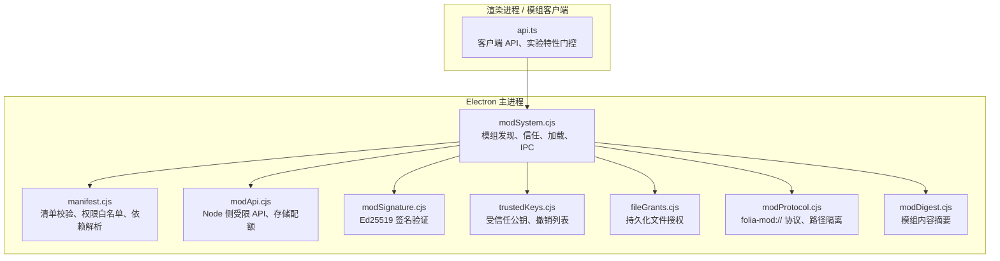
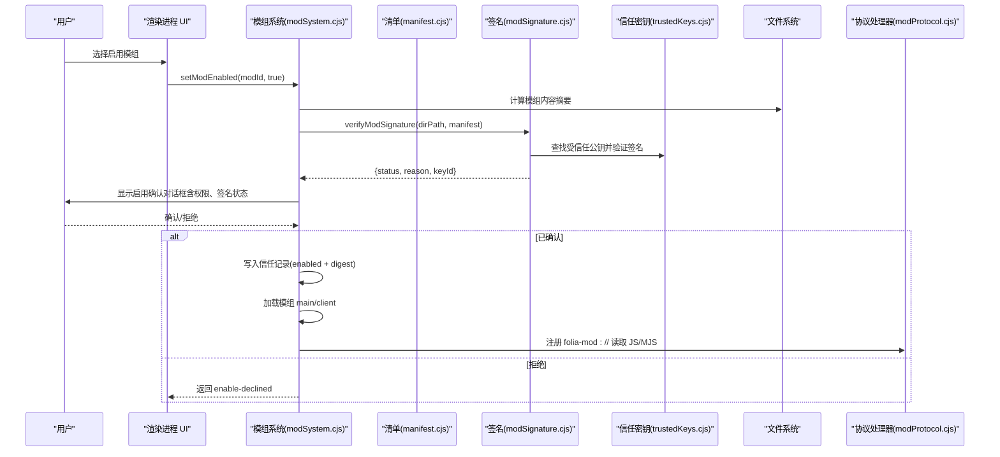
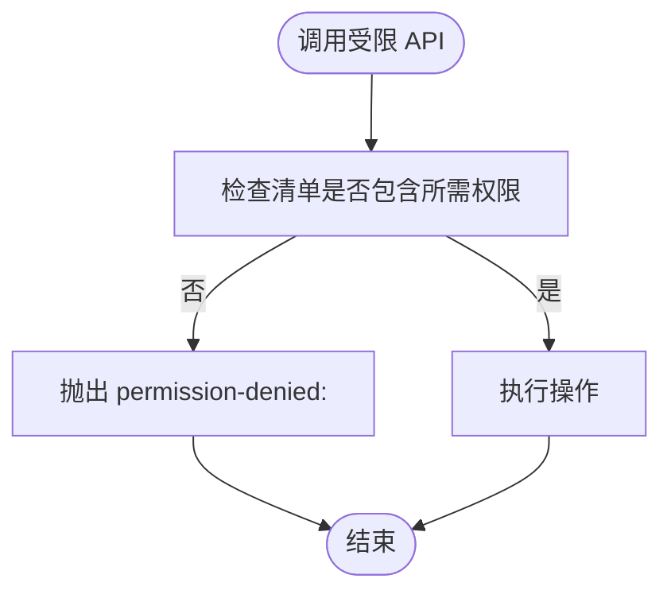
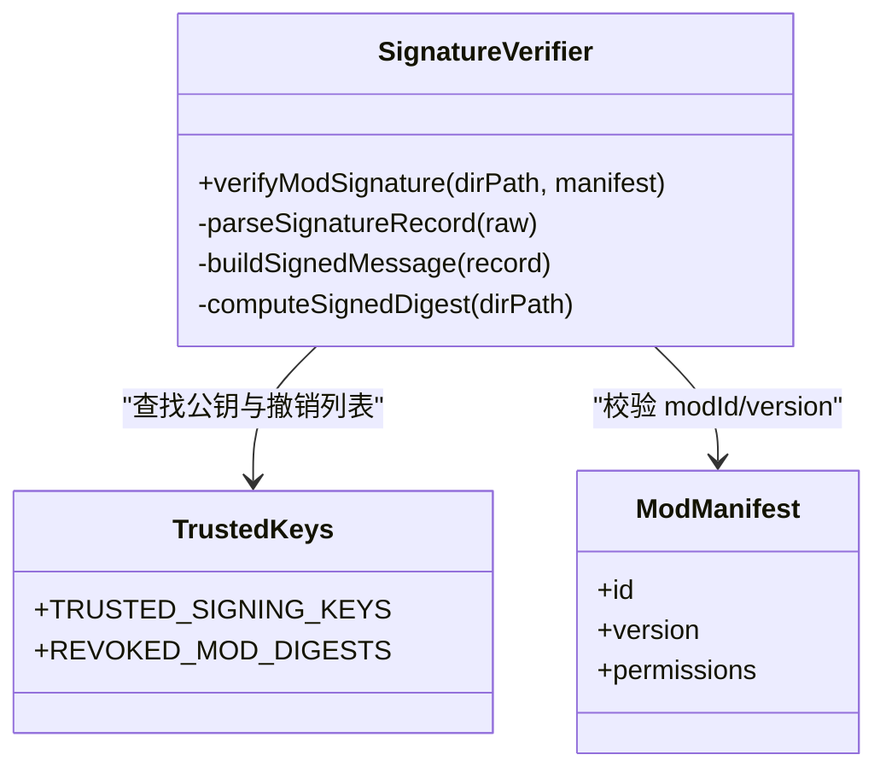
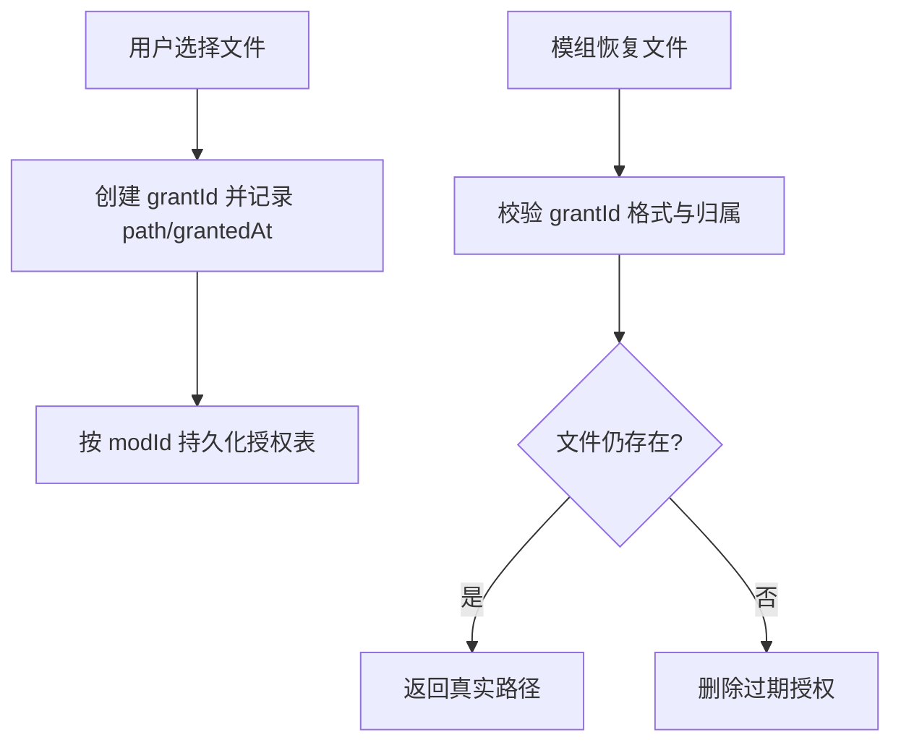
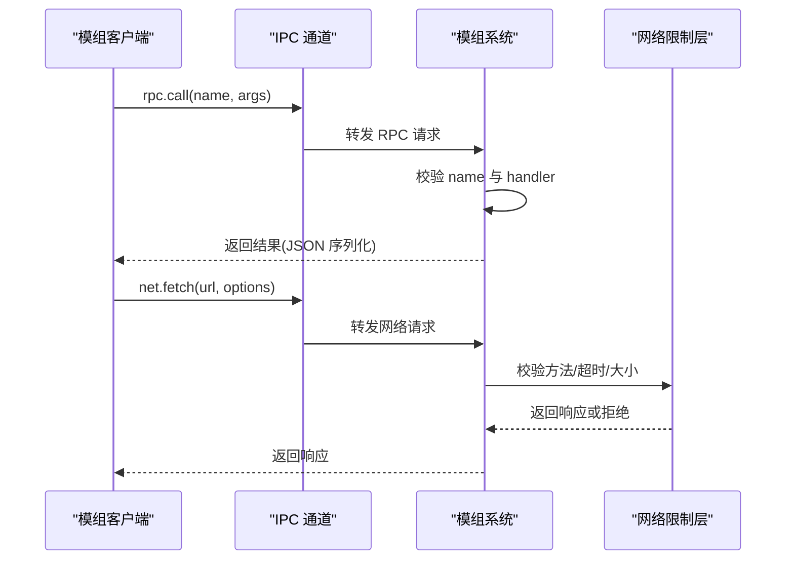
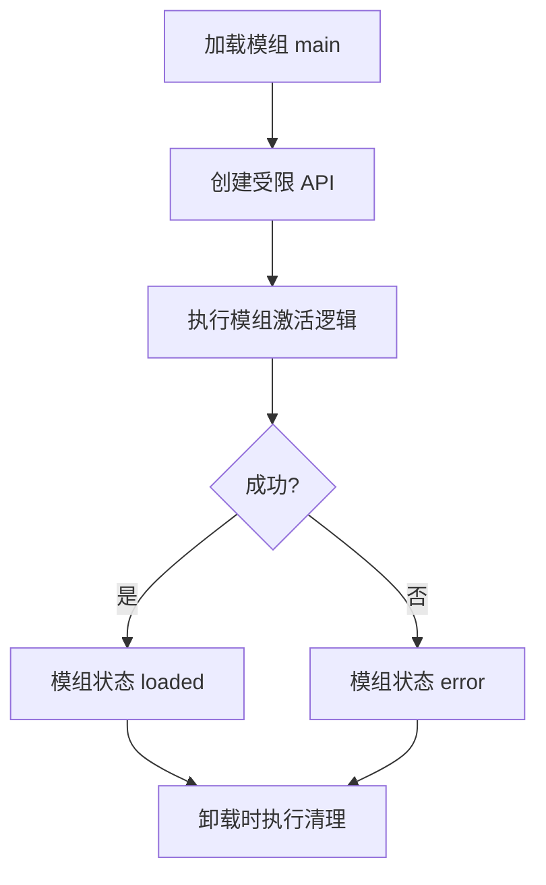
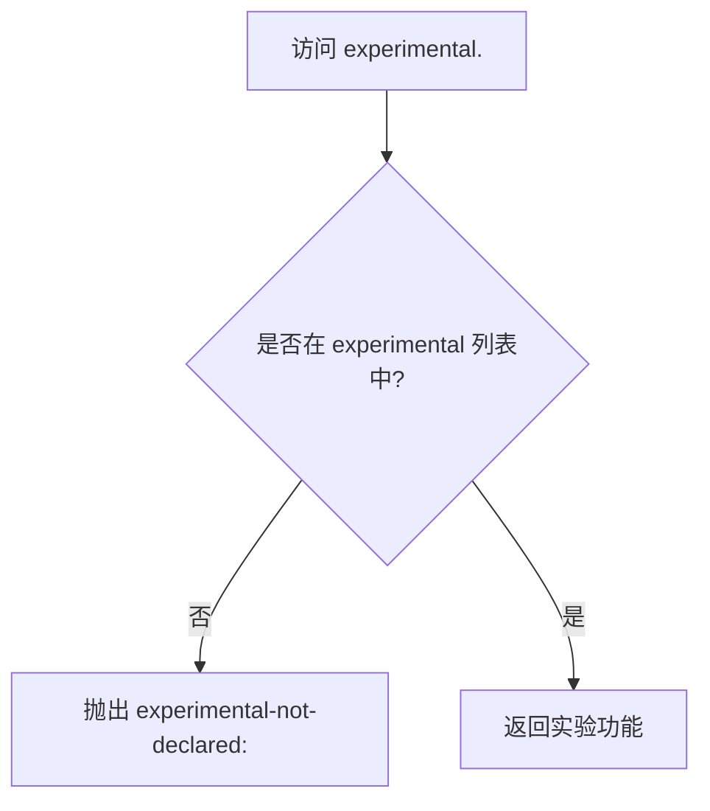
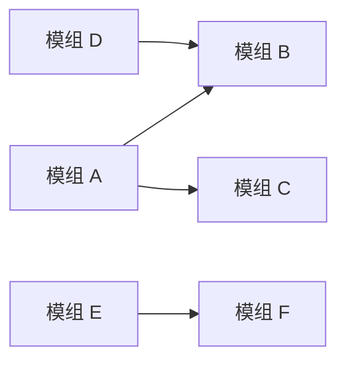

# 安全模型与权限控制

<cite>
**本文引用的文件**   
- [electron/modSystem/modSystem.cjs](file://electron/modSystem/modSystem.cjs)
- [electron/modSystem/manifest.cjs](file://electron/modSystem/manifest.cjs)
- [electron/modSystem/modApi.cjs](file://electron/modSystem/modApi.cjs)
- [electron/modSystem/modSignature.cjs](file://electron/modSystem/modSignature.cjs)
- [electron/modSystem/trustedKeys.cjs](file://electron/modSystem/trustedKeys.cjs)
- [electron/modSystem/fileGrants.cjs](file://electron/modSystem/fileGrants.cjs)
- [electron/modSystem/modProtocol.cjs](file://electron/modSystem/modProtocol.cjs)
- [electron/modSystem/modDigest.cjs](file://electron/modSystem/modDigest.cjs)
- [src/mods/folium/api.ts](file://src/mods/folium/api.ts)
</cite>

## 目录
1. [引言](#引言)
2. [项目结构与安全边界](#项目结构与安全边界)
3. [核心安全组件](#核心安全组件)
4. [架构总览](#架构总览)
5. [详细组件分析](#详细组件分析)
6. [依赖关系分析](#依赖关系分析)
7. [性能与资源限制](#性能与资源限制)
8. [故障排查指南](#故障排查指南)
9. [结论](#结论)
10. [附录：权限、签名与访问控制速查](#附录权限签名与访问控制速查)

## 引言
本文件面向 Folia Major 的 Folium 模组系统，系统性说明其安全模型与权限控制。内容覆盖：
- 声明式权限模型与运行时权限检查
- 代码签名验证机制、公钥信任链与撤销策略
- 文件系统访问控制、网络请求限制与 IPC 通信安全
- 模组执行隔离、作用域隔离与异常处理
- 实验性功能的显式声明与安全边界
- 安全最佳实践与常见漏洞防护建议

Folium 的安全设计遵循“最小能力暴露 + 用户确认 + 字节级信任绑定”的原则：模组在启用前必须经过主进程对话框确认；启用后以应用完整权限运行；签名仅用于来源与完整性标签，不替代用户确认；所有敏感能力通过白名单权限和运行时检查进行约束。

## 项目结构与安全边界
Folium 的安全实现集中在 Electron 主进程的模组加载子系统中，并与前端客户端 API 协同工作。关键目录与职责如下：

**图示来源**
- [electron/modSystem/modSystem.cjs:1-36](file://electron/modSystem/modSystem.cjs#L1-L36)
- [electron/modSystem/manifest.cjs:1-32](file://electron/modSystem/manifest.cjs#L1-L32)
- [electron/modSystem/modApi.cjs:1-24](file://electron/modSystem/modApi.cjs#L1-L24)
- [electron/modSystem/modSignature.cjs:1-30](file://electron/modSystem/modSignature.cjs#L1-L30)
- [electron/modSystem/trustedKeys.cjs:1-11](file://electron/modSystem/trustedKeys.cjs#L1-L11)
- [electron/modSystem/fileGrants.cjs:1-16](file://electron/modSystem/fileGrants.cjs#L1-L16)
- [electron/modSystem/modProtocol.cjs:1-10](file://electron/modSystem/modProtocol.cjs#L1-L10)
- [electron/modSystem/modDigest.cjs:1-20](file://electron/modSystem/modDigest.cjs#L1-L20)
- [src/mods/folium/api.ts:122-152](file://src/mods/folium/api.ts#L122-L152)

**章节来源**
- [electron/modSystem/modSystem.cjs:1-36](file://electron/modSystem/modSystem.cjs#L1-L36)
- [electron/modSystem/modProtocol.cjs:1-10](file://electron/modSystem/modProtocol.cjs#L1-L10)

## 核心安全组件
- 清单与权限模型：定义支持的权限集合、实验特性集合、依赖版本范围与宿主版本范围。
- 签名与信任链：使用 Ed25519 对模组内容摘要进行签名，内置受信任公钥，支持密钥撤销与模组摘要撤销。
- 文件授权：通过不透明 grant id 提供持久化文件访问，避免模组直接持有真实路径。
- 协议与路径隔离：folia-mod:// 仅提供只读 JS/MJS 文件服务，严格限制路径穿越与扩展名。
- 内容摘要：将用户“启用”决策绑定到具体字节摘要，防止替换或篡改后继续生效。
- 受限 Node API：向模组 main 入口注入最小能力集，按权限门控存储、播放快照、导出等能力。
- 客户端 API 门控：对实验特性与内部接口进行显式声明与上下文检查。

**章节来源**
- [electron/modSystem/manifest.cjs:14-32](file://electron/modSystem/manifest.cjs#L14-L32)
- [electron/modSystem/modSignature.cjs:1-20](file://electron/modSystem/modSignature.cjs#L1-L20)
- [electron/modSystem/fileGrants.cjs:6-16](file://electron/modSystem/fileGrants.cjs#L6-L16)
- [electron/modSystem/modProtocol.cjs:1-10](file://electron/modSystem/modProtocol.cjs#L1-L10)
- [electron/modSystem/modDigest.cjs:1-20](file://electron/modSystem/modDigest.cjs#L1-L20)
- [electron/modSystem/modApi.cjs:1-24](file://electron/modSystem/modApi.cjs#L1-L24)
- [src/mods/folium/api.ts:122-152](file://src/mods/folium/api.ts#L122-L152)

## 架构总览
Folium 模组生命周期中的安全流程如下：

**图示来源**
- [electron/modSystem/modSystem.cjs:767-844](file://electron/modSystem/modSystem.cjs#L767-L844)
- [electron/modSystem/modSignature.cjs:165-216](file://electron/modSystem/modSignature.cjs#L165-L216)
- [electron/modSystem/trustedKeys.cjs:14-31](file://electron/modSystem/trustedKeys.cjs#L14-L31)
- [electron/modSystem/modProtocol.cjs:111-158](file://electron/modSystem/modProtocol.cjs#L111-L158)

## 详细组件分析

### 声明式权限模型与运行时权限检查
- 权限白名单：清单中只能声明已知权限，未知权限会被拒绝，确保“失败关闭”。
- 运行时门控：Node 侧 API 在每个敏感方法调用处检查权限，未声明则抛出统一错误。
- 权限分类：
  - 文件系统数据：`filesystem.data`
  - 渲染导出：`render.export`（由加载器额外强制）
  - 运行时播放快照：`runtime.playback`
  - 播放控制：`playback.control`
  - 网络请求：`net.fetch`
  - 嵌入外部网页：`net.embed`
  - UI 舞台：`ui.stage`

**图示来源**
- [electron/modSystem/manifest.cjs:14-25](file://electron/modSystem/manifest.cjs#L14-L25)
- [electron/modSystem/modApi.cjs:16-27](file://electron/modSystem/modApi.cjs#L16-L27)
- [electron/modSystem/modApi.cjs:136-140](file://electron/modSystem/modApi.cjs#L136-L140)

**章节来源**
- [electron/modSystem/manifest.cjs:14-25](file://electron/modSystem/manifest.cjs#L14-L25)
- [electron/modSystem/modApi.cjs:16-27](file://electron/modSystem/modApi.cjs#L16-L27)
- [electron/modSystem/modApi.cjs:136-140](file://electron/modSystem/modApi.cjs#L136-L140)

### 代码签名验证机制与信任链管理
- 签名算法：Ed25519，签名对象为固定格式消息，包含模组 id、版本、摘要、密钥 id、时间戳。
- 签名文件格式：`folium.sig.json`，字段包括 format、version、modId、modVersion、digest、keyId、signedAt、signature。
- 受信任公钥：内置于宿主，支持多密钥与密钥撤销；新密钥轮换需先添加再标记旧密钥为撤销。
- 撤销机制：支持密钥撤销与模组摘要撤销，更新宿主即可生效。
- 签名状态：verified（官方或 CI 签名且匹配）、unsigned（无签名）、invalid（无效或不匹配）。

**图示来源**
- [electron/modSystem/modSignature.cjs:117-216](file://electron/modSystem/modSignature.cjs#L117-L216)
- [electron/modSystem/trustedKeys.cjs:14-31](file://electron/modSystem/trustedKeys.cjs#L14-L31)

**章节来源**
- [electron/modSystem/modSignature.cjs:1-30](file://electron/modSystem/modSignature.cjs#L1-L30)
- [electron/modSystem/modSignature.cjs:117-216](file://electron/modSystem/modSignature.cjs#L117-L216)
- [electron/modSystem/trustedKeys.cjs:1-34](file://electron/modSystem/trustedKeys.cjs#L1-L34)

### 文件访问控制与持久化授权
- 持久化授权：用户通过 `folium.ui.pickFile({ persist: true })` 授予模组一个不透明的 grant id；模组重启后可通过 `folium.ui.restoreFile(grantId)` 恢复访问。
- 隔离原则：grant id 属于特定模组 id，其他模组无法解析；每次恢复生成新的会话 URL。
- 容量限制：每个模组最多保留固定数量的授权记录，最旧的优先淘汰。
- 路径校验：resolve 时检查是否为普通文件，若文件不存在则自动清理授权。

**图示来源**
- [electron/modSystem/fileGrants.cjs:6-16](file://electron/modSystem/fileGrants.cjs#L6-L16)
- [electron/modSystem/fileGrants.cjs:49-86](file://electron/modSystem/fileGrants.cjs#L49-L86)

**章节来源**
- [electron/modSystem/fileGrants.cjs:1-90](file://electron/modSystem/fileGrants.cjs#L1-L90)

### 网络请求限制与 IPC 通信安全
- 网络请求限制：
  - 默认超时、最大超时、最大响应体大小均有上限。
  - 允许的 HTTP 方法为 GET/POST/PUT/PATCH/DELETE/HEAD。
  - 该能力需要 `net.fetch` 权限。
- IPC 通道：
  - 模组与渲染进程之间通过 IPC 传递 RPC 与存储操作。
  - 所有参数与返回值必须是 JSON 可序列化对象。
  - RPC 名称需符合正则表达式，防止注入非法方法名。
- 协议安全：
  - `folia-mod://` 仅允许 GET 请求，仅服务 `.js/.mjs` 文件。
  - 路径段禁止 `..`、反斜杠、绝对路径，防止路径穿越。
  - 已选文件的临时 URL 使用不可猜测 token，随会话销毁。

**图示来源**
- [electron/modSystem/modSystem.cjs:41-47](file://electron/modSystem/modSystem.cjs#L41-L47)
- [electron/modSystem/modApi.cjs:187-201](file://electron/modSystem/modApi.cjs#L187-L201)
- [electron/modSystem/modProtocol.cjs:111-158](file://electron/modSystem/modProtocol.cjs#L111-L158)

**章节来源**
- [electron/modSystem/modSystem.cjs:41-47](file://electron/modSystem/modSystem.cjs#L41-L47)
- [electron/modSystem/modApi.cjs:187-201](file://electron/modSystem/modApi.cjs#L187-L201)
- [electron/modSystem/modProtocol.cjs:111-158](file://electron/modSystem/modProtocol.cjs#L111-L158)

### 模组执行隔离与作用域隔离
- Node 侧隔离：
  - 模组 main 入口仅能访问通过 `createModApi` 注入的最小 API。
  - 不允许直接访问 Electron 原生对象、Node 内部模块或加载器内部实现。
  - 每个模组拥有独立的数据存储目录与写队列，避免并发写入冲突。
- 渲染侧隔离：
  - 客户端通过 `folia-mod://` 协议加载 ESM，URL 携带短摘要作为版本号，避免缓存复用旧代码。
  - 协议处理器仅服务 JS/MJS，拒绝其他类型文件。
- 异常处理：
  - 模组加载失败不会崩溃宿主，而是记录错误状态。
  - 卸载时按逆序执行清理函数，单个清理失败不影响其余清理。

**图示来源**
- [electron/modSystem/modApi.cjs:129-214](file://electron/modSystem/modApi.cjs#L129-L214)
- [electron/modSystem/modSystem.cjs:301-383](file://electron/modSystem/modSystem.cjs#L301-L383)
- [electron/modSystem/modProtocol.cjs:111-158](file://electron/modSystem/modProtocol.cjs#L111-L158)

**章节来源**
- [electron/modSystem/modApi.cjs:129-214](file://electron/modSystem/modApi.cjs#L129-L214)
- [electron/modSystem/modSystem.cjs:301-383](file://electron/modSystem/modSystem.cjs#L301-L383)
- [electron/modSystem/modProtocol.cjs:111-158](file://electron/modSystem/modProtocol.cjs#L111-L158)

### 实验性功能的访问控制
- 显式声明：模组必须在清单中声明实验特性，否则访问会抛出明确错误。
- 门控命名空间：客户端 API 通过代理对象实现门控，未声明的实验属性访问会抛出 `experimental-not-declared:<name>`。
- 内部接口保护：内部接口仅在模组声明宿主版本范围时才可用，否则抛出 `internals-require-folia-range`。

**图示来源**
- [src/mods/folium/api.ts:122-152](file://src/mods/folium/api.ts#L122-L152)
- [electron/modSystem/manifest.cjs:27-32](file://electron/modSystem/manifest.cjs#L27-L32)

**章节来源**
- [src/mods/folium/api.ts:122-152](file://src/mods/folium/api.ts#L122-L152)
- [electron/modSystem/manifest.cjs:27-32](file://electron/modSystem/manifest.cjs#L27-L32)

## 依赖关系分析
模组依赖解析采用拓扑排序，确保依赖先于被依赖方加载；缺失依赖、版本不兼容或循环依赖会导致子图失败，但不影响无关模组。

**图示来源**
- [electron/modSystem/manifest.cjs:287-379](file://electron/modSystem/manifest.cjs#L287-L379)

**章节来源**
- [electron/modSystem/manifest.cjs:287-379](file://electron/modSystem/manifest.cjs#L287-L379)

## 性能与资源限制
- 模组内容摘要限制：
  - 最大文件数：2000
  - 最大总字节数：64MB
- 签名树限制：
  - 最大签名文件大小：16KB
  - 忽略 Finder/Windows 系统文件，避免签名因浏览器行为失效
- 安装压缩包限制：
  - 最大归档大小：64MB
  - 最大条目数：2000
  - 最大单文件大小：32MB
- 网络请求限制：
  - 默认超时：15秒
  - 最大超时：60秒
  - 最大响应体：5MB
- 存储配额：
  - 每模组数据文件最大 1MB
  - 写操作串行化，避免并发写入竞争

**章节来源**
- [electron/modSystem/modDigest.cjs:17-20](file://electron/modSystem/modDigest.cjs#L17-L20)
- [electron/modSystem/modSignature.cjs:30-35](file://electron/modSystem/modSignature.cjs#L30-L35)
- [electron/modSystem/modSystem.cjs:67-72](file://electron/modSystem/modSystem.cjs#L67-L72)
- [electron/modSystem/modSystem.cjs:41-47](file://electron/modSystem/modSystem.cjs#L41-L47)
- [electron/modSystem/modApi.cjs:11-14](file://electron/modSystem/modApi.cjs#L11-L14)

## 故障排查指南
常见问题与定位方式：
- 模组无法启用：
  - 检查清单是否有效，权限是否声明正确。
  - 查看签名状态是否为 verified/unsigned/invalid。
  - 确认用户是否在主进程对话框中确认启用。
- 权限拒绝错误：
  - 检查模组清单是否声明对应权限。
  - 查看 Node 侧 API 调用是否触发 `permission-denied:<permission>`。
- 文件访问失败：
  - 检查 grant id 是否有效且归属于当前模组。
  - 确认目标文件是否存在。
- 网络请求失败：
  - 检查 HTTP 方法是否在允许列表中。
  - 确认响应体大小未超过限制。
- 实验功能不可用：
  - 检查模组清单是否声明对应实验特性。
  - 查看客户端 API 是否抛出 `experimental-not-declared:<name>`。

**章节来源**
- [electron/modSystem/modSystem.cjs:767-844](file://electron/modSystem/modSystem.cjs#L767-L844)
- [electron/modSystem/modApi.cjs:136-140](file://electron/modSystem/modApi.cjs#L136-L140)
- [electron/modSystem/fileGrants.cjs:64-86](file://electron/modSystem/fileGrants.cjs#L64-L86)
- [electron/modSystem/modSystem.cjs:41-47](file://electron/modSystem/modSystem.cjs#L41-L47)
- [src/mods/folium/api.ts:122-152](file://src/mods/folium/api.ts#L122-L152)

## 结论
Folium 模组系统通过声明式权限、运行时检查、代码签名验证、文件授权隔离、协议路径限制与内容摘要绑定，构建了多层次的安全防线。尽管模组启用后拥有应用完整权限，但通过用户确认、最小能力暴露与严格校验，显著降低了恶意或意外行为的风险。开发者应遵循最小权限原则、显式声明实验功能、谨慎处理网络与文件访问，并充分利用宿主提供的限制与错误提示进行安全开发。

## 附录：权限、签名与访问控制速查
- 权限白名单：
  - `filesystem.data`：模组数据存储
  - `render.export`：视频导出
  - `runtime.playback`：播放快照
  - `playback.control`：播放控制
  - `net.fetch`：网络请求
  - `net.embed`：嵌入外部网页
  - `ui.stage`：UI 舞台
- 签名状态：
  - verified：官方或 CI 签名且匹配
  - unsigned：无签名
  - invalid：无效或不匹配
- 访问控制要点：
  - 所有敏感 API 均需权限检查
  - 文件访问通过 grant id 隔离
  - 网络请求受方法与大小限制
  - 协议仅服务 JS/MJS 且禁止路径穿越
  - 实验功能需显式声明

**章节来源**
- [electron/modSystem/manifest.cjs:14-32](file://electron/modSystem/manifest.cjs#L14-L32)
- [electron/modSystem/modSignature.cjs:165-216](file://electron/modSystem/modSignature.cjs#L165-L216)
- [electron/modSystem/fileGrants.cjs:6-16](file://electron/modSystem/fileGrants.cjs#L6-L16)
- [electron/modSystem/modProtocol.cjs:111-158](file://electron/modSystem/modProtocol.cjs#L111-L158)