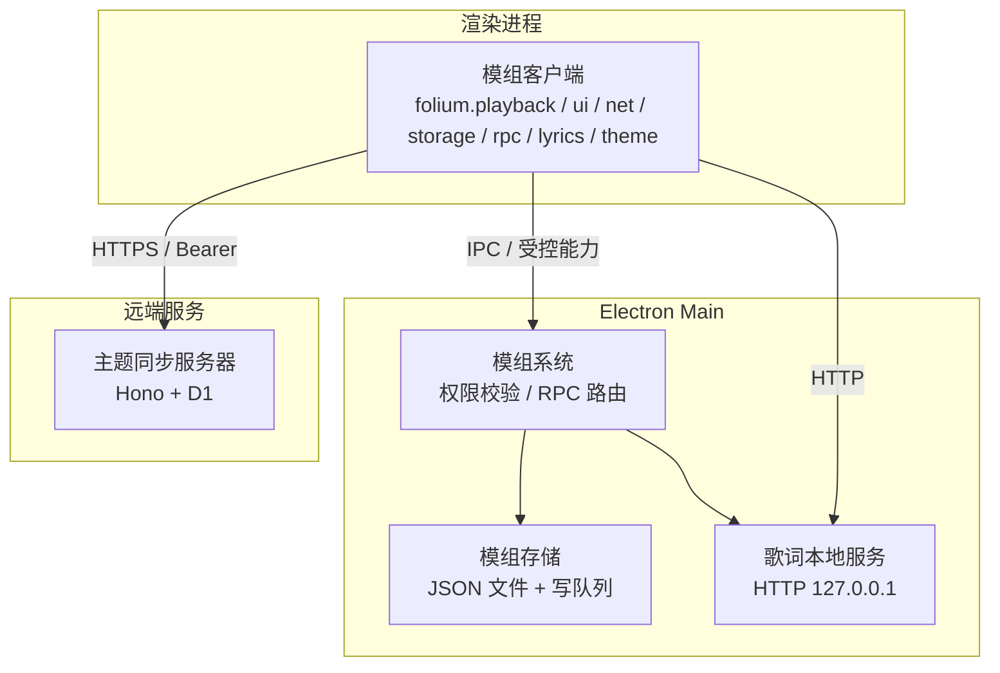
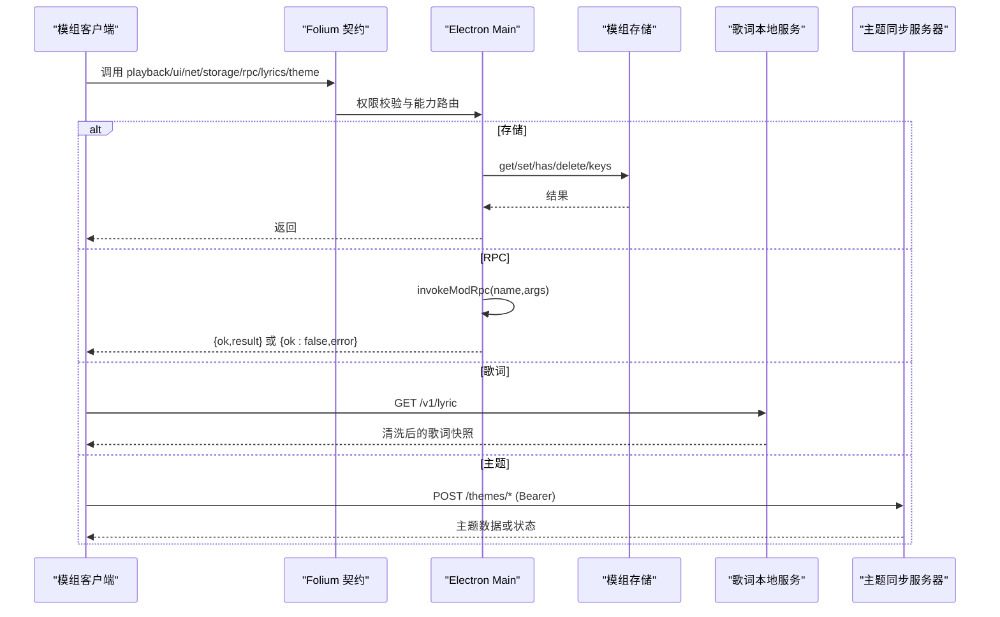
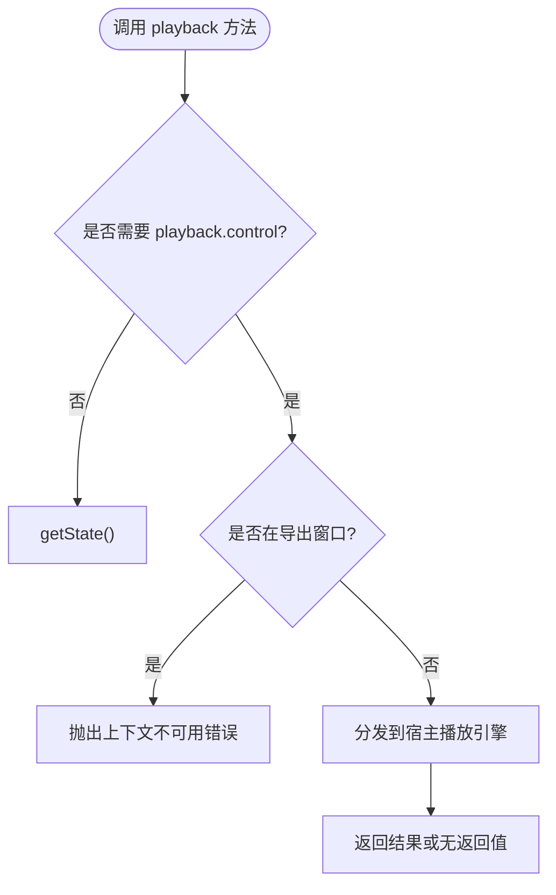
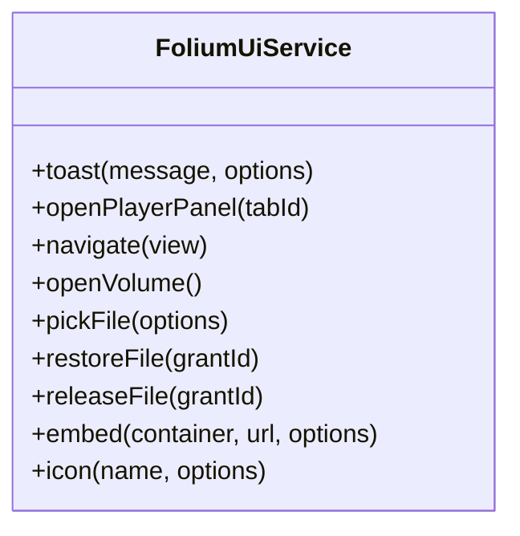
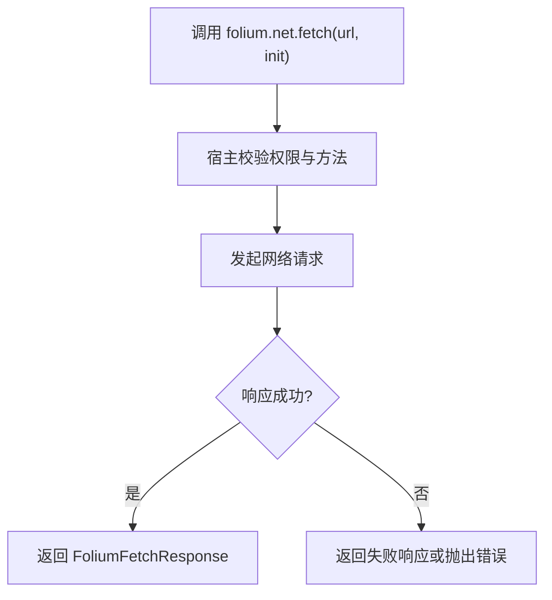
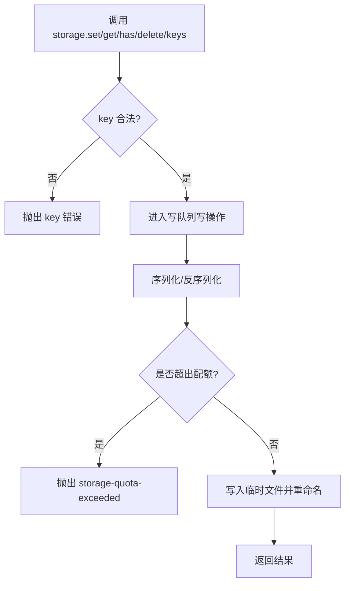
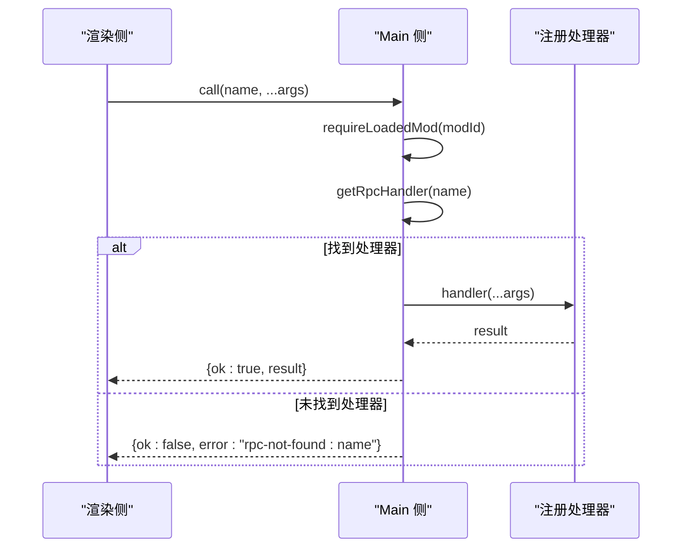
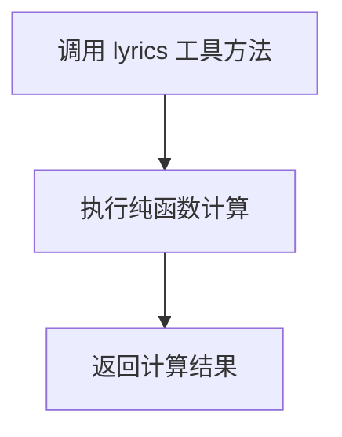
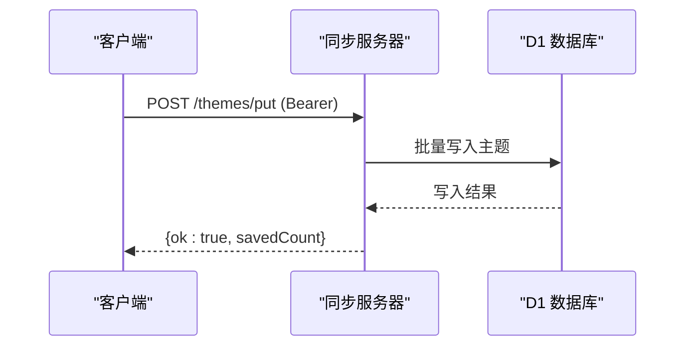
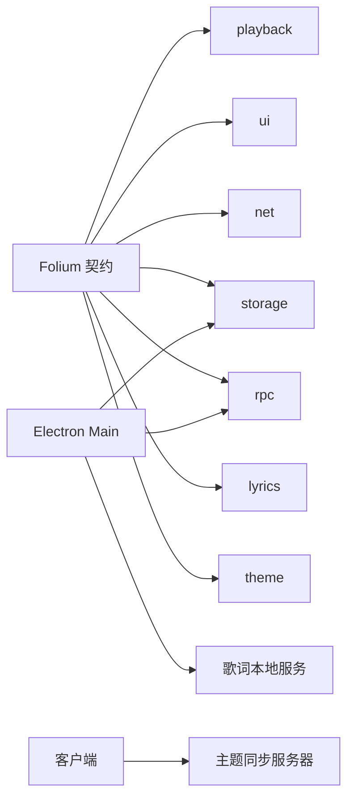

# 服务API

<cite>
**本文引用的文件**   
- [contract.ts](file://src/mods/folium/contract.ts)
- [api.md](file://docs/folium/api.md)
- [services.ts](file://src/mods/folium/services.ts)
- [modApi.cjs](file://electron/modSystem/modApi.cjs)
- [modSystem.cjs](file://electron/modSystem/modSystem.cjs)
- [lyricApi.cjs](file://electron/lyricApi.cjs)
- [lyricApi.ts](file://src/types/lyricApi.ts)
- [app.ts](file://sync-server/src/app.ts)
- [syncClient.ts](file://src/services/sync/syncClient.ts)
</cite>

## 目录
1. [引言](#引言)
2. [项目结构与服务总览](#项目结构与服务总览)
3. [核心服务接口](#核心服务接口)
4. [架构总览](#架构总览)
5. [详细组件分析](#详细组件分析)
6. [依赖关系分析](#依赖关系分析)
7. [性能与稳定性考虑](#性能与稳定性考虑)
8. [故障排查指南](#故障排查指南)
9. [结论](#结论)

## 引言
本文面向模组开发者与集成方，系统化说明 Folia Major 中与“播放、界面、网络、存储、远程过程调用、歌词、主题”相关的服务 API。内容覆盖：
- 每个服务的职责边界
- 方法签名、参数类型与返回值
- 权限与上下文限制
- 典型使用流程与最佳实践
- 相关实现位置与可追溯来源

为避免泄露具体代码片段，所有实现细节均以“文件路径 + 行号”的形式引用。

## 项目结构与服务总览
Folia Major 的模组能力通过 Folium 契约暴露给客户端（渲染进程），并通过 Electron main 侧的 mod system 提供受限 Node 能力。同时，桌面端还暴露本地 HTTP 服务用于歌词同步，以及远端同步服务器用于主题等数据同步。

**图表来源**
- [contract.ts:77-99](file://src/mods/folium/contract.ts#L77-L99)
- [modApi.cjs:129-213](file://electron/modSystem/modApi.cjs#L129-L213)
- [modSystem.cjs:857-871](file://electron/modSystem/modSystem.cjs#L857-L871)
- [lyricApi.cjs:83-195](file://electron/lyricApi.cjs#L83-L195)
- [app.ts:121-143](file://sync-server/src/app.ts#L121-L143)

**章节来源**
- [contract.ts:77-99](file://src/mods/folium/contract.ts#L77-L99)
- [api.md:25-99](file://docs/folium/api.md#L25-L99)

## 核心服务接口
本节按服务维度整理对外能力，包括方法签名、参数类型、返回值、权限与上下文约束。

### playback（播放服务）
- 入口：`folium.playback`
- 能力：获取播放状态、控制播放、跳转、切歌、队列操作、收藏切换等
- 权限：除 `getState` 外，其他方法需要 `playback.control`
- 上下文：导出窗口不可用

关键方法与返回：
- `getState()`：返回当前歌曲、状态、位置、时长、是否已收藏、是否可收藏
- `play()` / `pause()` / `toggle()`：播放控制
- `seek(seconds)`：跳转到音频时间
- `seekToLyricTime(lyricSeconds)`：跳转到歌词时钟时间
- `next()` / `previous()`：切歌
- `playSong(song)`：根据宿主 ref 播放
- `enqueue(song)`：加入队列
- `shuffleQueue()`：打乱队列（保持当前歌曲优先）
- `toggleLike()`：收藏/取消收藏

参考定义与文档：
- [contract.ts:838-870](file://src/mods/folium/contract.ts#L838-L870)
- [api.md:647-667](file://docs/folium/api.md#L647-L667)

**章节来源**
- [contract.ts:838-870](file://src/mods/folium/contract.ts#L838-L870)
- [api.md:647-667](file://docs/folium/api.md#L647-L667)

### ui（用户界面服务）
- 入口：`folium.ui`
- 能力：提示消息、打开播放器面板、导航到主页或播放页、打开音量面板、选择本地文件、恢复/释放持久化文件句柄、嵌入外部页面、获取图标
- 上下文：导出窗口中仅 `icon` 可用

关键方法与返回：
- `toast(message, options)`：显示状态消息
- `openPlayerPanel(tabId?)`：打开播放器面板并可指定标签页
- `navigate(view)`：切换到 home 或 player
- `openVolume()`：打开音量面板
- `pickFile(options)`：选择本地文件，支持 accept 与 persist
- `restoreFile(grantId)`：恢复之前持久化的文件句柄
- `releaseFile(grantId)`：释放持久化授权
- `embed(container, url, options)`：以沙箱 iframe 嵌入外部页面
- `icon(name, options)`：获取宿主图标 SVG

参考定义与实现：
- [api.md:690-706](file://docs/folium/api.md#L690-L706)
- [services.ts:140-177](file://src/mods/folium/services.ts#L140-L177)

**章节来源**
- [api.md:690-706](file://docs/folium/api.md#L690-L706)
- [services.ts:140-177](file://src/mods/folium/services.ts#L140-L177)

### net（网络服务）
- 入口：`folium.net`
- 能力：通过宿主发起网络请求，绕过浏览器 CORS 限制
- 权限：需要 `net.fetch`；嵌入外部页面需要 `net.embed`

关键方法与返回：
- `fetch(url, init)`：发起 HTTP 请求，返回完整响应对象
- `FoliumFetchInit`：method、headers、body、timeoutMs
- `FoliumFetchResponse`：ok、status、statusText、headers、text()、json()

参考定义与文档：
- [api.md:708-740](file://docs/folium/api.md#L708-L740)

**章节来源**
- [api.md:708-740](file://docs/folium/api.md#L708-L740)

### storage（存储服务）
- 入口（渲染侧）：`folium.storage`
- 入口（Node 侧）：`api.storage.data`
- 能力：键值对存储，值必须 JSON 可序列化
- 权限：需要 `filesystem.data`
- 限制：单模组数据文件最大 1MB；写入串行化避免并发冲突

关键方法与返回：
- `get(key)`：读取值
- `set(key, value)`：写入值
- `has(key)`：判断键是否存在
- `delete(key)`：删除键
- `keys()`：列出所有键

参考定义与实现：
- [api.md:46-58](file://docs/folium/api.md#L46-L58)
- [modApi.cjs:41-116](file://electron/modSystem/modApi.cjs#L41-L116)

**章节来源**
- [api.md:46-58](file://docs/folium/api.md#L46-L58)
- [modApi.cjs:41-116](file://electron/modSystem/modApi.cjs#L41-L116)

### rpc（远程过程调用）
- 入口（渲染侧）：`folium.rpc.call(name, ...args)`
- 入口（Node 侧）：`api.rpc.handle(name, handler)`
- 能力：在模组的客户端与 main 之间进行 IPC 调用，参数与结果需 JSON 可序列化
- 路由：main 侧通过 `invokeModRpc` 查找并执行注册的 handler

关键方法与行为：
- 渲染侧：`call(name, ...args)` 调用 main 注册的方法
- Node 侧：`handle(name, fn)` 注册方法名与处理器
- 错误处理：未找到方法返回 `rpc-not-found:<name>`；异常被序列化为错误信息

参考定义与实现：
- [api.md:59-66](file://docs/folium/api.md#L59-L66)
- [modApi.cjs:187-202](file://electron/modSystem/modApi.cjs#L187-L202)
- [modSystem.cjs:857-871](file://electron/modSystem/modSystem.cjs#L857-L871)

**章节来源**
- [api.md:59-66](file://docs/folium/api.md#L59-L66)
- [modApi.cjs:187-202](file://electron/modSystem/modApi.cjs#L187-L202)
- [modSystem.cjs:857-871](file://electron/modSystem/modSystem.cjs#L857-L871)

### lyrics（歌词助手）
- 入口（渲染侧）：`folium.lyrics`
- 能力：歌词纯函数工具，如词段分割、关键词着色、最近/即将歌词行计算等
- 上下文：主窗口与导出窗口均可用

关键方法与返回：
- `segmentWords(line)`：按用户保存的分词或 Intl.Segmenter 分词
- `buildWordColorRanges(fullText, wordColors)`：构建关键词颜色区间
- `resolveWordColor(wordText, wordColors, fallbackColor, options)`：解析单个词的关键词颜色
- `getLineRenderEndTime(line)`：获取歌词行结束时间
- `getRecentCompletedLine(lines, lineIndex, time)`：获取上一行
- `getUpcomingLine(lines, lineIndex, time)`：获取下一行
- `getUpcomingLines(lines, lineIndex, count?)`：获取后续若干行

参考定义与文档：
- [api.md:746-782](file://docs/folium/api.md#L746-L782)

此外，桌面端还提供本地歌词 HTTP 服务：
- 服务地址：`http://127.0.0.1:<port>/v1/lyric`
- 能力：返回经清洗的歌词快照，供可信本地客户端拉取
- 状态接口：`LyricApiStatus`（enabled、running、port、url、error）

参考实现与类型：
- [lyricApi.cjs:83-195](file://electron/lyricApi.cjs#L83-L195)
- [lyricApi.ts:4-10](file://src/types/lyricApi.ts#L4-L10)

**章节来源**
- [api.md:746-782](file://docs/folium/api.md#L746-L782)
- [lyricApi.cjs:83-195](file://electron/lyricApi.cjs#L83-L195)
- [lyricApi.ts:4-10](file://src/types/lyricApi.ts#L4-L10)

### theme（主题助手）
- 入口（渲染侧）：`folium.theme`
- 能力：主题解析工具，如字体栈、字重解析等
- 上下文：主窗口与导出窗口均可用

关键方法与返回：
- `resolveFontStack(theme)`：生成歌词文本的 CSS font-family
- `resolveTranslationFontStack(theme)`：生成翻译/字幕的 CSS font-family
- `resolveFontWeight(theme, fallback)`：规范化字重

参考定义与文档：
- [api.md:784-794](file://docs/folium/api.md#L784-L794)

此外，远端同步服务器提供主题数据的同步接口：
- 认证：Bearer Token（SYNC_TOKEN）
- 主要接口：
  - `GET /health`：健康检查
  - `GET /state`：服务状态
  - `GET /settings`：读取设置
  - `PUT /settings`：更新设置
  - `GET /themes/manifest`：主题清单
  - `POST /themes/get`：批量获取主题
  - `POST /themes/put`：批量写入主题
  - `POST /themes/bucket`：按桶获取主题
  - `POST /themes/list`：分页列出主题

参考实现与客户端调用：
- [app.ts:315-522](file://sync-server/src/app.ts#L315-L522)
- [syncClient.ts:96-151](file://src/services/sync/syncClient.ts#L96-L151)

**章节来源**
- [api.md:784-794](file://docs/folium/api.md#L784-L794)
- [app.ts:315-522](file://sync-server/src/app.ts#L315-L522)
- [syncClient.ts:96-151](file://src/services/sync/syncClient.ts#L96-L151)

## 架构总览
下图展示各服务之间的交互关系：渲染侧通过 Folium 契约访问播放、界面、网络、存储、RPC、歌词与主题能力；Electron main 侧负责权限校验、存储持久化与 RPC 路由；桌面端暴露本地歌词 HTTP 服务；远端同步服务器提供主题数据同步。

**图表来源**
- [contract.ts:77-99](file://src/mods/folium/contract.ts#L77-L99)
- [modApi.cjs:129-213](file://electron/modSystem/modApi.cjs#L129-L213)
- [modSystem.cjs:857-871](file://electron/modSystem/modSystem.cjs#L857-L871)
- [lyricApi.cjs:118-139](file://electron/lyricApi.cjs#L118-L139)
- [app.ts:315-522](file://sync-server/src/app.ts#L315-L522)

## 详细组件分析

### playback 服务
- 设计要点：
  - 只读状态通过 `getState` 暴露，避免副作用
  - 控制类方法统一要求 `playback.control` 权限
  - 支持音频时间与歌词时间两种 seek 语义
- 复杂度与性能：
  - 状态查询为 O(1)
  - 控制方法通常触发宿主层播放引擎变更，注意频率控制与幂等性
- 错误处理：
  - 缺少权限抛出 `permission-denied:playback.control`
  - 导出窗口调用会抛上下文不可用错误

**图表来源**
- [contract.ts:838-870](file://src/mods/folium/contract.ts#L838-L870)
- [api.md:647-667](file://docs/folium/api.md#L647-L667)

**章节来源**
- [contract.ts:838-870](file://src/mods/folium/contract.ts#L838-L870)
- [api.md:647-667](file://docs/folium/api.md#L647-L667)

### ui 服务
- 设计要点：
  - UI 操作集中在 `folium.ui`，避免直接操作宿主 DOM
  - 文件选择与嵌入功能需要相应权限与清单配置
- 复杂度与性能：
  - 文件选择与恢复涉及文件系统与授权表，注意异步与空值处理
  - 嵌入页面需校验 origin 白名单
- 错误处理：
  - 未知视图名称抛错
  - 非 main 上下文调用文件相关方法抛错

**图表来源**
- [api.md:690-706](file://docs/folium/api.md#L690-L706)
- [services.ts:140-177](file://src/mods/folium/services.ts#L140-L177)

**章节来源**
- [api.md:690-706](file://docs/folium/api.md#L690-L706)
- [services.ts:140-177](file://src/mods/folium/services.ts#L140-L177)

### net 服务
- 设计要点：
  - 通过宿主代理网络请求，规避 CORS 限制
  - 超时与大小限制由宿主控制
- 复杂度与性能：
  - 单次请求开销较低，建议复用连接与缓存策略
- 错误处理：
  - 非法 method 或过大 body 会被拒绝

**图表来源**
- [api.md:708-740](file://docs/folium/api.md#L708-L740)

**章节来源**
- [api.md:708-740](file://docs/folium/api.md#L708-L740)

### storage 服务
- 设计要点：
  - 单模组数据文件，跨渲染与 main 共享
  - 写操作串行化，避免并发写入竞争
- 复杂度与性能：
  - 读写为 I/O 操作，建议批量合并与缓存热点键
  - 超过配额抛出 `storage-quota-exceeded`
- 错误处理：
  - key 为空或非字符串抛错
  - 值不可序列化抛错

**图表来源**
- [modApi.cjs:41-116](file://electron/modSystem/modApi.cjs#L41-L116)

**章节来源**
- [modApi.cjs:41-116](file://electron/modSystem/modApi.cjs#L41-L116)

### rpc 服务
- 设计要点：
  - 渲染侧与 Node 侧通过 IPC 通信
  - 方法名需匹配正则，handler 必须为函数
- 复杂度与性能：
  - 每次调用序列化参数与结果，避免传递大对象
- 错误处理：
  - 未找到方法返回 `rpc-not-found:<name>`
  - 异常被捕获并序列化

**图表来源**
- [modSystem.cjs:857-871](file://electron/modSystem/modSystem.cjs#L857-L871)
- [modApi.cjs:187-202](file://electron/modSystem/modApi.cjs#L187-L202)

**章节来源**
- [modSystem.cjs:857-871](file://electron/modSystem/modSystem.cjs#L857-L871)
- [modApi.cjs:187-202](file://electron/modSystem/modApi.cjs#L187-L202)

### lyrics 服务
- 设计要点：
  - 纯函数工具，保证与内置模式一致的计算逻辑
  - 桌面端提供本地 HTTP 服务，输出清洗后的歌词快照
- 复杂度与性能：
  - 纯函数计算为 CPU 密集但轻量，适合高频调用
  - 本地 HTTP 服务仅监听 127.0.0.1，安全可控
- 错误处理：
  - 无效输入返回默认值或空数组
  - 服务启动失败记录 lastError 并广播状态

**图表来源**
- [api.md:746-782](file://docs/folium/api.md#L746-L782)
- [lyricApi.cjs:44-81](file://electron/lyricApi.cjs#L44-L81)

**章节来源**
- [api.md:746-782](file://docs/folium/api.md#L746-L782)
- [lyricApi.cjs:44-81](file://electron/lyricApi.cjs#L44-L81)

### theme 服务
- 设计要点：
  - 纯函数工具，确保主题解析一致性
  - 远端同步服务器提供主题数据的增删改查与分页
- 复杂度与性能：
  - 本地解析为 O(1)~O(n) 取决于输入规模
  - 远端同步采用批处理与桶哈希优化
- 错误处理：
  - 远端同步需携带有效 Bearer Token
  - 无效主题输入返回错误码

**图表来源**
- [app.ts:388-474](file://sync-server/src/app.ts#L388-L474)

**章节来源**
- [api.md:784-794](file://docs/folium/api.md#L784-L794)
- [app.ts:388-474](file://sync-server/src/app.ts#L388-L474)

## 依赖关系分析
- 耦合度：
  - playback、ui、net、storage、rpc、lyrics、theme 均通过 Folium 契约解耦，降低模组与宿主实现的直接耦合
  - Electron main 侧通过 mod system 集中管理权限与 RPC 路由
- 外部依赖：
  - 歌词本地服务依赖 Node http 模块
  - 主题同步服务器依赖 Hono、CORS、Bearer Auth 与 D1 数据库
- 潜在循环依赖：
  - 契约文件不引入宿主内部类型，避免循环依赖
  - 客户端与服务端通过稳定 DTO 通信

**图表来源**
- [contract.ts:77-99](file://src/mods/folium/contract.ts#L77-L99)
- [modApi.cjs:129-213](file://electron/modSystem/modApi.cjs#L129-L213)
- [lyricApi.cjs:83-195](file://electron/lyricApi.cjs#L83-L195)
- [app.ts:121-143](file://sync-server/src/app.ts#L121-L143)

**章节来源**
- [contract.ts:77-99](file://src/mods/folium/contract.ts#L77-L99)
- [modApi.cjs:129-213](file://electron/modSystem/modApi.cjs#L129-L213)

## 性能与稳定性考虑
- 播放控制：
  - 避免高频 seek 与 toggle，建议使用节流或防抖
  - 使用 `seekToLyricTime` 时注意歌词偏移与阶段源差异
- 界面交互：
  - 文件选择与恢复应缓存 grantId，减少重复 IO
  - 嵌入页面需限制 origin，避免安全风险
- 网络请求：
  - 合理设置 timeoutMs，避免长时间阻塞
  - 对大响应体进行流式处理或分块下载
- 存储操作：
  - 批量写入合并，减少磁盘 IO
  - 监控配额，及时清理无用键
- RPC 调用：
  - 避免传递大对象，必要时分片或压缩
  - 对异常进行重试与降级
- 歌词与主题：
  - 纯函数计算应避免重复计算，适当缓存结果
  - 远端同步使用批接口，减少往返次数

[本节为通用指导，无需特定文件来源]

## 故障排查指南
- 权限不足：
  - 现象：调用 playback、storage、rpc 等方法时报 `permission-denied:<id>`
  - 排查：确认 manifest 中声明了对应权限
- 上下文不可用：
  - 现象：在导出窗口调用 ui 或 playback 方法报错
  - 排查：仅在 main 上下文使用受限方法
- 存储配额超限：
  - 现象：写入时报 `storage-quota-exceeded`
  - 排查：检查数据文件大小，清理无用键
- RPC 未找到：
  - 现象：调用 rpc 返回 `rpc-not-found:<name>`
  - 排查：确认 main 侧已注册同名 handler
- 歌词服务不可用：
  - 现象：本地歌词服务未启动或端口占用
  - 排查：检查 enabled 设置与服务日志
- 主题同步失败：
  - 现象：远端同步返回错误或鉴权失败
  - 排查：确认 SYNC_TOKEN 正确且服务端健康

**章节来源**
- [modApi.cjs:136-156](file://electron/modSystem/modApi.cjs#L136-L156)
- [modSystem.cjs:857-871](file://electron/modSystem/modSystem.cjs#L857-L871)
- [lyricApi.cjs:141-175](file://electron/lyricApi.cjs#L141-L175)
- [app.ts:129-135](file://sync-server/src/app.ts#L129-L135)

## 结论
本文系统梳理了 Folia Major 中的播放、界面、网络、存储、RPC、歌词与主题服务 API，明确了各服务的职责、方法签名、参数与返回值、权限与上下文限制，并提供了架构图、流程图与故障排查建议。实际开发中，请严格遵循契约定义与权限模型，合理使用批处理与缓存策略，确保性能与稳定性。

[本节为总结，无需特定文件来源]