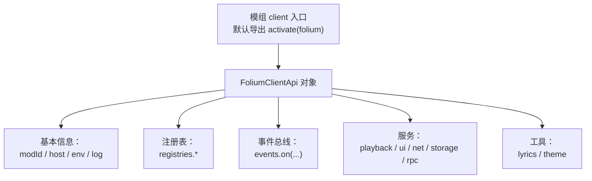
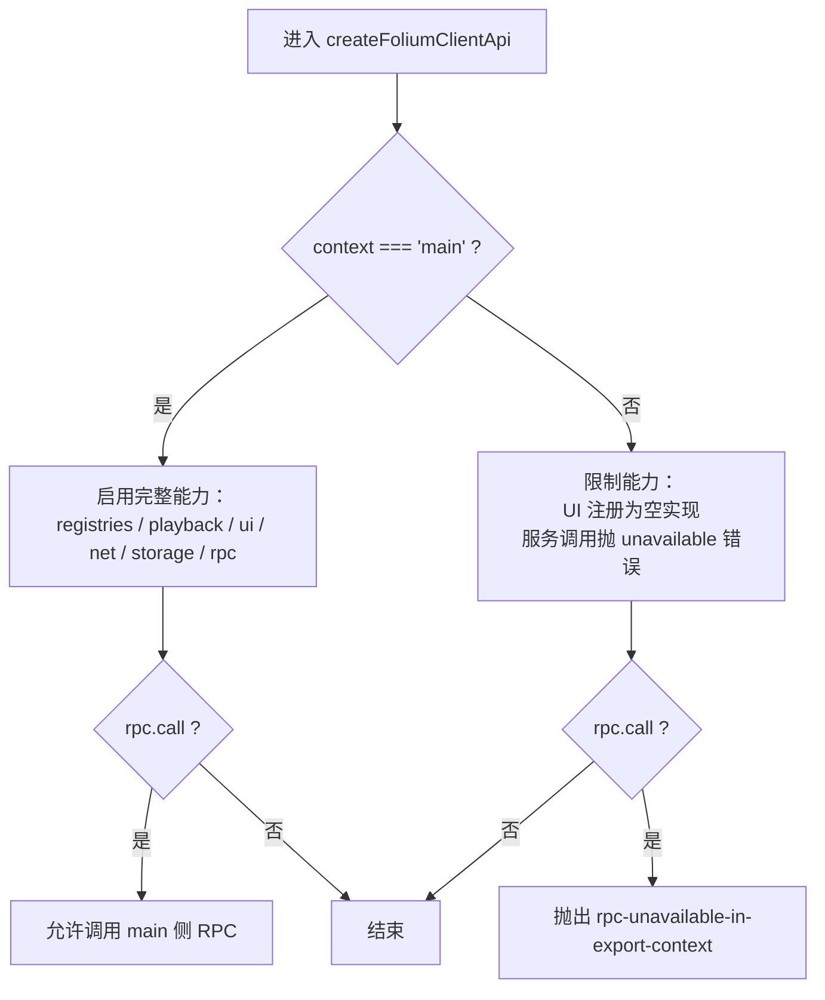
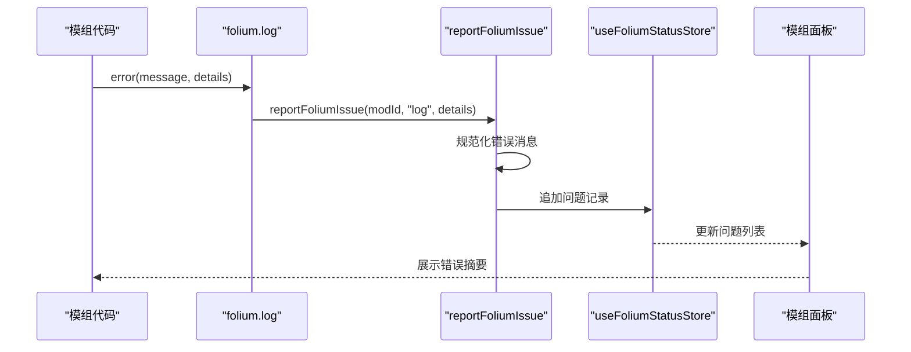
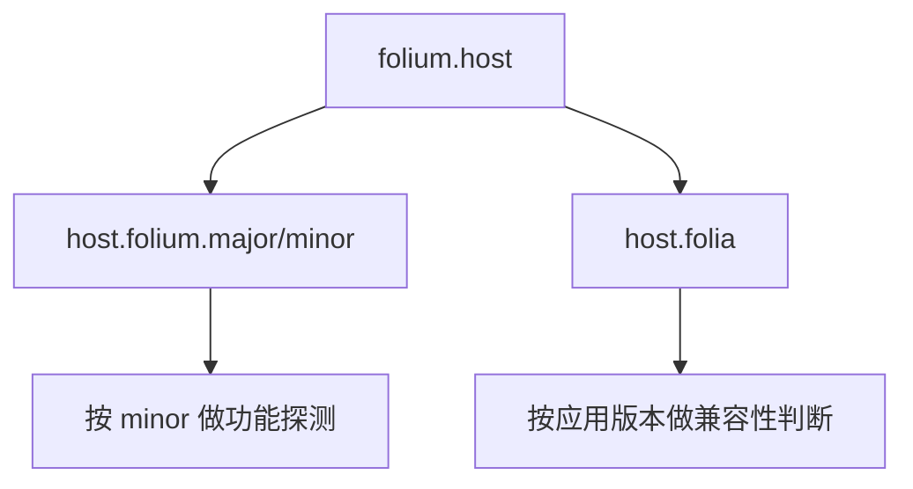
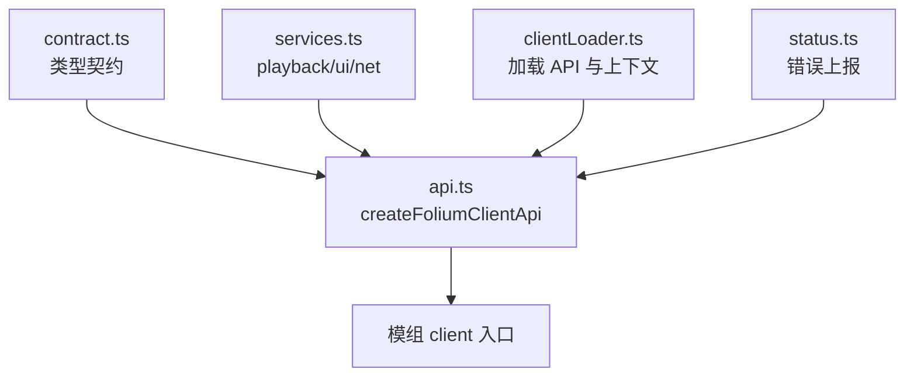

# 核心API接口

<cite>
**本文引用的文件**   
- [contract.ts](file://src/mods/folium/contract.ts)
- [api.ts](file://src/mods/folium/api.ts)
- [clientLoader.ts](file://src/mods/folium/clientLoader.ts)
- [services.ts](file://src/mods/folium/services.ts)
- [status.ts](file://src/mods/folium/status.ts)
- [vite-env.d.ts](file://src/vite-env.d.ts)
- [vite.config.ts](file://vite.config.ts)
- [api.md](file://docs/folium/api.md)
- [mods README](file://mods/README.md)
</cite>

## 目录
1. [简介](#简介)
2. [项目结构与入口](#项目结构与入口)
3. [FoliumClientApi 总览](#foliumclientapi-总览)
4. [基础属性：modId、host、env、log](#基础属性modidhostenvlog)
5. [上下文环境：main 与 export 的差异](#上下文环境main-与-export-的差异)
6. [日志系统与错误报告机制](#日志系统与错误报告机制)
7. [主机信息获取与版本检测](#主机信息获取与版本检测)
8. [TypeScript 类型定义与使用示例](#typescript-类型定义与使用示例)
9. [依赖关系与架构视图](#依赖关系与架构视图)
10. [常见问题与排错建议](#常见问题与排错建议)
11. [结论](#结论)

## 简介
本文聚焦 Folium 模组客户端 API 的核心对象 `FoliumClientApi`，说明其基本属性 `modId`、`host`、`env`、`log` 的用途，解释主窗口与导出窗口的上下文差异，梳理日志输出和错误上报路径，并给出主机版本检查与应用版本检测方式。文末提供 TypeScript 类型定义和使用示例，帮助开发者在模组中安全、稳定地使用 Folium 能力。

## 项目结构与入口
Folium 模组的客户端入口默认导出一个函数，宿主调用时传入 `FoliumClientApi`。该对象由宿主的工厂方法创建，集中暴露模组可访问的能力，包括运行时信息、注册表、事件总线、播放控制、UI 服务、网络访问、本地存储、RPC 以及歌词与主题工具等。



**图表来源**  
- [api.ts:149-239](file://src/mods/folium/api.ts#L149-L239)  
- [contract.ts:1142-1176](file://src/mods/folium/contract.ts#L1142-L1176)

**章节来源**  
- [api.md:25-27](file://docs/folium/api.md#L25-L27)  
- [mods README:170-188](file://mods/README.md#L170-L188)

## FoliumClientApi 总览
`FoliumClientApi` 是模组客户端入口接收到的唯一参数对象，所有能力都从这里取得。它包含：
- 基本信息：`modId`、`host`、`env`、`log`
- 扩展能力：`registries`、`events`、`playback`、`ui`、`net`、`storage`、`rpc`
- 工具：`lyrics`、`theme`
- 实验与内部能力：`experimental`、`internals`

```mermaid
classDiagram
class FoliumClientApi {
+string modId
+FoliumHostInfo host
+{ context : "main" | "export" } env
+FoliumLogger log
+FoliumRegistries registries
+FoliumEvents events
+FoliumPlaybackService playback
+FoliumUiService ui
+FoliumNetService net
+FoliumStorage storage
+FoliumRpc rpc
+FoliumLyricsHelpers lyrics
+FoliumThemeHelpers theme
+Record<string, unknown> experimental
+Record<string, unknown> internals
}
```

**图表来源**  
- [contract.ts:1142-1176](file://src/mods/folium/contract.ts#L1142-L1176)

**章节来源**  
- [contract.ts:1142-1176](file://src/mods/folium/contract.ts#L1142-L1176)  
- [api.md:77-99](file://docs/folium/api.md#L77-L99)

## 基础属性：modId、host、env、log

### modId
- 含义：当前模组的标识符，用于日志前缀、注册条目命名空间、问题上报定位。
- 来源：由宿主注入到 `createFoliumClientApi` 的模组运行时信息中。
- 使用建议：作为日志前缀、调试标识、配置键名前缀，避免不同模组之间冲突。

**章节来源**  
- [api.ts:149-152](file://src/mods/folium/api.ts#L149-L152)  
- [api.md:81-84](file://docs/folium/api.md#L81-L84)

### host
- 含义：宿主运行时的版本信息，用于功能探测。
- 结构：
  - `host.folium.major`、`host.folium.minor`：Folium 契约版本。
  - `host.folia`：应用版本字符串，若无法获取则为 `null`。
- 使用建议：根据 `host.folium.minor` 做向后兼容判断；根据 `host.folia` 判断应用版本范围。

**章节来源**  
- [api.ts:213-216](file://src/mods/folium/api.ts#L213-L216)  
- [contract.ts:10-10](file://src/mods/folium/contract.ts#L10-L10)  
- [api.md:37-44](file://docs/folium/api.md#L37-L44)

### env
- 含义：客户端运行环境，表示代码是在主窗口还是透明视频导出窗口执行。
- 值：
  - `'main'`：主窗口。
  - `'export'`：透明视频导出窗口。
- 使用建议：根据 `env.context` 决定哪些 UI 注册或平台能力可用。

**章节来源**  
- [api.ts:149-150](file://src/mods/folium/api.ts#L149-L150)  
- [api.ts:217-217](file://src/mods/folium/api.ts#L217-L217)  
- [api.md:29-35](file://docs/folium/api.md#L29-L35)

### log
- 含义：模组日志接口。
- 级别：
  - `info(message, details?)`：普通信息，输出到控制台。
  - `warn(message, details?)`：警告，输出到控制台。
  - `error(message, details?)`：错误，不仅输出到控制台，还会进入模组面板的错误列表。
- 实现要点：`error` 会调用宿主的问题上报函数，将错误记录到状态存储并在模组面板展示。

**章节来源**  
- [api.ts:183-187](file://src/mods/folium/api.ts#L183-L187)  
- [status.ts:41-51](file://src/mods/folium/status.ts#L41-L51)  
- [api.md:67-75](file://docs/folium/api.md#L67-L75)

## 上下文环境：main 与 export 的差异
Folium 支持两种客户端上下文：
- `main`：主窗口，拥有完整的 UI 注册能力和宿主服务。
- `export`：透明视频导出窗口，只保留必要的渲染能力，部分 UI 注册和服务不可用。

关键差异：
- UI 相关注册表（如 `commands`、`stageLayers`、`playerPanelTabs`、`controlButtons`、`progressLayers`、`styles`）在 `export` 中为空实现：调用不会报错，但不会生效。
- 服务（`playback`、`ui`、`net`、`storage`、`rpc`）在 `export` 中调用通常会抛出“在当前上下文不可用”的错误，`ui.icon` 例外，它在两个上下文都能用。
- RPC 调用仅在 `main` 上下文有效，`export` 中调用会抛错。
- `internals` 仅在主窗口且模组清单声明了应用版本范围时可用，否则访问会抛错。



**图表来源**  
- [api.ts:149-193](file://src/mods/folium/api.ts#L149-L193)  
- [services.ts:153-193](file://src/mods/folium/services.ts#L153-L193)

**章节来源**  
- [mods README:170-173](file://mods/README.md#L170-L173)  
- [api.ts:154-193](file://src/mods/folium/api.ts#L154-L193)  
- [services.ts:153-193](file://src/mods/folium/services.ts#L153-L193)

## 日志系统与错误报告机制
Folium 的日志系统分为两层：
- 用户可见日志：通过 `folium.log.info`、`folium.log.warn`、`folium.log.error` 输出。
- 错误报告：`folium.log.error` 会将错误记录到模组状态存储，并在模组面板中显示，便于排查。

实现细节：
- `info` 和 `warn` 直接调用控制台输出，带模组 ID 前缀。
- `error` 调用 `reportFoliumIssue`，后者：
  - 将错误消息规范化为字符串。
  - 在控制台以 `[Folium:${modId}] where: message` 形式输出。
  - 将错误写入 Zustand 状态存储，每个模组最多保留最近 20 条。
  - 模组面板读取该状态并展示问题列表。



**图表来源**  
- [api.ts:183-187](file://src/mods/folium/api.ts#L183-L187)  
- [status.ts:41-51](file://src/mods/folium/status.ts#L41-L51)

**章节来源**  
- [api.ts:183-187](file://src/mods/folium/api.ts#L183-L187)  
- [status.ts:1-51](file://src/mods/folium/status.ts#L1-L51)  
- [api.md:67-75](file://docs/folium/api.md#L67-L75)

## 主机信息获取与版本检测
主机信息通过 `folium.host` 提供：
- `host.folium.major`、`host.folium.minor`：Folium 契约版本，固定为 `1.3`。
- `host.folia`：应用版本字符串，若构建时未注入则为 `null`。

版本检测建议：
- 使用 `host.folium.minor` 进行功能探测，例如新增能力从某个 minor 开始可用。
- 使用 `host.folia` 判断应用版本范围，结合模组清单中的 `folia` 约束条件。
- 如果需要在运行时区分是否处于 Electron 应用环境，可通过 `__APP_VERSION__` 是否存在来判断，但更推荐通过 `host.folia` 是否为 `null`。



**图表来源**  
- [api.ts:213-216](file://src/mods/folium/api.ts#L213-L216)  
- [contract.ts:10-10](file://src/mods/folium/contract.ts#L10-L10)  
- [vite-env.d.ts:8-8](file://src/vite-env.d.ts#L8-L8)  
- [vite.config.ts:281-281](file://vite.config.ts#L281-L281)

**章节来源**  
- [api.ts:213-216](file://src/mods/folium/api.ts#L213-L216)  
- [contract.ts:10-10](file://src/mods/folium/contract.ts#L10-L10)  
- [api.md:37-44](file://docs/folium/api.md#L37-L44)

## TypeScript 类型定义与使用示例

### FoliumClientApi 类型定义
以下为 `FoliumClientApi` 的核心字段类型摘要：
- `modId`: `string`
- `host`: `FoliumHostInfo`
- `env`: `{ readonly context: "main" | "export" }`
- `log`: `FoliumLogger`
- `registries`: `FoliumRegistries`
- `events`: `FoliumEvents`
- `playback`: `FoliumPlaybackService`
- `ui`: `FoliumUiService`
- `net`: `FoliumNetService`
- `storage`: `FoliumStorage`
- `rpc`: `FoliumRpc`
- `lyrics`: `FoliumLyricsHelpers`
- `theme`: `FoliumThemeHelpers`
- `experimental`: `Readonly<Record<string, unknown>>`
- `internals`: `Readonly<Record<string, unknown>>`

**章节来源**  
- [contract.ts:1142-1176](file://src/mods/folium/contract.ts#L1142-L1176)

### FoliumLogger 类型定义
- `info(message: string, details?: unknown): void`
- `warn(message: string, details?: unknown): void`
- `error(message: string, details?: unknown): void`

**章节来源**  
- [contract.ts:1131-1139](file://src/mods/folium/contract.ts#L1131-L1139)

### FoliumStorage 类型定义
- `get<T>(key: string): Promise<T | undefined>`
- `set(key: string, value: unknown): Promise<void>`
- `has(key: string): Promise<boolean>`
- `delete(key: string): Promise<void>`
- `keys(): Promise<string[]>`

**章节来源**  
- [contract.ts:1105-1120](file://src/mods/folium/contract.ts#L1105-L1120)

### FoliumRpc 类型定义
- `call<T>(name: string, ...args: unknown[]): Promise<T>`

**章节来源**  
- [contract.ts:1122-1129](file://src/mods/folium/contract.ts#L1122-L1129)

### 使用示例（描述性）
以下示例不直接粘贴代码，而是描述典型用法：
- 获取模组 ID：在初始化时打印 `folium.modId`，用于日志前缀。
- 检查运行环境：读取 `folium.env.context`，如果是 `'export'`，跳过 UI 注册或服务调用。
- 主机版本探测：读取 `folium.host.folium.minor`，根据版本号决定是否使用新能力。
- 应用版本检测：读取 `folium.host.folia`，如果为 `null` 则视为非应用环境或版本不可知。
- 日志输出：使用 `folium.log.info` 输出调试信息，`folium.log.warn` 输出警告，`folium.log.error` 上报错误。
- 存储数据：使用 `folium.storage.set` 保存 JSON 可序列化数据，使用 `folium.storage.get` 读取。
- 调用 main 侧 RPC：仅在 `main` 上下文使用 `folium.rpc.call`，传递可 JSON 序列化的参数。

**章节来源**  
- [api.ts:149-239](file://src/mods/folium/api.ts#L149-L239)  
- [api.md:77-99](file://docs/folium/api.md#L77-L99)

## 依赖关系与架构视图
`FoliumClientApi` 的创建过程依赖多个模块：
- `api.ts`：创建 API 对象，绑定上下文、注册表、日志、RPC、实验能力、内部能力。
- `contract.ts`：定义公开类型契约，包括 `FoliumClientApi`、`FoliumLogger`、`FoliumStorage`、`FoliumRpc` 等。
- `services.ts`：实现 `playback`、`ui`、`net` 等服务，并根据上下文抛出不可用错误。
- `clientLoader.ts`：加载 API 并注入上下文、内部能力与实验能力。
- `status.ts`：提供错误上报与状态存储，供模组面板展示。



**图表来源**  
- [api.ts:149-239](file://src/mods/folium/api.ts#L149-L239)  
- [contract.ts:1142-1176](file://src/mods/folium/contract.ts#L1142-L1176)  
- [services.ts:153-193](file://src/mods/folium/services.ts#L153-L193)  
- [clientLoader.ts:74-79](file://src/mods/folium/clientLoader.ts#L74-L79)  
- [status.ts:41-51](file://src/mods/folium/status.ts#L41-L51)

**章节来源**  
- [api.ts:149-239](file://src/mods/folium/api.ts#L149-L239)  
- [contract.ts:1142-1176](file://src/mods/folium/contract.ts#L1142-L1176)  
- [services.ts:153-193](file://src/mods/folium/services.ts#L153-L193)  
- [clientLoader.ts:74-79](file://src/mods/folium/clientLoader.ts#L74-L79)  
- [status.ts:41-51](file://src/mods/folium/status.ts#L41-L51)

## 常见问题与排错建议
- 在导出窗口调用 UI 服务或网络服务：会抛出“在当前上下文不可用”的错误。建议在调用前检查 `folium.env.context`。
- 在导出窗口调用 RPC：会抛出 `rpc-unavailable-in-export-context`。应仅在 `main` 上下文使用。
- 访问 `internals` 时报错：需要模组清单声明应用版本范围，并且处于 `main` 上下文。
- 日志没有出现在模组面板：只有 `folium.log.error` 会进入模组面板；`info` 和 `warn` 仅输出到控制台。
- 版本探测失败：确认 `host.folia` 是否为 `null`，以及构建时是否正确注入 `__APP_VERSION__`。

**章节来源**  
- [mods README:170-173](file://mods/README.md#L170-L173)  
- [api.ts:191-209](file://src/mods/folium/api.ts#L191-L209)  
- [services.ts:153-193](file://src/mods/folium/services.ts#L153-L193)  
- [status.ts:41-51](file://src/mods/folium/status.ts#L41-L51)

## 结论
`FoliumClientApi` 是模组客户端能力的统一入口，提供模组标识、主机信息、运行环境、日志、注册表、事件、服务、存储、RPC 以及歌词与主题工具。开发者应优先使用 `modId`、`host`、`env`、`log` 进行基础能力接入，并根据上下文差异选择可用的注册与服务。通过 `host.folium` 和 `host.folia` 进行版本探测，结合日志与错误上报机制，可以有效提升模组的稳定性与可维护性。