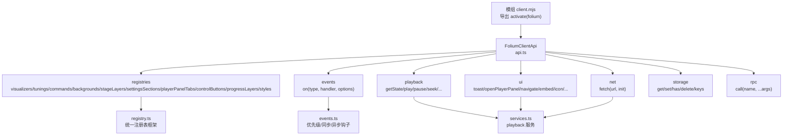
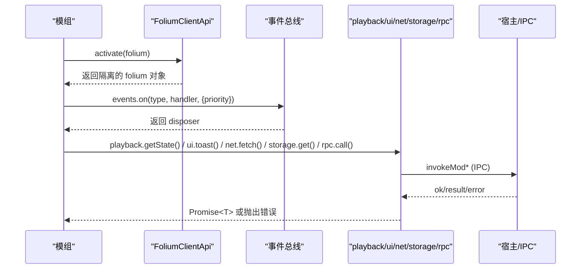
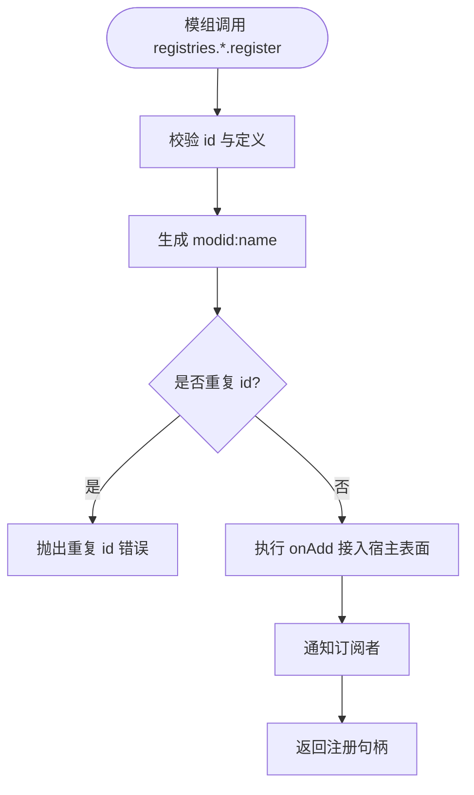
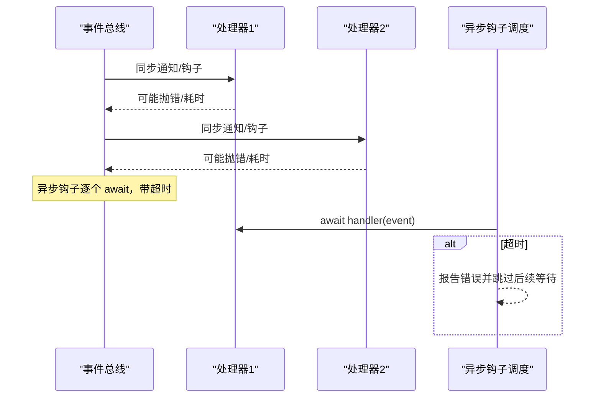
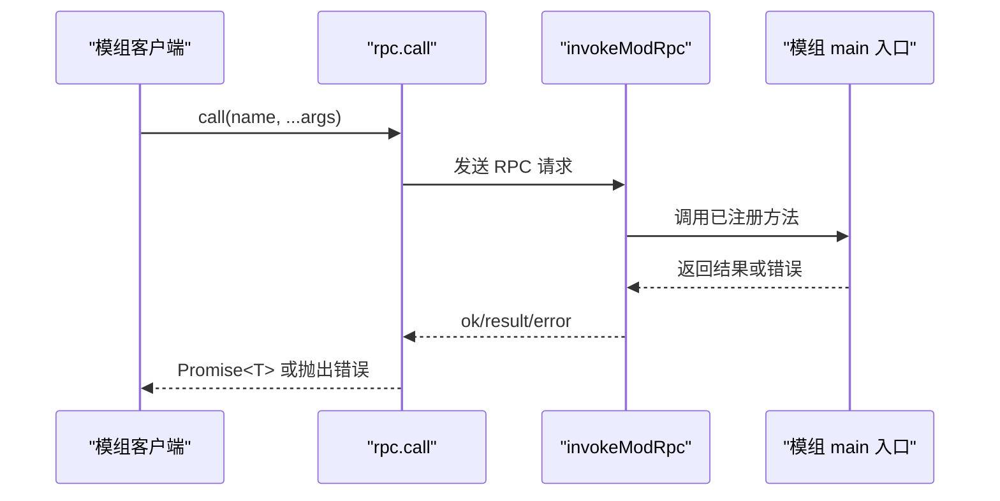
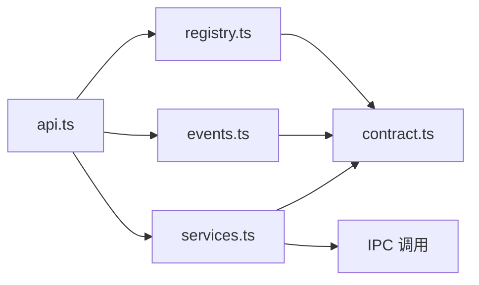

# 模组开发API参考

<cite>
**本文引用的文件**   
- [contract.ts](file://src/mods/folium/contract.ts)
- [api.ts](file://src/mods/folium/api.ts)
- [events.ts](file://src/mods/folium/events.ts)
- [registry.ts](file://src/mods/folium/registry.ts)
- [services.ts](file://src/mods/folium/services.ts)
- [api.md](file://docs/folium/api.md)
</cite>

## 目录
1. [引言](#引言)
2. [项目结构](#项目结构)
3. [核心组件](#核心组件)
4. [架构总览](#架构总览)
5. [详细组件分析](#详细组件分析)
6. [依赖关系分析](#依赖关系分析)
7. [性能与稳定性](#性能与稳定性)
8. [故障排查指南](#故障排查指南)
9. [结论](#结论)
10. [附录：TypeScript 类型速查](#附录typescript-类型速查)

## 引言
本参考文档面向 Folia Major 的 Folium 模组开发者，聚焦 `FoliumClientApi` 接口及其承载的核心服务、注册表、事件系统与 RPC 通信机制。文档基于仓库中的契约定义与实现代码整理，帮助你在不直接阅读源码的情况下，理解如何扩展可视化模式、命令、背景、舞台层、设置分区、进度条控件等能力，并安全地访问播放控制、UI、网络与存储。

## 项目结构
Folium 模组的对外 API 由“契约 + 客户端 API 构造器 + 具体服务”组成：
- 契约层：`contract.ts` 定义所有模组可见的类型、数据结构与服务接口。
- 客户端入口：`api.ts` 构造每个模组隔离的 `folium` 对象，绑定命名空间、权限检查、上下文限制与清理逻辑。
- 事件总线：`events.ts` 提供通知与钩子分发，支持优先级、超时与错误边界。
- 注册表框架：`registry.ts` 提供统一的注册、去重、命名空间、订阅与卸载能力。
- 服务实现：`services.ts` 实现 `playback`、`ui`、`net`，并通过 IPC 调用宿主能力。

**图示来源**
- [api.ts:149-238](file://src/mods/folium/api.ts#L149-L238)
- [registry.ts:45-121](file://src/mods/folium/registry.ts#L45-L121)
- [events.ts:43-138](file://src/mods/folium/events.ts#L43-L138)
- [services.ts:75-199](file://src/mods/folium/services.ts#L75-L199)

**章节来源**
- [api.ts:1-240](file://src/mods/folium/api.ts#L1-L240)
- [contract.ts:1-800](file://src/mods/folium/contract.ts#L1-L800)

## 核心组件
本节概述 `FoliumClientApi` 暴露给模组的全部能力，包括：
- 基本信息：`modId`、`host`、`env`、`log`
- 扩展点：`registries`（注册表集合）
- 事件系统：`events`
- 服务：`playback`、`ui`、`net`、`storage`、`rpc`
- 工具：`lyrics`、`theme`
- 实验与内部：`experimental`、`internals`

关键要点：
- 所有注册都通过 `folium.registries.<name>.register(def)` 完成，返回句柄用于注销。
- UI 相关注册在导出窗口中接受但无效；非 UI 注册在导出窗口仍有效。
- 需要权限的方法未声明对应权限时抛出 `permission-denied:<权限>`。
- 在导出窗口调用受限服务会抛出 `<service>-unavailable-in-export-context`。

**章节来源**
- [api.ts:149-238](file://src/mods/folium/api.ts#L149-L238)
- [api.md:25-113](file://docs/folium/api.md#L25-L113)

## 架构总览
Folium 采用“契约驱动 + 宿主桥接”的架构：
- 契约层只暴露稳定 DTO 与接口，避免模组直接依赖宿主内部状态。
- 客户端 API 为每个模组创建隔离实例，确保注册、RPC、存储与事件监听按模组生命周期管理。
- 服务通过 IPC 与主进程交互，并在主进程中由宿主动作代理实际业务逻辑。

**图示来源**
- [api.ts:149-238](file://src/mods/folium/api.ts#L149-L238)
- [events.ts:43-138](file://src/mods/folium/events.ts#L43-L138)
- [services.ts:75-199](file://src/mods/folium/services.ts#L75-L199)

## 详细组件分析

### FoliumClientApi 接口与方法属性
`FoliumClientApi` 是模组 `activate(folium)` 接收的对象，集中提供：
- 基本信息：`modId`、`host.folium`、`host.folia`、`env.context`
- 日志：`log.info/warn/error`
- 注册表：`registries`
- 事件：`events.on(...)`
- 服务：`playback`、`ui`、`net`、`storage`、`rpc`
- 工具：`lyrics`、`theme`
- 实验与内部：`experimental`、`internals`

使用建议：
- 通过 `host.folium.major/minor` 做功能探测。
- 仅在需要的上下文中调用受限服务（如导出窗口不可用）。
- 对 `experimental` 与 `internals` 进行显式开关与版本范围保护。

**章节来源**
- [api.ts:149-238](file://src/mods/folium/api.ts#L149-L238)
- [contract.ts:1-20](file://src/mods/folium/contract.ts#L1-L20)
- [api.md:25-113](file://docs/folium/api.md#L25-L113)

### 注册表系统（registries）
注册表用于向宿主扩展能力，包括：
- visualizers：歌词动画模式
- tunings：内置模式的调参项
- commands：命令面板与命令调色板条目
- backgrounds：背景类型
- stageLayers：播放器页面图层（需 `ui.stage` 权限）
- settingsSections：模组自身设置区
- playerPanelTabs：播放器面板标签页
- controlButtons：进度条按钮
- progressLayers：进度条覆盖层
- styles：模组 CSS

通用行为：
- `register(def)` 返回 `FoliumRegistryHandle`，包含 `id` 与 `unregister()`。
- id 由宿主加上命名空间成为 `<modid>:<id>`。
- 模组停用时宿主自动撤销其所有注册。
- UI 相关注册在导出窗口接受但不生效。

**图示来源**
- [registry.ts:45-121](file://src/mods/folium/registry.ts#L45-L121)

**章节来源**
- [api.ts:155-181](file://src/mods/folium/api.ts#L155-L181)
- [registry.ts:45-121](file://src/mods/folium/registry.ts#L45-L121)
- [contract.ts:468-726](file://src/mods/folium/contract.ts#L468-L726)
- [api.md:111-373](file://docs/folium/api.md#L111-L373)

### 事件系统（events）
事件系统提供两类分发：
- 通知：`emitFoliumEvent`，同步、fire-and-forget，处理器返回值不被等待。
- 钩子：`dispatchFoliumHookSync` 与 `dispatchFoliumHookAsync`，同一事件对象依次传递给处理器，可被修改；异步钩子有单处理器超时限制。

特性：
- 优先级：`highest > high > normal > low > lowest`，同优先级按注册顺序。
- 错误边界：每个处理器独立捕获异常，不影响其他处理器。
- 性能预算：同步处理器超过 16ms 记录警告；异步处理器超过 1500ms 被放弃继续等待。

**图示来源**
- [events.ts:18-138](file://src/mods/folium/events.ts#L18-L138)

**章节来源**
- [events.ts:1-139](file://src/mods/folium/events.ts#L1-L139)
- [contract.ts:728-800](file://src/mods/folium/contract.ts#L728-L800)
- [api.md:523-641](file://docs/folium/api.md#L523-L641)

### 存储服务（storage）
`folium.storage` 提供键值存储，数据文件与模组 main 入口共享，大小上限 1MB，值必须 JSON 可序列化。
- `get(key)`：读取值，不存在返回 `undefined`
- `set(key, value)`：写入 JSON 可序列化值
- `has(key)`：判断键是否存在
- `delete(key)`：删除键
- `keys()`：列出所有键

注意：
- 仅在主窗口可用；导出窗口调用将抛出 `storage-unavailable-in-export-context`。
- 底层通过 IPC 调用 `invokeModStorage`。

**章节来源**
- [api.ts:103-119](file://src/mods/folium/api.ts#L103-L119)
- [contract.ts:46-58](file://src/mods/folium/contract.ts#L46-L58)
- [api.md:46-58](file://docs/folium/api.md#L46-L58)

### RPC 通信机制（rpc）
`folium.rpc.call(name, ...args)` 调用模组 main 入口注册的函数。
- 参数与返回值必须是 JSON 可序列化。
- 仅在主窗口可用；导出窗口调用将抛出 `rpc-unavailable-in-export-context`。
- 底层通过 IPC 调用 `invokeModRpc`，失败时抛出错误。

典型流程：

**图示来源**
- [api.ts:189-193](file://src/mods/folium/api.ts#L189-L193)

**章节来源**
- [api.ts:189-193](file://src/mods/folium/api.ts#L189-L193)
- [contract.ts:59-66](file://src/mods/folium/contract.ts#L59-L66)
- [api.md:59-66](file://docs/folium/api.md#L59-L66)

### 播放服务（playback）
`folium.playback` 提供播放状态与控制能力：
- `getState()`：获取当前歌曲、状态、位置、时长、喜欢状态等
- `play()/pause()/toggle()`：播放控制
- `seek(seconds)/seekToLyricTime(lyricSeconds)`：跳转播放时间或歌词时间
- `next()/previous()`：切歌
- `playSong(song)/enqueue(song)`：通过 host ref 播放或入队
- `shuffleQueue()/toggleLike()`：打乱队列、喜欢/取消喜欢

权限与可用性：
- 除 `getState` 外均需 `playback.control` 权限。
- 导出窗口不可用。

**章节来源**
- [services.ts:75-100](file://src/mods/folium/services.ts#L75-L100)
- [contract.ts:647-667](file://src/mods/folium/contract.ts#L647-L667)
- [api.md:647-667](file://docs/folium/api.md#L647-L667)

### UI 服务（ui）
`folium.ui` 提供用户界面能力：
- `toast(message, options)`：显示提示
- `openPlayerPanel(tabId?)`：打开播放器面板标签页
- `navigate(view)`：切换视图
- `openVolume()`：打开音量面板
- `pickFile(options)`：选择本地文件（可持久化）
- `restoreFile(grantId)`：恢复之前选择的文件
- `releaseFile(grantId)`：释放持久化授权
- `embed(container, url, options)`：嵌入外部页面（需 `net.embed` 权限）
- `icon(name, options)`：获取宿主图标 SVG

注意：
- 除 `icon` 外，导出窗口不可用。
- `embed` 要求 URL 协议为 https 且 origin 在清单中声明。

**章节来源**
- [services.ts:140-177](file://src/mods/folium/services.ts#L140-L177)
- [contract.ts:669-706](file://src/mods/folium/contract.ts#L669-L706)
- [api.md:669-706](file://docs/folium/api.md#L669-L706)

### 网络服务（net）
`folium.net.fetch(url, init)` 通过宿主发起网络请求，绕过 CORS 限制。
- 需要 `net.fetch` 权限。
- 响应体最大 5MB，`text()` 与 `json()` 同步返回。
- 导出窗口不可用。

**章节来源**
- [services.ts:191-199](file://src/mods/folium/services.ts#L191-L199)
- [contract.ts:708-740](file://src/mods/folium/contract.ts#L708-L740)
- [api.md:708-740](file://docs/folium/api.md#L708-L740)

## 依赖关系分析
- `api.ts` 组合所有服务与注册表，并为每个模组创建隔离实例。
- `registry.ts` 提供通用注册表框架，各具体注册表复用其能力。
- `events.ts` 提供事件分发，被 `api.ts` 与宿主侧逻辑共同使用。
- `services.ts` 通过 IPC 与主进程交互，封装权限与上下文检查。

**图示来源**
- [api.ts:1-240](file://src/mods/folium/api.ts#L1-L240)
- [registry.ts:1-127](file://src/mods/folium/registry.ts#L1-L127)
- [events.ts:1-139](file://src/mods/folium/events.ts#L1-L139)
- [services.ts:1-199](file://src/mods/folium/services.ts#L1-L199)
- [contract.ts:1-800](file://src/mods/folium/contract.ts#L1-L800)

**章节来源**
- [api.ts:1-240](file://src/mods/folium/api.ts#L1-L240)
- [registry.ts:1-127](file://src/mods/folium/registry.ts#L1-L127)
- [events.ts:1-139](file://src/mods/folium/events.ts#L1-L139)
- [services.ts:1-199](file://src/mods/folium/services.ts#L1-L199)

## 性能与稳定性
- 事件处理器同步执行预算为 16ms，超时会记录警告。
- 异步钩子单处理器超时为 1500ms，超时后不再等待后续处理。
- 注册表变更触发稳定快照引用，适合 React 订阅。
- 服务调用在导出窗口或无权限时快速失败，避免阻塞渲染。

[本节为通用指导，无需特定文件引用]

## 故障排查指南
常见问题与定位：
- 权限不足：检查 `mod.json` 是否声明所需权限，如 `playback.control`、`net.fetch`、`net.embed`、`ui.stage`。
- 上下文不可用：导出窗口不支持部分服务（如 `playback`、`ui`、`net`、`storage`），应检测 `env.context`。
- 注册冲突：确保 `id` 唯一且符合命名规则，避免重复注册。
- 事件处理器卡顿：优化同步处理器逻辑，避免长耗时操作。
- RPC 失败：检查 main 入口是否正确注册同名方法，并确保参数与返回值可序列化。

**章节来源**
- [events.ts:26-29](file://src/mods/folium/events.ts#L26-L29)
- [registry.ts:76-83](file://src/mods/folium/registry.ts#L76-L83)
- [services.ts:55-73](file://src/mods/folium/services.ts#L55-L73)

## 结论
Folium 模组 API 以契约为核心，通过隔离的客户端 API 暴露注册表、事件、服务与工具能力。开发者应遵循权限与上下文约束，合理使用注册表扩展 UI 与行为，利用事件系统解耦模块间通信，并通过 RPC 与存储服务实现跨进程协作与数据持久化。

[本节为总结性内容，无需特定文件引用]

## 附录：TypeScript 类型速查
以下为常用类型与用途速查，完整定义请参考契约文件与官方 API 文档。

- 基础类型
  - `FOLIUM_VERSION`：主机实现的 Folium 版本常量
  - `FoliumId`：模组命名空间 ID
  - `FoliumLabel`：本地化文本映射
  - `FoliumDisposer`：清理函数

- 数据结构
  - `FoliumLine`：歌词行
  - `FoliumTheme`：主题信息
  - `FoliumSong`：歌曲 DTO
  - `FoliumPlaybackState`：播放状态

- 参数 Schema
  - `FoliumParamType`：字段类型
  - `FoliumParamOption`：选项
  - `FoliumParam`：字段定义
  - `FoliumParamValues`：合并默认值后的值
  - `FoliumParamAccess`：读写访问器

- 宿主容器与上下文
  - `FoliumMount<Ctx>`：挂载函数
  - `FoliumPanelContext`：面板上下文
  - `FoliumSettingsPanelContext`：设置面板上下文
  - `FoliumClock`：时钟
  - `FoliumSurface`：宿主绘制表面
  - `FoliumAudioBands`：音频频段
  - `FoliumAudio`：音频分析器
  - `FoliumDisplay`：显示设置
  - `FoliumStageContext`：舞台上下文

- 注册表定义
  - `FoliumVisualizerDef`：可视化模式
  - `FoliumTuningDef`：调参项
  - `FoliumCommandDef`：命令定义
  - `FoliumBackgroundDef`：背景定义
  - `FoliumStageLayerDef`：舞台层定义
  - `FoliumSettingsSectionDef`：设置分区定义
  - `FoliumPlayerPanelTabDef`：播放器面板标签
  - `FoliumControlButtonDef`：进度条按钮
  - `FoliumProgressLayerDef`：进度条覆盖层
  - `FoliumStyleDef`：样式定义
  - `FoliumRegistryHandle`：注册句柄
  - `FoliumSettingsSectionHandle`：设置分区句柄
  - `FoliumRegistry<Def, Handle>`：注册表接口
  - `FoliumRegistries`：注册表集合

- 事件
  - `FoliumEventPriority`：优先级
  - `FoliumNotificationEvents`：通知事件
  - `FoliumLyricsTransformEvent`：歌词转换钩子
  - `FoliumBeforePlayEvent`：播放前钩子
  - `FoliumOmniLyricsEvent`：Omni 歌词解析事件
  - `FoliumOmniAudioEvent`：Omni 音频源解析事件
  - `FoliumHookEvents`：钩子事件
  - `FoliumEventMap`：事件映射
  - `FoliumEvents`：事件总线

- 服务
  - `FoliumPlaybackService`：播放服务
  - `FoliumFileHandle`：文件句柄
  - `FoliumIconOptions`：图标选项
  - `FoliumUiService`：UI 服务
  - `FoliumFetchInit`：请求初始化
  - `FoliumFetchResponse`：响应对象
  - `FoliumNetService`：网络服务

- 共享工具
  - `FoliumWordSegment`：分词片段
  - `FoliumWordColorRange`：关键词颜色区间
  - `FoliumLyricsHelpers`：歌词工具
  - `FoliumThemeHelpers`：主题工具

**章节来源**
- [contract.ts:1-800](file://src/mods/folium/contract.ts#L1-L800)
- [api.md:1-800](file://docs/folium/api.md#L1-L800)