# 注册表API

<cite>
**本文引用的文件**   
- [src/mods/folium/registry.ts](file://src/mods/folium/registry.ts)
- [src/mods/folium/contract.ts](file://src/mods/folium/contract.ts)
- [src/mods/folium/api.ts](file://src/mods/folium/api.ts)
- [src/mods/folium/registries/visualizers.tsx](file://src/mods/folium/registries/visualizers.tsx)
- [src/mods/folium/registries/tunings.tsx](file://src/mods/folium/registries/tunings.tsx)
- [src/mods/folium/registries/commands.ts](file://src/mods/folium/registries/commands.ts)
- [src/mods/folium/registries/backgrounds.tsx](file://src/mods/folium/registries/backgrounds.tsx)
- [src/mods/folium/registries/stageLayers.tsx](file://src/mods/folium/registries/stageLayers.tsx)
- [src/mods/folium/registries/settingsSections.tsx](file://src/mods/folium/registries/settingsSections.tsx)
- [src/mods/folium/registries/playerPanelTabs.tsx](file://src/mods/folium/registries/playerPanelTabs.tsx)
- [src/mods/folium/registries/progress.tsx](file://src/mods/folium/registries/progress.tsx)
- [src/mods/folium/registries/styles.ts](file://src/mods/folium/registries/styles.ts)
</cite>

## 目录
1. [简介](#简介)
2. [项目结构](#项目结构)
3. [核心组件](#核心组件)
4. [架构总览](#架构总览)
5. [详细组件分析](#详细组件分析)
6. [依赖关系分析](#依赖关系分析)
7. [性能与生命周期](#性能与生命周期)
8. [故障排查指南](#故障排查指南)
9. [结论](#结论)

## 简介
本文面向插件开发者，系统性说明 Folium 的注册表 API。围绕以下注册表展开：可视化效果（visualizers）、调优配置（tunings）、命令（commands）、背景效果（backgrounds）、舞台图层（stageLayers）、设置面板（settingsSections）、播放器面板标签（playerPanelTabs）、控制按钮（controlButtons）、进度条图层（progressLayers）、样式（styles）。对每种注册表的定义格式、生命周期、回调机制、上下文对象、参数系统与持久化进行说明，并给出关键流程图和时序图，帮助读者从“如何注册”到“如何渲染与销毁”形成完整认知。

## 项目结构
Folium 的注册体系由三层构成：
- 契约层：在 contract.ts 中声明所有对外暴露的类型与定义接口，保证 mod 与 host 之间的稳定边界。
- 通用注册中心：registry.ts 提供统一的 id 命名空间、去重校验、订阅通知、按 mod 卸载等能力。
- 具体注册表：每个功能域一个 registry 实现，负责字段校验、将定义适配为宿主可消费的结构，并在 onAdd/onRemove 中挂载或卸载宿主侧能力。

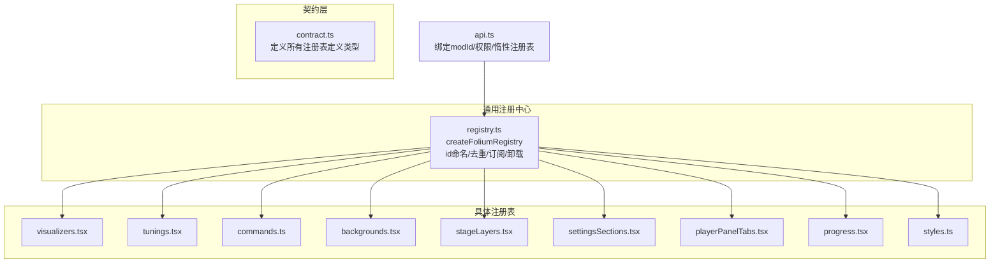

图示来源
- [src/mods/folium/contract.ts:468-726](file://src/mods/folium/contract.ts#L468-L726)
- [src/mods/folium/registry.ts:45-120](file://src/mods/folium/registry.ts#L45-L120)
- [src/mods/folium/api.ts:53-64](file://src/mods/folium/api.ts#L53-L64)

章节来源
- [src/mods/folium/contract.ts:468-726](file://src/mods/folium/contract.ts#L468-L726)
- [src/mods/folium/registry.ts:45-120](file://src/mods/folium/registry.ts#L45-L120)
- [src/mods/folium/api.ts:53-64](file://src/mods/folium/api.ts#L53-L64)

## 核心组件
- FoliumId 与命名空间：所有注册的 id 最终形如 `modid:name`，由主机在注册时拼接，避免跨 mod 冲突。
- 通用注册中心 createFoliumRegistry：
  - validate：校验并规范化 mod 提供的定义；抛出即拒绝注册。
  - onAdd：接受后接入宿主表面；抛出则回滚注册。
  - onRemove：注销或 mod 卸载时调用，撤销 onAdd 的效果。
  - list/subscribe：提供稳定数组引用与变更通知，便于 React useSyncExternalStore 安全消费。
- 统一返回句柄：register 返回 { id, unregister }，支持按条目级卸载；mod 卸载时主机也会清理其全部注册。

章节来源
- [src/mods/folium/registry.ts:12-41](file://src/mods/folium/registry.ts#L12-L41)
- [src/mods/folium/registry.ts:45-120](file://src/mods/folium/registry.ts#L45-L120)
- [src/mods/folium/contract.ts:681-726](file://src/mods/folium/contract.ts#L681-L726)

## 架构总览
下图展示 mod 通过 api.ts 暴露的 registries 与各具体注册表的关系，以及 UI 相关注册表在非主窗口（导出/OBS）中的惰性行为。

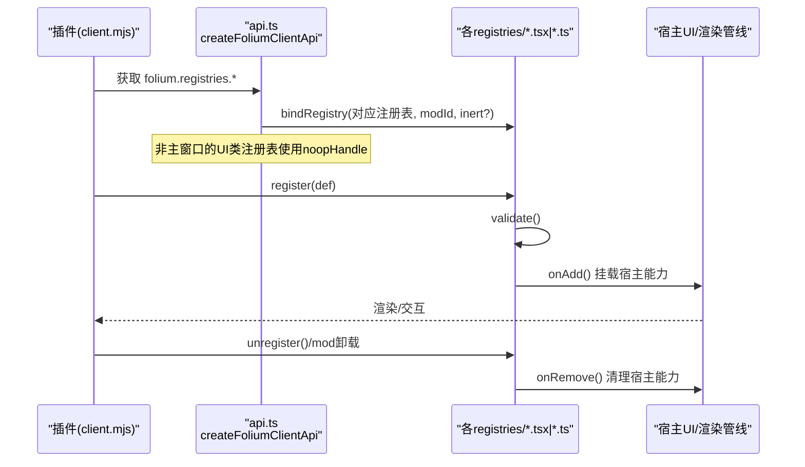

图示来源
- [src/mods/folium/api.ts:78-89](file://src/mods/folium/api.ts#L78-L89)
- [src/mods/folium/api.ts:149-181](file://src/mods/folium/api.ts#L149-L181)
- [src/mods/folium/registry.ts:76-103](file://src/mods/folium/registry.ts#L76-L103)

## 详细组件分析

### 可视化效果 visualizers
- 定义格式
  - id：本地标识，最终模式 id 为 `mod:<modid>:<id>`。
  - label：多语言名称。
  - order：选择器排序，默认 500。
  - mount：接收 FoliumStageContext，绘制可视化内容。
  - settings：参数表单 schema。
  - settingsPanel：自定义设置面板（仍需遵循 settings 的键与校验）。
  - hostLayers：是否保留宿主背景与字幕层。
- 生命周期与回调
  - validate：校验 mount/settingsPanel 类型，规范化 settings，生成 settingsAccess。
  - onAdd：转换为 VisualizerRegistryEntry 并入宿主可视化注册表。
  - onRemove：从宿主可视化注册表移除。
- 上下文
  - FoliumStageContext：歌词、歌曲、时间轴、主题、音频、显示设置、封面、设置值、透明表面等。
- 渲染与设置
  - 懒加载渲染器，避免在无 mod 时引入宿主 UI 依赖。
  - 若存在 settings，自动生成设置卡片；也可用自定义面板替换。

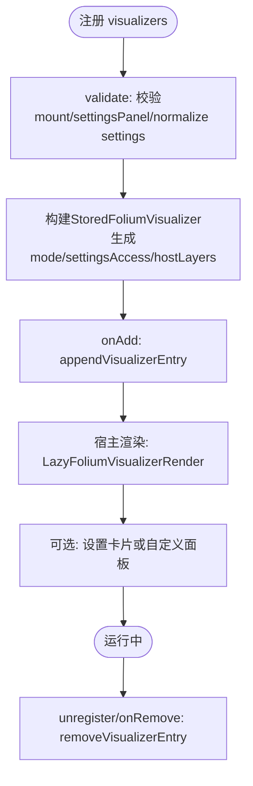

图示来源
- [src/mods/folium/registries/visualizers.tsx:83-112](file://src/mods/folium/registries/visualizers.tsx#L83-L112)
- [src/mods/folium/contract.ts:470-489](file://src/mods/folium/contract.ts#L470-L489)
- [src/mods/folium/contract.ts:421-466](file://src/mods/folium/contract.ts#L421-L466)

章节来源
- [src/mods/folium/registries/visualizers.tsx:20-112](file://src/mods/folium/registries/visualizers.tsx#L20-L112)
- [src/mods/folium/contract.ts:470-489](file://src/mods/folium/contract.ts#L470-L489)
- [src/mods/folium/contract.ts:421-466](file://src/mods/folium/contract.ts#L421-L466)

### 调优配置 tunings
- 作用
  - 为已声明可调参数的内置可视化模式提供额外旋钮。
- 定义格式
  - target：目标内置模式 id。
  - params：仅 number 类型，键必须来自目标的 foliumTunables 白名单，范围取交集。
  - label：调优卡标题。
- 生命周期与回调
  - validate：检查 target 是否存在且声明了可调项；过滤非法参数；计算 min/max/default；创建 access。
  - onAdd：占用 key 所有权（同一 key 只允许一个 tuning）。
  - onRemove：释放 key 所有权。
- 读取方式
  - 内置模式通过 useFoliumTunings(target) 读取合并后的乘数映射。

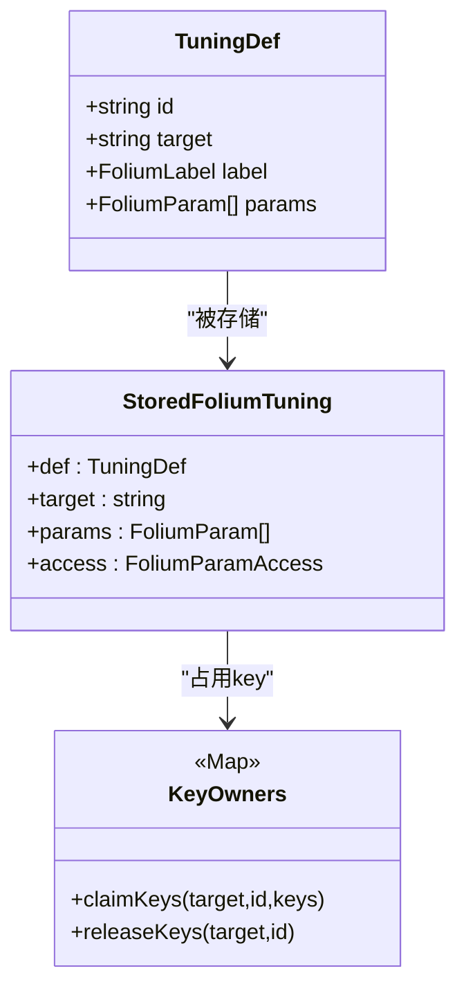

图示来源
- [src/mods/folium/registries/tunings.tsx:21-85](file://src/mods/folium/registries/tunings.tsx#L21-L85)
- [src/mods/folium/contract.ts:491-501](file://src/mods/folium/contract.ts#L491-L501)

章节来源
- [src/mods/folium/registries/tunings.tsx:21-134](file://src/mods/folium/registries/tunings.tsx#L21-L134)
- [src/mods/folium/contract.ts:491-501](file://src/mods/folium/contract.ts#L491-L501)

### 命令 commands
- 作用
  - 在“插件面板”和“命令面板”中暴露可由用户执行的动作。
- 定义格式
  - id、label、description、keywords、params、run(values)。
- 生命周期与回调
  - validate：确保 run 是函数，规范化 params。
  - 运行时：runFoliumCommand 会合并默认值、执行 run、汇总结果与警告，并将状态写入 store。
- 错误处理
  - 捕获异常并上报问题，同时更新 UI 状态。

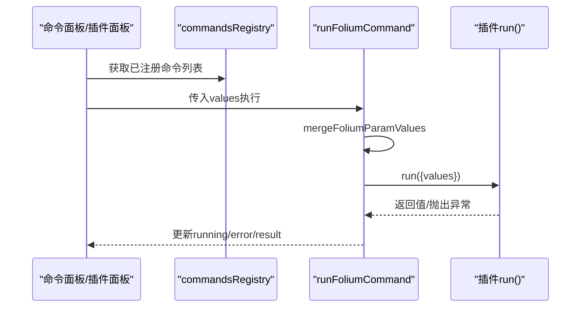

图示来源
- [src/mods/folium/registries/commands.ts:18-25](file://src/mods/folium/registries/commands.ts#L18-L25)
- [src/mods/folium/registries/commands.ts:70-86](file://src/mods/folium/registries/commands.ts#L70-L86)

章节来源
- [src/mods/folium/registries/commands.ts:1-87](file://src/mods/folium/registries/commands.ts#L1-L87)
- [src/mods/folium/contract.ts:509-526](file://src/mods/folium/contract.ts#L509-L526)

### 背景效果 backgrounds
- 作用
  - 在所有可视化模式之下绘制背景，包含预览与导出。
- 定义格式
  - id、label、order、mount、settings、settingsPanel。
- 生命周期与回调
  - validate：校验 mount/settingsPanel，规范化 settings，生成 settingsAccess。
  - onAdd：转为 VisualizerBackgroundRegistryEntry 并入宿主背景注册表。
  - onRemove：从宿主背景注册表移除。
- 上下文
  - FoliumBackgroundContext：静态模式、暂停、主题、封面、设置值、音频分析器、订阅。

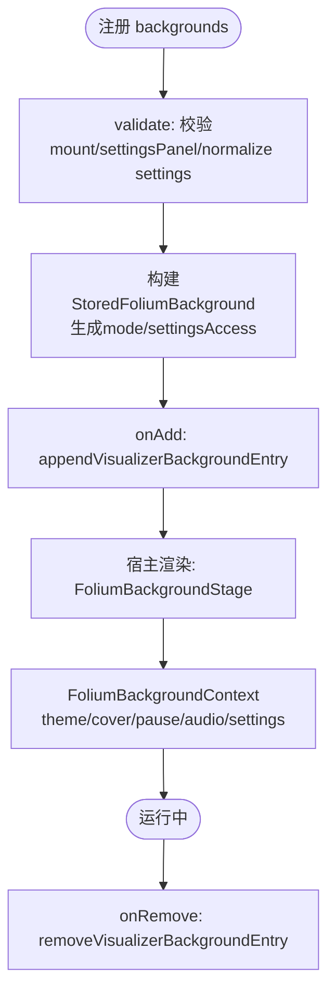

图示来源
- [src/mods/folium/registries/backgrounds.tsx:150-174](file://src/mods/folium/registries/backgrounds.tsx#L150-L174)
- [src/mods/folium/contract.ts:528-560](file://src/mods/folium/contract.ts#L528-L560)

章节来源
- [src/mods/folium/registries/backgrounds.tsx:27-174](file://src/mods/folium/registries/backgrounds.tsx#L27-L174)
- [src/mods/folium/contract.ts:528-560](file://src/mods/folium/contract.ts#L528-L560)

### 舞台图层 stageLayers
- 作用
  - 在真实播放器页面上插入图层（不在预览/OBS/导出窗口）。
- 定义格式
  - slot：'player.stage.back' | 'player.stage.front' | 'app.overlay'。
  - order、interactive、mount。
- 生命周期与回调
  - validate：校验 slot 与 mount。
  - 渲染：仅在存在该 slot 的层时才懒加载视图，避免无 mod 时的体积膨胀。
- 权限
  - 需要 ui.stage 权限，否则 api.ts 会拒绝注册。

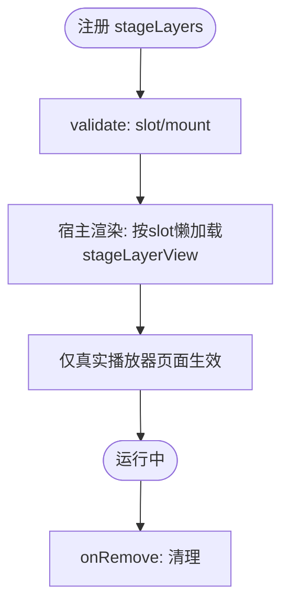

图示来源
- [src/mods/folium/registries/stageLayers.tsx:21-31](file://src/mods/folium/registries/stageLayers.tsx#L21-L31)
- [src/mods/folium/api.ts:160-168](file://src/mods/folium/api.ts#L160-L168)

章节来源
- [src/mods/folium/registries/stageLayers.tsx:1-55](file://src/mods/folium/registries/stageLayers.tsx#L1-L55)
- [src/mods/folium/api.ts:160-168](file://src/mods/folium/api.ts#L160-L168)
- [src/mods/folium/contract.ts:562-589](file://src/mods/folium/contract.ts#L562-L589)

### 设置面板 settingsSections
- 作用
  - 插件自身的设置区，在插件行展开时显示。
- 定义格式
  - id、label、description、settings、settingsPanel。
- 生命周期与回调
  - validate：至少一个有效字段；校验 settingsPanel 类型；创建 access。
  - 返回句柄附带 params，供插件读取/写入用户设置。
- 持久化
  - 值持久化在 settings:<id>，随视觉配置导入导出。

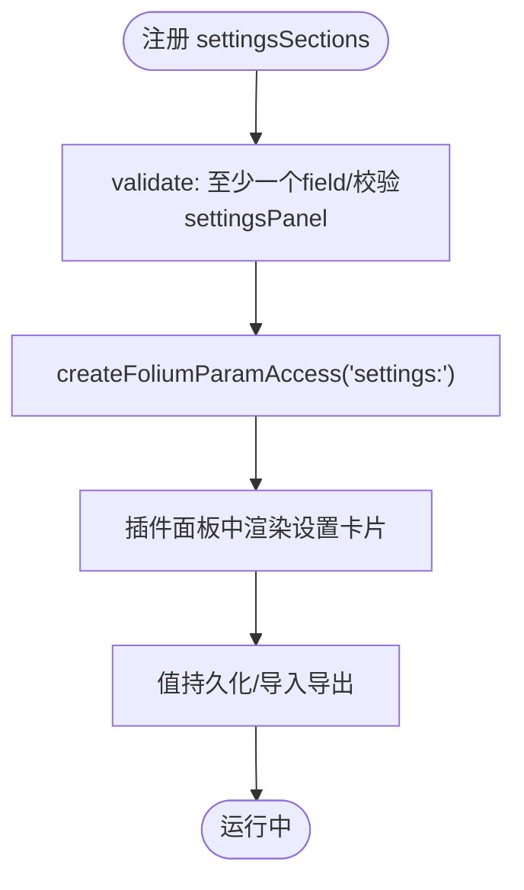

图示来源
- [src/mods/folium/registries/settingsSections.tsx:22-33](file://src/mods/folium/registries/settingsSections.tsx#L22-L33)
- [src/mods/folium/contract.ts:591-606](file://src/mods/folium/contract.ts#L591-L606)

章节来源
- [src/mods/folium/registries/settingsSections.tsx:1-74](file://src/mods/folium/registries/settingsSections.tsx#L1-L74)
- [src/mods/folium/contract.ts:591-606](file://src/mods/folium/contract.ts#L591-L606)

### 播放器面板标签 playerPanelTabs
- 作用
  - 在播放器面板增加额外标签页。
- 定义格式
  - id、label、order、mount。
- 生命周期与回调
  - validate：校验 mount。
  - 渲染：为每个标签提供隔离容器与主题上下文。
- 打开方式
  - 通过 folium.ui.openPlayerPanel(id) 打开。

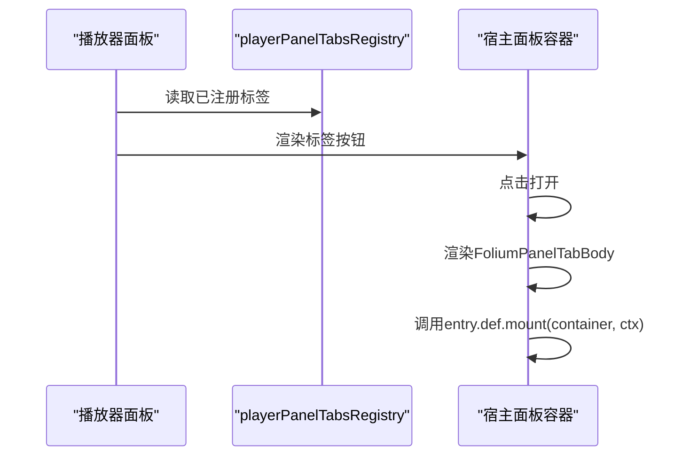

图示来源
- [src/mods/folium/registries/playerPanelTabs.tsx:17-24](file://src/mods/folium/registries/playerPanelTabs.tsx#L17-L24)
- [src/mods/folium/registries/playerPanelTabs.tsx:87-93](file://src/mods/folium/registries/playerPanelTabs.tsx#L87-L93)
- [src/mods/folium/contract.ts:608-618](file://src/mods/folium/contract.ts#L608-L618)

章节来源
- [src/mods/folium/registries/playerPanelTabs.tsx:1-94](file://src/mods/folium/registries/playerPanelTabs.tsx#L1-L94)
- [src/mods/folium/contract.ts:608-618](file://src/mods/folium/contract.ts#L608-L618)

### 控制按钮 controlButtons 与进度条图层 progressLayers
- 作用
  - 扩展宿主进度条：两侧按钮与轨道上的覆盖图层。
- 定义格式
  - controlButtons：slot（leading/trailing）、order、hideWhenCollapsed、mount。
  - progressLayers：order、mount。
- 生命周期与回调
  - validate：校验 slot/mount/hideWhenCollapsed。
  - 渲染：按钮按顺序渲染在 leading/trailing 槽；图层以 pointer-events-none 包裹，允许底层 seek。
- 上下文
  - FoliumProgressContext：currentTime、duration、timeToRatio、seek、getColors、subscribe。

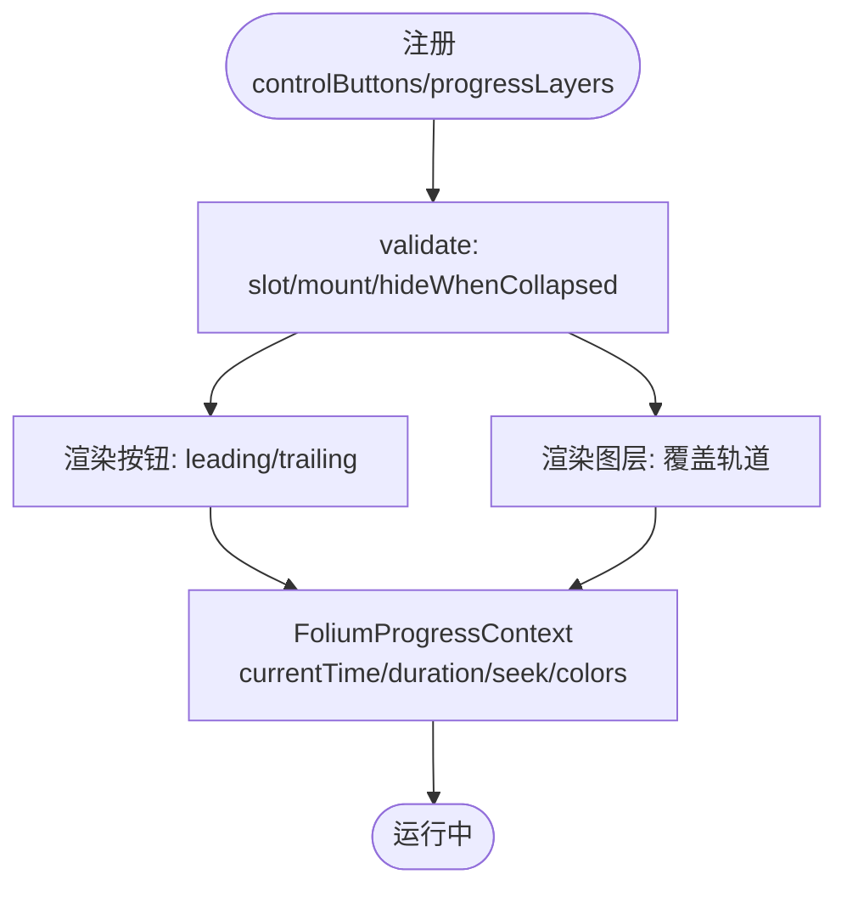

图示来源
- [src/mods/folium/registries/progress.tsx:22-44](file://src/mods/folium/registries/progress.tsx#L22-L44)
- [src/mods/folium/registries/progress.tsx:64-103](file://src/mods/folium/registries/progress.tsx#L64-L103)
- [src/mods/folium/contract.ts:620-667](file://src/mods/folium/contract.ts#L620-L667)

章节来源
- [src/mods/folium/registries/progress.tsx:1-171](file://src/mods/folium/registries/progress.tsx#L1-L171)
- [src/mods/folium/contract.ts:620-667](file://src/mods/folium/contract.ts#L620-L667)

### 样式 styles
- 作用
  - 注入 CSS 到宿主页面，位于 @layer folium-mods，优先级高于宿主工具类但不需 !important。
- 定义格式
  - id、css（字符串，最大长度限制）。
- 生命周期与回调
  - validate：校验 css 类型与长度。
  - onAdd：创建 <style> 节点并追加至 head。
  - onRemove：移除对应 <style> 节点。

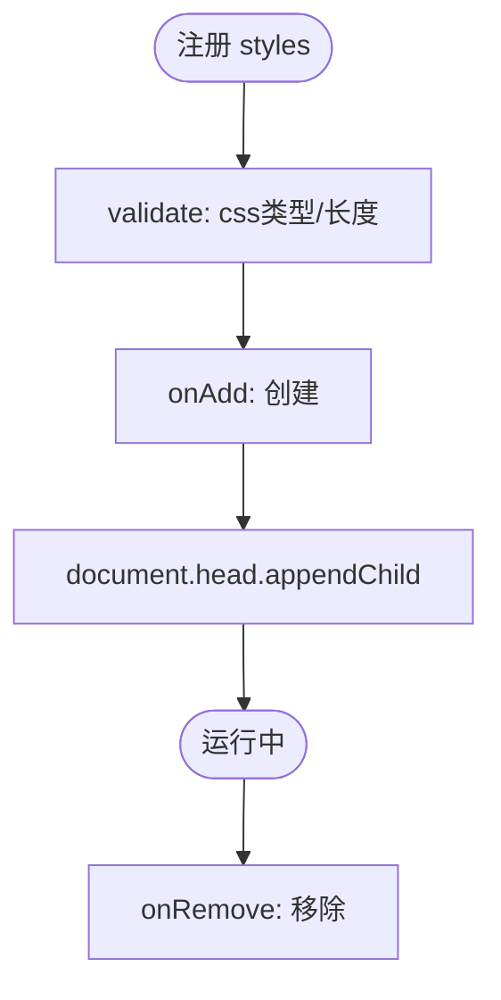

图示来源
- [src/mods/folium/registries/styles.ts:17-39](file://src/mods/folium/registries/styles.ts#L17-L39)
- [src/mods/folium/contract.ts:669-679](file://src/mods/folium/contract.ts#L669-L679)

章节来源
- [src/mods/folium/registries/styles.ts:1-40](file://src/mods/folium/registries/styles.ts#L1-L40)
- [src/mods/folium/contract.ts:669-679](file://src/mods/folium/contract.ts#L669-L679)

## 依赖关系分析
- 契约与实现解耦：contract.ts 仅暴露对外类型；各 registries 内部实现细节不泄漏给 mod。
- 通用注册中心复用：所有注册表共享 createFoliumRegistry 的 id 命名、去重、订阅与卸载逻辑。
- 宿主集成点：
  - visualizers/backgrounds 分别并入宿主可视化与背景的注册表。
  - stageLayers/playerPanelTabs/controlButtons/progressLayers/styles 直接操作宿主 UI。
  - commands 提供可执行动作，结果由 UI 展示。
- 权限与上下文差异：
  - stageLayers 需要 ui.stage 权限。
  - UI 相关注册表在非主窗口（导出/OBS）中接受注册但保持惰性（noopHandle），不影响导出渲染。

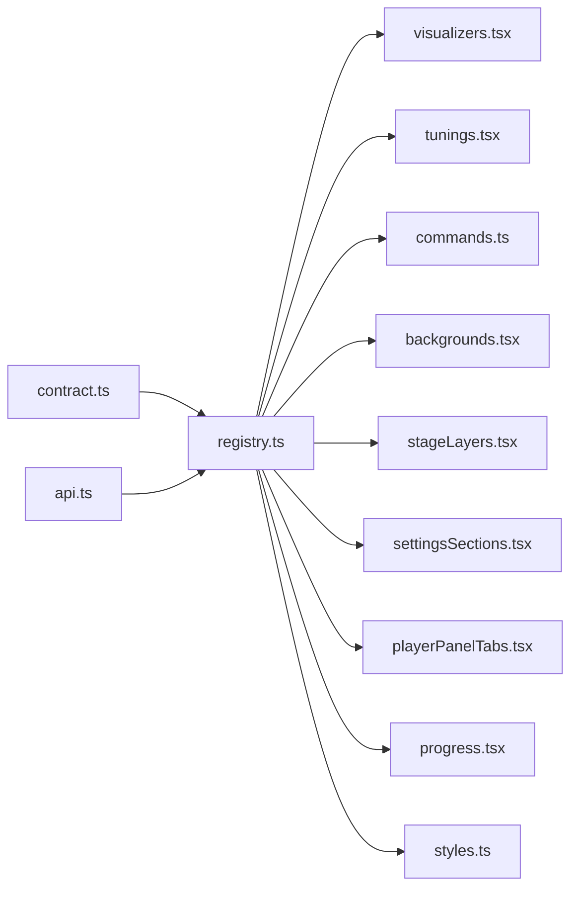

图示来源
- [src/mods/folium/contract.ts:468-726](file://src/mods/folium/contract.ts#L468-L726)
- [src/mods/folium/registry.ts:45-120](file://src/mods/folium/registry.ts#L45-L120)
- [src/mods/folium/api.ts:53-64](file://src/mods/folium/api.ts#L53-L64)

章节来源
- [src/mods/folium/contract.ts:468-726](file://src/mods/folium/contract.ts#L468-L726)
- [src/mods/folium/registry.ts:45-120](file://src/mods/folium/registry.ts#L45-L120)
- [src/mods/folium/api.ts:53-64](file://src/mods/folium/api.ts#L53-L64)

## 性能与生命周期
- 渲染优化
  - visualizers 使用 React.lazy 懒加载渲染器，避免无 mod 时引入宿主 UI 依赖。
  - stageLayers 仅在存在对应 slot 时懒加载视图，减少包体与初始化开销。
  - progress 与 background 使用稳定的 context 引用与 memo，减少不必要重渲染。
- 订阅与通知
  - registry.ts 维护 listeners 集合，变更时冻结新快照并通知订阅者，适合 useSyncExternalStore。
  - settingsSections/tunings 通过 paramStore 提供值变化订阅。
- 资源清理
  - 每个 register 返回 handle.unregister，支持按条目卸载；mod 卸载时主机批量清理。
  - styles 在 onRemove 中移除 <style> 节点，避免内存泄漏。

章节来源
- [src/mods/folium/registry.ts:53-62](file://src/mods/folium/registry.ts#L53-L62)
- [src/mods/folium/registry.ts:94-103](file://src/mods/folium/registry.ts#L94-L103)
- [src/mods/folium/registries/visualizers.tsx:20-21](file://src/mods/folium/registries/visualizers.tsx#L20-L21)
- [src/mods/folium/registries/stageLayers.tsx:33-54](file://src/mods/folium/registries/stageLayers.tsx#L33-L54)
- [src/mods/folium/registries/styles.ts:27-39](file://src/mods/folium/registries/styles.ts#L27-L39)

## 故障排查指南
- 常见注册失败原因
  - id 不符合正则：必须以字母开头，仅含小写字母、数字与连字符。
  - 重复 id：同一 mod 内不可重复，跨 mod 因前缀不同不会冲突。
  - 缺少必要字段：如 mount/run/css 不是函数或字符串。
  - settingsPanel 未配合 settings：必须有有效的 settings schema。
  - tunings 目标不存在或未声明可调项：target 必须是声明了 foliumTunables 的模式。
  - stageLayers 缺少权限：未声明 ui.stage 权限会被拒绝。
- 调试建议
  - 使用 api.log.warn/log.error 输出问题；commands 的错误会汇总到 UI 状态。
  - 关注 console.warn 中 [Folium] 前缀的监听器报错，定位订阅回调异常。
  - 在导出/OBS 环境中，UI 类注册表不会真正挂载，属预期行为。

章节来源
- [src/mods/folium/registry.ts:76-92](file://src/mods/folium/registry.ts#L76-L92)
- [src/mods/folium/registries/visualizers.tsx:83-94](file://src/mods/folium/registries/visualizers.tsx#L83-L94)
- [src/mods/folium/registries/backgrounds.tsx:150-158](file://src/mods/folium/registries/backgrounds.tsx#L150-L158)
- [src/mods/folium/registries/tunings.tsx:48-81](file://src/mods/folium/registries/tunings.tsx#L48-L81)
- [src/mods/folium/registries/stageLayers.tsx:21-31](file://src/mods/folium/registries/stageLayers.tsx#L21-L31)
- [src/mods/folium/api.ts:160-168](file://src/mods/folium/api.ts#L160-L168)

## 结论
Folium 的注册表 API 通过统一的 createFoliumRegistry 抽象出 id 命名、去重、订阅与卸载的生命周期，并以 contract.ts 稳定对外契约。每种注册表聚焦单一职责：可视化与背景负责渲染，命令提供可执行动作，舞台图层与面板标签扩展 UI，进度控件增强交互，样式注入可控 CSS。借助参数系统（FoliumParam/FoliumParamAccess）与设置持久化，mod 可在不同上下文中保持一致的配置体验。理解这些注册表的定义格式、生命周期与回调机制，即可高效扩展 Folia Major 的播放体验与界面能力。