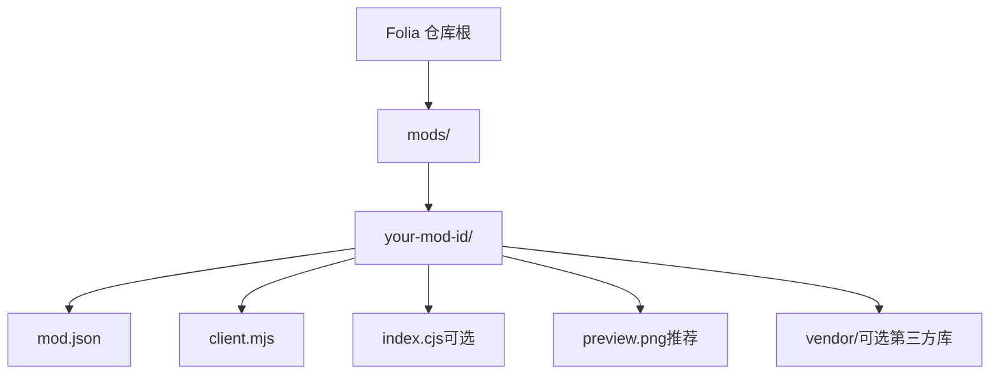
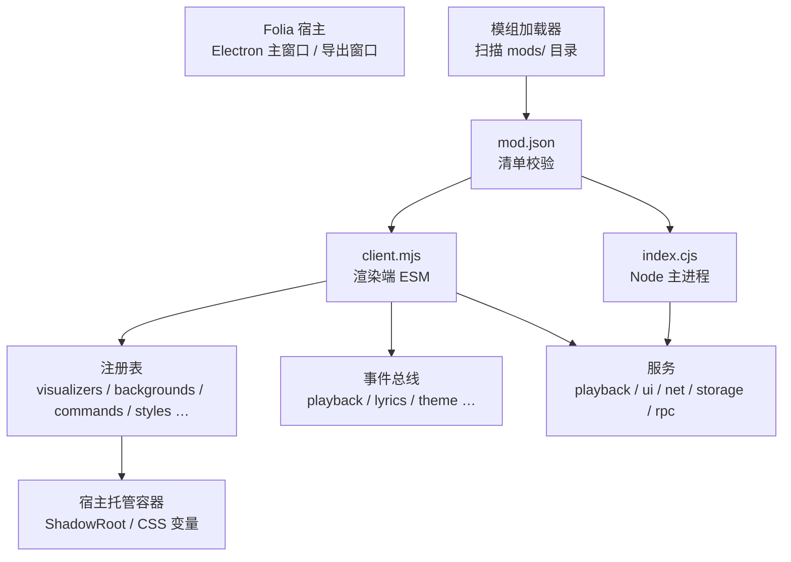
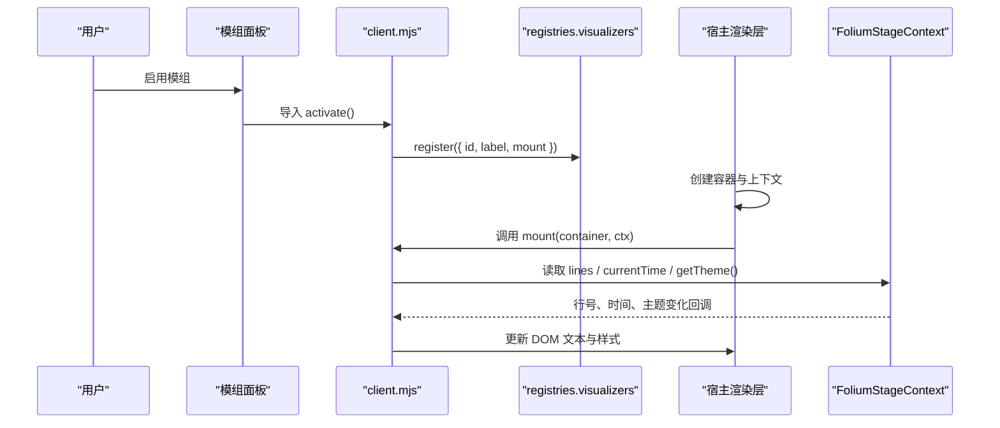
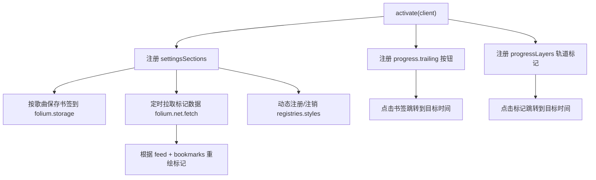
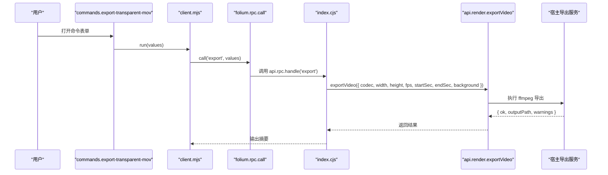
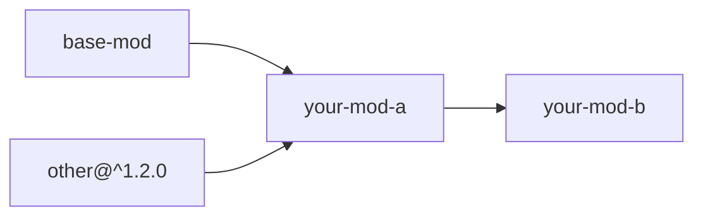

# 模组开发指南

<cite>
**本文引用的文件**   
- [README.md](file://README.md)
- [docs/folium/api.md](file://docs/folium/api.md)
- [docs/folium/contributing.md](file://docs/folium/contributing.md)
- [mods/README.md](file://mods/README.md)
- [mods/sample-aurora-visualizer/mod.json](file://mods/sample-aurora-visualizer/mod.json)
- [mods/sample-aurora-visualizer/client.mjs](file://mods/sample-aurora-visualizer/client.mjs)
- [mods/sample-progress-bar/mod.json](file://mods/sample-progress-bar/mod.json)
- [mods/sample-progress-bar/client.mjs](file://mods/sample-progress-bar/client.mjs)
- [mods/sample-transparent-mov-export/mod.json](file://mods/sample-transparent-mov-export/mod.json)
- [mods/sample-transparent-mov-export/client.mjs](file://mods/sample-transparent-mov-export/client.mjs)
- [mods/sample-transparent-mov-export/index.cjs](file://mods/sample-transparent-mov-export/index.cjs)
</cite>

## 目录
1. [引言](#引言)
2. [项目结构](#项目结构)
3. [核心组件](#核心组件)
4. [架构总览](#架构总览)
5. [详细组件分析](#详细组件分析)
6. [依赖关系分析](#依赖关系分析)
7. [性能与稳定性](#性能与稳定性)
8. [从零开始：第一个模组](#从零开始第一个模组)
9. [进阶：功能完整的扩展模组](#进阶功能完整的扩展模组)
10. [调试与排错](#调试与排错)
11. [发布与部署](#发布与部署)
12. [结论](#结论)

## 引言
本指南面向希望为 Folia Major 的 Folium 模组系统编写模组的开发者。Folium 是桌面端实验性模组平台，允许通过注册表、事件和服务扩展歌词动画、背景、播放页图层、进度条、命令、设置分区等能力；需要 Node 能力的模组可通过 main 入口调用宿主导出、文件等能力。

Folia 主仓库提供了模组规范、API 参考、示例模组和贡献流程。本文以这些官方材料为基础，整理出从环境搭建、项目初始化、代码编写、测试调试到发布部署的完整路径，并给出“Hello World”到功能完整扩展模组的逐步实现思路。

**章节来源**
- [README.md:161-173](file://README.md#L161-L173)

## 项目结构
Folium 模组不是独立 npm 包，而是放在 Folia 的 `mods/` 目录下（或用户模组目录）的一个小目录。每个模组由清单和可选的 client/main 入口组成，必要时附带预览图、第三方库和许可证。

**图示来源**
- [mods/README.md:88-103](file://mods/README.md#L88-L103)

模组扫描顺序在开发版中优先仓库 `mods/`，再扫描用户目录与安装目录；同 id 只认先扫描到的那一份。因此本地开发时，若用户目录存在同名模组，可能覆盖仓库中的开发版本。

**章节来源**
- [mods/README.md:105-107](file://mods/README.md#L105-L107)

## 核心组件
Folium 模组的核心由三部分构成：

| 组件 | 作用 | 典型位置 |
| --- | --- | --- |
| 清单 `mod.json` | 声明模组身份、入口、权限、预览图和依赖 | 模组根目录 |
| 客户端入口 `client.mjs` | 渲染端 ESM，注册 UI 条目、订阅事件、调用服务 | 模组根目录 |
| 主进程入口 `index.cjs` | Node 侧能力，如 ffmpeg 导出、文件系统、IPC | 模组根目录（可选） |

### 清单字段要点
- `folium`：固定为 `1`。
- `id`：全局唯一的小写字母数字加连字符标识。
- `version`：遵循 `MAJOR.MINOR.PATCH`。
- `main` / `client`：至少一个；纯 UI 模组可不写 `main`。
- `permissions`：按需声明，未声明的 API 调用会拒绝。
- `experimental`：选用实验接口，例如 `omni.providers`、`omni.hooks`、`ponder.targets`。
- `folia`：使用内部接口时必须钉死宿主版本范围。

**章节来源**
- [mods/README.md:109-154](file://mods/README.md#L109-L154)

### 客户端入口
`client.mjs` 默认导出 `activate(folium)`。它通过 `folium.registries.*` 注册歌词动画、背景、命令、样式等，通过 `folium.events.on` 订阅事件，通过 `folium.playback` / `folium.ui` / `folium.net` / `folium.storage` / `folium.rpc` 调用服务。

**章节来源**
- [mods/README.md:155-188](file://mods/README.md#L155-L188)
- [docs/folium/api.md:25-109](file://docs/folium/api.md#L25-L109)

### 主进程入口
`index.cjs` 默认导出 `activate(api)`，可注册 RPC 处理器、监听生命周期、访问存储、调用导出服务等。client 通过 `folium.rpc.call(name, ...args)` 调用 main 注册的处理器。

**章节来源**
- [mods/README.md:472-490](file://mods/README.md#L472-L490)

## 架构总览
Folium 的运行模型可以理解为“宿主提供容器与能力，模组通过注册表和事件扩展界面与行为”。

**图示来源**
- [mods/README.md:1-13](file://mods/README.md#L1-L13)
- [mods/README.md:155-188](file://mods/README.md#L155-L188)
- [mods/README.md:190-209](file://mods/README.md#L190-L209)

## 详细组件分析

### 歌词动画模组：sample-aurora-visualizer
该示例是一个纯 client 模组，注册一个新的歌词动画模式，居中显示当前行，并按字进行虹光扫光效果。

**图示来源**
- [mods/sample-aurora-visualizer/client.mjs:61-127](file://mods/sample-aurora-visualizer/client.mjs#L61-L127)
- [mods/sample-aurora-visualizer/mod.json:1-11](file://mods/sample-aurora-visualizer/mod.json#L1-L11)

关键点：
- 通过 `registries.visualizers.register` 注册歌词动画。
- `mount` 内构建一次 DOM，按 `ctx.getLineIndex()` 切换行，按 `ctx.currentTime` 驱动逐字动画。
- 字体与字号通过 `folium.theme.resolveFontStack` 和 `ctx.getDisplay().lyricsFontScale` 与内置模式保持一致。

**章节来源**
- [mods/sample-aurora-visualizer/client.mjs:1-15](file://mods/sample-aurora-visualizer/client.mjs#L1-L15)
- [mods/sample-aurora-visualizer/client.mjs:61-127](file://mods/sample-aurora-visualizer/client.mjs#L61-L127)

### 进度条增强模组：sample-progress-bar
该示例演示了多个 Folium 能力组合：进度条按钮、样式、轨道图层、设置分区、网络请求和本地存储。

**图示来源**
- [mods/sample-progress-bar/client.mjs:72-103](file://mods/sample-progress-bar/client.mjs#L72-L103)
- [mods/sample-progress-bar/client.mjs:105-157](file://mods/sample-progress-bar/client.mjs#L105-L157)
- [mods/sample-progress-bar/client.mjs:171-253](file://mods/sample-progress-bar/client.mjs#L171-L253)

关键点：
- 使用 `settingsSections` 管理 URL、刷新间隔和样式开关。
- 使用 `controlButtons` 添加右侧书签按钮。
- 使用 `progressLayers` 在轨道上绘制外部数据与书签标记。
- 使用 `styles` 修改公开 part 的进度条外观。
- 使用 `net.fetch` 拉取 JSON 标记，使用 `storage` 持久化每首歌的书签。

**章节来源**
- [mods/sample-progress-bar/mod.json:1-12](file://mods/sample-progress-bar/mod.json#L1-L12)
- [mods/sample-progress-bar/client.mjs:1-18](file://mods/sample-progress-bar/client.mjs#L1-L18)
- [mods/sample-progress-bar/client.mjs:72-275](file://mods/sample-progress-bar/client.mjs#L72-L275)

### 透明视频导出模组：sample-transparent-mov-export
该示例展示 client 与 main 协作：client 注册命令并提供表单参数，main 通过 `api.render.exportVideo` 调用宿主导出服务。

**图示来源**
- [mods/sample-transparent-mov-export/client.mjs:6-52](file://mods/sample-transparent-mov-export/client.mjs#L6-L52)
- [mods/sample-transparent-mov-export/index.cjs:11-35](file://mods/sample-transparent-mov-export/index.cjs#L11-L35)

关键点：
- client 通过 `registries.commands.register` 定义带参数的命令。
- main 通过 `api.rpc.handle` 接收参数并调用 `api.render.exportVideo`。
- 需要 `render.export` 权限，且依赖宿主提供的 ffmpeg。

**章节来源**
- [mods/sample-transparent-mov-export/mod.json:1-13](file://mods/sample-transparent-mov-export/mod.json#L1-L13)
- [mods/sample-transparent-mov-export/client.mjs:1-54](file://mods/sample-transparent-mov-export/client.mjs#L1-L54)
- [mods/sample-transparent-mov-export/index.cjs:1-37](file://mods/sample-transparent-mov-export/index.cjs#L1-L37)

## 依赖关系分析
Folium 模组之间的依赖通过 `mod.json` 的 `depends` 声明，支持 `id` 或 `id@^version`。缺失、版本不符、成环或依赖未启用时，只有相关子图不加载。

实际项目中，示例模组大多相互独立；复杂模组如 `visualizer52hz` 还包含第三方库、音频分析、设置面板和思索教程目标，但同样遵循同一套注册表与生命周期。

**章节来源**
- [mods/README.md:139-143](file://mods/README.md#L139-L143)
- [mods/README.md:22-31](file://mods/README.md#L22-L31)

## 性能与稳定性
Folium 对模组性能和宿主稳定性有明确约束：

- 界面类条目通过 `mount(container, ctx) => dispose?` 生命周期管理，必须在 dispose 中释放定时器、动画帧、WebGL 上下文和事件订阅。
- 歌词动画只在歌词、歌曲、静态预览行变化时重新挂载；换行不重挂载，应通过 `ctx.getLineIndex()` 和 `ctx.currentTime` 更新。
- 暂停时时钟不走，需通过 `ctx.subscribe` 感知主题、设置、显示设置等变化。
- `ctx.audio.getBands()` 每次返回同一个对象，原地刷新，保留读数需复制。
- 同步处理器超过 16ms 会记录警告；异步钩子单个处理器超过 1.5s 会被跳过。
- 单模组加载失败不影响宿主与其他模组；每次加载周期先停用当前模组再重新激活，避免叠加多代监听器。

**章节来源**
- [mods/README.md:150-168](file://mods/README.md#L150-L168)
- [mods/README.md:156-167](file://mods/README.md#L156-L167)
- [mods/README.md:409-433](file://mods/README.md#L409-L433)
- [mods/README.md:576-580](file://mods/README.md#L576-L580)

## 从零开始：第一个模组
本节给出从零创建第一个“Hello World”歌词动画模组的步骤。你可以直接对照仓库中的 `mods/hello-lyrics` 示例说明，以及 `mods/sample-aurora-visualizer` 的实际实现。

### 步骤一：准备开发环境
推荐使用源码运行桌面版，这样仓库 `mods/` 下的模组可以直接加载。

1. 安装依赖：`npm install`
2. 启动 Electron 开发版：`npm run dev:electron`
3. 在 Folia 设置中开启「实验室 → 模组系统」
4. 通过命令面板执行「模组」打开模组面板

**章节来源**
- [docs/folium/contributing.md:25-43](file://docs/folium/contributing.md#L25-L43)

### 步骤二：创建模组目录
在仓库根目录新建 `mods/hello-lyrics/`，并创建以下文件：

- `mod.json`：模组清单
- `client.mjs`：渲染端入口
- `preview.png`：预览图（本地开发可随便放一张，发布时需要真实截图）

清单最小结构应包含 `folium`、`id`、`name`、`version`、`author`、`description`、`client` 和 `preview`。

**章节来源**
- [docs/folium/contributing.md:61-77](file://docs/folium/contributing.md#L61-L77)

### 步骤三：编写 client 入口
`client.mjs` 默认导出 `activate(folium)`，在其中注册一个 `visualizers` 条目：

- `id`：本地标识，最终模式 id 为 `mod:<modid>:<id>`
- `label`：语言化的名称
- `mount`：接收宿主容器和上下文，负责绘制歌词内容
- 可选 `settings`：用 `FoliumParam` 声明设置项

渲染逻辑应：
- 使用 `ctx.lines` 获取歌词行
- 使用 `ctx.getLineIndex()` 获取当前行
- 使用 `ctx.currentTime` 驱动时间相关动画
- 使用 `ctx.getTheme()` 和 `folium.theme.resolveFontStack` 应用主题与字体
- 使用 `ctx.getDisplay().lyricsFontScale` 应用用户歌词字号

**章节来源**
- [docs/folium/contributing.md:80-124](file://docs/folium/contributing.md#L80-L124)
- [mods/sample-aurora-visualizer/client.mjs:61-127](file://mods/sample-aurora-visualizer/client.mjs#L61-L127)

### 步骤四：启用并测试
1. 在模组面板点「重载」
2. 启用「你好歌词」并确认
3. 在歌词样式设置的「歌词动画」中选择「你好歌词」
4. 观察居中歌词是否跟随主题与字号变化

**章节来源**
- [docs/folium/contributing.md:120-124](file://docs/folium/contributing.md#L120-L124)

## 进阶：功能完整的扩展模组
当你已经能写出基础歌词动画后，可以逐步加入更丰富的能力。下面以三个方向为例：进度条扩展、外部数据与存储、Node 导出。

### 方向一：改造进度条
如果你想给进度条加按钮、样式或轨道标记，可以参考 `mods/sample-progress-bar`：

- 使用 `registries.controlButtons` 添加左侧或右侧按钮
- 使用 `registries.progressLayers` 在轨道上绘制标记
- 使用 `registries.styles` 修改公开 part 的样式
- 使用 `registries.settingsSections` 暴露用户设置
- 使用 `folium.playback.getState()` 获取当前歌曲信息
- 使用 `folium.storage` 保存每首歌的书签
- 使用 `folium.net.fetch` 拉取外部标记数据

**章节来源**
- [mods/sample-progress-bar/client.mjs:1-18](file://mods/sample-progress-bar/client.mjs#L1-L18)
- [mods/sample-progress-bar/client.mjs:72-275](file://mods/sample-progress-bar/client.mjs#L72-L275)

### 方向二：使用外部数据与本地存储
进度条示例展示了如何把外部 JSON 数据与本地书签合并显示。你可以复用这个模式：

1. 在设置中提供数据源 URL
2. 定时调用 `folium.net.fetch` 拉取数据
3. 将数据规范化为 `{ time, label, color }[]`
4. 与本地书签合并后重绘进度条标记
5. 点击标记调用 `ctx.seek(seconds)` 跳转

注意：
- 网络请求要处理超时、错误和竞态
- 数据格式要容错，避免非法字段导致渲染异常
- 所有交互元素要正确处理 `pointer-events`，避免阻塞宿主 seek

**章节来源**
- [mods/sample-progress-bar/client.mjs:124-157](file://mods/sample-progress-bar/client.mjs#L124-L157)
- [mods/sample-progress-bar/client.mjs:206-253](file://mods/sample-progress-bar/client.mjs#L206-L253)

### 方向三：需要 Node 能力的模组
如果你需要调用 ffmpeg、读写文件、控制隐藏窗口或执行其他 Node 能力，应同时提供 `index.cjs`：

1. 在 `mod.json` 中声明 `main`
2. 在 `index.cjs` 中导出 `activate(api)`
3. 使用 `api.rpc.handle(name, fn)` 注册处理器
4. 在 `client.mjs` 中通过 `folium.rpc.call(name, ...args)` 调用
5. 在 `mod.json` 中声明所需权限，例如 `render.export`

透明 MOV 导出示例展示了这一完整链路。

**章节来源**
- [mods/sample-transparent-mov-export/mod.json:1-13](file://mods/sample-transparent-mov-export/mod.json#L1-L13)
- [mods/sample-transparent-mov-export/client.mjs:1-54](file://mods/sample-transparent-mov-export/client.mjs#L1-L54)
- [mods/sample-transparent-mov-export/index.cjs:1-37](file://mods/sample-transparent-mov-export/index.cjs#L1-L37)

## 调试与排错
Folium 模组开发中最常见的问题是“改了代码没有生效”和“改完代码要重新确认”。

### 常见问题与解决
| 问题 | 原因 | 解决方法 |
| --- | --- | --- |
| 改了代码没有生效 | 用户模组目录存在同 id 旧副本 | 删除旧副本，确认扫描顺序 |
| 改完代码要重新确认 | 模组启用确认绑定到内容指纹 | 在模组面板点「重载」并重新启用 |
| 签名不匹配 | 已签名的模组被修改 | 本地调试可接受；发布前不要改动签名模组 |
| 网页版不能用模组 | 模组系统仅桌面版可用 | 切换到桌面版调试 |
| 模组出错影响整个应用 | 通常不是，但极端情况下可能误改宿主 DOM | 只在宿主容器内操作，使用错误边界日志 |

### 开发版调试循环
在 `npm run dev:electron` 下，仓库 `mods/` 中的模组首次启用仍需确认，之后修改文件只需点「重载」，不需要重新确认。这是开发豁免，仅限源码目录。

在安装版或用户模组目录中，任何文件变化都会让确认失效，需要重新启用并确认。

**章节来源**
- [docs/folium/contributing.md:44-60](file://docs/folium/contributing.md#L44-L60)
- [docs/folium/contributing.md:249-265](file://docs/folium/contributing.md#L249-L265)
- [mods/README.md:32-48](file://mods/README.md#L32-L48)

### 安全与权限提示
模组是可信代码，不是沙箱。`client` 运行在主界面渲染进程，`main` 运行在主进程拥有完整 Node 权限。`mod.json` 的权限是功能开关，不是安全边界。

启用模组时会弹出原生确认窗口，列出模组 id、安装位置、权限、实验接口、可嵌入 origin、是否使用内部接口和内容指纹。

**章节来源**
- [mods/README.md:32-48](file://mods/README.md#L32-L48)

## 发布与部署
Folium 模组可以通过两种方式分发：

1. **本地安装**：把模组 zip 拖到模组面板，或手动解压到用户模组目录。
2. **模组市场**：提交到 folium-compound，审查通过后获得官方认证签名。

### 本地安装
- 打开模组面板右上角「打开模组目录」
- 把 `.zip` 拖入面板
- 宿主会进行原子安装：先解压到 staging 目录校验，再通过后才替换
- 同 id 覆盖即升级；内容指纹改变后模组保持禁用，直到重新确认

**章节来源**
- [mods/README.md:567-575](file://mods/README.md#L567-L575)

### 发布到模组市场
发布流程包括准备、提交、审查与签名、更新四个阶段：

1. 准备公开 https 仓库、通过校验的 `mod.json`、预览图、版本号 tag
2. 在 folium-compound 开「模组提交」issue
3. CI 解析 commit、检查格式、生成文件清单
4. 维护者审查代码、权限、安全性
5. 审查通过后 `/sign <commit>`，CI 签名并发布
6. 更新时提升 `mod.json` 版本、打新 tag、开「模组更新」issue

**章节来源**
- [docs/folium/contributing.md:195-237](file://docs/folium/contributing.md#L195-L237)

### 签名状态
| 状态 | 含义 |
| --- | --- |
| 官方认证 | 签名有效，文件自签名后没有改动 |
| 未验证 | 没有签名文件，未经 Folium 审查 |
| 签名不匹配 | 有签名但校验失败，最常见是签名后文件被改动 |

**章节来源**
- [docs/folium/contributing.md:239-247](file://docs/folium/contributing.md#L239-L247)

## 结论
Folium 模组系统为 Folia 提供了稳定而灵活的扩展机制。对于初学者，建议从 `mods/sample-aurora-visualizer` 入手，理解 `activate`、`registries.visualizers`、`FoliumStageContext` 和生命周期；对于进阶开发者，可以结合 `mods/sample-progress-bar` 学习设置、样式、网络、存储和进度条扩展，再参考 `mods/sample-transparent-mov-export` 掌握 client-main 协作与导出能力。

开发时应始终遵循：
- 只在宿主容器内操作 DOM
- 正确实现 dispose 清理资源
- 使用 `folium.host.folium.minor` 做功能探测
- 谨慎声明权限，避免多余能力
- 在模组面板中调试日志和错误
- 发布前完成清单校验、预览图、许可证和签名流程

通过这些实践，你可以从零开始写出第一个 Hello World 模组，并逐步构建出功能完整、可发布到模组市场的扩展。