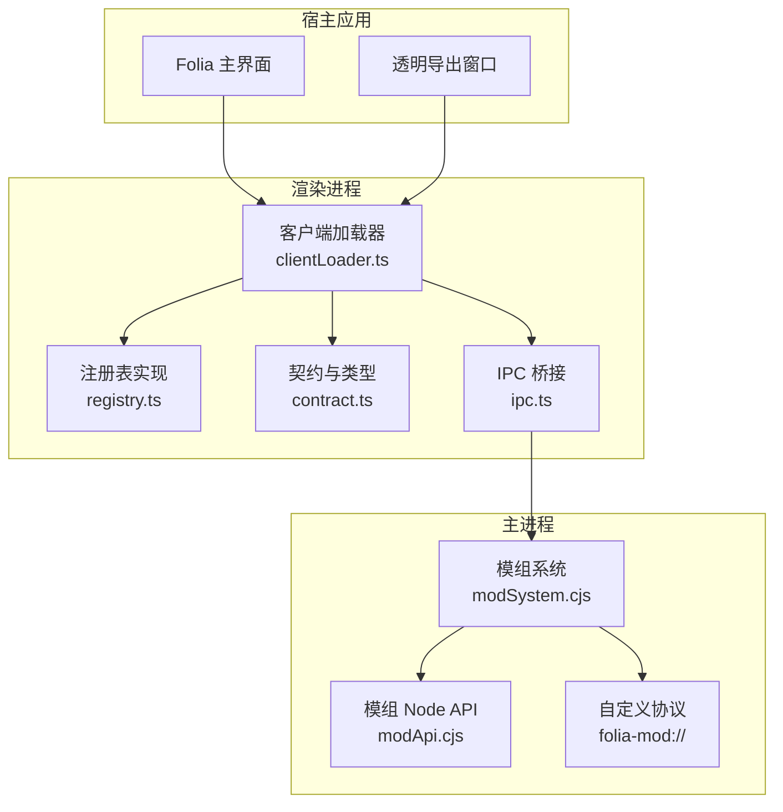
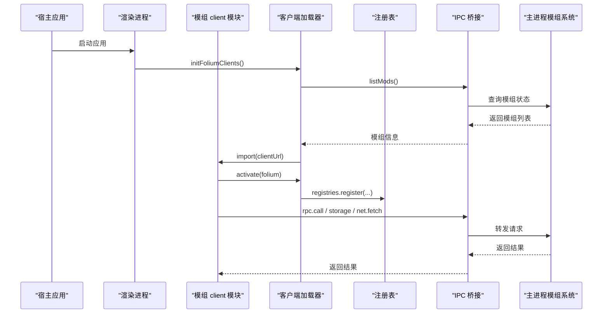
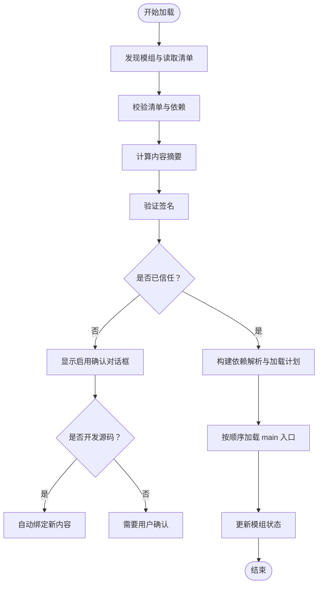
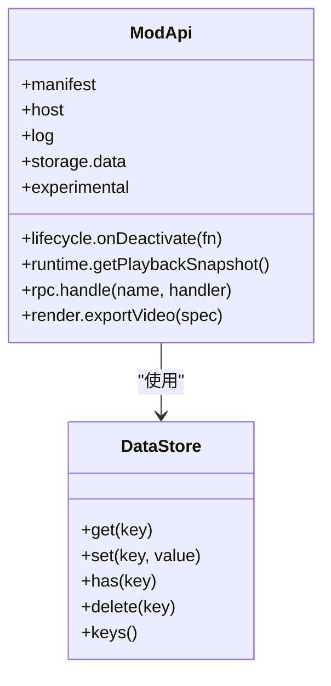
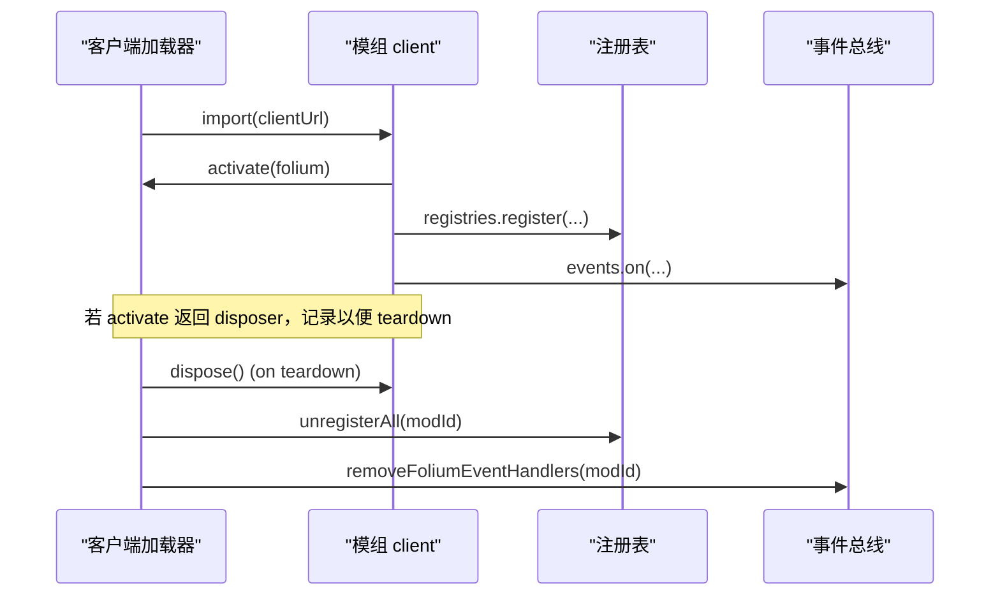
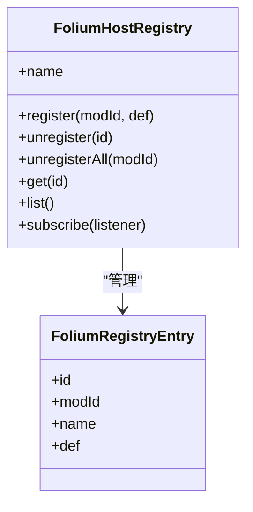

# 模组架构设计

<cite>
**本文引用的文件**   
- [electron/main.cjs](file://electron/main.cjs)
- [electron/modSystem/modSystem.cjs](file://electron/modSystem/modSystem.cjs)
- [electron/modSystem/modApi.cjs](file://electron/modSystem/modApi.cjs)
- [src/mods/folium/contract.ts](file://src/mods/folium/contract.ts)
- [src/mods/folium/clientLoader.ts](file://src/mods/folium/clientLoader.ts)
- [src/mods/folium/registry.ts](file://src/mods/folium/registry.ts)
- [src/mods/ipc.ts](file://src/mods/ipc.ts)
- [src/mods/types.ts](file://src/mods/types.ts)
- [docs/folium/api.md](file://docs/folium/api.md)
- [docs/folium/contributing.md](file://docs/folium/contributing.md)
</cite>

## 目录
1. [引言](#引言)
2. [项目结构](#项目结构)
3. [核心组件](#核心组件)
4. [架构总览](#架构总览)
5. [详细组件分析](#详细组件分析)
6. [依赖与版本兼容性](#依赖与版本兼容性)
7. [性能与资源限制](#性能与资源限制)
8. [故障排查指南](#故障排查指南)
9. [结论](#结论)

## 引言
本文件面向 Folia Major 的 Folium 模组系统，系统性说明其整体架构、主进程与渲染进程分离、模组加载与生命周期、沙箱模型、注册系统与数据流、运行上下文（main 与 export）、以及依赖管理与版本兼容机制。文档同时提供架构图与数据流图，帮助读者理解模组系统与宿主应用的交互关系。

## 项目结构
Folium 模组系统由 Electron 主进程的模组加载器、渲染进程的客户端加载器与注册表、以及跨进程 IPC 通道组成：
- 主进程侧负责模组发现、清单校验、签名验证、依赖解析、权限控制、Node 端 API 注入、导出服务与协议路由。
- 渲染进程侧负责激活模组的 client 入口、维护 UI 注册表、事件总线、UI 服务桥接，以及与主进程通过 IPC 通信。
- 契约层定义模组可见的稳定类型与行为，确保宿主与模组之间的稳定边界。

**图表来源**
- [electron/main.cjs:64-90](file://electron/main.cjs#L64-L90)
- [electron/modSystem/modSystem.cjs:1-18](file://electron/modSystem/modSystem.cjs#L1-L18)
- [electron/modSystem/modApi.cjs:1-25](file://electron/modSystem/modApi.cjs#L1-L25)
- [src/mods/folium/clientLoader.ts:7-20](file://src/mods/folium/clientLoader.ts#L7-L20)
- [src/mods/folium/registry.ts:4-9](file://src/mods/folium/registry.ts#L4-L9)
- [src/mods/folium/contract.ts:1-10](file://src/mods/folium/contract.ts#L1-L10)
- [src/mods/ipc.ts:11-15](file://src/mods/ipc.ts#L11-L15)

**章节来源**
- [electron/main.cjs:64-90](file://electron/main.cjs#L64-L90)
- [electron/modSystem/modSystem.cjs:1-18](file://electron/modSystem/modSystem.cjs#L1-L18)
- [src/mods/folium/clientLoader.ts:7-20](file://src/mods/folium/clientLoader.ts#L7-L20)
- [src/mods/folium/registry.ts:4-9](file://src/mods/folium/registry.ts#L4-L9)
- [src/mods/folium/contract.ts:1-10](file://src/mods/folium/contract.ts#L1-L10)
- [src/mods/ipc.ts:11-15](file://src/mods/ipc.ts#L11-L15)

## 核心组件
- 模组系统（主进程）：负责模组发现、清单校验、内容摘要、签名验证、信任确认、依赖解析、运行时快照、导出服务、协议处理与 IPC 路由。
- 模组 Node API：向模组的 main 入口暴露受限能力，包括日志、存储、播放快照、RPC、导出等，并通过权限门控保护敏感操作。
- 客户端加载器（渲染进程）：按内容指纹动态导入 client 模块，创建 FoliumClientApi，管理生命周期与清理，协调实验接口与内部接口。
- 注册表系统：统一的注册表实现，支持命名空间、重复 ID 拒绝、按模组卸载、变更通知；具体注册表（可视化模式、命令、设置分区等）在此基础上扩展。
- 契约与类型：定义 Folium 公开类型、DTO、参数 schema、挂载上下文、事件与服务接口，作为宿主与模组的稳定边界。
- IPC 桥接：渲染进程到主进程的 typed 访问封装，提供模组列表、启用/禁用、重载、RPC、存储、网络请求、文件选择、导出进度等能力。

**章节来源**
- [electron/modSystem/modSystem.cjs:1-18](file://electron/modSystem/modSystem.cjs#L1-L18)
- [electron/modSystem/modApi.cjs:1-25](file://electron/modSystem/modApi.cjs#L1-L25)
- [src/mods/folium/clientLoader.ts:7-20](file://src/mods/folium/clientLoader.ts#L7-L20)
- [src/mods/folium/registry.ts:4-9](file://src/mods/folium/registry.ts#L4-L9)
- [src/mods/folium/contract.ts:1-10](file://src/mods/folium/contract.ts#L1-L10)
- [src/mods/ipc.ts:11-15](file://src/mods/ipc.ts#L11-L15)

## 架构总览
Folium 采用“主进程安全边界 + 渲染进程扩展点”的双进程模型：
- 主进程承担可信执行环境：模组清单校验、签名验证、依赖解析、权限检查、Node API 注入、导出服务与协议路由。
- 渲染进程承载 UI 扩展点：client 模块在浏览器环境中运行，通过 FoliumClientApi 访问宿主能力，注册 UI 条目与事件处理器。
- 两者通过 IPC 和自定义协议进行通信：client 调用 RPC、storage、net.fetch、pickFile 等能力时，由主进程代理执行并返回结果。

**图表来源**
- [src/mods/folium/clientLoader.ts:130-138](file://src/mods/folium/clientLoader.ts#L130-L138)
- [src/mods/ipc.ts:26-41](file://src/mods/ipc.ts#L26-L41)
- [electron/modSystem/modSystem.cjs:264-280](file://electron/modSystem/modSystem.cjs#L264-L280)

**章节来源**
- [src/mods/folium/clientLoader.ts:130-138](file://src/mods/folium/clientLoader.ts#L130-L138)
- [src/mods/ipc.ts:26-41](file://src/mods/ipc.ts#L26-L41)
- [electron/modSystem/modSystem.cjs:264-280](file://electron/modSystem/modSystem.cjs#L264-L280)

## 详细组件分析

### 主进程模组系统
- 模组发现与清单校验：扫描多个模组目录，读取 mod.json，校验字段与依赖，构建已准备模组映射。
- 内容摘要与签名验证：计算模组目录摘要，验证官方签名或标记未签名/无效签名。
- 信任确认与开发豁免：用户通过原生对话框确认启用；开发模式下源码目录中的模组修改后自动重新绑定确认。
- 依赖解析与加载计划：仅对已启用的模组构建拓扑排序加载计划，失败依赖导致依赖方失败。
- 运行时快照与导出：渲染进程推送运行时快照，主进程外推播放位置；导出服务基于宿主私有状态回放。
- 协议与 IPC：注册 folia-mod:// 协议，处理 client 模块请求；IPC 通道提供模组列表、启用/禁用、RPC、存储、网络、文件选择、导出进度等。

**图表来源**
- [electron/modSystem/modSystem.cjs:545-590](file://electron/modSystem/modSystem.cjs#L545-L590)
- [electron/modSystem/modSystem.cjs:628-765](file://electron/modSystem/modSystem.cjs#L628-L765)
- [electron/modSystem/modSystem.cjs:773-800](file://electron/modSystem/modSystem.cjs#L773-L800)

**章节来源**
- [electron/modSystem/modSystem.cjs:545-590](file://electron/modSystem/modSystem.cjs#L545-L590)
- [electron/modSystem/modSystem.cjs:628-765](file://electron/modSystem/modSystem.cjs#L628-L765)
- [electron/modSystem/modSystem.cjs:773-800](file://electron/modSystem/modSystem.cjs#L773-L800)

### 模组 Node API
- 受限能力注入：为模组的 main 入口提供 manifest、host、log、storage.data、lifecycle.onDeactivate、runtime.getPlaybackSnapshot、rpc.handle、render.exportVideo、experimental。
- 权限门控：所有敏感方法通过声明权限检查，未声明则抛出 `permission-denied:<权限>`。
- 数据存储：每模组一个 JSON 文件，队列写入避免并发冲突，最大 1MB 配额。
- RPC 通道：允许 client 通过名称调用 main 中注册的函数，参数与返回值需可序列化。

**图表来源**
- [electron/modSystem/modApi.cjs:129-213](file://electron/modSystem/modApi.cjs#L129-L213)
- [electron/modSystem/modApi.cjs:41-116](file://electron/modSystem/modApi.cjs#L41-L116)

**章节来源**
- [electron/modSystem/modApi.cjs:129-213](file://electron/modSystem/modApi.cjs#L129-L213)
- [electron/modSystem/modApi.cjs:41-116](file://electron/modSystem/modApi.cjs#L41-L116)

### 客户端加载器与生命周期
- 动态导入：按内容指纹 URL 导入 client 模块，确保编辑后重新加载。
- API 创建：根据运行上下文（main/export）决定是否加载 internals 与 experimental。
- 生命周期管理：activate 返回 disposer；teardown 调用 disposer、注销所有注册项、移除事件处理器。
- 重入与串行化：reconcileFoliumClients 串行执行，避免竞态；按依赖顺序激活。

**图表来源**
- [src/mods/folium/clientLoader.ts:68-91](file://src/mods/folium/clientLoader.ts#L68-L91)
- [src/mods/folium/clientLoader.ts:98-123](file://src/mods/folium/clientLoader.ts#L98-L123)

**章节来源**
- [src/mods/folium/clientLoader.ts:68-91](file://src/mods/folium/clientLoader.ts#L68-L91)
- [src/mods/folium/clientLoader.ts:98-123](file://src/mods/folium/clientLoader.ts#L98-L123)

### 注册表系统
- 统一实现：foliumId 命名空间、重复 ID 拒绝、validate/onAdd/onRemove 钩子、订阅通知、React 视图集成。
- 具体注册表：visualizers、tunings、commands、backgrounds、stageLayers、settingsSections、playerPanelTabs、controlButtons、progressLayers、styles。
- 生命周期：模组停用或重载时，宿主自动撤下所有注册项。

**图表来源**
- [src/mods/folium/registry.ts:45-121](file://src/mods/folium/registry.ts#L45-L121)
- [src/mods/folium/contract.ts:695-726](file://src/mods/folium/contract.ts#L695-L726)

**章节来源**
- [src/mods/folium/registry.ts:45-121](file://src/mods/folium/registry.ts#L45-L121)
- [src/mods/folium/contract.ts:695-726](file://src/mods/folium/contract.ts#L695-L726)

### 契约与类型
- 公开 DTO：FoliumLine、FoliumTheme、FoliumSong、FoliumPlaybackSnapshot 等，保持与宿主内置类型同名同义，便于代码迁移。
- 参数 Schema：FoliumParam 驱动设置表单、校验与持久化，值默认合并且只读，写通过 FoliumParamAccess。
- 挂载上下文：FoliumMount、FoliumStageContext、FoliumBackgroundContext、FoliumProgressContext 等，提供时钟、主题、设置、音频、显示设置等。
- 事件与服务：events.on 支持优先级与错误边界；playback/ui/net/storage/rpc 等服务按权限与环境可用性限制。

**章节来源**
- [src/mods/folium/contract.ts:29-243](file://src/mods/folium/contract.ts#L29-L243)
- [src/mods/folium/contract.ts:245-303](file://src/mods/folium/contract.ts#L245-L303)
- [src/mods/folium/contract.ts:305-466](file://src/mods/folium/contract.ts#L305-L466)
- [docs/folium/api.md:25-109](file://docs/folium/api.md#L25-L109)

### IPC 桥接与数据模型
- 类型安全的 IPC 封装：listMods、setModEnabled、reloadMods、invokeModRpc、invokeModStorage、invokeModNetFetch、invokeModPickFile、restoreFile/releaseFile、pushRuntimeSnapshot、getFfmpegStatus、openModsDirectory、installModFromZip、订阅状态与日志。
- 运行时快照：public 部分供模组读取，internal 部分供导出服务回放；capturedAt 用于播放位置外推。

**章节来源**
- [src/mods/ipc.ts:26-157](file://src/mods/ipc.ts#L26-L157)
- [src/mods/types.ts:136-157](file://src/mods/types.ts#L136-L157)

## 依赖与版本兼容性
- 依赖解析：仅对已启用模组构建拓扑排序加载计划；依赖失败导致依赖方失败，避免运行在不完整依赖上。
- 宿主版本范围：使用 folium.internals 的模组必须声明 folia 版本范围，不满足则标记 host-version-mismatch。
- 功能探测：模组通过 folium.host.folium.minor 判断宿主支持的功能；实验接口需在清单中显式启用。
- 签名与认证：官方签名仅标识来源与完整性，不跳过启用确认；签名不匹配表示内容被修改或签名无效。

**章节来源**
- [electron/modSystem/modSystem.cjs:674-729](file://electron/modSystem/modSystem.cjs#L674-L729)
- [docs/folium/contributing.md:188-193](file://docs/folium/contributing.md#L188-L193)
- [docs/folium/contributing.md:239-247](file://docs/folium/contributing.md#L239-L247)

## 性能与资源限制
- 网络请求限制：默认超时 15 秒，最大 60 秒，响应体最大 5MB，方法白名单 GET/POST/PUT/PATCH/DELETE/HEAD。
- 数据存储限制：每模组 JSON 文件最大 1MB，异步队列写入避免并发冲突。
- 安装限制：压缩包大小、条目数、总字节数、单文件大小上限，防止解压炸弹。
- 渲染性能建议：歌词动画只在必要时机重挂载；使用 ctx.subscribe 与 ctx.currentTime 避免频繁布局；audio.getBands 原地刷新需复制。

**章节来源**
- [electron/modSystem/modSystem.cjs:41-47](file://electron/modSystem/modSystem.cjs#L41-L47)
- [electron/modSystem/modApi.cjs:11-14](file://electron/modSystem/modApi.cjs#L11-L14)
- [electron/modSystem/modApi.cjs:71-80](file://electron/modSystem/modApi.cjs#L71-L80)
- [docs/folium/contributing.md:156-167](file://docs/folium/contributing.md#L156-L167)

## 故障排查指南
- 模组面板错误：activate、事件处理器、每次挂载都在各自错误边界内，错误不影响宿主；错误显示在模组面板对应模组的“界面代码出错”。
- 文件变化后需重新确认：内容指纹变化会撤销信任，需重新启用确认；开发源码目录中的模组除外。
- 依赖失败：依赖模组加载失败会导致依赖方标记 dependency-failed，查看模组面板错误信息。
- 宿主版本不匹配：使用内部接口的模组若 folia 版本范围不满足，将标记 host-version-mismatch。
- 权限不足：调用未声明权限的方法会抛出 permission-denied:<权限>，检查 mod.json 权限声明。

**章节来源**
- [docs/folium/contributing.md:251-258](file://docs/folium/contributing.md#L251-L258)
- [electron/modSystem/modSystem.cjs:702-729](file://electron/modSystem/modSystem.cjs#L702-L729)
- [electron/modSystem/modApi.cjs:132-140](file://electron/modSystem/modApi.cjs#L132-L140)

## 结论
Folium 模组系统通过主进程的安全边界与渲染进程的扩展点，实现了安全可控的第三方扩展能力。其核心在于：
- 明确的主进程与渲染进程职责分离，安全与体验兼顾。
- 严格的清单校验、签名验证与信任确认机制，保障模组来源与完整性。
- 统一的注册表与契约类型，提供稳定的扩展点与清晰的 API 边界。
- 完善的生命周期管理与错误隔离，确保模组故障不影响宿主。
- 细粒度的权限控制与资源限制，防止滥用与性能问题。

开发者应遵循契约与规范，合理使用注册表、事件与服务，注意权限声明与版本兼容，以获得稳定可靠的模组体验。