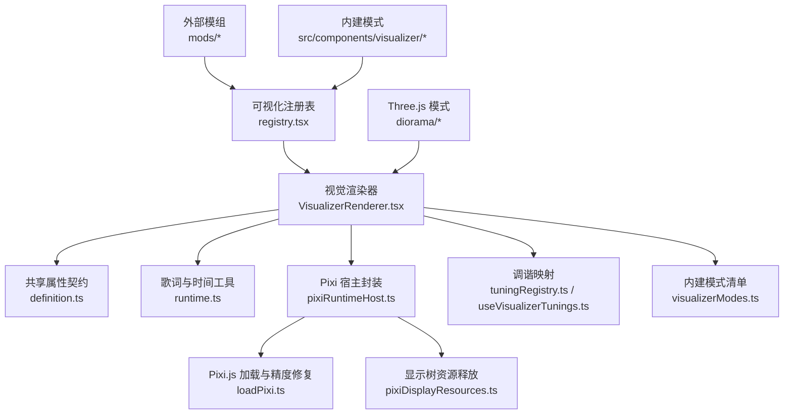
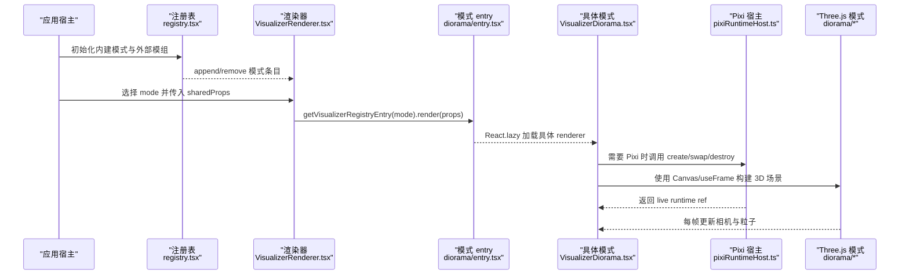
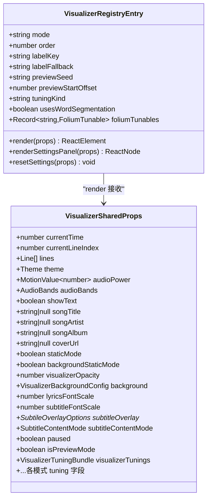
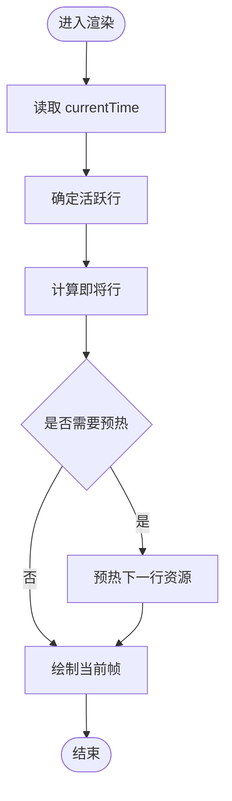
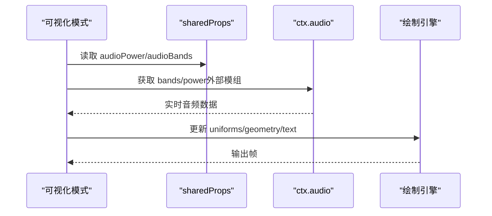
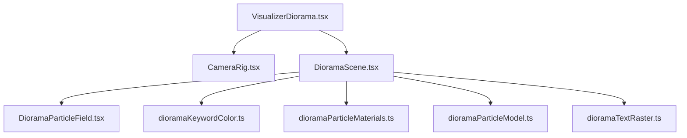
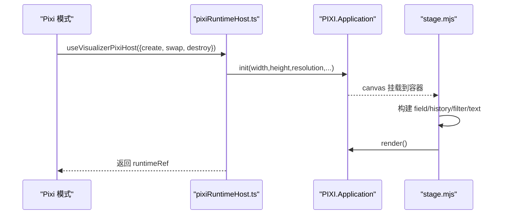
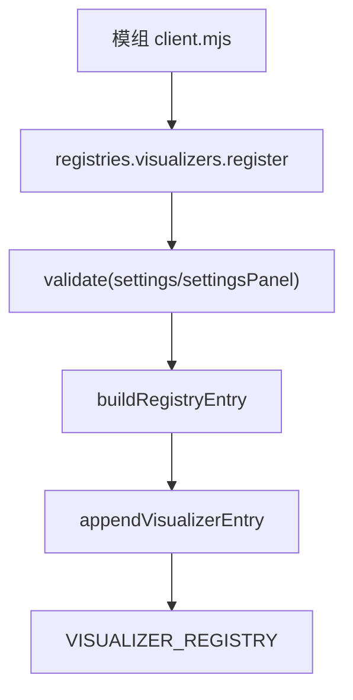
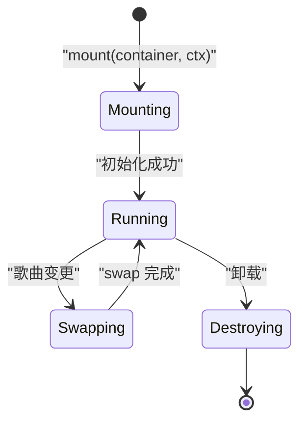
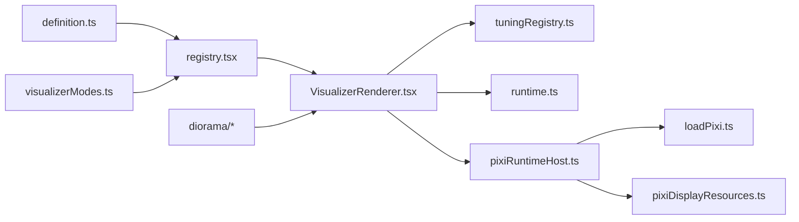

# 可视化效果模组

<cite>
**本文引用的文件 **
- [definition.ts](file://src/components/visualizer/definition.ts)
- [registry.tsx](file://src/components/visualizer/registry.tsx)
- [runtime.ts](file://src/components/visualizer/runtime.ts)
- [VisualizerRenderer.tsx](file://src/components/visualizer/VisualizerRenderer.tsx)
- [pixiRuntimeHost.ts](file://src/components/visualizer/pixiRuntimeHost.ts)
- [loadPixi.ts](file://src/components/visualizer/loadPixi.ts)
- [pixiDisplayResources.ts](file://src/components/visualizer/pixiDisplayResources.ts)
- [tuningRegistry.ts](file://src/components/visualizer/tuningRegistry.ts)
- [useVisualizerTunings.ts](file://src/components/visualizer/useVisualizerTunings.ts)
- [visualizerModes.ts](file://src/types/visualizerModes.ts)
- [client.mjs](file://mods/sample-aurora-visualizer/client.mjs)
- [client.mjs](file://mods/visualizer52hz/client.mjs)
- [stage.mjs](file://mods/visualizer52hz/stage.mjs)
- [entry.tsx](file://src/components/visualizer/diorama/entry.tsx)
- [VisualizerDiorama.tsx](file://src/components/visualizer/diorama/VisualizerDiorama.tsx)
- [CameraRig.tsx](file://src/components/visualizer/diorama/CameraRig.tsx)
- [DioramaParticleField.tsx](file://src/components/visualizer/diorama/DioramaParticleField.tsx)
- [DioramaScene.tsx](file://src/components/visualizer/diorama/DioramaScene.tsx)
- [dioramaKeywordColor.ts](file://src/components/visualizer/diorama/dioramaKeywordColor.ts)
- [dioramaParticleMaterials.ts](file://src/components/visualizer/diorama/dioramaParticleMaterials.ts)
- [dioramaParticleModel.ts](file://src/components/visualizer/diorama/dioramaParticleModel.ts)
- [dioramaTextRaster.ts](file://src/components/visualizer/diorama/dioramaTextRaster.ts)
- [visualizerMemory.probe.tsx](file://dev/probes/visualizerMemory.probe.tsx)
</cite>

## 目录
1. [引言](#引言)
2. [项目结构](#项目结构)
3. [核心组件](#核心组件)
4. [架构总览](#架构总览)
5. [详细组件分析](#详细组件分析)
6. [依赖关系分析](#依赖关系分析)
7. [性能与内存优化](#性能与内存优化)
8. [故障排查指南](#故障排查指南)
9. [结论](#结论)
10. [附录：完整开发示例清单](#附录完整开发示例清单)

## 引言
本指南面向希望为 Folia Major 开发“可视化效果模组”的开发者，目标是说明如何基于 VisualizerDefinition 接口实现一个可注册、可配置、可预览、可导出、生命周期安全的可视化模组。文档覆盖以下主题：
- VisualizerDefinition 接口的职责、属性与扩展点
- 渲染循环、音频数据获取与歌词同步
- Three.js（React Three Fiber）与 Pixi.js 的使用方式
- 模组的注册机制、参数配置与设置面板
- 生命周期管理、内存优化与错误处理最佳实践
- 从基础文本动画到复杂 3D 场景与粒子效果的渐进式示例

## 项目结构
可视化系统由“内建模式 + 外部模组”共同组成：
- 内建模式位于 `src/components/visualizer`，通过 registry 发现并懒加载 renderer
- 外部模组位于 `mods/*`，通过 `folium.registries.visualizers.register` 注入运行时
- 类型与静态清单位于 `src/types/visualizerModes.ts`，用于校验和短码解析
- 通用运行时工具位于 `src/components/visualizer/runtime.ts`
- Pixi.js 宿主封装位于 `pixiRuntimeHost.ts`、`loadPixi.ts`、`pixiDisplayResources.ts`
- Three.js 使用集中在 diorama 子模块中

**图表来源**
- [registry.tsx:86-112](file://src/components/visualizer/registry.tsx#L86-L112)
- [VisualizerRenderer.tsx:13-33](file://src/components/visualizer/VisualizerRenderer.tsx#L13-L33)
- [definition.ts:33-99](file://src/components/visualizer/definition.ts#L33-L99)
- [runtime.ts:124-157](file://src/components/visualizer/runtime.ts#L124-L157)
- [pixiRuntimeHost.ts:37-143](file://src/components/visualizer/pixiRuntimeHost.ts#L37-L143)
- [loadPixi.ts:1-18](file://src/components/visualizer/loadPixi.ts#L1-L18)
- [pixiDisplayResources.ts:12-55](file://src/components/visualizer/pixiDisplayResources.ts#L12-L55)
- [tuningRegistry.ts:21-49](file://src/components/visualizer/tuningRegistry.ts#L21-L49)
- [useVisualizerTunings.ts:10-24](file://src/components/visualizer/useVisualizerTunings.ts#L10-L24)
- [visualizerModes.ts:15-43](file://src/types/visualizerModes.ts#L15-L43)

**章节来源**
- [registry.tsx:86-112](file://src/components/visualizer/registry.tsx#L86-L112)
- [visualizerModes.ts:15-43](file://src/types/visualizerModes.ts#L15-L43)

## 核心组件
本节聚焦可视化系统的核心契约与运行入口：
- VisualizerSharedProps：所有可视化模式共享的属性，包括时间、歌词、主题、音频能量与频带、字幕控制、背景配置、字体缩放、预览与静态模式等
- VisualizerRegistryEntry：注册表条目，包含 mode、order、label、render、settingsPanel、resetSettings、usesWordSegmentation、foliumTunables 等
- VisualizerRenderer：根据 mode 查找 entry 并调用 render，同时叠加和谐字幕层
- runtime.ts：提供当前行、即将行、最近完成行的计算与预热窗口判断
- pixiRuntimeHost.ts：为 Pixi.js 提供“创建一次、原地换歌”的生命周期封装
- loadPixi.ts：统一提升 Pixi 片段着色器精度，避免部分驱动上的浮点溢出黑屏
- pixiDisplayResources.ts：安全释放 Pixi 显示树与 GPU 批数据，避免纹理泄漏
- tuningRegistry.ts 与 useVisualizerTunings.ts：将各模式的调谐数据以纯数据结构形式注入 props

**章节来源**
- [definition.ts:33-99](file://src/components/visualizer/definition.ts#L33-L99)
- [definition.ts:173-218](file://src/components/visualizer/definition.ts#L173-L218)
- [VisualizerRenderer.tsx:13-33](file://src/components/visualizer/VisualizerRenderer.tsx#L13-L33)
- [runtime.ts:35-120](file://src/components/visualizer/runtime.ts#L35-L120)
- [pixiRuntimeHost.ts:37-143](file://src/components/visualizer/pixiRuntimeHost.ts#L37-L143)
- [loadPixi.ts:1-18](file://src/components/visualizer/loadPixi.ts#L1-L18)
- [pixiDisplayResources.ts:12-55](file://src/components/visualizer/pixiDisplayResources.ts#L12-L55)
- [tuningRegistry.ts:21-49](file://src/components/visualizer/tuningRegistry.ts#L21-L49)
- [useVisualizerTunings.ts:10-24](file://src/components/visualizer/useVisualizerTunings.ts#L10-L24)

## 架构总览
可视化系统采用“注册表 + 懒加载 renderer + 共享 props + 宿主封装”的分层架构：
- 注册阶段：内建模式通过 glob 发现；外部模组通过 `registries.visualizers.register` 追加
- 渲染阶段：VisualizerRenderer 根据 mode 取 entry.render，包裹 Suspense 边界
- 数据阶段：props 中包含 currentTime、audioPower、audioBands、lines、theme、background 等
- 宿主阶段：Pixi.js 模式通过 useVisualizerPixiHost 管理 WebGL 上下文与歌曲切换
- 调谐阶段：tuningRegistry 把 per-mode 调谐数据注入 props，供 renderer 消费

**图表来源**
- [registry.tsx:86-112](file://src/components/visualizer/registry.tsx#L86-L112)
- [VisualizerRenderer.tsx:13-33](file://src/components/visualizer/VisualizerRenderer.tsx#L13-L33)
- [entry.tsx:1-23](file://src/components/visualizer/diorama/entry.tsx#L1-L23)
- [VisualizerDiorama.tsx:395-424](file://src/components/visualizer/diorama/VisualizerDiorama.tsx#L395-L424)
- [pixiRuntimeHost.ts:37-143](file://src/components/visualizer/pixiRuntimeHost.ts#L37-L143)

## 详细组件分析

### VisualizerDefinition 接口与注册机制
- VisualizerSharedProps 定义了可视化模式可消费的输入，包括：
  - 时间与歌词：currentTime、currentLineIndex、lines
  - 主题与字幕：theme、subtitleTheme、subtitleContentMode、subtitleFontScale 等
  - 音频：audioPower、audioBands
  - 背景与透明度：background、visualizerOpacity
  - 预览与静态模式：isPreviewMode、staticMode、backgroundStaticMode
  - 调谐数据：visualizerTunings 与各模式专属 tuning
- VisualizerRegistryEntry 定义模式元信息与渲染函数：
  - mode、order、labelKey/labelFallback、previewSeed、previewStartOffset
  - render、renderSettingsPanel、resetSettings
  - usesWordSegmentation、foliumTunables
- 注册流程：
  - 内建模式通过 entry.tsx 暴露 defineVisualizer 默认导出
  - 外部模组通过 folium.registries.visualizers.register 注入
  - registry.tsx 对 settings 进行清洗与访问器生成，并在 onAdd/onRemove 中维护 VISUALIZER_REGISTRY

**图表来源**
- [definition.ts:33-99](file://src/components/visualizer/definition.ts#L33-L99)
- [definition.ts:173-218](file://src/components/visualizer/definition.ts#L173-L218)

**章节来源**
- [definition.ts:33-99](file://src/components/visualizer/definition.ts#L33-L99)
- [definition.ts:173-218](file://src/components/visualizer/definition.ts#L173-L218)
- [registry.tsx:86-112](file://src/components/visualizer/registry.tsx#L86-L112)

### 渲染循环与歌词同步
- VisualizerRenderer 负责：
  - 应用调谐数据 applyVisualizerTuning
  - 合并背景模式
  - 使用 React.Suspense 包裹 lazy 渲染
  - 叠加 VisualizerHarmonyOverlay 字幕层
- runtime.ts 提供：
  - getRecentCompletedLine：无活跃行时回退到最近完成行
  - getUpcomingLine/getUpcomingLines：预测下一行或若干行
  - shouldPreheatLine：按领先时间窗口预热
  - prepareActiveAndUpcoming：准备活跃行与即将行
  - useVisualizerRuntime：组合上述逻辑，返回轻量状态

**图表来源**
- [runtime.ts:35-120](file://src/components/visualizer/runtime.ts#L35-L120)
- [runtime.ts:124-157](file://src/components/visualizer/runtime.ts#L124-L157)

**章节来源**
- [VisualizerRenderer.tsx:13-33](file://src/components/visualizer/VisualizerRenderer.tsx#L13-L33)
- [runtime.ts:35-120](file://src/components/visualizer/runtime.ts#L35-L120)
- [runtime.ts:124-157](file://src/components/visualizer/runtime.ts#L124-L157)

### 音频数据获取与可视化绘制
- 音频输入：
  - audioPower：整体能量
  - audioBands：分频段能量
  - ctx.audio：外部模组可直接使用的音频分析对象（如 52Hz 模组）
- 绘制路径：
  - 内建模式通常通过 props.audioPower/audioBands 驱动样式或几何
  - 外部 Pixi 模式通过 ctx.audio.getBands()/getPower() 驱动波纹、节拍检测等
- 示例：
  - sample-aurora-visualizer：基于 DOM 文本动画，不直接读音频
  - visualizer52hz：基于 Pixi.js 与 ctx.audio 的能量跟随与节拍检测

**图表来源**
- [definition.ts:33-99](file://src/components/visualizer/definition.ts#L33-L99)
- [stage.mjs:62-79](file://mods/visualizer52hz/stage.mjs#L62-L79)
- [stage.mjs:316-345](file://mods/visualizer52hz/stage.mjs#L316-L345)

**章节来源**
- [definition.ts:33-99](file://src/components/visualizer/definition.ts#L33-L99)
- [stage.mjs:62-79](file://mods/visualizer52hz/stage.mjs#L62-L79)
- [stage.mjs:316-345](file://mods/visualizer52hz/stage.mjs#L316-L345)

### Three.js 与 Pixi.js 使用方式

#### Three.js（React Three Fiber）
- 使用位置：diorama 模式
- 关键文件：
  - VisualizerDiorama.tsx：Canvas 与 CameraRig/DioramaScene 装配
  - CameraRig.tsx：useFrame 驱动相机运动
  - DioramaParticleField.tsx：粒子场
  - DioramaScene.tsx：场景组织
  - dioramaKeywordColor.ts / dioramaParticleMaterials.ts / dioramaParticleModel.ts / dioramaTextRaster.ts：材质、模型、文字栅格化
- 特点：
  - 通过 @react-three/fiber 的 Canvas/useFrame/useThree 集成
  - 与歌词时序、音乐节奏联动
  - 支持相机飞行、粒子系统与文本光栅化

**图表来源**
- [VisualizerDiorama.tsx:395-424](file://src/components/visualizer/diorama/VisualizerDiorama.tsx#L395-L424)
- [CameraRig.tsx:50-61](file://src/components/visualizer/diorama/CameraRig.tsx#L50-L61)
- [DioramaParticleField.tsx:1-4](file://src/components/visualizer/diorama/DioramaParticleField.tsx#L1-L4)
- [DioramaScene.tsx:1-4](file://src/components/visualizer/diorama/DioramaScene.tsx#L1-L4)
- [dioramaKeywordColor.ts:1](file://src/components/visualizer/diorama/dioramaKeywordColor.ts#L1)
- [dioramaParticleMaterials.ts:1](file://src/components/visualizer/diorama/dioramaParticleMaterials.ts#L1)
- [dioramaParticleModel.ts:1](file://src/components/visualizer/diorama/dioramaParticleModel.ts#L1)
- [dioramaTextRaster.ts:1](file://src/components/visualizer/diorama/dioramaTextRaster.ts#L1)

**章节来源**
- [VisualizerDiorama.tsx:395-424](file://src/components/visualizer/diorama/VisualizerDiorama.tsx#L395-L424)
- [CameraRig.tsx:50-61](file://src/components/visualizer/diorama/CameraRig.tsx#L50-L61)
- [DioramaParticleField.tsx:1-4](file://src/components/visualizer/diorama/DioramaParticleField.tsx#L1-L4)
- [DioramaScene.tsx:1-4](file://src/components/visualizer/diorama/DioramaScene.tsx#L1-L4)

#### Pixi.js
- 使用位置：tempera、sonnet 等内建模式以及 external mod visualizer52hz
- 关键文件：
  - pixiRuntimeHost.ts：create/swap/destroy 生命周期封装
  - loadPixi.ts：提升片段着色器精度
  - pixiDisplayResources.ts：显示树卸载与销毁
  - stage.mjs（52Hz）：PIXI.Application 初始化、纹理与滤镜、历史缓冲区、节拍检测、歌词文本层
- 特点：
  - 通过宿主封装避免频繁重建 WebGL 上下文
  - 精确控制 GPU 批数据与纹理释放
  - 在外部模组中通过 vendor 打包 pixi.min.mjs

**图表来源**
- [pixiRuntimeHost.ts:37-143](file://src/components/visualizer/pixiRuntimeHost.ts#L37-L143)
- [loadPixi.ts:1-18](file://src/components/visualizer/loadPixi.ts#L1-L18)
- [pixiDisplayResources.ts:12-55](file://src/components/visualizer/pixiDisplayResources.ts#L12-L55)
- [stage.mjs:90-128](file://mods/visualizer52hz/stage.mjs#L90-L128)
- [stage.mjs:351-374](file://mods/visualizer52hz/stage.mjs#L351-L374)

**章节来源**
- [pixiRuntimeHost.ts:37-143](file://src/components/visualizer/pixiRuntimeHost.ts#L37-L143)
- [loadPixi.ts:1-18](file://src/components/visualizer/loadPixi.ts#L1-L18)
- [pixiDisplayResources.ts:12-55](file://src/components/visualizer/pixiDisplayResources.ts#L12-L55)
- [stage.mjs:90-128](file://mods/visualizer52hz/stage.mjs#L90-L128)
- [stage.mjs:351-374](file://mods/visualizer52hz/stage.mjs#L351-L374)

### 模组的注册机制、参数配置与设置面板
- 注册：
  - 外部模组通过 `folium.registries.visualizers.register` 提交 id、label、order、mount、settings
  - 52Hz 模组还注册 Ponder 目标（主窗口环境且版本满足）
- 参数配置：
  - settings 数组声明 key、type、label、description、min/max/step/defaultValue
  - registry 对 settings 进行 sanitizeFoliumParams 并生成 settingsAccess
- 设置面板：
  - 内建模式可通过 renderSettingsPanel/resetSettings 提供 React 面板
  - 外部模组可在 mount 中自行处理 UI，或通过 Ponder 集成教程

**图表来源**
- [client.mjs:68-83](file://mods/visualizer52hz/client.mjs#L68-L83)
- [registry.tsx:83-112](file://src/components/visualizer/registry.tsx#L83-L112)

**章节来源**
- [client.mjs:120-127](file://mods/sample-aurora-visualizer/client.mjs#L120-L127)
- [client.mjs:17-78](file://mods/visualizer52hz/client.mjs#L17-L78)
- [registry.tsx:83-112](file://src/components/visualizer/registry.tsx#L83-L112)

### 生命周期管理与内存优化
- 生命周期：
  - mount 返回清理函数，移除 DOM、取消监听、释放资源
  - pixiRuntimeHost 使用 AbortController 与 drainSong 保证换歌平滑与失败恢复
- 内存优化：
  - pixiDisplayResources 提供 unload/destroy 工具，避免 GraphicsContext 与批数据泄漏
  - loadPixi 提升片段精度，避免 NVIDIA Linux 驱动下的 fp16 溢出黑屏
  - 52Hz 在 resize 时重建 geometry 与 filter，并正确销毁旧资源
- 最佳实践：
  - 不要在 mount 中创建不可回收的全局状态
  - 使用 ctx.subscribe 订阅变化，而非 React state
  - 在清理函数中 cancelAnimationFrame、disconnect ResizeObserver、销毁 PIXI.Application

**图表来源**
- [pixiRuntimeHost.ts:72-96](file://src/components/visualizer/pixiRuntimeHost.ts#L72-L96)
- [pixiRuntimeHost.ts:98-143](file://src/components/visualizer/pixiRuntimeHost.ts#L98-L143)
- [pixiDisplayResources.ts:12-55](file://src/components/visualizer/pixiDisplayResources.ts#L12-L55)
- [stage.mjs:405-425](file://mods/visualizer52hz/stage.mjs#L405-L425)

**章节来源**
- [pixiRuntimeHost.ts:72-96](file://src/components/visualizer/pixiRuntimeHost.ts#L72-L96)
- [pixiRuntimeHost.ts:98-143](file://src/components/visualizer/pixiRuntimeHost.ts#L98-L143)
- [pixiDisplayResources.ts:12-55](file://src/components/visualizer/pixiDisplayResources.ts#L12-L55)
- [stage.mjs:405-425](file://mods/visualizer52hz/stage.mjs#L405-L425)

## 依赖关系分析
- 内建模式与外部模组都依赖 registry.tsx 提供的 append/remove 能力
- VisualizerRenderer 依赖 definition.ts 的契约与 tuningRegistry.ts 的调谐注入
- Pixi 模式依赖 pixiRuntimeHost.ts 的生命周期封装与 loadPixi.ts 的精度修复
- Three.js 模式依赖 @react-three/fiber 与 three.js，集中在 diorama 子模块
- 类型与静态清单依赖 visualizerModes.ts，确保模式 ID 一致性

**图表来源**
- [definition.ts:173-218](file://src/components/visualizer/definition.ts#L173-L218)
- [registry.tsx:86-112](file://src/components/visualizer/registry.tsx#L86-L112)
- [VisualizerRenderer.tsx:13-33](file://src/components/visualizer/VisualizerRenderer.tsx#L13-L33)
- [tuningRegistry.ts:21-49](file://src/components/visualizer/tuningRegistry.ts#L21-L49)
- [runtime.ts:124-157](file://src/components/visualizer/runtime.ts#L124-L157)
- [pixiRuntimeHost.ts:37-143](file://src/components/visualizer/pixiRuntimeHost.ts#L37-L143)
- [loadPixi.ts:1-18](file://src/components/visualizer/loadPixi.ts#L1-L18)
- [pixiDisplayResources.ts:12-55](file://src/components/visualizer/pixiDisplayResources.ts#L12-L55)
- [visualizerModes.ts:15-43](file://src/types/visualizerModes.ts#L15-L43)

**章节来源**
- [registry.tsx:86-112](file://src/components/visualizer/registry.tsx#L86-L112)
- [definition.ts:173-218](file://src/components/visualizer/definition.ts#L173-L218)
- [visualizerModes.ts:15-43](file://src/types/visualizerModes.ts#L15-L43)

## 性能与内存优化
- 渲染循环：
  - 使用 requestAnimationFrame 驱动 Pixi 渲染，避免不必要的重绘
  - 通过 ctx.currentTime.get() 驱动时间，保持预览与导出一致
- 音频处理：
  - 能量跟随器结合慢衰减峰值与快速攻击/慢释放包络，突出节拍
  - 节拍检测仅在必要时写入历史缓冲区，减少开销
- 资源管理：
  - 使用 unloadPixiDisplayTree/destroyPixiDisplayTree 释放 GPU 批数据与上下文
  - 在 destroy 中销毁 PIXI.Application 及其 children 与 textures
- 精度问题：
  - loadPixi 提升 preferredFragmentPrecision 至 highp，避免 fp16 溢出
- 预览与静态模式：
  - 静态模式下预填 history/beat 数据，使预览有合理波形
- 调试探针：
  - visualizerMemory.probe.tsx 模拟时间推进与音频能量，便于定位内存与性能问题

**章节来源**
- [stage.mjs:62-79](file://mods/visualizer52hz/stage.mjs#L62-L79)
- [stage.mjs:316-345](file://mods/visualizer52hz/stage.mjs#L316-L345)
- [stage.mjs:351-374](file://mods/visualizer52hz/stage.mjs#L351-L374)
- [pixiDisplayResources.ts:12-55](file://src/components/visualizer/pixiDisplayResources.ts#L12-L55)
- [loadPixi.ts:1-18](file://src/components/visualizer/loadPixi.ts#L1-L18)
- [visualizerMemory.probe.tsx:250-286](file://dev/probes/visualizerMemory.probe.tsx#L250-L286)

## 故障排查指南
- Pixi 初始化失败：
  - pixiRuntimeHost 捕获异常并标记 failedChange，模式可回退到文本提示
- 换歌卡顿或闪烁：
  - 检查 drainSong 是否被多次触发，确保 swap 尽快完成
  - 确认 rebuildKey 仅包含真正需要重建的参数
- 黑屏或三角黑区：
  - 确认已使用 loadPixi 或手动设置 preferredFragmentPrecision=highp
- 纹理泄漏：
  - 使用 destroyPixiDisplayTree/destroyPixiContainerChildren 释放显示树
  - 在 destroy 中销毁 PIXI.Application 与所有 source/filter
- 歌词不同步：
  - 确保 tick 使用 ctx.currentTime.get()，而非 wall clock
  - 在 seek 时重置历史记录与 text layer

**章节来源**
- [pixiRuntimeHost.ts:87-96](file://src/components/visualizer/pixiRuntimeHost.ts#L87-L96)
- [pixiRuntimeHost.ts:120-124](file://src/components/visualizer/pixiRuntimeHost.ts#L120-L124)
- [loadPixi.ts:1-18](file://src/components/visualizer/loadPixi.ts#L1-L18)
- [pixiDisplayResources.ts:12-55](file://src/components/visualizer/pixiDisplayResources.ts#L12-L55)
- [stage.mjs:316-345](file://mods/visualizer52hz/stage.mjs#L316-L345)

## 结论
可视化模组开发应遵循“契约清晰、注册规范、生命周期安全、资源可控”的原则：
- 使用 VisualizerSharedProps 与 VisualizerRegistryEntry 作为稳定契约
- 通过 registry 注册模式，并提供 settings 与可选 settingsPanel
- 使用 runtime.ts 工具简化歌词与时间处理
- 对于 Pixi.js 模式，优先使用 pixiRuntimeHost 与 pixiDisplayResources
- 对于 Three.js 模式，使用 React Three Fiber 的 Canvas/useFrame 组织场景与动画
- 始终关注内存释放与精度问题，确保在不同平台与驱动上表现一致

## 附录：完整开发示例清单
- 基础文本动画（DOM）：sample-aurora-visualizer
  - 注册：client.mjs 中的 activate 函数
  - 挂载：mountAurora 创建 DOM 节点、构建字符 span、响应主题与时间
  - 参考路径：[client.mjs:61-118](file://mods/sample-aurora-visualizer/client.mjs#L61-L118)、[client.mjs:120-127](file://mods/sample-aurora-visualizer/client.mjs#L120-L127)
- Pixi.js 波纹歌词（外部模组）：visualizer52hz
  - 注册：client.mjs 中 register 与 settings 定义
  - 舞台：stage.mjs 中 PIXI.Application 初始化、field/history/filter、歌词文本层
  - 音频：energy follower 与 beat detector
  - 参考路径：[client.mjs:17-78](file://mods/visualizer52hz/client.mjs#L17-L78)、[stage.mjs:90-128](file://mods/visualizer52hz/stage.mjs#L90-L128)、[stage.mjs:316-345](file://mods/visualizer52hz/stage.mjs#L316-L345)
- Three.js 3D 场景（内建模式）：diorama
  - 注册：entry.tsx 定义 defineVisualizer
  - 场景：VisualizerDiorama.tsx 装配 Canvas/CameraRig/DioramaScene
  - 动画：CameraRig.tsx 使用 useFrame 驱动相机
  - 粒子：DioramaParticleField.tsx 与相关材质/模型/文字栅格化
  - 参考路径：[entry.tsx:1-23](file://src/components/visualizer/diorama/entry.tsx#L1-L23)、[VisualizerDiorama.tsx:395-424](file://src/components/visualizer/diorama/VisualizerDiorama.tsx#L395-L424)、[CameraRig.tsx:50-61](file://src/components/visualizer/diorama/CameraRig.tsx#L50-L61)