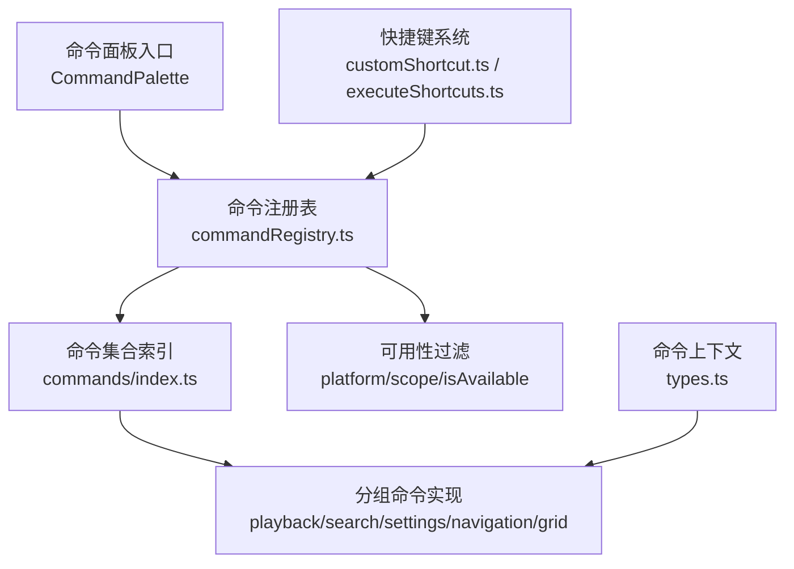
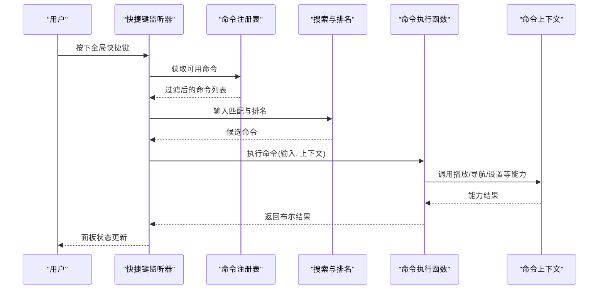
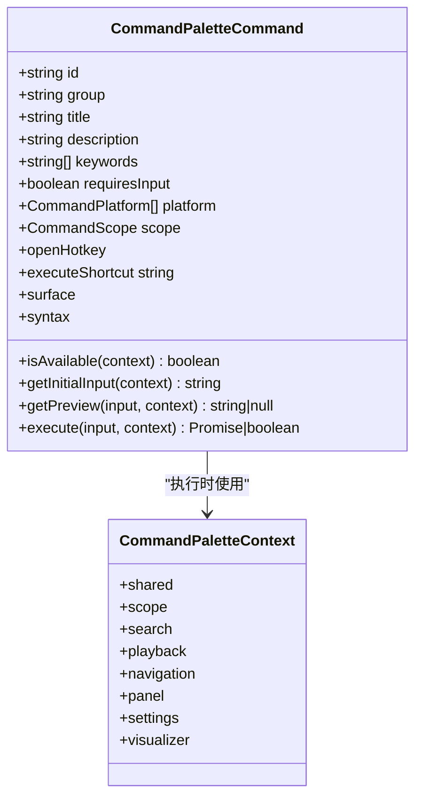
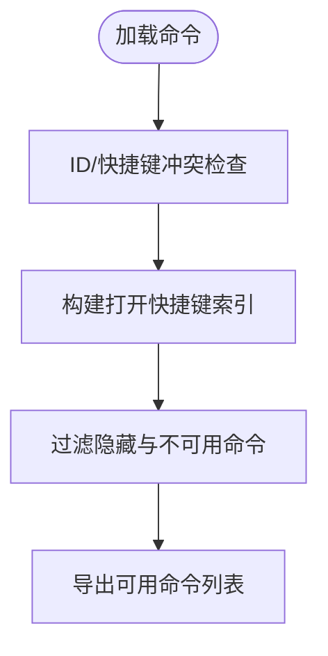
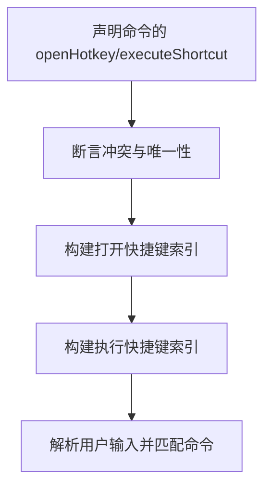
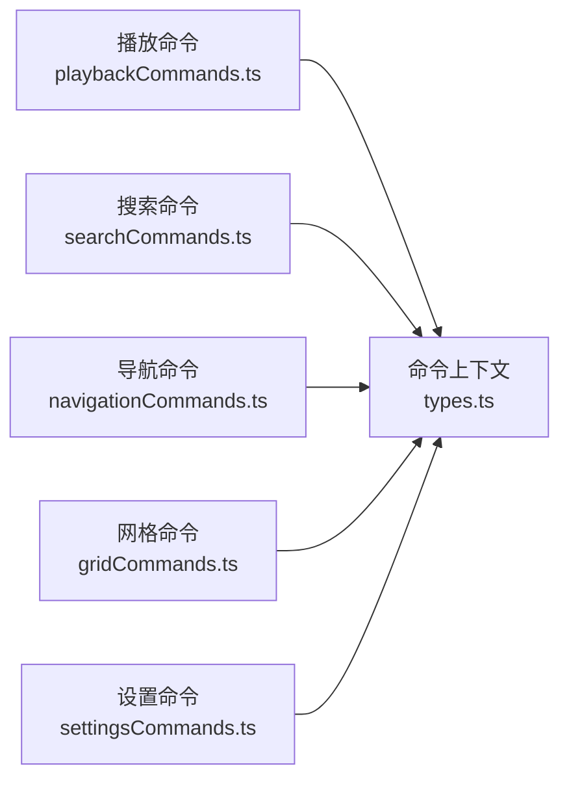
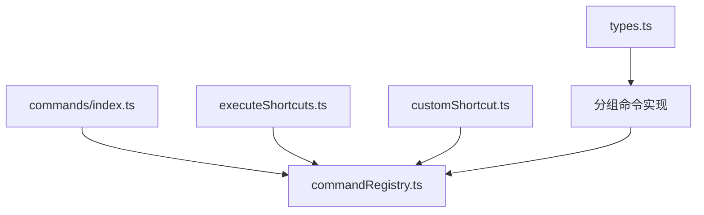

# 命令扩展模组

<cite>
**本文引用的文件**   
- [types.ts](file://src/components/command-palette/types.ts)
- [commandRegistry.ts](file://src/components/command-palette/commandRegistry.ts)
- [commands/index.ts](file://src/components/command-palette/commands/index.ts)
- [customShortcut.ts](file://src/components/command-palette/customShortcut.ts)
- [executeShortcuts.ts](file://src/components/command-palette/executeShortcuts.ts)
- [playbackCommands.ts](file://src/components/command-palette/commands/playbackCommands.ts)
- [searchCommands.ts](file://src/components/command-palette/commands/searchCommands.ts)
- [settingsCommands.ts](file://src/components/command-palette/commands/settingsCommands.ts)
- [navigationCommands.ts](file://src/components/command-palette/commands/navigationCommands.ts)
- [gridCommands.ts](file://src/components/command-palette/commands/gridCommands.ts)
</cite>

## 目录
1. [引言](#引言)
2. [项目结构](#项目结构)
3. [核心组件](#核心组件)
4. [架构总览](#架构总览)
5. [详细组件分析](#详细组件分析)
6. [依赖关系分析](#依赖关系分析)
7. [性能与优化](#性能与优化)
8. [调试、测试与排错](#调试测试与排错)
9. [结论](#结论)
10. [附录：命令开发清单](#附录命令开发清单)

## 引言
本指南面向希望为应用“命令面板”扩展命令的开发者。你将学习如何定义命令、注册命令、绑定快捷键，以及如何在命令中访问播放控制、界面导航、设置项、网格操作和数据查询等能力。文档同时覆盖命令语法、自动完成、历史记录、权限控制、调试与测试方法，并给出从简单文本命令到复杂交互式命令的完整示例路径。

## 项目结构
命令系统围绕“命令面板”模块组织，核心包括：
- 类型契约：命令元数据、上下文、分组、作用域等
- 命令注册表：汇总所有命令、可用性过滤、排序与匹配
- 命令实现：按功能分组（播放、搜索、设置、导航、网格等）
- 快捷键系统：全局打开快捷键、执行模式 Vim 风格快捷键、自定义 Alt+字母快捷键
- 命令工厂与语法：简化常见命令创建、参数解析与预览

**图表来源**
- [commandRegistry.ts:1-44](file://src/components/command-palette/commandRegistry.ts#L1-L44)
- [commands/index.ts:1-107](file://src/components/command-palette/commands/index.ts#L1-L107)
- [types.ts:25-84](file://src/components/command-palette/types.ts#L25-L84)
- [customShortcut.ts:1-68](file://src/components/command-palette/customShortcut.ts#L1-L68)
- [executeShortcuts.ts:1-83](file://src/components/command-palette/executeShortcuts.ts#L1-L83)

**章节来源**
- [commandRegistry.ts:1-44](file://src/components/command-palette/commandRegistry.ts#L1-L44)
- [commands/index.ts:1-107](file://src/components/command-palette/commands/index.ts#L1-L107)
- [types.ts:25-84](file://src/components/command-palette/types.ts#L25-L84)

## 核心组件
- CommandPaletteCommand：命令的完整描述，包含标识、分组、标题、描述、图标、关键词、占位符、是否需输入、平台限制、作用域、可用性判断、打开快捷键、执行快捷键、交互表面、语法规范、初始输入、预览、队列信息、设置跳转目标以及执行函数。
- CommandPaletteContext：命令执行时可获得的能力集合，分为共享、作用域、搜索、播放、导航、面板、设置、可视化等子上下文。
- 命令注册表：提供可用命令列表、精确匹配、排名和队列歌曲匹配等能力。
- 快捷键系统：负责校验和执行模式的 Vim 风格快捷键冲突检测、构建索引与解析；以及自定义 Alt+字母快捷键的保留与解析。

**章节来源**
- [types.ts:25-84](file://src/components/command-palette/types.ts#L25-L84)
- [types.ts:94-376](file://src/components/command-palette/types.ts#L94-L376)
- [commandRegistry.ts:1-44](file://src/components/command-palette/commandRegistry.ts#L1-L44)
- [executeShortcuts.ts:1-83](file://src/components/command-palette/executeShortcuts.ts#L1-L83)
- [customShortcut.ts:1-68](file://src/components/command-palette/customShortcut.ts#L1-L68)

## 架构总览
命令面板的整体流程如下：
- 用户通过全局快捷键或键盘事件触发命令面板
- 注册表根据平台、作用域和 isAvailable 过滤出可用命令
- 搜索与排名引擎对命令进行匹配与排序
- 用户输入后，命令执行函数被调用，并通过上下文调用播放、导航、设置等能力
- 结果返回给面板以更新状态或显示反馈

**图表来源**
- [commandRegistry.ts:15-43](file://src/components/command-palette/commandRegistry.ts#L15-L43)
- [commands/index.ts:76-88](file://src/components/command-palette/commands/index.ts#L76-L88)
- [types.ts:94-376](file://src/components/command-palette/types.ts#L94-L376)

## 详细组件分析

### 命令定义与上下文
- 命令定义字段说明：
  - id：唯一标识
  - group：分组（搜索、设置、导航、面板、播放、可视化、网格）
  - title/description：标题与描述
  - keywords：用于搜索匹配的关键词数组
  - requiresInput：是否需要用户输入
  - platform：平台限制（如 electron、win、mac、linux）
  - scope：作用域（播放器表面、过滤表面、海报墙、网格表面）
  - isAvailable：动态可用性判断
  - openHotkey：打开命令面板直达该命令的快捷键
  - executeShortcut：执行模式下 Vim 风格的快捷键
  - surface：命令可渲染的自定义交互表面
  - syntax：命令语法规范（由 ./syntax 解析）
  - getInitialInput/getPreview：初始输入与预览文本
  - execute：命令执行函数，返回布尔值表示是否成功

- 命令上下文分类：
  - shared：通用能力（翻译、状态消息、当前歌曲、歌词、播放器状态）
  - search：搜索相关（当前源、本地歌曲、目录、导航与提交搜索）
  - playback：播放控制（音量、静音、播放/暂停、上一首/下一首、循环、随机、收藏、添加到歌单、均衡器、最佳歌词匹配等）
  - navigation：导航（首页、播放器、海报墙、全屏、遥控窗口、置顶等）
  - panel：面板控制（切换标签页、打开/关闭面板）
  - settings：设置（语言、主题、同步、桌面端开关、可视化、智能过渡等）
  - visualizer：可视化（模式、背景模式、视频层、词分割等）
  - scope：命令面板打开时的视图与作用域（当前视图、过滤器句柄、网格句柄）

**图表来源**
- [types.ts:25-84](file://src/components/command-palette/types.ts#L25-L84)
- [types.ts:94-376](file://src/components/command-palette/types.ts#L94-L376)

**章节来源**
- [types.ts:25-84](file://src/components/command-palette/types.ts#L25-L84)
- [types.ts:94-376](file://src/components/command-palette/types.ts#L94-L376)

### 命令注册与可用性过滤
- 命令集合在 commands/index.ts 中集中声明，并进行 ID 唯一性、打开快捷键唯一性与执行快捷键前缀冲突检查。
- commandRegistry.ts 提供：
  - COMMAND_PALETTE_COMMANDS：所有已声明的命令
  - getAvailableCommandPaletteCommands：基于 hidden/platform/scope/isAvailable 过滤可用命令
  - isCommandPaletteCommandEnabled：单个命令的可用性判断
  - 导出搜索与排名相关工具

**图表来源**
- [commands/index.ts:16-88](file://src/components/command-palette/commands/index.ts#L16-L88)
- [commandRegistry.ts:15-43](file://src/components/command-palette/commandRegistry.ts#L15-L43)

**章节来源**
- [commands/index.ts:16-88](file://src/components/command-palette/commands/index.ts#L16-L88)
- [commandRegistry.ts:15-43](file://src/components/command-palette/commandRegistry.ts#L15-L43)

### 快捷键系统
- 打开快捷键：
  - 每个命令可通过 openHotkey 指定打开命令面板直达该命令的快捷键
  - 系统会检查与内置快捷键（如 s、ctrl+k）冲突，并构建索引以便快速查找

- 执行模式快捷键：
  - 使用 vim 风格键序列（executeShortcut），在同一作用域内必须前缀无关以避免歧义
  - 提供断言与索引构建、解析逻辑

- 自定义快捷键：
  - 支持 Alt+字母的自定义快捷键，仅允许无作用域限制的命令绑定
  - 收集已保留的按键组合，避免与命令面板自身或已注册命令冲突

**图表来源**
- [commands/index.ts:27-88](file://src/components/command-palette/commands/index.ts#L27-L88)
- [executeShortcuts.ts:22-83](file://src/components/command-palette/executeShortcuts.ts#L22-L83)
- [customShortcut.ts:24-67](file://src/components/command-palette/customShortcut.ts#L24-L67)

**章节来源**
- [commands/index.ts:27-88](file://src/components/command-palette/commands/index.ts#L27-L88)
- [executeShortcuts.ts:22-83](file://src/components/command-palette/executeShortcuts.ts#L22-L83)
- [customShortcut.ts:24-67](file://src/components/command-palette/customShortcut.ts#L24-L67)

### 命令执行上下文与能力
- 播放控制：
  - 通过 context.playback 访问音量、静音、播放/暂停、上一首/下一首、循环、随机、收藏、添加到歌单、均衡器、最佳歌词匹配等能力
  - 示例命令：播放、暂停、下一首、上一首、循环、随机、清空队列、最佳歌词匹配、音频效果

- 搜索与数据查询：
  - 通过 context.search 访问当前搜索源、本地歌曲、目录、导航与提交搜索
  - 示例命令：在当前源搜索、本地音乐搜索、Navidrome 搜索、网易云搜索

- 导航与界面操作：
  - 通过 context.navigation 访问首页、播放器、海报墙、全屏、遥控窗口、置顶等能力
  - 通过 context.panel 打开/关闭面板并切换标签页

- 设置与偏好：
  - 通过 context.settings 访问语言、主题、同步、桌面端开关、可视化、智能过渡、歌词处理策略等能力
  - 示例命令：打开帮助、外观设置、主题预设、智能过渡、生成 AI 主题、快速主题编辑器、降低动效等

- 网格操作：
  - 通过 createGridSurfaceCommand 创建的网格命令，与当前网格表面的能力联动（排序、重扫描、导出、编辑实体等）

**图表来源**
- [playbackCommands.ts:14-138](file://src/components/command-palette/commands/playbackCommands.ts#L14-L138)
- [searchCommands.ts:1-106](file://src/components/command-palette/commands/searchCommands.ts#L1-L106)
- [navigationCommands.ts:1-59](file://src/components/command-palette/commands/navigationCommands.ts#L1-L59)
- [gridCommands.ts:1-123](file://src/components/command-palette/commands/gridCommands.ts#L1-L123)
- [settingsCommands.ts:1-595](file://src/components/command-palette/commands/settingsCommands.ts#L1-L595)
- [types.ts:94-376](file://src/components/command-palette/types.ts#L94-L376)

**章节来源**
- [playbackCommands.ts:14-138](file://src/components/command-palette/commands/playbackCommands.ts#L14-L138)
- [searchCommands.ts:1-106](file://src/components/command-palette/commands/searchCommands.ts#L1-L106)
- [navigationCommands.ts:1-59](file://src/components/command-palette/commands/navigationCommands.ts#L1-L59)
- [gridCommands.ts:1-123](file://src/components/command-palette/commands/gridCommands.ts#L1-L123)
- [settingsCommands.ts:1-595](file://src/components/command-palette/commands/settingsCommands.ts#L1-L595)
- [types.ts:94-376](file://src/components/command-palette/types.ts#L94-L376)

### 命令语法、自动完成与预览
- 语法规范：
  - 命令可通过 syntax 字段声明接受的参数语法（如 --flag @facet:value），由 ./syntax 解析
- 自动完成：
  - 通过 keywords 与 i18n 文案提升搜索匹配质量
  - 通过 getInitialInput 提供初始输入建议
- 预览：
  - 通过 getPreview 返回预览文本，帮助用户在执行前确认意图（例如搜索预览）

**章节来源**
- [types.ts:43-84](file://src/components/command-palette/types.ts#L43-L84)
- [searchCommands.ts:18-36](file://src/components/command-palette/commands/searchCommands.ts#L18-L36)

### 权限控制与可见性
- 平台限制：
  - 通过 platform 字段限定命令仅在特定平台出现（如 electron、win、mac、linux）
- 作用域限制：
  - 通过 scope 字段限定命令仅在特定界面环境可用（播放器表面、过滤表面、海报墙、网格表面）
- 动态可用性：
  - 通过 isAvailable 函数根据运行时状态决定是否提供命令（如当前是否有歌曲、是否处于 FM 模式、模型是否可用等）
- 隐藏命令：
  - 通过 hidden 字段将命令排除在列表之外，但仍可通过快捷键直接执行（如执行模式载体命令）

**章节来源**
- [commandRegistry.ts:15-43](file://src/components/command-palette/commandRegistry.ts#L15-L43)
- [types.ts:43-84](file://src/components/command-palette/types.ts#L43-L84)

### 完整的命令模组示例
- 简单文本命令：
  - 播放/暂停/上一首/下一首/循环/随机/清空队列/最佳歌词匹配
  - 参考路径：[playbackCommands.ts:46-138](file://src/components/command-palette/commands/playbackCommands.ts#L46-L138)

- 带预览的搜索命令：
  - 在当前源搜索、本地音乐搜索、Navidrome 搜索、网易云搜索
  - 参考路径：[searchCommands.ts:1-106](file://src/components/command-palette/commands/searchCommands.ts#L1-L106)

- 设置类命令：
  - 打开帮助/外观设置/主题预设/智能过渡/生成 AI 主题/快速主题编辑器/降低动效
  - 参考路径：[settingsCommands.ts:18-595](file://src/components/command-palette/commands/settingsCommands.ts#L18-L595)

- 导航与界面操作命令：
  - 返回首页/播放器/海报墙/全屏/遥控窗口/置顶
  - 参考路径：[navigationCommands.ts:7-59](file://src/components/command-palette/commands/navigationCommands.ts#L7-L59)

- 网格操作命令：
  - 排序、重扫描、导出、编辑实体、重载在线合集
  - 参考路径：[gridCommands.ts:17-123](file://src/components/command-palette/commands/gridCommands.ts#L17-L123)

- 交互式命令（带自定义表面）：
  - 网格卡片样式调整、海报叠色调整、降低动效调整
  - 参考路径：[settingsCommands.ts:485-533](file://src/components/command-palette/commands/settingsCommands.ts#L485-L533)

**章节来源**
- [playbackCommands.ts:46-138](file://src/components/command-palette/commands/playbackCommands.ts#L46-L138)
- [searchCommands.ts:1-106](file://src/components/command-palette/commands/searchCommands.ts#L1-L106)
- [settingsCommands.ts:18-595](file://src/components/command-palette/commands/settingsCommands.ts#L18-L595)
- [navigationCommands.ts:7-59](file://src/components/command-palette/commands/navigationCommands.ts#L7-L59)
- [gridCommands.ts:17-123](file://src/components/command-palette/commands/gridCommands.ts#L17-L123)

## 依赖关系分析
- 命令实现依赖 types.ts 中的上下文与类型契约
- 命令注册表依赖 commands/index.ts 提供的命令集合与快捷键索引
- 快捷键系统依赖 executeShortcuts.ts 与 customShortcut.ts 的断言与解析逻辑
- 分组命令实现依赖各自的功能领域（播放、搜索、设置、导航、网格）

**图表来源**
- [types.ts:25-84](file://src/components/command-palette/types.ts#L25-L84)
- [commands/index.ts:76-88](file://src/components/command-palette/commands/index.ts#L76-L88)
- [commandRegistry.ts:1-44](file://src/components/command-palette/commandRegistry.ts#L1-L44)
- [executeShortcuts.ts:1-83](file://src/components/command-palette/executeShortcuts.ts#L1-L83)
- [customShortcut.ts:1-68](file://src/components/command-palette/customShortcut.ts#L1-L68)

**章节来源**
- [types.ts:25-84](file://src/components/command-palette/types.ts#L25-L84)
- [commands/index.ts:76-88](file://src/components/command-palette/commands/index.ts#L76-L88)
- [commandRegistry.ts:1-44](file://src/components/command-palette/commandRegistry.ts#L1-L44)
- [executeShortcuts.ts:1-83](file://src/components/command-palette/executeShortcuts.ts#L1-L83)
- [customShortcut.ts:1-68](file://src/components/command-palette/customShortcut.ts#L1-L68)

## 性能与优化
- 快捷键查找优化：
  - 打开快捷键索引在模块加载时构建，避免每次按键都遍历全部命令
- 可用性过滤：
  - isAvailable 在命令面板打开时重新评估，避免缓存导致的状态陈旧问题
- 搜索与排名：
  - 命令面板钩子传入已过滤的命令列表给排名引擎，减少重复计算
- 命令预览与初始输入：
  - 通过 getPreview 与 getInitialInput 减少无效输入与不必要的执行

**章节来源**
- [commands/index.ts:60-88](file://src/components/command-palette/commands/index.ts#L60-L88)
- [commandRegistry.ts:28-43](file://src/components/command-palette/commandRegistry.ts#L28-L43)

## 调试、测试与排错
- 快捷键冲突检测：
  - 打开快捷键与执行快捷键均进行断言，若发现重复或前缀冲突会抛出错误
- 命令 ID 唯一性：
  - 命令集合构建时会检查重复 ID，防止命名冲突
- 常见问题排查：
  - 命令未出现：检查 platform、scope、isAvailable 与 hidden 配置
  - 快捷键无效：检查 openHotkey 是否与内置快捷键冲突，或 executeShortcut 是否存在前缀冲突
  - 执行失败：检查 execute 返回值与上下文能力是否满足条件

**章节来源**
- [commands/index.ts:16-45](file://src/components/command-palette/commands/index.ts#L16-L45)
- [executeShortcuts.ts:22-51](file://src/components/command-palette/executeShortcuts.ts#L22-L51)

## 结论
命令扩展模组提供了统一的命令定义、注册、快捷键绑定与执行框架。通过 types.ts 的上下文契约，命令可以安全地访问播放控制、界面操作、设置与数据查询等能力。借助命令注册表的过滤与快捷键系统的断言，开发者可以快速构建从简单文本命令到复杂交互式命令的完整体验。建议在开发过程中充分利用 keywords、getPreview、isAvailable 与 platform/scope 等机制，确保命令的可发现性、可用性与性能。

## 附录：命令开发清单
- 定义命令：
  - 填写 id、group、title、description、keywords
  - 根据需要设置 requiresInput、platform、scope、isAvailable、openHotkey、executeShortcut、surface、syntax、getInitialInput、getPreview
  - 实现 execute(input, context)

- 注册命令：
  - 将命令加入对应分组的命令数组
  - 确保命令集合构建时不会触发 ID 或快捷键冲突断言

- 绑定快捷键：
  - 使用 openHotkey 指定打开直达快捷键
  - 使用 executeShortcut 指定执行模式快捷键（注意前缀无关）
  - 如需自定义 Alt+字母快捷键，确保命令无作用域限制且未被保留

- 集成能力：
  - 通过 context.playback 控制播放
  - 通过 context.search 进行搜索与导航
  - 通过 context.navigation 进行页面与窗口级操作
  - 通过 context.settings 修改设置与偏好
  - 通过 grid 命令工厂与网格表面能力联动

- 测试与调试：
  - 验证快捷键冲突与唯一性
  - 检查 isAvailable 在不同状态下的行为
  - 使用 getPreview 与 getInitialInput 提升用户体验

**章节来源**
- [types.ts:25-84](file://src/components/command-palette/types.ts#L25-L84)
- [commands/index.ts:16-88](file://src/components/command-palette/commands/index.ts#L16-L88)
- [executeShortcuts.ts:22-83](file://src/components/command-palette/executeShortcuts.ts#L22-L83)
- [customShortcut.ts:24-67](file://src/components/command-palette/customShortcut.ts#L24-L67)