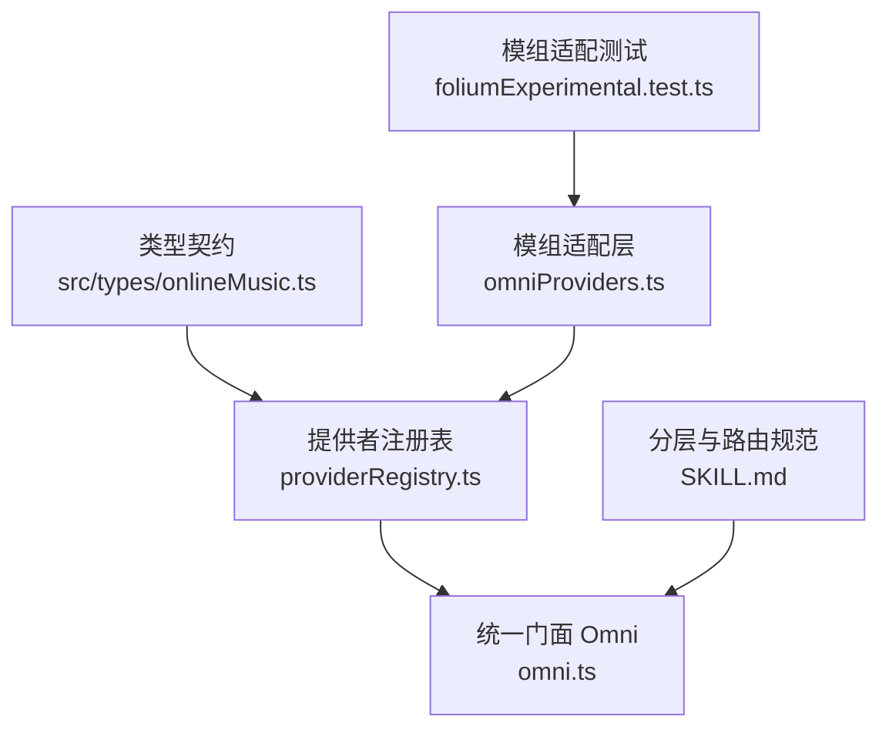
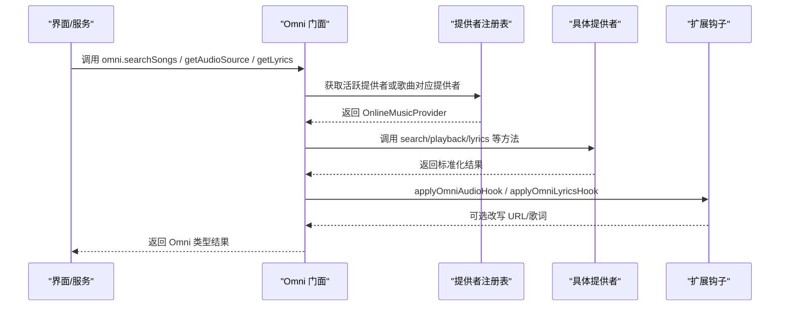
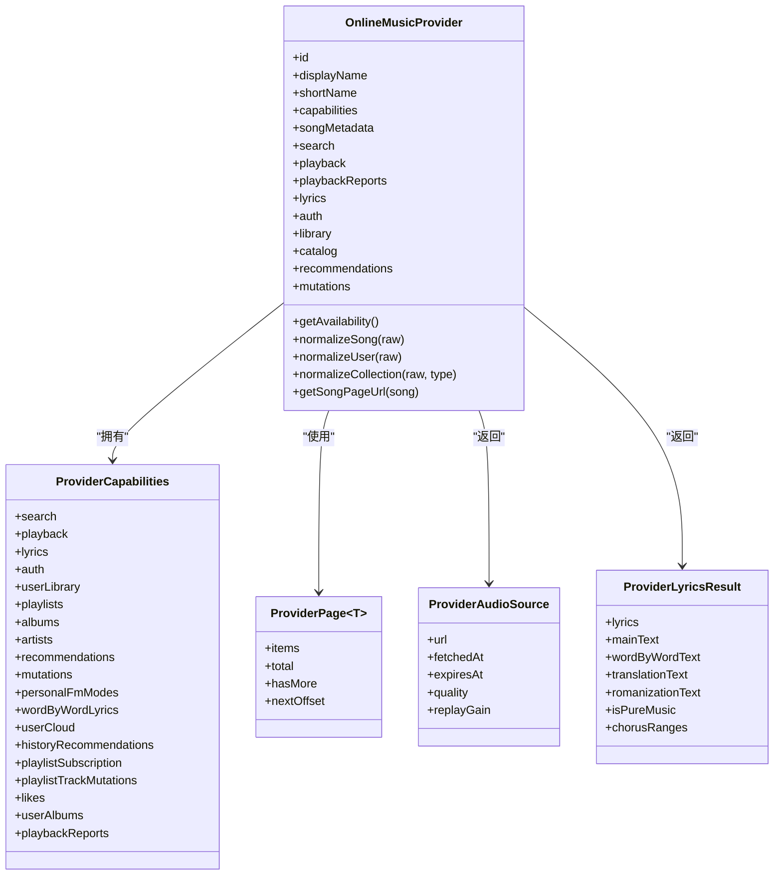
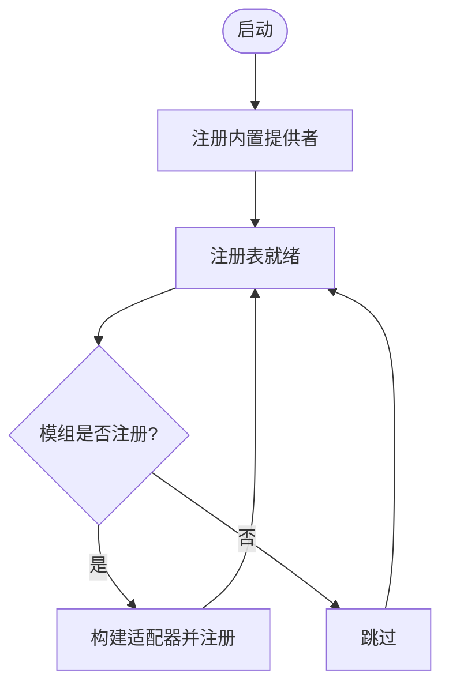
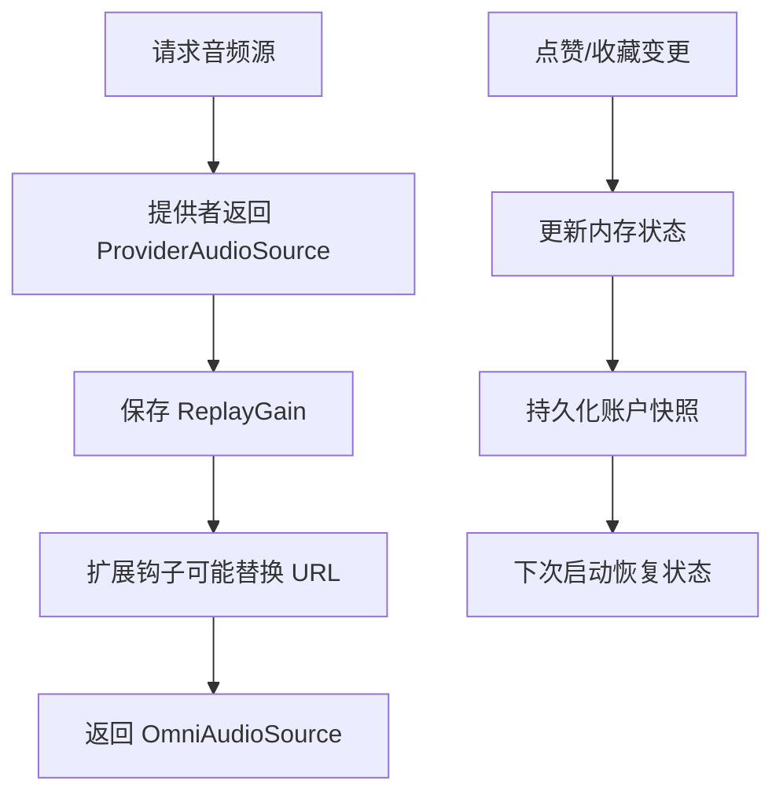
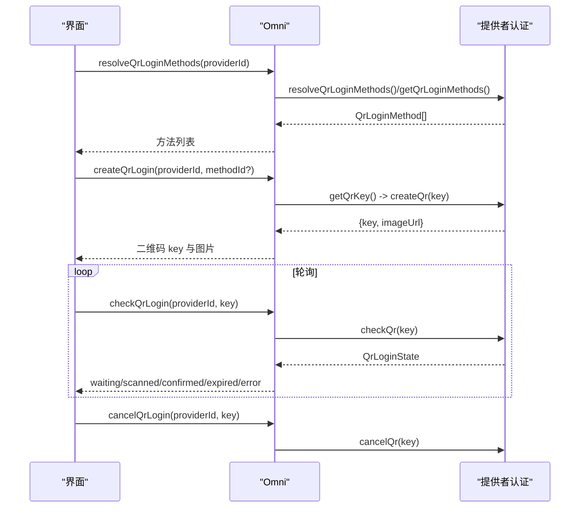
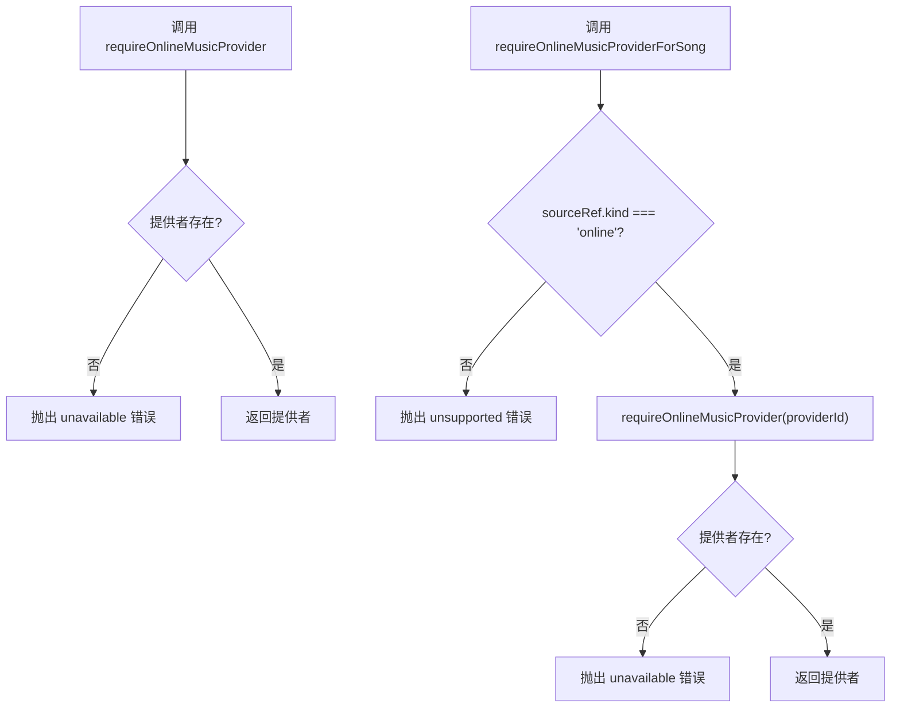
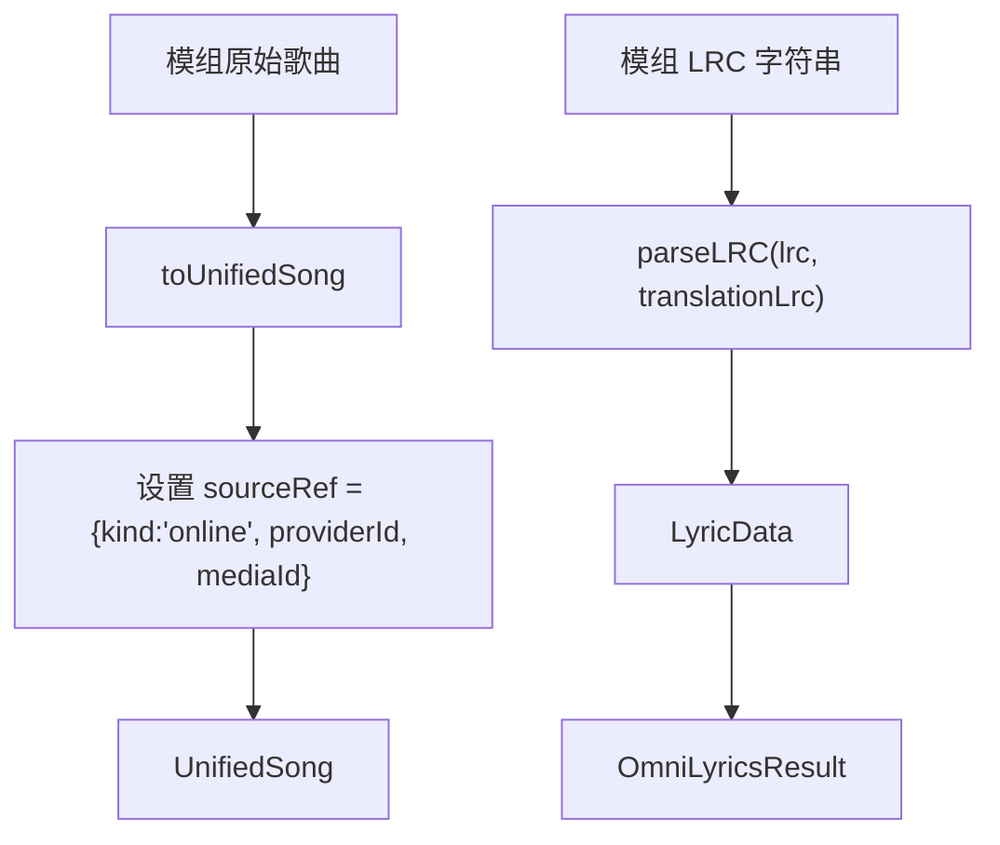
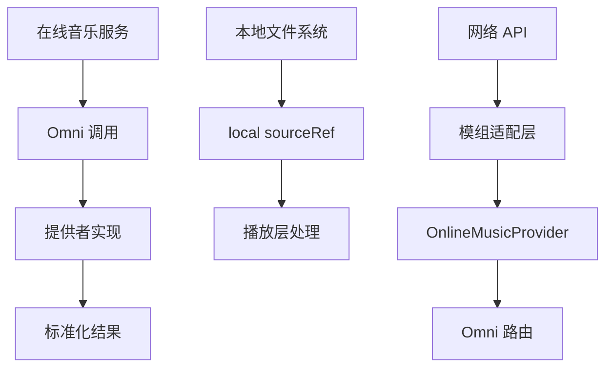

# 数据源模组

<cite>
**本文引用的文件**   
- [src/types/onlineMusic.ts](file://src/types/onlineMusic.ts)
- [src/services/onlineMusic/providerRegistry.ts](file://src/services/onlineMusic/providerRegistry.ts)
- [src/services/onlineMusic/omni.ts](file://src/services/onlineMusic/omni.ts)
- [src/mods/folium/registries/omniProviders.ts](file://src/mods/folium/registries/omniProviders.ts)
- [skills/online-song-omni-routing/SKILL.md](file://skills/online-song-omni-routing/SKILL.md)
- [test/unit/mod-system/foliumExperimental.test.ts](file://test/unit/mod-system/foliumExperimental.test.ts)
</cite>

## 目录
1. [引言](#引言)
2. [项目结构](#项目结构)
3. [核心组件](#核心组件)
4. [架构总览](#架构总览)
5. [详细组件分析](#详细组件分析)
6. [依赖关系分析](#依赖关系分析)
7. [性能与并发](#性能与并发)
8. [错误处理与诊断](#错误处理与诊断)
9. [认证流程](#认证流程)
10. [数据转换与元数据](#数据转换与元数据)
11. [完整示例：在线音乐、本地文件系统与网络 API](#完整示例在线音乐本地文件系统与网络-api)
12. [最佳实践清单](#最佳实践清单)
13. [故障排查指南](#故障排查指南)
14. [结论](#结论)

## 引言
本指南面向“数据源模组”开发者，聚焦 OmniProvider 接口实现、数据获取与缓存策略、注册机制、认证流程、错误处理、数据转换与格式标准化、元数据处理，以及并发请求、重试机制和离线支持。文档以仓库中现有的在线音乐统一接口（Omni）与模组扩展点为依据，提供从概念到代码的渐进式说明，并给出可落地的架构图、流程图与检查清单。

## 项目结构
围绕数据源模组的代码主要分布在以下位置：
- 类型契约与公共 Omni 别名：src/types/onlineMusic.ts
- 提供者注册表与能力查询：src/services/onlineMusic/providerRegistry.ts
- 统一入口 Omni 门面：src/services/onlineMusic/omni.ts
- 模组侧 OmniProvider 适配层：src/mods/folium/registries/omniProviders.ts
- 分层边界与路由规范：skills/online-song-omni-routing/SKILL.md
- 模组适配行为测试：test/unit/mod-system/foliumExperimental.test.ts

**图示来源**
- [src/types/onlineMusic.ts:31-53](file://src/types/onlineMusic.ts#L31-L53)
- [src/services/onlineMusic/providerRegistry.ts:11-38](file://src/services/onlineMusic/providerRegistry.ts#L11-L38)
- [src/services/onlineMusic/omni.ts:105-183](file://src/services/onlineMusic/omni.ts#L105-L183)
- [src/mods/folium/registries/omniProviders.ts:50-124](file://src/mods/folium/registries/omniProviders.ts#L50-L124)
- [skills/online-song-omni-routing/SKILL.md:102-111](file://skills/online-song-omni-routing/SKILL.md#L102-L111)
- [test/unit/mod-system/foliumExperimental.test.ts:48-70](file://test/unit/mod-system/foliumExperimental.test.ts#L48-L70)

**章节来源**
- [src/types/onlineMusic.ts:1-380](file://src/types/onlineMusic.ts#L1-L380)
- [src/services/onlineMusic/providerRegistry.ts:1-61](file://src/services/onlineMusic/providerRegistry.ts#L1-L61)
- [src/services/onlineMusic/omni.ts:1-663](file://src/services/onlineMusic/omni.ts#L1-L663)
- [src/mods/folium/registries/omniProviders.ts:1-140](file://src/mods/folium/registries/omniProviders.ts#L1-L140)
- [skills/online-song-omni-routing/SKILL.md:20-144](file://skills/online-song-omni-routing/SKILL.md#L20-L144)
- [test/unit/mod-system/foliumExperimental.test.ts:48-70](file://test/unit/mod-system/foliumExperimental.test.ts#L48-L70)

## 核心组件
- 类型契约与公共别名：定义 ProviderCapabilities、ProviderPage、ProviderAudioSource、ProviderLyricsResult、OnlineMusicProvider 等核心类型，并提供 Omni* 别名作为对外统一消费面。
- 提供者注册表：维护 OnlineMusicProvider 实例 Map，提供注册、注销、按 ID 获取、按歌曲来源解析提供者、能力判断等工具方法。
- Omni 门面：封装跨提供者的搜索、播放、歌词、收藏、歌单、专辑、艺术家、推荐、变更操作、扫码登录等能力；负责活跃提供者切换、能力校验、结果标准化、钩子扩展与缓存持久化。
- 模组适配层：将模组定义的简易数据源适配为宿主 OnlineMusicProvider，自动推导 capabilities，并在 search/playback/lyrics 路径上完成 UnifiedSong 与 LRC 的标准化。

**章节来源**
- [src/types/onlineMusic.ts:31-53](file://src/types/onlineMusic.ts#L31-L53)
- [src/types/onlineMusic.ts:74-114](file://src/types/onlineMusic.ts#L74-L114)
- [src/types/onlineMusic.ts:214-357](file://src/types/onlineMusic.ts#L214-L357)
- [src/types/onlineMusic.ts:359-379](file://src/types/onlineMusic.ts#L359-L379)
- [src/services/onlineMusic/providerRegistry.ts:11-38](file://src/services/onlineMusic/providerRegistry.ts#L11-L38)
- [src/services/onlineMusic/omni.ts:105-183](file://src/services/onlineMusic/omni.ts#L105-L183)
- [src/mods/folium/registries/omniProviders.ts:50-124](file://src/mods/folium/registries/omniProviders.ts#L50-L124)

## 架构总览
Omni 是应用层访问所有在线音乐提供者的唯一入口。上层组件通过 omni.* 调用，Omni 根据当前活跃提供者或歌曲所属提供者，路由到具体 provider 的实现。模组可通过 omni.providers 注册自定义数据源，被视作普通提供者参与统一路由。

**图示来源**
- [src/services/onlineMusic/omni.ts:179-183](file://src/services/onlineMusic/omni.ts#L179-L183)
- [src/services/onlineMusic/omni.ts:452-461](file://src/services/onlineMusic/omni.ts#L452-L461)
- [src/services/onlineMusic/omni.ts:476-487](file://src/services/onlineMusic/omni.ts#L476-L487)
- [src/services/onlineMusic/providerRegistry.ts:21-33](file://src/services/onlineMusic/providerRegistry.ts#L21-L33)

## 详细组件分析

### OmniProvider 接口与类型契约
- OnlineMusicProvider：包含 id、displayName、capabilities、normalizeSong 及可选的 search、playback、lyrics、auth、library、catalog、recommendations、mutations 等模块。
- ProviderCapabilities：声明各能力开关，如 search、playback、lyrics、auth、userLibrary、playlists、albums、artists、recommendations、mutations、wordByWordLyrics 等。
- ProviderPage、ProviderAudioSource、ProviderLyricsResult、ProviderCollection、ProviderUser 等：统一的数据模型，屏蔽不同提供者的原始响应差异。
- Omni* 别名：对外暴露的统一类型名，便于上层消费而不耦合内部 Provider* 命名。

**图示来源**
- [src/types/onlineMusic.ts:31-53](file://src/types/onlineMusic.ts#L31-L53)
- [src/types/onlineMusic.ts:74-114](file://src/types/onlineMusic.ts#L74-L114)
- [src/types/onlineMusic.ts:214-357](file://src/types/onlineMusic.ts#L214-L357)

**章节来源**
- [src/types/onlineMusic.ts:31-53](file://src/types/onlineMusic.ts#L31-L53)
- [src/types/onlineMusic.ts:74-114](file://src/types/onlineMusic.ts#L74-L114)
- [src/types/onlineMusic.ts:214-357](file://src/types/onlineMusic.ts#L214-L357)
- [src/types/onlineMusic.ts:359-379](file://src/types/onlineMusic.ts#L359-L379)

### 提供者注册机制
- 注册表使用 Map 存储 OnlineMusicProvider，提供 register/unregister/get/list/require 等方法。
- 内置提供者（如 netease/kugou/qq）在模块加载时自动注册。
- 支持按歌曲 sourceRef 解析提供者，并判断是否支持 playback。
- 模组可通过 omni.providers 注册自定义数据源，ID 形如 folium.<modid>.<name>，并被注入注册表。

**图示来源**
- [src/services/onlineMusic/providerRegistry.ts:58-60](file://src/services/onlineMusic/providerRegistry.ts#L58-L60)
- [src/mods/folium/registries/omniProviders.ts:126-139](file://src/mods/folium/registries/omniProviders.ts#L126-L139)

**章节来源**
- [src/services/onlineMusic/providerRegistry.ts:11-38](file://src/services/onlineMusic/providerRegistry.ts#L11-L38)
- [src/services/onlineMusic/providerRegistry.ts:40-56](file://src/services/onlineMusic/providerRegistry.ts#L40-L56)
- [src/services/onlineMusic/providerRegistry.ts:58-60](file://src/services/onlineMusic/providerRegistry.ts#L58-L60)
- [src/mods/folium/registries/omniProviders.ts:126-139](file://src/mods/folium/registries/omniProviders.ts#L126-L139)

### 数据获取与缓存策略
- 音频源：Omni.getAudioSource 会保存 ReplayGain 信息，并通过扩展钩子允许替换 URL。
- 账号快照：点赞状态、歌单集合等变更后，会持久化账户快照，保证重启后状态一致。
- 刷新策略：refreshProviderPlaylists 分页拉取并合并非 playlist 集合，更新 freshness 与 lastUpdatedAt。
- 回放上报：reportPlayback 仅在提供者支持 playbackReports 时转发。

**图示来源**
- [src/services/onlineMusic/omni.ts:452-461](file://src/services/onlineMusic/omni.ts#L452-L461)
- [src/services/onlineMusic/omni.ts:63-81](file://src/services/onlineMusic/omni.ts#L63-L81)
- [src/services/onlineMusic/omni.ts:259-304](file://src/services/onlineMusic/omni.ts#L259-L304)
- [src/services/onlineMusic/omni.ts:593-634](file://src/services/onlineMusic/omni.ts#L593-L634)

**章节来源**
- [src/services/onlineMusic/omni.ts:452-461](file://src/services/onlineMusic/omni.ts#L452-L461)
- [src/services/onlineMusic/omni.ts:63-81](file://src/services/onlineMusic/omni.ts#L63-L81)
- [src/services/onlineMusic/omni.ts:259-304](file://src/services/onlineMusic/omni.ts#L259-L304)
- [src/services/onlineMusic/omni.ts:593-634](file://src/services/onlineMusic/omni.ts#L593-L634)

### 认证流程与二维码登录
- Omni 提供 getLoginStatus/logout 等基础认证方法。
- 二维码登录流程：resolveQrLoginMethods -> createQrLogin -> checkQrLogin -> cancelQrLogin，支持 TTL 与诊断信息。
- 未实现的能力会返回空数组或抛出 unsupported 错误，UI 据此决定单步或多步流程。

**图示来源**
- [src/services/onlineMusic/omni.ts:192-247](file://src/services/onlineMusic/omni.ts#L192-L247)

**章节来源**
- [src/services/onlineMusic/omni.ts:192-247](file://src/services/onlineMusic/omni.ts#L192-L247)

### 错误处理与诊断
- OnlineProviderError：携带 code、message、providerId、cause，用于区分 auth-required、unsupported、unavailable、network、invalid-response 等场景。
- require 系列方法在未找到提供者或来源不匹配时抛出明确错误。
- 二维码诊断：getQrLoginDiagnostics 捕获异常并返回可读诊断行，避免二次失败。

**图示来源**
- [src/services/onlineMusic/providerRegistry.ts:27-33](file://src/services/onlineMusic/providerRegistry.ts#L27-L33)
- [src/services/onlineMusic/providerRegistry.ts:50-56](file://src/services/onlineMusic/providerRegistry.ts#L50-L56)
- [src/types/onlineMusic.ts:191-212](file://src/types/onlineMusic.ts#L191-L212)

**章节来源**
- [src/services/onlineMusic/providerRegistry.ts:27-33](file://src/services/onlineMusic/providerRegistry.ts#L27-L33)
- [src/services/onlineMusic/providerRegistry.ts:50-56](file://src/services/onlineMusic/providerRegistry.ts#L50-L56)
- [src/types/onlineMusic.ts:191-212](file://src/types/onlineMusic.ts#L191-L212)

### 数据转换、格式标准化与元数据处理
- 模组适配层将模组提供的简单歌曲对象转换为 UnifiedSong，并设置 sourceRef.providerId 与 mediaId。
- LRC 歌词通过 parseLRC 标准化为 LyricData，同时保留 mainText/translationText。
- Omni 对歌词进行副歌区间解析，并通过扩展钩子允许重写歌词内容。

**图示来源**
- [src/mods/folium/registries/omniProviders.ts:25-44](file://src/mods/folium/registries/omniProviders.ts#L25-L44)
- [src/mods/folium/registries/omniProviders.ts:107-122](file://src/mods/folium/registries/omniProviders.ts#L107-L122)
- [src/services/onlineMusic/omni.ts:476-487](file://src/services/onlineMusic/omni.ts#L476-L487)

**章节来源**
- [src/mods/folium/registries/omniProviders.ts:25-44](file://src/mods/folium/registries/omniProviders.ts#L25-L44)
- [src/mods/folium/registries/omniProviders.ts:107-122](file://src/mods/folium/registries/omniProviders.ts#L107-L122)
- [src/services/onlineMusic/omni.ts:476-487](file://src/services/onlineMusic/omni.ts#L476-L487)

## 依赖关系分析
- 类型契约被 Omni、注册表、模组适配层共同引用，确保数据一致性。
- Omni 依赖注册表获取提供者，依赖账户 store 管理活跃提供者与账号快照，依赖扩展钩子进行 URL/歌词改写。
- 模组适配层依赖注册表将自定义数据源注入宿主系统。

**图示来源**
- [src/types/onlineMusic.ts:31-53](file://src/types/onlineMusic.ts#L31-L53)
- [src/services/onlineMusic/providerRegistry.ts:1-7](file://src/services/onlineMusic/providerRegistry.ts#L1-L7)
- [src/services/onlineMusic/omni.ts:29-37](file://src/services/onlineMusic/omni.ts#L29-L37)
- [src/mods/folium/registries/omniProviders.ts:1-10](file://src/mods/folium/registries/omniProviders.ts#L1-L10)

**章节来源**
- [src/types/onlineMusic.ts:31-53](file://src/types/onlineMusic.ts#L31-L53)
- [src/services/onlineMusic/providerRegistry.ts:1-7](file://src/services/onlineMusic/providerRegistry.ts#L1-L7)
- [src/services/onlineMusic/omni.ts:29-37](file://src/services/onlineMusic/omni.ts#L29-L37)
- [src/mods/folium/registries/omniProviders.ts:1-10](file://src/mods/folium/registries/omniProviders.ts#L1-L10)

## 性能与并发
- 并发请求：Omni.homeFeed 并行获取 personalFm、dailySongs、recommendedCollections，减少首屏等待时间。
- 活跃提供者切换：withActiveProvider 使用 generation 标记丢弃过期响应，避免切换账号后的竞态问题。
- 分页拉取：refreshProviderPlaylists 采用 while(hasMore) 循环，限制最大页数以控制资源消耗。
- 建议：
  - 对长耗时任务使用 Promise.all 聚合独立请求。
  - 对高频重复请求增加去重与缓存键。
  - 对网络请求实施超时与退避重试。
  - 对大列表使用虚拟滚动与增量加载。

**章节来源**
- [src/services/onlineMusic/omni.ts:408-421](file://src/services/onlineMusic/omni.ts#L408-L421)
- [src/services/onlineMusic/omni.ts:92-103](file://src/services/onlineMusic/omni.ts#L92-L103)
- [src/services/onlineMusic/omni.ts:259-304](file://src/services/onlineMusic/omni.ts#L259-L304)

## 错误处理与诊断
- 统一错误类型：OnlineProviderError 携带 code/message/providerId/cause，便于 UI 分类展示。
- 能力缺失：unsupported 错误用于提示某项能力未被提供者实现。
- 二维码诊断：getQrLoginDiagnostics 捕获异常并返回可读诊断行，避免二次失败。
- 建议：
  - 对网络错误与无效响应进行分类处理。
  - 对不支持能力提供降级方案或用户提示。
  - 对关键路径添加日志与埋点，便于定位问题。

**章节来源**
- [src/types/onlineMusic.ts:191-212](file://src/types/onlineMusic.ts#L191-L212)
- [src/services/onlineMusic/omni.ts:57-59](file://src/services/onlineMusic/omni.ts#L57-L59)
- [src/services/onlineMusic/omni.ts:234-241](file://src/services/onlineMusic/omni.ts#L234-L241)

## 认证流程
- 基础认证：getLoginStatus/logout 由提供者实现，Omni 仅做能力校验与转发。
- 二维码登录：支持多步骤流程，包括方法发现、创建二维码、轮询状态、取消会话、TTL 计时与诊断信息。
- 建议：
  - 未实现的方法应返回空数组或 no-op，不影响其他提供者。
  - 对二维码过期与失败场景提供明确的用户反馈。
  - 对敏感信息（cookie/token/IP/账号）不得进入诊断报告。

**章节来源**
- [src/services/onlineMusic/omni.ts:192-247](file://src/services/onlineMusic/omni.ts#L192-L247)

## 数据转换与元数据
- 模组适配层：
  - toUnifiedSong：将模组歌曲映射为 UnifiedSong，设置 artists、album、durationMs、sourceRef。
  - toProviderSong：将 UnifiedSong 反向映射为模组歌曲，供 getAudioUrl/getSong 使用。
  - normalizeSong：确保传入的 UnifiedSong 若已属于该提供者则直接返回，否则尝试从模组对象转换。
- 歌词标准化：parseLRC 将 LRC 字符串解析为结构化歌词，并保留主文本与翻译文本。
- 建议：
  - 严格校验输入字段类型与范围，避免脏数据污染下游。
  - 对缺失字段提供默认值，保证 UI 稳定显示。
  - 对媒体 ID 保持 providerId+mediaId 的组合语义，禁止仅比较数字 ID。

**章节来源**
- [src/mods/folium/registries/omniProviders.ts:25-44](file://src/mods/folium/registries/omniProviders.ts#L25-L44)
- [src/mods/folium/registries/omniProviders.ts:69-74](file://src/mods/folium/registries/omniProviders.ts#L69-L74)
- [src/mods/folium/registries/omniProviders.ts:107-122](file://src/mods/folium/registries/omniProviders.ts#L107-L122)

## 完整示例：在线音乐、本地文件系统与网络 API
- 在线音乐服务：
  - 通过 Omni 调用 searchSongs/getAudioSource/getLyrics，遵循 ProviderCapabilities 能力开关。
  - 使用 refreshProviderPlaylists 同步歌单，使用 likeSong/updateCollectionTracks 执行变更。
- 本地文件系统：
  - 本地文件不属于 online 来源，不应走 Omni 的 online 路径；如需集成，可在播放层使用 local 来源的 sourceRef。
  - 若需与在线元数据融合，可在服务层进行合并，但保持 sourceRef 的 kind 不变。
- 网络 API：
  - 通过模组适配层将自定义 API 包装为 OnlineMusicProvider，实现 search/getAudioUrl/getLyrics。
  - 在 buildProvider 中根据 def 动态推导 capabilities，并实现 normalizeSong 与 LRC 标准化。

**图示来源**
- [src/services/onlineMusic/omni.ts:179-183](file://src/services/onlineMusic/omni.ts#L179-L183)
- [src/mods/folium/registries/omniProviders.ts:50-124](file://src/mods/folium/registries/omniProviders.ts#L50-L124)

**章节来源**
- [src/services/onlineMusic/omni.ts:179-183](file://src/services/onlineMusic/omni.ts#L179-L183)
- [src/mods/folium/registries/omniProviders.ts:50-124](file://src/mods/folium/registries/omniProviders.ts#L50-L124)

## 最佳实践清单
- 分层边界：
  - 组件/钩子/存储只通过 Omni 与共享工具访问在线数据，禁止直连提供者注册表或原始 API。
  - 普通应用服务使用 Omni；跨提供者编排才允许显式选择提供者。
  - 提供者适配器/传输层实现具体协议与规范化，不泄露原始响应形状。
- 数据一致性：
  - 所有歌曲/集合必须保留 providerId 与 source-aware identity，禁止仅比较数字 ID。
  - 搜索结果、播放结果、歌词、收藏、歌单、专辑、艺术家、推荐与变更结果均使用 Omni 类型。
- 能力与可用性：
  - 使用前检查 ProviderCapabilities，未实现能力返回空结果或抛出 unsupported。
  - 对 availability 与 auth 状态进行显式处理，避免静默失败。
- 安全与隐私：
  - 诊断信息不得包含 cookie、token、IP 或账号信息。
  - 对敏感配置与凭据进行最小权限与加密存储。
- 性能优化：
  - 使用 Promise.all 聚合独立请求，避免串行阻塞。
  - 对高频重复请求增加缓存与去重。
  - 对大列表使用分页与虚拟滚动。
  - 对网络请求实施超时、重试与退避策略。
- 离线支持：
  - 优先读取本地缓存与账户快照，网络失败时回退到离线数据。
  - 对关键状态变更进行幂等处理，避免重复提交。

**章节来源**
- [skills/online-song-omni-routing/SKILL.md:20-28](file://skills/online-song-omni-routing/SKILL.md#L20-L28)
- [skills/online-song-omni-routing/SKILL.md:102-111](file://skills/online-song-omni-routing/SKILL.md#L102-L111)
- [skills/online-song-omni-routing/SKILL.md:125-144](file://skills/online-song-omni-routing/SKILL.md#L125-L144)

## 故障排查指南
- 常见问题：
  - 提供者未注册：检查 registerOnlineMusicProvider 是否被调用，模组是否正确注册。
  - 能力缺失：检查 ProviderCapabilities 是否启用对应能力，Omni 是否抛出 unsupported。
  - 二维码登录失败：查看 getQrLoginDiagnostics 返回的诊断行，确认方法是否实现与 TTL 是否有效。
  - 数据不一致：检查 normalizeSong 与 toUnifiedSong 是否正确设置 sourceRef.providerId 与 mediaId。
- 调试建议：
  - 在 Omni 与提供者之间添加日志，记录请求参数与返回结果。
  - 使用单元测试验证路由、规范化与能力分支。
  - 对关键路径编写端到端用例，覆盖成功、失败与边界情况。

**章节来源**
- [test/unit/mod-system/foliumExperimental.test.ts:48-70](file://test/unit/mod-system/foliumExperimental.test.ts#L48-L70)
- [src/services/onlineMusic/omni.ts:234-241](file://src/services/onlineMusic/omni.ts#L234-L241)
- [src/mods/folium/registries/omniProviders.ts:126-139](file://src/mods/folium/registries/omniProviders.ts#L126-L139)

## 结论
数据源模组以 Omni 为核心抽象，通过类型契约、提供者注册表与模组适配层，实现了跨在线音乐服务的统一接入与扩展。开发者应遵循分层边界、能力校验、数据标准化与安全隐私要求，结合并发优化、重试与离线策略，构建稳定高效的数据源模组。在实际工程中，建议以 Omni 为唯一入口，避免绕过 Omni 的直接调用，确保系统可扩展性与可维护性。