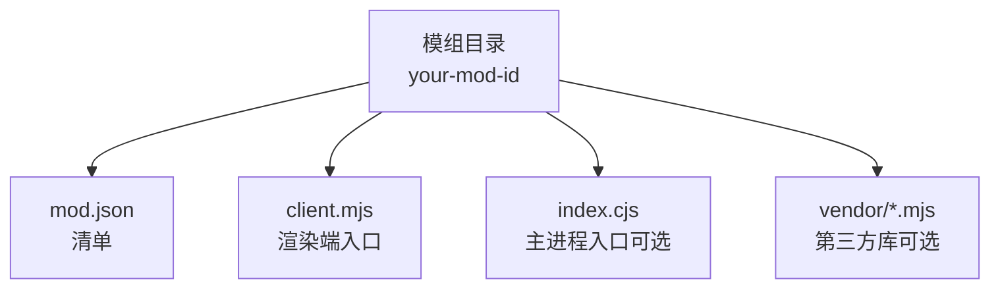
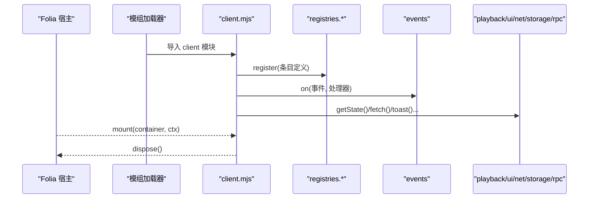
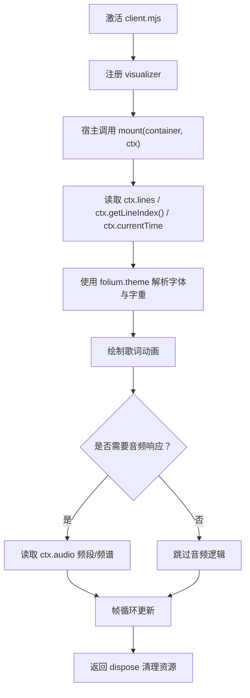
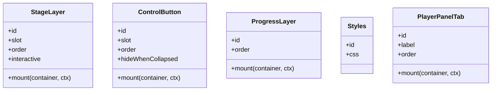
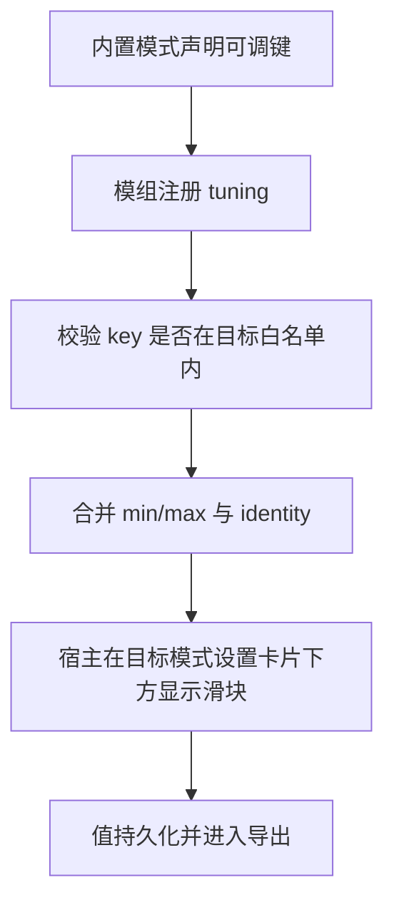
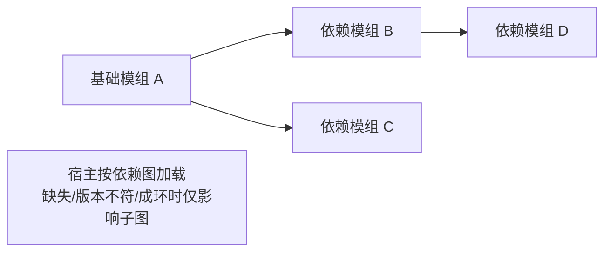

# 模组类型与分类

<cite>
**本文引用的文件**   
- [mods/README.md](file://mods/README.md)
- [docs/folium/api.md](file://docs/folium/api.md)
- [mods/sample-aurora-visualizer/client.mjs](file://mods/sample-aurora-visualizer/client.mjs)
- [mods/sample-aurora-visualizer/mod.json](file://mods/sample-aurora-visualizer/mod.json)
- [mods/k3panel/client.mjs](file://mods/k3panel/client.mjs)
- [mods/k3panel/mod.json](file://mods/k3panel/mod.json)
- [mods/sample-progress-bar/client.mjs](file://mods/sample-progress-bar/client.mjs)
- [mods/sample-progress-bar/mod.json](file://mods/sample-progress-bar/mod.json)
- [mods/visualizer52hz/client.mjs](file://mods/visualizer52hz/client.mjs)
- [mods/visualizer52hz/mod.json](file://mods/visualizer52hz/mod.json)
</cite>

## 目录
1. [引言](#引言)
2. [项目结构](#项目结构)
3. [核心组件](#核心组件)
4. [架构总览](#架构总览)
5. [详细模组类型分析](#详细模组类型分析)
6. [依赖关系分析](#依赖关系分析)
7. [性能与稳定性注意事项](#性能与稳定性注意事项)
8. [故障排查指南](#故障排查指南)
9. [结论](#结论)
10. [附录：mod.json 配置规范](#附录modjson-配置规范)

## 引言
本文面向 Folia Major 的 Folium 模组系统，目标是把“模组类型”讲清楚：歌词动画模组、背景效果模组、UI 扩展模组、命令扩展模组、可视化效果模组等分别是什么、适合做什么、如何开发、需要哪些权限和运行时能力，以及 mod.json 的配置格式。文档同时给出仓库中已有示例模组的对照路径，帮助读者从“概念 → 代码 → 清单”完整理解。

Folium 的核心思想是：模组通过注册表向宿主添加能力，通过事件总线观察或干预宿主行为，通过服务调用宿主的播放、界面、网络等能力；真正需要访问宿主内部时，走明确标注且钉死宿主版本的 internals 通道。

**章节来源**
- [mods/README.md:1-19](file://mods/README.md#L1-L19)

## 项目结构
Folium 模组以目录为单位组织，典型结构如下：
- `your-mod-id/mod.json`：模组清单，声明 id、版本、入口、权限、实验接口等。
- `your-mod-id/client.mjs`：渲染端入口，默认导出 `activate(folium)`。
- `your-mod-id/index.cjs`：主进程入口（Node），可选，用于 Node 侧能力如视频导出。
- 其他 `.mjs/.js`：client 可相对导入的同目录模块；第三方库需放入模组目录并相对引入。

**图示来源**
- [mods/README.md:88-107](file://mods/README.md#L88-L107)

**章节来源**
- [mods/README.md:88-107](file://mods/README.md#L88-L107)

## 核心组件
Folium 模组围绕以下核心概念工作：
- **注册表**：模组通过 `folium.registries.*` 注册歌词动画、背景、图层、按钮、样式、设置分区、命令等条目。
- **上下文容器**：所有 UI 类条目由宿主创建容器并传入上下文，例如 `FoliumStageContext`、`FoliumBackgroundContext`、`FoliumProgressContext`、`FoliumPanelContext`。
- **事件总线**：通过 `folium.events.on` 订阅播放、歌词、主题、视图变化等通知，或使用钩子改写歌词、拦截播放前行为。
- **服务**：`playback`、`ui`、`net`、`storage`、`rpc` 提供播放控制、界面交互、网络请求、本地数据、主进程通信等能力。
- **参数 schema**：设置字段统一用 `FoliumParam` 描述，支持 number/text/boolean/select，带默认值、范围、分组、国际化标签等。

这些概念在 API 参考和规范文档中有完整定义，示例模组则展示了它们在真实代码中的用法。

**章节来源**
- [docs/folium/api.md:11-23](file://docs/folium/api.md#L11-L23)
- [mods/README.md:190-237](file://mods/README.md#L190-L237)

## 架构总览
下图展示一个典型的 Folium 模组如何与宿主交互：

**图示来源**
- [mods/README.md:155-174](file://mods/README.md#L155-L174)
- [mods/README.md:190-215](file://mods/README.md#L190-L215)

**章节来源**
- [mods/README.md:155-174](file://mods/README.md#L155-L174)
- [mods/README.md:190-215](file://mods/README.md#L190-L215)

## 详细模组类型分析

### 一、歌词动画模组（Visualizers）
歌词动画模组是最核心的 Folium 扩展点之一。它向宿主注册一个歌词动画模式，宿主会在播放器页面、预览和透明导出中调用其 `mount` 函数绘制内容。

#### 适用场景
- 自定义歌词显示方式：逐字高亮、颜色渐变、几何扩散、节拍响应等。
- 需要与内置模式保持一致的歌词数据结构、主题解析和字体栈。
- 需要在预览、播放、导出三种环境下都稳定运行。

#### 开发模式
- 在 `client.mjs` 中导出 `activate(folium)`。
- 使用 `folium.registries.visualizers.register({ id, label, order, mount, settings?, settingsPanel?, hostLayers? })` 注册。
- `mount(container, ctx)` 中读取 `ctx.lines`、`ctx.getLineIndex()`、`ctx.currentTime`、`ctx.getTheme()`、`ctx.getDisplay()`、`ctx.audio` 等。
- 返回清理函数，释放定时器、监听器和 DOM。

#### 技术要求
- 遵循 Folium 1.3 的歌词行和主题形状，优先使用 `folium.theme.resolveFontStack`、`folium.theme.resolveFontWeight`。
- 如需音频响应，使用 `ctx.audio`（Folium 1.2+）。
- 若关闭宿主字幕层 `hostLayers.subtitles`，应自行处理字幕相关设置。

#### 示例对照
- 虹光歌词动画样例：纯 client，演示歌词逐字扫光、主题字体、歌词时钟、静态预览。
- 52Hz PixiJS 歌词动画：演示 settings、audio、第三方库打包、ponder 教程。

**图示来源**
- [mods/sample-aurora-visualizer/client.mjs:61-127](file://mods/sample-aurora-visualizer/client.mjs#L61-L127)
- [mods/visualizer52hz/client.mjs:68-83](file://mods/visualizer52hz/client.mjs#L68-L83)

**章节来源**
- [docs/folium/api.md:115-129](file://docs/folium/api.md#L115-L129)
- [mods/README.md:238-274](file://mods/README.md#L238-L274)
- [mods/sample-aurora-visualizer/client.mjs:1-128](file://mods/sample-aurora-visualizer/client.mjs#L1-L128)
- [mods/visualizer52hz/client.mjs:1-84](file://mods/visualizer52hz/client.mjs#L1-L84)

### 二、背景效果模组（Backgrounds）
背景效果模组注册的是“无歌词”的背景类型，它会画在所有歌词动画模式之下，包括预览和导出。

#### 适用场景
- 动态壁纸式背景：渐变、粒子、封面图、音频波形等。
- 不需要歌词时间轴，但需要主题、封面、暂停状态、音频能量。

#### 开发模式
- 使用 `folium.registries.backgrounds.register({ id, label, order, mount, settings?, settingsPanel? })`。
- `mount(container, ctx)` 接收 `FoliumBackgroundContext`，包含 `staticMode`、`isPaused()`、`getTheme()`、`getSettings()`、`getCoverUrl()`、`subscribe()`、`audio`。

#### 技术要求
- 透明表面（OBS、透明导出）下宿主不渲染背景，模组应避免假设背景一定存在。
- 如果需要用户可调参数，使用 `settings` 或 `settingsPanel`。

**章节来源**
- [docs/folium/api.md:170-199](file://docs/folium/api.md#L170-L199)
- [mods/README.md:330-334](file://mods/README.md#L330-L334)

### 三、UI 扩展模组（Stage Layers、Player Panel Tabs、Control Buttons、Progress Layers、Styles）
这类模组不改变歌词动画本身，而是扩展播放器页面和进度条的 UI。

#### 适用场景
- 在播放页叠加额外图层：视频、弹幕、提示、覆盖层。
- 在播放器面板增加标签页。
- 在进度条两侧加按钮，或在轨道上画标记。
- 修改进度条外观，使用公开 part 和 CSS 变量。

#### 开发模式
- `stageLayers`：注册 `FoliumStageLayerDef`，指定 slot（`player.stage.back`、`player.stage.front`、`app.overlay`）。
- `playerPanelTabs`：注册 `FoliumPlayerPanelTabDef`，通过 `folium.ui.openPlayerPanel(id)` 打开。
- `controlButtons`：注册 `FoliumControlButtonDef`，slot 为 `progress.leading` 或 `progress.trailing`。
- `progressLayers`：注册 `FoliumProgressLayerDef`，容器铺满轨道且不拦截指针。
- `styles`：注册 `FoliumStyleDef`，只针对公开 part，如 `[data-folium-part="progress.track"]`。

#### 技术要求
- stage layers 需要 `ui.stage` 权限。
- progress layer 容器默认不拦截点击，需要点击的元素自己设置 `pointer-events: auto`。
- styles 只能选择宿主公开 part，不能依赖宿主内部 class。

#### 示例对照
- 进度条增强样例：右侧书签按钮、进度条样式、外部标记数据图层、设置分区、网络拉取、本地存储。

**图示来源**
- [docs/folium/api.md:201-314](file://docs/folium/api.md#L201-L314)
- [mods/sample-progress-bar/client.mjs:172-253](file://mods/sample-progress-bar/client.mjs#L172-L253)

**章节来源**
- [docs/folium/api.md:201-314](file://docs/folium/api.md#L201-L314)
- [mods/README.md:336-407](file://mods/README.md#L336-L407)
- [mods/sample-progress-bar/client.mjs:1-275](file://mods/sample-progress-bar/client.mjs#L1-L275)

### 四、命令扩展模组（Commands）
命令扩展模组允许用户在模组面板和命令面板中执行操作，适合批量任务、导出、工具类功能。

#### 适用场景
- 触发视频导出。
- 批量处理歌词、封面、元数据。
- 调用主进程 Node 能力（经 rpc）。

#### 开发模式
- 使用 `folium.registries.commands.register({ id, label, description?, keywords?, params?, run(ctx) })`。
- `run` 在渲染端执行；需要 Node 能力时通过 `folium.rpc.call` 调用 main 入口注册的函数。

#### 技术要求
- 返回值会作为结果摘要显示：字符串、`{ outputPath }` 或 `{ message }`。
- 如果命令有参数，命令面板会打开表单。

**章节来源**
- [docs/folium/api.md:144-168](file://docs/folium/api.md#L144-L168)
- [mods/README.md:361-369](file://mods/README.md#L361-L369)

### 五、可视化调参模组（Tunings）
tunings 不是独立视觉模式，而是给已声明可调键的内置歌词动画模式增加更细的控制项。

#### 适用场景
- 为内置模式“商籁”暴露相机幅度、运动强度、视差、转场模糊等倍率。
- 让用户在不写代码的情况下调整内置模式的视觉效果。

#### 开发模式
- 使用 `folium.registries.tunings.register({ id, target, label, params })`。
- `target` 指向内置模式 id，如 `sonnet`。
- `params` 只接受目标声明过的数值键，范围取两者交集。

#### 示例对照
- K3Panel：为 sonnet 注册 11 个深度精调旋钮，全部是 number 类型，默认值为 1。

**图示来源**
- [mods/k3panel/client.mjs:10-43](file://mods/k3panel/client.mjs#L10-L43)
- [mods/README.md:316-328](file://mods/README.md#L316-L328)

**章节来源**
- [docs/folium/api.md:131-142](file://docs/folium/api.md#L131-L142)
- [mods/k3panel/client.mjs:1-44](file://mods/k3panel/client.mjs#L1-L44)
- [mods/README.md:316-328](file://mods/README.md#L316-L328)

### 六、设置分区模组（Settings Sections）
设置分区模组为模组自身提供一组用户可编辑的设置，显示在模组面板展开区域。

#### 适用场景
- 保存 URL、刷新间隔、样式开关、高级选项。
- 让其他上下文（包括导出窗口）能读取这些值。

#### 开发模式
- 使用 `folium.registries.settingsSections.register({ id, label, description?, settings, settingsPanel? })`。
- 返回 handle 后可通过 `handle.params.get()`、`set()`、`reset()`、`subscribe()` 读写值。

#### 示例对照
- 进度条增强样例：注册 feedUrl、refreshSec、styleEnabled 三个设置项。

**章节来源**
- [docs/folium/api.md:227-239](file://docs/folium/api.md#L227-L239)
- [mods/README.md:351-359](file://mods/README.md#L351-L359)
- [mods/sample-progress-bar/client.mjs:75-103](file://mods/sample-progress-bar/client.mjs#L75-L103)

### 七、主进程与导出类模组（main 入口）
当模组需要 Node 能力时，需要声明 `main` 入口，并通过 `api.rpc.handle` 暴露给 client 调用。

#### 适用场景
- 调用视频导出服务。
- 访问文件系统、子进程、原生模块。
- 与 Electron 主进程能力交互。

#### 开发模式
- 在 `index.cjs` 中导出 `activate(api)`。
- 使用 `api.rpc.handle(name, fn)` 注册 RPC 方法。
- 使用 `api.lifecycle.onDeactivate(fn)` 做清理。
- 使用 `api.render.exportVideo(spec)` 导出视频（需 `render.export` 权限）。

**章节来源**
- [mods/README.md:472-500](file://mods/README.md#L472-L500)

## 依赖关系分析
Folium 模组之间的依赖通过 `mod.json` 的 `depends` 字段声明，宿主会检查缺失、版本不符、成环或未启用情况，仅不加载受影响子图。

**图示来源**
- [mods/README.md:139-143](file://mods/README.md#L139-L143)

**章节来源**
- [mods/README.md:139-143](file://mods/README.md#L139-L143)

## 性能与稳定性注意事项
- 单模组加载失败不影响宿主与其他模组；依赖图损坏只波及相关子图。
- 每次加载周期先停用当前模组再重新激活，避免叠加多代定时器与监听器。
- 导出会话全局互斥，取消或失败时会清理 ffmpeg 进程、离屏窗口与半成品文件。
- 同步事件处理器超过 16ms 会记警告；异步处理器也有超时限制。
- client 入口自动回收：禁用、重载或卸载时，宿主先调用 disposer，再撤下注册条目与事件处理器。

**章节来源**
- [mods/README.md:576-581](file://mods/README.md#L576-L581)
- [mods/README.md:166-174](file://mods/README.md#L166-L174)

## 故障排查指南
常见 Folium 模组问题及定位方式：

| 现象 | 可能原因 | 排查建议 |
| --- | --- | --- |
| 模组未加载 | 实验室总开关关闭、模组未确认启用、清单无效 | 打开模组面板查看状态；检查 `mod.json` 是否有效 |
| 权限报错 | 使用了未声明的 API | 在 `mod.json` 中添加对应 `permissions` |
| 导出窗口不可用 | 某些服务在导出窗口不可用 | 区分 `playback/ui/net/storage/rpc` 与 `ui.icon` |
| 歌词动画不更新 | 没有订阅 `currentTime` 或 `subscribe` | 检查 `ctx.currentTime.on('change')` 和 `ctx.subscribe` |
| 样式不生效 | 选择了宿主非公开 part | 只使用公开 part，如 `progress.track`、`progress.fill` |
| 签名不匹配 | 模组文件被改动或版本变更 | 重新签名或恢复原始内容 |
| 第三方库无法 import | client 不能 import 裸模块名 | 将 ESM 构建放入模组目录并相对 import |

**章节来源**
- [mods/README.md:32-48](file://mods/README.md#L32-L48)
- [mods/README.md:101-103](file://mods/README.md#L101-L103)
- [mods/README.md:387-407](file://mods/README.md#L387-L407)
- [mods/README.md:50-83](file://mods/README.md#L50-L83)

## 结论
Folium 模组类型可以按“宿主扩展点”划分：
- 歌词动画模组：最核心的视觉扩展，直接消费歌词、主题、音频。
- 背景效果模组：无歌词的全局背景，适用于壁纸式效果。
- UI 扩展模组：阶段图层、面板标签、进度条按钮与轨道图层、公开样式。
- 命令扩展模组：面向用户的可执行操作，常与 main 入口配合。
- 可视化调参模组：为内置模式暴露更细的控制项。
- 设置分区模组：统一管理模组配置。
- 主进程与导出类模组：需要 Node 能力时使用。

开发者应根据目标选择合适的注册表，并在 `mod.json` 中准确声明权限、入口和实验接口；同时遵循生命周期、错误隔离、公开 part 和稳定性约束。

[本节不直接分析具体文件，因此不附加章节来源]

## 附录：mod.json 配置规范

### 必需字段
- `folium`：必须是 `1`。
- `id`：全局唯一，符合小写字母数字和连字符规则。
- `version`：语义化版本。
- 至少一个入口：`main` 或 `client`。

### 常用可选字段
- `name`、`author`、`description`：显示信息。
- `client`：渲染端入口相对路径。
- `main`：主进程入口文件名。
- `preview`：模组市场预览图路径。
- `depends`：依赖模组 id 或带版本范围的 id。
- `permissions`：权限列表。
- `embedOrigins`：允许嵌入的外部 origin。
- `experimental`：选用的实验接口。
- `folia`：宿主版本范围，使用 internals 时必填。

### 权限对照
- `filesystem.data`：读写模组数据文件。
- `runtime.playback`：主进程获取播放快照。
- `render.export`：主进程导出视频。
- `playback.control`：控制播放、暂停、跳转、切歌、入队、打乱队列、喜爱。
- `net.fetch`：通过主进程发起网络请求。
- `net.embed`：嵌入外部网页。
- `ui.stage`：注册播放页图层。

**章节来源**
- [mods/README.md:109-153](file://mods/README.md#L109-L153)
- [mods/sample-aurora-visualizer/mod.json:1-11](file://mods/sample-aurora-visualizer/mod.json#L1-L11)
- [mods/k3panel/mod.json:1-11](file://mods/k3panel/mod.json#L1-L11)
- [mods/sample-progress-bar/mod.json:1-12](file://mods/sample-progress-bar/mod.json#L1-L12)
- [mods/visualizer52hz/mod.json:1-14](file://mods/visualizer52hz/mod.json#L1-L14)