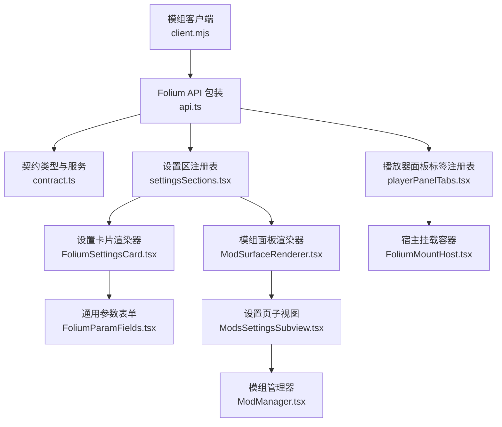
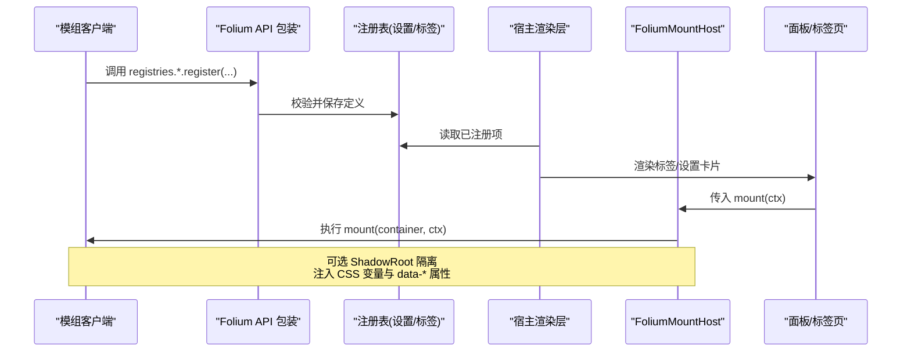
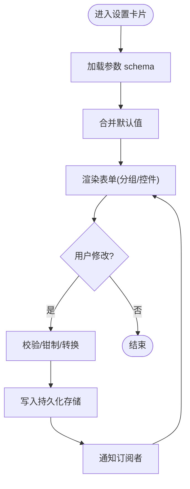
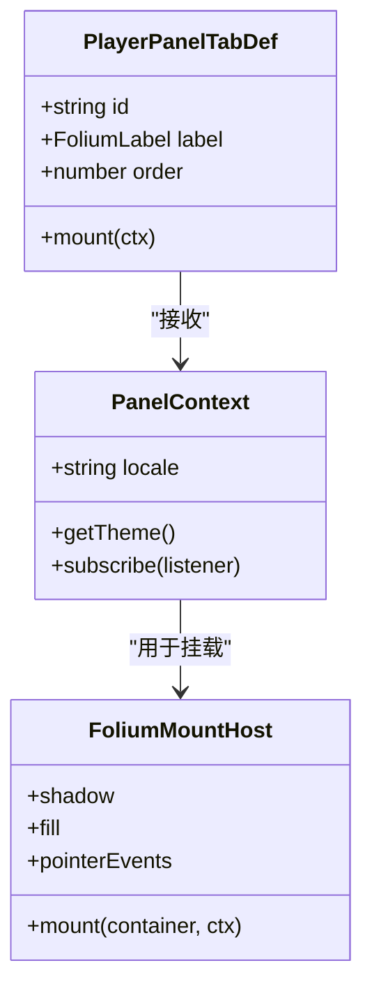
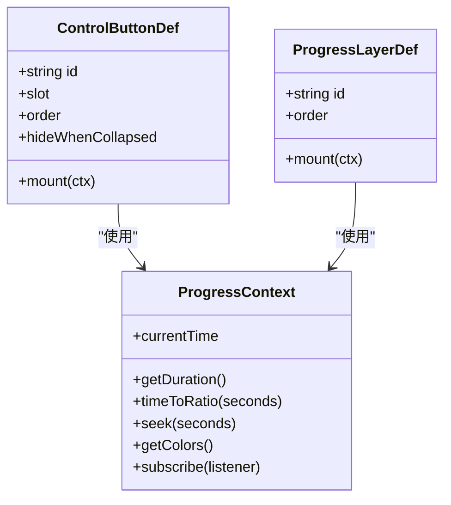
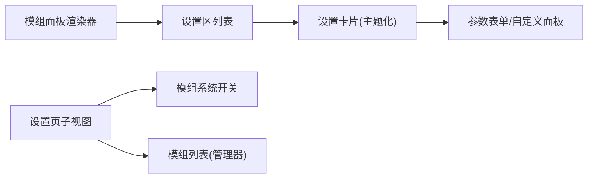
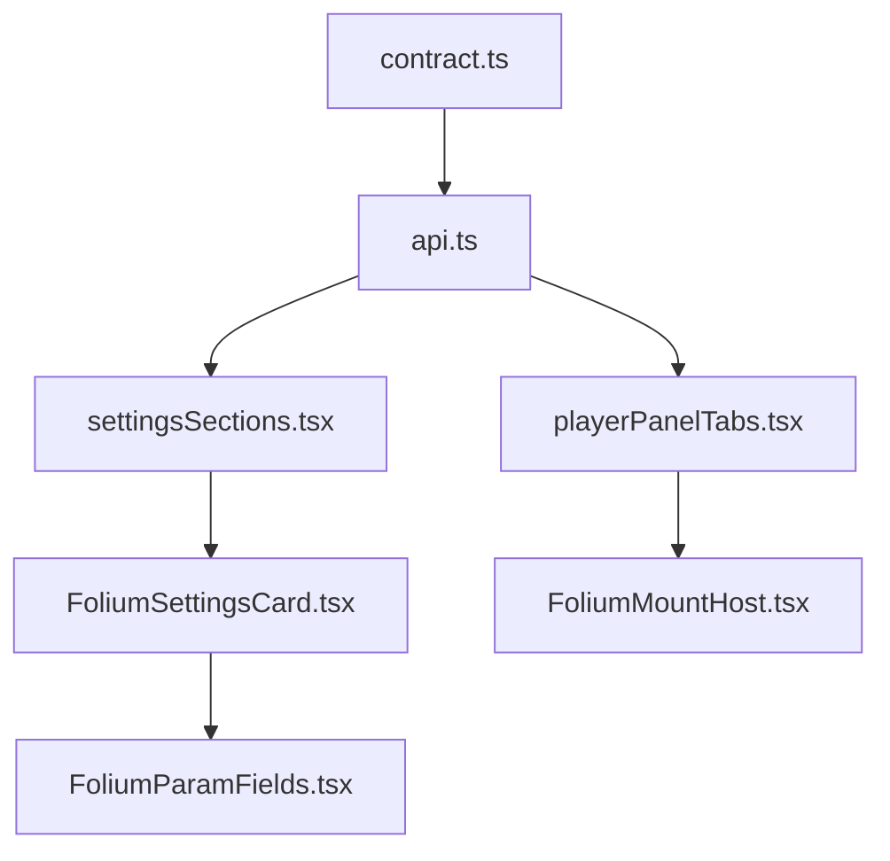

# 用户界面模组

<cite>
**本文引用的文件**   
- [contract.ts](file://src/mods/folium/contract.ts)
- [api.ts](file://src/mods/folium/api.ts)
- [FoliumSettingsCard.tsx](file://src/mods/folium/FoliumSettingsCard.tsx)
- [FoliumParamFields.tsx](file://src/mods/folium/FoliumParamFields.tsx)
- [FoliumMountHost.tsx](file://src/mods/folium/FoliumMountHost.tsx)
- [settingsSections.tsx](file://src/mods/folium/registries/settingsSections.tsx)
- [playerPanelTabs.tsx](file://src/mods/folium/registries/playerPanelTabs.tsx)
- [ModSurfaceRenderer.tsx](file://src/mods/ModSurfaceRenderer.tsx)
- [ModsSettingsSubview.tsx](file://src/components/modal/settings/ModsSettingsSubview.tsx)
- [ModManager.tsx](file://src/mods/manager/ModManager.tsx)
</cite>

## 目录
1. [简介](#简介)
2. [项目结构](#项目结构)
3. [核心组件](#核心组件)
4. [架构总览](#架构总览)
5. [详细组件分析](#详细组件分析)
6. [依赖关系分析](#依赖关系分析)
7. [性能与可维护性](#性能与可维护性)
8. [样式、主题与响应式](#样式主题与响应式)
9. [可访问性与国际化本地化](#可访问性与国际化本地化)
10. [开发指南与最佳实践](#开发指南与最佳实践)
11. [故障排查](#故障排查)
12. [结论](#结论)

## 简介
本指南面向希望在 Folia Major 中开发“用户界面模组”的开发者，覆盖设置面板、播放器标签页、控制按钮等 UI 组件的创建与集成方式。文档基于 Folium 模组契约与宿主提供的注册表机制，说明 React 组件的开发模式、状态管理、事件处理、样式定制、主题适配、响应式设计，以及组件注册、生命周期管理与协作方式，并给出可访问性与国际化/本地化的支持要点。

## 项目结构
围绕用户界面模组的代码主要分布在以下位置：
- 契约与 API：定义模组对外暴露的类型、服务、注册表与挂载约定
- 设置系统：声明式参数表单、自定义设置面板、设置卡片渲染
- 面板与标签：播放器面板标签页的注册与挂载
- 宿主容器：统一的挂载点、ShadowRoot 隔离、属性标记与错误上报
- 模组面板：在设置页与命令面板中展示模组条目、命令与设置区

图示来源
- [api.ts:29-175](file://src/mods/folium/api.ts#L29-L175)
- [contract.ts:245-726](file://src/mods/folium/contract.ts#L245-L726)
- [settingsSections.tsx:1-73](file://src/mods/folium/registries/settingsSections.tsx#L1-L73)
- [playerPanelTabs.tsx:1-93](file://src/mods/folium/registries/playerPanelTabs.tsx#L1-L93)
- [FoliumSettingsCard.tsx:1-181](file://src/mods/folium/FoliumSettingsCard.tsx#L1-L181)
- [FoliumParamFields.tsx:1-199](file://src/mods/folium/FoliumParamFields.tsx#L1-L199)
- [FoliumMountHost.tsx:1-136](file://src/mods/folium/FoliumMountHost.tsx#L1-L136)
- [ModSurfaceRenderer.tsx:1-25](file://src/mods/ModSurfaceRenderer.tsx#L1-L25)
- [ModsSettingsSubview.tsx:1-40](file://src/components/modal/settings/ModsSettingsSubview.tsx#L1-L40)
- [ModManager.tsx:1-27](file://src/mods/manager/ModManager.tsx#L1-L27)

章节来源
- [api.ts:29-175](file://src/mods/folium/api.ts#L29-L175)
- [contract.ts:245-726](file://src/mods/folium/contract.ts#L245-L726)
- [settingsSections.tsx:1-73](file://src/mods/folium/registries/settingsSections.tsx#L1-L73)
- [playerPanelTabs.tsx:1-93](file://src/mods/folium/registries/playerPanelTabs.tsx#L1-L93)
- [FoliumSettingsCard.tsx:1-181](file://src/mods/folium/FoliumSettingsCard.tsx#L1-L181)
- [FoliumParamFields.tsx:1-199](file://src/mods/folium/FoliumParamFields.tsx#L1-L199)
- [FoliumMountHost.tsx:1-136](file://src/mods/folium/FoliumMountHost.tsx#L1-L136)
- [ModSurfaceRenderer.tsx:1-25](file://src/mods/ModSurfaceRenderer.tsx#L1-L25)
- [ModsSettingsSubview.tsx:1-40](file://src/components/modal/settings/ModsSettingsSubview.tsx#L1-L40)
- [ModManager.tsx:1-27](file://src/mods/manager/ModManager.tsx#L1-L27)

## 核心组件
- 契约与服务
  - 统一描述参数 schema、上下文、事件、服务与注册表接口，确保模组与宿主之间的稳定契约。
  - 关键类型包括：参数类型、参数访问器、面板上下文、舞台上下文、进度条上下文、UI 服务、播放服务等。
- 设置系统
  - 通过声明式参数 schema 驱动表单；支持数字滑块、文本输入、布尔开关、选择框，并可分组显示。
  - 支持自定义设置面板（ShadowRoot 隔离），但值仍由 schema 统一管理。
- 面板与标签
  - 播放器面板标签页由模组注册，宿主负责渲染标签栏与内容区域，并在选中时挂载模组内容。
- 宿主容器
  - 提供统一的挂载点，支持 ShadowRoot 隔离、CSS 变量注入、点击穿透、错误上报与清理。

章节来源
- [contract.ts:245-726](file://src/mods/folium/contract.ts#L245-L726)
- [FoliumSettingsCard.tsx:1-181](file://src/mods/folium/FoliumSettingsCard.tsx#L1-L181)
- [FoliumParamFields.tsx:1-199](file://src/mods/folium/FoliumParamFields.tsx#L1-L199)
- [playerPanelTabs.tsx:1-93](file://src/mods/folium/registries/playerPanelTabs.tsx#L1-L93)
- [FoliumMountHost.tsx:1-136](file://src/mods/folium/FoliumMountHost.tsx#L1-L136)

## 架构总览
下图展示了从模组客户端到宿主 UI 的完整调用链：模组通过 Folium API 注册 UI 能力，宿主在相应位置渲染或挂载模组内容，并通过上下文传递主题、语言、播放状态等信息。

图示来源
- [api.ts:29-175](file://src/mods/folium/api.ts#L29-L175)
- [settingsSections.tsx:1-73](file://src/mods/folium/registries/settingsSections.tsx#L1-L73)
- [playerPanelTabs.tsx:1-93](file://src/mods/folium/registries/playerPanelTabs.tsx#L1-L93)
- [FoliumMountHost.tsx:1-136](file://src/mods/folium/FoliumMountHost.tsx#L1-L136)

## 详细组件分析

### 设置面板与参数表单
- 功能要点
  - 使用声明式参数 schema 驱动表单，支持 number/text/boolean/select 四种字段类型。
  - 支持字段分组、步长计算、数值范围钳制、占位符与多语言标签。
  - 支持自定义设置面板（ShadowRoot 隔离），但值读写仍通过统一的参数访问器。
- 数据流
  - 参数 schema 经清洗后生成持久化键空间；默认值合并后作为初始值。
  - 表单变更通过 access.set(patch) 写入，订阅者收到更新后重渲染。
- 交互逻辑
  - 数字字段以滑块呈现，带实时数值显示；布尔字段为切换按钮；文本与选择框为标准控件。
  - 重置按钮将值恢复为默认。

图示来源
- [FoliumSettingsCard.tsx:70-181](file://src/mods/folium/FoliumSettingsCard.tsx#L70-L181)
- [FoliumParamFields.tsx:51-199](file://src/mods/folium/FoliumParamFields.tsx#L51-L199)
- [settingsSections.tsx:22-33](file://src/mods/folium/registries/settingsSections.tsx#L22-L33)

章节来源
- [FoliumSettingsCard.tsx:1-181](file://src/mods/folium/FoliumSettingsCard.tsx#L1-L181)
- [FoliumParamFields.tsx:1-199](file://src/mods/folium/FoliumParamFields.tsx#L1-L199)
- [settingsSections.tsx:1-73](file://src/mods/folium/registries/settingsSections.tsx#L1-L73)

### 播放器面板标签页
- 功能要点
  - 模组通过 playerPanelTabs 注册标签，宿主渲染标签按钮并在选中时挂载模组内容。
  - 标签排序依据 order 与 id，标签标题支持多语言。
- 上下文
  - 面板上下文包含 locale、getTheme()、subscribe(themeChange)。
- 挂载
  - 使用 FoliumMountHost 挂载模组 mount 函数，支持 ShadowRoot 隔离与 CSS 变量注入。

图示来源
- [contract.ts:608-618](file://src/mods/folium/contract.ts#L608-L618)
- [playerPanelTabs.tsx:17-93](file://src/mods/folium/registries/playerPanelTabs.tsx#L17-L93)
- [FoliumMountHost.tsx:50-136](file://src/mods/folium/FoliumMountHost.tsx#L50-L136)

章节来源
- [playerPanelTabs.tsx:1-93](file://src/mods/folium/registries/playerPanelTabs.tsx#L1-L93)
- [contract.ts:608-618](file://src/mods/folium/contract.ts#L608-L618)
- [FoliumMountHost.tsx:1-136](file://src/mods/folium/FoliumMountHost.tsx#L1-L136)

### 控制按钮与进度条图层
- 功能要点
  - 控制按钮与进度条图层共享 FoliumProgressContext，提供时间轴、颜色、seek 能力。
  - 控制按钮可指定插槽位置、顺序、折叠态可见性；进度条图层容器为点击穿透。
- 典型用法
  - 在进度条两侧添加自定义按钮，或在进度轨道上绘制覆盖层。

图示来源
- [contract.ts:620-667](file://src/mods/folium/contract.ts#L620-L667)

章节来源
- [contract.ts:620-667](file://src/mods/folium/contract.ts#L620-L667)

### 模组面板与设置区展示
- 功能要点
  - 模组面板渲染器展示运行问题、设置区与命令卡片。
  - 设置区按模组过滤并按 id 排序，每个设置区渲染为一张主题化卡片。
- 与设置页集成
  - 设置页中的“模组”子视图整合模组系统开关与模组列表，二者共用同一组件树以保证一致性。

图示来源
- [ModSurfaceRenderer.tsx:1-25](file://src/mods/ModSurfaceRenderer.tsx#L1-L25)
- [settingsSections.tsx:35-73](file://src/mods/folium/registries/settingsSections.tsx#L35-L73)
- [ModsSettingsSubview.tsx:15-40](file://src/components/modal/settings/ModsSettingsSubview.tsx#L15-L40)
- [ModManager.tsx:13-27](file://src/mods/manager/ModManager.tsx#L13-L27)

章节来源
- [ModSurfaceRenderer.tsx:1-25](file://src/mods/ModSurfaceRenderer.tsx#L1-L25)
- [settingsSections.tsx:35-73](file://src/mods/folium/registries/settingsSections.tsx#L35-L73)
- [ModsSettingsSubview.tsx:15-40](file://src/components/modal/settings/ModsSettingsSubview.tsx#L15-L40)
- [ModManager.tsx:13-27](file://src/mods/manager/ModManager.tsx#L13-L27)

## 依赖关系分析
- 契约层
  - contract.ts 定义了所有对外暴露的类型与服务，是模组与宿主的唯一契约边界。
- API 包装层
  - api.ts 将宿主内部注册表绑定到模组命名空间，并对 UI 专属注册表进行权限与上下文判断。
- 注册表与渲染层
  - settingsSections.tsx 与 playerPanelTabs.tsx 分别实现设置区与面板标签的注册与渲染。
  - FoliumSettingsCard.tsx 与 FoliumParamFields.tsx 提供统一的设置卡片与表单实现。
- 宿主容器
  - FoliumMountHost.tsx 负责挂载、隔离、属性标记与错误上报。

图示来源
- [contract.ts:245-726](file://src/mods/folium/contract.ts#L245-L726)
- [api.ts:29-175](file://src/mods/folium/api.ts#L29-L175)
- [settingsSections.tsx:1-73](file://src/mods/folium/registries/settingsSections.tsx#L1-L73)
- [playerPanelTabs.tsx:1-93](file://src/mods/folium/registries/playerPanelTabs.tsx#L1-L93)
- [FoliumSettingsCard.tsx:1-181](file://src/mods/folium/FoliumSettingsCard.tsx#L1-L181)
- [FoliumParamFields.tsx:1-199](file://src/mods/folium/FoliumParamFields.tsx#L1-L199)
- [FoliumMountHost.tsx:1-136](file://src/mods/folium/FoliumMountHost.tsx#L1-L136)

章节来源
- [contract.ts:245-726](file://src/mods/folium/contract.ts#L245-L726)
- [api.ts:29-175](file://src/mods/folium/api.ts#L29-L175)
- [settingsSections.tsx:1-73](file://src/mods/folium/registries/settingsSections.tsx#L1-L73)
- [playerPanelTabs.tsx:1-93](file://src/mods/folium/registries/playerPanelTabs.tsx#L1-L93)
- [FoliumSettingsCard.tsx:1-181](file://src/mods/folium/FoliumSettingsCard.tsx#L1-L181)
- [FoliumParamFields.tsx:1-199](file://src/mods/folium/FoliumParamFields.tsx#L1-L199)
- [FoliumMountHost.tsx:1-136](file://src/mods/folium/FoliumMountHost.tsx#L1-L136)

## 性能与可维护性
- 渲染优化
  - 参数 token 与主题相关样式通过 useMemo 缓存，避免每次渲染重建导致的全量重算。
  - 面板上下文与主题订阅采用引用稳定的对象，减少不必要的重挂载。
- 数据一致性
  - 参数 schema 是单一事实源，默认值合并与校验集中处理，保证各入口一致。
- 错误隔离
  - 挂载与销毁过程包裹 try/catch，异常通过报告机制记录，不影响宿主其他模块。
- 扩展性
  - 注册表机制解耦了模组与宿主，新增 UI 能力只需遵循契约即可接入。

章节来源
- [FoliumSettingsCard.tsx:90-127](file://src/mods/folium/FoliumSettingsCard.tsx#L90-L127)
- [playerPanelTabs.tsx:40-61](file://src/mods/folium/registries/playerPanelTabs.tsx#L40-L61)
- [FoliumMountHost.tsx:108-125](file://src/mods/folium/FoliumMountHost.tsx#L108-L125)

## 样式、主题与响应式
- 主题适配
  - 通过 CSS 自定义属性 --folium-bg/--folium-primary/--folium-secondary/--folium-accent 注入主题色。
  - 字体族通过 resolveThemeFontStack 解析，保证歌词与字幕字体一致性。
- 设置卡片样式
  - 卡片背景与边框根据主题色与昼夜模式动态计算，字段输入控件使用 token 注入样式类与内联样式。
- 响应式布局
  - 表单采用网格布局，布尔字段与其他字段行宽不同；分组标题跨列显示。
- 样式定制建议
  - 优先使用 Tailwind 类名与 token 注入，避免直接覆盖宿主 DOM；仅对公开目标选择器进行样式增强。

章节来源
- [FoliumMountHost.tsx:13-23](file://src/mods/folium/FoliumMountHost.tsx#L13-L23)
- [FoliumSettingsCard.tsx:90-127](file://src/mods/folium/FoliumSettingsCard.tsx#L90-L127)
- [FoliumParamFields.tsx:155-199](file://src/mods/folium/FoliumParamFields.tsx#L155-L199)

## 可访问性与国际化本地化
- 国际化
  - 所有用户可见文案使用 FoliumLabel 与 i18n 工具解析，支持多语言回退。
  - 面板上下文提供 locale，供模组侧使用 react-i18next 获取当前语言。
- 可访问性
  - 表单控件使用原生 input/select/button，具备语义化与键盘可达性。
  - 布尔开关提供 on/off 标签，tooltip 通过 title 提供辅助信息。
- 本地化最佳实践
  - 使用 t('...') 获取文案，避免硬编码字符串；label/description/options.label 均使用 FoliumLabel。

章节来源
- [FoliumParamFields.tsx:77-80](file://src/mods/folium/FoliumParamFields.tsx#L77-L80)
- [FoliumParamFields.tsx:163-167](file://src/mods/folium/FoliumParamFields.tsx#L163-L167)
- [playerPanelTabs.tsx:29-38](file://src/mods/folium/registries/playerPanelTabs.tsx#L29-L38)

## 开发指南与最佳实践

### 创建设置面板
- 步骤
  1. 在模组 client.mjs 中通过 folium.registries.settingsSections.register 注册设置区。
  2. 声明 FoliumParam[] 作为 schema，包含 key/type/label/group/defaultValue/min/max/step/placeholder/options。
  3. 如需自定义表单，提供 settingsPanel 挂载函数，并使用 FoliumSettingsPanelContext 中的 params 读写值。
  4. 在模组面板中自动显示设置卡片；无需额外集成。
- 注意事项
  - 至少声明一个有效字段；否则注册失败。
  - 自定义面板仍需遵循 schema 的值结构与校验规则。

章节来源
- [settingsSections.tsx:22-33](file://src/mods/folium/registries/settingsSections.tsx#L22-L33)
- [contract.ts:595-606](file://src/mods/folium/contract.ts#L595-L606)

### 创建播放器标签页
- 步骤
  1. 通过 folium.registries.playerPanelTabs.register 注册标签，提供 id/label/order/mount。
  2. 在 mount 中使用 FoliumPanelContext 获取 locale 与主题，并进行渲染。
  3. 宿主会在面板标签栏显示该标签，并在选中时挂载内容。
- 注意事项
  - mount 必须为函数；否则注册失败。
  - 使用 FoliumMountHost 进行挂载以获得一致的隔离与主题注入。

章节来源
- [playerPanelTabs.tsx:17-24](file://src/mods/folium/registries/playerPanelTabs.tsx#L17-L24)
- [playerPanelTabs.tsx:63-85](file://src/mods/folium/registries/playerPanelTabs.tsx#L63-L85)
- [contract.ts:608-618](file://src/mods/folium/contract.ts#L608-L618)

### 添加控制按钮与进度条图层
- 步骤
  1. 通过 folium.registries.controlButtons.register 注册按钮，指定 slot/order/hideWhenCollapsed/mount。
  2. 通过 folium.registries.progressLayers.register 注册图层，指定 order/mount。
  3. 在 mount 中使用 FoliumProgressContext 获取时间轴、颜色与 seek 能力。
- 注意事项
  - 进度条图层容器为点击穿透，需要交互的元素需显式设置 pointer-events: auto。
  - 控制按钮在折叠胶囊展开时才显示时，设置 hideWhenCollapsed。

章节来源
- [contract.ts:639-667](file://src/mods/folium/contract.ts#L639-L667)

### 组件注册、生命周期与协作
- 注册
  - 所有 UI 能力通过 registries.*.register 注册，返回句柄可用于注销。
- 生命周期
  - 宿主在挂载时调用 mount(container, ctx)，卸载时调用返回的 disposer。
  - 错误在挂载与销毁阶段被捕获并上报，不影响宿主稳定性。
- 协作
  - 通过 events 总线监听播放、主题、视图变化等事件；通过 playback/ui/net/storage/rpc 等服务与宿主交互。

章节来源
- [contract.ts:728-834](file://src/mods/folium/contract.ts#L728-L834)
- [FoliumMountHost.tsx:108-125](file://src/mods/folium/FoliumMountHost.tsx#L108-L125)
- [api.ts:154-175](file://src/mods/folium/api.ts#L154-L175)

### 完整的 UI 模组示例（流程）
- 场景：在设置页中添加一个模组设置区，并在播放器面板增加一个标签页，同时在进度条右侧添加一个控制按钮。
- 流程
  1. 在 client.mjs 中注册 settingsSections、playerPanelTabs、controlButtons。
  2. 设置区使用 FoliumParam[] 声明表单；如需自定义面板则提供 settingsPanel。
  3. 面板标签页 mount 中渲染自定义内容，使用 FoliumPanelContext。
  4. 控制按钮 mount 中读取 FoliumProgressContext 并实现交互（如跳转、音量调节）。
  5. 在模组面板中查看设置区与命令；在播放器面板中打开标签页；在进度条上看到按钮。

章节来源
- [settingsSections.tsx:35-73](file://src/mods/folium/registries/settingsSections.tsx#L35-L73)
- [playerPanelTabs.tsx:28-38](file://src/mods/folium/registries/playerPanelTabs.tsx#L28-L38)
- [contract.ts:620-667](file://src/mods/folium/contract.ts#L620-L667)

## 故障排查
- 常见问题
  - 设置区未显示：检查是否声明至少一个有效字段；settingsPanel 是否为函数。
  - 面板标签不出现：检查 mount 是否为函数；id 是否与打开面板时传入的一致。
  - 按钮/图层无交互：确认容器点击穿透设置；需要交互的元素是否设置了 pointer-events: auto。
  - 主题不生效：确认 FoliumMountHost 是否正确注入 CSS 变量；是否在 ShadowRoot 内正确继承。
- 调试建议
  - 查看模组面板的运行问题与日志。
  - 使用 data-folium-* 属性定位挂载容器，检查属性与层级。
  - 在控制台观察事件与状态变化，必要时添加临时日志。

章节来源
- [settingsSections.tsx:22-33](file://src/mods/folium/registries/settingsSections.tsx#L22-L33)
- [playerPanelTabs.tsx:17-24](file://src/mods/folium/registries/playerPanelTabs.tsx#L17-L24)
- [FoliumMountHost.tsx:108-125](file://src/mods/folium/FoliumMountHost.tsx#L108-L125)

## 结论
通过 Folium 契约与宿主提供的注册表机制，模组可以以声明式的方式扩展设置面板、播放器标签页、控制按钮等 UI 能力。统一的参数 schema、上下文与挂载容器确保了样式、主题、国际化与可访问性的一致性。遵循本文的开发指南与最佳实践，可以快速构建高质量、可维护的用户界面模组，并与宿主及其他 UI 元素良好协作。