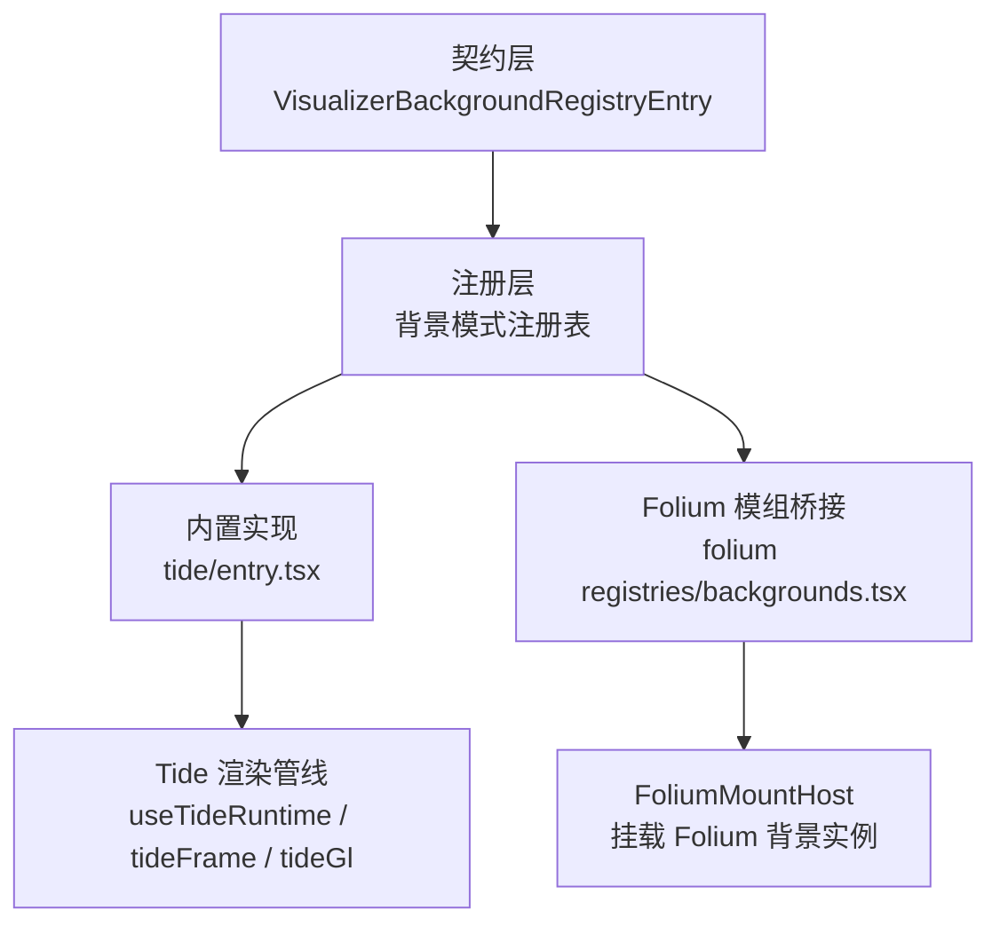
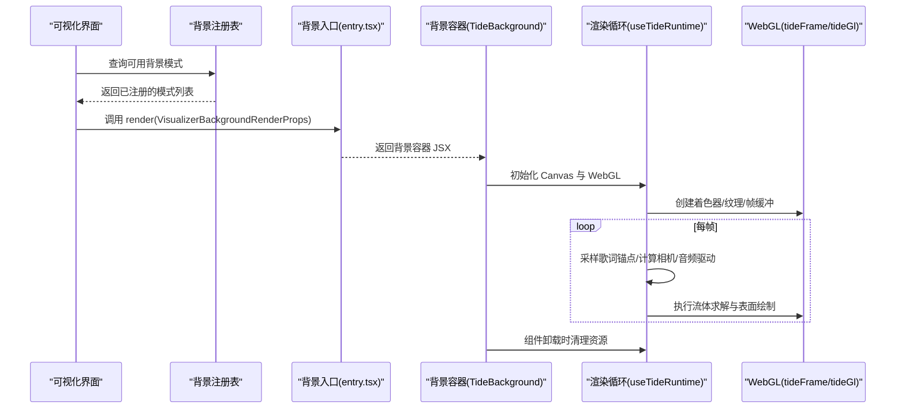
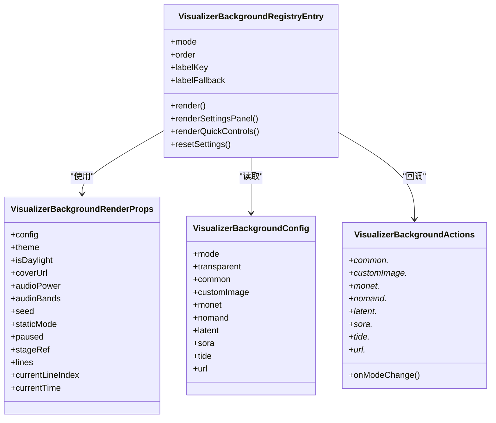
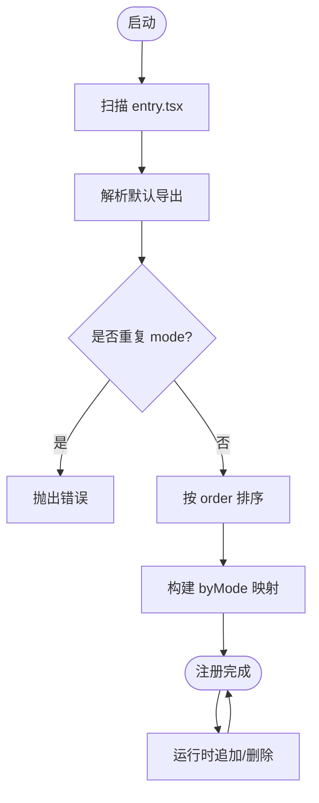
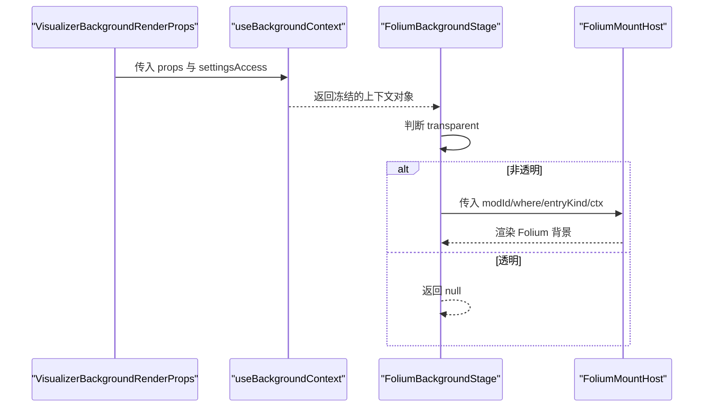
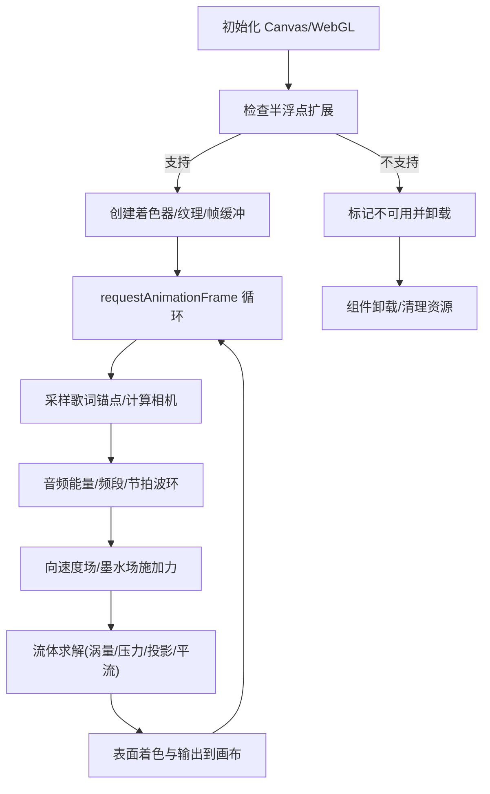
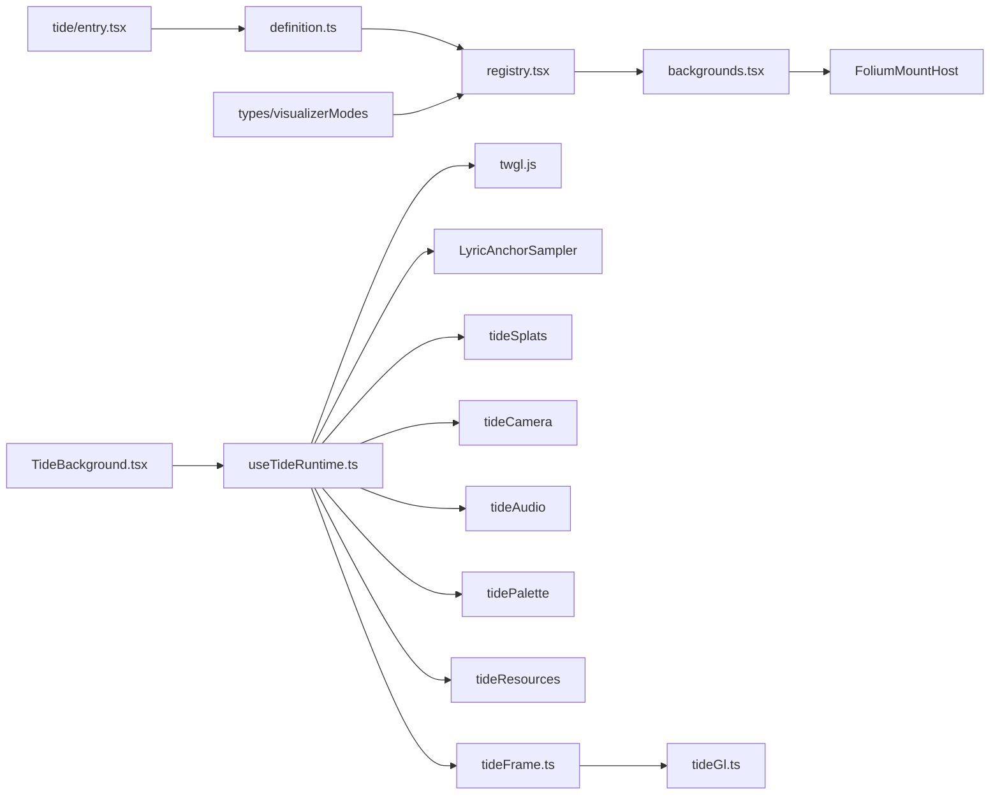

# 背景效果模组

<cite>
**本文引用的文件**   
- [definition.ts](file://src/components/visualizer/backgrounds/definition.ts)
- [registry.tsx](file://src/components/visualizer/backgrounds/registry.tsx)
- [backgrounds.tsx](file://src/mods/folium/registries/backgrounds.tsx)
- [entry.tsx](file://src/components/visualizer/backgrounds/tide/entry.tsx)
- [TideBackground.tsx](file://src/components/visualizer/backgrounds/tide/TideBackground.tsx)
- [useTideRuntime.ts](file://src/components/visualizer/backgrounds/tide/useTideRuntime.ts)
- [tideFrame.ts](file://src/components/visualizer/backgrounds/tide/tideFrame.ts)
- [tideGl.ts](file://src/components/visualizer/backgrounds/tide/tideGl.ts)
- [mod.json](file://dist-mods/tide-background/mod.json)
</cite>

## 目录
1. [引言](#引言)
2. [项目结构](#项目结构)
3. [核心组件](#核心组件)
4. [架构总览](#架构总览)
5. [详细组件分析](#详细组件分析)
6. [依赖关系分析](#依赖关系分析)
7. [性能与优化](#性能与优化)
8. [故障排查指南](#故障排查指南)
9. [结论](#结论)
10. [附录：实现示例清单](#附录实现示例清单)

## 引言
本指南面向希望开发“背景效果模组”的开发者，围绕以下目标展开：
- 说明 BackgroundDefinition（即 VisualizerBackgroundRegistryEntry）接口的职责与字段含义。
- 解释背景渲染的生命周期、上下文数据流以及与主界面的集成方式。
- 梳理背景效果的配置项、动态更新机制与性能考量。
- 提供从简单颜色渐变到复杂 WebGL 流体效果的实现思路与路径指引。
- 说明背景模组的注册流程、样式定制与主题适配方法。
- 给出渲染优化、资源管理与跨平台兼容性的最佳实践。

## 项目结构
背景系统由三层组成：
- 契约层：定义背景模式接口、渲染参数、设置面板与快捷控件等类型。
- 注册层：发现并维护内置背景模式，同时支持运行时扩展（模组）。
- 实现层：具体背景模式的 React 组件与渲染逻辑，例如 Tide 流体背景。

图示来源
- [definition.ts:20-145](file://src/components/visualizer/backgrounds/definition.ts#L20-L145)
- [registry.tsx:11-38](file://src/components/visualizer/backgrounds/registry.tsx#L11-L38)
- [entry.tsx:13-76](file://src/components/visualizer/backgrounds/tide/entry.tsx#L13-L76)
- [backgrounds.tsx:116-174](file://src/mods/folium/registries/backgrounds.tsx#L116-L174)
- [useTideRuntime.ts:49-357](file://src/components/visualizer/backgrounds/tide/useTideRuntime.ts#L49-L357)
- [tideFrame.ts:175-250](file://src/components/visualizer/backgrounds/tide/tideFrame.ts#L175-L250)
- [tideGl.ts:22-93](file://src/components/visualizer/backgrounds/tide/tideGl.ts#L22-L93)

章节来源
- [definition.ts:20-145](file://src/components/visualizer/backgrounds/definition.ts#L20-L145)
- [registry.tsx:11-95](file://src/components/visualizer/backgrounds/registry.tsx#L11-L95)
- [backgrounds.tsx:27-174](file://src/mods/folium/registries/backgrounds.tsx#L27-L174)
- [entry.tsx:13-76](file://src/components/visualizer/backgrounds/tide/entry.tsx#L13-L76)

## 核心组件
- 背景契约
  - VisualizerBackgroundConfig：描述当前背景的配置，包括模式、透明度、通用开关、图片与各类调音对象。
  - VisualizerBackgroundActions：设置面板与快捷控件的回调集合，用于修改配置或重置默认值。
  - VisualizerBackgroundRenderProps：渲染时传入的只读上下文，包含主题、封面、音频能量、歌词行、舞台引用等。
  - VisualizerBackgroundSettingsProps / QuickControlsProps：设置面板与快捷控件的 UI 输入。
  - VisualizerBackgroundRegistryEntry：一个可被注册器发现的背景模式条目，包含 mode、order、labelKey、render、可选的设置面板与快捷控件、以及 resetSettings。
  - defineVisualizerBackground：将模块导出的默认条目包装为注册器可识别的对象。

- 注册器
  - 构建阶段：通过 glob 自动发现每个子目录 entry.tsx 的默认导出，校验重复 mode，按 order 排序。
  - 运行期扩展：appendVisualizerBackgroundEntry/removeVisualizerBackgroundEntry 允许模组在运行时添加或删除自定义背景模式，但不会覆盖内置模式。
  - 辅助 API：hasVisualizerBackgroundMode、getVisualizerBackgroundRegistryEntry、getVisualizerBackgroundModeLabel。

- Folium 背景桥接
  - backgroundsRegistry：将 Folium 定义的 background 转换为 VisualizerBackgroundRegistryEntry，注入到注册表。
  - useBackgroundContext：封装静态模式、主题、封面、暂停状态与设置访问，并提供订阅通知能力。
  - FoliumBackgroundStage：根据透明配置决定是否渲染，并通过 FoliumMountHost 挂载 Folium 背景实例。

章节来源
- [definition.ts:20-145](file://src/components/visualizer/backgrounds/definition.ts#L20-L145)
- [registry.tsx:11-95](file://src/components/visualizer/backgrounds/registry.tsx#L11-L95)
- [backgrounds.tsx:43-174](file://src/mods/folium/registries/backgrounds.tsx#L43-L174)

## 架构总览
背景系统的整体交互如下：
- 注册阶段：内置 entry.tsx 通过 defineVisualizerBackground 暴露模式；注册器收集并按序排列。
- 选择阶段：UI 根据 labelKey 显示本地化名称，并根据 mode 获取对应 render。
- 渲染阶段：React 调用 render(props)，返回绝对定位的背景容器；若启用透明则不绘制。
- 生命周期：背景组件负责创建/销毁 WebGL 上下文、帧循环、资源分配与回收。
- 动态更新：主题、封面、音频、歌词位置变化时，通过 ref 与 MotionValue 读取最新值，避免重启仿真。

图示来源
- [registry.tsx:11-38](file://src/components/visualizer/backgrounds/registry.tsx#L11-L38)
- [entry.tsx:13-76](file://src/components/visualizer/backgrounds/tide/entry.tsx#L13-L76)
- [TideBackground.tsx:25-77](file://src/components/visualizer/backgrounds/tide/TideBackground.tsx#L25-L77)
- [useTideRuntime.ts:49-357](file://src/components/visualizer/backgrounds/tide/useTideRuntime.ts#L49-L357)
- [tideFrame.ts:175-250](file://src/components/visualizer/backgrounds/tide/tideFrame.ts#L175-L250)
- [tideGl.ts:22-93](file://src/components/visualizer/backgrounds/tide/tideGl.ts#L22-L93)

## 详细组件分析

### 背景契约与注册接口
- VisualizerBackgroundConfig
  - 顶层：mode、transparent、common、customImage。
  - 各背景专属 tuning：monet、nomand、latent、sora、tide、url。
- VisualizerBackgroundActions
  - 通用回调：onModeChange、common.*、customImage.*。
  - 各背景专属回调：monet/nomand/latent/sora/tide/url 的 onTuningChange/onResetTuning 或增删改查。
- VisualizerBackgroundRenderProps
  - 只读上下文：config、theme、isDaylight、coverUrl、audioPower/audioBands、seed、staticMode、paused、stageRef、lines、currentLineIndex、currentTime。
- VisualizerBackgroundRegistryEntry
  - 必填：mode、order、labelKey、labelFallback、render。
  - 可选：renderSettingsPanel、renderQuickControls、resetSettings。
- defineVisualizerBackground
  - 将模块默认导出包装为注册器可识别对象。

图示来源
- [definition.ts:20-145](file://src/components/visualizer/backgrounds/definition.ts#L20-L145)

章节来源
- [definition.ts:20-145](file://src/components/visualizer/backgrounds/definition.ts#L20-L145)

### 背景注册与运行时扩展
- 构建期注册
  - 通过 import.meta.glob 扫描 ./*/entry.tsx，解析默认导出。
  - 校验重复 mode，按 order 排序生成 entries 与 byMode。
- 运行期扩展
  - appendVisualizerBackgroundEntry：防止覆盖内置模式，插入后重新排序。
  - removeVisualizerBackgroundEntry：仅移除运行时贡献的类型。
- 标签与默认模式
  - getVisualizerBackgroundModeLabel：优先使用 labelKey 翻译，回退到 labelFallback。
  - DEFAULT_VISUALIZER_BACKGROUND_MODE：当查询不到指定模式时的回退。

图示来源
- [registry.tsx:11-38](file://src/components/visualizer/backgrounds/registry.tsx#L11-L38)
- [registry.tsx:74-95](file://src/components/visualizer/backgrounds/registry.tsx#L74-L95)

章节来源
- [registry.tsx:11-95](file://src/components/visualizer/backgrounds/registry.tsx#L11-L95)

### Folium 背景桥接与上下文
- useBackgroundContext
  - 缓存 theme 与 daylight 变化，避免频繁重建。
  - 提供 isPaused/getTheme/getCoverUrl/getSettings/subscribe 等 getter。
  - 监听 props.paused/theme/isDaylight/coverUrl/settings 变化触发重绘。
- FoliumBackgroundStage
  - 若 config.transparent 为真，直接返回 null，不遮挡主界面。
  - 通过 FoliumMountHost 以 absolute inset-0 的方式挂载背景。
- backgroundsRegistry
  - 校验 def.mount 必须为函数，settingsPanel 需要 settings schema。
  - 将 Folium background 转换为 VisualizerBackgroundRegistryEntry，并注入注册表。

图示来源
- [backgrounds.tsx:43-114](file://src/mods/folium/registries/backgrounds.tsx#L43-L114)
- [backgrounds.tsx:150-174](file://src/mods/folium/registries/backgrounds.tsx#L150-L174)

章节来源
- [backgrounds.tsx:43-174](file://src/mods/folium/registries/backgrounds.tsx#L43-L174)

### Tide 背景实现示例
Tide 是一个基于 WebGL 的流体背景，展示如何从 React 组件进入高性能渲染管线。

- 入口与 UI
  - entry.tsx：定义 mode、order、labelKey、labelFallback，提供 render/renderSettingsPanel/renderQuickControls/resetSettings。
  - TideBackground.tsx：负责 canvas 挂载与不可用降级。
- 渲染生命周期
  - useTideRuntime.ts：管理 WebGL 上下文、半浮点扩展检测、Canvas 尺寸自适应、RAF 循环、歌词锚点采样、相机跟随、音频驱动、流体步进与表面绘制。
  - tideFrame.ts：流体求解步骤（curl/vorticity/divergence/pressure/project/advect）与最终 surface pass。
  - tideGl.ts：twgl 程序创建、全屏三角形绘制、帧缓冲目标与纹理解包。

图示来源
- [entry.tsx:13-76](file://src/components/visualizer/backgrounds/tide/entry.tsx#L13-L76)
- [TideBackground.tsx:25-77](file://src/components/visualizer/backgrounds/tide/TideBackground.tsx#L25-L77)
- [useTideRuntime.ts:49-357](file://src/components/visualizer/backgrounds/tide/useTideRuntime.ts#L49-L357)
- [tideFrame.ts:175-250](file://src/components/visualizer/backgrounds/tide/tideFrame.ts#L175-L250)
- [tideGl.ts:22-93](file://src/components/visualizer/backgrounds/tide/tideGl.ts#L22-L93)

章节来源
- [entry.tsx:13-76](file://src/components/visualizer/backgrounds/tide/entry.tsx#L13-L76)
- [TideBackground.tsx:25-77](file://src/components/visualizer/backgrounds/tide/TideBackground.tsx#L25-L77)
- [useTideRuntime.ts:49-357](file://src/components/visualizer/backgrounds/tide/useTideRuntime.ts#L49-L357)
- [tideFrame.ts:175-250](file://src/components/visualizer/backgrounds/tide/tideFrame.ts#L175-L250)
- [tideGl.ts:22-93](file://src/components/visualizer/backgrounds/tide/tideGl.ts#L22-L93)

## 依赖关系分析
- 契约与注册
  - registry.tsx 依赖 definition.ts 的类型与工厂函数。
  - registry.tsx 依赖 types/visualizerModes 的内置模式常量与断言。
- Folium 桥接
  - backgrounds.tsx 依赖 registry.tsx 的 append/remove API。
  - backgrounds.tsx 依赖 FoliumMountHost/FoliumSettingsCard 进行挂载与设置面板渲染。
- Tide 实现
  - entry.tsx 依赖 definition.ts 的 defineVisualizerBackground。
  - TideBackground.tsx 依赖 useTideRuntime.ts。
  - useTideRuntime.ts 依赖 twgl.js、LyricAnchorSampler、tideSplats、tideCamera、tideAudio、tidePalette、tideResources、tideFrame。
  - tideFrame.ts 依赖 tideGl.ts 与 tideResources.ts。

图示来源
- [registry.tsx:1-6](file://src/components/visualizer/backgrounds/registry.tsx#L1-L6)
- [backgrounds.tsx:1-18](file://src/mods/folium/registries/backgrounds.tsx#L1-L18)
- [entry.tsx:1-7](file://src/components/visualizer/backgrounds/tide/entry.tsx#L1-L7)
- [useTideRuntime.ts:1-11](file://src/components/visualizer/backgrounds/tide/useTideRuntime.ts#L1-L11)
- [tideFrame.ts:1-5](file://src/components/visualizer/backgrounds/tide/tideFrame.ts#L1-L5)
- [tideGl.ts:1-3](file://src/components/visualizer/backgrounds/tide/tideGl.ts#L1-L3)

章节来源
- [registry.tsx:1-95](file://src/components/visualizer/backgrounds/registry.tsx#L1-L95)
- [backgrounds.tsx:1-174](file://src/mods/folium/registries/backgrounds.tsx#L1-L174)
- [entry.tsx:1-77](file://src/components/visualizer/backgrounds/tide/entry.tsx#L1-L77)
- [useTideRuntime.ts:1-358](file://src/components/visualizer/backgrounds/tide/useTideRuntime.ts#L1-L358)
- [tideFrame.ts:1-251](file://src/components/visualizer/backgrounds/tide/tideFrame.ts#L1-L251)
- [tideGl.ts:1-93](file://src/components/visualizer/backgrounds/tide/tideGl.ts#L1-L93)

## 性能与优化
- WebGL 上下文与特性检测
  - 检测 EXT_color_buffer_float/EXT_color_buffer_half_float，不支持则降级卸载。
  - 处理 webglcontextlost/webglcontextrestored，恢复后重建资源并标记流体需重置。
- 帧率与时间步长
  - 限制最大帧间隔（MAX_FRAME_SECONDS），避免大跳帧导致数值爆炸。
  - 静态模式下只绘制一帧，关闭 RAF 循环，降低功耗。
- 资源复用与尺寸自适应
  - 使用 twgl.resizeCanvasToDisplaySize 与 DPR 自适应，避免过度像素填充。
  - 帧缓冲/纹理在 resize 时按需重建，减少内存抖动。
- 歌词采样节流
  - 默认每 180ms 采样一次 DOM，可通过 tuning.sampleSeconds 调整范围。
  - 使用 glide 平滑锚点过渡，避免频繁测量导致的抖动。
- 流体求解控制
  - 静置一段时间后停止流体步进，必要时清空场，避免残留涡影响视觉。
  - 根据响度动态调节耗散，安静时短拖尾，大声时长拖尾，提升观感与性能平衡。
- 着色器与纹理传递
  - 对帧缓冲目标进行纹理解包，确保 sampler 正确绑定，避免黑屏。
  - 统一 drawTidePass 封装，减少重复代码与状态切换开销。

章节来源
- [useTideRuntime.ts:65-144](file://src/components/visualizer/backgrounds/tide/useTideRuntime.ts#L65-L144)
- [useTideRuntime.ts:146-357](file://src/components/visualizer/backgrounds/tide/useTideRuntime.ts#L146-L357)
- [tideFrame.ts:175-250](file://src/components/visualizer/backgrounds/tide/tideFrame.ts#L175-L250)
- [tideGl.ts:22-93](file://src/components/visualizer/backgrounds/tide/tideGl.ts#L22-L93)

## 故障排查指南
- 无法创建 WebGL 上下文
  - 现象：背景不可用，组件卸载。
  - 原因：设备或浏览器不支持 WebGL。
  - 处理：记录日志并提示用户降级。
- 不支持半浮点渲染目标
  - 现象：流体背景跳过。
  - 原因：缺少 EXT_color_buffer_float/half_float 扩展。
  - 处理：提示环境限制，考虑简化效果或改用 CPU 方案。
- 着色器编译失败
  - 现象：流体资源创建失败，背景不可用。
  - 原因：语法错误或平台不支持某些 GLSL 特性。
  - 处理：检查着色器版本与语法，提供回退渲染。
- WebGL 上下文丢失
  - 现象：画面冻结，控制台警告。
  - 原因：GPU 驱动问题或系统切换。
  - 处理：监听 contextlost/contextrestored，恢复后重建资源并重置流体。
- 透明背景未渲染
  - 现象：背景不显示。
  - 原因：config.transparent 为真。
  - 处理：确认是否需要透明背景；若不需要，关闭该选项。

章节来源
- [useTideRuntime.ts:65-144](file://src/components/visualizer/backgrounds/tide/useTideRuntime.ts#L65-L144)
- [backgrounds.tsx:101-113](file://src/mods/folium/registries/backgrounds.tsx#L101-L113)

## 结论
背景效果模组通过清晰的契约与注册机制，实现了从简单到复杂的多种背景渲染方案。Tide 示例展示了如何将 React 组件与 WebGL 流体求解高效结合，并在主题、音频与歌词联动下提供沉浸式体验。开发者可遵循本文档的接口规范、生命周期与性能建议，快速实现新的背景模式，并通过 Folium 桥接无缝集成到主界面。

## 附录：实现示例清单
- 简单颜色渐变
  - 思路：在 render 中返回一个绝对定位的 div，使用 CSS 渐变或动画改变背景色。
  - 要点：遵守 VisualizerBackgroundRegistryEntry 接口；如需设置面板，实现 renderSettingsPanel 与 actions.onTuningChange。
- 图片轮播
  - 思路：使用 url.items 与 selectedId 控制图片源；在 render 中渲染 img 或 video。
  - 要点：处理加载状态与错误降级；支持快速切换与淡入淡出。
- WebGL 粒子/几何
  - 思路：参考 Tide 的 useTideRuntime 生命周期，创建 WebGL 上下文与着色器，使用帧缓冲与 draw 循环。
  - 要点：DPR 自适应、上下文丢失恢复、资源释放；使用 twgl 简化 buffer/uniform/bind 操作。
- Folium 模组背景
  - 思路：通过 backgroundsRegistry.register 定义 mount 与 settings，自动生成 mode 并注入注册表。
  - 要点：校验 mount 为函数；settingsPanel 需要 settings schema；label 支持多语言。

章节来源
- [definition.ts:20-145](file://src/components/visualizer/backgrounds/definition.ts#L20-L145)
- [registry.tsx:11-95](file://src/components/visualizer/backgrounds/registry.tsx#L11-L95)
- [backgrounds.tsx:150-174](file://src/mods/folium/registries/backgrounds.tsx#L150-L174)
- [mod.json:1-10](file://dist-mods/tide-background/mod.json#L1-L10)