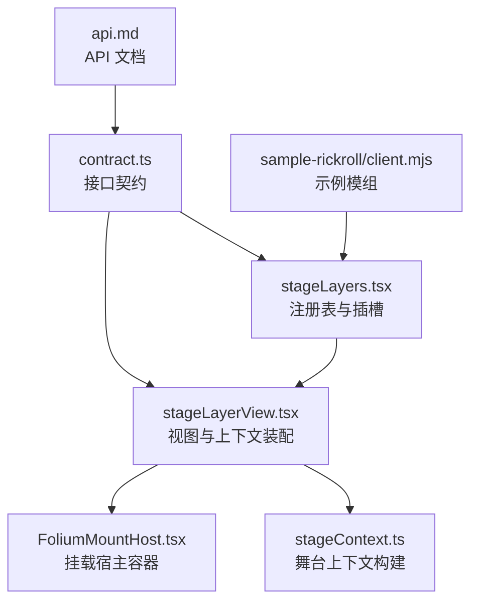
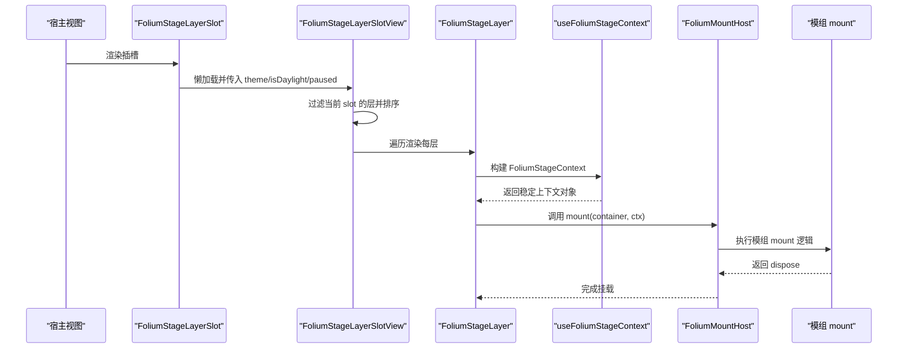
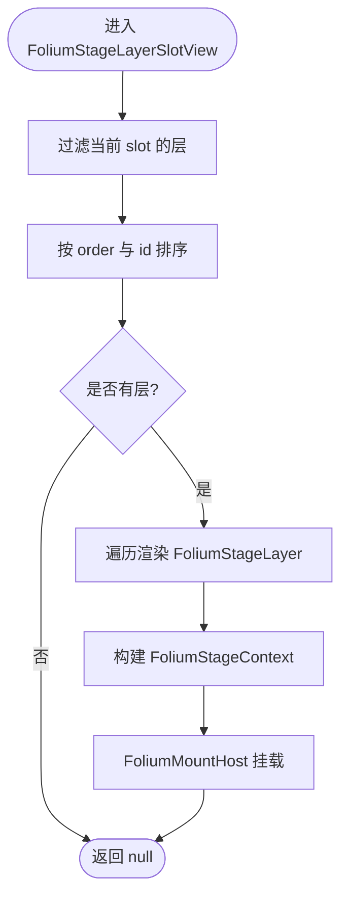
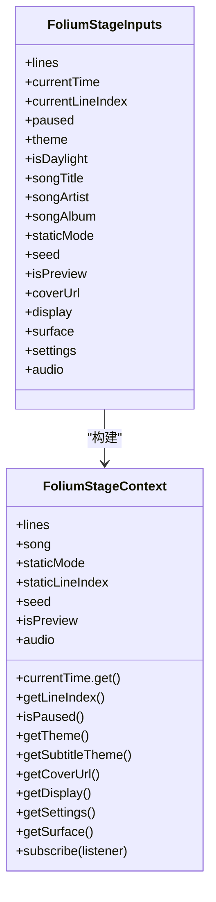
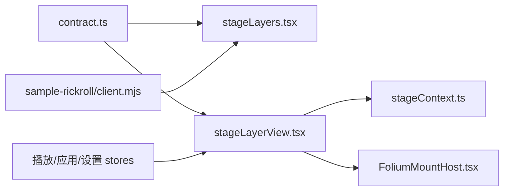
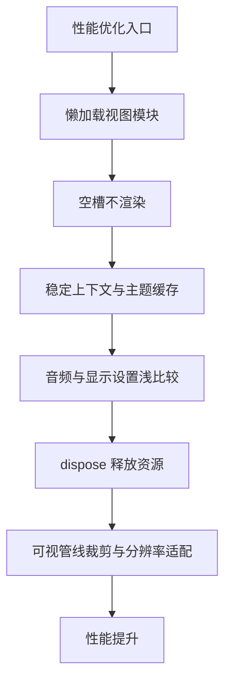
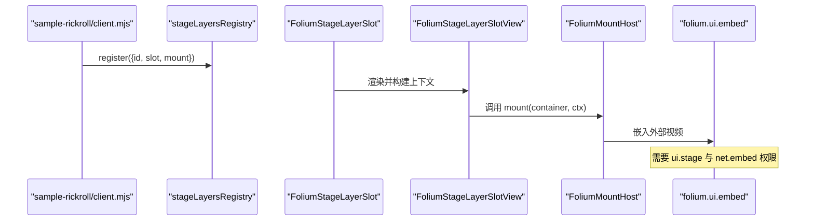

# 舞台层模组

<cite>
**本文引用的文件**   
- [src/mods/folium/registries/stageLayers.tsx](file://src/mods/folium/registries/stageLayers.tsx)
- [src/mods/folium/registries/stageLayerView.tsx](file://src/mods/folium/registries/stageLayerView.tsx)
- [src/mods/folium/stageContext.ts](file://src/mods/folium/stageContext.ts)
- [src/mods/folium/FoliumMountHost.tsx](file://src/mods/folium/FoliumMountHost.tsx)
- [src/mods/folium/contract.ts](file://src/mods/folium/contract.ts)
- [docs/folium/api.md](file://docs/folium/api.md)
- [mods/sample-rickroll/client.mjs](file://mods/sample-rickroll/client.mjs)
- [mods/sample-rickroll/mod.json](file://mods/sample-rickroll/mod.json)
- [src/components/visualizer/fume/fumeLiveRaster.ts](file://src/components/visualizer/fume/fumeLiveRaster.ts)
- [src/components/visualizer/tempera/createTemperaPixiRuntime.ts](file://src/components/visualizer/tempera/createTemperaPixiRuntime.ts)
</cite>

## 目录
1. [简介](#简介)
2. [项目结构](#项目结构)
3. [核心组件](#核心组件)
4. [架构总览](#架构总览)
5. [详细组件分析](#详细组件分析)
6. [依赖关系分析](#依赖关系分析)
7. [性能与内存优化](#性能与内存优化)
8. [多显示器支持](#多显示器支持)
9. [调试、监控与故障排除](#调试监控与故障排除)
10. [完整示例：叠加效果、过渡动画与交互响应](#完整示例叠加效果过渡动画与交互响应)
11. [结论](#结论)

## 简介
本指南面向开发“舞台层模组”的开发者，系统说明如何在播放页上注册并渲染自定义图层。内容涵盖：
- FoliumStageLayerDef 接口的实现要点
- 图层渲染流程、层级管理与排序规则
- 舞台层的生命周期、渲染顺序以及与主界面的同步机制
- 坐标系统、变换矩阵与裁剪区域的处理思路
- 完整的示例（叠加视频窗口、命令开关、权限与嵌入）
- 性能优化、内存管理、多显示器支持与调试排错方法

## 项目结构
舞台层相关代码集中在 Folium 模组子系统内，关键路径如下：
- 注册表与插槽：src/mods/folium/registries/stageLayers.tsx
- 视图与上下文装配：src/mods/folium/registries/stageLayerView.tsx
- 舞台上下文构建：src/mods/folium/stageContext.ts
- 挂载宿主容器：src/mods/folium/FoliumMountHost.tsx
- 接口契约定义：src/mods/folium/contract.ts
- API 文档：docs/folium/api.md
- 示例模组：mods/sample-rickroll/client.mjs, mods/sample-rickroll/mod.json



**图表来源** 
- [src/mods/folium/registries/stageLayers.tsx:1-55](file://src/mods/folium/registries/stageLayers.tsx#L1-L55)
- [src/mods/folium/registries/stageLayerView.tsx:1-143](file://src/mods/folium/registries/stageLayerView.tsx#L1-L143)
- [src/mods/folium/stageContext.ts:1-164](file://src/mods/folium/stageContext.ts#L1-L164)
- [src/mods/folium/FoliumMountHost.tsx:1-113](file://src/mods/folium/FoliumMountHost.tsx#L1-L113)
- [src/mods/folium/contract.ts:560-759](file://src/mods/folium/contract.ts#L560-L759)
- [docs/folium/api.md:201-238](file://docs/folium/api.md#L201-L238)
- [mods/sample-rickroll/client.mjs:1-70](file://mods/sample-rickroll/client.mjs#L1-L70)

**章节来源**
- [src/mods/folium/registries/stageLayers.tsx:1-55](file://src/mods/folium/registries/stageLayers.tsx#L1-L55)
- [src/mods/folium/registries/stageLayerView.tsx:1-143](file://src/mods/folium/registries/stageLayerView.tsx#L1-L143)
- [src/mods/folium/stageContext.ts:1-164](file://src/mods/folium/stageContext.ts#L1-L164)
- [src/mods/folium/FoliumMountHost.tsx:1-113](file://src/mods/folium/FoliumMountHost.tsx#L1-L113)
- [src/mods/folium/contract.ts:560-759](file://src/mods/folium/contract.ts#L560-L759)
- [docs/folium/api.md:201-238](file://docs/folium/api.md#L201-L238)
- [mods/sample-rickroll/client.mjs:1-70](file://mods/sample-rickroll/client.mjs#L1-L70)

## 核心组件
- 注册表与插槽
  - stageLayersRegistry：校验 slot 与 mount，提供 register/unregister 能力
  - FoliumStageLayerSlot：按 slot 渲染，无模组时不产生任何 DOM 或加载开销
- 视图与上下文装配
  - FoliumStageLayer：为每个模组实例构建 FoliumStageContext，并通过 FoliumMountHost 挂载
  - FoliumStageLayerSlotView：过滤、排序并按序渲染各层
- 舞台上下文
  - useFoliumStageContext：将歌词、歌曲信息、时间轴、主题、显示设置、音频信号等封装为稳定可订阅的上下文
- 挂载宿主
  - FoliumMountHost：创建宿主元素、可选 ShadowRoot、注入 CSS 变量、执行 mount 与 dispose、错误上报

**章节来源**
- [src/mods/folium/registries/stageLayers.tsx:19-54](file://src/mods/folium/registries/stageLayers.tsx#L19-L54)
- [src/mods/folium/registries/stageLayerView.tsx:29-142](file://src/mods/folium/registries/stageLayerView.tsx#L29-L142)
- [src/mods/folium/stageContext.ts:19-164](file://src/mods/folium/stageContext.ts#L19-L164)
- [src/mods/folium/FoliumMountHost.tsx:1-113](file://src/mods/folium/FoliumMountHost.tsx#L1-L113)

## 架构总览
舞台层在播放页上的渲染与同步流程如下：



**图表来源** 
- [src/mods/folium/registries/stageLayers.tsx:35-54](file://src/mods/folium/registries/stageLayers.tsx#L35-L54)
- [src/mods/folium/registries/stageLayerView.tsx:119-142](file://src/mods/folium/registries/stageLayerView.tsx#L119-L142)
- [src/mods/folium/stageContext.ts:88-164](file://src/mods/folium/stageContext.ts#L88-L164)
- [src/mods/folium/FoliumMountHost.tsx:91-113](file://src/mods/folium/FoliumMountHost.tsx#L91-L113)

## 详细组件分析

### FoliumStageLayerDef 与 FoliumStageSlot
- FoliumStageSlot：定义三层位置
  - player.stage.back：背景之上、歌词之下
  - player.stage.front：歌词之上、播放器 chrome 之下
  - app.overlay：整个应用之上
- FoliumStageLayerDef：
  - id：本地标识
  - slot：选择上述三个槽位之一
  - order：同槽内堆叠顺序，默认 500
  - interactive：是否接管指针事件；默认穿透，避免阻挡播放器交互
  - mount：绘制函数，接收宿主容器与 FoliumStageContext

```mermaid
classDiagram
class FoliumStageSlot {
<<enum>>
"player.stage.back"
"player.stage.front"
"app.overlay"
}
class FoliumStageLayerDef {
+string id
+slot : FoliumStageSlot
+number order?
+boolean interactive?
+mount(container, ctx)
}
FoliumStageLayerDef --> FoliumStageSlot : "使用"
```

**图表来源** 
- [src/mods/folium/contract.ts:562-589](file://src/mods/folium/contract.ts#L562-L589)
- [docs/folium/api.md:201-238](file://docs/folium/api.md#L201-L238)

**章节来源**
- [src/mods/folium/contract.ts:562-589](file://src/mods/folium/contract.ts#L562-L589)
- [docs/folium/api.md:201-238](file://docs/folium/api.md#L201-L238)

### 注册表与插槽（stageLayers.tsx）
- 校验规则：slot 必须属于允许集合；mount 必须是函数
- 懒加载：仅当存在对应 slot 的层时才加载视图模块，避免污染预览/OBS/导出窗口
- 空槽优化：没有层时不渲染任何 DOM，保持宿主树与包体积不变

**章节来源**
- [src/mods/folium/registries/stageLayers.tsx:19-54](file://src/mods/folium/registries/stageLayers.tsx#L19-L54)

### 视图与上下文装配（stageLayerView.tsx）
- 排序规则：按 order 升序，相同 order 按 id 字典序
- 显示设置：从应用 store 读取字体缩放、字幕透明度、面板状态、chrome 隐藏状态、可视化透明度等
- 上下文构建：将歌词、歌曲元数据、时间轴、主题、封面、显示设置、音频信号等组合为 FoliumStageContext
- 指针事件：根据 interactive 决定整层是否捕获指针



**图表来源** 
- [src/mods/folium/registries/stageLayerView.tsx:29-142](file://src/mods/folium/registries/stageLayerView.tsx#L29-L142)

**章节来源**
- [src/mods/folium/registries/stageLayerView.tsx:29-142](file://src/mods/folium/registries/stageLayerView.tsx#L29-L142)

### 舞台上下文（stageContext.ts）
- 输入项：歌词行、时间轴 MotionValue、当前行索引、暂停状态、主题、昼夜模式、歌曲元数据、种子、预览标志、封面 URL、显示设置、表面属性、设置访问器、音频源
- 稳定性策略：
  - 快照值（歌词、歌曲、staticMode、静态预览行、seed、isPreview）变化会触发重新挂载
  - 运行时值（行索引、暂停、主题、封面、显示设置、surface、settings）通过 getter 与 subscribe 通知更新，避免频繁重挂载
- 主题缓存：按 (theme, isDaylight) 缓存投影结果，减少每帧分配
- 音频桥接：createFoliumAudio 包装音频源，缺省为空静音



**图表来源** 
- [src/mods/folium/stageContext.ts:19-164](file://src/mods/folium/stageContext.ts#L19-L164)

**章节来源**
- [src/mods/folium/stageContext.ts:19-164](file://src/mods/folium/stageContext.ts#L19-L164)

### 挂载宿主（FoliumMountHost.tsx）
- 容器创建：可选择 ShadowRoot 隔离样式，注入 CSS 变量 --folium-*
- 指针事件：根据参数设置 pointer-events
- 生命周期：执行 mount(container, ctx)，捕获异常并上报；返回 dispose 并在卸载时清理
- 错误处理：mount 抛错时清空容器并记录问题到模组状态

**章节来源**
- [src/mods/folium/FoliumMountHost.tsx:1-113](file://src/mods/folium/FoliumMountHost.tsx#L1-L113)

## 依赖关系分析
- 注册表依赖契约类型，用于校验与类型约束
- 视图依赖播放状态、应用视图、chrome 状态、设置等 store，以构建 FoliumDisplay
- 上下文依赖主题、歌词、音频信号等，提供稳定的只读 API 与变更订阅
- 示例模组依赖 ui.stage 与 net.embed 权限，并使用 folium.ui.embed 嵌入外部页面



**图表来源** 
- [src/mods/folium/contract.ts:560-759](file://src/mods/folium/contract.ts#L560-L759)
- [src/mods/folium/registries/stageLayers.tsx:1-55](file://src/mods/folium/registries/stageLayers.tsx#L1-L55)
- [src/mods/folium/registries/stageLayerView.tsx:1-143](file://src/mods/folium/registries/stageLayerView.tsx#L1-L143)
- [src/mods/folium/stageContext.ts:1-164](file://src/mods/folium/stageContext.ts#L1-L164)
- [src/mods/folium/FoliumMountHost.tsx:1-113](file://src/mods/folium/FoliumMountHost.tsx#L1-L113)
- [mods/sample-rickroll/client.mjs:1-70](file://mods/sample-rickroll/client.mjs#L1-L70)

**章节来源**
- [src/mods/folium/registries/stageLayers.tsx:1-55](file://src/mods/folium/registries/stageLayers.tsx#L1-L55)
- [src/mods/folium/registries/stageLayerView.tsx:1-143](file://src/mods/folium/registries/stageLayerView.tsx#L1-L143)
- [src/mods/folium/stageContext.ts:1-164](file://src/mods/folium/stageContext.ts#L1-L164)
- [src/mods/folium/FoliumMountHost.tsx:1-113](file://src/mods/folium/FoliumMountHost.tsx#L1-L113)
- [mods/sample-rickroll/client.mjs:1-70](file://mods/sample-rickroll/client.mjs#L1-L70)

## 性能与内存优化
- 懒加载与空槽优化
  - 仅在存在层时加载视图模块，避免预览/OBS/导出窗口的不必要依赖
  - 无层时不渲染任何 DOM，降低渲染压力
- 上下文稳定性
  - 使用 useMemo 与引用比较，避免每帧重建对象
  - 主题投影缓存，减少重复计算
- 音频与显示设置
  - 使用 shallow 订阅与冻结对象，减少重渲染
- 资源释放
  - 通过 dispose 回调确保 iframe、Canvas、纹理等资源在卸载时释放
- 视觉管线参考
  - 视口可见性裁剪与设备像素比例适配（fumeLiveRaster）
  - 场景缓存与延迟销毁（tempera Pixi 运行时）



**图表来源** 
- [src/mods/folium/registries/stageLayers.tsx:35-54](file://src/mods/folium/registries/stageLayers.tsx#L35-L54)
- [src/mods/folium/stageContext.ts:75-86](file://src/mods/folium/stageContext.ts#L75-L86)
- [src/components/visualizer/fume/fumeLiveRaster.ts:23-56](file://src/components/visualizer/fume/fumeLiveRaster.ts#L23-L56)
- [src/components/visualizer/tempera/createTemperaPixiRuntime.ts:173-193](file://src/components/visualizer/tempera/createTemperaPixiRuntime.ts#L173-L193)

**章节来源**
- [src/mods/folium/registries/stageLayers.tsx:35-54](file://src/mods/folium/registries/stageLayers.tsx#L35-L54)
- [src/mods/folium/stageContext.ts:75-86](file://src/mods/folium/stageContext.ts#L75-L86)
- [src/components/visualizer/fume/fumeLiveRaster.ts:23-56](file://src/components/visualizer/fume/fumeLiveRaster.ts#L23-L56)
- [src/components/visualizer/tempera/createTemperaPixiRuntime.ts:173-193](file://src/components/visualizer/tempera/createTemperaPixiRuntime.ts#L173-L193)

## 多显示器支持
- 舞台层基于浏览器窗口与视口进行布局，坐标系统与变换由宿主容器与 CSS 控制
- 多显示器环境下，建议：
  - 使用相对单位与视口尺寸（vw/vh），避免硬编码绝对像素
  - 监听 ResizeObserver 或窗口尺寸变化，动态调整图层内容与裁剪区域
  - 对 Canvas/WebGL 内容按 devicePixelRatio 适配，避免模糊与过度绘制
- 可视管线中的设备像素比例与可见矩形可用于精确裁剪与按需渲染

**章节来源**
- [src/components/visualizer/fume/fumeLiveRaster.ts:23-56](file://src/components/visualizer/fume/fumeLiveRaster.ts#L23-L56)

## 调试、监控与故障排除
- 常见错误
  - 权限缺失：未声明 ui.stage 或 net.embed 导致注册或嵌入失败
  - 插槽非法：slot 不在允许集合中
  - mount 非函数：注册校验失败
  - 子组件抛错：挂载宿主捕获异常并上报至模组状态
- 排查步骤
  - 检查 mod.json 的 permissions 与 embedOrigins
  - 确认 slot 与 order 配置正确
  - 在控制台查看 Folium 警告与错误日志
  - 使用命令面板或 toast 提示辅助定位交互状态
- 性能监控
  - 关注 resize 与主题切换时的重渲染次数
  - 监控 Canvas/WebGL 纹理与场景销毁延迟
  - 观察音频分析与字幕显示的频率

**章节来源**
- [mods/sample-rickroll/mod.json:1-13](file://mods/sample-rickroll/mod.json#L1-L13)
- [src/mods/folium/registries/stageLayers.tsx:21-31](file://src/mods/folium/registries/stageLayers.tsx#L21-L31)
- [src/mods/folium/FoliumMountHost.tsx:108-113](file://src/mods/folium/FoliumMountHost.tsx#L108-L113)

## 完整示例：叠加效果、过渡动画与交互响应
以下示例展示一个纯模组在播放页上叠加外部视频窗口，并通过命令控制显示与隐藏：
- 注册 stageLayers，slot 为 player.stage.front
- mount 中创建容器与 iframe，使用 folium.ui.embed 安全嵌入
- 通过命令切换 visible 状态，触发 UI 更新与资源释放
- 权限要求：ui.stage 与 net.embed，并在 mod.json 中声明 embedOrigins



**图表来源** 
- [mods/sample-rickroll/client.mjs:15-70](file://mods/sample-rickroll/client.mjs#L15-L70)
- [mods/sample-rickroll/mod.json:1-13](file://mods/sample-rickroll/mod.json#L1-L13)
- [src/mods/folium/registries/stageLayers.tsx:21-31](file://src/mods/folium/registries/stageLayers.tsx#L21-L31)
- [src/mods/folium/FoliumMountHost.tsx:91-113](file://src/mods/folium/FoliumMountHost.tsx#L91-L113)

**章节来源**
- [mods/sample-rickroll/client.mjs:15-70](file://mods/sample-rickroll/client.mjs#L15-L70)
- [mods/sample-rickroll/mod.json:1-13](file://mods/sample-rickroll/mod.json#L1-L13)

## 结论
舞台层模组通过清晰的注册表、稳定的上下文与安全的挂载宿主，为播放页提供了可扩展的叠加能力。开发者应遵循插槽与排序规则，合理使用上下文 API，注意权限与资源释放，并结合可视管线的裁剪与分辨率适配实现高性能渲染。示例模组展示了从注册到嵌入的完整流程，可作为进一步扩展的基础。