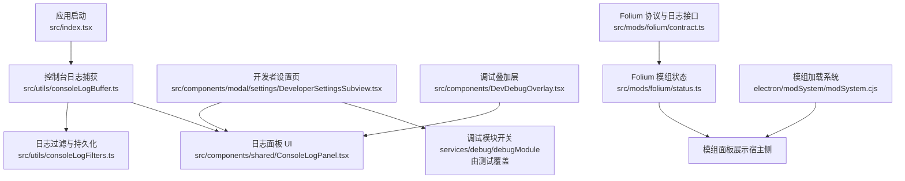
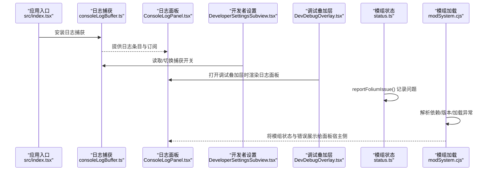
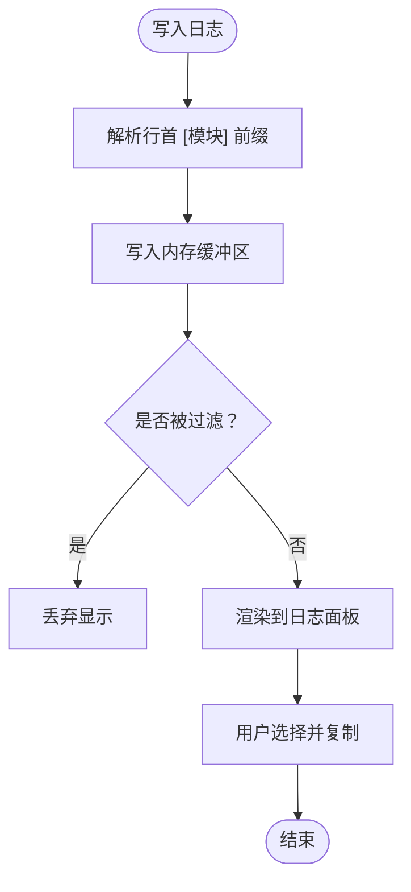
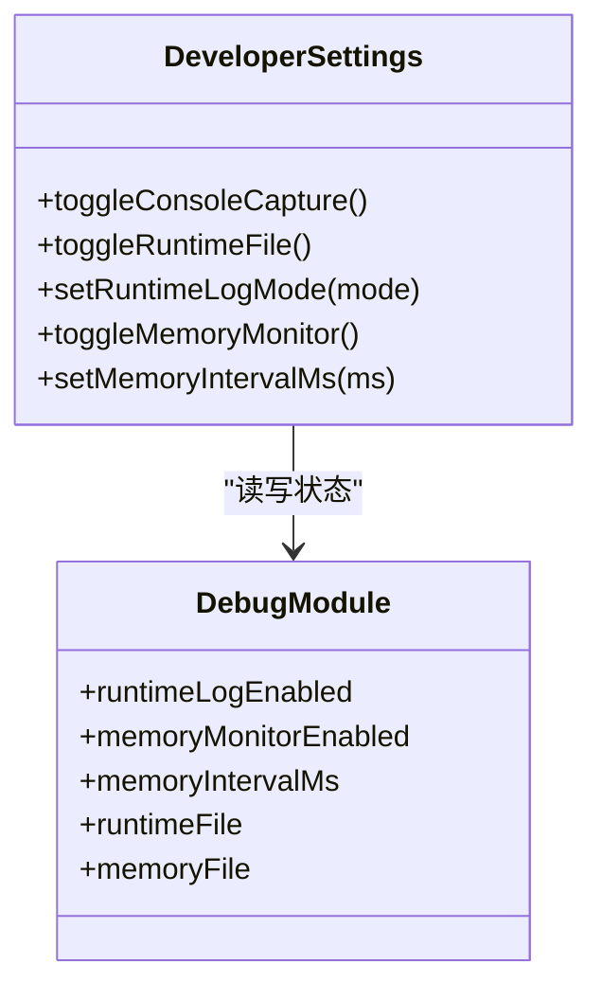
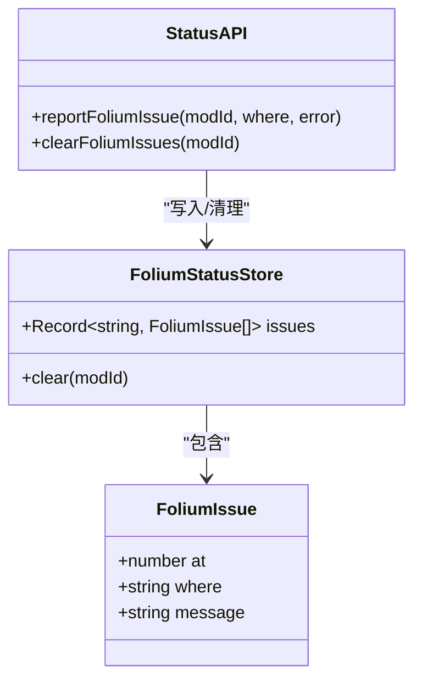
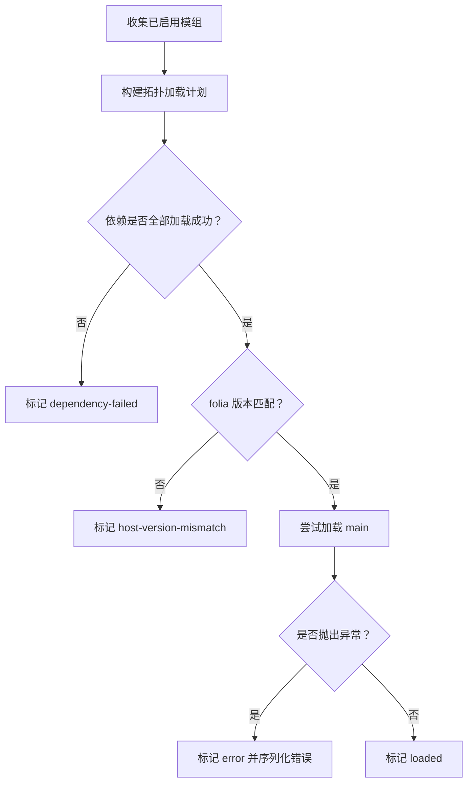
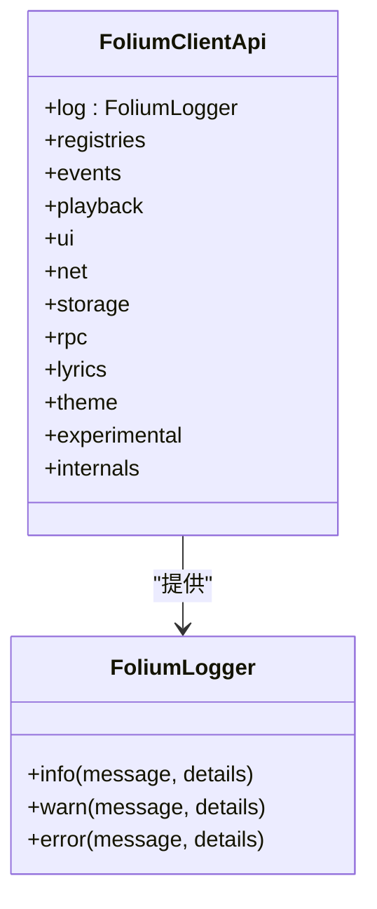
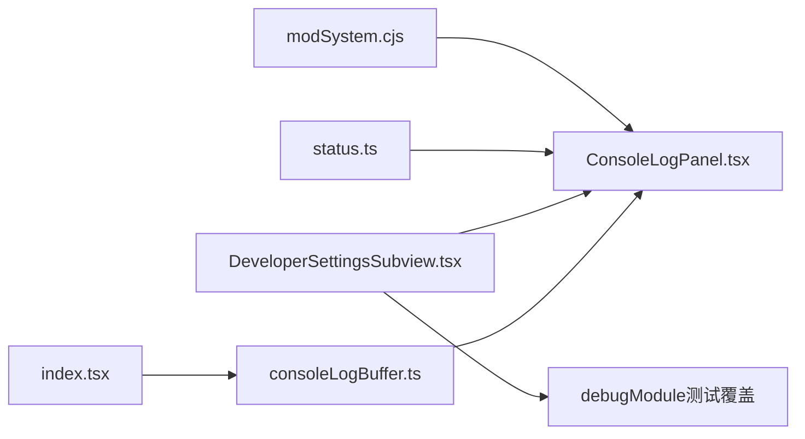

# 调试工具与监控

<cite>
**本文引用的文件**   
- [src/utils/consoleLogBuffer.ts](file://src/utils/consoleLogBuffer.ts)
- [src/utils/consoleLogFilters.ts](file://src/utils/consoleLogFilters.ts)
- [src/components/shared/ConsoleLogPanel.tsx](file://src/components/shared/ConsoleLogPanel.tsx)
- [src/components/modal/settings/DeveloperSettingsSubview.tsx](file://src/components/modal/settings/DeveloperSettingsSubview.tsx)
- [src/components/DevDebugOverlay.tsx](file://src/components/DevDebugOverlay.tsx)
- [src/index.tsx](file://src/index.tsx)
- [docs/client-logging.md](file://docs/client-logging.md)
- [src/mods/folium/status.ts](file://src/mods/folium/status.ts)
- [src/mods/folium/contract.ts](file://src/mods/folium/contract.ts)
- [electron/modSystem/modSystem.cjs](file://electron/modSystem/modSystem.cjs)
- [test/unit/electron/debugModule.test.ts](file://test/unit/electron/debugModule.test.ts)
</cite>

## 目录
1. [简介](#简介)
2. [项目结构](#项目结构)
3. [核心组件](#核心组件)
4. [架构总览](#架构总览)
5. [详细组件分析](#详细组件分析)
6. [依赖关系分析](#依赖关系分析)
7. [性能考量](#性能考量)
8. [故障排查指南](#故障排查指南)
9. [结论](#结论)

## 简介
本文面向 Folia Major 的 Folium 模组开发者，系统性说明如何在本工程中调试 Folium 模组：包括控制台日志、错误追踪、性能监控、模组状态监控、调试模式启用与配置，以及常见问题的诊断方法。文档既适合初学者快速上手，也提供足够的代码级细节供深入排障。

## 项目结构
围绕 Folium 模组调试的关键位置如下：
- 客户端日志采集与面板：位于 src/utils 与 src/components/shared
- 开发者设置页与快捷键入口：位于 src/components/modal/settings 与 src/components/DevDebugOverlay
- 模组运行时问题记录：位于 src/mods/folium/status.ts
- 模组加载与生命周期：位于 electron/modSystem/modSystem.cjs
- 协议与日志接口：位于 src/mods/folium/contract.ts
- 内存与文件日志测试用例：位于 test/unit/electron/debugModule.test.ts

**图表来源**
- [src/index.tsx:1-10](file://src/index.tsx#L1-L10)
- [src/utils/consoleLogBuffer.ts:1-50](file://src/utils/consoleLogBuffer.ts#L1-L50)
- [src/utils/consoleLogFilters.ts:1-40](file://src/utils/consoleLogFilters.ts#L1-L40)
- [src/components/shared/ConsoleLogPanel.tsx:1-40](file://src/components/shared/ConsoleLogPanel.tsx#L1-L40)
- [src/components/modal/settings/DeveloperSettingsSubview.tsx:1-40](file://src/components/modal/settings/DeveloperSettingsSubview.tsx#L1-L40)
- [src/components/DevDebugOverlay.tsx:1-20](file://src/components/DevDebugOverlay.tsx#L1-L20)
- [src/mods/folium/status.ts:1-20](file://src/mods/folium/status.ts#L1-L20)
- [electron/modSystem/modSystem.cjs:664-730](file://electron/modSystem/modSystem.cjs#L664-L730)
- [src/mods/folium/contract.ts:1100-1183](file://src/mods/folium/contract.ts#L1100-L1183)

**章节来源**
- [docs/client-logging.md:1-83](file://docs/client-logging.md#L1-L83)

## 核心组件
- 控制台日志采集器：拦截 console.* 输出，解析 `[模块]` 前缀，维护最近若干行，并捕获 window error / unhandledrejection。
- 日志过滤与持久化：按“模块”和“级别”过滤，跨会话保存屏蔽项。
- 日志面板：支持搜索、多选复制、清空、按模块/级别筛选；在“开发者设置”与“调试叠加层”中复用。
- 开发者设置页：提供“会话日志”开关、“保存到文件”开关与追加/覆盖模式、内存监控开关、采样间隔等。
- 模组状态存储：记录每个模组的运行时问题（激活失败、挂载抛错、注册拒绝），并在模组面板中显示。
- 模组加载系统：负责拓扑排序、依赖检查、主机版本匹配、加载异常序列化与状态传播。
- Folium 协议：定义模组可用的 log、storage、rpc 等能力，其中 log.error 会在模组面板中呈现。

**章节来源**
- [src/utils/consoleLogBuffer.ts:1-50](file://src/utils/consoleLogBuffer.ts#L1-L50)
- [src/utils/consoleLogFilters.ts:1-40](file://src/utils/consoleLogFilters.ts#L1-L40)
- [src/components/shared/ConsoleLogPanel.tsx:172-420](file://src/components/shared/ConsoleLogPanel.tsx#L172-L420)
- [src/components/modal/settings/DeveloperSettingsSubview.tsx:119-290](file://src/components/modal/settings/DeveloperSettingsSubview.tsx#L119-L290)
- [src/mods/folium/status.ts:1-54](file://src/mods/folium/status.ts#L1-L54)
- [electron/modSystem/modSystem.cjs:664-730](file://electron/modSystem/modSystem.cjs#L664-L730)
- [src/mods/folium/contract.ts:1100-1183](file://src/mods/folium/contract.ts#L1100-L1183)

## 架构总览
下图展示了从应用启动到日志采集、UI 展示、模组状态与加载系统的整体交互。

**图表来源**
- [src/index.tsx:1-10](file://src/index.tsx#L1-L10)
- [src/utils/consoleLogBuffer.ts:1-50](file://src/utils/consoleLogBuffer.ts#L1-L50)
- [src/components/shared/ConsoleLogPanel.tsx:172-420](file://src/components/shared/ConsoleLogPanel.tsx#L172-L420)
- [src/components/modal/settings/DeveloperSettingsSubview.tsx:119-290](file://src/components/modal/settings/DeveloperSettingsSubview.tsx#L119-L290)
- [src/components/DevDebugOverlay.tsx:1-20](file://src/components/DevDebugOverlay.tsx#L1-L20)
- [src/mods/folium/status.ts:41-54](file://src/mods/folium/status.ts#L41-L54)
- [electron/modSystem/modSystem.cjs:664-730](file://electron/modSystem/modSystem.cjs#L664-L730)

## 详细组件分析

### 控制台日志与过滤
- 写入方式：直接使用 console.log/info/warn/error/debug，并以 `[模块名]` 作为行首前缀，便于分组与静音。
- 采集机制：installConsoleLogCapture() 在应用早期安装，捕获 console.* 与 window error/unhandledrejection。
- 面板功能：搜索、按级别/模块过滤、选择复制、清空；当关闭捕获时，面板显示“未录制”。
- 过滤持久化：隐藏模块与级别保存在本地，跨会话生效。

**图表来源**
- [src/utils/consoleLogBuffer.ts:1-50](file://src/utils/consoleLogBuffer.ts#L1-L50)
- [src/components/shared/ConsoleLogPanel.tsx:172-420](file://src/components/shared/ConsoleLogPanel.tsx#L172-L420)
- [src/utils/consoleLogFilters.ts:1-40](file://src/utils/consoleLogFilters.ts#L1-L40)

**章节来源**
- [docs/client-logging.md:1-83](file://docs/client-logging.md#L1-L83)
- [src/components/shared/ConsoleLogPanel.tsx:172-420](file://src/components/shared/ConsoleLogPanel.tsx#L172-L420)

### 开发者设置与调试模式
- 会话日志开关：控制是否继续记录日志；关闭后调试叠加层不显示 Console 标签。
- 保存到文件：分别针对“运行时日志”和“内存曲线”，支持追加/覆盖模式。
- 内存监控：可开启进程采样，调整采样间隔（如 1s/2s/5s/15s）。
- 快捷键：Alt+Shift+D 打开调试叠加层；Alt+Shift+M 用于内存监控相关操作（由设置页提示）。

**图表来源**
- [src/components/modal/settings/DeveloperSettingsSubview.tsx:119-290](file://src/components/modal/settings/DeveloperSettingsSubview.tsx#L119-L290)
- [test/unit/electron/debugModule.test.ts:185-293](file://test/unit/electron/debugModule.test.ts#L185-L293)

**章节来源**
- [src/components/modal/settings/DeveloperSettingsSubview.tsx:119-290](file://src/components/modal/settings/DeveloperSettingsSubview.tsx#L119-L290)
- [test/unit/electron/debugModule.test.ts:185-293](file://test/unit/electron/debugModule.test.ts#L185-L293)

### 模组状态监控系统
- 问题记录：reportFoliumIssue(modId, where, error) 将错误序列化为字符串，写入 Zustand store，同时以 `[Folium:modId]` 前缀输出到控制台。
- 限制策略：每个模组最多保留最近 20 条问题，避免无限增长。
- 清理接口：clearFoliumIssues(modId) 可按模组清除问题列表。
- 展示位置：模组面板中与加载状态并列显示，便于定位失败的 client 或 mount。

**图表来源**
- [src/mods/folium/status.ts:1-54](file://src/mods/folium/status.ts#L1-L54)

**章节来源**
- [src/mods/folium/status.ts:1-54](file://src/mods/folium/status.ts#L1-L54)

### 模组生命周期与加载流程
- 依赖拓扑：根据 enabled 模组构建加载计划，确保依赖先于消费者加载。
- 失败传播：若依赖未启用或加载失败，则依赖者标记为 dependency-failed。
- 主机版本匹配：使用 folia 范围校验，不匹配则标记 host-version-mismatch。
- 加载异常：try/catch 捕获 main 加载错误，序列化后标记 error。

**图表来源**
- [electron/modSystem/modSystem.cjs:664-730](file://electron/modSystem/modSystem.cjs#L664-L730)

**章节来源**
- [electron/modSystem/modSystem.cjs:664-730](file://electron/modSystem/modSystem.cjs#L664-L730)

### Folium 协议中的日志接口
- FoliumLogger：info/warn/error，error 会在模组面板中显示。
- FoliumClientApi：暴露 log、registries、events、playback、ui、net、storage、rpc、lyrics、theme、experimental、internals 等能力。
- 建议：模组内部优先使用 folium.log，以便统一在模组面板中聚合错误。

**图表来源**
- [src/mods/folium/contract.ts:1100-1183](file://src/mods/folium/contract.ts#L1100-L1183)

**章节来源**
- [src/mods/folium/contract.ts:1100-1183](file://src/mods/folium/contract.ts#L1100-L1183)

## 依赖关系分析
- 日志子系统耦合点：
  - installConsoleLogCapture() 在应用启动时调用，越早越好。
  - ConsoleLogPanel 通过 useSyncExternalStore 订阅日志流，保证实时性。
  - DeveloperSettingsSubview 同时订阅日志与调试模块状态，避免 UI 不同步。
- 模组子系统耦合点：
  - status.ts 仅依赖 Zustand，轻量且无副作用。
  - modSystem.cjs 与 manifest、签名、权限等模块协作，但对外只暴露状态与错误信息。

**图表来源**
- [src/index.tsx:1-10](file://src/index.tsx#L1-L10)
- [src/utils/consoleLogBuffer.ts:1-50](file://src/utils/consoleLogBuffer.ts#L1-L50)
- [src/components/shared/ConsoleLogPanel.tsx:172-420](file://src/components/shared/ConsoleLogPanel.tsx#L172-L420)
- [src/components/modal/settings/DeveloperSettingsSubview.tsx:119-290](file://src/components/modal/settings/DeveloperSettingsSubview.tsx#L119-L290)
- [src/mods/folium/status.ts:1-54](file://src/mods/folium/status.ts#L1-L54)
- [electron/modSystem/modSystem.cjs:664-730](file://electron/modSystem/modSystem.cjs#L664-L730)

**章节来源**
- [src/components/shared/ConsoleLogPanel.tsx:172-420](file://src/components/shared/ConsoleLogPanel.tsx#L172-L420)
- [src/components/modal/settings/DeveloperSettingsSubview.tsx:119-290](file://src/components/modal/settings/DeveloperSettingsSubview.tsx#L119-L290)

## 性能考量
- 日志缓冲：仅保留最近若干行，避免内存膨胀；面板对可见行进行反向滚动优化，减少重绘。
- 过滤开销：按模块/级别过滤在计算可见集合时执行，建议在高频渲染路径外做派生计算。
- 内存监控：采样间隔可调，较短间隔更精细但磁盘 IO 更高；建议根据问题复现需要选择合适的间隔。
- 模组状态：每个模组最多保留 20 条问题，防止大量错误堆积影响 UI。

[本节为通用指导，不涉及具体文件分析]

## 故障排查指南

### 模组加载失败
- 现象：模组状态显示 disabled/dependency-failed/host-version-mismatch/error。
- 排查步骤：
  1. 检查依赖是否启用，查看依赖链是否完整。
  2. 确认 folia 版本范围是否与当前宿主匹配。
  3. 查看 main 加载是否抛出异常，必要时在开发环境附加断点。
- 参考实现：依赖失败传播、版本匹配、异常序列化。

**章节来源**
- [electron/modSystem/modSystem.cjs:664-730](file://electron/modSystem/modSystem.cjs#L664-L730)

### 运行时错误与异常捕获
- 现象：控制台出现错误，模组面板中出现对应错误条目。
- 排查步骤：
  1. 使用 Alt+Shift+D 打开调试叠加层，查看 Console 标签。
  2. 使用模块/级别过滤缩小范围，复制选中行提交问题。
  3. 若为模组自身错误，检查 reportFoliumIssue 调用位置与错误描述。
- 参考实现：日志捕获、面板过滤、模组状态记录。

**章节来源**
- [src/utils/consoleLogBuffer.ts:1-50](file://src/utils/consoleLogBuffer.ts#L1-L50)
- [src/components/shared/ConsoleLogPanel.tsx:172-420](file://src/components/shared/ConsoleLogPanel.tsx#L172-L420)
- [src/mods/folium/status.ts:41-54](file://src/mods/folium/status.ts#L41-L54)

### 性能瓶颈定位
- 现象：界面卡顿、帧率下降、内存持续增长。
- 排查步骤：
  1. 开启内存监控，选择合适采样间隔，观察曲线变化。
  2. 导出内存日志文件，分析峰值与趋势。
  3. 结合控制台日志，定位高频渲染或长时间任务。
- 参考实现：开发者设置页的内存监控开关与间隔选择。

**章节来源**
- [src/components/modal/settings/DeveloperSettingsSubview.tsx:203-277](file://src/components/modal/settings/DeveloperSettingsSubview.tsx#L203-L277)
- [test/unit/electron/debugModule.test.ts:185-293](file://test/unit/electron/debugModule.test.ts#L185-L293)

### 常见问题速查
- 日志为空：确认已开启“会话日志”捕获；检查 installConsoleLogCapture 是否在最早阶段调用。
- 过滤后无结果：检查模块前缀是否符合规范（单词、无空格、行首）。
- 模组面板无错误：确认模组使用了 folium.log.error 或 reportFoliumIssue。
- 无法打开调试叠加层：确认“会话日志”处于开启状态。

**章节来源**
- [docs/client-logging.md:1-83](file://docs/client-logging.md#L1-L83)
- [src/components/modal/settings/DeveloperSettingsSubview.tsx:119-290](file://src/components/modal/settings/DeveloperSettingsSubview.tsx#L119-L290)

## 结论
通过本工程的日志采集、过滤与面板、开发者设置页、模组状态监控与加载系统，开发者可以高效地定位 Folium 模组的加载失败、运行时异常与性能问题。建议遵循日志规范、合理使用模组日志接口，并结合内存监控与文件日志进行深度分析。遇到复杂问题时，优先使用 Alt+Shift+D 打开调试叠加层，配合模块/级别过滤与复制功能，快速形成可复现的问题报告。