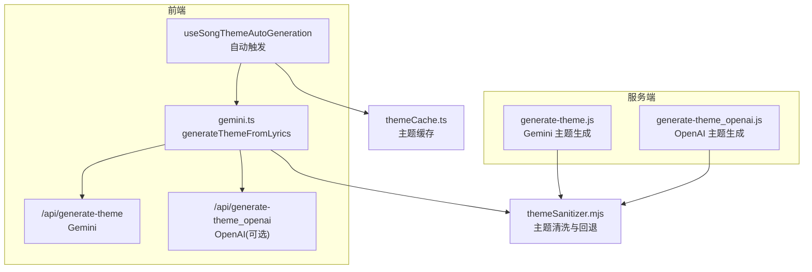
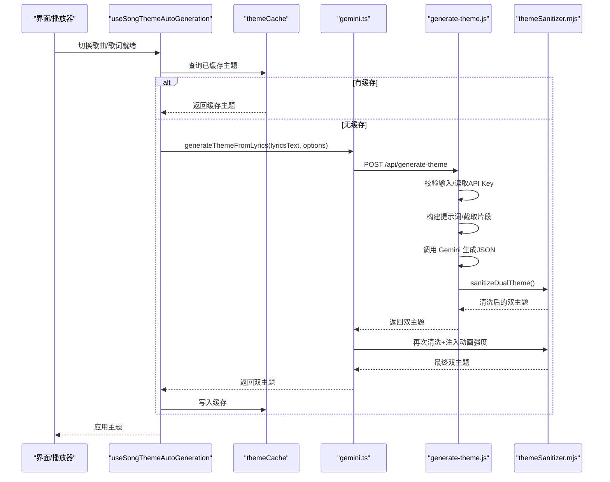
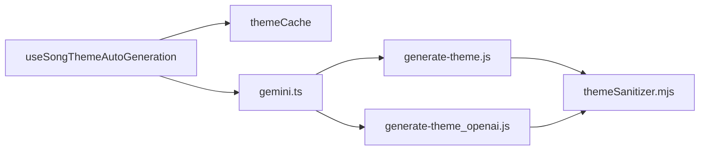

# AI主题生成

<cite>
**本文引用的文件**   
- [api/generate-theme.js](file://api/generate-theme.js)
- [src/services/gemini.ts](file://src/services/gemini.ts)
- [src/utils/aiThemePrompts.ts](file://src/utils/aiThemePrompts.ts)
- [shared/themeSanitizer.mjs](file://shared/themeSanitizer.mjs)
- [src/hooks/useSongThemeAutoGeneration.ts](file://src/hooks/useSongThemeAutoGeneration.ts)
- [src/services/themeCache.ts](file://src/services/themeCache.ts)
</cite>

## 目录
1. [简介](#简介)
2. [项目结构](#项目结构)
3. [核心组件](#核心组件)
4. [架构总览](#架构总览)
5. [详细组件分析](#详细组件分析)
6. [依赖关系分析](#依赖关系分析)
7. [性能考虑](#性能考虑)
8. [故障排查指南](#故障排查指南)
9. [结论](#结论)
10. [附录](#附录)

## 简介
本技术文档聚焦 Folia Major 的“AI主题生成功能”，围绕基于 Gemini API 的主题生成流程展开，涵盖歌词与纯音乐标题输入、情绪识别、视觉参数映射、提示词工程、质量控制（色彩合理性检查与动画强度适配）、错误处理（含密钥缺失回退）以及性能优化建议（异步与缓存）。文档同时解释纯音乐检测在提示词中的角色，并给出端到端的数据流与调用时序。

## 项目结构
AI主题生成涉及前端服务层、服务端函数、共享清洗器与钩子协调逻辑：
- 前端服务层：负责选择 Provider、发起请求、统一清洗与注入动画强度。
- 服务端函数：接收歌词片段与模式标记，构造提示词，调用 Gemini 生成双主题 JSON，并进行二次清洗与固定字段填充。
- 共享清洗器：对颜色、字体、动画强度、图标等字段进行规范化与回退。
- 自动触发钩子：根据播放状态与歌词加载情况，延迟触发主题生成，避免抖动与重复请求。
- 主题缓存：按歌曲维度读取/写入本地缓存，支持同步注册与迁移。

图示来源
- [src/hooks/useSongThemeAutoGeneration.ts:34-145](file://src/hooks/useSongThemeAutoGeneration.ts#L34-L145)
- [src/services/gemini.ts:19-52](file://src/services/gemini.ts#L19-L52)
- [api/generate-theme.js:60-168](file://api/generate-theme.js#L60-L168)
- [shared/themeSanitizer.mjs:104-136](file://shared/themeSanitizer.mjs#L104-L136)
- [src/services/themeCache.ts:15-65](file://src/services/themeCache.ts#L15-L65)

章节来源
- [src/hooks/useSongThemeAutoGeneration.ts:34-145](file://src/hooks/useSongThemeAutoGeneration.ts#L34-L145)
- [src/services/gemini.ts:19-52](file://src/services/gemini.ts#L19-L52)
- [api/generate-theme.js:60-168](file://api/generate-theme.js#L60-L168)
- [shared/themeSanitizer.mjs:104-136](file://shared/themeSanitizer.mjs#L104-L136)
- [src/services/themeCache.ts:15-65](file://src/services/themeCache.ts#L15-L65)

## 核心组件
- 前端主题生成服务（gemini.ts）
  - 提供 generateThemeFromLyrics 与 generateObsThemeFromLyrics 两个入口，自动选择 OpenAI 或 Gemini 端点，统一返回 DualTheme。
  - 对 Electron 环境提供桥接分支；对 Web OBS 场景提供可取消的请求。
- 服务端主题生成函数（generate-theme.js）
  - 校验输入、读取 GEMINI_API_KEY、截取歌词片段、构建提示词、调用 Gemini 模型，返回结构化 JSON。
  - 使用 shared/themeSanitizer.mjs 做最终清洗，并固定 provider 与 fontStyle。
- 提示词工程（aiThemePrompts.ts 与 generate-theme.js 内嵌）
  - 定义双主题输出契约、情绪词提取、色彩规则、图标选取与示例风格。
- 主题清洗器（themeSanitizer.mjs）
  - 规范化十六进制颜色、字体、动画强度、词色与图标数组，并提供默认回退主题。
- 自动触发钩子（useSongThemeAutoGeneration.ts）
  - 延迟触发、去抖、防竞态、结合缓存判断是否发起请求。
- 主题缓存（themeCache.ts）
  - 按歌曲键值读写缓存，兼容旧版单主题格式，维护同步注册表。

章节来源
- [src/services/gemini.ts:19-86](file://src/services/gemini.ts#L19-L86)
- [api/generate-theme.js:60-168](file://api/generate-theme.js#L60-L168)
- [src/utils/aiThemePrompts.ts:87-177](file://src/utils/aiThemePrompts.ts#L87-L177)
- [shared/themeSanitizer.mjs:104-136](file://shared/themeSanitizer.mjs#L104-L136)
- [src/hooks/useSongThemeAutoGeneration.ts:34-145](file://src/hooks/useSongThemeAutoGeneration.ts#L34-L145)
- [src/services/themeCache.ts:15-65](file://src/services/themeCache.ts#L15-L65)

## 架构总览
下图展示从 UI 触发到服务端生成再到前端落地的完整链路，包括 Electron 直连与 Web 端点两种路径。

图示来源
- [src/hooks/useSongThemeAutoGeneration.ts:70-138](file://src/hooks/useSongThemeAutoGeneration.ts#L70-L138)
- [src/services/gemini.ts:19-52](file://src/services/gemini.ts#L19-L52)
- [api/generate-theme.js:60-168](file://api/generate-theme.js#L60-L168)
- [shared/themeSanitizer.mjs:104-136](file://shared/themeSanitizer.mjs#L104-L136)
- [src/services/themeCache.ts:15-65](file://src/services/themeCache.ts#L15-L65)

## 详细组件分析

### 歌词分析与纯音乐检测
- 输入形态
  - 有歌词：传入 lyricsText 片段（服务端会截断至固定长度以控制 Token）。
  - 纯音乐：isPureMusic=true，songTitle 作为标题参与提示词。
- 纯音乐检测策略
  - 当前代码未实现音频信号层面的“纯音乐检测算法”。纯音乐判定由上游业务决定并通过 isPureMusic 标志位传递。
  - 在服务端提示词中，通过 Pure instrumental yes/no 明确区分“歌词片段”和“纯音乐标题”，引导模型仅依据给定文本推断情绪。
- 歌词片段裁剪
  - 服务端将 lyricsText 限制为前若干字符，以避免超长输入导致 Token 超限。

章节来源
- [api/generate-theme.js:64-79](file://api/generate-theme.js#L64-L79)
- [src/utils/aiThemePrompts.ts:100-103](file://src/utils/aiThemePrompts.ts#L100-L103)

### 情绪识别与视觉参数映射
- 情绪词提取
  - 要求模型从源文本中提取 10-20 个情感独立词，并为每个词分配具体颜色（wordColors）。
- 色彩体系
  - 基于情绪词方向与颜色，分别构建浅色与深色两套配色（backgroundColor、primaryColor、secondaryColor、accentColor）。
  - 强调对比度与可读性，避免纯白/纯黑默认值，鼓励多样化且符合情绪的色调。
- 歌词图标
  - 从源文本中抽取 3-5 个视觉概念，映射为 Lucide React 图标名（lyricsIcons）。
- 双主题一致性
  - wordColors 与 lyricsIcons 在 light/dark 两主题保持一致，体现同一情绪内核在不同明暗模式下的色彩适配。

章节来源
- [api/generate-theme.js:22-56](file://api/generate-theme.js#L22-L56)
- [src/utils/aiThemePrompts.ts:105-139](file://src/utils/aiThemePrompts.ts#L105-L139)

### 提示词工程与歌曲类型优化
- 提示词模板
  - 统一的 THEME_GENERATION_PROMPT_PREFIX 定义双主题输出契约、情绪表达风格、颜色规则与图标规范。
  - buildThemeSourcePrompt 动态拼接 Pure instrumental、Song title 与 Source snippet。
- 歌曲类型优化
  - 有歌词：侧重歌词语义与意象，提取情感词与视觉对象。
  - 纯音乐：以歌名为线索，避免误判为歌词，保持情绪推断保守一致。
- 输出约束
  - 强制返回 JSON，包含 light/dark 双主题对象，字段齐全，便于下游解析与渲染。

章节来源
- [src/utils/aiThemePrompts.ts:87-177](file://src/utils/aiThemePrompts.ts#L87-L177)
- [api/generate-theme.js:4-59](file://api/generate-theme.js#L4-L59)

### 质量控制：色彩合理性与动画强度适配
- 色彩合理性
  - 清洗器对 backgroundColor、primaryColor、secondaryColor、accentColor 进行十六进制校验与归一化，无效值回退到默认值。
  - 对 secondaryColor 强调可读性与对比度要求，确保辅助文本清晰可见。
- 动画强度适配
  - 前端在返回主题后，调用 applyStoredAnimationIntensityToDualTheme 注入用户设置的动画强度，保证体验一致性。
- 其他字段
  - 字体样式、图标列表、词色数组均经过规范化与上限限制，防止异常数据影响渲染。

章节来源
- [shared/themeSanitizer.mjs:57-102](file://shared/themeSanitizer.mjs#L57-L102)
- [shared/themeSanitizer.mjs:104-136](file://shared/themeSanitizer.mjs#L104-L136)
- [src/services/gemini.ts:47-47](file://src/services/gemini.ts#L47-L47)

### 错误处理与回退策略
- 密钥缺失
  - 服务端在未配置 GEMINI_API_KEY 时直接返回 500 错误，提示服务器配置问题。
- 通用异常
  - 捕获生成过程中的异常，返回结构化错误信息。
- 前端回退
  - 当 API 不可用或返回失败时，上层调用方可回退到内置主题或上次成功主题（由业务侧决定）。
  - 清洗器内置默认双主题，确保即使 AI 返回不完整也能安全降级。

章节来源
- [api/generate-theme.js:69-73](file://api/generate-theme.js#L69-L73)
- [api/generate-theme.js:170-174](file://api/generate-theme.js#L170-L174)
- [shared/themeSanitizer.mjs:6-35](file://shared/themeSanitizer.mjs#L6-L35)

### 自动触发与异步处理
- 延迟触发
  - useSongThemeAutoGeneration 使用定时器延迟触发，避免频繁切换导致的抖动。
- 防竞态
  - 通过 latestSongKeyRef 与 isSongThemeGenerationStillCurrent 判断，确保只有最新歌曲的主题生效。
- 异步并发
  - 每次触发均为独立异步任务，内部先查缓存再决定是否发起网络请求。

章节来源
- [src/hooks/useSongThemeAutoGeneration.ts:32-33](file://src/hooks/useSongThemeAutoGeneration.ts#L32-L33)
- [src/hooks/useSongThemeAutoGeneration.ts:91-138](file://src/hooks/useSongThemeAutoGeneration.ts#L91-L138)

### 缓存策略
- 缓存键
  - 优先使用“来源感知”的歌曲键，其次回退到 id，兼容历史数据。
- 同步注册
  - 若发现本地已有主题，尝试注册同步记录以便跨设备同步。
- 迁移
  - 自动将旧版单主题迁移到新键空间，减少冷启动开销。

章节来源
- [src/services/themeCache.ts:15-65](file://src/services/themeCache.ts#L15-L65)

## 依赖关系分析
- 组件耦合
  - useSongThemeAutoGeneration 依赖 themeCache 与 generateAITheme（由外部注入），不直接访问网络。
  - gemini.ts 依赖运行时配置选择端点，统一封装 fetch 与清洗。
  - generate-theme.js 依赖 shared/themeSanitizer.mjs 与 Google GenAI SDK。
- 外部依赖
  - Gemini API（或 OpenAI 兼容端点）用于主题生成。
  - Lucide React 图标命名约定用于 lyricsIcons。

图示来源
- [src/hooks/useSongThemeAutoGeneration.ts:34-145](file://src/hooks/useSongThemeAutoGeneration.ts#L34-L145)
- [src/services/gemini.ts:19-52](file://src/services/gemini.ts#L19-L52)
- [api/generate-theme.js:60-168](file://api/generate-theme.js#L60-L168)
- [shared/themeSanitizer.mjs:104-136](file://shared/themeSanitizer.mjs#L104-L136)

章节来源
- [src/hooks/useSongThemeAutoGeneration.ts:34-145](file://src/hooks/useSongThemeAutoGeneration.ts#L34-L145)
- [src/services/gemini.ts:19-52](file://src/services/gemini.ts#L19-L52)
- [api/generate-theme.js:60-168](file://api/generate-theme.js#L60-L168)
- [shared/themeSanitizer.mjs:104-136](file://shared/themeSanitizer.mjs#L104-L136)

## 性能考虑
- 异步处理
  - 所有主题生成均为异步操作，避免阻塞主线程；自动触发钩子使用定时器与异步任务隔离。
- 输入裁剪
  - 服务端对歌词片段进行长度限制，降低 Token 消耗与超时风险。
- 缓存命中
  - 优先读取本地缓存，减少不必要的网络请求；对已存在主题进行同步注册，提升多端一致性。
- 响应结构
  - 使用结构化 JSON Schema 约束输出，减少解析失败与重试概率。
- 可扩展优化
  - 可在服务端增加请求级缓存（如按歌词指纹或歌名+模式）以减少重复计算。
  - 对高频歌曲可做预生成与预热，缩短首屏等待时间。

[本节为通用指导，无需列出具体文件来源]

## 故障排查指南
- 现象：提示“API Key 缺失”
  - 检查服务端环境变量是否配置 GEMINI_API_KEY。
  - 确认部署环境已正确注入密钥。
- 现象：主题生成失败但无详细信息
  - 查看服务端日志中的错误堆栈；检查网络连通性与配额限制。
- 现象：主题颜色异常或不可读
  - 检查清洗器是否对颜色进行了回退；确认 secondaryColor 与背景色的对比度。
- 现象：动画强度不符合预期
  - 确认前端是否在返回主题后注入了动画强度；检查用户设置是否被覆盖。
- 现象：重复触发或老主题覆盖新主题
  - 检查 useSongThemeAutoGeneration 的防竞态逻辑是否生效；确认 songKey 是否正确更新。

章节来源
- [api/generate-theme.js:69-73](file://api/generate-theme.js#L69-L73)
- [api/generate-theme.js:170-174](file://api/generate-theme.js#L170-L174)
- [shared/themeSanitizer.mjs:57-102](file://shared/themeSanitizer.mjs#L57-L102)
- [src/hooks/useSongThemeAutoGeneration.ts:91-138](file://src/hooks/useSongThemeAutoGeneration.ts#L91-L138)

## 结论
Folia Major 的 AI 主题生成功能以 Gemini API 为核心，通过清晰的提示词工程与严格的输出契约，将歌词或纯音乐标题转化为高质量的双主题配色方案。系统在前端与服务端之间建立了稳定的数据流，配合清洗器与缓存机制，确保主题生成的稳定性、一致性与性能。对于纯音乐检测，当前版本依赖上游业务标记而非音频信号分析；未来可在此基础上扩展更精细的检测能力。整体架构具备良好的可扩展性与容错性，适合在多种运行环境中稳定工作。

[本节为总结性内容，无需列出具体文件来源]

## 附录
- 关键数据结构
  - DualTheme：包含 light 与 dark 两套主题，每套主题包含 name、description、backgroundColor、primaryColor、secondaryColor、accentColor、fontStyle、animationIntensity、wordColors、lyricsIcons、provider 等字段。
  - 词色条目：{ word, color }，用于标注情感词与其对应颜色。
  - 歌词图标：Lucide React 图标名数组。

[本节为概念性说明，无需列出具体文件来源]