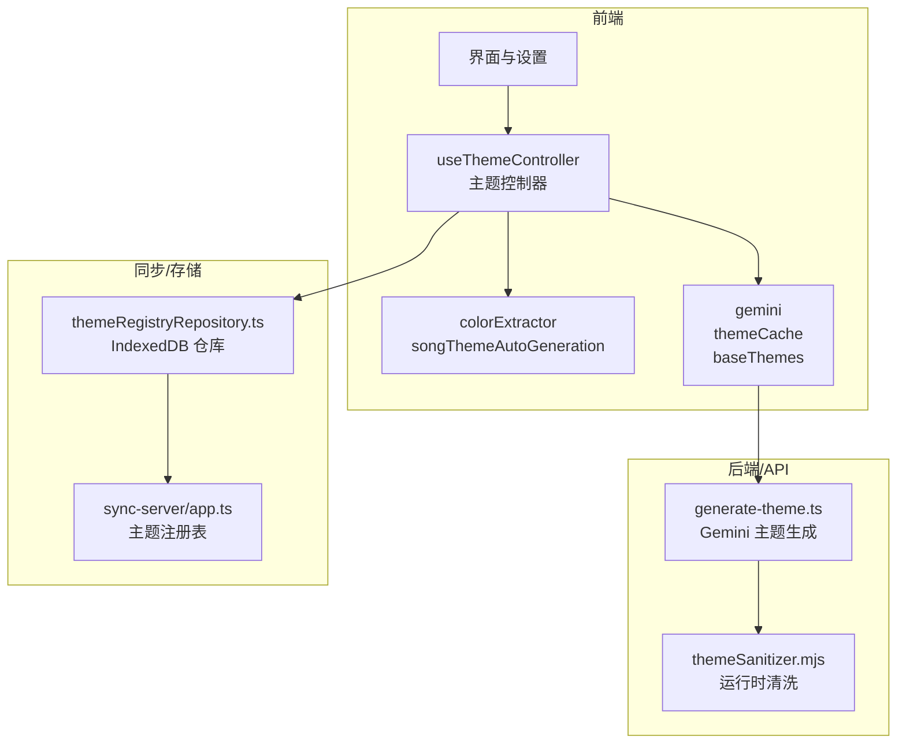
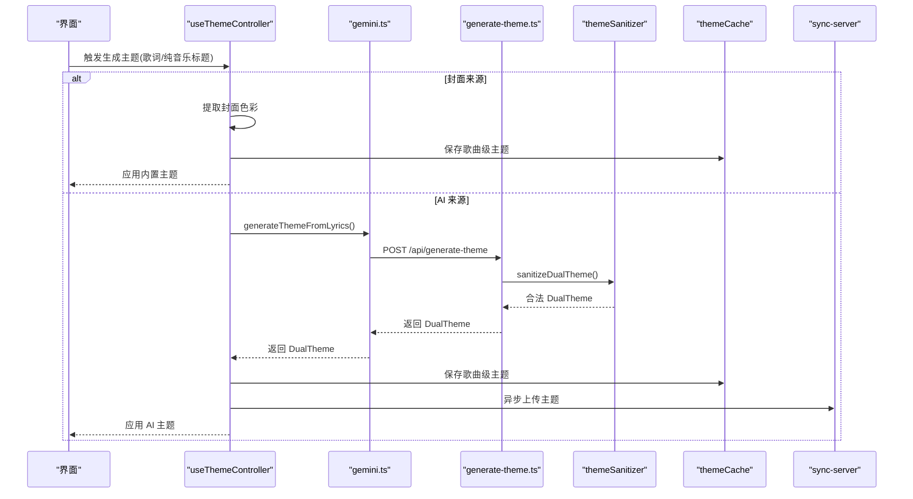
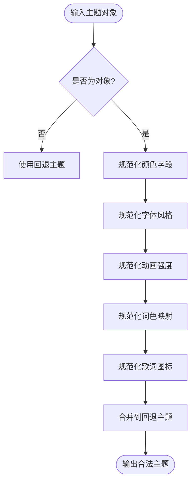
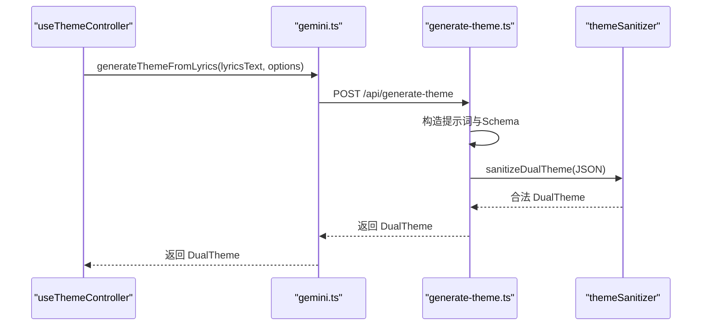
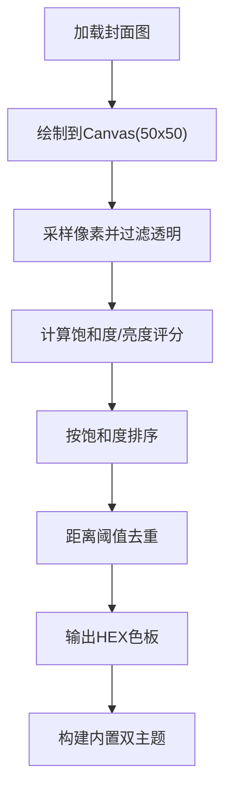
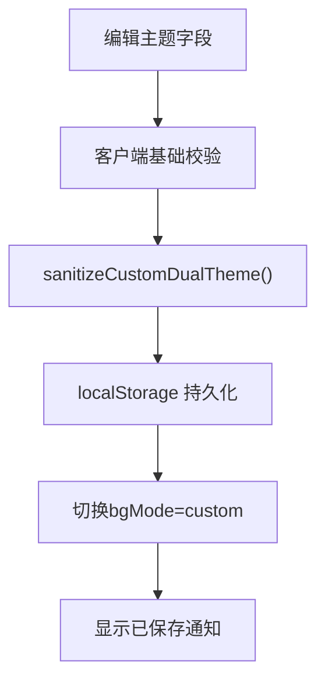
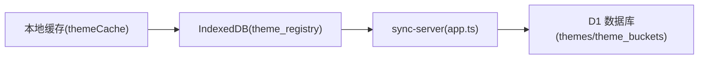
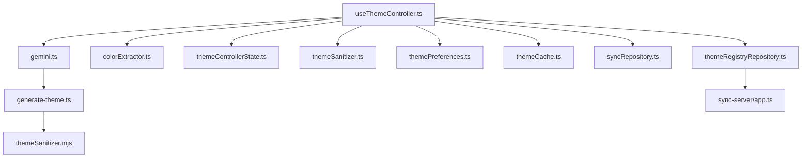

# 主题与外观系统

<cite>
**本文引用的文件**   
- [src/services/themeSanitizer.ts](file://src/services/themeSanitizer.ts)
- [shared/themeSanitizer.mjs](file://shared/themeSanitizer.mjs)
- [src/hooks/useThemeController.ts](file://src/hooks/useThemeController.ts)
- [src/hooks/themeControllerState.ts](file://src/hooks/themeControllerState.ts)
- [src/utils/colorExtractor.ts](file://src/utils/colorExtractor.ts)
- [src/services/gemini.ts](file://src/services/gemini.ts)
- [api-ts/generate-theme.ts](file://api-ts/generate-theme.ts)
- [src/utils/songThemeAutoGeneration.ts](file://src/utils/songThemeAutoGeneration.ts)
- [src/services/baseThemes.ts](file://src/services/baseThemes.ts)
- [src/services/themeCache.ts](file://src/services/themeCache.ts)
- [src/services/repositories/themeRegistryRepository.ts](file://src/services/repositories/themeRegistryRepository.ts)
- [sync-server/src/app.ts](file://sync-server/src/app.ts)
</cite>

## 目录
1. [简介](#简介)
2. [项目结构](#项目结构)
3. [核心组件](#核心组件)
4. [架构总览](#架构总览)
5. [详细组件分析](#详细组件分析)
6. [依赖关系分析](#依赖关系分析)
7. [性能考量](#性能考量)
8. [故障排查指南](#故障排查指南)
9. [结论](#结论)
10. [附录：主题开发指南](#附录主题开发指南)

## 简介
本文件系统性梳理 Folia Major 的主题与外观系统，覆盖以下关键能力：
- 主题数据结构、样式系统与动态切换机制
- AI 主题生成：基于歌词/纯音乐标题的情绪分析与双模式（明/暗）配色自动生成
- 封面色彩提取算法：从专辑封面采样主色调并生成内置主题
- 动态背景效果：渐变、粒子、几何图形等由可视化层驱动的外观表现
- 用户自定义主题的编辑与保存机制
- 主题安全沙箱：对 AI 生成的主题进行严格校验与回退
- 主题同步与持久化：本地缓存、歌曲级主题缓存与云端注册表

## 项目结构
主题相关代码主要分布在以下层次：
- 服务层：主题清洗、默认主题、AI 调用封装、缓存与偏好
- Hook 层：主题控制器，负责状态机、自动切换、保存与恢复
- 工具层：色彩提取、内置主题构建、歌曲级自动判定
- API 层：服务端主题生成（Gemini/OpenAI）
- 同步层：云端主题注册表与 schema 校验
- Electron 桥接：在桌面端提供 generateTheme IPC



**图表来源**
- [src/hooks/useThemeController.ts:130-741](file://src/hooks/useThemeController.ts#L130-L741)
- [src/services/gemini.ts:19-52](file://src/services/gemini.ts#L19-L52)
- [api-ts/generate-theme.ts:63-182](file://api-ts/generate-theme.ts#L63-L182)
- [shared/themeSanitizer.mjs:104-136](file://shared/themeSanitizer.mjs#L104-L136)
- [src/services/repositories/themeRegistryRepository.ts:1-14](file://src/services/repositories/themeRegistryRepository.ts#L1-L14)
- [sync-server/src/app.ts:47-93](file://sync-server/src/app.ts#L47-L93)

**章节来源**
- [src/hooks/useThemeController.ts:130-741](file://src/hooks/useThemeController.ts#L130-L741)
- [src/services/gemini.ts:19-52](file://src/services/gemini.ts#L19-L52)
- [api-ts/generate-theme.ts:63-182](file://api-ts/generate-theme.ts#L63-L182)
- [shared/themeSanitizer.mjs:104-136](file://shared/themeSanitizer.mjs#L104-L136)
- [src/services/repositories/themeRegistryRepository.ts:1-14](file://src/services/repositories/themeRegistryRepository.ts#L1-L14)
- [sync-server/src/app.ts:47-93](file://sync-server/src/app.ts#L47-L93)

## 核心组件
- 主题数据模型与清洗器
  - Theme/DualTheme 结构由类型定义约束；清洗器确保颜色、字体、动画强度、词色与图标列表合法。
  - 提供 FALLBACK_AI_DUAL_THEME 作为 AI 生成失败或字段缺失时的回退。
- 主题控制器
  - 管理三种来源：默认、AI、自定义；支持明/暗模式切换、歌曲级自动切换与自动生成功能开关。
  - 处理封面派生主题、AI 主题应用、编辑与保存、缓存与同步。
- 色彩提取与内置主题
  - 从封面图片像素采样主色调，生成内置双模式主题。
- AI 主题生成
  - 通过 gemini.ts 调用后端 generate-theme.ts，返回双模式主题，再经清洗器校验。
- 同步与持久化
  - 本地 IndexedDB 主题缓存与歌曲级缓存；云端主题注册表用于跨设备同步。

**章节来源**
- [src/services/themeSanitizer.ts:1-161](file://src/services/themeSanitizer.ts#L1-L161)
- [src/hooks/useThemeController.ts:130-741](file://src/hooks/useThemeController.ts#L130-L741)
- [src/utils/colorExtractor.ts:108-119](file://src/utils/colorExtractor.ts#L108-L119)
- [src/services/gemini.ts:19-52](file://src/services/gemini.ts#L19-L52)
- [src/services/themeCache.ts:1-20](file://src/services/themeCache.ts#L1-L20)
- [src/services/repositories/themeRegistryRepository.ts:1-14](file://src/services/repositories/themeRegistryRepository.ts#L1-L14)

## 架构总览
主题系统采用“控制器 + 服务 + 工具 + API”的分层架构：
- 控制器（Hook）：编排主题来源、状态切换、自动逻辑与用户交互
- 服务层：封装 AI 调用、缓存、偏好与默认主题
- 工具层：色彩提取、内置主题构建、自动判定
- API 层：服务端主题生成与清洗
- 同步层：云端注册表与 schema 校验



**图表来源**
- [src/hooks/useThemeController.ts:567-690](file://src/hooks/useThemeController.ts#L567-L690)
- [src/services/gemini.ts:19-52](file://src/services/gemini.ts#L19-L52)
- [api-ts/generate-theme.ts:63-182](file://api-ts/generate-theme.ts#L63-L182)
- [shared/themeSanitizer.mjs:104-136](file://shared/themeSanitizer.mjs#L104-L136)
- [src/services/themeCache.ts:1-20](file://src/services/themeCache.ts#L1-L20)

## 详细组件分析

### 主题数据模型与安全沙箱
- 数据模型
  - Theme：包含名称、描述、背景/主次/强调色、字体风格、动画强度、词色映射、歌词图标、提供者。
  - DualTheme：light/dark 两个 Theme 的组合。
- 安全沙箱
  - 清洗器对颜色、字体、动画强度、词色数组、歌词图标数组进行白名单校验与归一化。
  - 非法值将被替换为回退值；词色最多保留若干项，歌词图标限制数量与长度。
  - 提供 FALLBACK_AI_DUAL_THEME 保证任何异常输入都能得到可用主题。



**图表来源**
- [src/services/themeSanitizer.ts:118-160](file://src/services/themeSanitizer.ts#L118-L160)
- [shared/themeSanitizer.mjs:104-136](file://shared/themeSanitizer.mjs#L104-L136)

**章节来源**
- [src/services/themeSanitizer.ts:1-161](file://src/services/themeSanitizer.ts#L1-L161)
- [shared/themeSanitizer.mjs:1-137](file://shared/themeSanitizer.mjs#L1-L137)

### 主题控制器与动态切换
- 主题来源
  - default：系统默认明/暗主题
  - ai：AI 生成的双模式主题或历史单主题
  - custom：用户自定义的双模式主题
- 状态机
  - bgMode 控制当前来源；isDaylight 控制明/暗选择
  - 支持“自定义优先”开关，避免 AI 主题覆盖用户自定义
  - 支持“按歌曲自动切换/自动生成”开关
- 关键流程
  - 应用 AI 主题：清洗 → 缓存 → 可选同步 → 更新 bgMode
  - 应用封面派生主题：提取色彩 → 构建内置双主题 → 缓存 → 应用
  - 恢复上次主题指针：custom/ai/default 三级回退
  - 保存自定义主题：清洗 → 写入 localStorage → 切换至 custom

```mermaid
stateDiagram-v2
[*] --> Default
Default --> AI : "applyDualTheme()"
Default --> Custom : "saveCustomDualTheme()"
AI --> Default : "handleResetTheme()/applyThemeFallback()"
Custom --> Default : "applyDefaultTheme()"
AI --> Custom : "saveEditedAiDualTheme()"
Custom --> AI : "generateAITheme()"
```

**图表来源**
- [src/hooks/useThemeController.ts:295-434](file://src/hooks/useThemeController.ts#L295-L434)
- [src/hooks/themeControllerState.ts:57-103](file://src/hooks/themeControllerState.ts#L57-L103)

**章节来源**
- [src/hooks/useThemeController.ts:130-741](file://src/hooks/useThemeController.ts#L130-L741)
- [src/hooks/themeControllerState.ts:1-177](file://src/hooks/themeControllerState.ts#L1-L177)

### AI 主题生成与情绪视觉参数
- 输入
  - 歌词文本或纯音乐标题；是否纯音乐标记
- 处理
  - 若启用“封面来源”，则跳过 AI，直接走封面派生路径
  - 否则调用后端 generate-theme.ts，传入提示词与结构化响应 Schema
  - 服务端使用 Gemini 生成 light/dark 双主题 JSON，并强制字体与提供者字段
- 输出
  - 前端接收后执行 sanitizeDualTheme 与动画强度注入，再应用主题



**图表来源**
- [src/services/gemini.ts:19-52](file://src/services/gemini.ts#L19-L52)
- [api-ts/generate-theme.ts:5-61](file://api-ts/generate-theme.ts#L5-L61)
- [api-ts/generate-theme.ts:87-182](file://api-ts/generate-theme.ts#L87-L182)
- [shared/themeSanitizer.mjs:104-136](file://shared/themeSanitizer.mjs#L104-L136)

**章节来源**
- [src/services/gemini.ts:19-52](file://src/services/gemini.ts#L19-L52)
- [api-ts/generate-theme.ts:5-61](file://api-ts/generate-theme.ts#L5-L61)
- [api-ts/generate-theme.ts:87-182](file://api-ts/generate-theme.ts#L87-L182)

### 封面色彩提取与内置主题
- 色彩提取
  - 将封面图绘制到小尺寸 canvas，采样像素，过滤透明与低饱和度
  - 计算饱和度与亮度，排序并去重，输出 HEX 色板
- 内置主题
  - 根据封面色板生成双模式主题（明/暗），保持动画强度一致
  - 当 AI Key 缺失时，自动回退到封面派生主题



**图表来源**
- [src/utils/colorExtractor.ts:11-41](file://src/utils/colorExtractor.ts#L11-L41)
- [src/utils/colorExtractor.ts:43-105](file://src/utils/colorExtractor.ts#L43-L105)
- [src/hooks/themeControllerState.ts:168-176](file://src/hooks/themeControllerState.ts#L168-L176)

**章节来源**
- [src/utils/colorExtractor.ts:1-120](file://src/utils/colorExtractor.ts#L1-L120)
- [src/hooks/themeControllerState.ts:168-176](file://src/hooks/themeControllerState.ts#L168-L176)

### 动态背景效果
- 主题仅定义静态外观（颜色、字体、动画强度、词色、图标）
- 动态背景（渐变、粒子、几何图形）由可视化层与特效模块驱动，主题通过 animationIntensity 控制整体动效强度
- 该部分不在主题数据模型中直接实现，而是由上层渲染管线读取主题并驱动视觉效果

[本节为概念性说明，不直接分析具体文件]

### 用户自定义主题的编辑与保存
- 编辑
  - 从当前主题或 AI 主题构建种子，允许修改名称、颜色、字体、动画强度、词色与图标
  - 编辑器侧限制最大词色与图标数量，避免超出清洗器上限
- 保存
  - 清洗后写入 localStorage，并切换 bgMode 为 custom
  - 可开启“自定义优先”，使自定义主题不被 AI 主题覆盖



**图表来源**
- [src/hooks/useThemeController.ts:401-410](file://src/hooks/useThemeController.ts#L401-L410)
- [src/hooks/useThemeController.ts:448-462](file://src/hooks/useThemeController.ts#L448-L462)

**章节来源**
- [src/hooks/useThemeController.ts:401-462](file://src/hooks/useThemeController.ts#L401-L462)

### 主题同步与持久化
- 本地缓存
  - last_dual_theme、last_theme、dual_theme_{songKey} 等键值
- 云端注册表
  - 主题指纹、桶ID、JSON、来源、更新时间
  - 服务器端 schema 校验与索引优化
- 仓库层
  - IndexedDB theme_registry 表的读写封装



**图表来源**
- [src/services/themeCache.ts:1-20](file://src/services/themeCache.ts#L1-L20)
- [src/services/repositories/themeRegistryRepository.ts:1-14](file://src/services/repositories/themeRegistryRepository.ts#L1-L14)
- [sync-server/src/app.ts:47-93](file://sync-server/src/app.ts#L47-L93)

**章节来源**
- [src/services/themeCache.ts:1-20](file://src/services/themeCache.ts#L1-L20)
- [src/services/repositories/themeRegistryRepository.ts:1-14](file://src/services/repositories/themeRegistryRepository.ts#L1-L14)
- [sync-server/src/app.ts:47-93](file://sync-server/src/app.ts#L47-L93)

## 依赖关系分析
- useThemeController 依赖
  - gemini.ts：AI 主题生成
  - colorExtractor.ts：封面色彩提取
  - themeControllerState.ts：主题来源模型与内置主题构建
  - themeSanitizer.ts：主题清洗
  - themePreferences.ts：动画强度与偏好持久化
  - themeCache.ts：主题缓存
  - syncRepository.ts：主题同步
- 外部依赖
  - api-ts/generate-theme.ts：Gemini/OpenAI 主题生成
  - shared/themeSanitizer.mjs：运行时清洗
  - sync-server/app.ts：云端注册表



**图表来源**
- [src/hooks/useThemeController.ts:1-39](file://src/hooks/useThemeController.ts#L1-L39)
- [src/services/gemini.ts:1-5](file://src/services/gemini.ts#L1-L5)
- [api-ts/generate-theme.ts:1-3](file://api-ts/generate-theme.ts#L1-L3)
- [shared/themeSanitizer.mjs:1-4](file://shared/themeSanitizer.mjs#L1-L4)
- [src/services/repositories/themeRegistryRepository.ts:1-2](file://src/services/repositories/themeRegistryRepository.ts#L1-L2)
- [sync-server/src/app.ts:47-93](file://sync-server/src/app.ts#L47-L93)

**章节来源**
- [src/hooks/useThemeController.ts:1-39](file://src/hooks/useThemeController.ts#L1-L39)
- [src/services/gemini.ts:1-5](file://src/services/gemini.ts#L1-L5)
- [api-ts/generate-theme.ts:1-3](file://api-ts/generate-theme.ts#L1-L3)
- [shared/themeSanitizer.mjs:1-4](file://shared/themeSanitizer.mjs#L1-L4)
- [src/services/repositories/themeRegistryRepository.ts:1-2](file://src/services/repositories/themeRegistryRepository.ts#L1-L2)
- [sync-server/src/app.ts:47-93](file://sync-server/src/app.ts#L47-L93)

## 性能考量
- 封面色彩提取
  - 使用 50x50 画布降低像素处理开销；采样步长与去重阈值平衡多样性与性能
- AI 主题生成
  - 歌词文本截断以避免 token 超限；并发请求通过歌曲键集合去重
- 主题清洗
  - 轻量字符串与数组操作，避免复杂计算
- 缓存策略
  - 歌曲级主题缓存减少重复生成；最后应用指针快速恢复

[本节为通用指导，不直接分析具体文件]

## 故障排查指南
- AI Key 缺失
  - 检测错误信息中包含 openai_api_key/gemini_api_key/api key 且提示未配置或缺失
  - 自动回退到封面派生主题
- 主题生成失败
  - 检查网络与后端接口；查看控制台错误日志
  - 确认歌词文本非空；纯音乐场景使用标题作为提示源
- 主题应用异常
  - 检查主题字段是否被清洗器回退；确认动画强度与字体风格合法
- 同步失败
  - 忽略阻塞；本地缓存仍有效；检查云端注册表与 schema 校验

**章节来源**
- [src/services/gemini.ts:13-17](file://src/services/gemini.ts#L13-L17)
- [src/hooks/useThemeController.ts:672-689](file://src/hooks/useThemeController.ts#L672-L689)
- [src/services/themeSanitizer.ts:118-160](file://src/services/themeSanitizer.ts#L118-L160)

## 结论
Folia Major 的主题与外观系统以清晰的分层架构与严格的清洗沙箱保障稳定性与安全性。通过封面色彩提取与 AI 主题生成两条路径，结合歌曲级缓存与云端同步，实现了从静态外观到动态效果的完整体验。控制器层的状态机设计使得主题切换、自动切换与自定义优先等高级特性得以可靠实现。

[本节为总结性内容，不直接分析具体文件]

## 附录：主题开发指南
- 主题结构规范
  - 必须包含 name、backgroundColor、primaryColor、accentColor、secondaryColor
  - 可选 description、fontStyle、animationIntensity、wordColors、lyricsIcons、provider
  - 颜色需为 HEX；字体风格仅限 sans/serif/mono；动画强度仅限 calm/normal/chaotic
- API 接口
  - 前端：gemini.generateThemeFromLyrics(lyricsText, options)
  - 后端：POST /api/generate-theme 或 /api/generate-theme_openai
  - 返回 DualTheme，经清洗器校验后应用
- 最佳实践
  - 始终使用 sanitizeDualTheme 处理外部输入
  - 合理设置 wordColors 与 lyricsIcons，保持与主题配色协调
  - 使用 buildBuiltinDualTheme 生成封面派生主题作为回退
  - 在自定义主题编辑时遵循清洗器限制，避免保存后被截断

**章节来源**
- [src/services/themeSanitizer.ts:118-160](file://src/services/themeSanitizer.ts#L118-L160)
- [src/services/gemini.ts:19-52](file://src/services/gemini.ts#L19-L52)
- [api-ts/generate-theme.ts:63-182](file://api-ts/generate-theme.ts#L63-L182)
- [src/hooks/themeControllerState.ts:168-176](file://src/hooks/themeControllerState.ts#L168-L176)