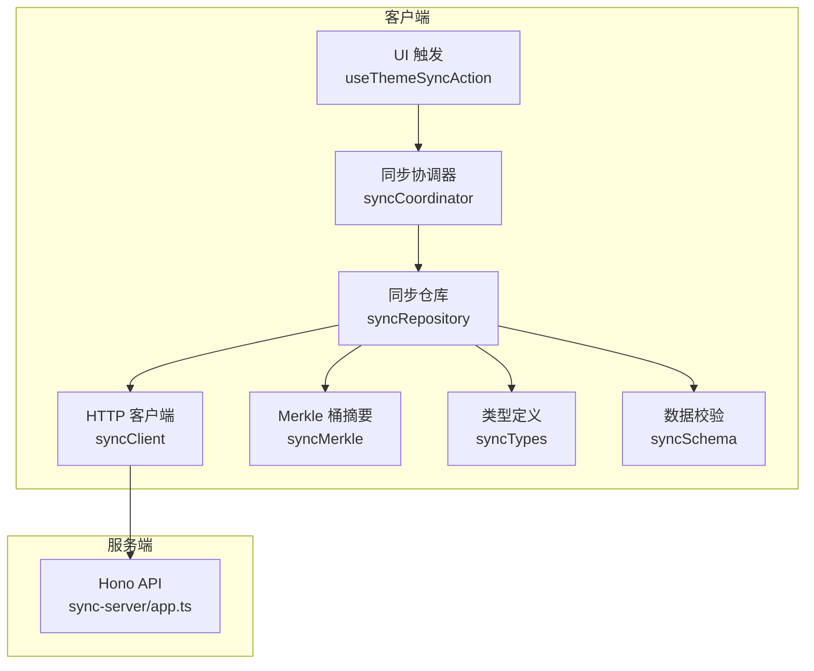
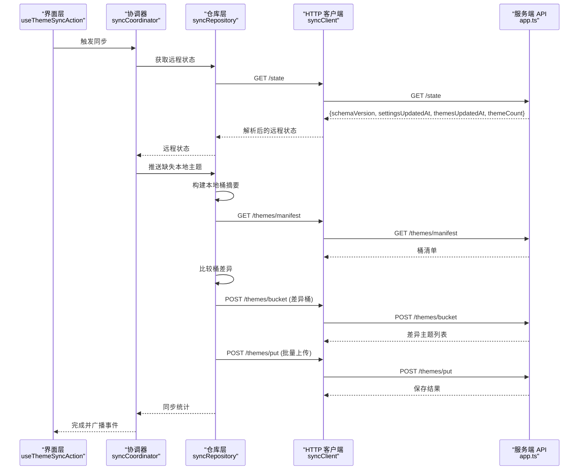
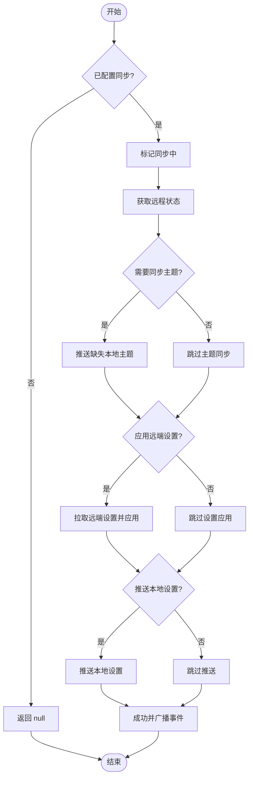
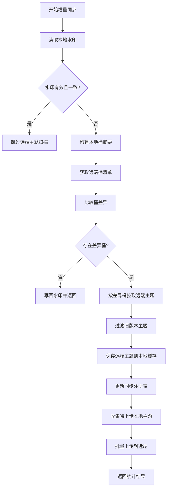
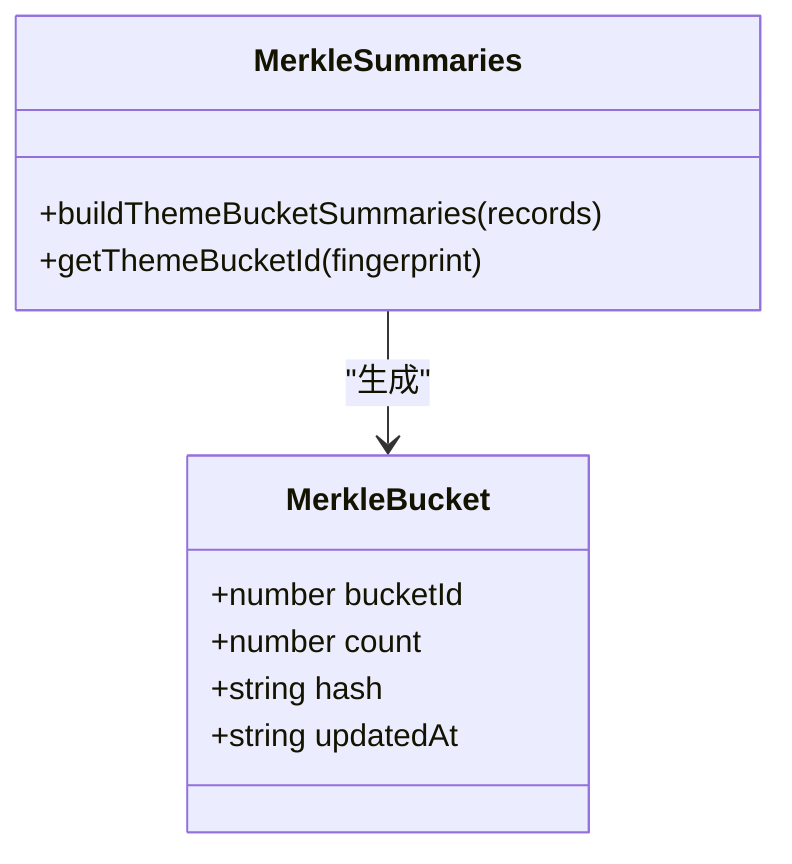
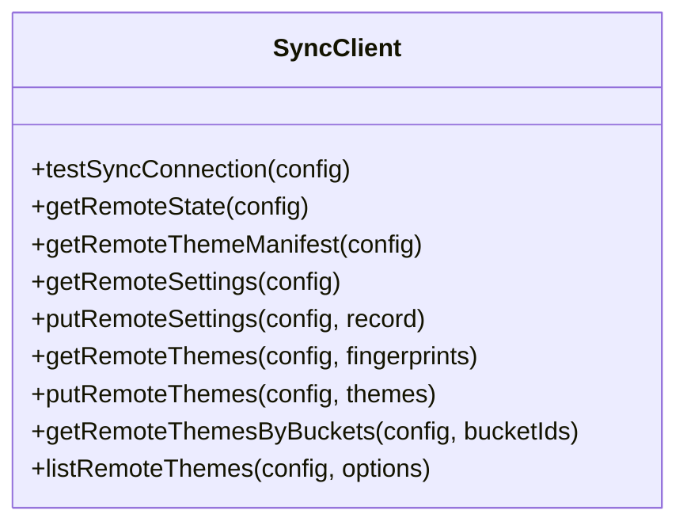
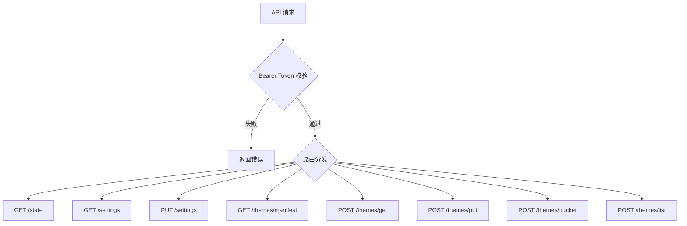
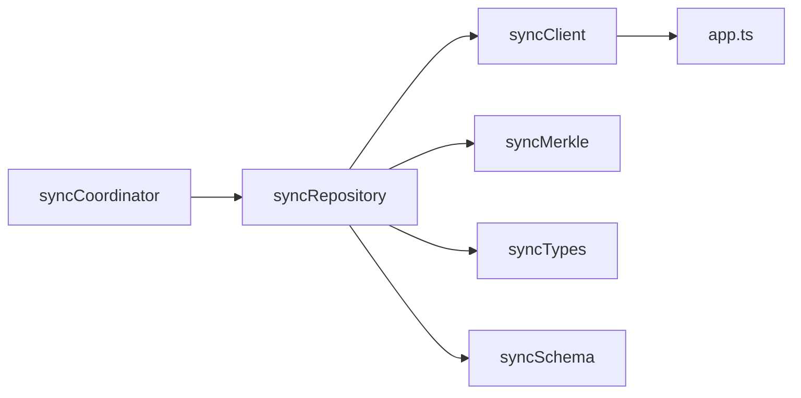
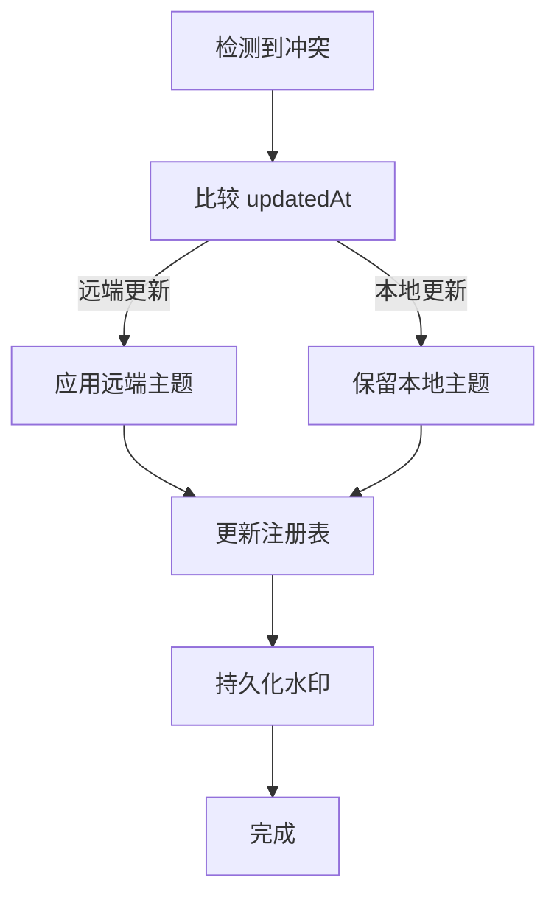

# 主题同步机制

<cite>
**本文引用的文件**   
- [sync-server/src/app.ts](file://sync-server/src/app.ts)
- [src/services/sync/syncClient.ts](file://src/services/sync/syncClient.ts)
- [src/services/sync/syncRepository.ts](file://src/services/sync/syncRepository.ts)
- [src/services/sync/syncCoordinator.ts](file://src/services/sync/syncCoordinator.ts)
- [src/services/sync/syncMerkle.ts](file://src/services/sync/syncMerkle.ts)
- [src/services/sync/syncTypes.ts](file://src/services/sync/syncTypes.ts)
- [src/services/sync/syncSchema.ts](file://src/services/sync/syncSchema.ts)
- [src/hooks/useThemeSyncAction.ts](file://src/hooks/useThemeSyncAction.ts)
</cite>

## 目录
1. [简介](#简介)
2. [项目结构](#项目结构)
3. [核心组件](#核心组件)
4. [架构总览](#架构总览)
5. [详细组件分析](#详细组件分析)
6. [依赖关系分析](#依赖关系分析)
7. [性能与优化](#性能与优化)
8. [安全机制](#安全机制)
9. [故障恢复与一致性](#故障恢复与一致性)
10. [结论](#结论)

## 简介
本文件面向 Folia Major 的主题同步机制，系统性说明以下方面：
- 主题数据同步协议：增量同步、冲突解决、数据一致性保证。
- 多设备同步实现：云存储、离线优先、自动合并。
- 版本兼容性管理：向后兼容、迁移策略、废弃处理。
- 同步性能优化：数据压缩、批量传输、断点续传。
- 安全机制：防止恶意主题上传和隐私泄露。
- 故障恢复：数据备份与灾难恢复。

该机制由客户端侧的协调器、仓库层、HTTP 适配器和服务端 API 共同组成，围绕“指纹 + 时间戳 + Merkle 桶摘要”的增量差异模型进行高效同步。

## 项目结构
与主题同步直接相关的代码主要分布在以下位置：
- 服务端 API：`sync-server/src/app.ts`
- 客户端 HTTP 适配器：`src/services/sync/syncClient.ts`
- 客户端同步仓库（业务编排）：`src/services/sync/syncRepository.ts`
- 客户端同步协调器（入口与状态机）：`src/services/sync/syncCoordinator.ts`
- Merkle 桶摘要工具：`src/services/sync/syncMerkle.ts`
- 类型定义与常量：`src/services/sync/syncTypes.ts`
- 数据校验与解析：`src/services/sync/syncSchema.ts`
- UI 触发钩子：`src/hooks/useThemeSyncAction.ts`

**图表来源**
- [src/hooks/useThemeSyncAction.ts:14-56](file://src/hooks/useThemeSyncAction.ts#L14-L56)
- [src/services/sync/syncCoordinator.ts:94-149](file://src/services/sync/syncCoordinator.ts#L94-L149)
- [src/services/sync/syncRepository.ts:146-188](file://src/services/sync/syncRepository.ts#L146-L188)
- [src/services/sync/syncClient.ts:38-62](file://src/services/sync/syncClient.ts#L38-L62)
- [sync-server/src/app.ts:121-143](file://sync-server/src/app.ts#L121-L143)

**章节来源**
- [src/hooks/useThemeSyncAction.ts:14-56](file://src/hooks/useThemeSyncAction.ts#L14-L56)
- [src/services/sync/syncCoordinator.ts:94-149](file://src/services/sync/syncCoordinator.ts#L94-L149)
- [src/services/sync/syncRepository.ts:146-188](file://src/services/sync/syncRepository.ts#L146-L188)
- [src/services/sync/syncClient.ts:38-62](file://src/services/sync/syncClient.ts#L38-L62)
- [sync-server/src/app.ts:121-143](file://sync-server/src/app.ts#L121-L143)

## 核心组件
- 同步协调器：负责启动同步、串行化并发、结果汇总与事件广播。
- 同步仓库：封装设置与主题的拉取/推送、本地缓存与注册表维护、水印持久化。
- HTTP 客户端：统一请求构造、鉴权、响应解析与错误包装。
- Merkle 桶摘要：按指纹哈希分桶，计算计数、更新时间与异或哈希，用于快速差异检测。
- 类型与模式：定义同步配置、远程状态、主题记录、桶摘要、导出包等契约。
- 服务端 API：提供健康检查、状态查询、设置读写、主题清单与批量读写接口。

**章节来源**
- [src/services/sync/syncCoordinator.ts:94-149](file://src/services/sync/syncCoordinator.ts#L94-L149)
- [src/services/sync/syncRepository.ts:146-188](file://src/services/sync/syncRepository.ts#L146-L188)
- [src/services/sync/syncClient.ts:38-62](file://src/services/sync/syncClient.ts#L38-L62)
- [src/services/sync/syncMerkle.ts:10-49](file://src/services/sync/syncMerkle.ts#L10-L49)
- [src/services/sync/syncTypes.ts:7-119](file://src/services/sync/syncTypes.ts#L7-L119)
- [sync-server/src/app.ts:315-520](file://sync-server/src/app.ts#L315-L520)

## 架构总览
主题同步采用“客户端发起、服务端权威、指纹+时间戳判定新旧、桶摘要做增量差异”的整体架构。

**图表来源**
- [src/hooks/useThemeSyncAction.ts:25-54](file://src/hooks/useThemeSyncAction.ts#L25-L54)
- [src/services/sync/syncCoordinator.ts:94-149](file://src/services/sync/syncCoordinator.ts#L94-L149)
- [src/services/sync/syncRepository.ts:379-431](file://src/services/sync/syncRepository.ts#L379-L431)
- [src/services/sync/syncClient.ts:68-133](file://src/services/sync/syncClient.ts#L68-L133)
- [sync-server/src/app.ts:326-494](file://sync-server/src/app.ts#L326-L494)

## 详细组件分析

### 同步协调器：流程编排与状态机
协调器负责：
- 初始化时触发一次主题同步。
- 串行化同步任务，避免重复执行。
- 根据选项决定是否拉取远端设置、是否推送本地设置。
- 汇总上传/下载数量、桶差异数、是否跳过远端扫描等指标。
- 在浏览器环境触发 `folia-themes-synced` 自定义事件，供 UI 刷新。

**图表来源**
- [src/services/sync/syncCoordinator.ts:94-149](file://src/services/sync/syncCoordinator.ts#L94-L149)

**章节来源**
- [src/services/sync/syncCoordinator.ts:49-53](file://src/services/sync/syncCoordinator.ts#L49-L53)
- [src/services/sync/syncCoordinator.ts:94-149](file://src/services/sync/syncCoordinator.ts#L94-L149)

### 同步仓库：增量差异、冲突解决与一致性
仓库层承担核心同步逻辑：
- 读取/写入水印，记录远端主题更新时间、主题数量与本地注册表签名，用于快速判断是否需要全量扫描。
- 通过 Merkle 桶摘要对比本地与远端差异，仅对差异桶进行主题级拉取与上传。
- 使用“指纹 + updatedAt”判定新旧，避免覆盖较新的本地版本。
- 将远端主题保存到本地缓存，并更新同步注册表；支持批量上传到远端。
- 提供导出/导入同步库包的能力，便于跨设备迁移。

**图表来源**
- [src/services/sync/syncRepository.ts:73-144](file://src/services/sync/syncRepository.ts#L73-L144)
- [src/services/sync/syncRepository.ts:379-431](file://src/services/sync/syncRepository.ts#L379-L431)

**章节来源**
- [src/services/sync/syncRepository.ts:73-144](file://src/services/sync/syncRepository.ts#L73-L144)
- [src/services/sync/syncRepository.ts:379-431](file://src/services/sync/syncRepository.ts#L379-L431)

### Merkle 桶摘要：增量差异算法
- 使用固定数量的桶（256），按指纹哈希映射到桶。
- 每个桶维护计数、更新时间与异或哈希，用于快速比较集合差异。
- 客户端与服务端共享相同的哈希函数与桶分配规则，确保差异计算一致。

**图表来源**
- [src/services/sync/syncMerkle.ts:10-49](file://src/services/sync/syncMerkle.ts#L10-L49)

**章节来源**
- [src/services/sync/syncMerkle.ts:10-49](file://src/services/sync/syncMerkle.ts#L10-L49)

### HTTP 客户端：统一请求与错误处理
- 统一注入 Authorization 头，基于配置的认证令牌访问服务端。
- 对非 2xx 响应抛出带状态码的错误对象，便于上层捕获与展示。
- 提供状态、清单、设置、主题批量读写、按桶拉取、分页列表等方法。

**图表来源**
- [src/services/sync/syncClient.ts:19-152](file://src/services/sync/syncClient.ts#L19-L152)

**章节来源**
- [src/services/sync/syncClient.ts:19-152](file://src/services/sync/syncClient.ts#L19-L152)

### 服务端 API：权威存储与批量操作
- 提供 `/health`、`/state`、`/settings`、`/themes/manifest`、`/themes/get`、`/themes/put`、`/themes/bucket`、`/themes/list` 等接口。
- 使用 D1 数据库存储设置与主题，并通过桶表维护索引与聚合信息。
- 所有 API 受 Bearer Token 保护，并对输入进行严格校验与批大小限制。

**图表来源**
- [sync-server/src/app.ts:121-143](file://sync-server/src/app.ts#L121-L143)
- [sync-server/src/app.ts:315-520](file://sync-server/src/app.ts#L315-L520)

**章节来源**
- [sync-server/src/app.ts:121-143](file://sync-server/src/app.ts#L121-L143)
- [sync-server/src/app.ts:315-520](file://sync-server/src/app.ts#L315-L520)

## 依赖关系分析
- 协调器依赖仓库层进行具体同步逻辑，仓库层依赖 HTTP 客户端与服务端 API。
- 仓库层依赖 Merkle 工具进行差异计算，依赖类型定义与模式校验保证数据结构正确性。
- 客户端与服务端通过统一的类型契约与校验逻辑保持前后端一致性。

**图表来源**
- [src/services/sync/syncCoordinator.ts:1-17](file://src/services/sync/syncCoordinator.ts#L1-L17)
- [src/services/sync/syncRepository.ts:1-35](file://src/services/sync/syncRepository.ts#L1-L35)
- [src/services/sync/syncClient.ts:1-14](file://src/services/sync/syncClient.ts#L1-L14)
- [sync-server/src/app.ts:1-4](file://sync-server/src/app.ts#L1-L4)

**章节来源**
- [src/services/sync/syncCoordinator.ts:1-17](file://src/services/sync/syncCoordinator.ts#L1-L17)
- [src/services/sync/syncRepository.ts:1-35](file://src/services/sync/syncRepository.ts#L1-L35)
- [src/services/sync/syncClient.ts:1-14](file://src/services/sync/syncClient.ts#L1-L14)
- [sync-server/src/app.ts:1-4](file://sync-server/src/app.ts#L1-L4)

## 性能与优化
- 增量同步：通过 Merkle 桶摘要与水印机制，仅在桶发生变化时拉取相关主题，减少网络与 IO。
- 批量传输：服务端与客户端均支持批量主题上传与拉取，降低请求次数。
- 分页与游标：主题列表接口支持游标分页，避免一次性加载全部数据。
- 断点续传：当前实现未显式实现断点续传；可通过水印与本地注册表状态恢复中断后的同步流程。
- 数据压缩：未在同步协议中启用传输层压缩；可在部署网关或 CDN 层启用 gzip/br 以提升吞吐。

[本节为通用性能建议，不直接分析具体文件]

## 安全机制
- 认证：服务端要求 Bearer Token，客户端在每个请求中携带 Authorization 头。
- 输入校验：服务端对主题字段、时间戳、桶 ID、批大小等进行严格校验，拒绝非法数据。
- 最小权限：仅暴露必要的 API，避免敏感信息泄露。
- 主题清洗：客户端在保存主题前会进行主题清洗，降低恶意脚本风险。

**章节来源**
- [sync-server/src/app.ts:121-143](file://sync-server/src/app.ts#L121-L143)
- [sync-server/src/app.ts:388-474](file://sync-server/src/app.ts#L388-L474)
- [src/services/sync/syncClient.ts:38-62](file://src/services/sync/syncClient.ts#L38-L62)

## 故障恢复与一致性
- 冲突解决：以“updatedAt”作为最终一致性依据，远端较新则覆盖本地，反之保留本地。
- 一致性保证：服务端使用 ON CONFLICT 条件更新，确保同一指纹只保留较新版本。
- 水印机制：客户端持久化水印，避免重复扫描；当本地注册表变化时，强制重新计算差异。
- 导出/导入：支持导出同步库包（包含设置与主题），导入后落盘并可推送到远端，便于灾难恢复。
- 错误处理：客户端抛出带状态码的错误对象，协调器捕获并设置同步状态，UI 可据此提示用户。

**图表来源**
- [src/services/sync/syncRepository.ts:66-71](file://src/services/sync/syncRepository.ts#L66-L71)
- [sync-server/src/app.ts:435-470](file://sync-server/src/app.ts#L435-L470)

**章节来源**
- [src/services/sync/syncRepository.ts:66-71](file://src/services/sync/syncRepository.ts#L66-L71)
- [sync-server/src/app.ts:435-470](file://sync-server/src/app.ts#L435-L470)

## 版本兼容性管理
- 全局 schemaVersion：服务端与客户端均声明并校验 schemaVersion，确保协议兼容。
- 模式校验：客户端在服务端响应进入业务逻辑前进行严格解析，不兼容或非法数据会被丢弃。
- 向后兼容：客户端在解析远端清单与状态时，若字段缺失或类型不符，返回空或默认值，避免崩溃。
- 迁移策略：通过水印与注册表签名，结合历史数据迁移函数（如遗留网易云主题记录），逐步过渡到新结构。
- 废弃处理：对不再使用的字段或接口，客户端应忽略而非报错，服务端应继续兼容旧格式一段时间。

**章节来源**
- [src/services/sync/syncTypes.ts:7-119](file://src/services/sync/syncTypes.ts#L7-L119)
- [src/services/sync/syncSchema.ts:178-241](file://src/services/sync/syncSchema.ts#L178-L241)
- [sync-server/src/app.ts:23-28](file://sync-server/src/app.ts#L23-L28)

## 结论
Folia Major 的主题同步机制以“指纹 + 时间戳 + Merkle 桶摘要”为核心，实现了高效的增量同步与可靠的冲突解决。通过协调器与仓库层的分层设计，系统具备良好的可扩展性与可维护性。配合严格的输入校验与认证机制，保障了安全性与数据一致性。未来可在传输层压缩、断点续传与更细粒度的冲突策略上进一步优化，以满足更大规模的多设备同步场景。