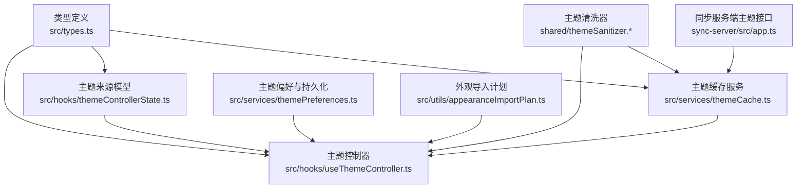
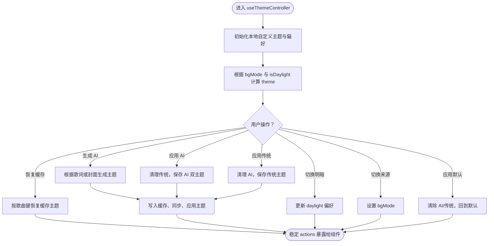
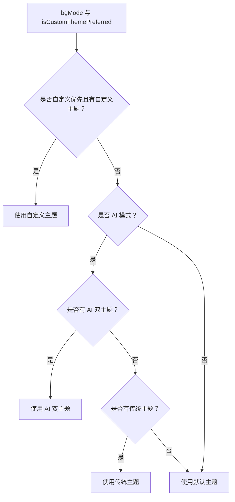
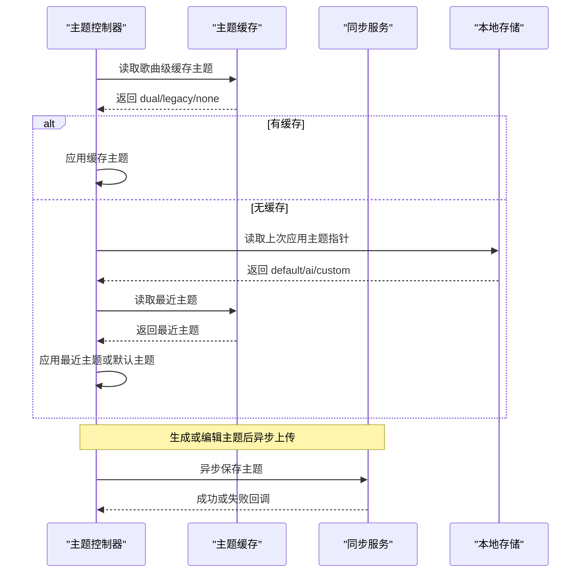
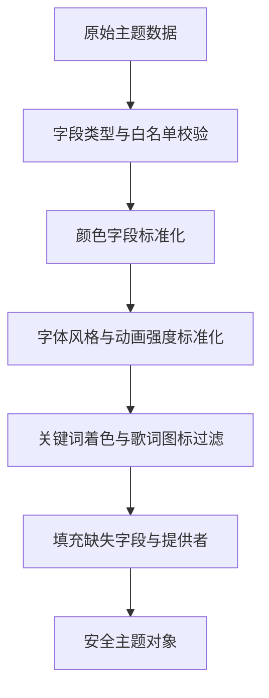
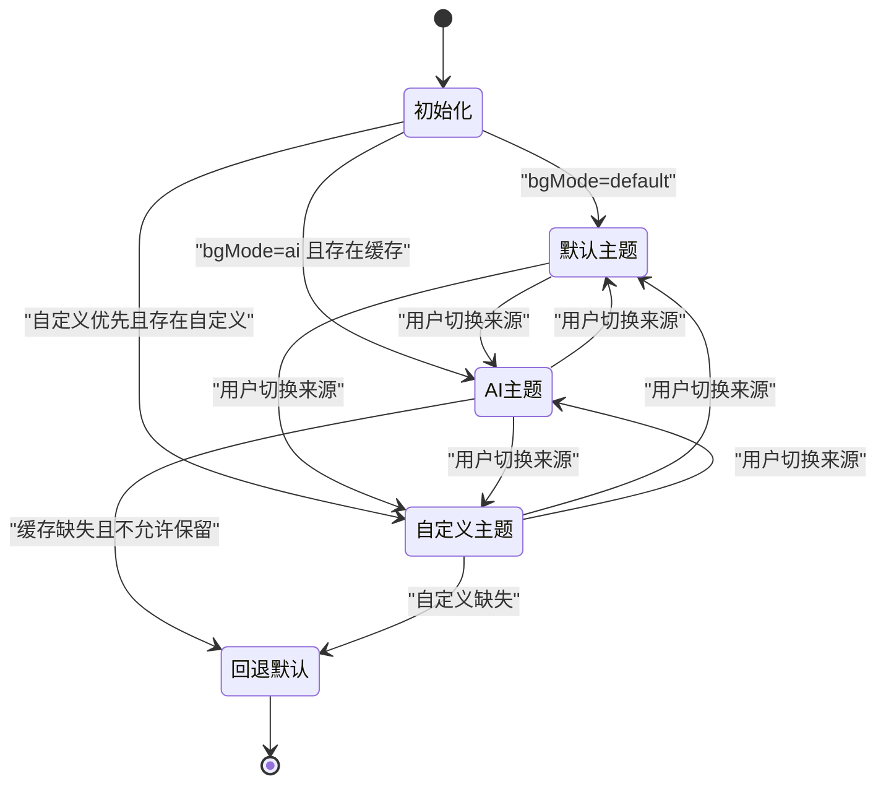
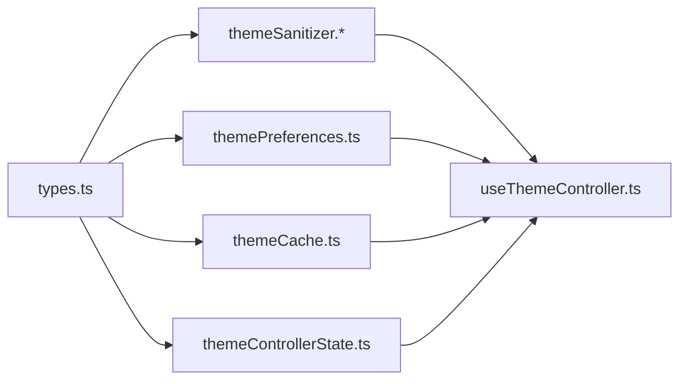

# 主题架构设计

<cite>
**本文引用的文件**   
- [types.ts](file://src/types.ts)
- [useThemeController.ts](file://src/hooks/useThemeController.ts)
- [themeControllerState.ts](file://src/hooks/themeControllerState.ts)
- [themeCache.ts](file://src/services/themeCache.ts)
- [themePreferences.ts](file://src/services/themePreferences.ts)
- [themeSanitizer.mjs](file://shared/themeSanitizer.mjs)
- [themeSanitizer.cjs](file://shared/themeSanitizer.cjs)
- [appearanceImportPlan.ts](file://src/utils/appearanceImportPlan.ts)
- [app.ts](file://sync-server/src/app.ts)
</cite>

## 目录
1. [引言](#引言)
2. [项目结构](#项目结构)
3. [核心数据模型](#核心数据模型)
4. [主题控制器与状态管理](#主题控制器与状态管理)
5. [主题来源与优先级](#主题来源与优先级)
6. [主题缓存与同步机制](#主题缓存与同步机制)
7. [主题安全与沙箱策略](#主题安全与沙箱策略)
8. [主题生命周期流程](#主题生命周期流程)
9. [依赖关系分析](#依赖关系分析)
10. [性能与可维护性建议](#性能与可维护性建议)
11. [故障排查指南](#故障排查指南)
12. [结论](#结论)

## 引言
本文件面向 Folia Major 的主题子系统，目标是给出从数据模型、控制器逻辑、来源优先级、缓存同步到安全沙箱和生命周期的完整技术说明。文档既适合前端开发者理解主题渲染管线，也适合后端或同步服务开发者理解主题数据的存储、校验与跨端一致性。

## 项目结构
主题相关代码主要分布在以下位置：
- 类型定义集中在 `src/types.ts`，提供 `Theme`、`DualTheme`、`ThemeMode` 等基础类型。
- 主题控制器位于 `src/hooks/useThemeController.ts`，负责状态、切换、生成、恢复与应用。
- 主题来源建模与默认值构建位于 `src/hooks/themeControllerState.ts`。
- 主题缓存读取与迁移逻辑位于 `src/services/themeCache.ts`。
- 主题偏好与持久化开关位于 `src/services/themePreferences.ts`。
- 主题数据清洗与回退模板位于 `shared/themeSanitizer.mjs` 与 `shared/themeSanitizer.cjs`。
- 外观导入计划中涉及主题开关组合行为，位于 `src/utils/appearanceImportPlan.ts`。
- 同步服务端主题接口位于 `sync-server/src/app.ts`。



**图表来源**
- [types.ts:87-118](file://src/types.ts#L87-L118)
- [useThemeController.ts:1-40](file://src/hooks/useThemeController.ts#L1-L40)
- [themeControllerState.ts:1-25](file://src/hooks/themeControllerState.ts#L1-L25)
- [themeCache.ts:1-14](file://src/services/themeCache.ts#L1-L14)
- [themePreferences.ts:1-13](file://src/services/themePreferences.ts#L1-L13)
- [themeSanitizer.mjs:1-35](file://shared/themeSanitizer.mjs#L1-L35)
- [appearanceImportPlan.ts:473-494](file://src/utils/appearanceImportPlan.ts#L473-L494)
- [app.ts:373-395](file://sync-server/src/app.ts#L373-L395)

**章节来源**
- [types.ts:87-118](file://src/types.ts#L87-L118)
- [useThemeController.ts:1-40](file://src/hooks/useThemeController.ts#L1-L40)
- [themeControllerState.ts:1-25](file://src/hooks/themeControllerState.ts#L1-L25)
- [themeCache.ts:1-14](file://src/services/themeCache.ts#L1-L14)
- [themePreferences.ts:1-13](file://src/services/themePreferences.ts#L1-L13)
- [themeSanitizer.mjs:1-35](file://shared/themeSanitizer.mjs#L1-L35)
- [appearanceImportPlan.ts:473-494](file://src/utils/appearanceImportPlan.ts#L473-L494)
- [app.ts:373-395](file://sync-server/src/app.ts#L373-L395)

## 核心数据模型
Folia Major 的主题体系以单面主题和双模式主题为基本单位，并通过枚举区分主题来源模式。

- `Theme`：表示一个单面主题，包含名称、背景色、主色、强调色、次色、字体风格、动画强度、可选的关键词着色与歌词图标、提供者标识与描述。
- `DualTheme`：由浅色 `light` 与深色 `dark` 两个 `Theme` 组成，用于同时支持明暗模式。
- `ThemeMode`：主题来源模式，取值为 `default`（默认）、`ai`（AI 或封面衍生）、`custom`（自定义）。

这些类型是主题控制器、缓存、同步与 UI 展示的共同契约。

```mermaid
classDiagram
class Theme {
+string name
+string backgroundColor
+string primaryColor
+string accentColor
+string secondaryColor
+string fontStyle
+string fontFamily
+string[] fontFamilyStack
+number fontWeight
+string animationIntensity
+{word : string,color : string}[] wordColors
+string[] lyricsIcons
+string provider
+string description
}
class DualTheme {
+Theme light
+Theme dark
}
class ThemeMode {
<<enumeration>>
default
ai
custom
}
DualTheme --> Theme : "包含"
```

**图表来源**
- [types.ts:87-118](file://src/types.ts#L87-L118)

**章节来源**
- [types.ts:87-118](file://src/types.ts#L87-L118)

## 主题控制器与状态管理
`useThemeController` 是主题系统的中枢。它维护当前应用主题、AI 双主题、传统单主题、自定义双主题、是否优先使用自定义主题、歌曲级自动切换与自动生成开关、主题生成来源、背景模式以及生成中的状态。

关键职责包括：
- 初始化并加载本地自定义主题与偏好。
- 根据 `bgMode`、`isDaylight`、`aiTheme`、`legacyTheme`、`customTheme` 计算最终 `theme`。
- 处理明暗模式切换、背景模式切换、重置主题、应用默认主题。
- 应用 AI 双主题与传统单主题，并写入缓存与同步队列。
- 恢复上次使用的主题指针或歌曲级缓存主题。
- 调用歌词文本或封面颜色生成 AI 主题，并在缺少 API Key 时回退到封面衍生主题。
- 保存自定义主题与编辑后的 AI 主题。
- 管理三个互斥开关：自定义主题优先、歌曲级自动切换、歌曲级自动生成。



**图表来源**
- [useThemeController.ts:130-293](file://src/hooks/useThemeController.ts#L130-L293)
- [useThemeController.ts:323-359](file://src/hooks/useThemeController.ts#L323-L359)
- [useThemeController.ts:488-565](file://src/hooks/useThemeController.ts#L488-L565)
- [useThemeController.ts:608-690](file://src/hooks/useThemeController.ts#L608-L690)

**章节来源**
- [useThemeController.ts:130-293](file://src/hooks/useThemeController.ts#L130-L293)
- [useThemeController.ts:323-359](file://src/hooks/useThemeController.ts#L323-L359)
- [useThemeController.ts:488-565](file://src/hooks/useThemeController.ts#L488-L565)
- [useThemeController.ts:608-690](file://src/hooks/useThemeController.ts#L608-L690)

## 主题来源与优先级
主题来源分为三类：
- 默认主题：基于系统明暗模式选择内置默认主题。
- AI 主题：由歌词文本通过 AI 生成，或由封面颜色派生。
- 自定义主题：用户创建或编辑的双主题。

优先级由 `bgMode` 与“自定义主题优先”开关共同决定：
- 如果启用自定义主题优先且存在自定义主题，则优先使用自定义主题。
- 否则，若处于 AI 模式，则使用已生成的 AI 双主题；若无 AI 双主题但有传统主题，则使用传统主题。
- 否则回退到默认主题。

来源模型还暴露每个来源是否可用、是否可编辑、当前显示的主题名称与色板颜色，便于 UI 呈现。



**图表来源**
- [useThemeController.ts:258-293](file://src/hooks/useThemeController.ts#L258-L293)
- [themeControllerState.ts:57-103](file://src/hooks/themeControllerState.ts#L57-L103)

**章节来源**
- [useThemeController.ts:258-293](file://src/hooks/useThemeController.ts#L258-L293)
- [themeControllerState.ts:57-103](file://src/hooks/themeControllerState.ts#L57-L103)

## 主题缓存与同步机制
主题缓存承担以下职责：
- 按歌曲键存储与读取 AI 双主题与传统主题。
- 将旧版主题迁移到新键名，避免重复查询。
- 通过指纹注册表查找云端同步主题，再回落到本地缓存。
- 提供“最近一次主题”读取能力，用于恢复最后使用的主题指针。

同步机制方面：
- 客户端在生成或编辑主题后异步上传到同步服务，失败不阻塞本地操作。
- 同步服务端对主题输入进行批量校验与分页列表，限制批次大小与列表长度。
- 客户端通过 `saveSyncedThemeWithoutBlocking` 保证本地体验不受同步服务可用性影响。



**图表来源**
- [themeCache.ts:15-65](file://src/services/themeCache.ts#L15-L65)
- [themeCache.ts:67-75](file://src/services/themeCache.ts#L67-L75)
- [useThemeController.ts:516-565](file://src/hooks/useThemeController.ts#L516-L565)
- [useThemeController.ts:645-653](file://src/hooks/useThemeController.ts#L645-L653)
- [app.ts:373-395](file://sync-server/src/app.ts#L373-L395)

**章节来源**
- [themeCache.ts:15-65](file://src/services/themeCache.ts#L15-L65)
- [themeCache.ts:67-75](file://src/services/themeCache.ts#L67-L75)
- [useThemeController.ts:516-565](file://src/hooks/useThemeController.ts#L516-L565)
- [useThemeController.ts:645-653](file://src/hooks/useThemeController.ts#L645-L653)
- [app.ts:373-395](file://sync-server/src/app.ts#L373-L395)

## 主题安全与沙箱策略
主题数据本身不包含可执行代码，因此“沙箱”主要体现在数据清洗与回退上：
- 所有主题数据在进入应用前都会经过 `sanitizeTheme` 与 `sanitizeDualTheme`。
- 颜色字段仅接受合法十六进制字符串，非法值会被替换为回退颜色。
- 字体风格与动画强度只允许白名单值，非法值被替换为回退值。
- 关键词着色与歌词图标会被过滤、截断并规范化。
- 缺失字段会填充默认值，确保渲染层始终拿到有效主题对象。
- 自定义主题还会额外设置提供者标识，避免与 AI 主题混淆。

这种策略不是运行时沙箱，而是数据契约层面的强类型清洗，防止恶意或损坏的主题数据破坏界面。



**图表来源**
- [themeSanitizer.mjs:104-136](file://shared/themeSanitizer.mjs#L104-L136)
- [themeSanitizer.cjs:106-138](file://shared/themeSanitizer.cjs#L106-L138)
- [useThemeController.ts:61-86](file://src/hooks/useThemeController.ts#L61-L86)

**章节来源**
- [themeSanitizer.mjs:104-136](file://shared/themeSanitizer.mjs#L104-L136)
- [themeSanitizer.cjs:106-138](file://shared/themeSanitizer.cjs#L106-L138)
- [useThemeController.ts:61-86](file://src/hooks/useThemeController.ts#L61-L86)

## 主题生命周期流程
主题从加载到应用的完整流程如下：

1. **启动阶段**
   - 读取本地自定义主题与“自定义主题优先”标志。
   - 读取自动切换与自动生成开关、主题生成来源、动画强度与上次应用主题指针。
   - 初始化控制器状态，包括当前主题、AI 双主题、传统主题、自定义主题与背景模式。

2. **首次渲染**
   - 根据 `bgMode` 与 `isDaylight` 计算初始 `theme`。
   - 若为自定义优先且存在自定义主题，则直接应用自定义主题。
   - 若为 AI 模式，则尝试恢复歌曲级缓存主题；否则回退到最近主题或默认主题。

3. **用户交互**
   - 切换明暗模式：更新 daylight 偏好，重新计算当前主题。
   - 切换主题来源：设置 `bgMode`，触发主题重算。
   - 应用默认主题：清除 AI 与传统主题，回到默认。
   - 应用 AI 主题：清洗、保存、同步并切换到 AI 模式。
   - 应用传统主题：清洗、保存并切换到 AI 模式（兼容旧数据）。
   - 应用自定义主题：切换到自定义模式。

4. **AI 主题生成**
   - 若主题为封面来源，则从封面提取颜色并生成内置双主题。
   - 若主题为歌词来源，则构造提示词并调用 AI 生成双主题。
   - 生成成功后写入歌曲级缓存与同步队列，并应用主题。
   - 若缺少 API Key，则回退到封面衍生主题。

5. **恢复与回退**
   - 根据上次应用主题指针恢复自定义、AI 或默认主题。
   - 若歌曲级缓存命中，则标记该歌曲拥有本地 AI 主题。
   - 若未命中且允许回退，则使用最近主题；否则保持当前或回退默认。



**图表来源**
- [useThemeController.ts:146-178](file://src/hooks/useThemeController.ts#L146-L178)
- [useThemeController.ts:258-293](file://src/hooks/useThemeController.ts#L258-L293)
- [useThemeController.ts:488-565](file://src/hooks/useThemeController.ts#L488-L565)
- [useThemeController.ts:608-690](file://src/hooks/useThemeController.ts#L608-L690)

**章节来源**
- [useThemeController.ts:146-178](file://src/hooks/useThemeController.ts#L146-L178)
- [useThemeController.ts:258-293](file://src/hooks/useThemeController.ts#L258-L293)
- [useThemeController.ts:488-565](file://src/hooks/useThemeController.ts#L488-L565)
- [useThemeController.ts:608-690](file://src/hooks/useThemeController.ts#L608-L690)

## 依赖关系分析
主题控制器的依赖关系清晰分层：
- 类型层：`Theme`、`DualTheme`、`ThemeMode` 提供统一数据结构。
- 清洗层：`themeSanitizer` 保证数据合法性与回退。
- 偏好层：`themePreferences` 管理持久化开关与动画强度。
- 缓存层：`themeCache` 提供歌曲级与最近主题读写。
- 来源层：`themeControllerState` 构建来源选项与默认值。
- 控制器层：`useThemeController` 协调以上模块并暴露稳定动作。



**图表来源**
- [types.ts:87-118](file://src/types.ts#L87-L118)
- [themeSanitizer.mjs:104-136](file://shared/themeSanitizer.mjs#L104-L136)
- [themePreferences.ts:1-13](file://src/services/themePreferences.ts#L1-L13)
- [themeCache.ts:1-14](file://src/services/themeCache.ts#L1-L14)
- [themeControllerState.ts:1-25](file://src/hooks/themeControllerState.ts#L1-L25)
- [useThemeController.ts:1-39](file://src/hooks/useThemeController.ts#L1-L39)

**章节来源**
- [types.ts:87-118](file://src/types.ts#L87-L118)
- [themeSanitizer.mjs:104-136](file://shared/themeSanitizer.mjs#L104-L136)
- [themePreferences.ts:1-13](file://src/services/themePreferences.ts#L1-L13)
- [themeCache.ts:1-14](file://src/services/themeCache.ts#L1-L14)
- [themeControllerState.ts:1-25](file://src/hooks/themeControllerState.ts#L1-L25)
- [useThemeController.ts:1-39](file://src/hooks/useThemeController.ts#L1-L39)

## 性能与可维护性建议
- 控制器动作使用稳定回调包装，避免每次渲染产生新函数引用，从而减少下游视图模型的无效重渲染。
- 主题生成采用并发保护，同一歌曲不会重复发起生成请求。
- 同步上传采用非阻塞方式，避免网络失败影响本地体验。
- 主题数据清洗集中实现，前后端共享，降低不一致风险。
- 建议为新增主题字段增加清洗规则与测试用例，确保向后兼容。
- 建议在主题切换路径中加入最小化重绘策略，例如仅在背景色或字体变化时触发必要更新。

[本节为通用建议，不直接分析具体文件]

## 故障排查指南
常见问题与定位方法：
- 主题未生效：检查 `bgMode` 是否为预期值，确认 `isCustomThemePreferred` 与 `customTheme` 是否存在。
- AI 主题生成失败：查看是否缺少 API Key，控制器会自动回退到封面衍生主题；检查提示词是否为空。
- 歌曲级主题未恢复：确认 `songThemeAutoSwitchEnabled` 是否开启，检查歌曲键对应的缓存键是否存在。
- 自定义主题丢失：检查本地存储键是否正确写入，确认主题对象是否通过有效性校验。
- 同步失败：查看控制台警告，确认同步服务是否可用；本地主题仍应正常应用。

**章节来源**
- [useThemeController.ts:672-685](file://src/hooks/useThemeController.ts#L672-L685)
- [useThemeController.ts:516-565](file://src/hooks/useThemeController.ts#L516-L565)
- [useThemeController.ts:103-122](file://src/hooks/useThemeController.ts#L103-L122)

## 结论
Folia Major 的主题架构以清晰的数据模型为基础，通过控制器统一管理状态、来源优先级与生命周期，借助清洗器保障数据安全，通过缓存与同步提升跨设备一致性。其设计兼顾用户体验与工程可维护性，适合继续扩展新的主题来源与可视化效果。

[本节为总结，不直接分析具体文件]