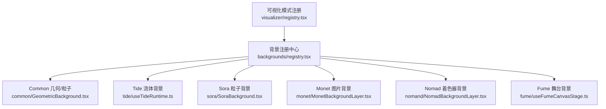
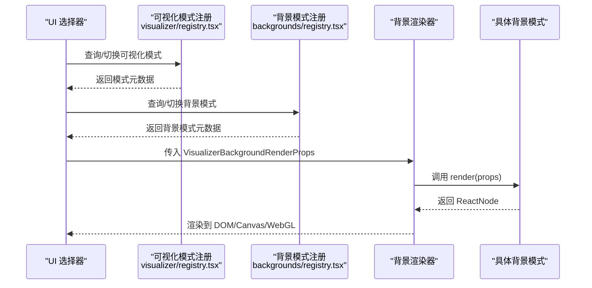
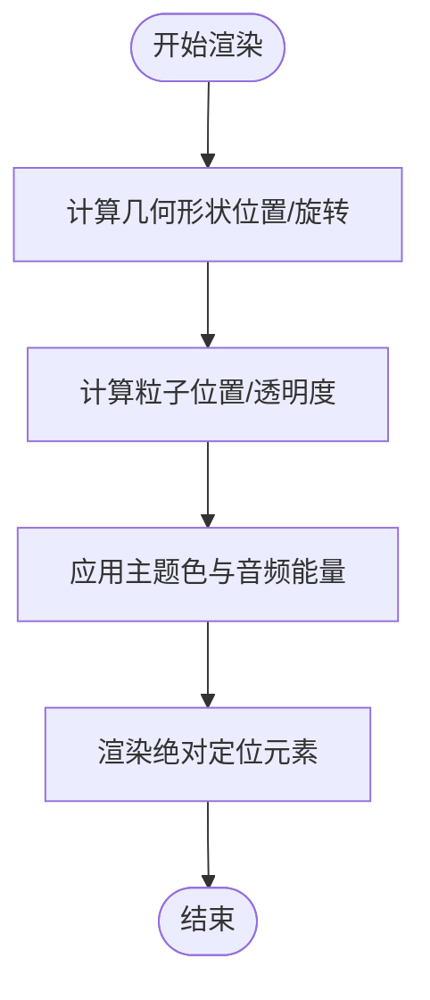
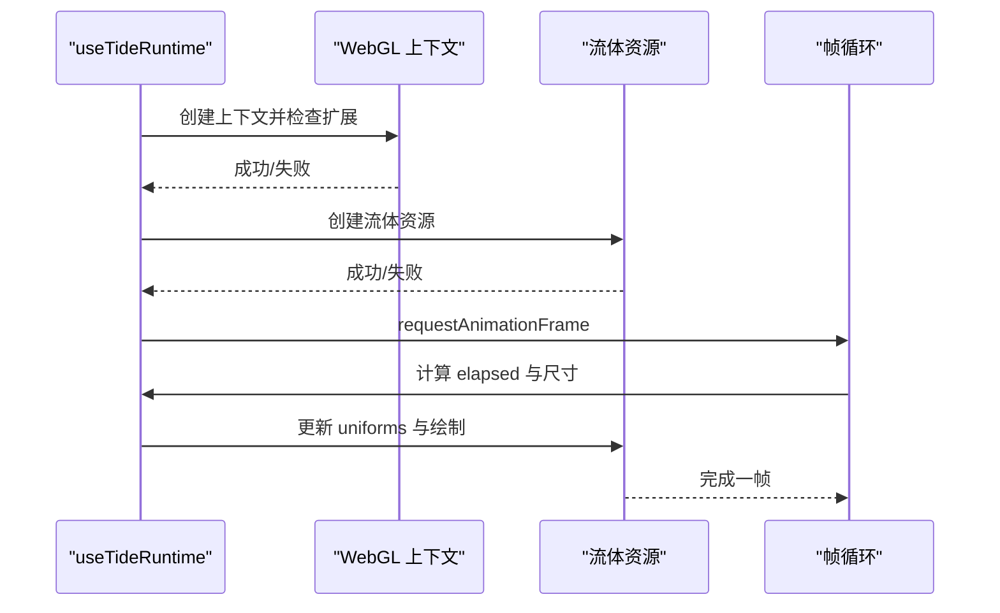
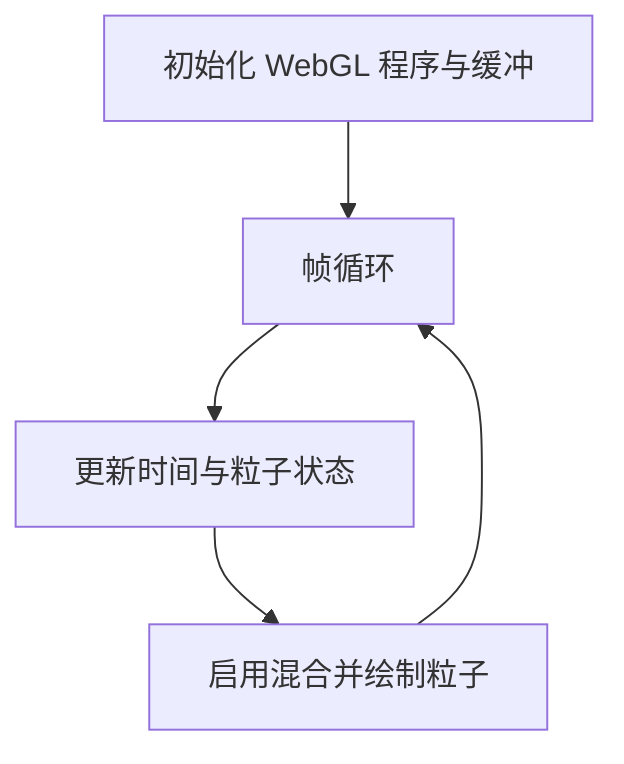
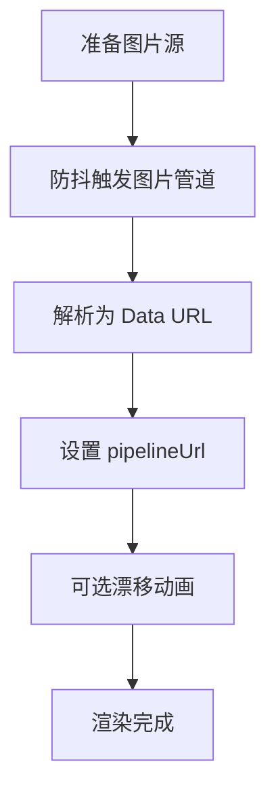
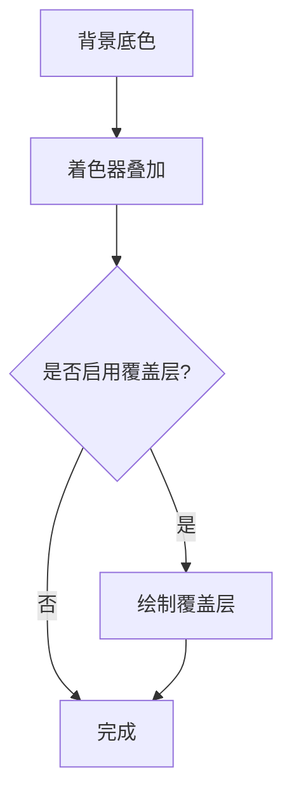
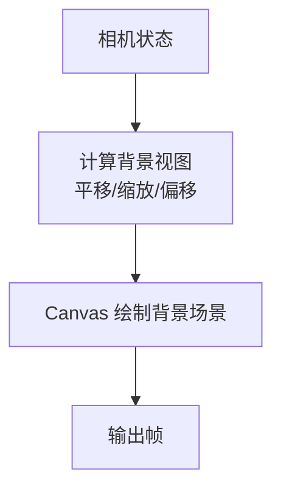
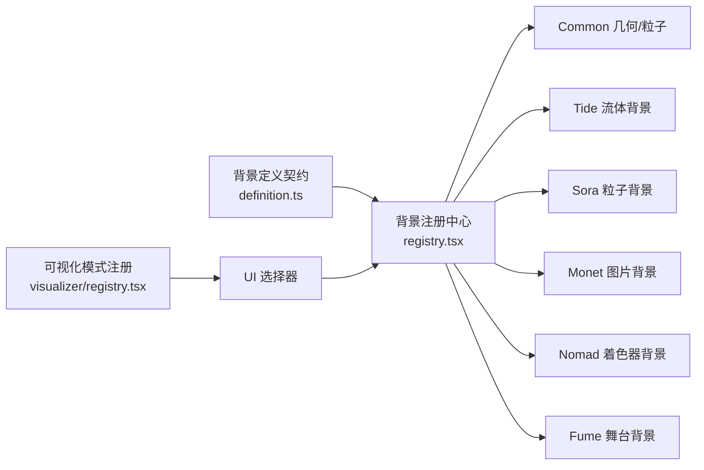

# 动态背景效果

<cite>
**本文引用的文件**   
- [src/components/visualizer/backgrounds/definition.ts](file://src/components/visualizer/backgrounds/definition.ts)
- [src/components/visualizer/backgrounds/registry.tsx](file://src/components/visualizer/backgrounds/registry.tsx)
- [src/components/visualizer/backgrounds/common/GeometricBackground.tsx](file://src/components/visualizer/backgrounds/common/GeometricBackground.tsx)
- [src/components/visualizer/backgrounds/tide/useTideRuntime.ts](file://src/components/visualizer/backgrounds/tide/useTideRuntime.ts)
- [src/components/visualizer/backgrounds/sora/SoraBackground.tsx](file://src/components/visualizer/backgrounds/sora/SoraBackground.tsx)
- [src/components/visualizer/backgrounds/monet/MonetBackgroundLayer.tsx](file://src/components/visualizer/backgrounds/monet/MonetBackgroundLayer.tsx)
- [src/components/visualizer/backgrounds/nomand/NomadBackgroundLayer.tsx](file://src/components/visualizer/backgrounds/nomand/NomadBackgroundLayer.tsx)
- [src/components/visualizer/fume/useFumeCanvasStage.ts](file://src/components/visualizer/fume/useFumeCanvasStage.ts)
- [src/components/visualizer/fume/fumeCameraStep.ts](file://src/components/visualizer/fume/fumeCameraStep.ts)
- [src/components/visualizer/runtime.ts](file://src/components/visualizer/runtime.ts)
- [src/components/visualizer/registry.tsx](file://src/components/visualizer/registry.tsx)
- [dist-mods/tide-background/tide/runtime.mjs](file://dist-mods/tide-background/tide/runtime.mjs)
- [src/mods/folium/registries/backgrounds.tsx](file://src/mods/folium/registries/backgrounds.tsx)
</cite>

## 目录
1. [简介](#简介)
2. [项目结构](#项目结构)
3. [核心组件](#核心组件)
4. [架构总览](#架构总览)
5. [详细组件分析](#详细组件分析)
6. [依赖关系分析](#依赖关系分析)
7. [性能考量](#性能考量)
8. [故障排查指南](#故障排查指南)
9. [结论](#结论)
10. [附录：开发新背景效果的指南](#附录开发新背景效果的指南)

## 简介
本技术文档聚焦 Folia Major 的动态背景效果系统，覆盖以下方面：
- 背景效果类型与实现原理：渐变、粒子、几何图形、流体模拟等。
- 渲染管线：WebGL 着色器、Canvas 绘制与 CSS 动画的使用场景。
- 性能优化：GPU 加速、内存管理与帧率控制。
- 配置系统：参数调节、预设管理与用户自定义。
- 主题集成：视觉效果与色彩方案的协调统一。
- 开发指南：如何创建新的背景效果并接入注册表。

## 项目结构
动态背景效果位于可视化子系统内，采用“按模式（mode）拆分 + 集中注册”的结构：
- 每个背景模式在 `backgrounds/<mode>/entry.tsx` 中导出一个注册项，包含渲染函数、设置面板和快捷控件。
- `backgrounds/registry.tsx` 通过 glob 自动发现所有内置背景模式，构建 by-mode 查找表，并提供追加/移除运行时贡献的能力。
- 通用能力（如几何图形、蒙太奇图片、URL 列表）集中在 `backgrounds/common` 与类型定义中。
- 具体实现包括：
  - Tide 流体背景：基于 WebGL 的流体模拟。
  - Sora 粒子背景：基于 WebGL 的加法混合粒子。
  - Monet 图片背景：图片处理与 CSS 漂移动画。
  - Nomad 着色器背景：轻量 WebGL 着色器叠加。
  - Common 几何+粒子：CSS 绝对定位元素与动效。
  - Fume 舞台背景：Canvas 2D 绘制的视差背景层。

**图示来源**
- [src/components/visualizer/backgrounds/registry.tsx:1-96](file://src/components/visualizer/backgrounds/registry.tsx#L1-L96)
- [src/components/visualizer/backgrounds/common/GeometricBackground.tsx:136-182](file://src/components/visualizer/backgrounds/common/GeometricBackground.tsx#L136-L182)
- [src/components/visualizer/backgrounds/tide/useTideRuntime.ts:47-160](file://src/components/visualizer/backgrounds/tide/useTideRuntime.ts#L47-L160)
- [src/components/visualizer/backgrounds/sora/SoraBackground.tsx:125-163](file://src/components/visualizer/backgrounds/sora/SoraBackground.tsx#L125-L163)
- [src/components/visualizer/backgrounds/monet/MonetBackgroundLayer.tsx:106-139](file://src/components/visualizer/backgrounds/monet/MonetBackgroundLayer.tsx#L106-L139)
- [src/components/visualizer/backgrounds/nomand/NomadBackgroundLayer.tsx:149-168](file://src/components/visualizer/backgrounds/nomand/NomadBackgroundLayer.tsx#L149-L168)
- [src/components/visualizer/fume/useFumeCanvasStage.ts:172-197](file://src/components/visualizer/fume/useFumeCanvasStage.ts#L172-L197)
- [src/components/visualizer/registry.tsx:1-113](file://src/components/visualizer/registry.tsx#L1-L113)

**章节来源**
- [src/components/visualizer/backgrounds/registry.tsx:1-96](file://src/components/visualizer/backgrounds/registry.tsx#L1-L96)
- [src/components/visualizer/registry.tsx:1-113](file://src/components/visualizer/registry.tsx#L1-L113)

## 核心组件
- 背景定义契约：统一描述配置、动作、渲染属性、设置面板与快捷控件接口。
- 背景注册中心：自动发现、排序、去重、提供运行时追加/移除能力。
- 通用几何与粒子：使用 CSS 绝对定位与 transform 驱动动画，配合主题色与音频能量。
- 流体背景（Tide）：WebGL 流体模拟，半浮点渲染目标，歌词锚点采样。
- 粒子背景（Sora）：WebGL 粒子加法混合，时间步进驱动。
- 图片背景（Monet）：图片管道生成 URL，CSS 漂移与模糊回退。
- 着色器背景（Nomad）：轻量 WebGL 着色器叠加，可选覆盖层。
- 舞台背景（Fume）：Canvas 2D 绘制视差背景层，相机步长计算。

**章节来源**
- [src/components/visualizer/backgrounds/definition.ts:1-146](file://src/components/visualizer/backgrounds/definition.ts#L1-L146)
- [src/components/visualizer/backgrounds/registry.tsx:1-96](file://src/components/visualizer/backgrounds/registry.tsx#L1-L96)
- [src/components/visualizer/backgrounds/common/GeometricBackground.tsx:136-182](file://src/components/visualizer/backgrounds/common/GeometricBackground.tsx#L136-L182)
- [src/components/visualizer/backgrounds/tide/useTideRuntime.ts:47-160](file://src/components/visualizer/backgrounds/tide/useTideRuntime.ts#L47-L160)
- [src/components/visualizer/backgrounds/sora/SoraBackground.tsx:125-163](file://src/components/visualizer/backgrounds/sora/SoraBackground.tsx#L125-L163)
- [src/components/visualizer/backgrounds/monet/MonetBackgroundLayer.tsx:106-139](file://src/components/visualizer/backgrounds/monet/MonetBackgroundLayer.tsx#L106-L139)
- [src/components/visualizer/backgrounds/nomand/NomadBackgroundLayer.tsx:149-168](file://src/components/visualizer/backgrounds/nomand/NomadBackgroundLayer.tsx#L149-L168)
- [src/components/visualizer/fume/useFumeCanvasStage.ts:172-197](file://src/components/visualizer/fume/useFumeCanvasStage.ts#L172-L197)

## 架构总览
背景效果系统由“可视化模式注册”与“背景模式注册”两层组成：
- 可视化模式注册负责发现和管理主视觉模式（如 classic、diorama 等），并通过命令面板与设置联动。
- 背景模式注册负责发现和管理背景模式（common、monet、nomand、latent、sora、tide、url 等），提供统一的渲染与设置入口。
- 两者共同协作，确保 UI 选择与渲染执行的一致性。

**图示来源**
- [src/components/visualizer/registry.tsx:1-113](file://src/components/visualizer/registry.tsx#L1-L113)
- [src/components/visualizer/backgrounds/registry.tsx:1-96](file://src/components/visualizer/backgrounds/registry.tsx#L1-L96)
- [src/components/visualizer/backgrounds/definition.ts:92-146](file://src/components/visualizer/backgrounds/definition.ts#L92-L146)

## 详细组件分析

### 通用几何与粒子背景（Common）
- 实现要点：
  - 几何形状与粒子以绝对定位 div 呈现，样式受主题色与音频能量影响。
  - 使用 framer-motion 的 spring/transform 进行平滑缩放与旋转。
  - 支持暗角遮罩与几何背景开关。
- 性能特征：
  - 纯 CSS/DOM 动画，适合中小规模对象；大量粒子时建议降低数量或改用 Canvas/WebGL。
- 主题集成：
  - 使用 theme.accentColor 作为粒子颜色，确保与整体配色一致。

**图示来源**
- [src/components/visualizer/backgrounds/common/GeometricBackground.tsx:136-182](file://src/components/visualizer/backgrounds/common/GeometricBackground.tsx#L136-L182)

**章节来源**
- [src/components/visualizer/backgrounds/common/GeometricBackground.tsx:136-182](file://src/components/visualizer/backgrounds/common/GeometricBackground.tsx#L136-L182)

### 流体背景（Tide）
- 实现要点：
  - 使用 twgl 获取 WebGL 上下文，检查半浮点扩展（EXT_color_buffer_float/half_float）。
  - 禁用深度测试与混合，调整 canvas 尺寸与 DPR。
  - 创建流体资源（着色器、纹理、缓冲区），处理上下文丢失与恢复。
  - 每帧计算 elapsed 时间，根据 paused 状态决定是否继续绘制。
- 性能特征：
  - GPU 加速流体模拟，依赖半浮点渲染目标；不支持时降级跳过。
  - 避免不必要的混合与深度测试，减少 GPU 开销。
- 主题集成：
  - 调色板与相机参数可由主题与音频输入驱动。

**图示来源**
- [src/components/visualizer/backgrounds/tide/useTideRuntime.ts:47-160](file://src/components/visualizer/backgrounds/tide/useTideRuntime.ts#L47-L160)
- [dist-mods/tide-background/tide/runtime.mjs:99-130](file://dist-mods/tide-background/tide/runtime.mjs#L99-L130)

**章节来源**
- [src/components/visualizer/backgrounds/tide/useTideRuntime.ts:47-160](file://src/components/visualizer/backgrounds/tide/useTideRuntime.ts#L47-L160)
- [dist-mods/tide-background/tide/runtime.mjs:99-130](file://dist-mods/tide-background/tide/runtime.mjs#L99-L130)

### 粒子背景（Sora）
- 实现要点：
  - 使用 twgl 创建程序与缓冲，索引数组驱动粒子。
  - 启用加法混合（ONE, ONE_MINUS_SRC_ALPHA）实现发光效果。
  - 基于时间增量更新粒子状态，保持帧间一致性。
- 性能特征：
  - WebGL 批量绘制，适合大量粒子；注意混合开销与纹理大小。
- 主题集成：
  - 背景色与粒子颜色可随主题变化。

**图示来源**
- [src/components/visualizer/backgrounds/sora/SoraBackground.tsx:125-163](file://src/components/visualizer/backgrounds/sora/SoraBackground.tsx#L125-L163)

**章节来源**
- [src/components/visualizer/backgrounds/sora/SoraBackground.tsx:125-163](file://src/components/visualizer/backgrounds/sora/SoraBackground.tsx#L125-L163)

### 图片背景（Monet）
- 实现要点：
  - 异步解析图片数据 URL，防抖避免频繁重算。
  - 支持背景漂移（drift）与模糊回退（Canvas filter 不支持时）。
  - 使用 willChange 提升移动层合成效率。
- 性能特征：
  - 图片管道计算较重，需缓存与防抖；漂移仅在需要时启用硬件加速。
- 主题集成：
  - 图片处理受主题色调与透明度影响。

**图示来源**
- [src/components/visualizer/backgrounds/monet/MonetBackgroundLayer.tsx:106-139](file://src/components/visualizer/backgrounds/monet/MonetBackgroundLayer.tsx#L106-L139)

**章节来源**
- [src/components/visualizer/backgrounds/monet/MonetBackgroundLayer.tsx:106-139](file://src/components/visualizer/backgrounds/monet/MonetBackgroundLayer.tsx#L106-L139)

### 着色器背景（Nomad）
- 实现要点：
  - 轻量 WebGL 着色器叠加，可选覆盖层（overlay）与不透明度控制。
  - 背景色来自主题，确保视觉一致性。
- 性能特征：
  - 着色器开销低，适合常驻背景；注意覆盖层的复合层级。
- 主题集成：
  - 直接使用 theme.backgroundColor 作为底色。

**图示来源**
- [src/components/visualizer/backgrounds/nomand/NomadBackgroundLayer.tsx:149-168](file://src/components/visualizer/backgrounds/nomand/NomadBackgroundLayer.tsx#L149-L168)

**章节来源**
- [src/components/visualizer/backgrounds/nomand/NomadBackgroundLayer.tsx:149-168](file://src/components/visualizer/backgrounds/nomand/NomadBackgroundLayer.tsx#L149-L168)

### 舞台背景（Fume）
- 实现要点：
  - Canvas 2D 绘制背景场景，应用视差变换（平移、缩放）。
  - 相机步长计算决定背景视角与偏移，确保与前景舞台协调。
- 性能特征：
  - Canvas 2D 适合中等复杂度场景；避免过多路径与重复绘制。
- 主题集成：
  - 背景对象颜色与透明度受主题与音频级别影响。

**图示来源**
- [src/components/visualizer/fume/useFumeCanvasStage.ts:172-197](file://src/components/visualizer/fume/useFumeCanvasStage.ts#L172-L197)
- [src/components/visualizer/fume/fumeCameraStep.ts:382-412](file://src/components/visualizer/fume/fumeCameraStep.ts#L382-L412)

**章节来源**
- [src/components/visualizer/fume/useFumeCanvasStage.ts:172-197](file://src/components/visualizer/fume/useFumeCanvasStage.ts#L172-L197)
- [src/components/visualizer/fume/fumeCameraStep.ts:382-412](file://src/components/visualizer/fume/fumeCameraStep.ts#L382-L412)

## 依赖关系分析
- 背景模式注册依赖类型定义与内置模式清单，确保模式 ID 唯一且有序。
- 可视化模式注册与背景模式注册相互独立，但通过 UI 层联动。
- 各背景模式内部依赖：
  - Tide：twgl、WebGL 扩展、流体资源。
  - Sora：twgl、WebGL 程序与缓冲。
  - Monet：图片管道、CSS 动画。
  - Nomad：轻量 WebGL 着色器。
  - Common：framer-motion、主题系统。
  - Fume：Canvas 2D、相机步长计算。

**图示来源**
- [src/components/visualizer/backgrounds/definition.ts:1-146](file://src/components/visualizer/backgrounds/definition.ts#L1-L146)
- [src/components/visualizer/backgrounds/registry.tsx:1-96](file://src/components/visualizer/backgrounds/registry.tsx#L1-L96)
- [src/components/visualizer/registry.tsx:1-113](file://src/components/visualizer/registry.tsx#L1-L113)

**章节来源**
- [src/components/visualizer/backgrounds/definition.ts:1-146](file://src/components/visualizer/backgrounds/definition.ts#L1-L146)
- [src/components/visualizer/backgrounds/registry.tsx:1-96](file://src/components/visualizer/backgrounds/registry.tsx#L1-L96)
- [src/components/visualizer/registry.tsx:1-113](file://src/components/visualizer/registry.tsx#L1-L113)

## 性能考量
- GPU 加速：
  - Tide 与 Sora 使用 WebGL，适合高并发绘制；确保半浮点扩展可用，否则降级。
  - Nomad 使用轻量着色器，开销较低。
- 内存管理：
  - 图片背景（Monet）使用防抖与缓存，避免频繁解析与重建。
  - 流体背景（Tide）在上下文丢失时重建资源，防止泄漏。
- 帧率控制：
  - 基于 requestAnimationFrame 的帧循环，计算 elapsed 时间，避免过度绘制。
  - 几何与粒子背景在对象数量较多时需限制数量或使用更高效的渲染后端。
- 合成优化：
  - 使用 willChange 提升移动层合成效率（Monet 漂移）。
  - 避免不必要的混合与深度测试（Tide 显式禁用）。

[本节为通用指导，无需特定文件引用]

## 故障排查指南
- WebGL 上下文不可用：
  - 现象：Tide 背景跳过，控制台警告无法创建上下文。
  - 排查：检查浏览器环境、显卡驱动、沙箱策略。
- 半浮点渲染目标不支持：
  - 现象：Tide 背景跳过，提示不支持 EXT_color_buffer_float/half_float。
  - 排查：更换设备或浏览器，或降级到其他背景模式。
- 着色器编译失败：
  - 现象：Tide 或 Sora 背景初始化失败。
  - 排查：检查着色器语法、uniform 绑定、纹理尺寸。
- 图片管道耗时过长：
  - 现象：Monet 背景加载缓慢或卡顿。
  - 排查：检查图片尺寸、管道复杂度、缓存命中情况。
- 帧率下降：
  - 现象：背景动画掉帧。
  - 排查：减少对象数量、关闭不必要的混合/深度测试、启用硬件加速。

**章节来源**
- [src/components/visualizer/backgrounds/tide/useTideRuntime.ts:47-160](file://src/components/visualizer/backgrounds/tide/useTideRuntime.ts#L47-L160)
- [dist-mods/tide-background/tide/runtime.mjs:99-130](file://dist-mods/tide-background/tide/runtime.mjs#L99-L130)
- [src/components/visualizer/backgrounds/sora/SoraBackground.tsx:125-163](file://src/components/visualizer/backgrounds/sora/SoraBackground.tsx#L125-L163)
- [src/components/visualizer/backgrounds/monet/MonetBackgroundLayer.tsx:106-139](file://src/components/visualizer/backgrounds/monet/MonetBackgroundLayer.tsx#L106-L139)

## 结论
Folia Major 的动态背景效果系统通过模块化注册与多后端渲染（WebGL、Canvas、CSS）实现了灵活且高性能的背景展示。Tide 流体、Sora 粒子、Monet 图片、Nomad 着色器与 Common 几何/粒子覆盖了从简单到复杂的多种视觉需求。系统在性能优化、主题集成与可扩展性方面提供了坚实基础，开发者可基于现有契约快速扩展新的背景模式。

[本节为总结性内容，无需特定文件引用]

## 附录：开发新背景效果的指南
- 步骤概览：
  1. 在 `backgrounds/<your-mode>/` 下创建 entry.tsx，导出默认注册项。
  2. 实现 render 函数，接收 VisualizerBackgroundRenderProps。
  3. 可选实现 renderSettingsPanel 与 renderQuickControls，提供设置界面。
  4. 如需运行时贡献，使用 appendVisualizerBackgroundEntry 添加模式。
- 关键契约：
  - VisualizerBackgroundConfig：描述模式配置与调优参数。
  - VisualizerBackgroundActions：定义回调接口（如 onModeChange、onTuningChange）。
  - VisualizerBackgroundRenderProps：渲染所需属性（theme、audioPower、lines 等）。
- 最佳实践：
  - 使用主题系统确保色彩一致。
  - 合理使用 WebGL/Canvas/CSS，根据复杂度选择后端。
  - 实现上下文恢复与错误降级，提升鲁棒性。
  - 提供设置面板与快捷控件，增强用户体验。

**章节来源**
- [src/components/visualizer/backgrounds/definition.ts:1-146](file://src/components/visualizer/backgrounds/definition.ts#L1-L146)
- [src/components/visualizer/backgrounds/registry.tsx:1-96](file://src/components/visualizer/backgrounds/registry.tsx#L1-L96)
- [src/mods/folium/registries/backgrounds.tsx:82-114](file://src/mods/folium/registries/backgrounds.tsx#L82-L114)