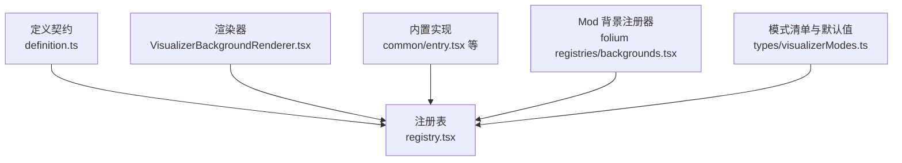
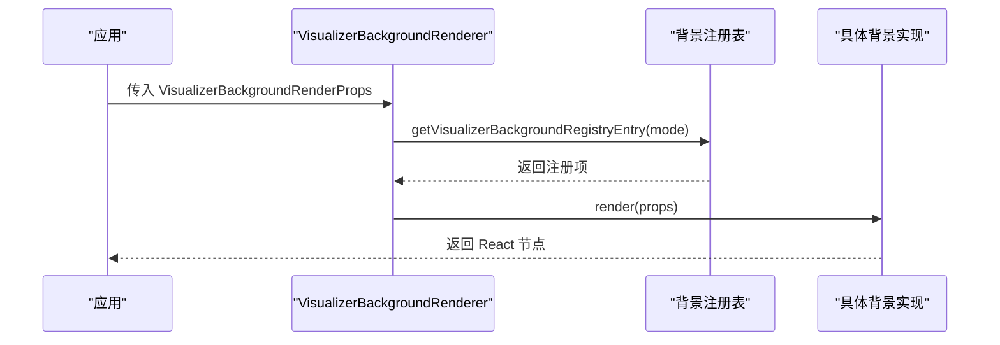
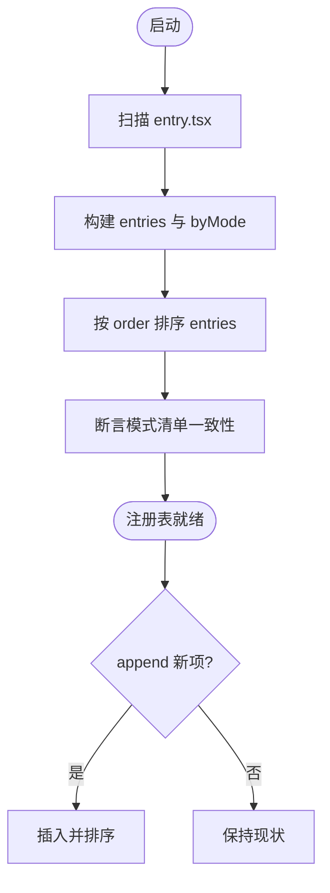
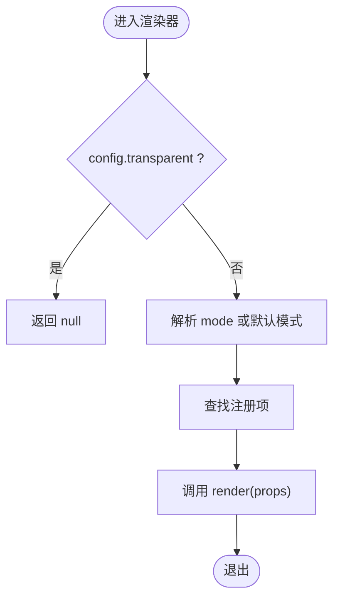
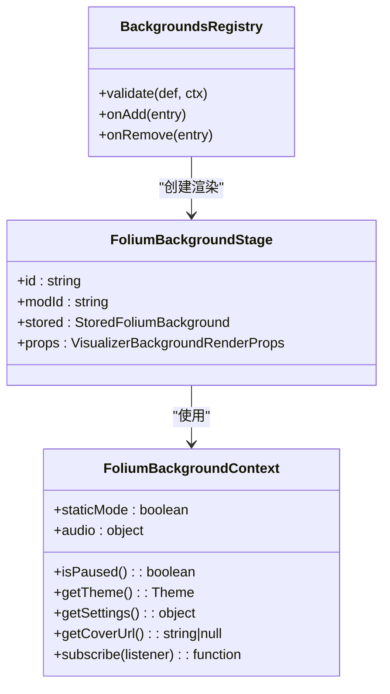
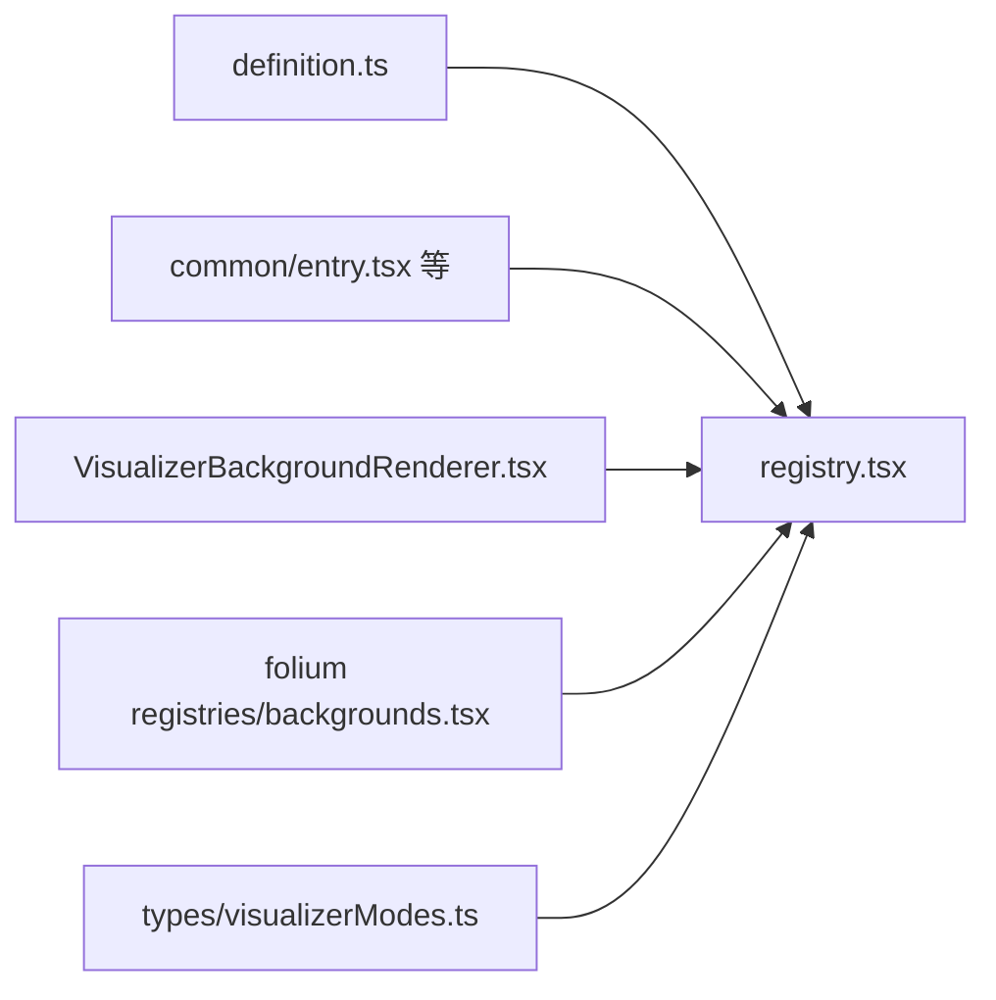
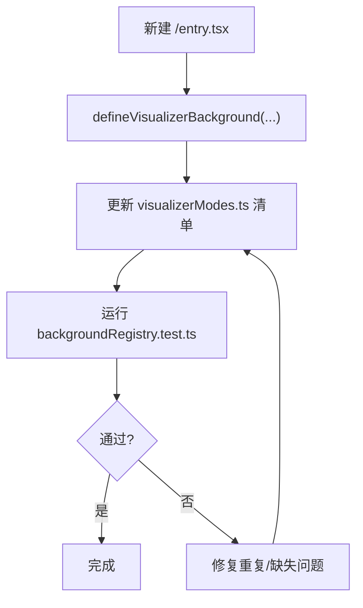

# 背景架构设计

<cite>
**本文引用的文件**   
- [definition.ts](file://src/components/visualizer/backgrounds/definition.ts)
- [registry.tsx](file://src/components/visualizer/backgrounds/registry.tsx)
- [VisualizerBackgroundRenderer.tsx](file://src/components/visualizer/backgrounds/VisualizerBackgroundRenderer.tsx)
- [backgrounds.tsx](file://src/mods/folium/registries/backgrounds.tsx)
- [entry.tsx](file://src/components/visualizer/backgrounds/common/entry.tsx)
- [visualizerModes.ts](file://src/types/visualizerModes.ts)
- [backgroundRegistry.test.ts](file://test/unit/visualizer/backgroundRegistry.test.ts)
</cite>

## 目录
1. [引言](#引言)
2. [项目结构](#项目结构)
3. [核心组件](#核心组件)
4. [架构总览](#架构总览)
5. [详细组件分析](#详细组件分析)
6. [依赖关系分析](#依赖关系分析)
7. [性能与资源管理](#性能与资源管理)
8. [扩展机制：新增背景类型](#扩展机制新增背景类型)
9. [与主题系统的集成](#与主题系统的集成)
10. [故障排查指南](#故障排查指南)
11. [结论](#结论)

## 引言
本文件面向 Folia Major 的背景系统，系统性说明其统一接口、注册机制、渲染流程、生命周期与资源清理策略，以及扩展方式和与主题系统的集成。目标是帮助开发者快速理解并安全地扩展新的背景效果类型，同时保证视觉一致性与运行性能。

## 项目结构
背景系统由“定义契约 + 注册表 + 渲染器 + 内置实现 + Mod 扩展通道”构成：
- 定义契约：统一描述配置、动作、渲染属性、设置面板与快捷控件的接口。
- 注册表：自动发现内建背景模式，并提供运行时追加/移除能力。
- 渲染器：根据当前模式选择具体渲染实现。
- 内置实现：common、monet、nomand、latent、url、tide、sora 等。
- Mod 扩展通道：Folium 背景注册器将 Mod 定义的后台效果桥接为统一背景模式。

**图示来源**
- [definition.ts:20-145](file://src/components/visualizer/backgrounds/definition.ts#L20-L145)
- [registry.tsx:11-95](file://src/components/visualizer/backgrounds/registry.tsx#L11-L95)
- [VisualizerBackgroundRenderer.tsx:8-15](file://src/components/visualizer/backgrounds/VisualizerBackgroundRenderer.tsx#L8-L15)
- [entry.tsx:13-89](file://src/components/visualizer/backgrounds/common/entry.tsx#L13-L89)
- [visualizerModes.ts:32-43](file://src/types/visualizerModes.ts#L32-L43)

**章节来源**
- [definition.ts:20-145](file://src/components/visualizer/backgrounds/definition.ts#L20-L145)
- [registry.tsx:11-95](file://src/components/visualizer/backgrounds/registry.tsx#L11-L95)
- [VisualizerBackgroundRenderer.tsx:8-15](file://src/components/visualizer/backgrounds/VisualizerBackgroundRenderer.tsx#L8-L15)
- [entry.tsx:13-89](file://src/components/visualizer/backgrounds/common/entry.tsx#L13-L89)
- [visualizerModes.ts:32-43](file://src/types/visualizerModes.ts#L32-L43)

## 核心组件
- 统一接口定义
  - VisualizerBackgroundConfig：背景配置对象，包含通用开关、各模式专属调优参数（如 monet/nomand/latent/sora/tide/url）。
  - VisualizerBackgroundActions：设置回调集合，用于 UI 修改配置。
  - VisualizerBackgroundRenderProps：渲染所需上下文，包括主题、封面、音频数据、播放状态、舞台引用等。
  - VisualizerBackgroundSettingsProps / QuickControlsProps：设置面板与快捷控件的统一入参。
  - VisualizerBackgroundRegistryEntry：注册项，声明 mode、order、labelKey、labelFallback、render 及可选的设置面板、快捷控件、重置逻辑。
  - defineVisualizerBackground：内建背景的工厂函数，返回注册项。

- 注册表
  - 通过 import.meta.glob 自动发现每个子目录 entry.tsx 导出的默认注册项。
  - 维护按 order 排序的 entries 列表和按 mode 索引的 byMode 映射。
  - 提供 has/get/reset 等查询方法，以及 append/remove 运行时扩展 API。
  - 使用 assertBuiltinModeList 校验内建模式清单与目录一致性。

- 渲染器
  - VisualizerBackgroundRenderer 根据 props.config.mode 或默认模式，从注册表获取对应 render 函数进行渲染。
  - 当 config.transparent 为真时直接返回空节点，避免透明层绘制。

- Folium 背景桥接
  - backgrounds.tsx 将 Mod 的 FoliumBackgroundDef 转换为 VisualizerBackgroundRegistryEntry，注入到统一注册表。
  - 提供 useBackgroundContext 封装静态模式、主题、封面、暂停状态与设置访问，并通过订阅机制触发重渲染。
  - 通过 FoliumMountHost 挂载 Mod 提供的 mount 函数，并以绝对定位覆盖层呈现。

**章节来源**
- [definition.ts:20-145](file://src/components/visualizer/backgrounds/definition.ts#L20-L145)
- [registry.tsx:11-95](file://src/components/visualizer/backgrounds/registry.tsx#L11-L95)
- [VisualizerBackgroundRenderer.tsx:8-15](file://src/components/visualizer/backgrounds/VisualizerBackgroundRenderer.tsx#L8-L15)
- [backgrounds.tsx:43-175](file://src/mods/folium/registries/backgrounds.tsx#L43-L175)

## 架构总览
背景系统采用“声明式注册 + 运行时分发”的模式：
- 内建背景以 entry.tsx 形式集中声明，构建期被扫描并组装成注册表。
- 渲染器在运行时根据当前模式查找并调用对应 render。
- Mod 可在运行时通过 appendVisualizerBackgroundEntry 动态贡献新背景模式，且不会覆盖内建模式。

**图示来源**
- [VisualizerBackgroundRenderer.tsx:8-15](file://src/components/visualizer/backgrounds/VisualizerBackgroundRenderer.tsx#L8-L15)
- [registry.tsx:54-57](file://src/components/visualizer/backgrounds/registry.tsx#L54-L57)
- [entry.tsx:13-89](file://src/components/visualizer/backgrounds/common/entry.tsx#L13-L89)

## 详细组件分析

### 统一接口与数据结构
- VisualizerBackgroundConfig
  - 通用字段：mode、transparent、common（封面色背景、透明度、几何背景与暗角开关）、customImage。
  - 模式专属字段：monet、nomand、latent、sora、tide、url。
- VisualizerBackgroundActions
  - 提供 onModeChange 与各模式的 onTuningChange/onResetTuning，以及 url 的增删改查回调。
- VisualizerBackgroundRenderProps
  - 包含 theme、isDaylight、coverUrl、audioPower/audioBands、seed、staticMode、paused、stageRef/lines/currentLineIndex/currentTime 等。
- VisualizerBackgroundRegistryEntry
  - 必须提供 mode、order、labelKey、labelFallback、render；可选 renderSettingsPanel、renderQuickControls、resetSettings。

复杂度与约束
- 注册项需唯一 mode，重复会抛出错误。
- order 决定显示顺序，未提供时使用默认值。
- labelKey 支持国际化，labelFallback 作为回退文本。

**章节来源**
- [definition.ts:20-145](file://src/components/visualizer/backgrounds/definition.ts#L20-L145)

### 注册表与模式清单
- 自动发现
  - 使用 import.meta.glob('./*/entry.tsx', { eager: true }) 加载所有内建背景模块。
  - 对每个模块 default 导出进行校验与去重。
- 排序与索引
  - entries 按 order 升序排列；byMode 提供 O(1) 模式查找。
- 断言与默认值
  - assertBuiltinModeList 确保 types/visualizerModes.ts 中的 BUILTIN_VISUALIZER_BACKGROUND_MODES 与实际目录一致。
  - DEFAULT_VISUALIZER_BACKGROUND_MODE 指定默认模式。
- 运行时扩展
  - appendVisualizerBackgroundEntry：若 mode 已存在则拒绝；否则插入并按 order 重新排序。
  - removeVisualizerBackgroundEntry：仅移除运行时贡献项，不删除内建项。

**图示来源**
- [registry.tsx:11-46](file://src/components/visualizer/backgrounds/registry.tsx#L11-L46)
- [registry.tsx:74-95](file://src/components/visualizer/backgrounds/registry.tsx#L74-L95)
- [visualizerModes.ts:32-43](file://src/types/visualizerModes.ts#L32-L43)

**章节来源**
- [registry.tsx:11-95](file://src/components/visualizer/backgrounds/registry.tsx#L11-L95)
- [visualizerModes.ts:32-43](file://src/types/visualizerModes.ts#L32-L43)

### 渲染器与生命周期
- 渲染流程
  - 若 props.config.transparent 为真，直接返回 null，避免透明层绘制。
  - 否则根据 props.config.mode 或默认模式，调用对应 render。
- 生命周期要点
  - 渲染器本身无复杂状态，主要职责是模式分发。
  - 具体背景实现负责自身生命周期（例如动画循环、事件监听、资源释放）。
- 透明处理
  - 透明背景不渲染任何内容，交由上层容器或下层背景填充。

**图示来源**
- [VisualizerBackgroundRenderer.tsx:8-15](file://src/components/visualizer/backgrounds/VisualizerBackgroundRenderer.tsx#L8-L15)

**章节来源**
- [VisualizerBackgroundRenderer.tsx:8-15](file://src/components/visualizer/backgrounds/VisualizerBackgroundRenderer.tsx#L8-L15)

### Folium 背景桥接与上下文
- useBackgroundContext
  - 缓存静态模式、主题、封面、暂停状态与设置访问。
  - 提供 subscribe 通知机制，当 paused/theme/isDaylight/coverUrl/settings 变化时触发重渲染。
  - 通过 createFoliumAudio 包装音频访问，避免频繁读取 props。
- FoliumBackgroundStage
  - 当 config.transparent 为真时跳过渲染。
  - 使用 FoliumMountHost 挂载 Mod 的 mount 函数，并以绝对定位覆盖层展示。
- buildRegistryEntry
  - 将 Mod 的 FoliumBackgroundDef 转换为 VisualizerBackgroundRegistryEntry。
  - 生成 labelKey、labelFallback、render、renderSettingsPanel、resetSettings。
- backgroundsRegistry
  - 基于 createFoliumRegistry 管理 Mod 背景定义的生命周期。
  - validate：校验 mount 是否为函数，settingsPanel 需要 settings schema。
  - onAdd：调用 appendVisualizerBackgroundEntry 注册到统一注册表。
  - onRemove：调用 removeVisualizerBackgroundEntry 注销。

**图示来源**
- [backgrounds.tsx:43-92](file://src/mods/folium/registries/backgrounds.tsx#L43-L92)
- [backgrounds.tsx:94-114](file://src/mods/folium/registries/backgrounds.tsx#L94-L114)
- [backgrounds.tsx:116-175](file://src/mods/folium/registries/backgrounds.tsx#L116-L175)

**章节来源**
- [backgrounds.tsx:43-175](file://src/mods/folium/registries/backgrounds.tsx#L43-L175)

### 内建示例：Common 背景
- Common 背景提供封面色渐变与几何背景组合。
- 支持设置面板与快捷控件，可切换封面色背景、调整透明度、禁用几何背景与暗角。
- resetSettings 提供默认值恢复。

**章节来源**
- [entry.tsx:13-89](file://src/components/visualizer/backgrounds/common/entry.tsx#L13-L89)

## 依赖关系分析
- 低耦合
  - 渲染器仅依赖注册表，不感知具体实现细节。
  - 注册表通过约定（entry.tsx 默认导出）解耦内建实现。
- 可扩展性
  - Mod 通过 appendVisualizerBackgroundEntry 动态扩展，不影响内建模式。
- 一致性保障
  - assertBuiltinModeList 强制模式清单与目录同步，防止遗漏或多余。

**图示来源**
- [definition.ts:20-145](file://src/components/visualizer/backgrounds/definition.ts#L20-L145)
- [registry.tsx:11-95](file://src/components/visualizer/backgrounds/registry.tsx#L11-L95)
- [VisualizerBackgroundRenderer.tsx:8-15](file://src/components/visualizer/backgrounds/VisualizerBackgroundRenderer.tsx#L8-L15)
- [backgrounds.tsx:116-175](file://src/mods/folium/registries/backgrounds.tsx#L116-L175)
- [visualizerModes.ts:32-43](file://src/types/visualizerModes.ts#L32-L43)

**章节来源**
- [registry.tsx:11-95](file://src/components/visualizer/backgrounds/registry.tsx#L11-L95)
- [visualizerModes.ts:32-43](file://src/types/visualizerModes.ts#L32-L43)

## 性能与资源管理
- 渲染优化
  - 透明背景直接返回 null，避免无效绘制。
  - 使用 order 控制显示顺序，减少不必要的层级计算。
- 状态更新
  - useBackgroundContext 通过订阅机制仅在相关状态变化时触发重渲染，避免全量刷新。
  - 主题与封面 URL 变更时缓存转换结果，降低重复计算。
- 资源清理
  - 具体背景实现应自行管理动画帧、事件监听与 GPU 资源，并在卸载时清理。
  - Mod 背景通过 FoliumMountHost 挂载，建议遵循宿主的生命周期钩子进行清理。
- 监控建议
  - 在开发阶段可通过浏览器性能面板观察重绘与布局抖动。
  - 对高频更新的背景（如几何背景）建议使用 requestAnimationFrame 节流与条件渲染。

[本节为通用指导，不直接分析具体文件]

## 扩展机制：新增背景类型
步骤概览
- 新建背景目录与 entry.tsx
  - 在 src/components/visualizer/backgrounds/<your-mode>/entry.tsx 中导出默认注册项。
  - 使用 defineVisualizerBackground 声明 mode、order、labelKey、labelFallback、render。
  - 可选实现 renderSettingsPanel、renderQuickControls、resetSettings。
- 更新模式清单
  - 在 src/types/visualizerModes.ts 的 BUILTIN_VISUALIZER_BACKGROUND_MODES 中添加你的模式字符串。
- 验证
  - 运行测试用例 backgroundRegistry.test.ts，确保模式顺序与唯一性。

注意事项
- mode 必须唯一，重复会导致注册失败。
- order 影响显示顺序，合理设置以避免遮挡。
- labelKey 需提供国际化键，labelFallback 作为回退文本。
- 若提供 settingsPanel，需配套 settings schema 与 actions。

**图示来源**
- [entry.tsx:13-89](file://src/components/visualizer/backgrounds/common/entry.tsx#L13-L89)
- [visualizerModes.ts:32-43](file://src/types/visualizerModes.ts#L32-L43)
- [backgroundRegistry.test.ts:14-31](file://test/unit/visualizer/backgroundRegistry.test.ts#L14-L31)

**章节来源**
- [entry.tsx:13-89](file://src/components/visualizer/backgrounds/common/entry.tsx#L13-L89)
- [visualizerModes.ts:32-43](file://src/types/visualizerModes.ts#L32-L43)
- [backgroundRegistry.test.ts:14-31](file://test/unit/visualizer/backgroundRegistry.test.ts#L14-L31)

## 与主题系统的集成
- 主题输入
  - VisualizerBackgroundRenderProps 提供 theme 与 isDaylight，背景实现可直接读取主题色、明暗模式。
- 封面色背景
  - common 背景支持 useCoverColorBg 与 opacity，结合主题 backgroundColor 实现一致的视觉基调。
- 明暗模式
  - isDaylight 可用于切换不同调色板或对比度策略，确保可读性与美观性。
- 设置面板
  - 设置面板接收 theme 与 controlCardBg，保证 UI 风格与整体主题一致。

最佳实践
- 优先使用主题色而非硬编码颜色。
- 在明暗模式下分别测试背景的可读性与对比度。
- 使用 actions 暴露可调参数，让用户自定义视觉效果。

**章节来源**
- [definition.ts:92-118](file://src/components/visualizer/backgrounds/definition.ts#L92-L118)
- [entry.tsx:18-67](file://src/components/visualizer/backgrounds/common/entry.tsx#L18-L67)

## 故障排查指南
常见问题
- 模式重复
  - 现象：注册时报错提示重复模式。
  - 原因：多个 entry.tsx 声明相同 mode。
  - 解决：检查并修正 mode 名称。
- 清单不一致
  - 现象：启动时报错提示清单与目录不一致。
  - 原因：新增或删除了内建背景但未更新 visualizerModes.ts。
  - 解决：同步 BUILTIN_VISUALIZER_BACKGROUND_MODES。
- 设置面板无效
  - 现象：settingsPanel 不显示或无法保存设置。
  - 原因：未提供 settings schema 或未正确绑定 actions。
  - 解决：补充 settings 定义并确保 actions 回调生效。
- 透明背景不渲染
  - 现象：设置 transparent 后无背景。
  - 原因：这是预期行为，透明背景不绘制内容。
  - 解决：如需可见背景，关闭 transparent 或在上层添加背景。

调试建议
- 使用控制台日志输出模式解析与注册过程。
- 在浏览器性能面板观察重绘与内存占用。
- 针对高频更新场景，增加节流与条件渲染。

**章节来源**
- [registry.tsx:22-27](file://src/components/visualizer/backgrounds/registry.tsx#L22-L27)
- [registry.tsx:42-46](file://src/components/visualizer/backgrounds/registry.tsx#L42-L46)
- [backgrounds.tsx:151-158](file://src/mods/folium/registries/backgrounds.tsx#L151-L158)
- [VisualizerBackgroundRenderer.tsx:8-11](file://src/components/visualizer/backgrounds/VisualizerBackgroundRenderer.tsx#L8-L11)

## 结论
Folia Major 的背景系统通过统一的接口定义与注册表机制，实现了内建与 Mod 背景的统一管理与扩展。渲染器专注于模式分发，具体实现负责生命周期与资源管理。通过主题系统集成与完善的扩展机制，开发者可以安全地添加新的背景效果类型，同时保证视觉一致性与运行性能。建议在扩展过程中严格遵循契约、更新模式清单并进行充分测试，以确保系统稳定性与可维护性。