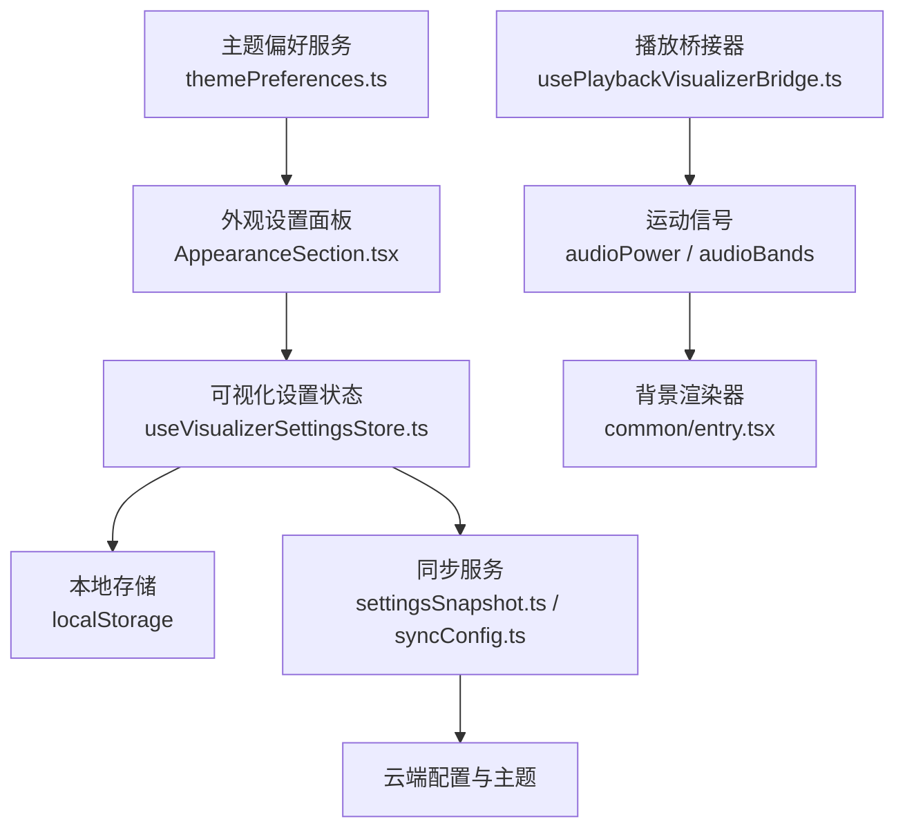
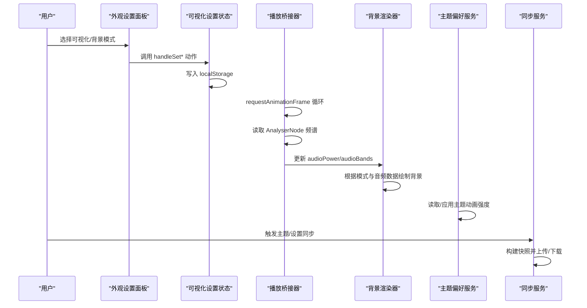
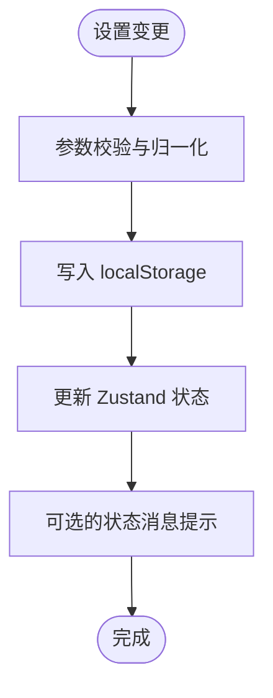
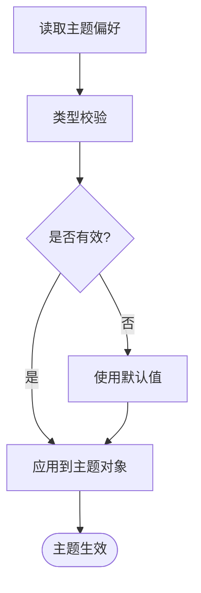
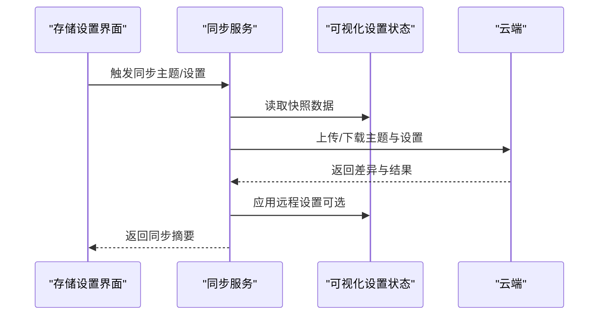
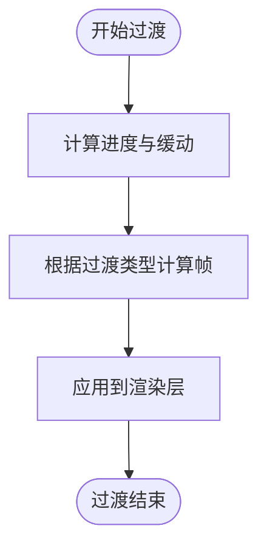
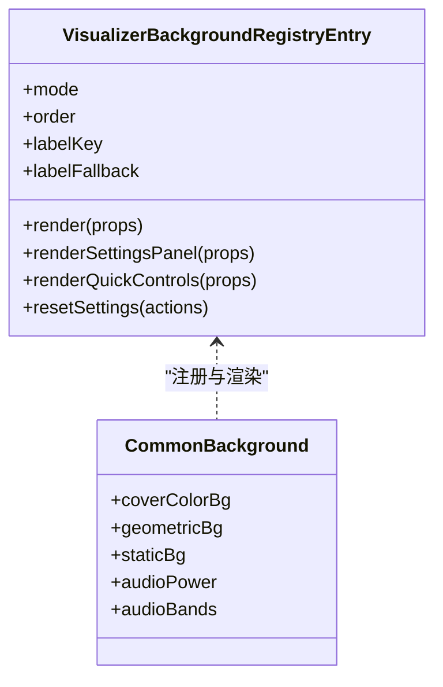
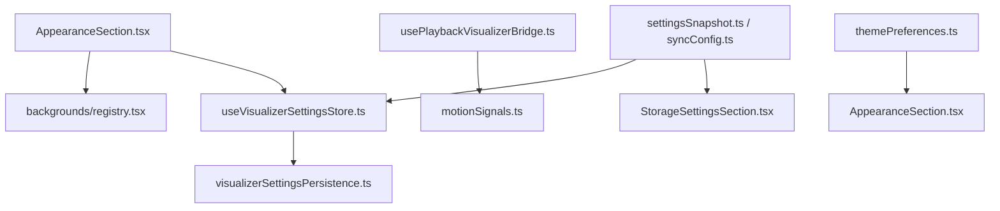

# 背景系统集成

<cite>
**本文引用的文件**   
- [useVisualizerSettingsStore.ts](file://src/stores/useVisualizerSettingsStore.ts)
- [usePlaybackVisualizerBridge.ts](file://src/hooks/usePlaybackVisualizerBridge.ts)
- [themePreferences.ts](file://src/services/themePreferences.ts)
- [settingsSnapshot.ts](file://src/services/sync/settingsSnapshot.ts)
- [syncConfig.ts](file://src/services/sync/syncConfig.ts)
- [StorageSettingsSection.tsx](file://src/components/modal/settings/StorageSettingsSection.tsx)
- [definition.ts](file://src/components/visualizer/backgrounds/definition.ts)
- [entry.tsx](file://src/components/visualizer/backgrounds/common/entry.tsx)
- [temperaTransitions.ts](file://src/components/visualizer/tempera/temperaTransitions.ts)
- [AppearanceSection.tsx](file://src/components/panelTab/controls/AppearanceSection.tsx)
- [urlBackgroundSettingsCard.tsx](file://src/components/visualizer/backgrounds/url/UrlBackgroundSettingsCard.tsx)
</cite>

## 目录
1. [引言](#引言)
2. [项目结构](#项目结构)
3. [核心组件](#核心组件)
4. [架构总览](#架构总览)
5. [详细组件分析](#详细组件分析)
6. [依赖关系分析](#依赖关系分析)
7. [性能考虑](#性能考虑)
8. [故障排除指南](#故障排除指南)
9. [结论](#结论)

## 引言
本文面向“背景系统”与应用的集成机制，重点说明以下方面：
- 状态管理：可视化模式、背景模式、各主题调参、URL 背景列表等如何集中管理。
- 主题同步：主题动画强度、自动切换、自动生成等偏好如何持久化并应用到主题。
- 用户偏好存储：本地存储键、数据校验与默认值、云端同步快照与设置推送。
- 音频联动：从音频节点提取频谱能量，驱动背景与可视化效果。
- 背景切换动画与性能：过渡算法、帧率限制、资源预算与降级策略。
- 调试与排障：常用诊断入口、常见问题定位方法。

## 项目结构
背景系统横跨前端状态层、播放桥接层、可视化渲染层以及设置与同步服务。关键路径如下：
- 状态层：`src/stores/useVisualizerSettingsStore.ts`
- 播放桥接层：`src/hooks/usePlaybackVisualizerBridge.ts`
- 主题偏好服务：`src/services/themePreferences.ts`
- 同步服务：`src/services/sync/settingsSnapshot.ts`、`src/services/sync/syncConfig.ts`
- 可视化背景注册与通用背景：`src/components/visualizer/backgrounds/definition.ts`、`src/components/visualizer/backgrounds/common/entry.tsx`
- 背景切换动画：`src/components/visualizer/tempera/temperaTransitions.ts`
- 外观设置入口：`src/components/panelTab/controls/AppearanceSection.tsx`
- URL 背景设置面板：`src/components/visualizer/backgrounds/url/UrlBackgroundSettingsCard.tsx`
- 存储与同步界面：`src/components/modal/settings/StorageSettingsSection.tsx`



**图表来源**
- [AppearanceSection.tsx:81-118](file://src/components/panelTab/controls/AppearanceSection.tsx#L81-L118)
- [useVisualizerSettingsStore.ts:117-286](file://src/stores/useVisualizerSettingsStore.ts#L117-L286)
- [usePlaybackVisualizerBridge.ts:77-131](file://src/hooks/usePlaybackVisualizerBridge.ts#L77-L131)
- [entry.tsx:31-68](file://src/components/visualizer/backgrounds/common/entry.tsx#L31-L68)
- [themePreferences.ts:35-109](file://src/services/themePreferences.ts#L35-L109)
- [settingsSnapshot.ts:54-89](file://src/services/sync/settingsSnapshot.ts#L54-L89)
- [syncConfig.ts:81-110](file://src/services/sync/syncConfig.ts#L81-L110)

**章节来源**
- [AppearanceSection.tsx:81-118](file://src/components/panelTab/controls/AppearanceSection.tsx#L81-L118)
- [useVisualizerSettingsStore.ts:117-286](file://src/stores/useVisualizerSettingsStore.ts#L117-L286)
- [usePlaybackVisualizerBridge.ts:77-131](file://src/hooks/usePlaybackVisualizerBridge.ts#L77-L131)
- [entry.tsx:31-68](file://src/components/visualizer/backgrounds/common/entry.tsx#L31-L68)
- [themePreferences.ts:35-109](file://src/services/themePreferences.ts#L35-L109)
- [settingsSnapshot.ts:54-89](file://src/services/sync/settingsSnapshot.ts#L54-L89)
- [syncConfig.ts:81-110](file://src/services/sync/syncConfig.ts#L81-L110)

## 核心组件
- 可视化设置状态中心：统一管理当前可视化模式、背景模式、透明度、帧率、URL 背景列表与各主题调参；所有变更均写入本地存储并提供重置能力。
- 播放桥接器：在 requestAnimationFrame 循环中读取 AnalyserNode 频谱数据，计算频段能量并更新全局运动信号，供背景与可视化消费。
- 主题偏好服务：提供主题动画强度、自动切换、自动生成、最后应用主题指针等偏好的读写与类型校验。
- 同步服务：将可视化设置构建为可同步快照，支持云端主题与设置的拉取/推送，并在界面触发手动同步。
- 背景注册与通用背景：定义背景模式注册表，通用背景组合封面色背景、几何背景与静态背景，并根据音频功率与频段数据动态调整。
- 背景切换动画：基于流向角度与进度计算进入/退出过渡帧，确保视觉方向一致且平滑。
- 外观设置入口：提供可视化模式与背景模式的步进选择、打开详细设置面板的快捷入口。
- URL 背景设置面板：添加、编辑、删除 URL 背景项，并维护选中项 ID。

**章节来源**
- [useVisualizerSettingsStore.ts:25-115](file://src/stores/useVisualizerSettingsStore.ts#L25-L115)
- [usePlaybackVisualizerBridge.ts:13-46](file://src/hooks/usePlaybackVisualizerBridge.ts#L13-L46)
- [themePreferences.ts:5-13](file://src/services/themePreferences.ts#L5-L13)
- [settingsSnapshot.ts:54-89](file://src/services/sync/settingsSnapshot.ts#L54-L89)
- [definition.ts:130-145](file://src/components/visualizer/backgrounds/definition.ts#L130-L145)
- [entry.tsx:31-68](file://src/components/visualizer/backgrounds/common/entry.tsx#L31-L68)
- [temperaTransitions.ts:33-117](file://src/components/visualizer/tempera/temperaTransitions.ts#L33-L117)
- [AppearanceSection.tsx:81-118](file://src/components/panelTab/controls/AppearanceSection.tsx#L81-L118)
- [urlBackgroundSettingsCard.tsx:23-60](file://src/components/visualizer/backgrounds/url/UrlBackgroundSettingsCard.tsx#L23-L60)

## 架构总览
背景系统的整体流程如下：
- 用户在外观设置中选择可视化模式与背景模式，状态写入 `useVisualizerSettingsStore` 并持久化到 localStorage。
- 播放桥接器在每帧读取音频频谱，计算低频、中频、高频等能量，更新全局运动信号（如 `audioPower`、`audioBands`）。
- 背景渲染器根据当前背景模式与运动信号，动态调整几何形状、颜色、透明度等视觉效果。
- 主题偏好服务将主题动画强度等偏好应用到主题对象，影响背景与可视化的动效强度。
- 同步服务将可视化设置打包为快照，支持云端主题与设置同步；用户可在设置界面触发同步。



**图表来源**
- [AppearanceSection.tsx:81-118](file://src/components/panelTab/controls/AppearanceSection.tsx#L81-L118)
- [useVisualizerSettingsStore.ts:163-286](file://src/stores/useVisualizerSettingsStore.ts#L163-L286)
- [usePlaybackVisualizerBridge.ts:77-131](file://src/hooks/usePlaybackVisualizerBridge.ts#L77-L131)
- [entry.tsx:31-68](file://src/components/visualizer/backgrounds/common/entry.tsx#L31-L68)
- [themePreferences.ts:52-109](file://src/services/themePreferences.ts#L52-L109)
- [settingsSnapshot.ts:54-89](file://src/services/sync/settingsSnapshot.ts#L54-L89)

## 详细组件分析

### 可视化设置状态中心
职责与行为：
- 管理可视化模式、背景模式、透明度、帧率、URL 背景列表与各主题调参。
- 所有 setter 动作均先校验/归一化参数，再写入 localStorage，最后更新 Zustand 状态。
- 提供批量快照导出与重置能力，便于设置面板与同步服务使用。

关键实现要点：
- 背景透明度与可视化透明度分别持久化，避免互相覆盖。
- URL 背景列表通过工具函数进行安全清洗与去重，选中 ID 与列表保持一致。
- 各主题调参使用 clamp/resolve 函数保证数值范围与枚举合法。
- 帧率设置同时更新全局帧率限制模块，影响渲染循环频率。



**图表来源**
- [useVisualizerSettingsStore.ts:163-286](file://src/stores/useVisualizerSettingsStore.ts#L163-L286)

**章节来源**
- [useVisualizerSettingsStore.ts:25-115](file://src/stores/useVisualizerSettingsStore.ts#L25-L115)
- [useVisualizerSettingsStore.ts:163-286](file://src/stores/useVisualizerSettingsStore.ts#L163-L286)
- [useVisualizerSettingsStore.ts:854-947](file://src/stores/useVisualizerSettingsStore.ts#L854-L947)

### 播放桥接器与音频联动
职责与行为：
- 在 requestAnimationFrame 循环中读取音频元素或外部播放器时间，更新当前时间与歌词行索引。
- 从 AnalyserNode 获取频谱数据，按频段计算能量，并对能量进行幂次增强以突出低频与高频响应。
- 在无音频信号时，提供“呼吸”动画，使背景保持柔和的动态感。

关键实现要点：
- 多播放上下文兼容：普通音频元素、Now Playing Stage、PlayerCap、Stage Lyrics。
- 过渡期间保留可见信号，避免无缝混音时的视觉抖动。
- 歌词时间偏移用于对齐歌词与播放进度。

```mermaid
sequenceDiagram
participant Loop as "requestAnimationFrame"
participant Bridge as "播放桥接器"
participant Audio as "音频节点"
participant Signals as "运动信号"
participant Renderer as "背景渲染器"
Loop->>Bridge : 每帧调用 updateLoop
Bridge->>Audio : 读取 currentTime/paused/ended
Bridge->>Audio : getByteFrequencyData()
Bridge->>Signals : 更新 audioPower/audioBands
Signals-->>Renderer : 驱动背景效果
Bridge->>Bridge : 更新当前歌词行索引
Loop->>Loop : 继续下一帧
```

**图表来源**
- [usePlaybackVisualizerBridge.ts:77-131](file://src/hooks/usePlaybackVisualizerBridge.ts#L77-L131)
- [usePlaybackVisualizerBridge.ts:133-228](file://src/hooks/usePlaybackVisualizerBridge.ts#L133-L228)

**章节来源**
- [usePlaybackVisualizerBridge.ts:13-46](file://src/hooks/usePlaybackVisualizerBridge.ts#L13-L46)
- [usePlaybackVisualizerBridge.ts:77-131](file://src/hooks/usePlaybackVisualizerBridge.ts#L77-L131)
- [usePlaybackVisualizerBridge.ts:133-228](file://src/hooks/usePlaybackVisualizerBridge.ts#L133-L228)

### 主题同步与偏好存储
职责与行为：
- 主题动画强度、自动切换、自动生成、最后应用主题指针等偏好通过 `themePreferences.ts` 进行读写。
- 所有读取函数具备类型校验与默认值回退，避免无效配置导致异常。
- 应用主题时可将动画强度注入主题对象，统一控制动效强度。

关键实现要点：
- 浏览器环境检测，服务端渲染下返回安全默认值。
- 主题生成来源（AI 或封面调色板）与最后应用主题指针用于追踪主题来源。
- 自动切换与自动生成互斥逻辑由状态解析函数处理。



**图表来源**
- [themePreferences.ts:35-109](file://src/services/themePreferences.ts#L35-L109)
- [themePreferences.ts:111-177](file://src/services/themePreferences.ts#L111-L177)

**章节来源**
- [themePreferences.ts:5-13](file://src/services/themePreferences.ts#L5-L13)
- [themePreferences.ts:35-109](file://src/services/themePreferences.ts#L35-L109)
- [themePreferences.ts:111-177](file://src/services/themePreferences.ts#L111-L177)

### 背景设置的持久化与云端同步
职责与行为：
- 本地持久化：所有可视化与背景相关设置均在 setter 中写入 localStorage，启动时从存储恢复。
- 云端同步：通过 `settingsSnapshot.ts` 构建同步快照，包含各主题调参与 URL 背景列表；`syncConfig.ts` 管理同步状态与事件订阅。
- 界面操作：`StorageSettingsSection.tsx` 提供“立即同步主题”和“同步设置”按钮，触发上传/下载与本地应用。

关键实现要点：
- 快照版本与更新时间戳用于冲突解决与增量同步。
- 设置推送与远程设置应用分离，避免误覆盖。
- 同步状态通过事件总线通知 UI 刷新。



**图表来源**
- [settingsSnapshot.ts:54-89](file://src/services/sync/settingsSnapshot.ts#L54-L89)
- [syncConfig.ts:81-110](file://src/services/sync/syncConfig.ts#L81-L110)
- [StorageSettingsSection.tsx:165-198](file://src/components/modal/settings/StorageSettingsSection.tsx#L165-L198)

**章节来源**
- [useVisualizerSettingsStore.ts:163-286](file://src/stores/useVisualizerSettingsStore.ts#L163-L286)
- [settingsSnapshot.ts:54-89](file://src/services/sync/settingsSnapshot.ts#L54-L89)
- [syncConfig.ts:81-110](file://src/services/sync/syncConfig.ts#L81-L110)
- [StorageSettingsSection.tsx:165-198](file://src/components/modal/settings/StorageSettingsSection.tsx#L165-L198)

### 背景切换动画与过渡效果
职责与行为：
- 背景切换采用进入/退出过渡帧计算，基于流向角度与进度插值，确保视觉方向一致。
- 支持多种过渡类型（如块擦除），通过缓动函数提升流畅度。
- 在复杂场景（如 Tempra）中，进入与退出过渡分别计算，避免反向运动导致的跳变。

关键实现要点：
- 过渡进度经缓动函数处理，提升自然感。
- 流向角度来自段落最后一帧，保证过渡方向与内容流动一致。
- 禁用过渡或超出持续时间时返回空闲帧，避免无意义计算。



**图表来源**
- [temperaTransitions.ts:33-117](file://src/components/visualizer/tempera/temperaTransitions.ts#L33-L117)

**章节来源**
- [temperaTransitions.ts:33-117](file://src/components/visualizer/tempera/temperaTransitions.ts#L33-L117)

### 背景模式注册与通用背景
职责与行为：
- 背景模式通过注册表定义，每个模式提供渲染函数、设置面板与快速控件。
- 通用背景组合封面色背景、几何背景与静态背景，并根据音频功率与频段数据动态调整。
- 支持禁用暗角与几何背景，适配不同主题风格。

关键实现要点：
- 封面色背景使用流体动画，配合主题色与透明度。
- 几何背景根据音频功率与频段数据调整形状与位置。
- 静态背景作为兜底，确保无音频信号时仍有视觉反馈。



**图表来源**
- [definition.ts:130-145](file://src/components/visualizer/backgrounds/definition.ts#L130-L145)
- [entry.tsx:31-68](file://src/components/visualizer/backgrounds/common/entry.tsx#L31-L68)

**章节来源**
- [definition.ts:130-145](file://src/components/visualizer/backgrounds/definition.ts#L130-L145)
- [entry.tsx:31-68](file://src/components/visualizer/backgrounds/common/entry.tsx#L31-L68)

### URL 背景设置面板
职责与行为：
- 提供添加、编辑、删除 URL 背景项的能力，维护选中项 ID。
- 输入 URL 经过规范化处理，避免非法地址。
- 新增项后自动选中新项，提升用户体验。

关键实现要点：
- 生成唯一 ID 避免冲突。
- 草稿状态管理，支持取消编辑。
- 与状态中心联动，实时更新列表与选中项。

**章节来源**
- [urlBackgroundSettingsCard.tsx:23-60](file://src/components/visualizer/backgrounds/url/UrlBackgroundSettingsCard.tsx#L23-L60)
- [useVisualizerSettingsStore.ts:188-249](file://src/stores/useVisualizerSettingsStore.ts#L188-L249)

## 依赖关系分析
- 外观设置面板依赖可视化注册表与背景注册表，提供模式选择与设置入口。
- 可视化设置状态依赖本地存储与工具函数，负责参数校验与持久化。
- 播放桥接器依赖音频节点与运动信号，负责频谱分析与时间同步。
- 主题偏好服务独立于可视化状态，但影响主题对象的动画强度。
- 同步服务依赖可视化设置快照与同步配置，负责云端交互。



**图表来源**
- [AppearanceSection.tsx:81-118](file://src/components/panelTab/controls/AppearanceSection.tsx#L81-L118)
- [useVisualizerSettingsStore.ts:117-286](file://src/stores/useVisualizerSettingsStore.ts#L117-L286)
- [usePlaybackVisualizerBridge.ts:77-131](file://src/hooks/usePlaybackVisualizerBridge.ts#L77-L131)
- [themePreferences.ts:35-109](file://src/services/themePreferences.ts#L35-L109)
- [settingsSnapshot.ts:54-89](file://src/services/sync/settingsSnapshot.ts#L54-L89)
- [syncConfig.ts:81-110](file://src/services/sync/syncConfig.ts#L81-L110)
- [StorageSettingsSection.tsx:165-198](file://src/components/modal/settings/StorageSettingsSection.tsx#L165-L198)

**章节来源**
- [AppearanceSection.tsx:81-118](file://src/components/panelTab/controls/AppearanceSection.tsx#L81-L118)
- [useVisualizerSettingsStore.ts:117-286](file://src/stores/useVisualizerSettingsStore.ts#L117-L286)
- [usePlaybackVisualizerBridge.ts:77-131](file://src/hooks/usePlaybackVisualizerBridge.ts#L77-L131)
- [themePreferences.ts:35-109](file://src/services/themePreferences.ts#L35-L109)
- [settingsSnapshot.ts:54-89](file://src/services/sync/settingsSnapshot.ts#L54-L89)
- [syncConfig.ts:81-110](file://src/services/sync/syncConfig.ts#L81-L110)
- [StorageSettingsSection.tsx:165-198](file://src/components/modal/settings/StorageSettingsSection.tsx#L165-L198)

## 性能考虑
- 帧率限制：可视化帧率可通过设置调整，同时影响全局渲染循环频率，避免高负载设备卡顿。
- 频谱计算优化：仅在存在音频信号时读取 AnalyserNode，否则使用“呼吸”动画降低开销。
- 资源预算：纹理与着色器编译预热阶段不计入性能统计，避免误导。
- 过渡动画：使用缓动函数与流向角度计算，减少不必要的重绘与布局抖动。
- 内存监控：提供可视化内存探针，帮助定位长时间运行下的内存泄漏。

建议：
- 在高负载设备上降低可视化帧率或关闭高级后处理效果。
- 避免频繁切换复杂背景模式，优先使用轻量级几何背景。
- 定期检查同步状态，避免重复上传/下载造成网络与 CPU 压力。

[本节为通用指导，不直接分析具体文件]

## 故障排除指南
常见问题与定位方法：
- 背景无动画：检查播放桥接器是否正确读取音频频谱，确认 motionSignals 是否更新。
- 主题未生效：确认主题偏好服务是否正确读取并应用动画强度。
- 同步失败：查看同步状态与事件订阅，确认云端配置是否可用。
- 内存增长：使用可视化内存探针观察纹理与着色器占用，排查未释放资源。

操作步骤：
- 打开外观设置面板，切换可视化模式与背景模式，观察控制台状态消息。
- 在存储设置界面触发“立即同步主题”与“同步设置”，查看同步摘要。
- 使用开发探针页面访问可视化内存探针，记录内存变化趋势。

**章节来源**
- [usePlaybackVisualizerBridge.ts:77-131](file://src/hooks/usePlaybackVisualizerBridge.ts#L77-L131)
- [themePreferences.ts:35-109](file://src/services/themePreferences.ts#L35-L109)
- [StorageSettingsSection.tsx:165-198](file://src/components/modal/settings/StorageSettingsSection.tsx#L165-L198)

## 结论
背景系统通过集中式状态管理、播放桥接与主题偏好服务，实现了音频驱动的动态视觉效果与跨端偏好同步。本地存储确保设置持久化，云端同步支持多设备一致性。背景切换动画与性能优化策略保障了流畅的用户体验。通过调试工具与故障排除指南，开发者可以快速定位问题并优化系统表现。

[本节为总结性内容，不直接分析具体文件]