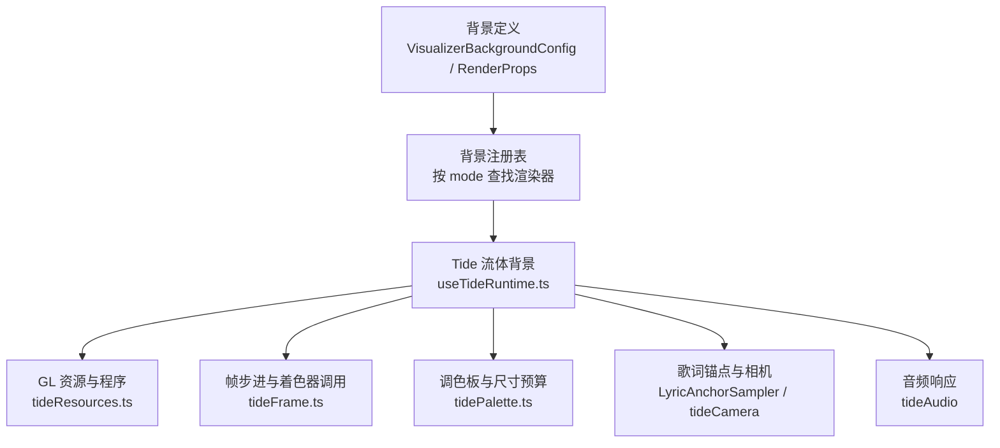
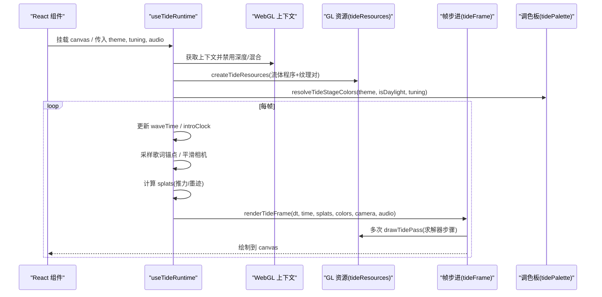
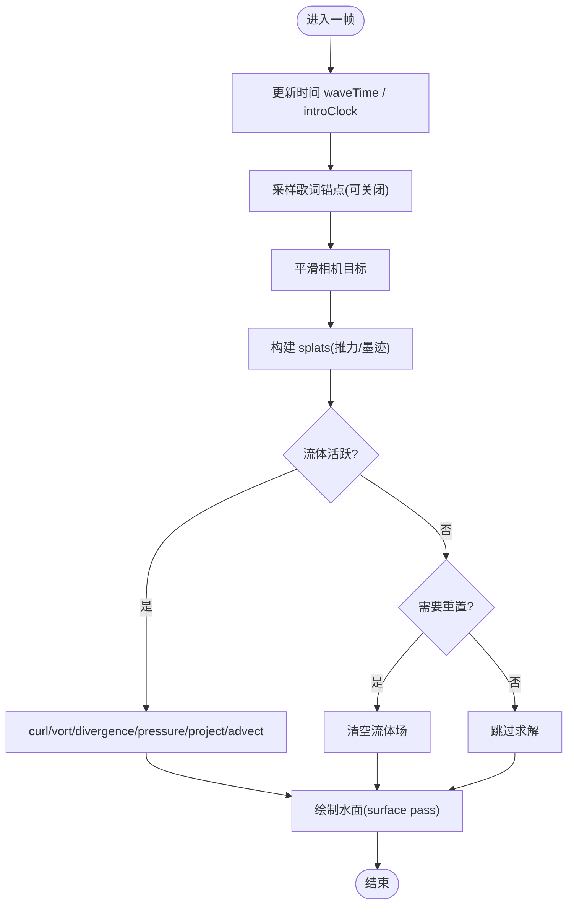
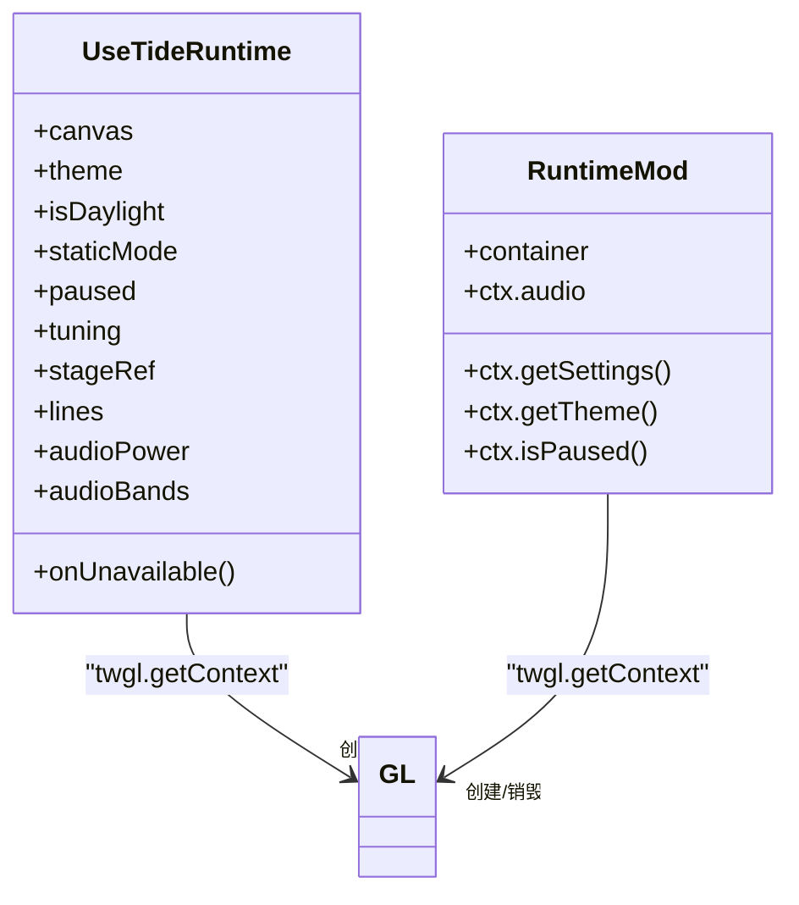
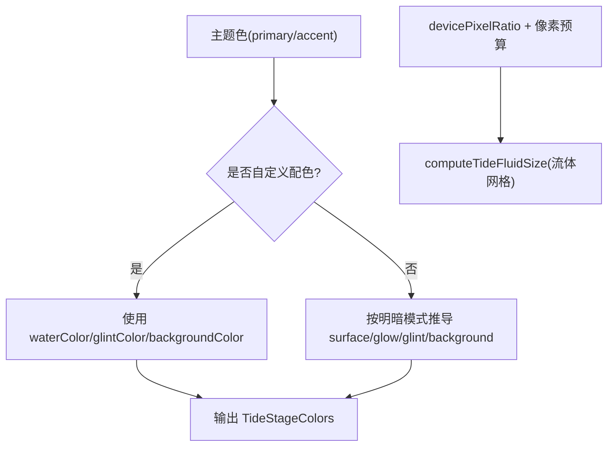
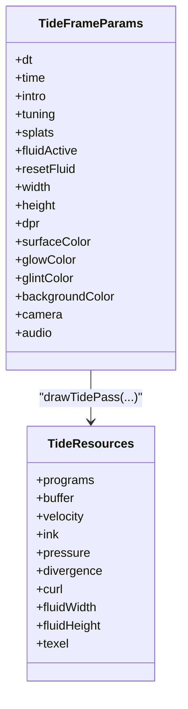
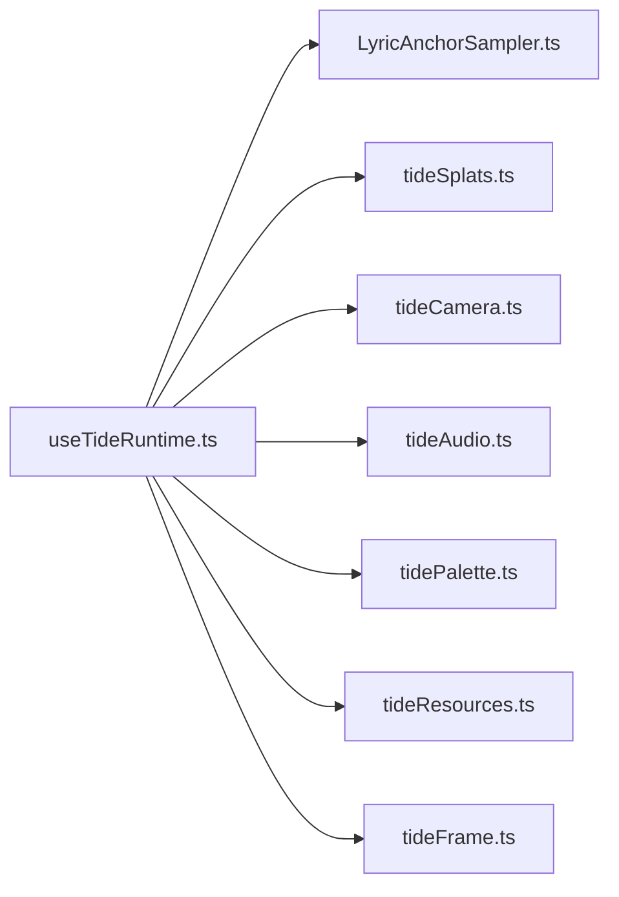

# 通用背景效果

<cite>
**本文引用的文件**   
- [src/components/visualizer/backgrounds/definition.ts](file://src/components/visualizer/backgrounds/definition.ts)
- [src/components/visualizer/backgrounds/registry.tsx](file://src/components/visualizer/backgrounds/registry.tsx)
- [src/components/visualizer/backgrounds/tide/useTideRuntime.ts](file://src/components/visualizer/backgrounds/tide/useTideRuntime.ts)
- [dist-mods/tide-background/tide/runtime.mjs](file://dist-mods/tide-background/tide/runtime.mjs)
- [src/components/visualizer/backgrounds/tide/tideResources.ts](file://src/components/visualizer/backgrounds/tide/tideResources.ts)
- [src/components/visualizer/backgrounds/tide/tideFrame.ts](file://src/components/visualizer/backgrounds/tide/tideFrame.ts)
- [src/components/visualizer/backgrounds/tide/tidePalette.ts](file://src/components/visualizer/backgrounds/tide/tidePalette.ts)
</cite>

## 目录
1. [简介](#简介)
2. [项目结构](#项目结构)
3. [核心组件](#核心组件)
4. [架构总览](#架构总览)
5. [详细组件分析](#详细组件分析)
6. [依赖关系分析](#依赖关系分析)
7. [性能与优化](#性能与优化)
8. [故障排查](#故障排查)
9. [结论](#结论)
10. [附录：扩展自定义通用背景](#附录扩展自定义通用背景)

## 简介
本文件系统性说明“通用背景效果”的实现，重点覆盖两类背景：
- 流体背景（潮汐水面）：基于 WebGL 的流体求解器、噪声驱动的波浪表面、歌词锚点与音频驱动。
- 几何背景：由通用背景注册表与配置契约管理，配合主题与设置面板进行参数化控制。

文档将解释流体背景的噪声函数使用与动画循环、几何背景的数学计算与变换矩阵思路，并给出颜色、速度、密度等可调参数的含义与影响；同时总结 WebGL 加速、分辨率预算、内存管理等性能策略，并提供扩展自定义通用背景的指南。

## 项目结构
通用背景采用“模式注册 + 渲染入口”的结构：
- 定义层：统一描述背景模式的配置、动作、渲染属性与设置面板接口。
- 注册层：自动发现各背景子模块的 entry 模块，构建运行时注册表，支持内置与 mod 扩展。
- 实现层：以 tide 为例，包含 React Hook 生命周期、GL 资源、着色器管线、调色板、帧步进、音频与歌词采样等。

**图示来源**
- [src/components/visualizer/backgrounds/definition.ts:20-146](file://src/components/visualizer/backgrounds/definition.ts#L20-L146)
- [src/components/visualizer/backgrounds/registry.tsx:11-38](file://src/components/visualizer/backgrounds/registry.tsx#L11-L38)
- [src/components/visualizer/backgrounds/tide/useTideRuntime.ts:1-16](file://src/components/visualizer/backgrounds/tide/useTideRuntime.ts#L1-L16)

**章节来源**
- [src/components/visualizer/backgrounds/definition.ts:20-146](file://src/components/visualizer/backgrounds/definition.ts#L20-L146)
- [src/components/visualizer/backgrounds/registry.tsx:11-38](file://src/components/visualizer/backgrounds/registry.tsx#L11-L38)

## 核心组件
- 背景定义与动作契约：统一描述所有通用背景的配置项、设置回调、渲染属性，以及 Tide 专属 tuning 字段。
- 背景注册表：扫描本地 entry 模块，构建 byMode 映射，提供查询、排序、追加与移除能力，保证内置与 mod 类型不冲突。
- Tide 流体背景运行时：封装 GL 上下文、半浮点渲染目标、着色器程序、流体场纹理对、帧循环、歌词锚点采样、音频响应与相机跟随。

**章节来源**
- [src/components/visualizer/backgrounds/definition.ts:20-146](file://src/components/visualizer/backgrounds/definition.ts#L20-L146)
- [src/components/visualizer/backgrounds/registry.tsx:11-96](file://src/components/visualizer/backgrounds/registry.tsx#L11-L96)
- [src/components/visualizer/backgrounds/tide/useTideRuntime.ts:18-35](file://src/components/visualizer/backgrounds/tide/useTideRuntime.ts#L18-L35)

## 架构总览
Tide 流体背景在 React 中通过 Hook 管理生命周期，在命令式 Mod 中也存在等价实现。两者都遵循相同的渲染流程：创建 GL 上下文 → 检查半浮点扩展 → 编译着色器 → 初始化流体场 → 每帧采样歌词/音频 → 生成 splats → 执行流体求解 → 绘制水面。

**图示来源**
- [src/components/visualizer/backgrounds/tide/useTideRuntime.ts:59-102](file://src/components/visualizer/backgrounds/tide/useTideRuntime.ts#L59-L102)
- [src/components/visualizer/backgrounds/tide/tideResources.ts:96-139](file://src/components/visualizer/backgrounds/tide/tideResources.ts#L96-L139)
- [src/components/visualizer/backgrounds/tide/tideFrame.ts:175-249](file://src/components/visualizer/backgrounds/tide/tideFrame.ts#L175-L249)
- [src/components/visualizer/backgrounds/tide/tidePalette.ts:60-100](file://src/components/visualizer/backgrounds/tide/tidePalette.ts#L60-L100)

## 详细组件分析

### 流体背景（Tide）核心算法
- 流体求解器管线：每帧依次执行 splat → curl → vorticity → divergence → pressure(阻尼+Jacobi迭代) → project → advect(速度) → advect(墨水) → surface。
- 噪声与波浪：surface 着色器使用多频正弦波叠加（scale/direction/chop/stretch），结合法线提升高光与对比度，形成浪脊闪烁。
- 歌词锚点与相机：根据当前歌词行位置与强度计算重心，作为相机目标，并通过滑动插值避免抖动。
- 音频响应：低频抬涌浪、中频加陡度、高频点亮浪尖，鼓点产生扩散波环；整体响度影响拖尾耗散，使安静时干净、大声时翻涌。

**图示来源**
- [src/components/visualizer/backgrounds/tide/tideFrame.ts:105-173](file://src/components/visualizer/backgrounds/tide/tideFrame.ts#L105-L173)
- [src/components/visualizer/backgrounds/tide/tideFrame.ts:175-249](file://src/components/visualizer/backgrounds/tide/tideFrame.ts#L175-L249)

**章节来源**
- [src/components/visualizer/backgrounds/tide/tideFrame.ts:105-249](file://src/components/visualizer/backgrounds/tide/tideFrame.ts#L105-L249)

### 动画循环与生命周期
- React Hook 版本：在 useEffect 中创建 GL 上下文、检测半浮点扩展、编译着色器、建立流体场；使用 requestAnimationFrame 驱动 drawFrame；staticMode 下只画一帧静帧。
- Mod 命令式版本：mountTideBackground 直接创建 canvas 与 GL，读取宿主 settings/theme/audio，同样维护 RAF 循环与上下文丢失恢复逻辑。

**图示来源**
- [src/components/visualizer/backgrounds/tide/useTideRuntime.ts:59-102](file://src/components/visualizer/backgrounds/tide/useTideRuntime.ts#L59-L102)
- [dist-mods/tide-background/tide/runtime.mjs:68-130](file://dist-mods/tide-background/tide/runtime.mjs#L68-L130)

**章节来源**
- [src/components/visualizer/backgrounds/tide/useTideRuntime.ts:59-102](file://src/components/visualizer/backgrounds/tide/useTideRuntime.ts#L59-L102)
- [dist-mods/tide-background/tide/runtime.mjs:68-130](file://dist-mods/tide-background/tide/runtime.mjs#L68-L130)

### 几何背景（通用）与变换矩阵
- 几何背景由通用背景注册表统一管理，其具体实现位于其他背景子模块（如 latent/nomand/sora/url 等）。它们通常通过 CSS 变换或 Canvas/WebGL 矩阵运算实现平移、缩放、旋转与形变。
- 典型数学处理包括：
  - 二维仿射变换矩阵：[a c e; b d f; 0 0 1]，用于平移、缩放、旋转与倾斜。
  - 三维透视投影：结合视口宽高比与相机参数，将世界坐标投影到屏幕空间。
  - 时间驱动的参数曲线：使用缓动函数（如 easeInOut）将时间映射为角度、位移或透明度变化。
- 这些计算通常由各自背景的 shader 或 CSS transform 完成，并通过 VisualizerBackgroundRenderProps 中的 theme、isDaylight、seed 等参数驱动。

（本节为概念性说明，未直接分析具体源码文件）

### 颜色与调色板
- 调色板根据主题主色/强调色与明暗模式生成水面、辉光、高光与背景四元组。
- 自定义配色模式下，用户可指定水色、高光色与背景色，系统不再二次压暗。
- DPR 与像素预算：根据设备像素比与像素预算限制实际渲染分辨率，避免过高开销导致模糊或卡顿。

**图示来源**
- [src/components/visualizer/backgrounds/tide/tidePalette.ts:60-112](file://src/components/visualizer/backgrounds/tide/tidePalette.ts#L60-L112)

**章节来源**
- [src/components/visualizer/backgrounds/tide/tidePalette.ts:60-112](file://src/components/visualizer/backgrounds/tide/tidePalette.ts#L60-L112)

### 资源管理与帧步进
- 资源对象包含 9 个着色器程序、全屏缓冲、速度/墨水/压力纹理对、散度/涡量纹理，并在 resize 时重建。
- 帧步进顺序严格遵循参考实现：先注入 splats，再执行求解器步骤，最后绘制 surface。
- 流体活跃判断：当 splats 非空时激活流体一段时间；静置后清空以避免残留墨迹冻结。

**图示来源**
- [src/components/visualizer/backgrounds/tide/tideResources.ts:27-56](file://src/components/visualizer/backgrounds/tide/tideResources.ts#L27-L56)
- [src/components/visualizer/backgrounds/tide/tideFrame.ts:13-38](file://src/components/visualizer/backgrounds/tide/tideFrame.ts#L13-L38)

**章节来源**
- [src/components/visualizer/backgrounds/tide/tideResources.ts:96-189](file://src/components/visualizer/backgrounds/tide/tideResources.ts#L96-L189)
- [src/components/visualizer/backgrounds/tide/tideFrame.ts:175-249](file://src/components/visualizer/backgrounds/tide/tideFrame.ts#L175-L249)

## 依赖关系分析
- useTideRuntime 依赖：
  - LyricAnchorSampler：歌词 DOM 采样。
  - tideSplats：根据锚点与 tuning 生成推力与墨迹。
  - tideCamera：相机目标与平滑。
  - tideAudio：音频频段与节拍波环。
  - tidePalette：调色板与流体尺寸。
  - tideResources：GL 程序与纹理对。
  - tideFrame：帧步进与着色器调用。

**图示来源**
- [src/components/visualizer/backgrounds/tide/useTideRuntime.ts:1-12](file://src/components/visualizer/backgrounds/tide/useTideRuntime.ts#L1-L12)

**章节来源**
- [src/components/visualizer/backgrounds/tide/useTideRuntime.ts:1-12](file://src/components/visualizer/backgrounds/tide/useTideRuntime.ts#L1-L12)

## 性能与优化
- WebGL 加速：全部流体求解与水面绘制走 GPU，避免 CPU 逐像素计算。
- 半浮点渲染目标：要求 EXT_color_buffer_float/half_float，否则降级跳过流体背景。
- 像素预算与 DPR 上限：根据 PIXEL_BUDGET 与 MAX_DEVICE_PIXEL_RATIO 限制实际渲染分辨率，平衡清晰度与性能。
- 流体网格尺寸：固定宽度 FLUID_TEXELS=128，高度随宽高比调整，避免过细导致模糊或过粗导致卡顿。
- 帧率限制：MAX_FRAME_SECONDS=1/24，dt 被钳制，防止大间隔导致的数值爆炸。
- 呼吸平滑：bass 与 power 分别用指数平滑（EMA）合成，避免逐帧抖动。
- 静帧模式：staticMode 下只画一帧，停止 RAF，降低后台能耗。
- 上下文丢失恢复：监听 webglcontextlost/restored，重建资源并标记 fluidNeedsReset。

**章节来源**
- [src/components/visualizer/backgrounds/tide/useTideRuntime.ts:37-46](file://src/components/visualizer/backgrounds/tide/useTideRuntime.ts#L37-L46)
- [src/components/visualizer/backgrounds/tide/tidePalette.ts:16-25](file://src/components/visualizer/backgrounds/tide/tidePalette.ts#L16-L25)
- [src/components/visualizer/backgrounds/tide/tidePalette.ts:102-112](file://src/components/visualizer/backgrounds/tide/tidePalette.ts#L102-L112)
- [src/components/visualizer/backgrounds/tide/useTideRuntime.ts:124-144](file://src/components/visualizer/backgrounds/tide/useTideRuntime.ts#L124-L144)

## 故障排查
- 无法创建 WebGL 上下文：检查浏览器/环境是否支持 WebGL，确认 canvas 已挂载且可见。
- 不支持半浮点渲染目标：若 EXT_color_buffer_float/half_float 不可用，流体背景会被跳过；可尝试更换浏览器或硬件。
- 着色器编译失败：检查 GPU 驱动与 WebGL 兼容性；可在控制台查看警告信息。
- 画面黑屏或冻结：可能是上下文丢失后未恢复；等待 webglcontextrestored 事件触发重建资源。
- 静态模式无动画：确认 staticMode 为 true 时会停止 RAF，仅绘制一帧；切换回动态模式即可恢复。

**章节来源**
- [src/components/visualizer/backgrounds/tide/useTideRuntime.ts:70-88](file://src/components/visualizer/backgrounds/tide/useTideRuntime.ts#L70-L88)
- [src/components/visualizer/backgrounds/tide/useTideRuntime.ts:124-144](file://src/components/visualizer/backgrounds/tide/useTideRuntime.ts#L124-L144)
- [dist-mods/tide-background/tide/runtime.mjs:91-130](file://dist-mods/tide-background/tide/runtime.mjs#L91-L130)

## 结论
通用背景体系通过统一的配置与注册机制，将多种视觉风格（流体、几何、图像等）纳入同一框架。Tide 流体背景以 WebGL 为核心，结合歌词锚点与音频响应，实现了高表现力且可控的动态水面。通过像素预算、DPR 限制、帧率钳制与资源复用，系统在视觉效果与性能之间取得良好平衡。几何背景则可通过矩阵变换与时间曲线实现丰富的几何动画。整体架构便于扩展新的背景模式，满足多样化视觉需求。

## 附录：扩展自定义通用背景
- 新增背景模式：
  - 在 backgrounds 目录下新建子文件夹，例如 my-bg。
  - 实现 entry.tsx，导出 defineVisualizerBackground({ mode, order, labelKey, labelFallback, render, ... })。
  - 在 VisualizerBackgroundConfig 中添加对应 tuning 字段，并在 registry 中自动发现。
- 接入设置面板：
  - 实现 renderSettingsPanel 与 renderQuickControls，使用 VisualizerBackgroundSettingsProps 与 QuickControlsProps。
  - 通过 actions.onTuningChange 提交 patch，保持与现有背景一致的交互体验。
- 接入主题与状态：
  - 使用 theme、isDaylight、coverUrl、audioPower、audioBands 等 props 驱动视觉效果。
  - 如需歌词 DOM 采样，使用 stageRef、lines、currentLineIndex、currentTime。
- 性能建议：
  - 优先使用 WebGL/Canvas 2D 批量绘制，避免频繁 DOM 操作。
  - 使用 requestAnimationFrame 与 dt 钳制，确保稳定帧率。
  - 合理管理纹理与缓冲区，避免重复创建与泄漏。

**章节来源**
- [src/components/visualizer/backgrounds/definition.ts:20-146](file://src/components/visualizer/backgrounds/definition.ts#L20-L146)
- [src/components/visualizer/backgrounds/registry.tsx:11-96](file://src/components/visualizer/backgrounds/registry.tsx#L11-L96)