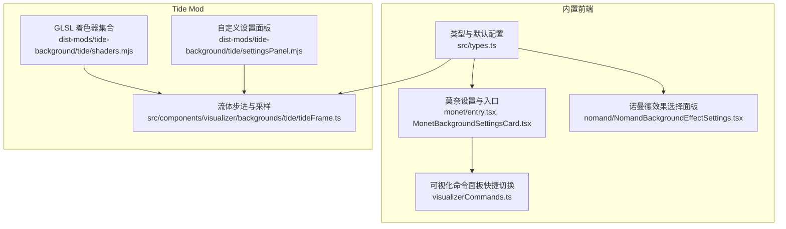
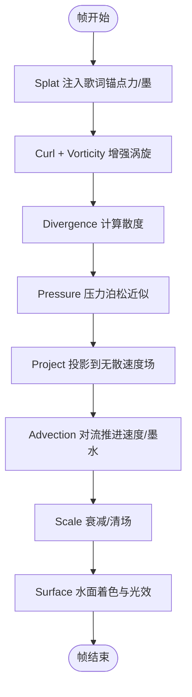
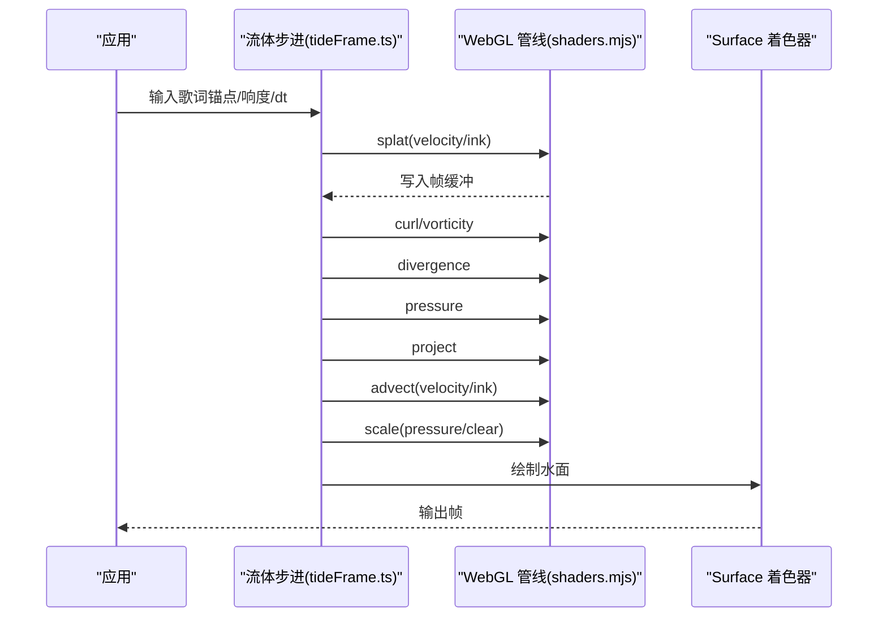
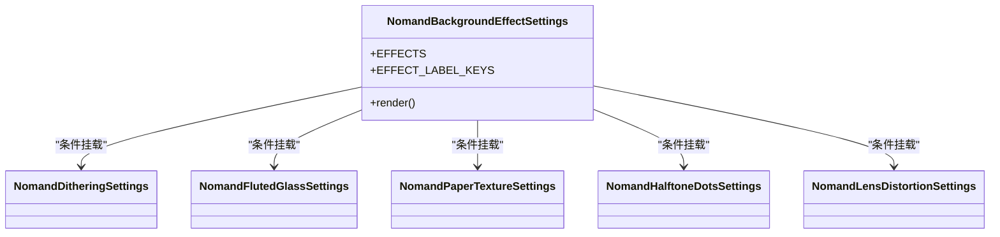
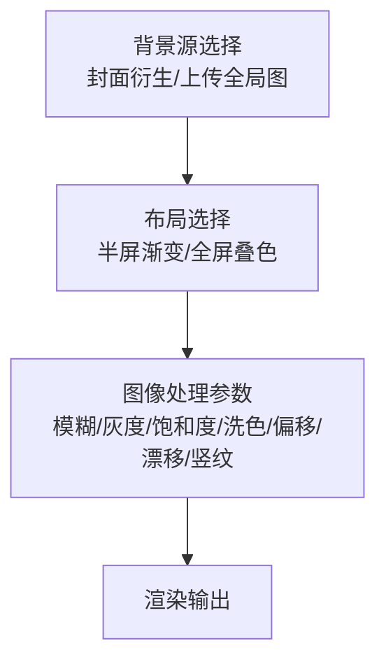
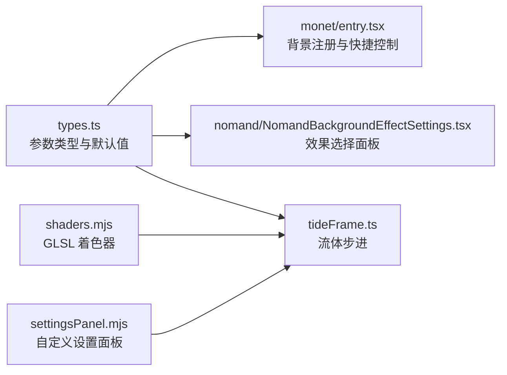

# 高级背景效果

<cite>
**本文引用的文件**   
- [shaders.mjs](file://dist-mods/tide-background/tide/shaders.mjs)
- [settingsPanel.mjs](file://dist-mods/tide-background/tide/settingsPanel.mjs)
- [tideFrame.ts](file://src/components/visualizer/backgrounds/tide/tideFrame.ts)
- [nomandSettings.tsx](file://src/components/visualizer/backgrounds/nomand/NomandBackgroundEffectSettings.tsx)
- [types.ts](file://src/types.ts)
- [monetEntry.tsx](file://src/components/visualizer/backgrounds/monet/entry.tsx)
- [monetSettingsCard.tsx](file://src/components/visualizer/backgrounds/monet/MonetBackgroundSettingsCard.tsx)
- [visualizerCommands.ts](file://src/components/command-palette/commands/visualizerCommands.ts)
</cite>

## 目录
1. [引言](#引言)
2. [项目结构](#项目结构)
3. [核心组件](#核心组件)
4. [架构总览](#架构总览)
5. [详细组件分析](#详细组件分析)
6. [依赖关系分析](#依赖关系分析)
7. [性能与优化](#性能与优化)
8. [故障排查指南](#故障排查指南)
9. [结论](#结论)

## 引言
本文件聚焦于三类高级背景效果：Tide 潮汐流体、Nomand 艺术风格、Monet 印象派图像后处理。内容涵盖 GLSL 着色器管线、纹理与帧缓冲交互、歌词驱动与音频驱动的视觉反馈、GPU 资源管理、帧率控制策略，以及用户界面设置面板的参数调节机制。目标是帮助开发者与使用者理解这些效果的实现原理、扩展方式与调优方法。

## 项目结构
高级背景效果分布在两个层面：
- 内置前端模块：以 React 组件和类型定义组织，负责 UI 设置、参数持久化与渲染入口。
- Tide 独立 mod：将 GLSL 源码与运行期逻辑打包为可插拔模块，提供自定义设置面板与更贴近参考实现的流体管线。

**图示来源**
- [types.ts:919-1033](file://src/types.ts#L919-L1033)
- [monetEntry.tsx:1-71](file://src/components/visualizer/backgrounds/monet/entry.tsx#L1-L71)
- [nomandSettings.tsx:1-73](file://src/components/visualizer/backgrounds/nomand/NomandBackgroundEffectSettings.tsx#L1-L73)
- [shaders.mjs:1-269](file://dist-mods/tide-background/tide/shaders.mjs#L1-L269)
- [settingsPanel.mjs:1-370](file://dist-mods/tide-background/tide/settingsPanel.mjs#L1-L370)
- [tideFrame.ts:76-112](file://src/components/visualizer/backgrounds/tide/tideFrame.ts#L76-L112)

**章节来源**
- [types.ts:919-1033](file://src/types.ts#L919-L1033)
- [monetEntry.tsx:1-71](file://src/components/visualizer/backgrounds/monet/entry.tsx#L1-L71)
- [nomandSettings.tsx:1-73](file://src/components/visualizer/backgrounds/nomand/NomandBackgroundEffectSettings.tsx#L1-L73)
- [shaders.mjs:1-269](file://dist-mods/tide-background/tide/shaders.mjs#L1-L269)
- [settingsPanel.mjs:1-370](file://dist-mods/tide-background/tide/settingsPanel.mjs#L1-L370)
- [tideFrame.ts:76-112](file://src/components/visualizer/backgrounds/tide/tideFrame.ts#L76-L112)

## 核心组件
- Tide 潮汐流体
  - 着色器：顶点/流体通用顶点、Splat、Curl/Vorticity、Divergence、Pressure、Project、Advection、Scale、Surface。
  - 运行时：歌词锚点采样、响度驱动耗散、速度场与墨水场的双缓冲交换、相机跟随与呼吸力。
- Nomand 艺术效果
  - 效果枚举：抖动、条纹玻璃、纸张纹理、半调网点、镜头畸变。
  - 设置面板：按当前 effect 动态挂载对应的小面板；参数通过类型与持久化层统一约束。
- Monet 印象派风格
  - 背景源：封面衍生或上传全局图。
  - 布局：半屏渐变或全屏叠色。
  - 参数：模糊、灰度、饱和度、洗色、偏移、漂移、竖纹等。
  - 命令面板：一键切换布局模式。

**章节来源**
- [shaders.mjs:1-269](file://dist-mods/tide-background/tide/shaders.mjs#L1-L269)
- [tideFrame.ts:76-112](file://src/components/visualizer/backgrounds/tide/tideFrame.ts#L76-L112)
- [nomandSettings.tsx:1-73](file://src/components/visualizer/backgrounds/nomand/NomandBackgroundEffectSettings.tsx#L1-L73)
- [types.ts:919-1033](file://src/types.ts#L919-L1033)
- [monetEntry.tsx:1-71](file://src/components/visualizer/backgrounds/monet/entry.tsx#L1-L71)
- [monetSettingsCard.tsx:190-213](file://src/components/visualizer/backgrounds/monet/MonetBackgroundSettingsCard.tsx#L190-L213)
- [visualizerCommands.ts:79-104](file://src/components/command-palette/commands/visualizerCommands.ts#L79-L104)

## 架构总览
Tide 采用经典 Navier-Stokes 流体求解的 GPU 管线：向速度场施加 Splat，计算 Curl 与 Vorticity 增强涡旋，再经 Divergence、Pressure 迭代求解压力场，最后 Project 得到无散速度场并 Advection 推进各标量场（速度、墨水）。Surface 着色器将速度场与墨水场合成连续水面，叠加波浪解析函数、掠射高光、雾与相机运动。

**图示来源**
- [shaders.mjs:42-145](file://dist-mods/tide-background/tide/shaders.mjs#L42-L145)
- [shaders.mjs:147-269](file://dist-mods/tide-background/tide/shaders.mjs#L147-L269)

## 详细组件分析

### Tide 潮汐效果
- 着色器技术
  - 流体顶点：计算邻域 UV 用于有限差分。
  - Splat：高斯衰减向目标场注入值，支持宽高比与半径。
  - Curl/Vorticity：基于速度场梯度构造涡旋增强项，限制速度幅值避免数值爆炸。
  - Divergence/Pressure：四邻域差分与平均迭代，构建压力场。
  - Project：从速度场减去压力梯度，得到无散速度场。
  - Advection：沿速度场反向追踪采样源场，使用 (1 + fade*dt) 时间无关衰减。
  - Scale：乘以常数用于衰减压力场或清空缓冲。
  - Surface：多组解析波叠加、法线构造、掠射高光、雾、相机平移、墨水辉光、开场扫入。
- 运行时逻辑
  - 歌词锚点采样：根据歌词位置生成向量，合并相邻字形成更稳定的推力。
  - 响度驱动耗散：安静时保持设定耗散，越响耗散越小，使墨迹更持久。
  - 双缓冲交换：velocity/ink 读写对每 pass 交换，避免额外拷贝。
  - 相机跟随：整片水面随歌词位置平移俯仰，splat 反向补偿确保水花落在字下。
  - 呼吸力：低频+整体音量驱动全局浪高放大。

**图示来源**
- [tideFrame.ts:76-112](file://src/components/visualizer/backgrounds/tide/tideFrame.ts#L76-L112)
- [shaders.mjs:42-145](file://dist-mods/tide-background/tide/shaders.mjs#L42-L145)
- [shaders.mjs:147-269](file://dist-mods/tide-background/tide/shaders.mjs#L147-L269)

**章节来源**
- [shaders.mjs:42-145](file://dist-mods/tide-background/tide/shaders.mjs#L42-L145)
- [shaders.mjs:147-269](file://dist-mods/tide-background/tide/shaders.mjs#L147-L269)
- [tideFrame.ts:76-112](file://src/components/visualizer/backgrounds/tide/tideFrame.ts#L76-L112)

### Nomand 艺术效果
- 效果体系
  - dithering：抖动算法，支持尺寸、颜色级数、原色/反相。
  - fluted-glass：条纹玻璃扭曲与模糊。
  - paper-texture：纸张对比度、粗糙度、纤维强度。
  - halftone-dots：半调网点大小、半径、对比度、原色/反相。
  - lens-distortion：扩散、鼓胀、色散。
- 设置面板
  - 顶部效果选择按钮网格，选中态高亮。
  - 根据 effect 动态挂载对应的小面板，减少冗余控件。
  - 所有参数受类型与持久化层约束，保证范围与默认值一致。

**图示来源**
- [nomandSettings.tsx:1-73](file://src/components/visualizer/backgrounds/nomand/NomandBackgroundEffectSettings.tsx#L1-L73)

**章节来源**
- [nomandSettings.tsx:1-73](file://src/components/visualizer/backgrounds/nomand/NomandBackgroundEffectSettings.tsx#L1-L73)
- [types.ts:938-962](file://src/types.ts#L938-L962)

### Monet 印象派风格
- 背景源与布局
  - 背景源：封面衍生或上传全局图。
  - 布局：半屏渐变或全屏叠色。
- 参数维度
  - 模糊像素、覆盖不透明度、灰度、饱和度、洗色强度与颜色模式、半屏偏移、缓慢漂移、竖向纹理开关。
- 命令面板
  - 提供“全屏叠色”和“半屏渐变”两种快捷命令，快速切换布局。

**图示来源**
- [monetEntry.tsx:1-71](file://src/components/visualizer/backgrounds/monet/entry.tsx#L1-L71)
- [monetSettingsCard.tsx:190-213](file://src/components/visualizer/backgrounds/monet/MonetBackgroundSettingsCard.tsx#L190-L213)
- [visualizerCommands.ts:79-104](file://src/components/command-palette/commands/visualizerCommands.ts#L79-L104)
- [types.ts:919-936](file://src/types.ts#L919-L936)

**章节来源**
- [monetEntry.tsx:1-71](file://src/components/visualizer/backgrounds/monet/entry.tsx#L1-L71)
- [monetSettingsCard.tsx:190-213](file://src/components/visualizer/backgrounds/monet/MonetBackgroundSettingsCard.tsx#L190-L213)
- [visualizerCommands.ts:79-104](file://src/components/command-palette/commands/visualizerCommands.ts#L79-L104)
- [types.ts:919-936](file://src/types.ts#L919-L936)

## 依赖关系分析
- 类型与默认配置
  - MonetBackgroundTuning、NomandBackgroundTuning、TideBackgroundTuning 集中定义参数键、默认值与取值范围，贯穿 UI 与渲染层。
- 前端 UI 与命令
  - Monet 入口注册背景模式、QuickControlChip 切换布局；命令面板提供快捷键式切换。
  - Nomand 效果选择面板仅挂载当前 effect 的子面板，降低复杂度。
- Tide 运行时与着色器
  - tideFrame.ts 调用 shaders.mjs 中的 pass 序列，完成流体模拟与水面绘制。
  - settingsPanel.mjs 在 ShadowRoot 中自建表单控件，与 schema 参数双向同步。

**图示来源**
- [types.ts:919-1033](file://src/types.ts#L919-L1033)
- [monetEntry.tsx:1-71](file://src/components/visualizer/backgrounds/monet/entry.tsx#L1-L71)
- [nomandSettings.tsx:1-73](file://src/components/visualizer/backgrounds/nomand/NomandBackgroundEffectSettings.tsx#L1-L73)
- [shaders.mjs:1-269](file://dist-mods/tide-background/tide/shaders.mjs#L1-L269)
- [settingsPanel.mjs:1-370](file://dist-mods/tide-background/tide/settingsPanel.mjs#L1-L370)
- [tideFrame.ts:76-112](file://src/components/visualizer/backgrounds/tide/tideFrame.ts#L76-L112)

**章节来源**
- [types.ts:919-1033](file://src/types.ts#L919-L1033)
- [monetEntry.tsx:1-71](file://src/components/visualizer/backgrounds/monet/entry.tsx#L1-L71)
- [nomandSettings.tsx:1-73](file://src/components/visualizer/backgrounds/nomand/NomandBackgroundEffectSettings.tsx#L1-L73)
- [shaders.mjs:1-269](file://dist-mods/tide-background/tide/shaders.mjs#L1-L269)
- [settingsPanel.mjs:1-370](file://dist-mods/tide-background/tide/settingsPanel.mjs#L1-L370)
- [tideFrame.ts:76-112](file://src/components/visualizer/backgrounds/tide/tideFrame.ts#L76-L112)

## 性能与优化
- GPU 资源管理
  - 双缓冲纹理：velocity/ink 读写对交换，避免频繁分配与拷贝。
  - Pass 顺序固定且最小化 draw call：每个 splat 一次绘制，避免 uniform 数组带来的状态切换。
  - ES 1.00 兼容：确保 WebGL1 上下文可用，扩大设备兼容性。
- 帧率与稳定性
  - 时间无关衰减：Advection 中使用 (1 + fade*dt)，使衰减与帧率解耦。
  - 速度幅值钳制：Vorticity 中对速度进行 clamp，防止数值发散导致闪烁。
  - 歌词锚点采样间隔：sampleSeconds 增大可减少向量数量，提升稳定性；减小则更跟手但可能增加噪声。
  - 响度驱动耗散：安静时保持干净利落的水面，越响耗散越小，墨迹持久，避免高频抖动。
- 渲染优化
  - Surface 使用解析波与法线构造，避免几何网格；掠射高光与雾只在必要区域生效。
  - 相机跟随仅在 followLyrics 开启时启用，减少不必要的位移计算。
  - Monet 漂移使用 CSS 合成层动画，不参与背景烘焙，降低 GPU 压力。

[本节为通用性能建议，不直接分析具体代码文件]

## 故障排查指南
- Tide 流体异常
  - 现象：水面闪烁或速度爆炸。
  - 排查：检查 vorticity 的速度钳制是否生效；确认 dt 与 fade 参数合理；适当提高 dissipation。
  - 相关实现：vorticity 片段着色器中对速度进行 clamp；advection 使用时间无关衰减。
- 歌词锚点不稳定
  - 现象：水花跳跃或拖尾断裂。
  - 排查：增大 sampleSeconds 或 maxAnchors；调整 smoothing 平滑系数；降低 intensity。
  - 相关实现：歌词锚点采样与滑动平滑逻辑位于运行时。
- Nomand 效果不生效
  - 现象：切换 effect 后无变化。
  - 排查：确认当前 effect 是否正确挂载子面板；检查参数范围是否被持久化层截断。
  - 相关实现：effect 选择与子面板挂载逻辑。
- Monet 布局未切换
  - 现象：命令面板点击无效。
  - 排查：确认命令执行路径是否调用 setMonetBackgroundTuning；检查 backgroundLayout 值是否为合法枚举。
  - 相关实现：命令面板与 QuickControlChip 切换逻辑。

**章节来源**
- [shaders.mjs:68-84](file://dist-mods/tide-background/tide/shaders.mjs#L68-L84)
- [shaders.mjs:125-135](file://dist-mods/tide-background/tide/shaders.mjs#L125-L135)
- [nomandSettings.tsx:1-73](file://src/components/visualizer/backgrounds/nomand/NomandBackgroundEffectSettings.tsx#L1-L73)
- [visualizerCommands.ts:79-104](file://src/components/command-palette/commands/visualizerCommands.ts#L79-L104)

## 结论
Tide、Nomand、Monet 三类背景效果分别代表了流体模拟、艺术风格化与图像后处理的典型实现。Tide 通过完整的 GPU 流体管线与歌词/音频驱动，呈现自然且富有表现力的水面；Nomand 通过模块化效果与精简设置面板，提供丰富的视觉风格；Monet 则以轻量参数组合实现印象派风格的背景氛围。三者共同依托类型系统、UI 设置与命令面板，形成可扩展、可调试、高性能的背景生态。