# 自定义主题编辑器

<cite>
**本文引用的文件**   
- [ThemePark.tsx](file://src/components/modal/ThemePark.tsx)
- [useThemeParkDraft.ts](file://src/components/modal/theme-park/useThemeParkDraft.ts)
- [ThemeParkColorPanel.tsx](file://src/components/modal/theme-park/ThemeParkColorPanel.tsx)
- [ThemeParkPreview.tsx](file://src/components/modal/theme-park/ThemeParkPreview.tsx)
- [ThemeParkDetailsPanel.tsx](file://src/components/modal/theme-park/ThemeParkDetailsPanel.tsx)
- [ThemeParkContentPanel.tsx](file://src/components/modal/theme-park/ThemeParkContentPanel.tsx)
- [ThemeParkAiPanel.tsx](file://src/components/modal/theme-park/ThemeParkAiPanel.tsx)
- [themeSanitizer.ts](file://src/services/themeSanitizer.ts)
- [themeCache.ts](file://src/services/themeCache.ts)
- [appearanceCodec.ts](file://src/utils/appearanceCodec.ts)
- [syncClient.ts](file://src/services/sync/syncClient.ts)
- [app.ts（同步服务器）](file://sync-server/src/app.ts)
- [themeSyncRegistry.ts](file://src/services/sync/themeSyncRegistry.ts)
</cite>

## 目录
1. [简介](#简介)
2. [项目结构](#项目结构)
3. [核心组件](#核心组件)
4. [架构总览](#架构总览)
5. [详细组件分析](#详细组件分析)
6. [依赖关系分析](#依赖关系分析)
7. [性能与实时性](#性能与实时性)
8. [序列化、压缩与版本迁移](#序列化压缩与版本迁移)
9. [主题验证与安全过滤](#主题验证与安全过滤)
10. [导入导出与批量操作](#导入导出与批量操作)
11. [主题分享与云端同步](#主题分享与云端同步)
12. [开发者接口与扩展点](#开发者接口与扩展点)
13. [故障排查指南](#故障排查指南)
14. [结论](#结论)

## 简介
本文件为 Folia Major 的“自定义主题编辑器”技术文档，聚焦以下目标：
- 解释编辑器的用户界面设计：颜色选择器、预览面板与实时反馈机制。
- 说明主题数据的序列化与反序列化：JSON 格式、压缩短码存储与版本迁移。
- 阐述主题验证机制：字段检查、颜色合法性校验与安全过滤。
- 说明主题导入导出功能：文件格式、兼容性与批量操作。
- 描述主题分享机制：云端同步与社区分享能力。
- 提供开发者接口：允许第三方扩展编辑器功能。

## 项目结构
主题编辑器以 React 组件为核心，围绕“左侧可视化预览 + 右侧分栏编辑”布局组织：
- 顶层容器：ThemePark.tsx 负责整体布局、标签页切换、保存流程与上下文注入。
- 编辑状态：useThemeParkDraft.ts 维护双模式（亮/暗）草稿、节流更新、重置与最终主题构建。
- 颜色面板：ThemeParkColorPanel.tsx 提供色板、取色器与 HEX 输入。
- 详情面板：ThemeParkDetailsPanel.tsx 编辑名称与描述。
- 内容面板：ThemeParkContentPanel.tsx 管理歌词词高亮与图标列表。
- AI 面板：ThemeParkAiPanel.tsx 支持提示词复制、JSON 导入与 JSON 导出。
- 预览面板：ThemeParkPreview.tsx 通过 VisualizerRenderer 渲染实时效果。
- 安全与缓存：themeSanitizer.ts 负责数据清洗；themeCache.ts 负责本地缓存读取与迁移。
- 压缩与分享：appearanceCodec.ts 提供压缩短码编解码；syncClient.ts 与 sync-server app.ts 实现云端同步。

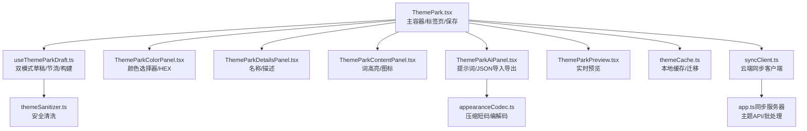

**图表来源**
- [ThemePark.tsx:74-141](file://src/components/modal/ThemePark.tsx#L74-L141)
- [useThemeParkDraft.ts:37-178](file://src/components/modal/theme-park/useThemeParkDraft.ts#L37-L178)
- [ThemeParkColorPanel.tsx:26-165](file://src/components/modal/theme-park/ThemeParkColorPanel.tsx#L26-L165)
- [ThemeParkDetailsPanel.tsx:22-90](file://src/components/modal/theme-park/ThemeParkDetailsPanel.tsx#L22-L90)
- [ThemeParkContentPanel.tsx:19-199](file://src/components/modal/theme-park/ThemeParkContentPanel.tsx#L19-L199)
- [ThemeParkAiPanel.tsx:21-150](file://src/components/modal/theme-park/ThemeParkAiPanel.tsx#L21-L150)
- [ThemeParkPreview.tsx:159-250](file://src/components/modal/theme-park/ThemeParkPreview.tsx#L159-L250)
- [themeSanitizer.ts:118-161](file://src/services/themeSanitizer.ts#L118-L161)
- [themeCache.ts:15-76](file://src/services/themeCache.ts#L15-L76)
- [appearanceCodec.ts:614-640](file://src/utils/appearanceCodec.ts#L614-L640)
- [syncClient.ts:96-151](file://src/services/sync/syncClient.ts#L96-L151)
- [app.ts（同步服务器）:373-494](file://sync-server/src/app.ts#L373-L494)

**章节来源**
- [ThemePark.tsx:74-141](file://src/components/modal/ThemePark.tsx#L74-L141)
- [useThemeParkDraft.ts:37-178](file://src/components/modal/theme-park/useThemeParkDraft.ts#L37-L178)

## 核心组件
- 主题编辑器主容器（ThemePark.tsx）
  - 职责：组合预览区与右侧编辑面板；管理标签页（颜色/详情/内容/AI）；触发保存逻辑；将当前视觉模式与字体参数注入预览。
  - 关键行为：根据目标（AI 主题或自定义主题）调用不同保存回调；计算推荐色板；对名称有效性进行校验。
- 编辑状态钩子（useThemeParkDraft.ts）
  - 职责：维护每个编辑目标的独立草稿；按亮/暗模式分别编辑；节流高频颜色拖拽；提供重置、替换草稿与构建最终主题的能力。
  - 关键行为：COLOR_THROTTLE_MS 控制约 30fps 提交频率；pending color 在拖拽结束时不会丢失；safeDraft 始终基于 baseTheme 规范化。
- 颜色面板（ThemeParkColorPanel.tsx）
  - 职责：展示四色槽位（背景/主色/强调色/次色），支持快速取色器与 HEX 输入；显示推荐色块。
  - 交互：onColorDrag 用于实时预览，onColorPick 用于即时提交；onHexCommit 使用安全函数归一化 HEX。
- 详情面板（ThemeParkDetailsPanel.tsx）
  - 职责：编辑每模式的名称与描述；提供长度限制与无效名称高亮。
- 内容面板（ThemeParkContentPanel.tsx）
  - 职责：编辑歌词词高亮条目与歌词图标列表；限制最大数量并校验图标名是否存在。
- AI 面板（ThemeParkAiPanel.tsx）
  - 职责：复制生成提示词；粘贴 JSON 导入到草稿；导出当前草稿为 JSON。
- 预览面板（ThemeParkPreview.tsx）
  - 职责：通过 VisualizerRenderer 渲染预览；叠加模式徽章、活跃编辑标记与可视化模式标签；支持暂停/播放预览。

**章节来源**
- [ThemePark.tsx:74-141](file://src/components/modal/ThemePark.tsx#L74-L141)
- [useThemeParkDraft.ts:16-178](file://src/components/modal/theme-park/useThemeParkDraft.ts#L16-L178)
- [ThemeParkColorPanel.tsx:26-165](file://src/components/modal/theme-park/ThemeParkColorPanel.tsx#L26-L165)
- [ThemeParkDetailsPanel.tsx:22-90](file://src/components/modal/theme-park/ThemeParkDetailsPanel.tsx#L22-L90)
- [ThemeParkContentPanel.tsx:19-199](file://src/components/modal/theme-park/ThemeParkContentPanel.tsx#L19-L199)
- [ThemeParkAiPanel.tsx:21-150](file://src/components/modal/theme-park/ThemeParkAiPanel.tsx#L21-L150)
- [ThemeParkPreview.tsx:159-250](file://src/components/modal/theme-park/ThemeParkPreview.tsx#L159-L250)

## 架构总览
主题编辑器采用“预览驱动编辑”的架构：用户在右侧面板修改主题字段，左侧预览实时反映变化；保存时统一构建最终主题并通过不同回调持久化。

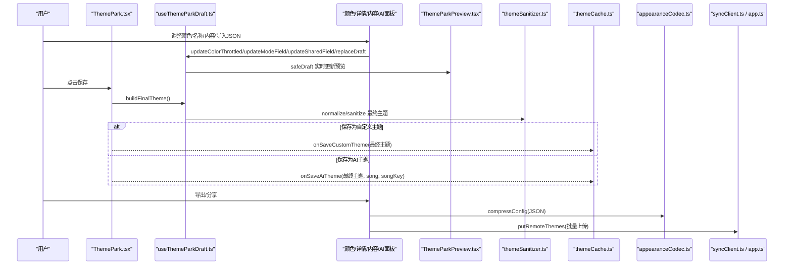

**图表来源**
- [ThemePark.tsx:179-190](file://src/components/modal/ThemePark.tsx#L179-L190)
- [useThemeParkDraft.ts:170-178](file://src/components/modal/theme-park/useThemeParkDraft.ts#L170-L178)
- [ThemeParkColorPanel.tsx:117-137](file://src/components/modal/theme-park/ThemeParkColorPanel.tsx#L117-L137)
- [ThemeParkAiPanel.tsx:46-71](file://src/components/modal/theme-park/ThemeParkAiPanel.tsx#L46-L71)
- [appearanceCodec.ts:614-640](file://src/utils/appearanceCodec.ts#L614-L640)
- [syncClient.ts:104-151](file://src/services/sync/syncClient.ts#L104-L151)
- [app.ts（同步服务器）:373-494](file://sync-server/src/app.ts#L373-L494)

## 详细组件分析

### 颜色选择器与实时反馈
- 颜色面板提供四种可编辑颜色槽位，支持快速取色器与 HEX 输入。
- 拖拽取色事件以约 30fps 节流提交，避免频繁重绘；松开时确保最新值被应用。
- HEX 输入在失焦时通过安全函数归一化，非法值回退到基色或硬默认值。
- 推荐色板由封面提取颜色生成，点击可直接应用到当前选中槽位。

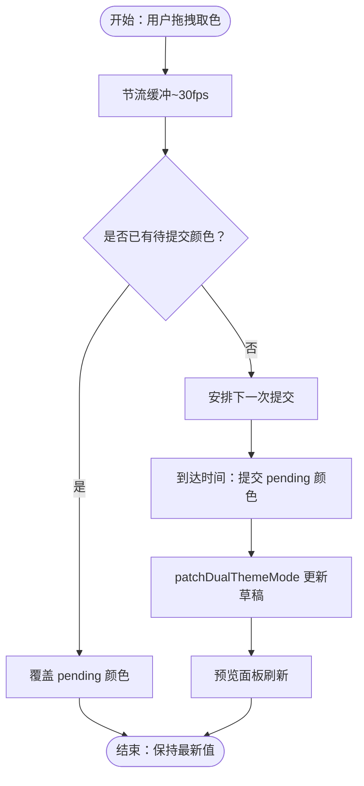

**图表来源**
- [useThemeParkDraft.ts:114-131](file://src/components/modal/theme-park/useThemeParkDraft.ts#L114-L131)
- [ThemeParkColorPanel.tsx:117-137](file://src/components/modal/theme-park/ThemeParkColorPanel.tsx#L117-L137)

**章节来源**
- [ThemeParkColorPanel.tsx:26-165](file://src/components/modal/theme-park/ThemeParkColorPanel.tsx#L26-L165)
- [useThemeParkDraft.ts:114-131](file://src/components/modal/theme-park/useThemeParkDraft.ts#L114-L131)

### 预览面板与可视化渲染
- 预览面板复用播放器使用的 VisualizerRenderer，保证所见即所得。
- 顶部叠加模式徽章（亮/暗）、活跃编辑标记与可视化模式标签。
- 支持暂停/播放预览，便于观察动画强度与过渡效果。

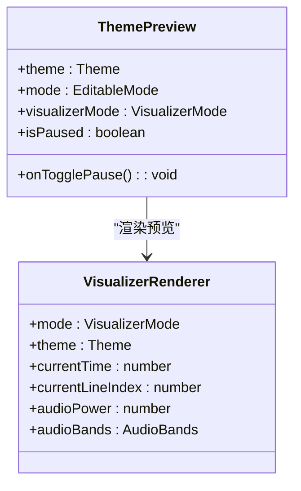

**图表来源**
- [ThemeParkPreview.tsx:159-250](file://src/components/modal/theme-park/ThemeParkPreview.tsx#L159-L250)

**章节来源**
- [ThemeParkPreview.tsx:159-250](file://src/components/modal/theme-park/ThemeParkPreview.tsx#L159-L250)

### 详情与内容编辑
- 详情面板：编辑名称与描述，提供长度限制与无效名称高亮。
- 内容面板：编辑歌词词高亮条目（词+颜色）与歌词图标列表；限制最大数量并校验图标名是否存在。

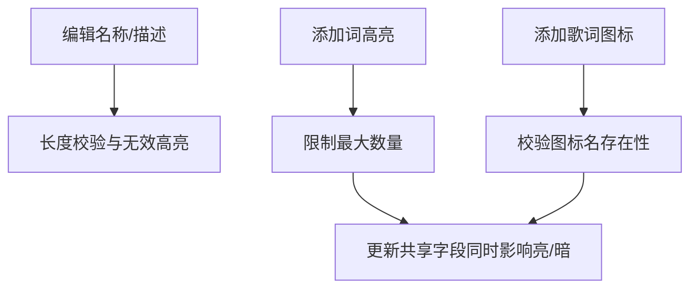

**图表来源**
- [ThemeParkDetailsPanel.tsx:22-90](file://src/components/modal/theme-park/ThemeParkDetailsPanel.tsx#L22-L90)
- [ThemeParkContentPanel.tsx:30-53](file://src/components/modal/theme-park/ThemeParkContentPanel.tsx#L30-L53)

**章节来源**
- [ThemeParkDetailsPanel.tsx:22-90](file://src/components/modal/theme-park/ThemeParkDetailsPanel.tsx#L22-L90)
- [ThemeParkContentPanel.tsx:19-199](file://src/components/modal/theme-park/ThemeParkContentPanel.tsx#L19-L199)

### AI 面板与 JSON 往返
- 支持复制生成提示词，便于外部 AI 工具生成主题 JSON。
- 支持粘贴 JSON 导入到草稿，经解析与安全清洗后进入预览，再决定是否保存。
- 支持导出当前草稿为 JSON，便于分享或离线备份。

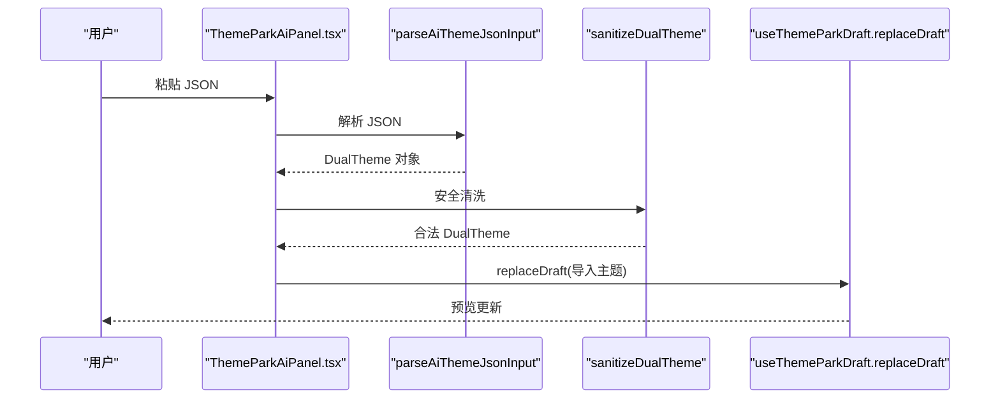

**图表来源**
- [ThemeParkAiPanel.tsx:56-71](file://src/components/modal/theme-park/ThemeParkAiPanel.tsx#L56-L71)
- [useThemeParkDraft.ts:146-149](file://src/components/modal/theme-park/useThemeParkDraft.ts#L146-L149)
- [themeSanitizer.ts:151-161](file://src/services/themeSanitizer.ts#L151-L161)

**章节来源**
- [ThemeParkAiPanel.tsx:21-150](file://src/components/modal/theme-park/ThemeParkAiPanel.tsx#L21-L150)

## 依赖关系分析
- 组件耦合
  - ThemePark.tsx 聚合所有编辑面板与预览，承担协调职责。
  - useThemeParkDraft.ts 作为状态中枢，被各面板调用以更新草稿。
  - ThemeParkPreview.tsx 依赖 VisualizerRenderer 渲染，不直接修改主题数据。
- 数据流
  - 用户输入 -> 面板回调 -> 草稿更新 -> 预览刷新 -> 保存构建最终主题。
- 外部依赖
  - themeSanitizer.ts 在所有入口（导入/保存/缓存）统一清洗数据。
  - appearanceCodec.ts 提供压缩短码编解码，用于分享与导入。
  - syncClient.ts 与同步服务器 app.ts 提供云端同步 API。

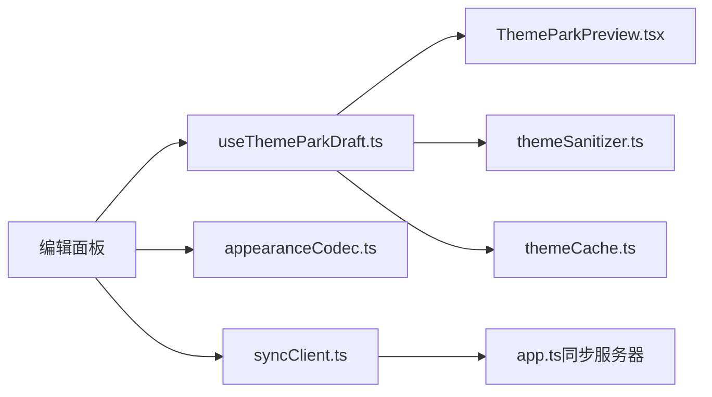

**图表来源**
- [ThemePark.tsx:74-141](file://src/components/modal/ThemePark.tsx#L74-L141)
- [useThemeParkDraft.ts:37-178](file://src/components/modal/theme-park/useThemeParkDraft.ts#L37-L178)
- [themeSanitizer.ts:118-161](file://src/services/themeSanitizer.ts#L118-L161)
- [appearanceCodec.ts:614-640](file://src/utils/appearanceCodec.ts#L614-L640)
- [syncClient.ts:96-151](file://src/services/sync/syncClient.ts#L96-L151)
- [app.ts（同步服务器）:373-494](file://sync-server/src/app.ts#L373-L494)

**章节来源**
- [ThemePark.tsx:74-141](file://src/components/modal/ThemePark.tsx#L74-L141)
- [useThemeParkDraft.ts:37-178](file://src/components/modal/theme-park/useThemeParkDraft.ts#L37-L178)

## 性能与实时性
- 颜色拖拽节流：约 30fps 提交频率，避免高频渲染导致卡顿。
- 预览优化：复用播放器渲染管线，减少额外开销；静态模式与透明度可调。
- 草稿隔离：每个编辑目标（AI/自定义）拥有独立草稿，避免互相覆盖。
- 安全快照：safeDraft 始终基于 baseTheme 规范化，防止脏数据污染预览。

[本节为通用性能讨论，不涉及具体文件分析]

## 序列化、压缩与版本迁移
- JSON 序列化
  - 主题数据以 DualTheme 结构保存，包含 light/dark 两套 Theme。
  - 导入/导出均通过 JSON 字符串进行，AI 面板支持复制/粘贴。
- 压缩短码
  - appearanceCodec.ts 提供 compressConfig/decompressConfig，将 JSON 编码为 base64 短码（前缀 folia-theme://），便于分享与存储。
  - 解码时兼容旧版字段缺失情况，自动填充默认值。
- 版本迁移
  - themeCache.ts 支持从旧版单 Theme 缓存迁移到 DualTheme，并在需要时注册同步记录。
  - themeSyncRegistry.ts 提供从 localStorage 到 IndexedDB 的迁移，保留较新的记录。

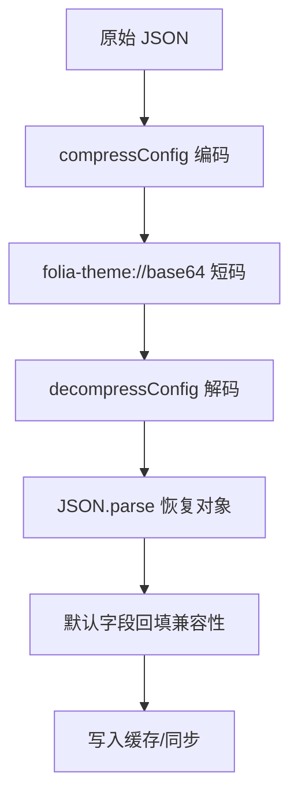

**图表来源**
- [appearanceCodec.ts:614-640](file://src/utils/appearanceCodec.ts#L614-L640)
- [themeCache.ts:15-76](file://src/services/themeCache.ts#L15-L76)
- [themeSyncRegistry.ts:72-98](file://src/services/sync/themeSyncRegistry.ts#L72-L98)

**章节来源**
- [appearanceCodec.ts:614-640](file://src/utils/appearanceCodec.ts#L614-L640)
- [themeCache.ts:15-76](file://src/services/themeCache.ts#L15-L76)
- [themeSyncRegistry.ts:72-98](file://src/services/sync/themeSyncRegistry.ts#L72-L98)

## 主题验证与安全过滤
- 颜色合法性
  - HEX 颜色必须匹配 #RGB/#RRGGBB 模式；非法值回退到基色或硬默认值。
  - 三字符 HEX 自动展开为六字符。
- 字段类型与枚举
  - fontStyle 仅接受 serif/mono/sans；animationIntensity 仅接受 calm/chaotic/normal。
  - wordColors 数组项需包含有效 word 与 color；lyricsIcons 最多保留 12 个。
- 安全清洗
  - sanitizeTheme/sanitizeDualTheme 对所有字段进行清洗与回退，确保数据结构稳定。
  - 导入 JSON 先解析再清洗，错误信息反馈给用户。

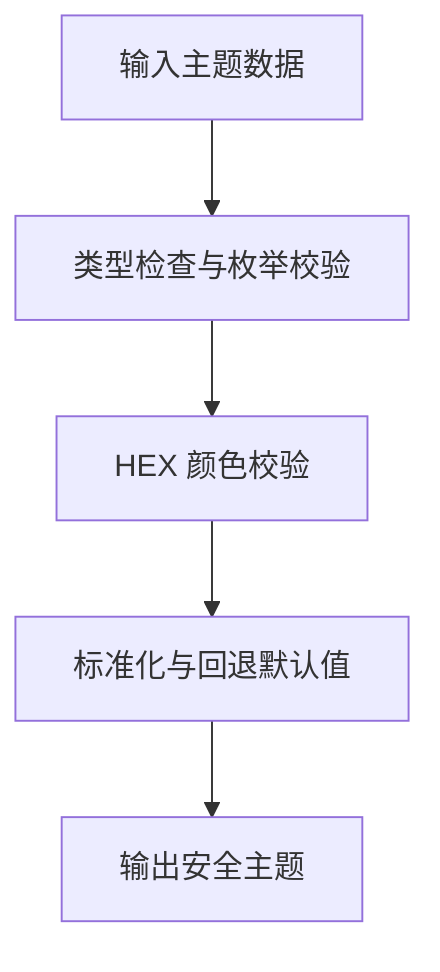

**图表来源**
- [themeSanitizer.ts:43-69](file://src/services/themeSanitizer.ts#L43-L69)
- [themeSanitizer.ts:71-116](file://src/services/themeSanitizer.ts#L71-L116)
- [themeSanitizer.ts:118-161](file://src/services/themeSanitizer.ts#L118-L161)

**章节来源**
- [themeSanitizer.ts:43-161](file://src/services/themeSanitizer.ts#L43-L161)

## 导入导出与批量操作
- 导入
  - AI 面板支持粘贴 JSON 到草稿，经解析与安全清洗后预览。
  - 外观配置支持从压缩短码或原始 JSON 导入。
- 导出
  - AI 面板支持导出当前草稿为 JSON。
  - 外观配置支持导出为压缩短码，便于分享。
- 批量操作
  - 同步客户端支持批量上传主题（themes/put）。
  - 同步服务器限制批次大小并进行输入校验。

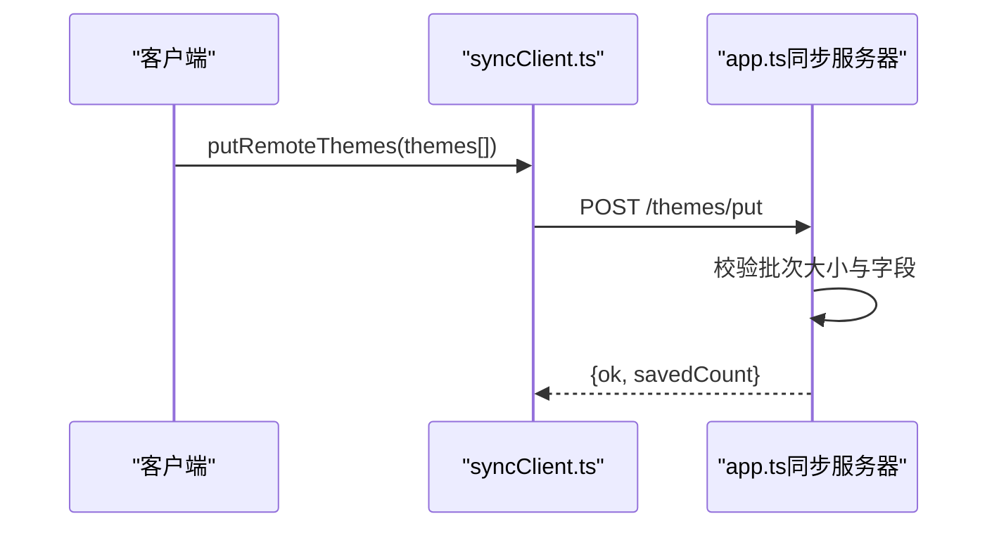

**图表来源**
- [syncClient.ts:104-116](file://src/services/sync/syncClient.ts#L104-L116)
- [app.ts（同步服务器）:388-474](file://sync-server/src/app.ts#L388-L474)

**章节来源**
- [ThemeParkAiPanel.tsx:46-71](file://src/components/modal/theme-park/ThemeParkAiPanel.tsx#L46-L71)
- [appearanceCodec.ts:614-640](file://src/utils/appearanceCodec.ts#L614-L640)
- [syncClient.ts:104-151](file://src/services/sync/syncClient.ts#L104-L151)
- [app.ts（同步服务器）:388-474](file://sync-server/src/app.ts#L388-L474)

## 主题分享与云端同步
- 云端同步
  - 客户端通过 syncClient.ts 调用 /themes/get、/themes/put、/themes/bucket 等接口。
  - 服务器端 app.ts 提供主题查询、批量保存与桶索引查询，支持指纹去重与增量更新。
- 分享机制
  - 压缩短码（folia-theme://...）便于跨设备分享。
  - 社区分享可通过导出 JSON 或短码进行分发。

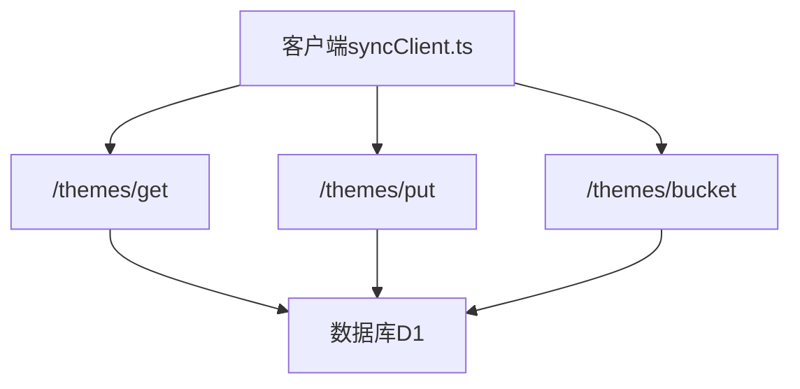

**图表来源**
- [syncClient.ts:96-151](file://src/services/sync/syncClient.ts#L96-L151)
- [app.ts（同步服务器）:373-494](file://sync-server/src/app.ts#L373-L494)

**章节来源**
- [syncClient.ts:96-151](file://src/services/sync/syncClient.ts#L96-L151)
- [app.ts（同步服务器）:373-494](file://sync-server/src/app.ts#L373-L494)

## 开发者接口与扩展点
- 编辑器扩展
  - 可在 ThemePark.tsx 中新增标签页与对应面板组件，接入 useThemeParkDraft 提供的更新方法。
  - 使用 COLOR_FIELDS 扩展颜色槽位定义，或在内容面板中添加新字段。
- 数据层扩展
  - 通过 themeSanitizer.ts 扩展字段校验规则与默认值策略。
  - 通过 appearanceCodec.ts 扩展压缩/解压逻辑或新增分享协议。
- 同步扩展
  - 通过 syncClient.ts 扩展云端 API 调用，适配新的同步后端。
  - 在 app.ts（同步服务器）中新增路由与数据处理逻辑。

[本节为概念性指导，不涉及具体文件分析]

## 故障排查指南
- 颜色异常
  - 现象：HEX 输入无效或颜色未更新。
  - 排查：确认 HEX 格式是否符合 #RGB/#RRGGBB；检查 normalizeThemeHexColor 的回退逻辑。
- 预览不刷新
  - 现象：调整颜色后预览无变化。
  - 排查：确认 updateColorThrottled 是否被调用；检查节流定时器是否被清理。
- 导入失败
  - 现象：粘贴 JSON 后报错。
  - 排查：确认 JSON 结构是否为 DualTheme；检查 parseAiThemeJsonInput 与 sanitizeDualTheme 的错误信息。
- 同步失败
  - 现象：批量上传主题失败。
  - 排查：检查批次大小是否超限；确认指纹与更新时间戳格式正确。

**章节来源**
- [themeSanitizer.ts:43-69](file://src/services/themeSanitizer.ts#L43-L69)
- [useThemeParkDraft.ts:114-131](file://src/components/modal/theme-park/useThemeParkDraft.ts#L114-L131)
- [ThemeParkAiPanel.tsx:56-71](file://src/components/modal/theme-park/ThemeParkAiPanel.tsx#L56-L71)
- [syncClient.ts:104-116](file://src/services/sync/syncClient.ts#L104-L116)

## 结论
Folia Major 的自定义主题编辑器以“预览驱动编辑”为核心，结合安全的主题数据清洗、高效的节流更新机制与完善的导入导出能力，为用户提供直观且强大的主题定制体验。通过云端同步与压缩短码分享，主题可在多设备与社区间自由流转。开发者可基于现有接口扩展编辑器功能，满足更复杂的主题需求。