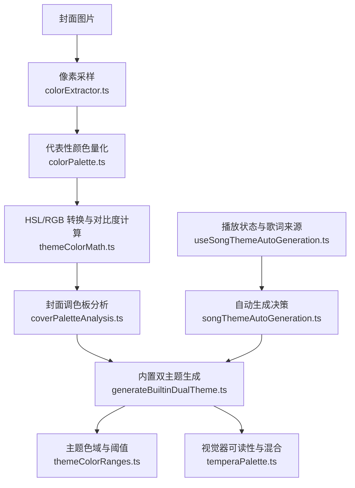
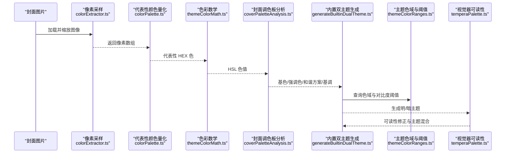
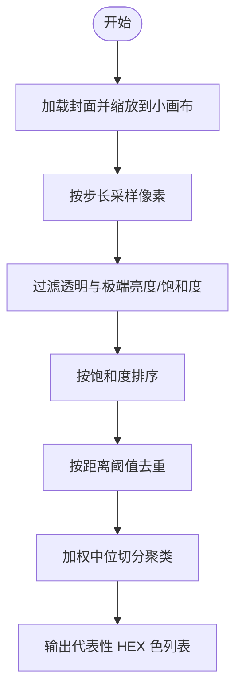
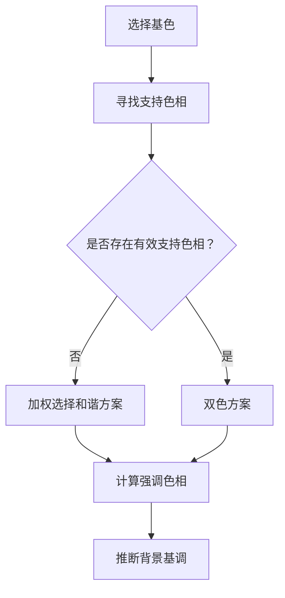
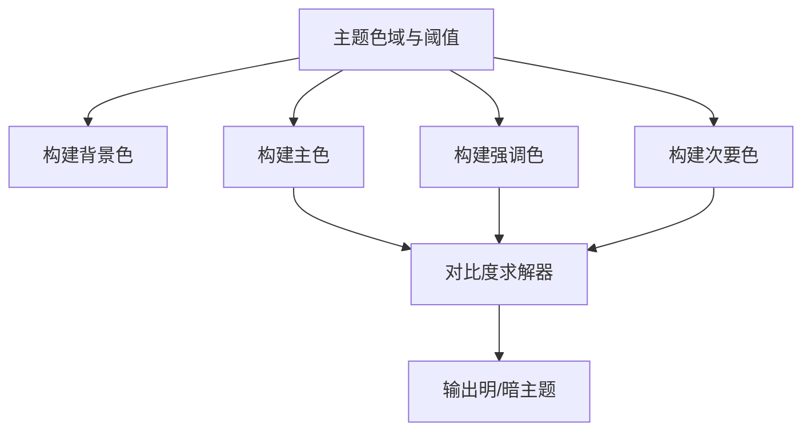
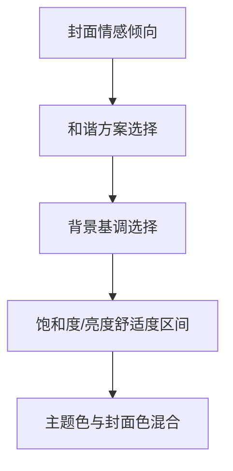
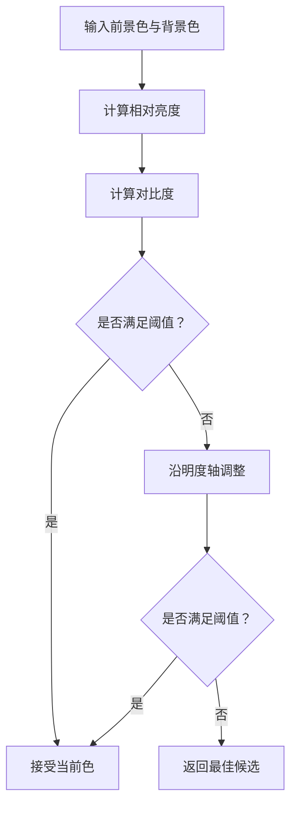
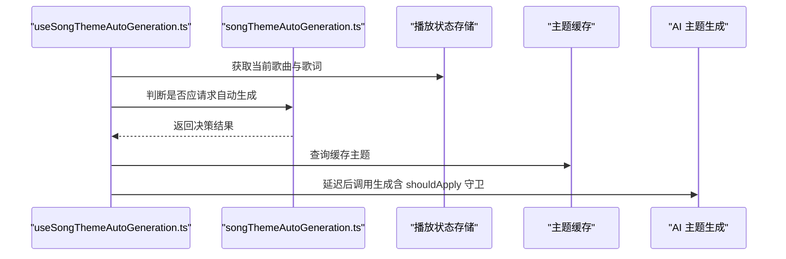
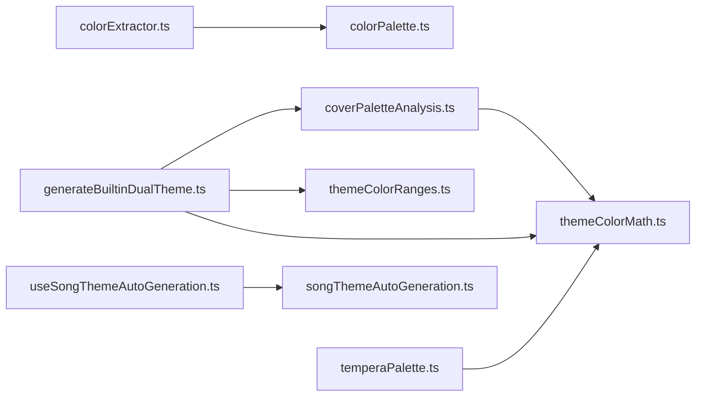

# 色彩提取与分析

<cite>
**本文引用的文件**   
- [src/utils/colorExtractor.ts](file://src/utils/colorExtractor.ts)
- [src/utils/colorPalette.ts](file://src/utils/colorPalette.ts)
- [src/utils/themeColorMath.ts](file://src/utils/themeColorMath.ts)
- [src/utils/builtinTheme/coverPaletteAnalysis.ts](file://src/utils/builtinTheme/coverPaletteAnalysis.ts)
- [src/utils/builtInTheme/generateBuiltinDualTheme.ts](file://src/utils/builtInTheme/generateBuiltinDualTheme.ts)
- [src/utils/builtInTheme/themeColorRanges.ts](file://src/utils/builtInTheme/themeColorRanges.ts)
- [src/components/visualizer/tempera/temperaPalette.ts](file://src/components/visualizer/tempera/temperaPalette.ts)
- [src/hooks/useSongThemeAutoGeneration.ts](file://src/hooks/useSongThemeAutoGeneration.ts)
- [src/utils/songThemeAutoGeneration.ts](file://src/utils/songThemeAutoGeneration.ts)
</cite>

## 目录
1. [引言](#引言)
2. [项目结构](#项目结构)
3. [核心组件](#核心组件)
4. [架构总览](#架构总览)
5. [详细组件分析](#详细组件分析)
6. [依赖关系分析](#依赖关系分析)
7. [性能考虑](#性能考虑)
8. [故障排查指南](#故障排查指南)
9. [结论](#结论)

## 引言
本技术文档聚焦 Folia Major 的色彩提取与分析系统，围绕封面图片的主色调提取、调色板生成策略、色彩范围映射、色彩心理学在主题生成中的应用，以及无障碍验证与性能优化进行系统化说明。文档面向不同技术背景的读者，提供从高层架构到代码级实现的渐进式解读，并辅以可视化图示帮助理解数据流与处理逻辑。

## 项目结构
色彩相关能力主要分布在以下模块：
- 图像像素采样与基础色提取：colorExtractor.ts
- 代表性颜色量化与聚类：colorPalette.ts
- 色彩数学与无障碍对比度：themeColorMath.ts
- 封面调色板分析与配色方案选择：coverPaletteAnalysis.ts
- 内置双主题（明/暗）生成：generateBuiltinDualTheme.ts
- 主题色域与对比度阈值配置：themeColorRanges.ts
- 视觉器中的可读性保障与主题混合：temperaPalette.ts
- 歌曲主题自动生成的触发与调度：useSongThemeAutoGeneration.ts、songThemeAutoGeneration.ts

**图表来源**
- [src/utils/colorExtractor.ts:10-119](file://src/utils/colorExtractor.ts#L10-L119)
- [src/utils/colorPalette.ts:76-142](file://src/utils/colorPalette.ts#L76-L142)
- [src/utils/themeColorMath.ts:19-182](file://src/utils/themeColorMath.ts#L19-L182)
- [src/utils/builtinTheme/coverPaletteAnalysis.ts:10-132](file://src/utils/builtinTheme/coverPaletteAnalysis.ts#L10-L132)
- [src/utils/builtInTheme/generateBuiltinDualTheme.ts:40-148](file://src/utils/builtInTheme/generateBuiltinDualTheme.ts#L40-L148)
- [src/utils/builtInTheme/themeColorRanges.ts:18-60](file://src/utils/builtInTheme/themeColorRanges.ts#L18-L60)
- [src/components/visualizer/tempera/temperaPalette.ts:121-154](file://src/components/visualizer/tempera/temperaPalette.ts#L121-L154)
- [src/hooks/useSongThemeAutoGeneration.ts:34-144](file://src/hooks/useSongThemeAutoGeneration.ts#L34-L144)
- [src/utils/songThemeAutoGeneration.ts:36-50](file://src/utils/songThemeAutoGeneration.ts#L36-L50)

**章节来源**
- [src/utils/colorExtractor.ts:10-119](file://src/utils/colorExtractor.ts#L10-L119)
- [src/utils/colorPalette.ts:76-142](file://src/utils/colorPalette.ts#L76-L142)
- [src/utils/themeColorMath.ts:19-182](file://src/utils/themeColorMath.ts#L19-L182)
- [src/utils/builtinTheme/coverPaletteAnalysis.ts:10-132](file://src/utils/builtinTheme/coverPaletteAnalysis.ts#L10-L132)
- [src/utils/builtInTheme/generateBuiltinDualTheme.ts:40-148](file://src/utils/builtInTheme/generateBuiltinDualTheme.ts#L40-L148)
- [src/utils/builtInTheme/themeColorRanges.ts:18-60](file://src/utils/builtInTheme/themeColorRanges.ts#L18-L60)
- [src/components/visualizer/tempera/temperaPalette.ts:121-154](file://src/components/visualizer/tempera/temperaPalette.ts#L121-L154)
- [src/hooks/useSongThemeAutoGeneration.ts:34-144](file://src/hooks/useSongThemeAutoGeneration.ts#L34-L144)
- [src/utils/songThemeAutoGeneration.ts:36-50](file://src/utils/songThemeAutoGeneration.ts#L36-L50)

## 核心组件
- 像素采样与基础色提取：负责加载封面图、缩放到较小尺寸以降低计算量，并对像素进行饱和度与亮度筛选，输出若干候选 HEX 色值。
- 代表性颜色量化与聚类：使用加权中位切分算法对像素直方图进行聚类，得到权重更高的代表性颜色集合。
- 色彩数学与无障碍对比度：实现 RGB/HSL 互转、相对亮度与 WCAG 对比度计算，并提供保持色相的明度调节函数以满足对比度阈值。
- 封面调色板分析：根据封面色样选择基色与辅助色，决定和谐方案（类似色、互补色、分裂互补、三元色、双色、单色），并推断背景基调。
- 内置双主题生成：基于封面调色板与色域配置，生成明/暗两套主题，确保主色、强调色、次要色满足最小对比度要求。
- 视觉器可读性与混合：保证提取色在纸张背景下可读，并将主题色与封面色按一定比例混合，增强主题一致性。
- 歌曲主题自动生成：根据播放状态与歌词来源，决定是否触发 AI 主题生成；当主题为“封面”来源时，直接读取封面而不需要歌词提示源。

**章节来源**
- [src/utils/colorExtractor.ts:10-119](file://src/utils/colorExtractor.ts#L10-L119)
- [src/utils/colorPalette.ts:76-142](file://src/utils/colorPalette.ts#L76-L142)
- [src/utils/themeColorMath.ts:19-182](file://src/utils/themeColorMath.ts#L19-L182)
- [src/utils/builtinTheme/coverPaletteAnalysis.ts:10-132](file://src/utils/builtinTheme/coverPaletteAnalysis.ts#L10-L132)
- [src/utils/builtInTheme/generateBuiltinDualTheme.ts:40-148](file://src/utils/builtInTheme/generateBuiltinDualTheme.ts#L40-L148)
- [src/components/visualizer/tempera/temperaPalette.ts:121-154](file://src/components/visualizer/tempera/temperaPalette.ts#L121-L154)
- [src/hooks/useSongThemeAutoGeneration.ts:34-144](file://src/hooks/useSongThemeAutoGeneration.ts#L34-L144)
- [src/utils/songThemeAutoGeneration.ts:36-50](file://src/utils/songThemeAutoGeneration.ts#L36-L50)

## 架构总览
整体流程从封面图片开始，先进行像素采样与基础色提取，再通过加权中位切分得到代表性颜色；随后将 HEX 色转换为 HSL，用于和谐方案选择与主题角色分配；最终通过对比度求解器确保所有文本与强调色满足无障碍标准。

**图表来源**
- [src/utils/colorExtractor.ts:10-119](file://src/utils/colorExtractor.ts#L10-L119)
- [src/utils/colorPalette.ts:76-142](file://src/utils/colorPalette.ts#L76-L142)
- [src/utils/themeColorMath.ts:19-182](file://src/utils/themeColorMath.ts#L19-L182)
- [src/utils/builtinTheme/coverPaletteAnalysis.ts:10-132](file://src/utils/builtinTheme/coverPaletteAnalysis.ts#L10-L132)
- [src/utils/builtInTheme/generateBuiltinDualTheme.ts:40-148](file://src/utils/builtInTheme/generateBuiltinDualTheme.ts#L40-L148)
- [src/utils/builtInTheme/themeColorRanges.ts:18-60](file://src/utils/builtInTheme/themeColorRanges.ts#L18-L60)
- [src/components/visualizer/tempera/temperaPalette.ts:121-154](file://src/components/visualizer/tempera/temperaPalette.ts#L121-L154)

## 详细组件分析

### 封面主色调提取算法
- 像素采样：将封面图绘制到固定小画布上，降低后续处理的像素数量；跳过透明像素，并按步长采样以提升覆盖率。
- 基础色筛选：计算每个像素的饱和度与亮度，优先保留具有一定饱和度且非极亮/极暗的颜色，同时收集少量低饱和颜色作为后备。
- 去重与排序：按饱和度降序排列，使用欧氏距离阈值进行去重，得到若干 distinct 颜色，再转为 HEX 字符串。
- 代表性颜色量化：使用加权中位切分构建直方图，按通道范围与权重分割桶，最终平均桶内颜色并按权重排序输出 HEX 列表。

**图表来源**
- [src/utils/colorExtractor.ts:10-119](file://src/utils/colorExtractor.ts#L10-L119)
- [src/utils/colorPalette.ts:76-142](file://src/utils/colorPalette.ts#L76-L142)

**章节来源**
- [src/utils/colorExtractor.ts:10-119](file://src/utils/colorExtractor.ts#L10-L119)
- [src/utils/colorPalette.ts:76-142](file://src/utils/colorPalette.ts#L76-L142)

### 调色板生成策略（互补色、类似色、对比色）
- 和谐方案选择：根据封面是否存在第二个显著色相，以概率偏向双色方案；否则在类似色、互补色、分裂互补、三元色与单色之间加权随机选择。
- 强调色计算：依据所选方案计算强调色相角，并在单色或类似色情况下避免与主色冲突；必要时旋转强调色相以避免与主文本色碰撞。
- 背景基调推断：根据基色饱和度与随机权重选择“墨水/淡彩/浓郁”三种背景基调，影响明/暗模式下的背景色域。

**图表来源**
- [src/utils/builtinTheme/coverPaletteAnalysis.ts:42-107](file://src/utils/builtinTheme/coverPaletteAnalysis.ts#L42-L107)

**章节来源**
- [src/utils/builtinTheme/coverPaletteAnalysis.ts:42-107](file://src/utils/builtinTheme/coverPaletteAnalysis.ts#L42-L107)

### 色彩范围映射与应用主题可用色值
- 主题角色色域：定义背景、主色、强调色、次要色在明/暗模式下的饱和度与亮度区间。
- 对比度求解器：对每个角色色沿明度轴调整，直到达到最小对比度阈值，同时尽量保持原色相。
- 明/暗主题生成：分别构建背景色、主色、强调色、次要色，并通过色域与对比度约束确保可用性。

**图表来源**
- [src/utils/builtInTheme/themeColorRanges.ts:18-60](file://src/utils/builtInTheme/themeColorRanges.ts#L18-L60)
- [src/utils/builtInTheme/generateBuiltinDualTheme.ts:40-148](file://src/utils/builtInTheme/generateBuiltinDualTheme.ts#L40-L148)
- [src/utils/themeColorMath.ts:140-182](file://src/utils/themeColorMath.ts#L140-L182)

**章节来源**
- [src/utils/builtInTheme/themeColorRanges.ts:18-60](file://src/utils/builtInTheme/themeColorRanges.ts#L18-L60)
- [src/utils/builtInTheme/generateBuiltinDualTheme.ts:40-148](file://src/utils/builtInTheme/generateBuiltinDualTheme.ts#L40-L148)
- [src/utils/themeColorMath.ts:140-182](file://src/utils/themeColorMath.ts#L140-L182)

### 色彩心理学在主题生成中的应用
- 情感色彩匹配：通过和谐方案与基调选择，使主题更贴近封面传达的情感（如冷调、暖调、高饱和活力等）。
- 视觉舒适度优化：背景基调避免纯黑/纯白，主色与强调色保持在舒适饱和度与亮度区间，减少视觉疲劳。
- 主题一致性：将主题色与封面色按比例混合，使界面既体现用户偏好又保留封面特征。

**图表来源**
- [src/utils/builtinTheme/coverPaletteAnalysis.ts:65-107](file://src/utils/builtinTheme/coverPaletteAnalysis.ts#L65-L107)
- [src/utils/builtInTheme/themeColorRanges.ts:24-60](file://src/utils/builtInTheme/themeColorRanges.ts#L24-L60)
- [src/components/visualizer/tempera/temperaPalette.ts:142-154](file://src/components/visualizer/tempera/temperaPalette.ts#L142-L154)

**章节来源**
- [src/utils/builtinTheme/coverPaletteAnalysis.ts:65-107](file://src/utils/builtinTheme/coverPaletteAnalysis.ts#L65-L107)
- [src/utils/builtInTheme/themeColorRanges.ts:24-60](file://src/utils/builtInTheme/themeColorRanges.ts#L24-L60)
- [src/components/visualizer/tempera/temperaPalette.ts:142-154](file://src/components/visualizer/tempera/temperaPalette.ts#L142-L154)

### 色彩验证机制（无障碍标准）
- 相对亮度与对比度：基于 WCAG 公式计算相对亮度与前景/背景对比度。
- 明度调节：在保持色相的前提下，沿明度轴逐步调整直至达到最小对比度阈值；若无法达到，返回最佳候选。
- 可读性保障：在视觉器中将提取色推离纸张亮度，确保文字可读。

**图表来源**
- [src/utils/themeColorMath.ts:111-182](file://src/utils/themeColorMath.ts#L111-L182)
- [src/components/visualizer/tempera/temperaPalette.ts:121-135](file://src/components/visualizer/tempera/temperaPalette.ts#L121-L135)

**章节来源**
- [src/utils/themeColorMath.ts:111-182](file://src/utils/themeColorMath.ts#L111-L182)
- [src/components/visualizer/tempera/temperaPalette.ts:121-135](file://src/components/visualizer/tempera/temperaPalette.ts#L121-L135)

### 自动化主题生成触发流程
- 触发条件：检查功能开关、当前歌曲、歌词加载状态、是否已尝试、是否有缓存主题，以及是否需要歌词提示源。
- 延迟执行：为避免频繁切换导致的重复请求，设置延迟定时器，并在回调中再次校验当前歌曲与启用状态。
- 缓存与去重：记录已尝试的歌曲键，避免重复请求；若存在缓存主题则跳过生成。

**图表来源**
- [src/hooks/useSongThemeAutoGeneration.ts:34-144](file://src/hooks/useSongThemeAutoGeneration.ts#L34-L144)
- [src/utils/songThemeAutoGeneration.ts:36-50](file://src/utils/songThemeAutoGeneration.ts#L36-L50)

**章节来源**
- [src/hooks/useSongThemeAutoGeneration.ts:34-144](file://src/hooks/useSongThemeAutoGeneration.ts#L34-L144)
- [src/utils/songThemeAutoGeneration.ts:36-50](file://src/utils/songThemeAutoGeneration.ts#L36-L50)

## 依赖关系分析
- colorExtractor.ts 依赖 colorPalette.ts 的代表性颜色提取能力。
- coverPaletteAnalysis.ts 依赖 themeColorMath.ts 的 HSL/RGB 转换与色相差计算。
- generateBuiltinDualTheme.ts 依赖 coverPaletteAnalysis.ts 与 themeColorRanges.ts，并使用 themeColorMath.ts 的对比度求解器。
- temperaPalette.ts 独立于主题生成流程，但会消费主题色与封面色进行可读性修正与混合。
- useSongThemeAutoGeneration.ts 与 songThemeAutoGeneration.ts 共同控制 AI 主题生成的触发时机与状态守卫。

**图表来源**
- [src/utils/colorExtractor.ts:1-119](file://src/utils/colorExtractor.ts#L1-L119)
- [src/utils/colorPalette.ts:1-143](file://src/utils/colorPalette.ts#L1-L143)
- [src/utils/builtinTheme/coverPaletteAnalysis.ts:1-133](file://src/utils/builtinTheme/coverPaletteAnalysis.ts#L1-L133)
- [src/utils/builtInTheme/generateBuiltinDualTheme.ts:1-149](file://src/utils/builtInTheme/generateBuiltinDualTheme.ts#L1-L149)
- [src/utils/builtInTheme/themeColorRanges.ts:1-62](file://src/utils/builtInTheme/themeColorRanges.ts#L1-L62)
- [src/components/visualizer/tempera/temperaPalette.ts:121-154](file://src/components/visualizer/tempera/temperaPalette.ts#L121-L154)
- [src/hooks/useSongThemeAutoGeneration.ts:1-146](file://src/hooks/useSongThemeAutoGeneration.ts#L1-L146)
- [src/utils/songThemeAutoGeneration.ts:1-51](file://src/utils/songThemeAutoGeneration.ts#L1-L51)

**章节来源**
- [src/utils/colorExtractor.ts:1-119](file://src/utils/colorExtractor.ts#L1-L119)
- [src/utils/colorPalette.ts:1-143](file://src/utils/colorPalette.ts#L1-L143)
- [src/utils/builtinTheme/coverPaletteAnalysis.ts:1-133](file://src/utils/builtinTheme/coverPaletteAnalysis.ts#L1-L133)
- [src/utils/builtInTheme/generateBuiltinDualTheme.ts:1-149](file://src/utils/builtInTheme/generateBuiltinDualTheme.ts#L1-L149)
- [src/utils/builtInTheme/themeColorRanges.ts:1-62](file://src/utils/builtInTheme/themeColorRanges.ts#L1-L62)
- [src/components/visualizer/tempera/temperaPalette.ts:121-154](file://src/components/visualizer/tempera/temperaPalette.ts#L121-L154)
- [src/hooks/useSongThemeAutoGeneration.ts:1-146](file://src/hooks/useSongThemeAutoGeneration.ts#L1-L146)
- [src/utils/songThemeAutoGeneration.ts:1-51](file://src/utils/songThemeAutoGeneration.ts#L1-L51)

## 性能考虑
- 图像处理缓存：对封面图的像素采样结果与代表性颜色进行缓存，避免重复解码与量化；可在服务层或前端内存中使用键为封面 URL 的 Map 存储。
- 批量处理策略：对多首歌曲的主题生成采用队列与并发限制，结合延迟定时器合并短时间内的多次触发，减少重复计算。
- 轻量级采样：保持小画布尺寸与合理步长，平衡精度与性能；仅在必要时回退到全像素分析。
- 对比度求解器步进控制：限制最大步数与步长，避免长时间循环；在无法达到阈值时快速返回最佳候选。
- 主题生成幂等性：使用歌曲键与尝试集合去重，避免重复请求；结合缓存主题状态跳过不必要的生成。

[本节为通用指导，不直接分析具体文件]

## 故障排查指南
- 封面加载失败：检查跨域设置与图片 URL 有效性；确认 canvas 上下文创建成功。
- 代表性颜色为空：确认像素透明度过滤与量化步骤未误删全部样本；检查量化位移与桶分割逻辑。
- 对比度不足：检查背景色与前景色的相对亮度计算；确认明度调节方向与步长设置合理。
- 主题生成未触发：核对自动生成开关、歌词加载状态、是否已有缓存主题；确认是否需要歌词提示源。
- 视觉器可读性问题：检查纸张背景亮度与提取色的对比度；确认可读性修正函数是否被调用。

**章节来源**
- [src/utils/colorExtractor.ts:10-40](file://src/utils/colorExtractor.ts#L10-L40)
- [src/utils/colorPalette.ts:83-108](file://src/utils/colorPalette.ts#L83-L108)
- [src/utils/themeColorMath.ts:111-182](file://src/utils/themeColorMath.ts#L111-L182)
- [src/hooks/useSongThemeAutoGeneration.ts:70-144](file://src/hooks/useSongThemeAutoGeneration.ts#L70-L144)
- [src/components/visualizer/tempera/temperaPalette.ts:121-135](file://src/components/visualizer/tempera/temperaPalette.ts#L121-L135)

## 结论
Folia Major 的色彩提取与分析系统通过稳健的像素采样、加权中位切分聚类、和谐方案选择与对比度求解器，实现了从封面图片到应用主题的端到端自动化。系统在色彩心理学与无障碍标准之间取得平衡，既保证视觉舒适度，又确保文本可读性。配合缓存与批量处理策略，系统在性能与体验上均具备良好表现。未来可进一步扩展色彩空间模型与更多和谐方案，以适配更丰富的封面风格与用户偏好。