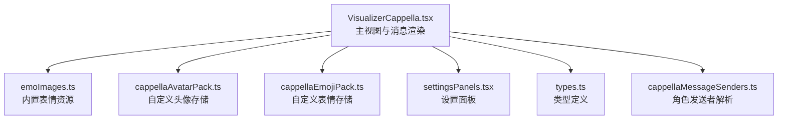
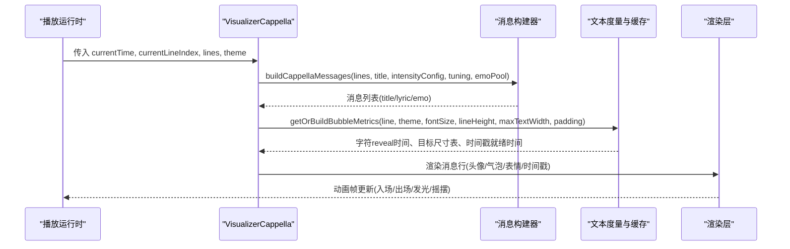
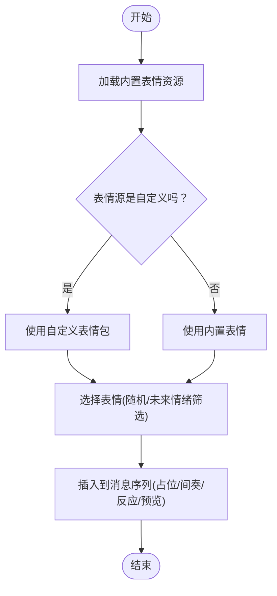
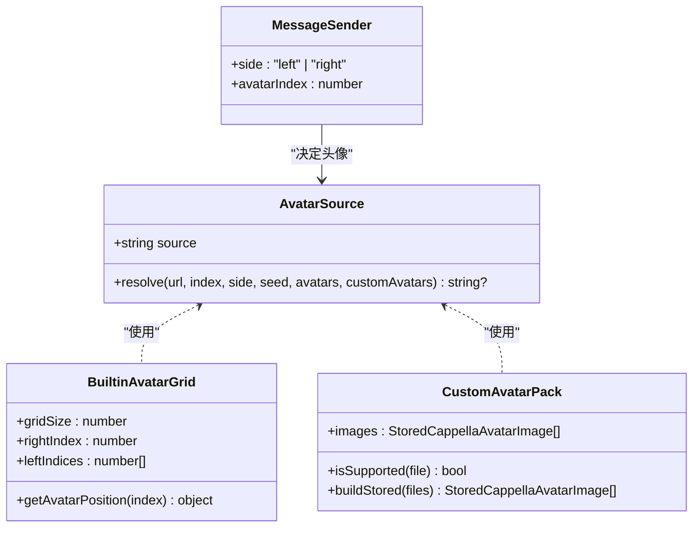
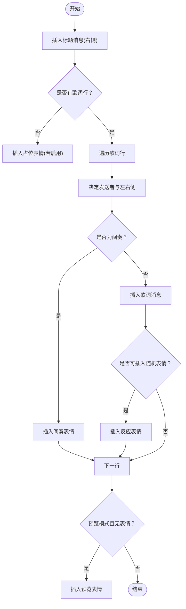
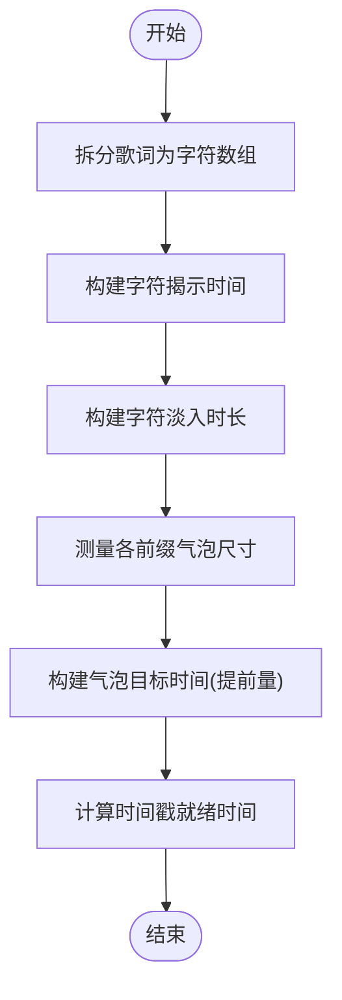
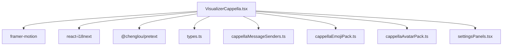

# Cappella模式实现

<cite>
**本文引用的文件**   
- [VisualizerCappella.tsx](file://src/components/visualizer/cappella/VisualizerCappella.tsx)
- [emoImages.ts](file://src/components/visualizer/cappella/emoImages.ts)
- [cappellaAvatarPack.ts](file://src/services/cappellaAvatarPack.ts)
- [cappellaEmojiPack.ts](file://src/services/cappellaEmojiPack.ts)
- [settingsPanels.tsx](file://src/components/visualizer/settingsPanels.tsx)
- [types.ts](file://src/types.ts)
- [cappellaMessageSenders.ts](file://src/components/visualizer/cappella/cappellaMessageSenders.ts)
</cite>

## 目录
1. [简介](#简介)
2. [项目结构](#项目结构)
3. [核心组件](#核心组件)
4. [架构总览](#架构总览)
5. [详细组件分析](#详细组件分析)
6. [依赖关系分析](#依赖关系分析)
7. [性能与优化](#性能与优化)
8. [故障排查指南](#故障排查指南)
9. [结论](#结论)
10. [附录：自定义开发指南](#附录自定义开发指南)

## 简介
本技术文档围绕Folia Major中的Cappella可视化模式，系统性解析其表情与头像系统、角色管理、消息构建与渲染、动画与情感映射、用户交互以及扩展机制。Cappella将歌词以“聊天对话气泡”的形式呈现，支持左右两侧不同角色头像、随机或稳定的表情插入、逐字淡入动画、时间戳显示、视口自适应与布局缓存等能力。同时提供自定义表情包与自定义头像包的持久化存储与导入导出流程。

## 项目结构
Cappella相关代码主要分布在以下位置：
- 可视化模式主实现：`src/components/visualizer/cappella/VisualizerCappella.tsx`
- 内置表情资源加载与选择：`src/components/visualizer/cappella/emoImages.ts`
- 自定义头像包服务：`src/services/cappellaAvatarPack.ts`
- 自定义表情包服务：`src/services/cappellaEmojiPack.ts`
- 设置面板集成：`src/components/visualizer/settingsPanels.tsx`
- 类型定义（歌词、主题、视觉器配置等）：`src/types.ts`
- 角色发送者解析（外部模块）：`src/components/visualizer/cappella/cappellaMessageSenders.ts`

**图示来源** 
- [VisualizerCappella.tsx:1-20](file://src/components/visualizer/cappella/VisualizerCappella.tsx#L1-L20)
- [emoImages.ts:1-20](file://src/components/visualizer/cappella/emoImages.ts#L1-L20)
- [cappellaAvatarPack.ts:1-10](file://src/services/cappellaAvatarPack.ts#L1-L10)
- [cappellaEmojiPack.ts:1-10](file://src/services/cappellaEmojiPack.ts#L1-L10)
- [settingsPanels.tsx:441-470](file://src/components/visualizer/settingsPanels.tsx#L441-L470)
- [types.ts:54-102](file://src/types.ts#L54-L102)
- [cappellaMessageSenders.ts:1-20](file://src/components/visualizer/cappella/cappellaMessageSenders.ts#L1-L20)

**章节来源**
- [VisualizerCappella.tsx:1-20](file://src/components/visualizer/cappella/VisualizerCappella.tsx#L1-L20)
- [emoImages.ts:1-20](file://src/components/visualizer/cappella/emoImages.ts#L1-L20)
- [cappellaAvatarPack.ts:1-10](file://src/services/cappellaAvatarPack.ts#L1-L10)
- [cappellaEmojiPack.ts:1-10](file://src/services/cappellaEmojiPack.ts#L1-L10)
- [settingsPanels.tsx:441-470](file://src/components/visualizer/settingsPanels.tsx#L441-L470)
- [types.ts:54-102](file://src/types.ts#L54-L102)
- [cappellaMessageSenders.ts:1-20](file://src/components/visualizer/cappella/cappellaMessageSenders.ts#L1-L20)

## 核心组件
- 主视图组件：负责歌词到消息的转换、消息序列生成、气泡渲染、动画控制、时间轴驱动、视口适配与布局缓存。
- 表情系统：内置表情通过Vite glob动态加载，并提供随机选择接口；支持自定义表情包持久化。
- 头像系统：支持内置头像网格裁剪、封面图覆盖、颜色渐变回退；支持自定义头像包持久化。
- 角色与消息发送者：根据歌词行与策略决定左右侧与头像索引，支持稳定种子与代理发送者解析。
- 设置面板：提供表情源、头像源、是否显示表情消息等调参入口。

**章节来源**
- [VisualizerCappella.tsx:24-57](file://src/components/visualizer/cappella/VisualizerCappella.tsx#L24-L57)
- [VisualizerCappella.tsx:304-496](file://src/components/visualizer/cappella/VisualizerCappella.tsx#L304-L496)
- [emoImages.ts:12-48](file://src/components/visualizer/cappella/emoImages.ts#L12-L48)
- [cappellaAvatarPack.ts:9-38](file://src/services/cappellaAvatarPack.ts#L9-L38)
- [cappellaEmojiPack.ts:9-39](file://src/services/cappellaEmojiPack.ts#L9-L39)
- [settingsPanels.tsx:441-470](file://src/components/visualizer/settingsPanels.tsx#L441-L470)

## 架构总览
Cappella模式的运行时数据流如下：
- 输入：歌词行（Line[]）、主题（Theme）、播放时间（currentTime）、当前行索引（currentLineIndex）、封面URL（coverUrl）、种子（seed）、字体缩放等。
- 处理：
  - 强度配置：根据主题动画强度计算序列与运动参数。
  - 消息构建：标题、歌词、表情三类消息，按策略分配左右侧与头像索引，并插入随机表情。
  - 文本度量：基于pretext进行字形切分与气泡尺寸预计算，建立reveal时间与目标尺寸表。
  - 可见性筛选：根据视口高度与累积估算高度，限制最大可见消息数量，防止底部溢出。
  - 渲染：使用framer-motion驱动入场/出场动画、头像弹簧、气泡发光扫光、表情摇摆等。
- 输出：聊天式歌词气泡界面，包含头像、文字、时间戳与表情动画。

**图示来源**
- [VisualizerCappella.tsx:304-496](file://src/components/visualizer/cappella/VisualizerCappella.tsx#L304-L496)
- [VisualizerCappella.tsx:929-1003](file://src/components/visualizer/cappella/VisualizerCappella.tsx#L929-L1003)
- [VisualizerCappella.tsx:1195-1513](file://src/components/visualizer/cappella/VisualizerCappella.tsx#L1195-L1513)

## 详细组件分析

### 表情系统与表情库
- 内置表情加载：通过Vite `import.meta.glob` 从 `emo` 目录加载图片，生成 `builtinEmoImages`。
- 表情选择：提供 `pickRandomEmoImage`，当前版本为随机选择，预留 `emotionHint` 接口用于未来情绪分类筛选。
- 自定义表情包：通过 `cappellaEmojiPack.ts` 将用户上传的表情Blob持久化到IndexedDB，提供获取、保存、清空与文件校验工具。
- 表情在消息中的使用：
  - 无歌词时插入占位表情。
  - 间奏段落插入稳定表情。
  - 正常歌词后按概率插入反应表情，受最小间隔与最大比例限制。
  - 预览模式下强制插入一张预览表情。

**图示来源**
- [emoImages.ts:7-48](file://src/components/visualizer/cappella/emoImages.ts#L7-L48)
- [cappellaEmojiPack.ts:9-39](file://src/services/cappellaEmojiPack.ts#L9-L39)
- [VisualizerCappella.tsx:304-496](file://src/components/visualizer/cappella/VisualizerCappella.tsx#L304-L496)

**章节来源**
- [emoImages.ts:12-48](file://src/components/visualizer/cappella/emoImages.ts#L12-L48)
- [cappellaEmojiPack.ts:9-39](file://src/services/cappellaEmojiPack.ts#L9-L39)
- [VisualizerCappella.tsx:304-496](file://src/components/visualizer/cappella/VisualizerCappella.tsx#L304-L496)

### 头像系统与角色管理
- 头像来源：
  - 内置头像网格：通过背景图裁剪定位，右侧固定中心头像，左侧循环使用多个头像。
  - 封面图覆盖：当启用封面头像且存在封面URL时，使用封面作为头像背景。
  - 自定义头像：从用户上传的头像包中选取。
  - 颜色渐变回退：当没有可用头像时使用主题色渐变。
- 头像索引与位置：
  - 使用哈希与模运算保证稳定索引。
  - 网格大小固定为3x3，右侧索引为8，左侧索引来自固定数组。
- 角色发送者解析：
  - 通过 `createCappellaAgentSenderResolver` 解析歌词行的代理发送者，决定左右侧与头像索引。
  - 若无代理发送者，则依据序列策略、短行继承、随机翻转与强制右侧规则确定发送者。

**图示来源**
- [VisualizerCappella.tsx:688-697](file://src/components/visualizer/cappella/VisualizerCappella.tsx#L688-L697)
- [VisualizerCappella.tsx:1005-1037](file://src/components/visualizer/cappella/VisualizerCappella.tsx#L1005-L1037)
- [cappellaAvatarPack.ts:9-38](file://src/services/cappellaAvatarPack.ts#L9-L38)
- [cappellaMessageSenders.ts:1-20](file://src/components/visualizer/cappella/cappellaMessageSenders.ts#L1-L20)

**章节来源**
- [VisualizerCappella.tsx:688-697](file://src/components/visualizer/cappella/VisualizerCappella.tsx#L688-L697)
- [VisualizerCappella.tsx:1005-1037](file://src/components/visualizer/cappella/VisualizerCappella.tsx#L1005-L1037)
- [cappellaAvatarPack.ts:9-38](file://src/services/cappellaAvatarPack.ts#L9-L38)
- [cappellaMessageSenders.ts:1-20](file://src/components/visualizer/cappella/cappellaMessageSenders.ts#L1-L20)

### 消息构建与情感映射
- 消息类型：
  - 标题消息：歌曲标题，固定在右侧。
  - 歌词消息：每行歌词作为一个消息，带时间信息。
  - 表情消息：占位、间奏、反应、预览四类表情，带激活起止时间。
- 情感映射：
  - 无歌词时插入占位表情。
  - 间奏段落插入稳定表情。
  - 正常歌词后按概率插入反应表情，受最小间隔与最大比例限制。
  - 预览模式下强制插入一张预览表情。
- 序列策略：
  - 强制右侧：每隔若干行强制右侧发送。
  - 短行继承：短行可能继承上一行发送者。
  - 序列翻转：按概率翻转左右侧。
  - 代理发送者：由外部解析器决定发送者。

**图示来源**
- [VisualizerCappella.tsx:304-496](file://src/components/visualizer/cappella/VisualizerCappella.tsx#L304-L496)

**章节来源**
- [VisualizerCappella.tsx:304-496](file://src/components/visualizer/cappella/VisualizerCappella.tsx#L304-L496)

### 文本度量与动画时序
- 字符切分：使用 `splitLyricGraphemes` 将歌词拆分为图形单元。
- 揭示时间：基于词级时间线构建字符级揭示时间，确保可见文本连续。
- 淡入时长：根据词级时间差计算每个字符的CSS淡入时长，避免过快或过慢。
- 气泡尺寸：对每个前缀文本测量宽高，建立尺寸表；提前一定时间启动宽度动画以避免换行抖动。
- 时间戳就绪：最后一个字符完成淡入后显示时间戳。

**图示来源**
- [VisualizerCappella.tsx:522-657](file://src/components/visualizer/cappella/VisualizerCappella.tsx#L522-L657)
- [VisualizerCappella.tsx:929-1003](file://src/components/visualizer/cappella/VisualizerCappella.tsx#L929-L1003)

**章节来源**
- [VisualizerCappella.tsx:522-657](file://src/components/visualizer/cappella/VisualizerCappella.tsx#L522-L657)
- [VisualizerCappella.tsx:929-1003](file://src/components/visualizer/cappella/VisualizerCappella.tsx#L929-L1003)

### 渲染与交互
- 气泡渲染：
  - 活跃状态：放大、阴影、发光扫光。
  - 非活跃状态：缩小、透明度降低。
  - 表情消息：独立尺寸与摇摆动画。
- 时间戳显示：
  - 歌词消息：在最后一字符淡入完成后显示。
  - 表情消息：在激活结束后显示。
- 视口适配：
  - 根据视口高度与累积估算高度筛选可见消息，最多保留20条。
  - 动态调整基础字号与最大文本宽度。
- 动画驱动：
  - 使用framer-motion的motion值监听播放时间变化，触发字符计数与目标尺寸更新。
  - 头像弹簧动画、行入场/出场动画、表情进入缩放动画。

**章节来源**
- [VisualizerCappella.tsx:1195-1513](file://src/components/visualizer/cappella/VisualizerCappella.tsx#L1195-L1513)
- [VisualizerCappella.tsx:1517-1600](file://src/components/visualizer/cappella/VisualizerCappella.tsx#L1517-L1600)

## 依赖关系分析
- 外部依赖：
  - framer-motion：动画与过渡。
  - react-i18next：国际化。
  - @chenglou/pretext：文本布局与度量。
- 内部依赖：
  - types.ts：Line、Theme、CappellaTuning等类型。
  - cappellaMessageSenders.ts：角色发送者解析。
  - emoji/avatar服务：自定义表情与头像持久化。
  - settingsPanels.tsx：设置面板集成。

**图示来源**
- [VisualizerCappella.tsx:1-16](file://src/components/visualizer/cappella/VisualizerCappella.tsx#L1-L16)
- [types.ts:54-102](file://src/types.ts#L54-L102)
- [cappellaMessageSenders.ts:1-20](file://src/components/visualizer/cappella/cappellaMessageSenders.ts#L1-L20)
- [cappellaEmojiPack.ts:1-10](file://src/services/cappellaEmojiPack.ts#L1-L10)
- [cappellaAvatarPack.ts:1-10](file://src/services/cappellaAvatarPack.ts#L1-L10)
- [settingsPanels.tsx:441-470](file://src/components/visualizer/settingsPanels.tsx#L441-L470)

**章节来源**
- [VisualizerCappella.tsx:1-16](file://src/components/visualizer/cappella/VisualizerCappella.tsx#L1-L16)
- [types.ts:54-102](file://src/types.ts#L54-L102)
- [cappellaMessageSenders.ts:1-20](file://src/components/visualizer/cappella/cappellaMessageSenders.ts#L1-L20)
- [cappellaEmojiPack.ts:1-10](file://src/services/cappellaEmojiPack.ts#L1-L10)
- [cappellaAvatarPack.ts:1-10](file://src/services/cappellaAvatarPack.ts#L1-L10)
- [settingsPanels.tsx:441-470](file://src/components/visualizer/settingsPanels.tsx#L441-L470)

## 性能与优化
- 布局缓存：
  - 使用Map缓存气泡度量结果，键包含歌词时间、主题、字号、行高、最大宽度与内边距。
  - 限制缓存大小，超出时删除最旧条目。
- 二分查找：
  - 字符揭示时间单调递增，使用二分查找快速计算当前可见字符数。
- 提前量：
  - 气泡宽度动画提前0.2秒启动，避免临界换行时字符掉行。
- 视口适配：
  - 根据视口高度估算消息高度，限制最大可见消息数量，防止底部溢出。
- 动画优化：
  - 使用willChange提示浏览器优化transform属性。
  - 头像弹簧动画参数可调，平衡流畅性与性能。

**章节来源**
- [VisualizerCappella.tsx:929-1003](file://src/components/visualizer/cappella/VisualizerCappella.tsx#L929-L1003)
- [VisualizerCappella.tsx:578-597](file://src/components/visualizer/cappella/VisualizerCappella.tsx#L578-L597)
- [VisualizerCappella.tsx:748-804](file://src/components/visualizer/cappella/VisualizerCappella.tsx#L748-L804)

## 故障排查指南
- 表情不显示：
  - 检查表情源是否为custom且自定义表情包非空。
  - 确认表情文件类型与扩展名支持。
- 头像异常：
  - 检查头像源是否为custom且自定义头像包非空。
  - 确认头像文件类型与扩展名支持。
- 文本换行异常：
  - 检查maxTextWidth与baseFontSize设置。
  - 确认气泡度量缓存未过期。
- 时间戳不显示：
  - 检查时间戳就绪时间计算逻辑。
  - 确认表情激活结束时间或歌词淡入完成时间。

**章节来源**
- [cappellaEmojiPack.ts:26-39](file://src/services/cappellaEmojiPack.ts#L26-L39)
- [cappellaAvatarPack.ts:26-38](file://src/services/cappellaAvatarPack.ts#L26-L38)
- [VisualizerCappella.tsx:641-657](file://src/components/visualizer/cappella/VisualizerCappella.tsx#L641-L657)

## 结论
Cappella模式通过精细的消息构建、文本度量与动画时序控制，实现了高质量的歌词可视化体验。其表情与头像系统支持内置与自定义资源，角色管理通过策略与代理解析确保稳定的对话感。性能方面采用布局缓存、二分查找与提前量优化，确保流畅播放。设置面板提供丰富的调参选项，便于用户定制视觉效果。

## 附录：自定义开发指南
- 自定义表情：
  - 准备PNG/JPG/GIF/WebP/SVG格式图片。
  - 通过设置面板导入自定义表情包。
  - 在代码中可通过 `cappellaEmojiPack.ts` 的API读取与验证表情文件。
- 自定义头像：
  - 准备PNG/JPG/GIF/WebP/SVG格式图片。
  - 通过设置面板导入自定义头像包。
  - 在代码中可通过 `cappellaAvatarPack.ts` 的API读取与验证头像文件。
- 扩展角色发送者：
  - 实现 `cappellaMessageSenders.ts` 中的解析器，根据歌词内容返回左右侧与头像索引。
- 调整动画强度：
  - 修改 `getCappellaIntensityConfig` 中的序列与运动参数，匹配不同主题风格。

**章节来源**
- [cappellaEmojiPack.ts:9-39](file://src/services/cappellaEmojiPack.ts#L9-L39)
- [cappellaAvatarPack.ts:9-38](file://src/services/cappellaAvatarPack.ts#L9-L38)
- [cappellaMessageSenders.ts:1-20](file://src/components/visualizer/cappella/cappellaMessageSenders.ts#L1-L20)
- [VisualizerCappella.tsx:174-301](file://src/components/visualizer/cappella/VisualizerCappella.tsx#L174-L301)