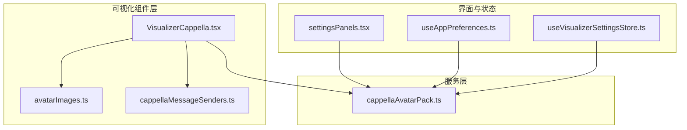
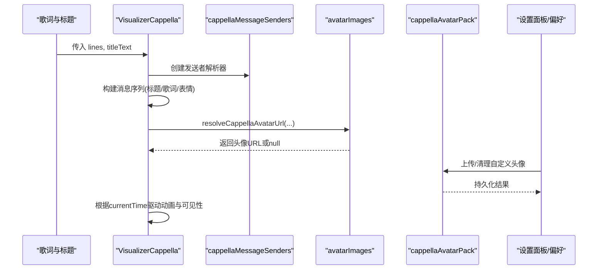
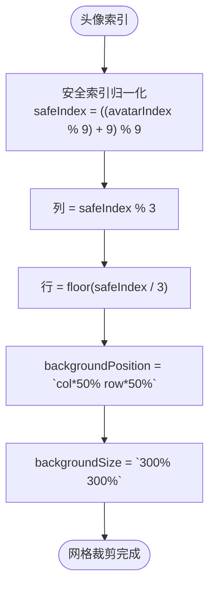
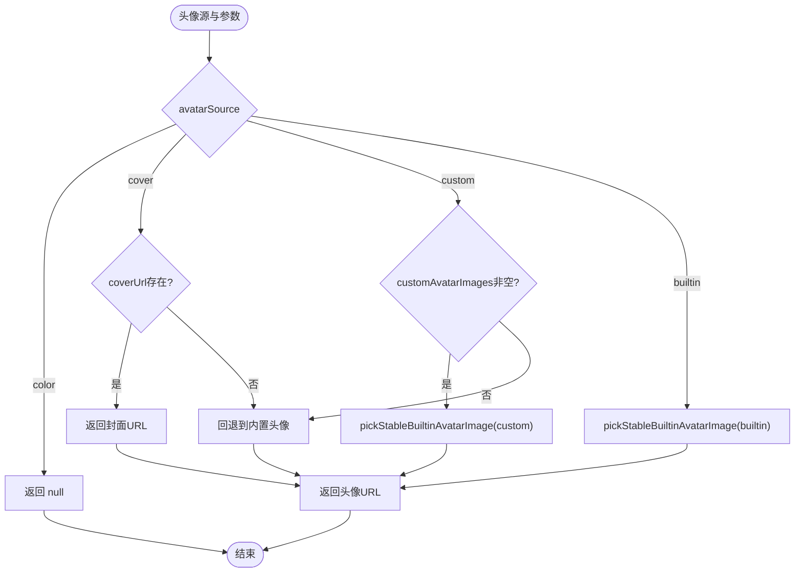
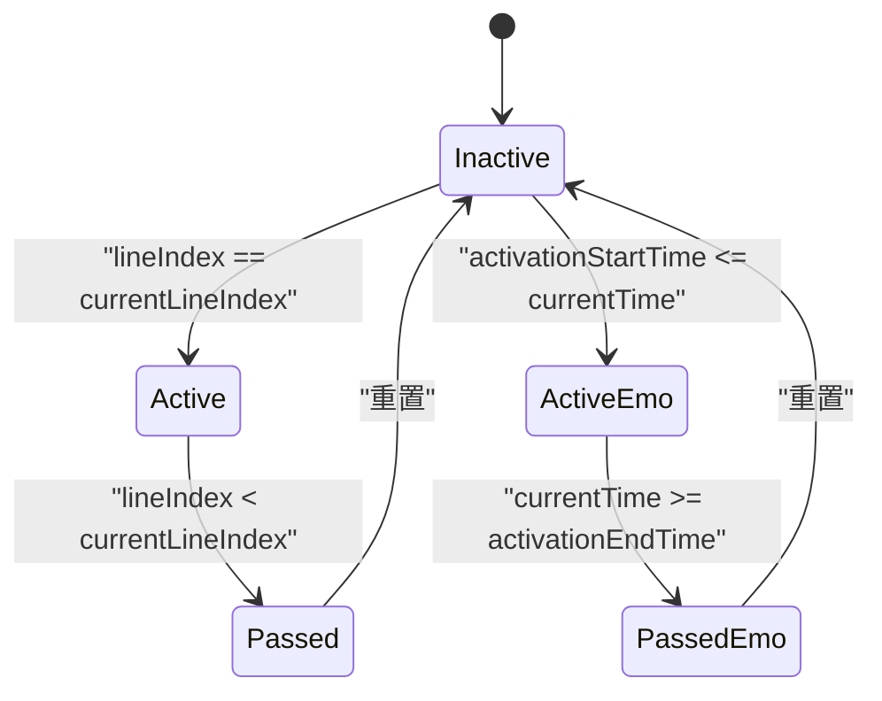
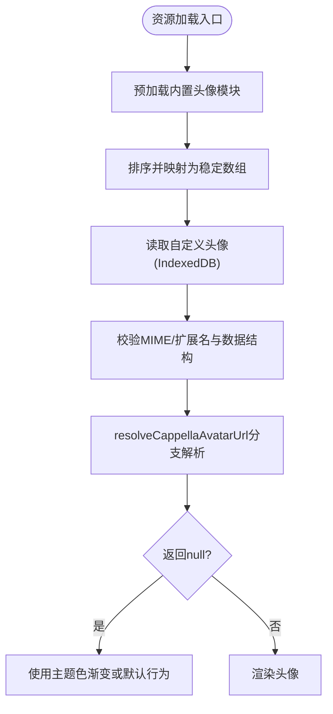
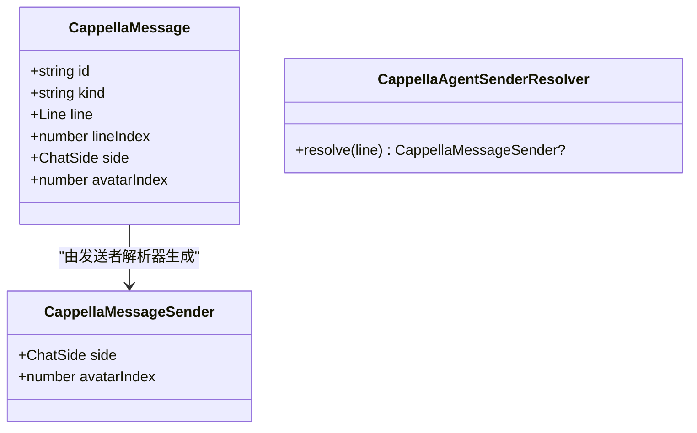
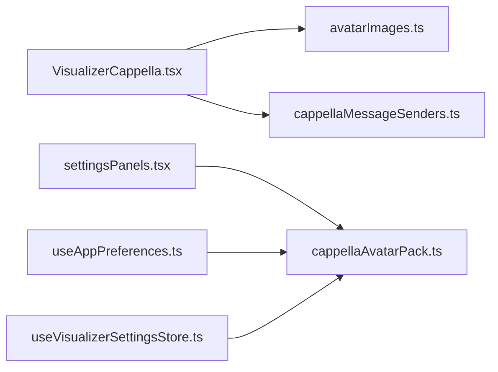

# 头像系统实现

<cite>
**本文引用的文件**   
- [VisualizerCappella.tsx](file://src/components/visualizer/cappella/VisualizerCappella.tsx)
- [avatarImages.ts](file://src/components/visualizer/cappella/avatarImages.ts)
- [cappellaMessageSenders.ts](file://src/components/visualizer/cappella/cappellaMessageSenders.ts)
- [cappellaAvatarPack.ts](file://src/services/cappellaAvatarPack.ts)
- [useAppPreferences.ts](file://src/hooks/useAppPreferences.ts)
- [settingsPanels.tsx](file://src/components/visualizer/settingsPanels.tsx)
- [useVisualizerSettingsStore.ts](file://src/stores/useVisualizerSettingsStore.ts)
</cite>

## 目录
1. [简介](#简介)
2. [项目结构](#项目结构)
3. [核心组件](#核心组件)
4. [架构总览](#架构总览)
5. [详细组件分析](#详细组件分析)
6. [依赖关系分析](#依赖关系分析)
7. [性能考虑](#性能考虑)
8. [故障排查指南](#故障排查指南)
9. [结论](#结论)
10. [附录：自定义头像资源集成指南](#附录自定义头像资源集成指南)

## 简介
本技术文档聚焦 Cappella 模式的头像系统，围绕以下目标展开：
- 解释 3x3 头像网格布局算法、坐标计算与位置映射。
- 说明头像选择策略：左右侧头像分配、随机选择与稳定哈希。
- 阐述头像状态管理：活跃状态、缩放动画与透明度变化。
- 说明头像资源加载机制：预加载、缓存策略与错误处理。
- 解释头像与消息的关联关系：发送者标识与视觉反馈。
- 提供性能优化技巧：批量渲染与内存管理。
- 给出自定义头像资源的集成指南。

## 项目结构
Cappella 头像系统主要分布在可视化组件层与服务层：
- 可视化组件层负责消息构建、头像选择、网格裁剪、气泡渲染与动画。
- 服务层负责用户自定义头像的持久化、校验与读取。
- 设置面板与偏好钩子负责导入、预览、清理自定义头像并同步到全局状态。

**图表来源**
- [VisualizerCappella.tsx:1-120](file://src/components/visualizer/cappella/VisualizerCappella.tsx#L1-L120)
- [avatarImages.ts:1-102](file://src/components/visualizer/cappella/avatarImages.ts#L1-L102)
- [cappellaMessageSenders.ts:1-75](file://src/components/visualizer/cappella/cappellaMessageSenders.ts#L1-L75)
- [cappellaAvatarPack.ts:1-38](file://src/services/cappellaAvatarPack.ts#L1-L38)
- [settingsPanels.tsx:614-670](file://src/components/visualizer/settingsPanels.tsx#L614-L670)
- [useAppPreferences.ts:197-242](file://src/hooks/useAppPreferences.ts#L197-L242)
- [useVisualizerSettingsStore.ts:819-847](file://src/stores/useVisualizerSettingsStore.ts#L819-L847)

**章节来源**
- [VisualizerCappella.tsx:1-120](file://src/components/visualizer/cappella/VisualizerCappella.tsx#L1-L120)
- [avatarImages.ts:1-102](file://src/components/visualizer/cappella/avatarImages.ts#L1-L102)
- [cappellaMessageSenders.ts:1-75](file://src/components/visualizer/cappella/cappellaMessageSenders.ts#L1-L75)
- [cappellaAvatarPack.ts:1-38](file://src/services/cappellaAvatarPack.ts#L1-L38)
- [settingsPanels.tsx:614-670](file://src/components/visualizer/settingsPanels.tsx#L614-L670)
- [useAppPreferences.ts:197-242](file://src/hooks/useAppPreferences.ts#L197-L242)
- [useVisualizerSettingsStore.ts:819-847](file://src/stores/useVisualizerSettingsStore.ts#L819-L847)

## 核心组件
- VisualizerCappella：Cappella 歌词聊天式可视化主组件，负责消息构建、头像选择、气泡渲染、时间轴驱动与可见性控制。
- avatarImages：内置头像资源解析、稳定哈希选择与头像 URL 解析。
- cappellaMessageSenders：根据 TTML agentId 将歌词行映射为稳定的左右侧发送者与头像索引。
- cappellaAvatarPack：用户自定义头像的 IndexedDB 持久化、类型校验与存储对象构造。
- settingsPanels：自定义头像上传、预览与清空入口。
- useAppPreferences：应用启动时加载自定义头像包。
- useVisualizerSettingsStore：保存/清除自定义头像并更新可视化资产状态。

**章节来源**
- [VisualizerCappella.tsx:304-496](file://src/components/visualizer/cappella/VisualizerCappella.tsx#L304-L496)
- [avatarImages.ts:23-102](file://src/components/visualizer/cappella/avatarImages.ts#L23-L102)
- [cappellaMessageSenders.ts:21-75](file://src/components/visualizer/cappella/cappellaMessageSenders.ts#L21-L75)
- [cappellaAvatarPack.ts:9-38](file://src/services/cappellaAvatarPack.ts#L9-L38)
- [settingsPanels.tsx:614-670](file://src/components/visualizer/settingsPanels.tsx#L614-L670)
- [useAppPreferences.ts:197-242](file://src/hooks/useAppPreferences.ts#L197-L242)
- [useVisualizerSettingsStore.ts:819-847](file://src/stores/useVisualizerSettingsStore.ts#L819-L847)

## 架构总览
Cappella 头像系统的整体数据流如下：
- 歌词与标题输入进入 VisualizerCappella，构建消息序列（标题、歌词、表情）。
- 每条消息携带 side 与 avatarIndex，用于确定头像在 3x3 网格中的位置。
- 头像 URL 由 avatarImages.resolveCappellaAvatarUrl 解析，支持内置、封面、自定义与颜色模式。
- 用户自定义头像通过 cappellaAvatarPack 持久化，并在设置面板中预览与清理。
- 运行时根据 currentTime 与 currentLineIndex 驱动气泡文本逐字显示、头像缩放与透明度变化。

**图表来源**
- [VisualizerCappella.tsx:304-496](file://src/components/visualizer/cappella/VisualizerCappella.tsx#L304-L496)
- [avatarImages.ts:80-102](file://src/components/visualizer/cappella/avatarImages.ts#L80-L102)
- [cappellaAvatarPack.ts:9-38](file://src/services/cappellaAvatarPack.ts#L9-L38)
- [settingsPanels.tsx:614-670](file://src/components/visualizer/settingsPanels.tsx#L614-L670)

## 详细组件分析

### 3x3 头像网格布局算法与坐标计算
- 网格大小常量 AVATAR_GRID_SIZE = 3，表示 3x3 共 9 个头像槽位。
- LEFT_AVATAR_INDICES 定义左侧头像使用的槽位索引集合；RIGHT_AVATAR_INDEX 固定为右下角槽位。
- getAvatarPosition 将 avatarIndex 归一化到 0-8，计算列与行：
  - col = safeIndex % AVATAR_GRID_SIZE
  - row = Math.floor(safeIndex / AVATAR_GRID_SIZE)
- backgroundPosition 使用百分比定位：`${col * 50}% ${row * 50}%`
- backgroundSize 设置为 `${AVATAR_GRID_SIZE * 100}% ${AVATAR_GRID_SIZE * 100}%`，即 300% x 300%，使单张背景图可被切分为 3x3 九宫格。
- 当 useAvatarGridCrop 为真（例如使用封面作为头像），头像组件会按 side 决定使用 RIGHT_AVATAR_INDEX 或 LEFT_AVATAR_INDICES[avatarIndex % LEFT_AVATAR_INDICES.length]，再调用 getAvatarPosition 进行网格裁剪。

**图表来源**
- [VisualizerCappella.tsx:67-70](file://src/components/visualizer/cappella/VisualizerCappella.tsx#L67-L70)
- [VisualizerCappella.tsx:688-697](file://src/components/visualizer/cappella/VisualizerCappella.tsx#L688-L697)
- [VisualizerCappella.tsx:1005-1037](file://src/components/visualizer/cappella/VisualizerCappella.tsx#L1005-L1037)

**章节来源**
- [VisualizerCappella.tsx:67-70](file://src/components/visualizer/cappella/VisualizerCappella.tsx#L67-L70)
- [VisualizerCappella.tsx:688-697](file://src/components/visualizer/cappella/VisualizerCappella.tsx#L688-L697)
- [VisualizerCappella.tsx:1005-1037](file://src/components/visualizer/cappella/VisualizerCappella.tsx#L1005-L1037)

### 头像选择策略：左右侧分配、随机选择与稳定哈希
- 左右侧分配：
  - 右侧头像固定使用 RIGHT_AVATAR_INDEX（右下角）。
  - 左侧头像从 LEFT_AVATAR_INDICES 循环选取，保证不同消息对应不同左侧头像。
- 稳定哈希：
  - hashString 使用 FNV-1a 风格哈希，对字符串逐字符异或并乘以质数，得到无符号 32 位整数。
  - getSeededIndex 基于 seed、side、length 生成稳定索引，确保同一歌曲下头像选择一致。
  - pickStableBuiltinAvatarImage 先确定右侧头像索引，再从剩余池中选择左侧头像，避免左右重复。
- 头像 URL 解析：
  - resolveCappellaAvatarUrl 根据 avatarSource 分支：
    - color：返回 null（不显示头像）
    - cover：返回当前歌曲封面 URL
    - custom：优先使用自定义头像池
    - builtin：回退到内置头像池

**图表来源**
- [avatarImages.ts:43-78](file://src/components/visualizer/cappella/avatarImages.ts#L43-L78)
- [avatarImages.ts:80-102](file://src/components/visualizer/cappella/avatarImages.ts#L80-L102)

**章节来源**
- [avatarImages.ts:43-78](file://src/components/visualizer/cappella/avatarImages.ts#L43-L78)
- [avatarImages.ts:80-102](file://src/components/visualizer/cappella/avatarImages.ts#L80-L102)

### 头像状态管理：活跃状态、缩放动画与透明度变化
- 活跃状态判定：
  - 歌词消息：isActive 当 lineIndex === currentLineIndex；isPassed 当 lineIndex < currentLineIndex。
  - 表情消息：isActive 当 activationStartTime <= currentTime < activationEndTime；isPassed 当 currentTime >= activationEndTime。
- 缩放与透明度：
  - 活跃头像 scale 为 motionConfig.activeScale，已过期头像 scale 为 motionConfig.passedScale。
  - 已过期头像 opacity 为 motionConfig.passedOpacity。
  - 头像弹簧动画参数 stiffness/damping/mass 由 intensityConfig.motion.avatarSpring 提供。
- 气泡尺寸与溢出补偿：
  - 活跃气泡使用 targetSize 驱动 width/height 动画，非活跃气泡使用最终文本测量高度以避免跳变。
  - 通过 marginTop 补偿 scale(origin=bottom) 的视觉溢出，减少重排抖动。

**图表来源**
- [VisualizerCappella.tsx:816-828](file://src/components/visualizer/cappella/VisualizerCappella.tsx#L816-L828)
- [VisualizerCappella.tsx:1370-1410](file://src/components/visualizer/cappella/VisualizerCappella.tsx#L1370-L1410)

**章节来源**
- [VisualizerCappella.tsx:816-828](file://src/components/visualizer/cappella/VisualizerCappella.tsx#L816-L828)
- [VisualizerCappella.tsx:1370-1410](file://src/components/visualizer/cappella/VisualizerCappella.tsx#L1370-L1410)

### 头像资源加载机制：预加载、缓存策略与错误处理
- 内置头像预加载：
  - import.meta.glob 以 eager: true 方式预加载 ./avatar/*.{png,jpg,jpeg,gif,webp,svg}。
  - toStableAvatarImages 对模块键排序后生成稳定数组，确保跨环境一致性。
- 自定义头像持久化：
  - cappellaAvatarPack 使用 IndexedDB 缓存键 'cappella_custom_avatar' 存储 StoredCappellaAvatarImage[]。
  - isSupportedCappellaAvatarFile 校验 MIME 类型或扩展名，buildStoredCappellaAvatar 构造带 id/name/mimeType/blob 的对象。
- 错误处理与降级：
  - resolveCappellaAvatarUrl 在 avatarSource=color 时返回 null，避免无效 URL。
  - pickStableBuiltinAvatarImage 在头像池为空时返回 null，调用方需做空值处理。
  - getCustomCappellaAvatar 过滤非法条目（blob 非 Blob 或 name 非字符串），保证数据健壮性。

**图表来源**
- [avatarImages.ts:23-41](file://src/components/visualizer/cappella/avatarImages.ts#L23-L41)
- [cappellaAvatarPack.ts:9-38](file://src/services/cappellaAvatarPack.ts#L9-L38)
- [avatarImages.ts:80-102](file://src/components/visualizer/cappella/avatarImages.ts#L80-L102)

**章节来源**
- [avatarImages.ts:23-41](file://src/components/visualizer/cappella/avatarImages.ts#L23-L41)
- [cappellaAvatarPack.ts:9-38](file://src/services/cappellaAvatarPack.ts#L9-L38)
- [avatarImages.ts:80-102](file://src/components/visualizer/cappella/avatarImages.ts#L80-L102)

### 头像与消息的关联关系：发送者标识与视觉反馈
- 发送者解析：
  - createCappellaAgentSenderResolver 收集 distinct agentId，第一个作为右侧发送者，其余按顺序分配到左侧头像索引。
  - 若无足够 agentId，则返回 null，走默认左右侧分配逻辑。
- 消息构建：
  - buildCappellaMessages 根据强度配置与随机策略插入标题、歌词与表情消息。
  - 每条消息携带 side 与 avatarIndex，用于头像网格定位与颜色混合。
- 视觉反馈：
  - 右侧气泡使用 accentColor 与 primaryColor 混合，左侧气泡根据 avatarIndex 计算 tone，影响 secondaryColor 与 accentColor 混合比例。
  - 活跃气泡添加发光效果（glow），左右侧发光透明度不同。

**图表来源**
- [cappellaMessageSenders.ts:7-19](file://src/components/visualizer/cappella/cappellaMessageSenders.ts#L7-L19)
- [cappellaMessageSenders.ts:43-75](file://src/components/visualizer/cappella/cappellaMessageSenders.ts#L43-L75)
- [VisualizerCappella.tsx:304-496](file://src/components/visualizer/cappella/VisualizerCappella.tsx#L304-L496)

**章节来源**
- [cappellaMessageSenders.ts:21-75](file://src/components/visualizer/cappella/cappellaMessageSenders.ts#L21-L75)
- [VisualizerCappella.tsx:304-496](file://src/components/visualizer/cappella/VisualizerCappella.tsx#L304-L496)

## 依赖关系分析
- VisualizerCappella 依赖 avatarImages 进行头像 URL 解析，依赖 cappellaMessageSenders 进行发送者映射。
- settingsPanels 与 useAppPreferences 依赖 cappellaAvatarPack 进行自定义头像的读取与写入。
- useVisualizerSettingsStore 在保存/清除自定义头像后更新 visualizer asset store 的状态，影响 resolvedCappellaTuning 与 customAvatarImages。

**图表来源**
- [VisualizerCappella.tsx:1-120](file://src/components/visualizer/cappella/VisualizerCappella.tsx#L1-L120)
- [avatarImages.ts:1-102](file://src/components/visualizer/cappella/avatarImages.ts#L1-L102)
- [cappellaMessageSenders.ts:1-75](file://src/components/visualizer/cappella/cappellaMessageSenders.ts#L1-L75)
- [cappellaAvatarPack.ts:1-38](file://src/services/cappellaAvatarPack.ts#L1-L38)
- [settingsPanels.tsx:614-670](file://src/components/visualizer/settingsPanels.tsx#L614-L670)
- [useAppPreferences.ts:197-242](file://src/hooks/useAppPreferences.ts#L197-L242)
- [useVisualizerSettingsStore.ts:819-847](file://src/stores/useVisualizerSettingsStore.ts#L819-L847)

**章节来源**
- [VisualizerCappella.tsx:1-120](file://src/components/visualizer/cappella/VisualizerCappella.tsx#L1-L120)
- [avatarImages.ts:1-102](file://src/components/visualizer/cappella/avatarImages.ts#L1-L102)
- [cappellaMessageSenders.ts:1-75](file://src/components/visualizer/cappella/cappellaMessageSenders.ts#L1-L75)
- [cappellaAvatarPack.ts:1-38](file://src/services/cappellaAvatarPack.ts#L1-L38)
- [settingsPanels.tsx:614-670](file://src/components/visualizer/settingsPanels.tsx#L614-L670)
- [useAppPreferences.ts:197-242](file://src/hooks/useAppPreferences.ts#L197-L242)
- [useVisualizerSettingsStore.ts:819-847](file://src/stores/useVisualizerSettingsStore.ts#L819-L847)

## 性能考虑
- 批量渲染与布局缓存：
  - getOrBuildBubbleMetrics 预先计算每行歌词的 characters、sizes、revealTimes、bubbleTargetTimes，并使用 Map 缓存，限制缓存大小为 CAPPELLA_LAYOUT_CACHE_LIMIT。
  - 播放期间仅进行 O(log n) 二分查找获取可见字符数量，避免每帧重建文本范围。
- 可见消息控制：
  - getVisibleMessages 根据视口高度估算消息高度，反向累加保留最近消息，最多 MAX_VISIBLE_MESSAGES 条，防止底部溢出。
- 动画优化：
  - AnimatedBubbleFrame 使用 spring 动画与 willChange: transform 提升合成性能。
  - 头像缩放溢出通过 marginTop 补偿，减少布局抖动。
- 资源预加载：
  - 内置头像使用 eager: true 预加载，避免播放时动态导入导致的卡顿。

**章节来源**
- [VisualizerCappella.tsx:929-1003](file://src/components/visualizer/cappella/VisualizerCappella.tsx#L929-L1003)
- [VisualizerCappella.tsx:748-804](file://src/components/visualizer/cappella/VisualizerCappella.tsx#L748-L804)
- [VisualizerCappella.tsx:1076-1124](file://src/components/visualizer/cappella/VisualizerCappella.tsx#L1076-L1124)
- [avatarImages.ts:23-41](file://src/components/visualizer/cappella/avatarImages.ts#L23-L41)

## 故障排查指南
- 头像未显示：
  - 检查 avatarSource 是否为 color（color 模式不显示头像）。
  - 若为 cover 模式，确认 coverUrl 是否存在。
  - 若为 custom 模式，确认自定义头像池非空且已通过 isSupportedCappellaAvatarFile 校验。
- 头像选择不稳定：
  - 确认 seed 是否一致（默认使用 songTitle 或外部 seed）。
  - 检查 avatarIndex 与 side 是否正确传递。
- 自定义头像无法加载：
  - 检查 IndexedDB 缓存键 'cappella_custom_avatar' 的数据结构是否符合 StoredCappellaAvatarImage。
  - 确认 blob 为 Blob 实例且 name 为字符串。
- 气泡布局异常：
  - 检查 maxTextWidth 与 baseFontSize 是否合理。
  - 查看 getEstimatedMessageHeight 与 getVisibleMessages 的计算逻辑，确认视口高度与可用高度估算正确。

**章节来源**
- [avatarImages.ts:80-102](file://src/components/visualizer/cappella/avatarImages.ts#L80-L102)
- [cappellaAvatarPack.ts:9-38](file://src/services/cappellaAvatarPack.ts#L9-L38)
- [VisualizerCappella.tsx:702-743](file://src/components/visualizer/cappella/VisualizerCappella.tsx#L702-L743)
- [VisualizerCappella.tsx:748-804](file://src/components/visualizer/cappella/VisualizerCappella.tsx#L748-L804)

## 结论
Cappella 头像系统通过稳定的哈希算法与明确的左右侧分配策略，确保头像选择在多轮播放中保持一致；3x3 网格裁剪机制配合主题色混合，提供丰富的视觉反馈；内置与自定义头像资源通过预加载与 IndexedDB 持久化，兼顾性能与可扩展性；消息驱动的状态机与动画系统保证了流畅的用户体验。

## 附录：自定义头像资源集成指南
- 上传自定义头像：
  - 通过 settingsPanels 的“上传自定义头像”按钮触发文件选择。
  - 使用 buildStoredCappellaAvatar 构造存储对象，并通过 saveCustomCappellaAvatar 持久化到 IndexedDB。
- 预览与清理：
  - settingsPanels 展示自定义头像预览网格，支持点击清空。
  - handleClearCustomCappellaAvatar 清除缓存并回退 avatarSource 到 builtin。
- 应用启动加载：
  - useAppPreferences 在挂载时异步加载 storedCappellaAvatarPack，并设置 isLoading 状态。
- 注意事项：
  - 仅支持 image/* MIME 或指定扩展名（png/jpg/jpeg/gif/webp/svg）。
  - 自定义头像池为空时，avatarSource='custom' 会被自动回退到默认值。

**章节来源**
- [settingsPanels.tsx:614-670](file://src/components/visualizer/settingsPanels.tsx#L614-L670)
- [useVisualizerSettingsStore.ts:819-847](file://src/stores/useVisualizerSettingsStore.ts#L819-L847)
- [useAppPreferences.ts:197-242](file://src/hooks/useAppPreferences.ts#L197-L242)
- [cappellaAvatarPack.ts:26-38](file://src/services/cappellaAvatarPack.ts#L26-L38)