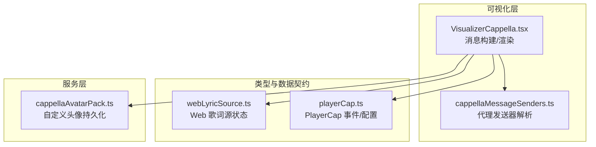
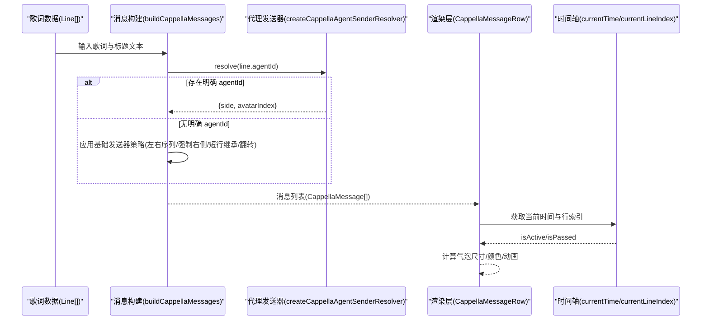
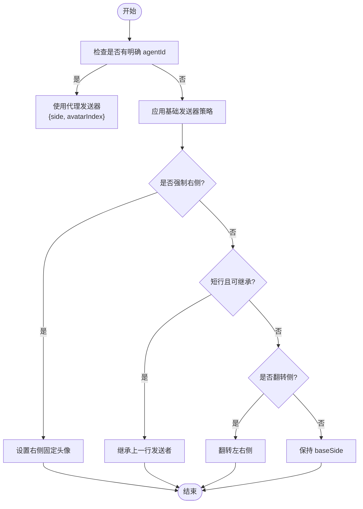
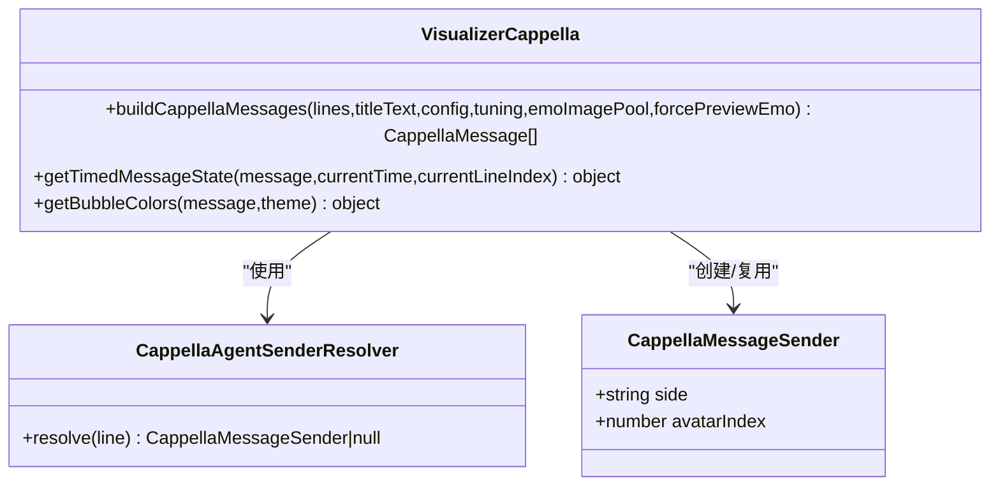
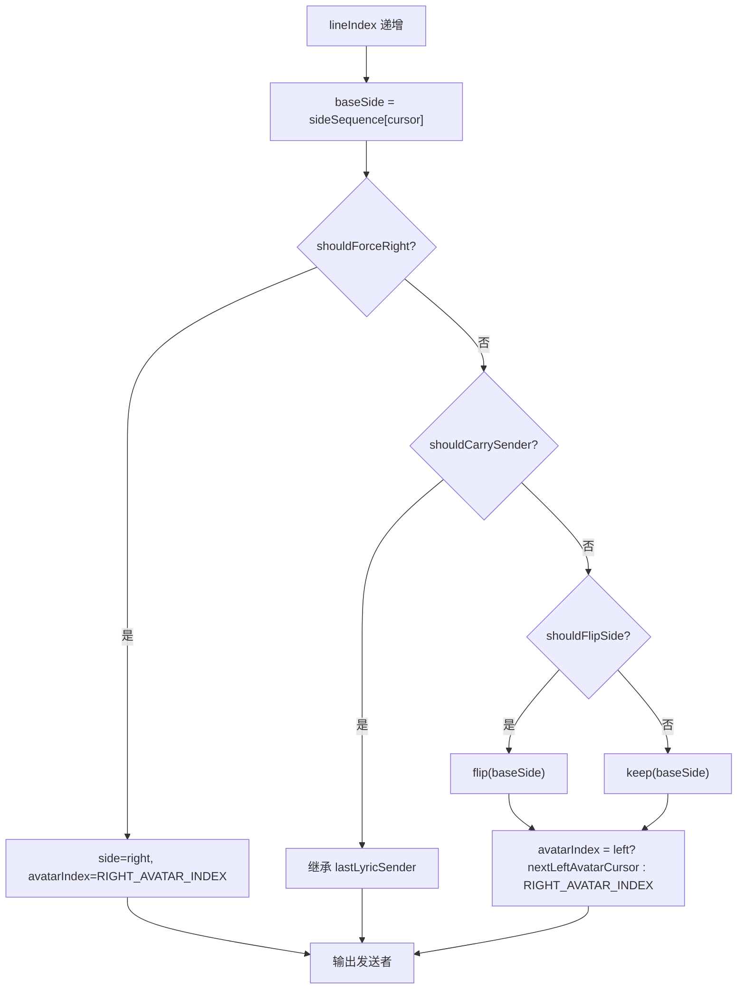
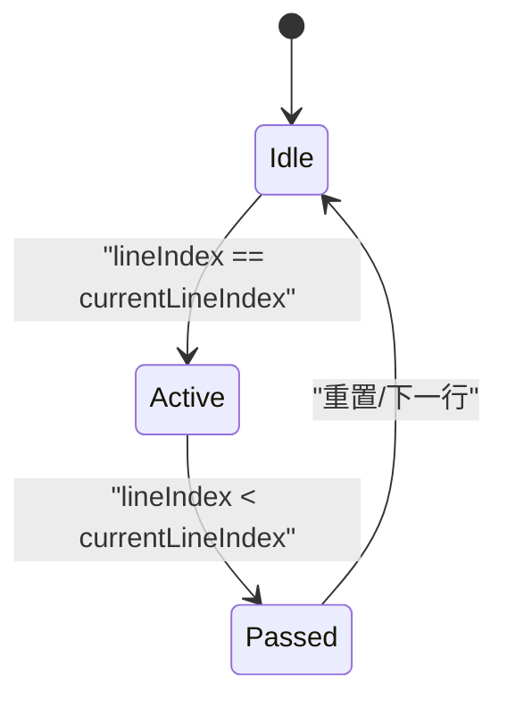
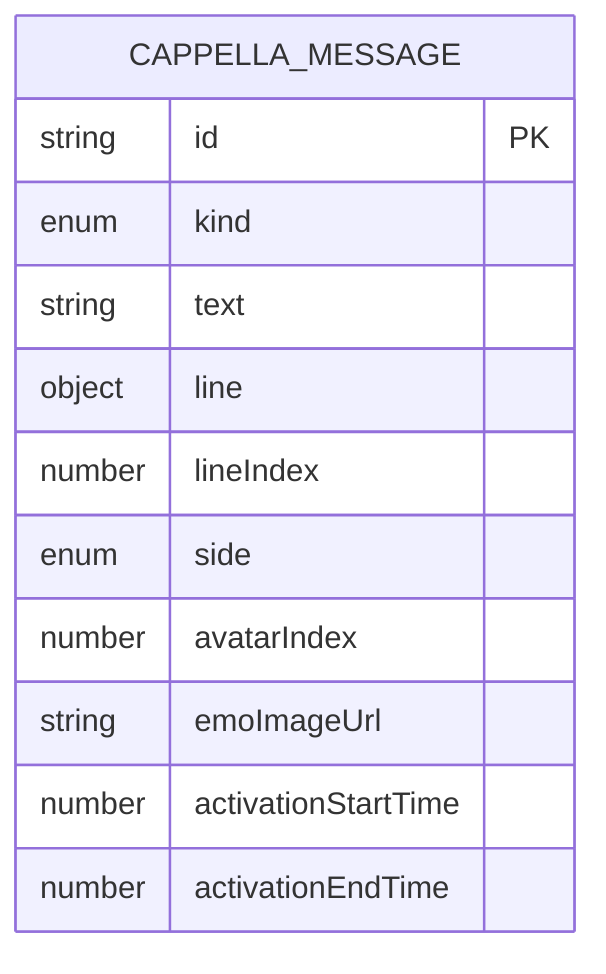
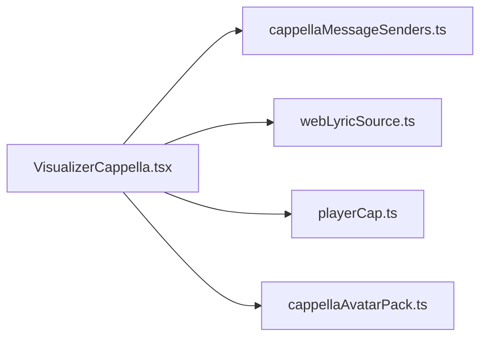

# 消息发送器系统

<cite>
**本文引用的文件**   
- [cappellaMessageSenders.ts](file://src/components/visualizer/cappella/cappellaMessageSenders.ts)
- [VisualizerCappella.tsx](file://src/components/visualizer/cappella/VisualizerCappella.tsx)
- [cappellaMessageSenders.test.ts](file://test/unit/visualizer/cappellaMessageSenders.test.ts)
- [webLyricSource.ts](file://src/types/webLyricSource.ts)
- [playerCap.ts](file://src/types/playerCap.ts)
- [cappellaAvatarPack.ts](file://src/services/cappellaAvatarPack.ts)
</cite>

## 目录
1. [引言](#引言)
2. [项目结构](#项目结构)
3. [核心组件](#核心组件)
4. [架构总览](#架构总览)
5. [详细组件分析](#详细组件分析)
6. [依赖关系分析](#依赖关系分析)
7. [性能与扩展性](#性能与扩展性)
8. [故障排查指南](#故障排查指南)
9. [结论](#结论)
10. [附录：自定义发送器开发指南](#附录自定义发送器开发指南)

## 引言
本文件面向 Cappella 模式的消息发送器子系统，目标是帮助开发者理解并扩展该系统的消息解析、路由、状态管理与协议设计。Cappella 将歌词以“聊天对话”的形式呈现，消息由不同“角色”（左右两侧头像）交替或按规则分配显示。发送器负责把歌词行映射为稳定的消息发送者，决定消息的左右侧、头像索引以及表情等附加信息，并在播放过程中驱动渲染时序。

## 项目结构
Cappella 消息发送器相关代码主要位于可视化组件与服务层：
- 发送器解析逻辑：`src/components/visualizer/cappella/cappellaMessageSenders.ts`
- 消息构建与渲染流程：`src/components/visualizer/cappella/VisualizerCappella.tsx`
- 单元测试覆盖：`test/unit/visualizer/cappellaMessageSenders.test.ts`
- 歌词数据契约与时间轴来源：`src/types/webLyricSource.ts`、`src/types/playerCap.ts`
- 自定义头像资源管理：`src/services/cappellaAvatarPack.ts`

**图表来源**
- [VisualizerCappella.tsx:303-391](file://src/components/visualizer/cappella/VisualizerCappella.tsx#L303-L391)
- [cappellaMessageSenders.ts:43-74](file://src/components/visualizer/cappella/cappellaMessageSenders.ts#L43-L74)
- [webLyricSource.ts:27-40](file://src/types/webLyricSource.ts#L27-L40)
- [playerCap.ts:16-22](file://src/types/playerCap.ts#L16-L22)
- [cappellaAvatarPack.ts:9-20](file://src/services/cappellaAvatarPack.ts#L9-L20)

**章节来源**
- [VisualizerCappella.tsx:1-200](file://src/components/visualizer/cappella/VisualizerCappella.tsx#L1-L200)
- [cappellaMessageSenders.ts:1-75](file://src/components/visualizer/cappella/cappellaMessageSenders.ts#L1-L75)
- [webLyricSource.ts:1-51](file://src/types/webLyricSource.ts#L1-L51)
- [playerCap.ts:1-121](file://src/types/playerCap.ts#L1-L121)
- [cappellaAvatarPack.ts:1-38](file://src/services/cappellaAvatarPack.ts#L1-L38)

## 核心组件
- 代理发送器解析器：根据 TTML agentId 稳定映射到 Cappella 聊天发送者，决定左右侧和头像索引。
- 基础发送器（默认序列）：当没有明确的 agentId 区分时，使用内置的左右侧序列、强制右侧、短行继承、翻转概率等策略进行负载均衡与序列控制。
- 消息模型：标题消息、歌词消息、表情消息三类，统一通过 side 与 avatarIndex 描述发送者。
- 时间轴与状态：基于当前时间与行索引计算消息激活/已过状态，驱动气泡动画与颜色。

**章节来源**
- [cappellaMessageSenders.ts:7-19](file://src/components/visualizer/cappella/cappellaMessageSenders.ts#L7-L19)
- [VisualizerCappella.tsx:24-57](file://src/components/visualizer/cappella/VisualizerCappella.tsx#L24-L57)
- [VisualizerCappella.tsx:816-828](file://src/components/visualizer/cappella/VisualizerCappella.tsx#L816-L828)

## 架构总览
Cappella 的消息流从歌词数据开始，经过消息构建阶段生成带发送者信息的消息列表，再由渲染层根据时间轴与强度配置驱动动画与布局。

**图表来源**
- [VisualizerCappella.tsx:303-391](file://src/components/visualizer/cappella/VisualizerCappella.tsx#L303-L391)
- [cappellaMessageSenders.ts:43-74](file://src/components/visualizer/cappella/cappellaMessageSenders.ts#L43-L74)
- [VisualizerCappella.tsx:1195-1226](file://src/components/visualizer/cappella/VisualizerCappella.tsx#L1195-L1226)

## 详细组件分析

### 代理发送器与基础发送器设计模式
- 代理发送器：通过 `createCappellaAgentSenderResolver` 收集 distinct agentId，若数量不足则返回 null，回退到基础发送器；否则建立 agentId 到发送者的稳定映射，首个 agentId 固定为右侧，其余左侧循环分配头像索引。
- 基础发送器：在 VisualizerCappella 中实现，包含以下关键策略：
  - 左右侧序列：`sideSequence` 提供周期性左右分布。
  - 强制右侧：每隔若干行强制右侧，避免长时间单侧。
  - 短行继承：短行有一定概率继承上一行的发送者，保持对话连贯性。
  - 翻转概率：随机翻转当前侧，增加自然感。
  - 表情消息：可选启用，基于种子选择稳定表情图。

**图表来源**
- [VisualizerCappella.tsx:359-391](file://src/components/visualizer/cappella/VisualizerCappella.tsx#L359-L391)
- [cappellaMessageSenders.ts:43-74](file://src/components/visualizer/cappella/cappellaMessageSenders.ts#L43-L74)

**章节来源**
- [cappellaMessageSenders.ts:21-41](file://src/components/visualizer/cappella/cappellaMessageSenders.ts#L21-L41)
- [VisualizerCappella.tsx:303-391](file://src/components/visualizer/cappella/VisualizerCappella.tsx#L303-L391)

### 发送器解析逻辑：歌词内容分析、角色识别与发送者决策
- 歌词内容分析：统计紧凑字符数判断短行，结合时间戳与行索引进行稳定性哈希，确保行为可复现。
- 角色识别：agentId 来自 TTML 标注，用于区分不同说话者；若无 agentId，则视为普通歌词行。
- 发送者决策：优先代理发送器；其次强制右侧；再短行继承；最后基于序列与翻转概率确定侧与头像索引。

**图表来源**
- [cappellaMessageSenders.ts:7-19](file://src/components/visualizer/cappella/cappellaMessageSenders.ts#L7-L19)
- [VisualizerCappella.tsx:303-391](file://src/components/visualizer/cappella/VisualizerCappella.tsx#L303-L391)
- [VisualizerCappella.tsx:816-847](file://src/components/visualizer/cappella/VisualizerCappella.tsx#L816-L847)

**章节来源**
- [VisualizerCappella.tsx:359-391](file://src/components/visualizer/cappella/VisualizerCappella.tsx#L359-L391)
- [cappellaMessageSenders.ts:43-74](file://src/components/visualizer/cappella/cappellaMessageSenders.ts#L43-L74)

### 消息路由机制：左右侧分配、负载均衡与序列控制
- 左右侧分配：通过 `sideSequence` 周期性地分配左右侧，配合 `sideFlipChance` 引入随机翻转。
- 负载均衡：`forceRightEveryLines` 防止长期单侧；短行继承减少频繁切换。
- 序列控制：使用 `seededUnit` 对时间戳与行索引做确定性随机，保证同一歌曲的视觉表现一致。

**图表来源**
- [VisualizerCappella.tsx:359-391](file://src/components/visualizer/cappella/VisualizerCappella.tsx#L359-L391)

**章节来源**
- [VisualizerCappella.tsx:303-391](file://src/components/visualizer/cappella/VisualizerCappella.tsx#L303-L391)

### 发送器状态管理：会话跟踪、上下文保持与状态恢复
- 会话跟踪：通过 `currentLineIndex` 与 `currentTime` 追踪当前活跃行与时间位置，驱动消息激活/已过状态。
- 上下文保持：`lastLyricSender` 保存上一行发送者，供短行继承使用；头像游标维护左右侧头像索引。
- 状态恢复：渲染层根据 `isActive` 与 `isPassed` 计算气泡缩放、透明度与阴影，确保回放时状态一致。

**图表来源**
- [VisualizerCappella.tsx:816-828](file://src/components/visualizer/cappella/VisualizerCappella.tsx#L816-L828)

**章节来源**
- [VisualizerCappella.tsx:816-828](file://src/components/visualizer/cappella/VisualizerCappella.tsx#L816-L828)

### 消息协议设计：数据结构定义、序列化格式与版本兼容
- 数据结构：
  - 标题消息：`kind='title'`，携带文本与右侧固定头像。
  - 歌词消息：`kind='lyric'`，携带 Line、lineIndex、side、avatarIndex。
  - 表情消息：`kind='emo'`，额外包含 emoImageUrl 与激活时间区间。
- 序列化格式：消息对象直接作为渲染输入，无需跨进程序列化；时间轴与状态由运行时计算。
- 版本兼容：当前实现未显式版本号字段；如需扩展，建议在消息对象中加入 `version` 字段并进行向后兼容处理。

**图表来源**
- [VisualizerCappella.tsx:24-57](file://src/components/visualizer/cappella/VisualizerCappella.tsx#L24-L57)

**章节来源**
- [VisualizerCappella.tsx:24-57](file://src/components/visualizer/cappella/VisualizerCappella.tsx#L24-L57)

### 发送器扩展机制：自定义规则与行为注入
- 自定义代理发送器：可通过实现 `CappellaAgentSenderResolver.resolve` 替换默认代理逻辑，例如基于歌词语义或外部规则决定发送者。
- 行为注入点：
  - 在 `buildCappellaMessages` 中插入自定义策略（如强制某行右侧、跳过某些行）。
  - 调整 `CappellaIntensityConfig.sequencing` 与 `motion` 参数改变序列与动画强度。
  - 通过 `cappellaAvatarPack` 注入自定义头像资源，影响头像索引与外观。

**章节来源**
- [cappellaMessageSenders.ts:17-19](file://src/components/visualizer/cappella/cappellaMessageSenders.ts#L17-L19)
- [VisualizerCappella.tsx:86-125](file://src/components/visualizer/cappella/VisualizerCappella.tsx#L86-L125)
- [cappellaAvatarPack.ts:9-20](file://src/services/cappellaAvatarPack.ts#L9-L20)

## 依赖关系分析
- 组件耦合：
  - VisualizerCappella 依赖 cappellaMessageSenders 提供的代理发送器解析能力。
  - 渲染层依赖时间轴与主题配置，计算气泡颜色与动画。
  - 服务层提供自定义头像资源，影响头像索引映射。
- 外部依赖：
  - webLyricSource 与 playerCap 提供歌词数据与播放状态，作为消息构建的输入。

**图表来源**
- [VisualizerCappella.tsx:1-20](file://src/components/visualizer/cappella/VisualizerCappella.tsx#L1-L20)
- [cappellaMessageSenders.ts:1-5](file://src/components/visualizer/cappella/cappellaMessageSenders.ts#L1-L5)
- [webLyricSource.ts:1-10](file://src/types/webLyricSource.ts#L1-L10)
- [playerCap.ts:1-10](file://src/types/playerCap.ts#L1-L10)
- [cappellaAvatarPack.ts:1-5](file://src/services/cappellaAvatarPack.ts#L1-L5)

**章节来源**
- [VisualizerCappella.tsx:1-20](file://src/components/visualizer/cappella/VisualizerCappella.tsx#L1-L20)
- [cappellaMessageSenders.ts:1-5](file://src/components/visualizer/cappella/cappellaMessageSenders.ts#L1-L5)
- [webLyricSource.ts:1-10](file://src/types/webLyricSource.ts#L1-L10)
- [playerCap.ts:1-10](file://src/types/playerCap.ts#L1-L10)
- [cappellaAvatarPack.ts:1-5](file://src/services/cappellaAvatarPack.ts#L1-L5)

## 性能与扩展性
- 性能特性：
  - 使用确定性哈希 `seededUnit` 避免重复计算，提升一致性。
  - 限制最大可见消息数，减少渲染压力。
  - 提前窗口预加热歌词布局，避免临界换行抖动。
- 扩展性建议：
  - 将代理发送器解析器抽象为插件接口，支持热插拔。
  - 引入配置校验与降级策略，确保异常输入不影响整体渲染。
  - 为表情消息与头像资源增加缓存与懒加载机制。

[本节为通用指导，不直接分析具体文件]

## 故障排查指南
- 代理发送器返回 null：
  - 检查歌词行是否缺少有效 agentId，或 distinct agentId 数量不足。
  - 参考测试用例验证解析逻辑是否符合预期。
- 消息未正确分配左右侧：
  - 检查 `forceRightEveryLines` 与 `sideSequence` 配置是否正确。
  - 确认短行继承与翻转概率是否导致意外结果。
- 头像索引异常：
  - 确认自定义头像资源是否成功加载，索引范围是否越界。
  - 检查 `AVATAR_GRID_SIZE` 与 `LEFT_AVATAR_INDICES` 配置。

**章节来源**
- [cappellaMessageSenders.test.ts:15-49](file://test/unit/visualizer/cappellaMessageSenders.test.ts#L15-L49)
- [VisualizerCappella.tsx:359-391](file://src/components/visualizer/cappella/VisualizerCappella.tsx#L359-L391)
- [cappellaAvatarPack.ts:9-20](file://src/services/cappellaAvatarPack.ts#L9-L20)

## 结论
Cappella 消息发送器系统通过代理发送器与基础发送器的协作，实现了稳定、可控且可扩展的消息路由与渲染机制。其设计兼顾了歌词内容的语义分析与视觉表现的确定性，同时提供了丰富的配置项与扩展点，便于开发者定制行为与外观。

[本节为总结性内容，不直接分析具体文件]

## 附录：自定义发送器开发指南
- 目标：实现自定义代理发送器，替代默认 agentId 映射逻辑。
- 步骤：
  1. 实现 `CappellaAgentSenderResolver.resolve`，接收 Line 并返回 `CappellaMessageSender | null`。
  2. 在 `buildCappellaMessages` 中注入自定义解析器，优先于默认代理发送器。
  3. 调整 `CappellaIntensityConfig` 以匹配新策略的视觉效果。
  4. 编写单元测试，覆盖边界条件与异常输入。
- 示例路径：
  - 解析器接口定义：`cappellaMessageSenders.ts:17-19`
  - 消息构建注入点：`VisualizerCappella.tsx:303-391`
  - 测试用例参考：`cappellaMessageSenders.test.ts:15-49`

**章节来源**
- [cappellaMessageSenders.ts:17-19](file://src/components/visualizer/cappella/cappellaMessageSenders.ts#L17-L19)
- [VisualizerCappella.tsx:303-391](file://src/components/visualizer/cappella/VisualizerCappella.tsx#L303-L391)
- [cappellaMessageSenders.test.ts:15-49](file://test/unit/visualizer/cappellaMessageSenders.test.ts#L15-L49)