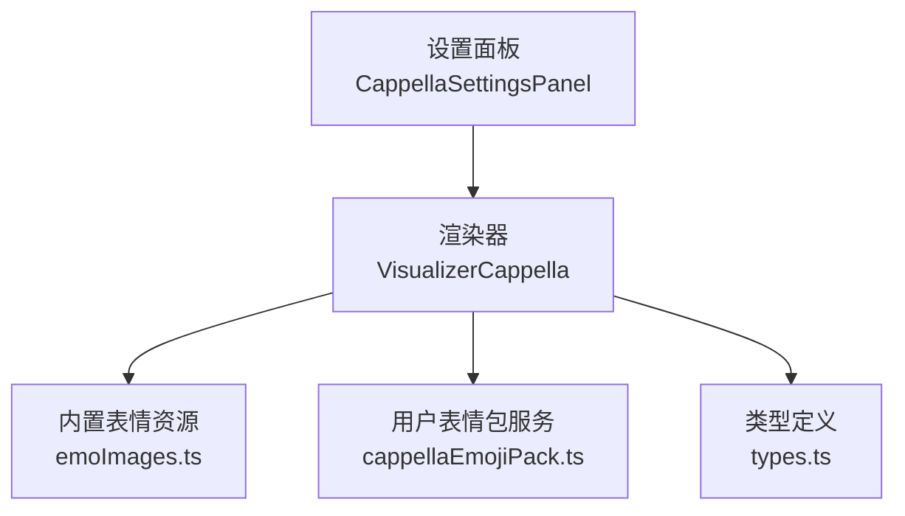
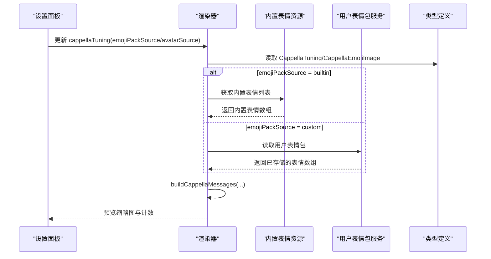
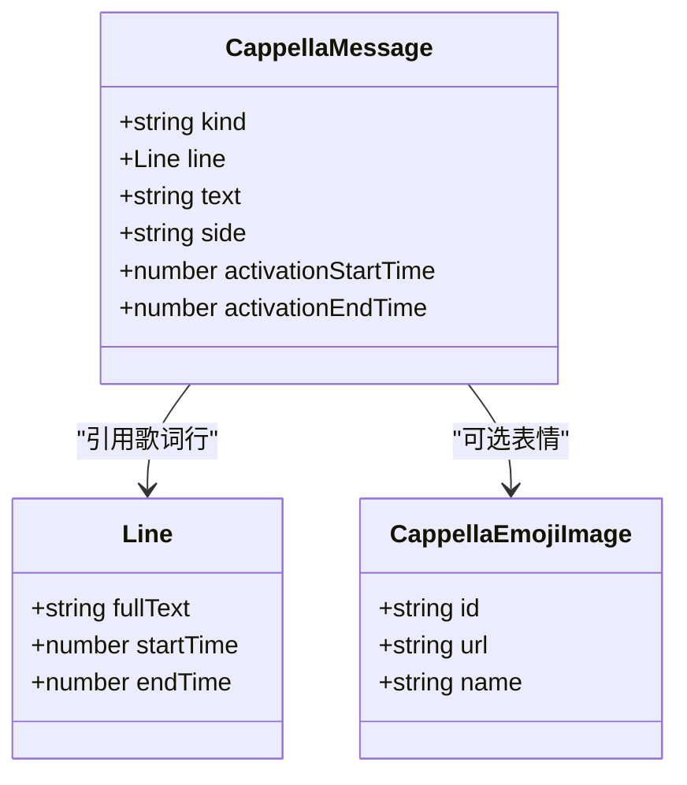
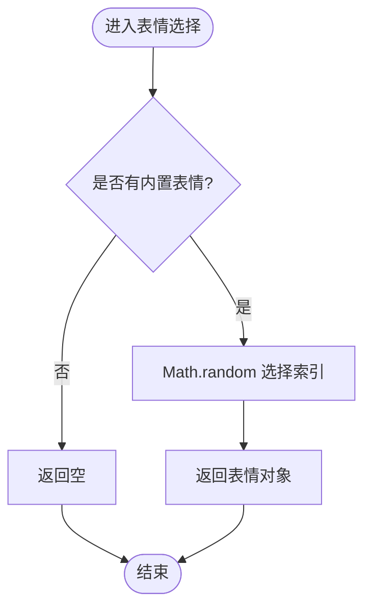
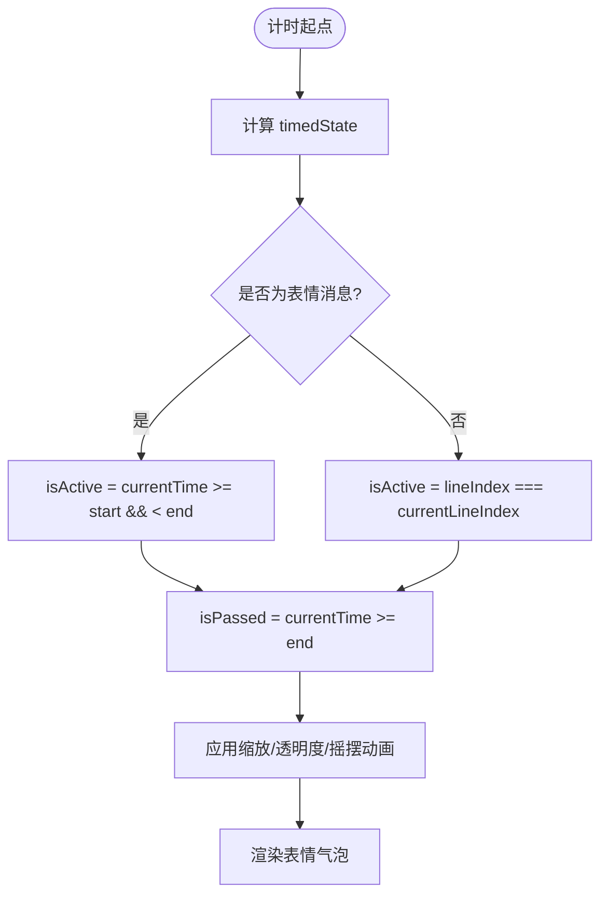
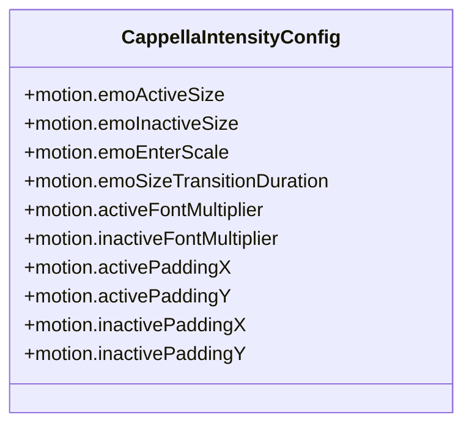
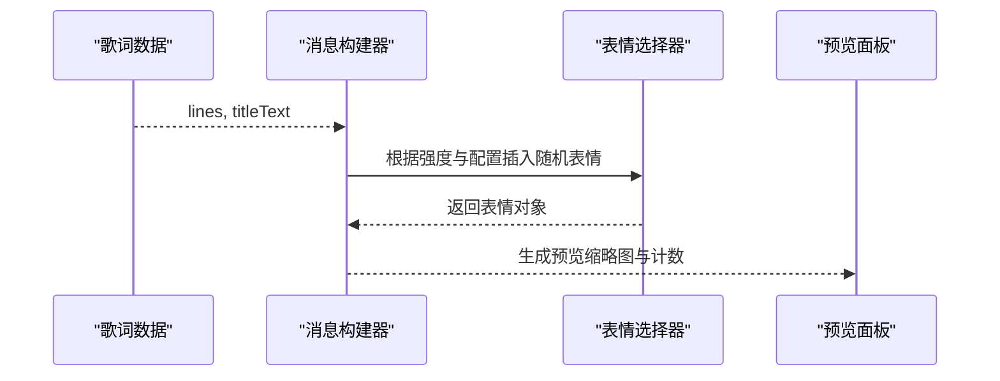
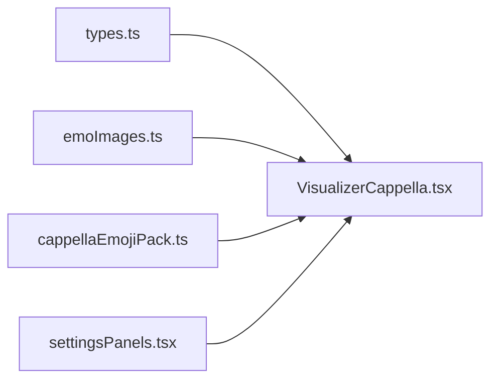

# 表情符号系统

<cite>
**本文引用的文件**   
- [VisualizerCappella.tsx](file://src/components/visualizer/cappella/VisualizerCappella.tsx)
- [emoImages.ts](file://src/components/visualizer/cappella/emoImages.ts)
- [cappellaEmojiPack.ts](file://src/services/cappellaEmojiPack.ts)
- [settingsPanels.tsx](file://src/components/visualizer/settingsPanels.tsx)
- [types.ts](file://src/types.ts)
</cite>

## 目录
1. [引言](#引言)
2. [项目结构](#项目结构)
3. [核心组件](#核心组件)
4. [架构总览](#架构总览)
5. [详细组件分析](#详细组件分析)
6. [依赖关系分析](#依赖关系分析)
7. [性能与资源优化](#性能与资源优化)
8. [故障排查指南](#故障排查指南)
9. [结论](#结论)
10. [附录：自定义表情库开发指南](#附录自定义表情库开发指南)

## 引言
本文件聚焦 Cappella 模式下的表情符号系统，系统性说明以下方面：
- 表情分类体系：反应表情、过渡表情（随机插入的“情绪表情”）与预览表情的定义与作用。
- 表情选择算法：基于时间戳的稳定随机选择与种子哈希机制。
- 表情激活时序控制：开始时间、结束时间与淡入淡出效果。
- 表情尺寸管理：活跃与非活跃状态下的尺寸差异。
- 表情与歌词关联：时机匹配与情感映射。
- 资源优化：懒加载与压缩策略。
- 自定义表情库：从上传到持久化、预览与运行时切换的全流程。

## 项目结构
Cappella 表情系统由“运行时渲染层”“表情资源层”“用户数据层”“设置面板层”四部分组成：
- 运行时渲染层：负责消息构建、表情插入、时序计算、尺寸与动画控制。
- 表情资源层：内置表情图片扫描与随机选取。
- 用户数据层：用户自定义表情包的导入、存储与清理。
- 设置面板层：表情来源切换、预览缩略图展示与计数提示。

**图表来源**
- [VisualizerCappella.tsx:1572-1582](file://src/components/visualizer/cappella/VisualizerCappella.tsx#L1572-L1582)
- [emoImages.ts:7-22](file://src/components/visualizer/cappella/emoImages.ts#L7-L22)
- [cappellaEmojiPack.ts:9-24](file://src/services/cappellaEmojiPack.ts#L9-L24)
- [types.ts:471-484](file://src/types.ts#L471-L484)

**章节来源**
- [VisualizerCappella.tsx:1572-1582](file://src/components/visualizer/cappella/VisualizerCappella.tsx#L1572-L1582)
- [emoImages.ts:7-22](file://src/components/visualizer/cappella/emoImages.ts#L7-L22)
- [cappellaEmojiPack.ts:9-24](file://src/services/cappellaEmojiPack.ts#L9-L24)
- [types.ts:471-484](file://src/types.ts#L471-L484)

## 核心组件
- 表情资源模块：通过 Vite 的 import.meta.glob 扫描 emo 目录，生成内置表情列表并提供随机选取接口。
- 用户表情包服务：将用户上传的表情包以 Blob 形式持久化到 IndexedDB，提供读取、保存、清空与格式校验能力。
- 渲染器：根据主题强度与配置构建消息序列，插入表情，计算激活状态、尺寸与动画，并驱动预览模式。
- 设置面板：暴露表情来源（内置/自定义）、头像来源、预览网格与计数提示。

**章节来源**
- [emoImages.ts:7-48](file://src/components/visualizer/cappella/emoImages.ts#L7-L48)
- [cappellaEmojiPack.ts:9-38](file://src/services/cappellaEmojiPack.ts#L9-L38)
- [VisualizerCappella.tsx:1572-1605](file://src/components/visualizer/cappella/VisualizerCappella.tsx#L1572-L1605)
- [settingsPanels.tsx:441-470](file://src/components/visualizer/settingsPanels.tsx#L441-L470)

## 架构总览
下图展示了表情系统在运行时的关键交互路径：设置面板决定来源；渲染器在构建消息时注入表情；表情资源模块提供内置表情；用户表情包服务提供自定义表情；类型定义统一数据结构。

**图表来源**
- [settingsPanels.tsx:441-470](file://src/components/visualizer/settingsPanels.tsx#L441-L470)
- [VisualizerCappella.tsx:1572-1582](file://src/components/visualizer/cappella/VisualizerCappella.tsx#L1572-L1582)
- [emoImages.ts:7-22](file://src/components/visualizer/cappella/emoImages.ts#L7-L22)
- [cappellaEmojiPack.ts:9-24](file://src/services/cappellaEmojiPack.ts#L9-L24)
- [types.ts:471-484](file://src/types.ts#L471-L484)

## 详细组件分析

### 表情分类体系
- 反应表情：与歌词行直接对应的文本气泡，随当前行高亮显示，体现“谁在唱”。
- 过渡表情（情绪表情）：在歌词行间随机插入的图片表情，用于增强节奏与情绪起伏，不直接对应歌词文本。
- 预览表情：设置面板中展示的缩略图网格，帮助用户确认当前生效的表情集合。

**图表来源**
- [VisualizerCappella.tsx:816-828](file://src/components/visualizer/cappella/VisualizerCappella.tsx#L816-L828)
- [emoImages.ts:12-22](file://src/components/visualizer/cappella/emoImages.ts#L12-L22)
- [types.ts:54-74](file://src/types.ts#L54-L74)

**章节来源**
- [VisualizerCappella.tsx:1039-1051](file://src/components/visualizer/cappella/VisualizerCappella.tsx#L1039-L1051)
- [emoImages.ts:12-22](file://src/components/visualizer/cappella/emoImages.ts#L12-L22)
- [types.ts:54-74](file://src/types.ts#L54-L74)

### 表情选择算法：稳定随机与种子哈希
- 内置表情随机选择：使用 Math.random 对内置表情数组进行等概率索引选择，预留 emotionHint 参数以便未来按情绪关键词筛选。
- 稳定随机与种子哈希：渲染器内部使用 seededUnit 与 hashString 生成稳定随机数，确保同一输入（如歌词行号、侧边、长度）在不同帧或回放中保持一致性。
- 头像选择也采用种子哈希：根据 seed、side、length 计算确定性的头像索引，避免抖动。

**图表来源**
- [emoImages.ts:34-46](file://src/components/visualizer/cappella/emoImages.ts#L34-L46)
- [VisualizerCappella.tsx:160](file://src/components/visualizer/cappella/VisualizerCappella.tsx#L160)
- [VisualizerCappella.tsx:1572-1578](file://src/components/visualizer/cappella/VisualizerCappella.tsx#L1572-L1578)

**章节来源**
- [emoImages.ts:34-46](file://src/components/visualizer/cappella/emoImages.ts#L34-L46)
- [VisualizerCappella.tsx:160](file://src/components/visualizer/cappella/VisualizerCappella.tsx#L160)
- [VisualizerCappella.tsx:1572-1578](file://src/components/visualizer/cappella/VisualizerCappella.tsx#L1572-L1578)

### 表情激活时序控制：开始时间、结束时间与淡入淡出
- 表情激活区间：表情消息包含 activationStartTime 与 activationEndTime，渲染器依据当前播放时间判断 isActive 与 isPassed。
- 非表情消息（歌词行）：以当前行索引判定激活与已过。
- 动画与透明度：表情在激活期间应用缩放与轻微摇摆动画；未激活或已过时降低透明度与尺寸，形成自然淡入淡出。

**图表来源**
- [VisualizerCappella.tsx:816-828](file://src/components/visualizer/cappella/VisualizerCappella.tsx#L816-L828)
- [VisualizerCappella.tsx:1694-1709](file://src/components/visualizer/cappella/VisualizerCappella.tsx#L1694-L1709)

**章节来源**
- [VisualizerCappella.tsx:816-828](file://src/components/visualizer/cappella/VisualizerCappella.tsx#L816-L828)
- [VisualizerCappella.tsx:1694-1709](file://src/components/visualizer/cappella/VisualizerCappella.tsx#L1694-L1709)

### 表情尺寸管理：活跃与非活跃状态
- 活跃状态：表情尺寸更大（emoActiveSize），字体放大，内边距增大，阴影与辉光增强。
- 非活跃状态：表情尺寸较小（emoInactiveSize），字体缩小，内边距减小，透明度降低。
- 过渡动画：尺寸变化通过 emoSizeTransitionDuration 平滑过渡，配合 emoEnterScale 入场缩放。

**图表来源**
- [VisualizerCappella.tsx:86-124](file://src/components/visualizer/cappella/VisualizerCappella.tsx#L86-L124)
- [VisualizerCappella.tsx:174-214](file://src/components/visualizer/cappella/VisualizerCappella.tsx#L174-L214)
- [VisualizerCappella.tsx:1216-1223](file://src/components/visualizer/cappella/VisualizerCappella.tsx#L1216-L1223)

**章节来源**
- [VisualizerCappella.tsx:86-124](file://src/components/visualizer/cappella/VisualizerCappella.tsx#L86-L124)
- [VisualizerCappella.tsx:174-214](file://src/components/visualizer/cappella/VisualizerCappella.tsx#L174-L214)
- [VisualizerCappella.tsx:1216-1223](file://src/components/visualizer/cappella/VisualizerCappella.tsx#L1216-L1223)

### 表情与歌词内容的关联逻辑：时机匹配与情感映射
- 时机匹配：表情作为独立消息插入歌词序列，其 activationStartTime/activationEndTime 与歌词行 startTime/endTime 解耦，允许在行间插入过渡表情。
- 情感映射：当前实现为随机选择表情，emotionHint 参数预留，未来可按文件名前缀或标签匹配情绪关键词，再从中随机选取。
- 预览模式：设置面板支持预览表情缩略图，便于用户在启用自定义表情包前确认内容。

**图表来源**
- [VisualizerCappella.tsx:1572-1582](file://src/components/visualizer/cappella/VisualizerCappella.tsx#L1572-L1582)
- [emoImages.ts:24-46](file://src/components/visualizer/cappella/emoImages.ts#L24-L46)
- [settingsPanels.tsx:721-754](file://src/components/visualizer/settingsPanels.tsx#L721-L754)

**章节来源**
- [VisualizerCappella.tsx:1572-1582](file://src/components/visualizer/cappella/VisualizerCappella.tsx#L1572-L1582)
- [emoImages.ts:24-46](file://src/components/visualizer/cappella/emoImages.ts#L24-L46)
- [settingsPanels.tsx:721-754](file://src/components/visualizer/settingsPanels.tsx#L721-L754)

### 表情资源优化：懒加载与压缩策略
- 懒加载：内置表情通过 Vite 的 import.meta.glob 在构建期收集，运行时按需访问 URL，避免一次性加载所有资源。
- 压缩策略：支持多种图像格式（png/jpg/jpeg/gif/webp/svg），建议优先使用 webp 或 jpg 以降低体积；SVG 适合矢量图标类表情。
- 用户表情包：Blob 存储在 IndexedDB，减少网络请求；建议在导入前本地压缩与格式转换。

**章节来源**
- [emoImages.ts:7-10](file://src/components/visualizer/cappella/emoImages.ts#L7-L10)
- [cappellaEmojiPack.ts:26-38](file://src/services/cappellaEmojiPack.ts#L26-L38)

## 依赖关系分析
- 类型依赖：CappellaTuning、CappellaEmojiImage、Line 等类型贯穿设置面板、渲染器与资源模块。
- 运行时耦合：渲染器依赖强度配置（animationIntensity）决定表情插入频率与动画强度。
- 外部集成：OBS 场景可通过 CSS 变量注入表情与头像资源，但具体样式不在本文件范围。

**图表来源**
- [types.ts:471-484](file://src/types.ts#L471-L484)
- [VisualizerCappella.tsx:1572-1582](file://src/components/visualizer/cappella/VisualizerCappella.tsx#L1572-L1582)
- [emoImages.ts:7-22](file://src/components/visualizer/cappella/emoImages.ts#L7-L22)
- [cappellaEmojiPack.ts:9-24](file://src/services/cappellaEmojiPack.ts#L9-L24)
- [settingsPanels.tsx:441-470](file://src/components/visualizer/settingsPanels.tsx#L441-L470)

**章节来源**
- [types.ts:471-484](file://src/types.ts#L471-L484)
- [VisualizerCappella.tsx:1572-1582](file://src/components/visualizer/cappella/VisualizerCappella.tsx#L1572-L1582)
- [emoImages.ts:7-22](file://src/components/visualizer/cappella/emoImages.ts#L7-L22)
- [cappellaEmojiPack.ts:9-24](file://src/services/cappellaEmojiPack.ts#L9-L24)
- [settingsPanels.tsx:441-470](file://src/components/visualizer/settingsPanels.tsx#L441-L470)

## 性能与资源优化
- 构建期资源收集：使用 import.meta.glob 在构建阶段扫描表情文件，减少运行时 IO。
- 随机选择开销：Math.random 选择索引为 O(1)，整体开销极低。
- 动画与重绘：表情尺寸与透明度变化通过 CSS 动画与 transform 实现，避免布局抖动。
- 用户表情包大小：IndexedDB 存储 Blob，注意控制单张大小与总数，避免内存压力。

[本节为通用指导，无需特定文件引用]

## 故障排查指南
- 表情不显示：检查 emojiPackSource 是否设置为 custom 且已导入表情包；确认 getCustomCappellaEmojiPack 返回非空数组。
- 表情闪烁或不稳定：确认种子哈希一致（seed、side、length），避免每帧重新生成随机源。
- 预览为空：确认 settingsPanels 中的 previewSlots 是否正确绑定到 activeEmoImages。
- 格式不支持：仅支持 png/jpg/jpeg/gif/webp/svg，其他格式将被过滤。

**章节来源**
- [cappellaEmojiPack.ts:26-38](file://src/services/cappellaEmojiPack.ts#L26-L38)
- [settingsPanels.tsx:721-754](file://src/components/visualizer/settingsPanels.tsx#L721-L754)
- [emoImages.ts:7-10](file://src/components/visualizer/cappella/emoImages.ts#L7-L10)

## 结论
Cappella 表情系统以“歌词行为主、表情为辅”的结构组织，通过稳定的随机与种子哈希保证一致性，借助强度配置控制表情密度与动画表现。内置表情与用户表情包并存，设置面板提供直观预览与管理入口。未来可在 emotionHint 上扩展情感映射，进一步提升表情与歌词情感的契合度。

[本节为总结性内容，无需特定文件引用]

## 附录：自定义表情库开发指南
- 文件格式：建议使用 png/jpg/jpeg/gif/webp/svg，优先 webp 或 jpg 以获得更小体积。
- 命名规范：可加入情绪前缀（如 happy_、sad_），为未来 emotionHint 筛选做准备。
- 导入流程：
  - 在设置面板中选择“自定义”来源。
  - 使用“上传自定义表情包”按钮选择多个图片文件。
  - 系统将构建 StoredCappellaEmojiImage 数组并保存到 IndexedDB。
  - 预览网格显示新表情，计数提示当前数量。
- 清理与替换：
  - 使用“清空自定义表情包”移除全部用户表情。
  - 再次上传将覆盖现有集合。
- 运行时行为：
  - 当 emojiPackSource = custom 时，渲染器从用户表情包中随机选择表情。
  - 若用户表情包为空，回退到内置表情或空结果。

**章节来源**
- [cappellaEmojiPack.ts:9-38](file://src/services/cappellaEmojiPack.ts#L9-L38)
- [settingsPanels.tsx:441-470](file://src/components/visualizer/settingsPanels.tsx#L441-L470)
- [settingsPanels.tsx:721-754](file://src/components/visualizer/settingsPanels.tsx#L721-L754)
- [emoImages.ts:34-46](file://src/components/visualizer/cappella/emoImages.ts#L34-L46)