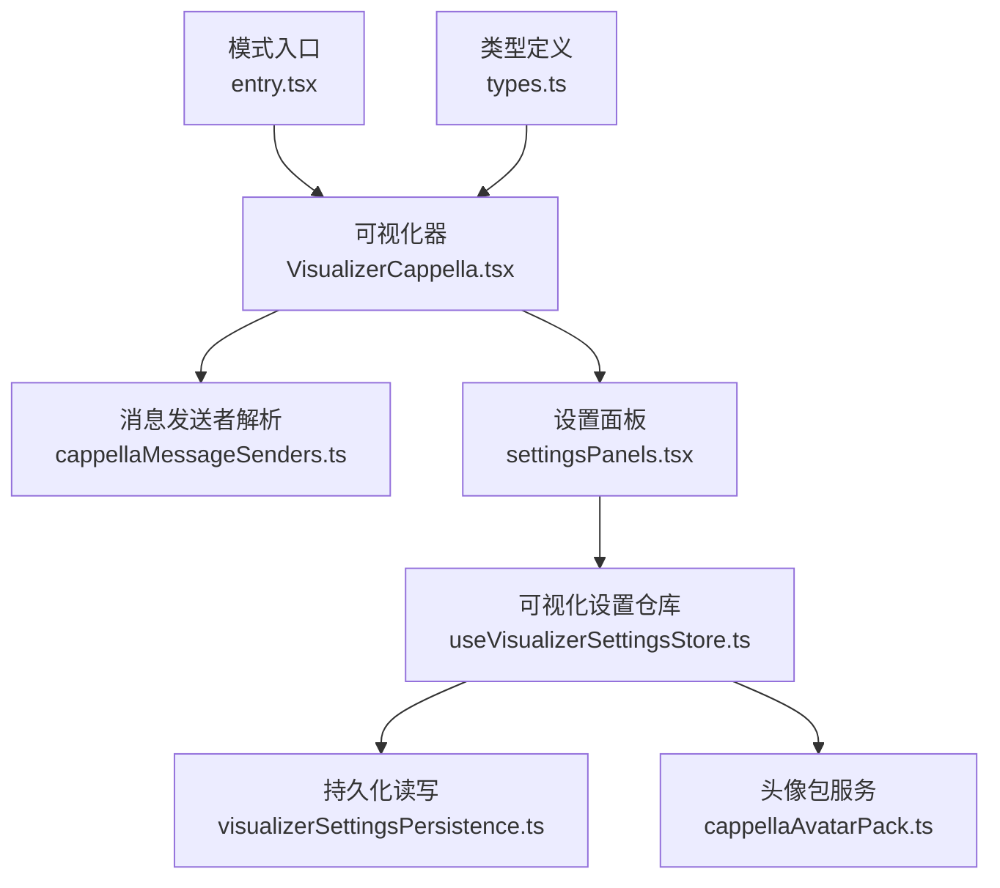
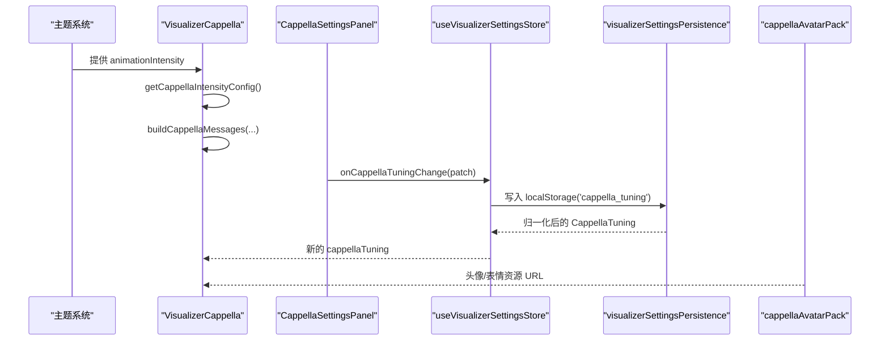
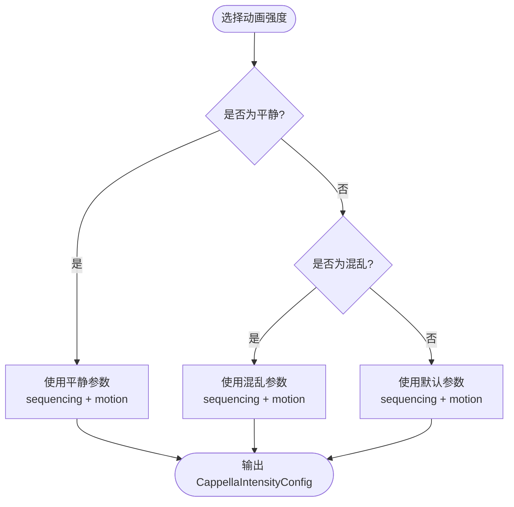
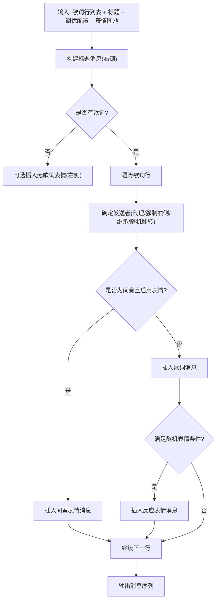
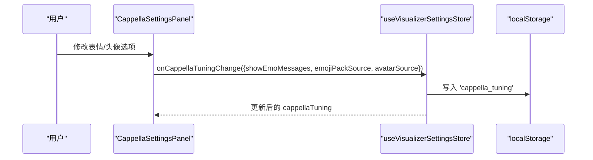
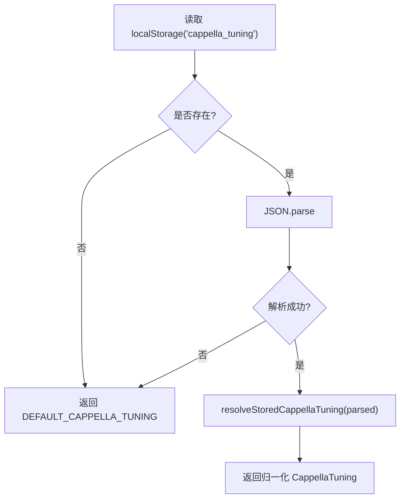
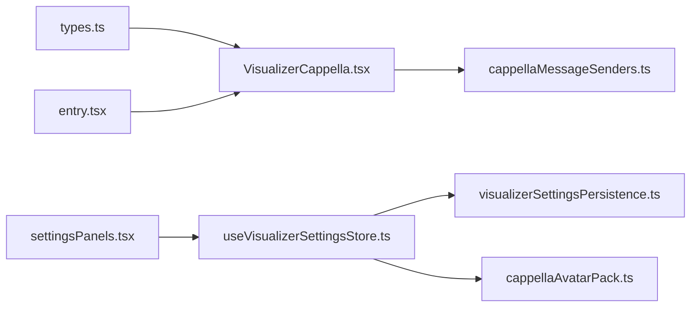

# 调优配置系统

<cite>
**本文引用的文件**   
- [VisualizerCappella.tsx](file://src/components/visualizer/cappella/VisualizerCappella.tsx)
- [cappellaMessageSenders.ts](file://src/components/visualizer/cappella/cappellaMessageSenders.ts)
- [entry.tsx](file://src/components/visualizer/cappella/entry.tsx)
- [settingsPanels.tsx](file://src/components/visualizer/settingsPanels.tsx)
- [useVisualizerSettingsStore.ts](file://src/stores/useVisualizerSettingsStore.ts)
- [visualizerSettingsPersistence.ts](file://src/stores/visualizerSettingsPersistence.ts)
- [cappellaAvatarPack.ts](file://src/services/cappellaAvatarPack.ts)
- [types.ts](file://src/types.ts)
</cite>

## 目录
1. [简介](#简介)
2. [项目结构](#项目结构)
3. [核心组件](#核心组件)
4. [架构总览](#架构总览)
5. [详细组件分析](#详细组件分析)
6. [依赖关系分析](#依赖关系分析)
7. [性能考虑](#性能考虑)
8. [故障排查指南](#故障排查指南)
9. [结论](#结论)
10. [附录：自定义调优配置创建指南](#附录自定义调优配置创建指南)

## 简介
本技术文档聚焦 Cappella 模式的调优配置系统，围绕以下目标展开：
- 解释调优参数结构，包括动画强度、序列控制与运动效果。
- 说明预设配置模板（平静、混乱、默认）的参数差异。
- 阐述动态调优机制：运行时参数调整、用户偏好适配与性能自适应。
- 解释配置验证系统：参数范围检查、依赖关系校验与错误恢复。
- 说明配置持久化方案：本地存储、云端同步与版本迁移。
- 提供调优工具链建议：参数测试、可视化调试与性能分析。
- 给出自定义调优配置的创建指南。

## 项目结构
Cappella 调优相关代码主要分布在可视化器实现、设置面板、状态持久化与服务层中：
- 可视化器实现负责根据主题动画强度生成具体调优参数，并驱动歌词气泡、表情消息与头像布局。
- 设置面板暴露可调选项，如是否显示表情消息、表情包来源与头像来源。
- 状态持久化负责从本地存储读取、归一化与回退到默认值。
- 服务层负责自定义头像的 IndexedDB 存取与类型校验。
- 入口文件注册 Cappella 可视化模式及其设置面板。

**图表来源**
- [VisualizerCappella.tsx:86-125](file://src/components/visualizer/cappella/VisualizerCappella.tsx#L86-L125)
- [cappellaMessageSenders.ts:1-75](file://src/components/visualizer/cappella/cappellaMessageSenders.ts#L1-L75)
- [settingsPanels.tsx:420-620](file://src/components/visualizer/settingsPanels.tsx#L420-L620)
- [useVisualizerSettingsStore.ts:539-558](file://src/stores/useVisualizerSettingsStore.ts#L539-L558)
- [visualizerSettingsPersistence.ts:533-559](file://src/stores/visualizerSettingsPersistence.ts#L533-L559)
- [cappellaAvatarPack.ts:1-38](file://src/services/cappellaAvatarPack.ts#L1-L38)
- [entry.tsx:1-22](file://src/components/visualizer/cappella/entry.tsx#L1-L22)
- [types.ts:1147-1171](file://src/types.ts#L1147-L1171)

**章节来源**
- [VisualizerCappella.tsx:86-125](file://src/components/visualizer/cappella/VisualizerCappella.tsx#L86-L125)
- [entry.tsx:1-22](file://src/components/visualizer/cappella/entry.tsx#L1-L22)

## 核心组件
- CappellaIntensityConfig：定义 Cappella 的“序列控制”和“运动效果”两类调优参数。
- getCappellaIntensityConfig：根据主题动画强度（平静/混乱/默认）返回对应参数集。
- buildCappellaMessages：基于歌词行、标题文本、调优配置与表情图池构建消息序列。
- CappellaSettingsPanel：用户界面，用于切换表情消息开关、表情包来源与头像来源。
- useVisualizerSettingsStore：管理 cappellaTuning 的状态变更与本地持久化。
- visualizerSettingsPersistence：从 localStorage 读取并归一化 cappella 调优数据。
- cappellaAvatarPack：IndexedDB 存取自定义头像，并提供文件类型校验。
- entry.tsx：注册 Cappella 可视化模式与设置面板。

**章节来源**
- [VisualizerCappella.tsx:86-125](file://src/components/visualizer/cappella/VisualizerCappella.tsx#L86-L125)
- [VisualizerCappella.tsx:174-301](file://src/components/visualizer/cappella/VisualizerCappella.tsx#L174-L301)
- [VisualizerCappella.tsx:304-496](file://src/components/visualizer/cappella/VisualizerCappella.tsx#L304-L496)
- [settingsPanels.tsx:420-620](file://src/components/visualizer/settingsPanels.tsx#L420-L620)
- [useVisualizerSettingsStore.ts:539-558](file://src/stores/useVisualizerSettingsStore.ts#L539-L558)
- [visualizerSettingsPersistence.ts:533-559](file://src/stores/visualizerSettingsPersistence.ts#L533-L559)
- [cappellaAvatarPack.ts:1-38](file://src/services/cappellaAvatarPack.ts#L1-L38)
- [entry.tsx:1-22](file://src/components/visualizer/cappella/entry.tsx#L1-L22)

## 架构总览
Cappella 调优系统的运行流程如下：
- 主题动画强度决定 CappellaIntensityConfig。
- 歌词与标题经 buildCappellaMessages 转换为消息序列。
- 设置面板通过 onCappellaTuningChange 更新 cappellaTuning。
- 设置仓库将新配置写入 localStorage，并触发 UI 重渲染。
- 持久化模块在启动时读取并归一化配置，异常时回退默认值。
- 头像与表情资源由服务层加载，支持内置与自定义来源。

**图表来源**
- [VisualizerCappella.tsx:174-301](file://src/components/visualizer/cappella/VisualizerCappella.tsx#L174-L301)
- [VisualizerCappella.tsx:304-496](file://src/components/visualizer/cappella/VisualizerCappella.tsx#L304-L496)
- [settingsPanels.tsx:420-620](file://src/components/visualizer/settingsPanels.tsx#L420-L620)
- [useVisualizerSettingsStore.ts:539-558](file://src/stores/useVisualizerSettingsStore.ts#L539-L558)
- [visualizerSettingsPersistence.ts:533-559](file://src/stores/visualizerSettingsPersistence.ts#L533-L559)
- [cappellaAvatarPack.ts:1-38](file://src/services/cappellaAvatarPack.ts#L1-L38)

## 详细组件分析

### 调优参数结构与预设模板
- 参数结构
  - 序列控制 sequencing：控制左右侧分配、短行继承概率、随机表情插入等。
  - 运动效果 motion：控制行进入/退出位移与缩放、头像弹簧参数、激活态字体缩放、内边距、辉光与阴影、表情尺寸与过渡时长等。
- 预设模板
  - 平静 calm：较低的随机表情概率、较小的进入位移与缩放、较柔和的辉光与阴影。
  - 混乱 chaotic：更高的随机表情概率、更大的进入位移与缩放、更强的辉光与阴影、更激进的字体放大。
  - 默认 normal：介于两者之间，作为平衡配置。

**图表来源**
- [VisualizerCappella.tsx:174-301](file://src/components/visualizer/cappella/VisualizerCappella.tsx#L174-L301)

**章节来源**
- [VisualizerCappella.tsx:86-125](file://src/components/visualizer/cappella/VisualizerCappella.tsx#L86-L125)
- [VisualizerCappella.tsx:174-301](file://src/components/visualizer/cappella/VisualizerCappella.tsx#L174-L301)

### 消息序列与角色分配
- 消息类型
  - 标题消息 title：固定在右侧，使用右下角头像。
  - 歌词消息 lyric：按时间轴逐行出现，左侧或右侧交替。
  - 表情消息 emo：可随歌词或间奏插入，带激活起止时间。
- 角色分配策略
  - 若歌词包含 agentId，则通过 createCappellaAgentSenderResolver 稳定映射为左右角色与头像索引。
  - 否则依据 forceRightEveryLines、sideSequence、sideFlipChance 与 shortLineCarryChance 计算。
- 随机表情插入
  - 受 randomEmoChance、minLinesBetweenRandomEmos、maxRandomEmoRatio 控制，确保表情密度与节奏合理。

**图表来源**
- [VisualizerCappella.tsx:304-496](file://src/components/visualizer/cappella/VisualizerCappella.tsx#L304-L496)
- [cappellaMessageSenders.ts:43-74](file://src/components/visualizer/cappella/cappellaMessageSenders.ts#L43-L74)

**章节来源**
- [VisualizerCappella.tsx:304-496](file://src/components/visualizer/cappella/VisualizerCappella.tsx#L304-L496)
- [cappellaMessageSenders.ts:1-75](file://src/components/visualizer/cappella/cappellaMessageSenders.ts#L1-L75)

### 用户界面与设置项
- 可调项
  - showEmoMessages：是否显示表情消息。
  - emojiPackSource：表情包来源（内置/自定义）。
  - avatarSource：头像来源（封面/内置/颜色/自定义）。
- 交互流程
  - 用户在 CappellaSettingsPanel 中选择选项。
  - 调用 onCappellaTuningChange 更新 cappellaTuning。
  - 设置仓库将 patch 合并并持久化到 localStorage。

**图表来源**
- [settingsPanels.tsx:420-620](file://src/components/visualizer/settingsPanels.tsx#L420-L620)
- [useVisualizerSettingsStore.ts:539-558](file://src/stores/useVisualizerSettingsStore.ts#L539-L558)

**章节来源**
- [settingsPanels.tsx:420-620](file://src/components/visualizer/settingsPanels.tsx#L420-L620)
- [useVisualizerSettingsStore.ts:539-558](file://src/stores/useVisualizerSettingsStore.ts#L539-L558)

### 配置验证与错误恢复
- 来源归一化
  - resolveCappellaAvatarSource：仅接受内置、颜色、封面、自定义四种值，其他回退默认。
  - resolveStoredCappellaTuning：对 showEmoMessages、emojiPackSource、avatarSource 进行安全赋值。
- 读取容错
  - readStoredCappellaTuning：JSON 解析失败或键不存在时返回默认配置。
- 数值范围约束
  - 其他可视化器的持久化逻辑展示了 clamp 与单位区间约束模式，可作为 Cappella 扩展时的参考。

**图表来源**
- [visualizerSettingsPersistence.ts:533-559](file://src/stores/visualizerSettingsPersistence.ts#L533-L559)

**章节来源**
- [visualizerSettingsPersistence.ts:533-559](file://src/stores/visualizerSettingsPersistence.ts#L533-L559)

### 配置持久化与版本迁移
- 本地存储
  - key：'cappella_tuning'。
  - 写入时机：onCappellaTuningChange 与重置操作。
  - 读取时机：应用启动或需要 Cappella 调优时。
- 版本迁移
  - 当前实现以 resolveStoredCappellaTuning 做字段级兼容；未来新增字段可通过默认值与归一化函数处理。
- 云端同步
  - 当前仓库未提供 Cappella 专属云端同步实现；如需扩展，可在设置仓库中增加同步钩子，将 cappellaTuning 推送到远端并在拉取后执行归一化。

**章节来源**
- [useVisualizerSettingsStore.ts:539-558](file://src/stores/useVisualizerSettingsStore.ts#L539-L558)
- [visualizerSettingsPersistence.ts:533-559](file://src/stores/visualizerSettingsPersistence.ts#L533-L559)

### 资源与头像管理
- 表情包
  - 内置表情与自定义表情通过 emojiPackSource 切换。
  - 自定义表情导入成功后，UI 显示预览与数量统计。
- 头像包
  - 自定义头像存储在 IndexedDB，支持 PNG/JPG/GIF/WebP/SVG。
  - 头像来源可为封面、内置、颜色或自定义。
  - 清空自定义头像后，自动回退到内置来源。

**章节来源**
- [cappellaAvatarPack.ts:1-38](file://src/services/cappellaAvatarPack.ts#L1-L38)
- [settingsPanels.tsx:420-620](file://src/components/visualizer/settingsPanels.tsx#L420-L620)
- [useVisualizerSettingsStore.ts:819-847](file://src/stores/useVisualizerSettingsStore.ts#L819-L847)

## 依赖关系分析
- 组件耦合
  - VisualizerCappella 依赖 types 中的默认调优与类型定义。
  - settingsPanels 依赖 useVisualizerSettingsStore 提供的 setter 与状态。
  - visualizerSettingsPersistence 提供安全的读取与归一化。
  - cappellaAvatarPack 提供头像资源的持久化与校验。
- 外部依赖
  - framer-motion 用于动画。
  - @chenglou/pretext 用于歌词解析与布局。
  - IndexedDB 用于头像存储。

**图表来源**
- [types.ts:1147-1171](file://src/types.ts#L1147-L1171)
- [VisualizerCappella.tsx:1-17](file://src/components/visualizer/cappella/VisualizerCappella.tsx#L1-L17)
- [cappellaMessageSenders.ts:1-75](file://src/components/visualizer/cappella/cappellaMessageSenders.ts#L1-L75)
- [settingsPanels.tsx:420-620](file://src/components/visualizer/settingsPanels.tsx#L420-L620)
- [useVisualizerSettingsStore.ts:539-558](file://src/stores/useVisualizerSettingsStore.ts#L539-L558)
- [visualizerSettingsPersistence.ts:533-559](file://src/stores/visualizerSettingsPersistence.ts#L533-L559)
- [cappellaAvatarPack.ts:1-38](file://src/services/cappellaAvatarPack.ts#L1-L38)
- [entry.tsx:1-22](file://src/components/visualizer/cappella/entry.tsx#L1-L22)

**章节来源**
- [VisualizerCappella.tsx:1-17](file://src/components/visualizer/cappella/VisualizerCappella.tsx#L1-L17)
- [entry.tsx:1-22](file://src/components/visualizer/cappella/entry.tsx#L1-L22)

## 性能考虑
- 字符揭示优化
  - 使用二分查找按时间获取可见字符数，避免每帧重建子串。
- 预加热窗口
  - 提前准备歌词布局与气泡尺寸，减少播放初期的卡顿。
- 布局缓存限制
  - 限制布局缓存条目数量，防止内存增长。
- 视口自适应
  - 估算消息高度并反向累加，保证底部不溢出，同时保留上下文消息。

**章节来源**
- [VisualizerCappella.tsx:519-594](file://src/components/visualizer/cappella/VisualizerCappella.tsx#L519-L594)
- [VisualizerCappella.tsx:699-800](file://src/components/visualizer/cappella/VisualizerCappella.tsx#L699-L800)

## 故障排查指南
- 配置无法保存
  - 检查 onCappellaTuningChange 是否正确调用，确认 localStorage 写入成功。
- 配置读取失败
  - 查看 readStoredCappellaTuning 的 try/catch 分支，确认 JSON 格式正确。
- 头像无法显示
  - 检查 isSupportedCappellaAvatarFile 与文件类型，确认 IndexedDB 存储成功。
- 表情未出现
  - 确认 showEmoMessages 与 emojiPackSource 设置，以及表情图池非空。

**章节来源**
- [useVisualizerSettingsStore.ts:539-558](file://src/stores/useVisualizerSettingsStore.ts#L539-L558)
- [visualizerSettingsPersistence.ts:533-559](file://src/stores/visualizerSettingsPersistence.ts#L533-L559)
- [cappellaAvatarPack.ts:26-38](file://src/services/cappellaAvatarPack.ts#L26-L38)

## 结论
Cappella 调优配置系统以主题动画强度为核心，结合序列控制与运动效果参数，提供平静、混乱与默认三种预设模板。用户可通过设置面板调整表情与头像来源，所有更改均持久化至本地存储，并在读取时进行归一化与容错。系统在设计上兼顾性能与可维护性，便于后续扩展云端同步与更多调优维度。

## 附录：自定义调优配置创建指南
- 新增调优字段
  - 在 CappellaIntensityConfig 中添加字段，并在 getCappellaIntensityConfig 的三个分支中分别赋值。
  - 在 CappellaTuning 中添加用户可调字段，并在 settingsPanels 中暴露 UI。
- 添加验证与默认值
  - 在 resolveStoredCappellaTuning 中为新字段提供默认值与安全赋值。
  - 必要时引入 clamp 或枚举校验，确保数值范围合法。
- 持久化与迁移
  - 在 useVisualizerSettingsStore 中写入 localStorage。
  - 在 readStoredCappellaTuning 中兼容旧版本字段缺失。
- 资源与头像
  - 如需新增头像来源，扩展 cappellaAvatarPack 的类型与校验逻辑。
  - 在 settingsPanels 中提供导入与预览能力。

**章节来源**
- [VisualizerCappella.tsx:86-125](file://src/components/visualizer/cappella/VisualizerCappella.tsx#L86-L125)
- [VisualizerCappella.tsx:174-301](file://src/components/visualizer/cappella/VisualizerCappella.tsx#L174-L301)
- [settingsPanels.tsx:420-620](file://src/components/visualizer/settingsPanels.tsx#L420-L620)
- [visualizerSettingsPersistence.ts:533-559](file://src/stores/visualizerSettingsPersistence.ts#L533-L559)
- [cappellaAvatarPack.ts:1-38](file://src/services/cappellaAvatarPack.ts#L1-L38)