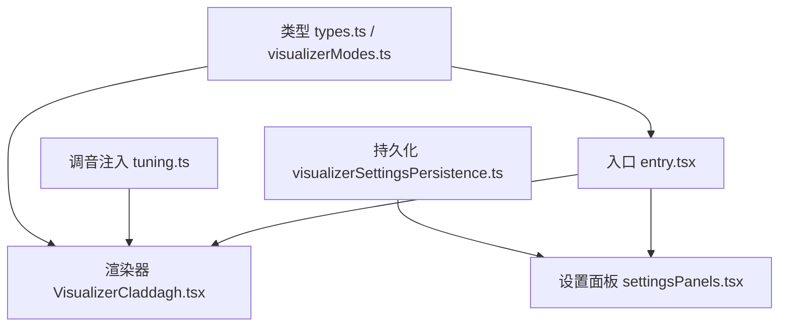
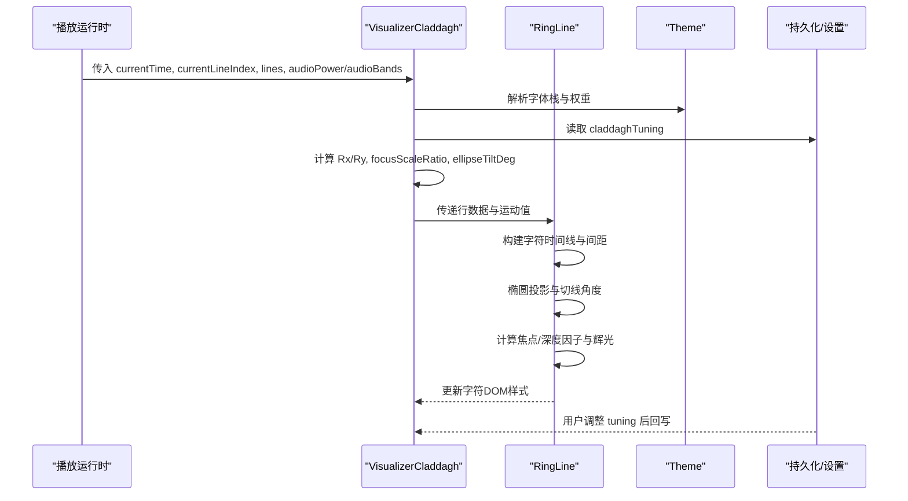
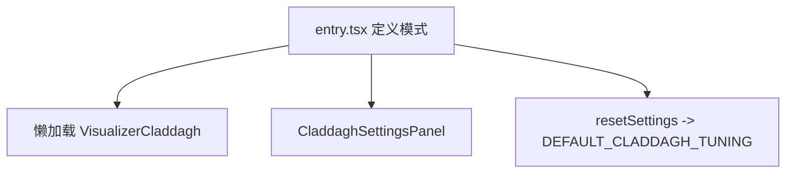
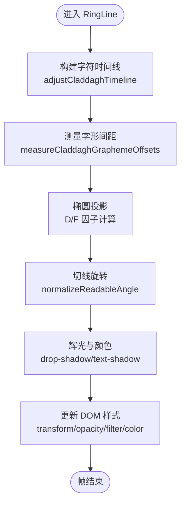
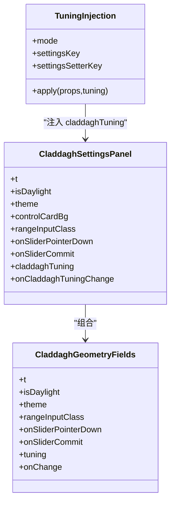
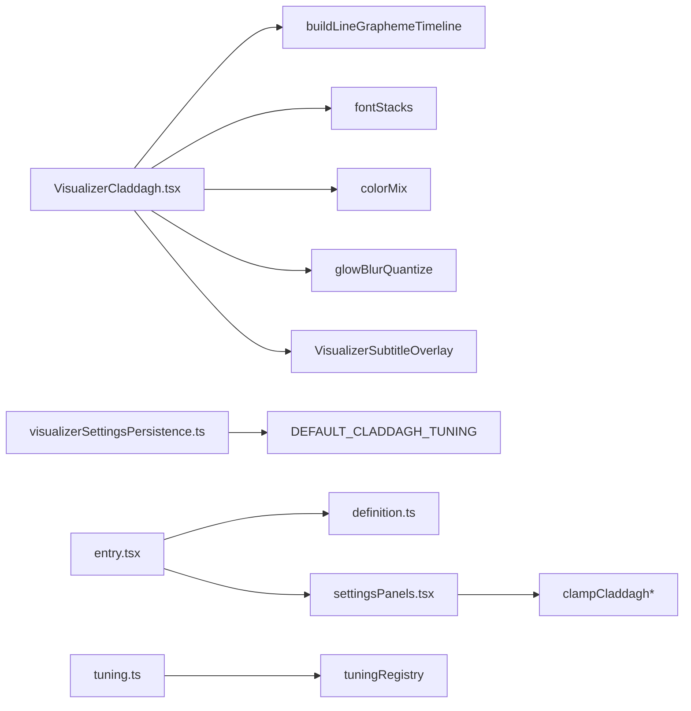

# Claddagh模式实现

<cite>
**本文引用的文件**   
- [VisualizerCladdagh.tsx](file://src/components/visualizer/claddagh/VisualizerCladdagh.tsx)
- [entry.tsx](file://src/components/visualizer/claddagh/entry.tsx)
- [tuning.ts](file://src/components/visualizer/claddagh/tuning.ts)
- [settingsPanels.tsx](file://src/components/visualizer/settingsPanels.tsx)
- [visualizerSettingsPersistence.ts](file://src/stores/visualizerSettingsPersistence.ts)
- [types.ts](file://src/types.ts)
- [visualizerModes.ts](file://src/types/visualizerModes.ts)
- [claddaghPlaybackReset.test.ts](file://test/unit/visualizer/claddaghPlaybackReset.test.ts)
</cite>

## 目录
1. [简介](#简介)
2. [项目结构](#项目结构)
3. [核心组件](#核心组件)
4. [架构总览](#架构总览)
5. [详细组件分析](#详细组件分析)
6. [依赖关系分析](#依赖关系分析)
7. [性能考量](#性能考量)
8. [故障排查指南](#故障排查指南)
9. [结论](#结论)
10. [附录](#附录)

## 简介
本文件为 Claddagh 可视化模式的完整技术文档。Claddagh 以凯尔特风格的环形歌词布局为核心，通过椭圆轨道、字符切线旋转、焦点缩放与辉光滤镜，将歌词逐字映射到三维感环带上；同时提供轴辅助线、和弦段落差异化渲染、音频能量响应与主题适配。文档覆盖几何生成、对称与重复、动画系统、主题机制、性能优化与文化元素数字化实现，并给出自定义凯尔特风格与传统图案的开发指引。

## 项目结构
Claddagh 模式位于 visualizer 子系统中，采用“入口注册 + 渲染器 + 设置面板 + 调音配置”的分层组织：
- 入口注册：声明模式元数据、懒加载渲染器与设置面板。
- 渲染器：负责歌词时间线、字形测量、椭圆投影、字符变换、辉光与主题适配。
- 设置面板：暴露半径、焦点缩放、椭圆倾角、轴线显示、字距偏移等可调参数。
- 调音注入：在渲染边界将强类型 tuning 注入 props。
- 持久化：对 tuning 字段进行范围校验与本地存储读写。

**图表来源**
- [entry.tsx:10-24](file://src/components/visualizer/claddagh/entry.tsx#L10-L24)
- [VisualizerCladdagh.tsx:775-1087](file://src/components/visualizer/claddagh/VisualizerCladdagh.tsx#L775-L1087)
- [settingsPanels.tsx:1140-1300](file://src/components/visualizer/settingsPanels.tsx#L1140-L1300)
- [tuning.ts:1-4](file://src/components/visualizer/claddagh/tuning.ts#L1-L4)
- [visualizerSettingsPersistence.ts:300-338](file://src/stores/visualizerSettingsPersistence.ts#L300-L338)
- [visualizerModes.ts:15-30](file://src/types/visualizerModes.ts#L15-L30)

**章节来源**
- [entry.tsx:10-24](file://src/components/visualizer/claddagh/entry.tsx#L10-L24)
- [VisualizerCladdagh.tsx:775-1087](file://src/components/visualizer/claddagh/VisualizerCladdagh.tsx#L775-L1087)
- [settingsPanels.tsx:1140-1300](file://src/components/visualizer/settingsPanels.tsx#L1140-L1300)
- [tuning.ts:1-4](file://src/components/visualizer/claddagh/tuning.ts#L1-L4)
- [visualizerSettingsPersistence.ts:300-338](file://src/stores/visualizerSettingsPersistence.ts#L300-L338)
- [visualizerModes.ts:15-30](file://src/types/visualizerModes.ts#L15-L30)

## 核心组件
- 入口定义：声明 mode、order、labelKey、previewSeed、tuningKind，并提供懒加载渲染与设置面板。
- 渲染主组件：管理容器尺寸、椭圆轨道参数、行索引过渡、音频能量平滑、中心轴辅助线、歌词行渲染与字幕叠加。
- 单行渲染单元 RingLine：按字符构建时间线、计算字形间距、投影到椭圆、应用深度与焦点因子、计算辉光与颜色、更新 DOM 样式。
- 设置面板：提供几何参数滑块与开关，统一 clamp 校验。
- 调音注入：将 claddaghTuning 注入渲染器 props。
- 持久化：读取/保存 claddagh_tuning，并对各字段做范围限制。

**章节来源**
- [entry.tsx:10-24](file://src/components/visualizer/claddagh/entry.tsx#L10-L24)
- [VisualizerCladdagh.tsx:775-1087](file://src/components/visualizer/claddagh/VisualizerCladdagh.tsx#L775-L1087)
- [settingsPanels.tsx:1140-1300](file://src/components/visualizer/settingsPanels.tsx#L1140-L1300)
- [tuning.ts:1-4](file://src/components/visualizer/claddagh/tuning.ts#L1-L4)
- [visualizerSettingsPersistence.ts:300-338](file://src/stores/visualizerSettingsPersistence.ts#L300-L338)

## 架构总览
Claddagh 的运行时流程如下：
- 播放时间 currentTime 与当前行 currentLineIndex 由上层运行时提供。
- 渲染器根据 lines 与主题 theme 计算字体规格、椭圆半径 Rx/Ry、焦点缩放与倾角。
- 使用 MotionValue 驱动行切换弹簧动画 lineOffset，保持出/入行可见。
- RingLine 订阅 currentTime 与 lineOffset，逐帧计算每个字符的位置、旋转、缩放、模糊与辉光。
- 设置面板通过 claddaghTuning 控制几何与视觉参数，持久化层保证数值合法。

**图表来源**
- [VisualizerCladdagh.tsx:809-982](file://src/components/visualizer/claddagh/VisualizerCladdagh.tsx#L809-L982)
- [VisualizerCladdagh.tsx:433-744](file://src/components/visualizer/claddagh/VisualizerCladdagh.tsx#L433-L744)
- [settingsPanels.tsx:1255-1300](file://src/components/visualizer/settingsPanels.tsx#L1255-L1300)
- [visualizerSettingsPersistence.ts:320-338](file://src/stores/visualizerSettingsPersistence.ts#L320-L338)

## 详细组件分析

### 入口与注册
- 入口声明模式 id 为 'claddagh'，order 为 80，标签键与回退名用于 UI。
- 懒加载渲染器避免冷启动开销。
- 设置面板直接复用通用几何控件。
- 重置设置调用默认 tuning。

**图表来源**
- [entry.tsx:10-24](file://src/components/visualizer/claddagh/entry.tsx#L10-L24)

**章节来源**
- [entry.tsx:10-24](file://src/components/visualizer/claddagh/entry.tsx#L10-L24)

### 渲染主组件 VisualizerCladdagh
职责要点：
- 容器尺寸自适应：挂载时初始化宽高，ResizeObserver 监听变化。
- 椭圆轨道参数：Rx 基于容器宽度上限与 radiusScale；Ry 按 45° 投影比例。
- 行索引过渡：useMotionValue + spring 动画，处理相邻行切换与跳行复位。
- 音频能量平滑：bass/vocal 频段经 useSpring 平滑，驱动轴辅助线与辉光强度。
- 中心轴辅助线：渐变背景、端点淡出、随音频能量缩放与发光。
- 行渲染窗口：仅渲染 renderBaseIndex 前后若干行，减少重绘。
- 字幕叠加：复用通用字幕覆盖层。

关键实现路径：
- 尺寸与轨道：[VisualizerCladdagh.tsx:906-933](file://src/components/visualizer/claddagh/VisualizerCladdagh.tsx#L906-L933)
- 行索引与过渡：[VisualizerCladdagh.tsx:941-982](file://src/components/visualizer/claddagh/VisualizerCladdagh.tsx#L941-L982)
- 轴辅助线动画：[VisualizerCladdagh.tsx:834-904](file://src/components/visualizer/claddagh/VisualizerCladdagh.tsx#L834-L904)
- 行渲染列表：[VisualizerCladdagh.tsx:1035-1059](file://src/components/visualizer/claddagh/VisualizerCladdagh.tsx#L1035-L1059)

**章节来源**
- [VisualizerCladdagh.tsx:809-1087](file://src/components/visualizer/claddagh/VisualizerCladdagh.tsx#L809-L1087)

### 单行渲染单元 RingLine
RingLine 是 Claddagh 的核心算法载体，负责：
- 字符时间线构建：buildLineGraphemeTimeline + adjustCladdaghTimeline，确保空格/间隙有最小时长，必要时从相邻字符借时。
- 字形间距测量：measureCladdaghGraphemeOffsets 使用 canvas-backed 测量，支持基础字距 CLADDAGH_BASE_TRACKING_EM 与额外 letterSpacingOffset。
- 椭圆投影：将字符中心映射到椭圆弧上，考虑深度因子 D（前/后）与焦点因子 F（活跃字符）。
- 切线旋转：normalizeReadableAngle 限制可读角度范围，避免倒置字符。
- 辉光与颜色：非合唱用单层 drop-shadow；合唱用三层 drop-shadow 模拟 text-shadow 多层效果；颜色在进度到达时硬切高亮，伴随瞬时半径弹跳。
- 性能与兼容：在 Linux 下使用 drop-shadow filter 替代 text-shadow，避免 glyph cache 泄漏；阴影半径量化以减少缓存爆炸。

**图表来源**
- [VisualizerCladdagh.tsx:433-744](file://src/components/visualizer/claddagh/VisualizerCladdagh.tsx#L433-L744)
- [VisualizerCladdagh.tsx:227-297](file://src/components/visualizer/claddagh/VisualizerCladdagh.tsx#L227-L297)
- [VisualizerCladdagh.tsx:192-211](file://src/components/visualizer/claddagh/VisualizerCladdagh.tsx#L192-L211)

**章节来源**
- [VisualizerCladdagh.tsx:192-744](file://src/components/visualizer/claddagh/VisualizerCladdagh.tsx#L192-L744)

### 设置面板与调音
- 几何字段：focusScaleRatio、radiusScale、ellipseTiltDeg、showAxisLine、letterSpacingOffset。
- 范围校验：clampCladdagh* 系列函数在各处保持一致。
- 面板复用：CladdaghGeometryFields 被多个模式共用，避免漂移。
- 调音注入：defineVisualizerTuning 将 claddaghTuning 注入渲染器 props。

**图表来源**
- [settingsPanels.tsx:1140-1300](file://src/components/visualizer/settingsPanels.tsx#L1140-L1300)
- [tuning.ts:1-4](file://src/components/visualizer/claddagh/tuning.ts#L1-L4)

**章节来源**
- [settingsPanels.tsx:1140-1300](file://src/components/visualizer/settingsPanels.tsx#L1140-L1300)
- [tuning.ts:1-4](file://src/components/visualizer/claddagh/tuning.ts#L1-L4)

### 类型与模式清单
- 内建模式清单包含 'claddagh'，并在 registry 初始化时断言一致性。
- Line、Theme 等类型定义歌词行与主题结构，供渲染器消费。

**章节来源**
- [visualizerModes.ts:15-30](file://src/types/visualizerModes.ts#L15-L30)
- [types.ts:54-102](file://src/types.ts#L54-L102)

## 依赖关系分析
- 渲染器依赖：
  - 歌词时间线工具：buildLineGraphemeTimeline
  - 字体工具：resolveThemeFontStack、resolveThemeFontWeight
  - 颜色工具：colorWithAlpha、mixColors
  - 辉光量化：isGlowBlurQuantized、quantizeShadowBlur
  - 字幕覆盖层：VisualizerSubtitleOverlay
- 设置与持久化：
  - 设置面板依赖通用 clamp 函数
  - 持久化层依赖 DEFAULT_CLADDAGH_TUNING 与各 clamp 函数
- 模式注册：
  - entry.tsx 依赖 definition 与 settingsPanels
  - tuning.ts 依赖 tuningRegistry

**图表来源**
- [VisualizerCladdagh.tsx:1-16](file://src/components/visualizer/claddagh/VisualizerCladdagh.tsx#L1-L16)
- [settingsPanels.tsx:1140-1145](file://src/components/visualizer/settingsPanels.tsx#L1140-L1145)
- [visualizerSettingsPersistence.ts:300-338](file://src/stores/visualizerSettingsPersistence.ts#L300-L338)
- [entry.tsx:1-6](file://src/components/visualizer/claddagh/entry.tsx#L1-L6)
- [tuning.ts:1-4](file://src/components/visualizer/claddagh/tuning.ts#L1-L4)

**章节来源**
- [VisualizerCladdagh.tsx:1-16](file://src/components/visualizer/claddagh/VisualizerCladdagh.tsx#L1-L16)
- [settingsPanels.tsx:1140-1145](file://src/components/visualizer/settingsPanels.tsx#L1140-L1145)
- [visualizerSettingsPersistence.ts:300-338](file://src/stores/visualizerSettingsPersistence.ts#L300-L338)
- [entry.tsx:1-6](file://src/components/visualizer/claddagh/entry.tsx#L1-L6)
- [tuning.ts:1-4](file://src/components/visualizer/claddagh/tuning.ts#L1-L4)

## 性能考量
- 字形间距缓存：claddaghSpacingCache 以 fontPx|fontSpec|tracking|offset|text 为键，限制最大条目数，避免无限增长。
- 批量绘制：仅渲染 renderBaseIndex 前后有限行，降低 DOM 节点数量。
- 动画与合成：
  - 使用 MotionValue 与 spring 动画减少频繁 reflow。
  - 在 Linux 下使用 drop-shadow filter 替代 text-shadow，避免 glyph cache 泄漏。
  - 阴影半径量化，减少设备尺寸导致的缓存爆炸。
- 音频能量平滑：useSpring 平滑 bass/vocal，避免抖动。
- 容器尺寸监听：ResizeObserver 仅在有效尺寸变化时更新状态。

**章节来源**
- [VisualizerCladdagh.tsx:118-119](file://src/components/visualizer/claddagh/VisualizerCladdagh.tsx#L118-L119)
- [VisualizerCladdagh.tsx:227-236](file://src/components/visualizer/claddagh/VisualizerCladdagh.tsx#L227-L236)
- [VisualizerCladdagh.tsx:817-824](file://src/components/visualizer/claddagh/VisualizerCladdagh.tsx#L817-L824)
- [VisualizerCladdagh.tsx:906-927](file://src/components/visualizer/claddagh/VisualizerCladdagh.tsx#L906-L927)
- [VisualizerCladdagh.tsx:683-728](file://src/components/visualizer/claddagh/VisualizerCladdagh.tsx#L683-L728)

## 故障排查指南
- 播放重置闪烁：shouldHoldCladdaghFrameForPlaybackReset 防止在时间回跳且行索引未提交时渲染旧帧。测试用例覆盖了向前播放、小修正与首行场景。
- 字符倒置：normalizeReadableAngle 将角度归一化到可读区间，避免文字上下颠倒。
- 辉光异常：检查 isGlowBlurQuantized 分支与 quantizeShadowBlur 调用；合唱与非合唱的 drop-shadow 层数不同。
- 字距错乱：确认 letterSpacingOffset 与 base tracking 是否超出合理范围；检查缓存键是否因字体或字号变化而失效。
- 轴辅助线不显：确认 showAxisLine 与 centerNormalTiltDeg 计算是否正确；检查 paused 状态与音频能量是否为 0。

**章节来源**
- [claddaghPlaybackReset.test.ts:1-20](file://test/unit/visualizer/claddaghPlaybackReset.test.ts#L1-L20)
- [VisualizerCladdagh.tsx:219-225](file://src/components/visualizer/claddagh/VisualizerCladdagh.tsx#L219-L225)
- [VisualizerCladdagh.tsx:683-728](file://src/components/visualizer/claddagh/VisualizerCladdagh.tsx#L683-L728)
- [VisualizerCladdagh.tsx:834-904](file://src/components/visualizer/claddagh/VisualizerCladdagh.tsx#L834-L904)

## 结论
Claddagh 模式通过严谨的时间线调整、精确的字形测量与椭圆投影，实现了凯尔特风格的环形歌词展示；结合焦点缩放、深度因子与辉光滤镜，营造出强烈的三维层次与节奏感。其设置面板与持久化机制保证了可定制性与稳定性；性能优化策略确保在高帧率下的流畅体验。该实现为扩展更多凯尔特传统纹样与矢量绘图提供了坚实基础。

## 附录

### 文化元素的数字化实现
- 纹样解析：歌词文本被视为“凯尔特结”的基本笔画，字符间距与切线旋转模拟编织轨迹。
- 矢量绘图：使用 CSS transform 与 filter 组合实现椭圆弧上的字符定位与辉光，避免复杂 SVG 路径。
- 像素完美渲染：shadow blur 量化与 drop-shadow filter 规避浏览器 glyph cache 问题，确保在不同平台一致。

### 自定义凯尔特风格与传统图案开发指南
- 新增几何参数：在 settingsPanels.tsx 中扩展 CladdaghGeometryFields，添加新的 clamp 函数与 UI 控件。
- 注入调音：在 tuning.ts 中扩展 defineVisualizerTuning.apply，将新字段注入 props。
- 渲染逻辑：在 RingLine 中根据新参数调整椭圆投影、深度/焦点因子或辉光层。
- 主题适配：遵循 Theme 接口，使用 resolveThemeFontStack/resolveThemeFontWeight 与 mixColors 保持色彩一致性。
- 测试与回归：为新增行为补充单元测试，尤其是时间线调整、角度归一化与播放重置保护。

**章节来源**
- [settingsPanels.tsx:1140-1300](file://src/components/visualizer/settingsPanels.tsx#L1140-L1300)
- [tuning.ts:1-4](file://src/components/visualizer/claddagh/tuning.ts#L1-L4)
- [VisualizerCladdagh.tsx:433-744](file://src/components/visualizer/claddagh/VisualizerCladdagh.tsx#L433-L744)
- [types.ts:87-102](file://src/types.ts#L87-L102)