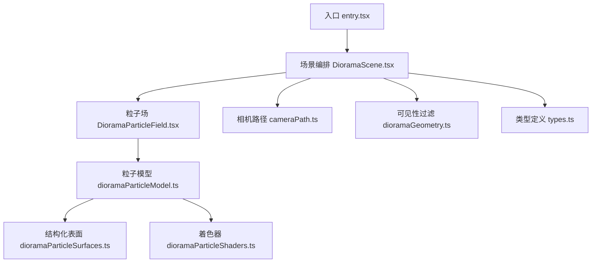
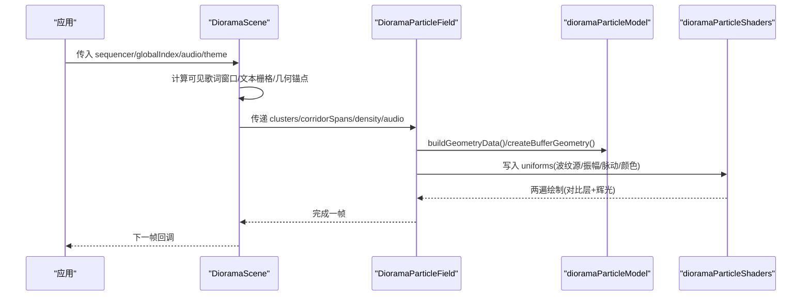
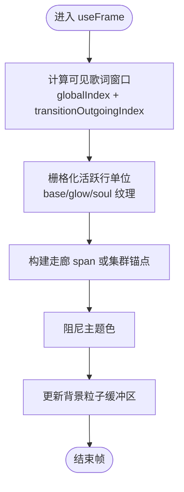
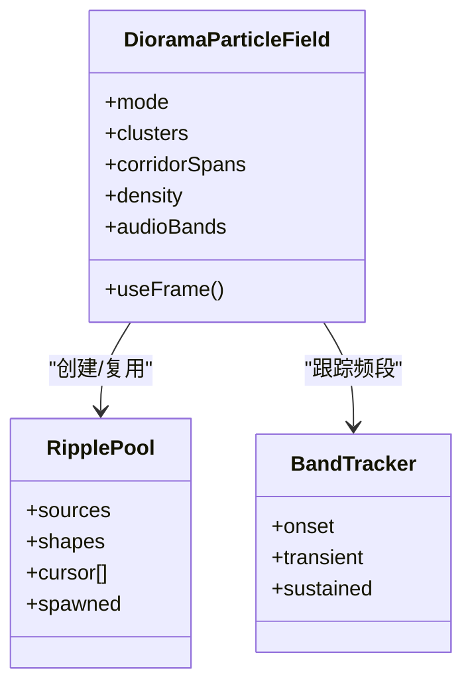
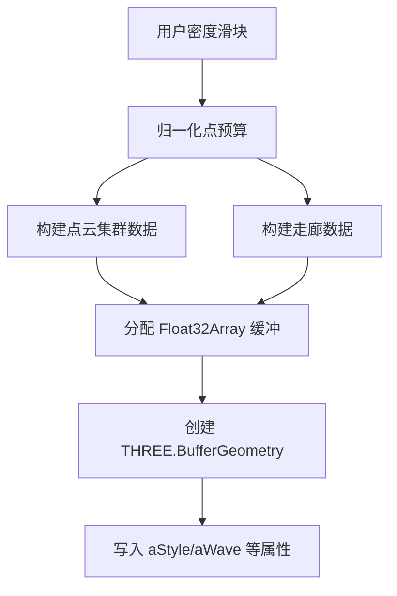
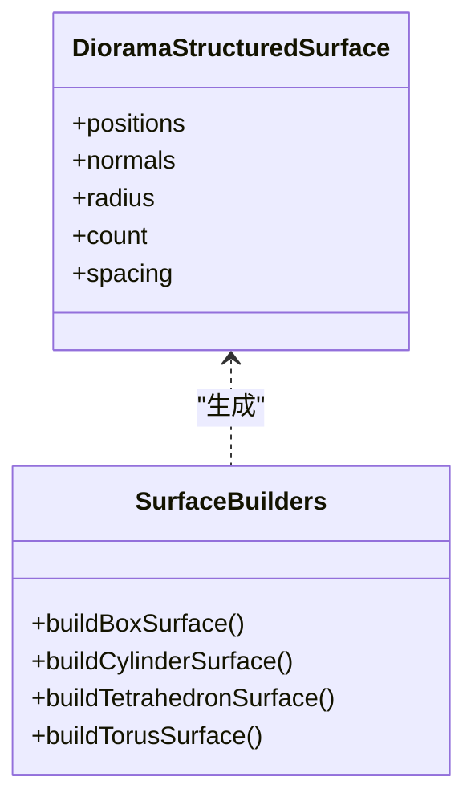
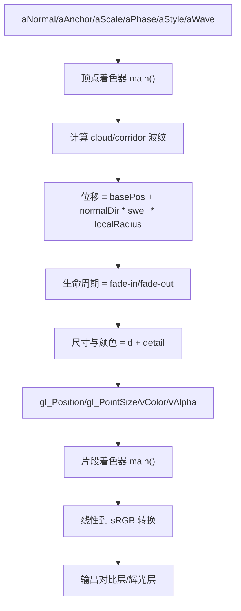
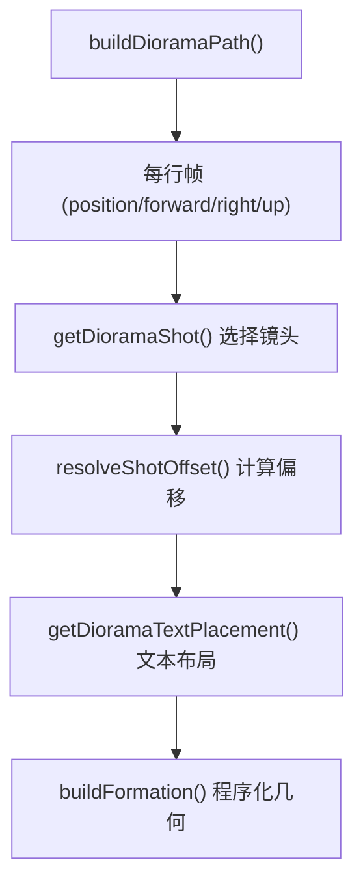
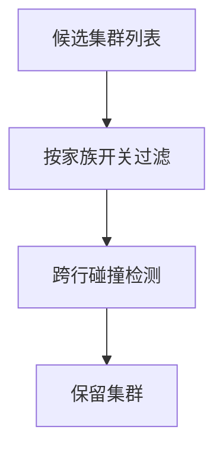
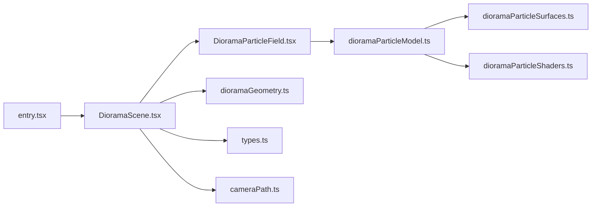

# 3D场景构建

<cite>
**本文引用的文件**   
- [entry.tsx](file://src/components/visualizer/diorama/entry.tsx)
- [DioramaScene.tsx](file://src/components/visualizer/diorama/DioramaScene.tsx)
- [DioramaParticleField.tsx](file://src/components/visualizer/diorama/DioramaParticleField.tsx)
- [dioramaGeometry.ts](file://src/components/visualizer/diorama/dioramaGeometry.ts)
- [dioramaParticleModel.ts](file://src/components/visualizer/diorama/dioramaParticleModel.ts)
- [dioramaParticleShaders.ts](file://src/components/visualizer/diorama/dioramaParticleShaders.ts)
- [dioramaParticleSurfaces.ts](file://src/components/visualizer/diorama/dioramaParticleSurfaces.ts)
- [cameraPath.ts](file://src/components/visualizer/diorama/cameraPath.ts)
- [types.ts](file://src/types.ts)
</cite>

## 目录
1. [引言](#引言)
2. [项目结构](#项目结构)
3. [核心组件](#核心组件)
4. [架构总览](#架构总览)
5. [详细组件分析](#详细组件分析)
6. [依赖关系分析](#依赖关系分析)
7. [性能与优化](#性能与优化)
8. [故障排查指南](#故障排查指南)
9. [结论](#结论)
10. [附录：扩展与调优实践](#附录扩展与调优实践)

## 引言
本文件面向 Diorama 模式的 3D 场景构建系统，目标是帮助开发者理解并扩展该模式下的场景层次、几何体管理、光照与材质、视锥剔除与 LOD、渲染批次与 GPU 资源分配机制，并提供自定义场景元素与性能调优的最佳实践。

Diorama 是一个“程序化歌词走廊”可视化模式：它根据歌词时间轴生成一条三维路径，沿路径布置歌词文本、镜头运动与点云几何；音频能量通过“波纹源”驱动表面位移、颜色与辉光，形成音乐可视化的动态效果。

## 项目结构
Diorama 相关代码集中在 `src/components/visualizer/diorama` 下，采用“入口 + 场景编排 + 粒子场 + 几何模型 + 着色器 + 相机路径”的分层组织方式：

**图表来源**
- [entry.tsx:1-24](file://src/components/visualizer/diorama/entry.tsx#L1-L24)
- [DioramaScene.tsx:1-120](file://src/components/visualizer/diorama/DioramaScene.tsx#L1-L120)
- [DioramaParticleField.tsx:1-70](file://src/components/visualizer/diorama/DioramaParticleField.tsx#L1-L70)
- [dioramaParticleModel.ts:1-75](file://src/components/visualizer/diorama/dioramaParticleModel.ts#L1-L75)
- [dioramaParticleSurfaces.ts:1-45](file://src/components/visualizer/diorama/dioramaParticleSurfaces.ts#L1-L45)
- [dioramaParticleShaders.ts:1-30](file://src/components/visualizer/diorama/dioramaParticleShaders.ts#L1-L30)
- [dioramaGeometry.ts:1-20](file://src/components/visualizer/diorama/dioramaGeometry.ts#L1-L20)
- [types.ts:788-814](file://src/types.ts#L788-L814)

**章节来源**
- [entry.tsx:1-24](file://src/components/visualizer/diorama/entry.tsx#L1-L24)

## 核心组件
- 入口注册：将 Diorama 作为可视化模式注册到框架，提供渲染组件与设置面板。
- 场景编排（DioramaScene）：负责歌词窗口、文本栅格化、相机帧、几何体选择、背景粒子与主题色平滑过渡。
- 粒子场（DioramaParticleField）：将音频信号转换为波纹源，更新 GPU uniform，控制两遍渲染（对比层 + 辉光）。
- 几何模型（dioramaParticleModel）：统一两种几何模式（点云集群 / 走廊隧道），计算最大波长、弹性响应与波纹槽位。
- 结构化表面（dioramaParticleSurfaces）：为不同形状（立方体壳、圆柱、四面体、环面）生成焊接且法线连续的点阵。
- 着色器（dioramaParticleShaders）：实现自发光点、波纹传播、细节纹理、颜色渐变与 sRGB 输出转换。
- 相机路径（cameraPath）：生成路径、每行帧、镜头语言、程序化几何布局与生命周期。
- 几何可见性（dioramaGeometry）：按家族开关与跨行碰撞规则筛选点云集群。
- 类型定义（types）：Diorama 几何可见性、默认值等配置接口。

**章节来源**
- [entry.tsx:1-24](file://src/components/visualizer/diorama/entry.tsx#L1-L24)
- [DioramaScene.tsx:1-120](file://src/components/visualizer/diorama/DioramaScene.tsx#L1-L120)
- [DioramaParticleField.tsx:1-70](file://src/components/visualizer/diorama/DioramaParticleField.tsx#L1-L70)
- [dioramaParticleModel.ts:1-75](file://src/components/visualizer/diorama/dioramaParticleModel.ts#L1-L75)
- [dioramaParticleSurfaces.ts:1-45](file://src/components/visualizer/diorama/dioramaParticleSurfaces.ts#L1-L45)
- [dioramaParticleShaders.ts:1-30](file://src/components/visualizer/diorama/dioramaParticleShaders.ts#L1-L30)
- [cameraPath.ts:1-35](file://src/components/visualizer/diorama/cameraPath.ts#L1-L35)
- [dioramaGeometry.ts:1-20](file://src/components/visualizer/diorama/dioramaGeometry.ts#L1-L20)
- [types.ts:788-814](file://src/types.ts#L788-L814)

## 架构总览
Diorama 的渲染管线可概括为：
- 输入：歌词序列、当前全局索引、音频频段、主题色、用户设置。
- 处理：
  - 场景编排计算可见歌词窗口、文本栅格、几何体锚点、背景粒子密度。
  - 粒子场根据音频触发波纹源，更新 uniform。
  - 着色器在 GPU 上执行波纹传播、位移、颜色与尺寸变化。
- 输出：两遍绘制（对比层 + 辉光），配合雾效与生命周期淡入淡出。

**图表来源**
- [DioramaScene.tsx:403-520](file://src/components/visualizer/diorama/DioramaScene.tsx#L403-L520)
- [DioramaParticleField.tsx:169-247](file://src/components/visualizer/diorama/DioramaParticleField.tsx#L169-L247)
- [dioramaParticleModel.ts:115-167](file://src/components/visualizer/diorama/dioramaParticleModel.ts#L115-L167)
- [dioramaParticleShaders.ts:56-109](file://src/components/visualizer/diorama/dioramaParticleShaders.ts#L56-L109)

## 详细组件分析

### 场景编排：DioramaScene
职责：
- 维护可见歌词窗口（当前行前后若干行，过渡期额外挂载离开歌曲的窗口）。
- 将歌词拆分为单位（中文按字、英文按词），进行 Canvas 栅格化，生成基础纹理与辉光纹理。
- 计算每行的世界位置与朝向（基于相机路径帧），并应用字体缩放、关键词着色、渐变跟唱、灵魂出窍等效果。
- 管理背景粒子（mote）密度与缓存，避免主线程卡顿。
- 主题色平滑阻尼，避免切换歌曲或主题时颜色突变。

关键点：
- 使用 React refs 存储 per-frame 数据，避免 React state 引起的重渲染。
- 邻居行纹理增量构建，限制每帧栅格数量，避免歌曲切换时的卡顿。
- 文本生命周期函数确保远端淡入、近端溶解，避免贴脸模糊。

**图表来源**
- [DioramaScene.tsx:508-546](file://src/components/visualizer/diorama/DioramaScene.tsx#L508-L546)
- [DioramaScene.tsx:650-745](file://src/components/visualizer/diorama/DioramaScene.tsx#L650-L745)
- [DioramaScene.tsx:757-800](file://src/components/visualizer/diorama/DioramaScene.tsx#L757-L800)

**章节来源**
- [DioramaScene.tsx:1-120](file://src/components/visualizer/diorama/DioramaScene.tsx#L1-L120)
- [DioramaScene.tsx:508-546](file://src/components/visualizer/diorama/DioramaScene.tsx#L508-L546)
- [DioramaScene.tsx:650-745](file://src/components/visualizer/diorama/DioramaScene.tsx#L650-L745)
- [DioramaScene.tsx:757-800](file://src/components/visualizer/diorama/DioramaScene.tsx#L757-L800)

### 粒子场：DioramaParticleField
职责：
- 根据当前几何模式（clouds/corridor）构建几何数据与 BufferGeometry。
- 维护音频带起音检测器（bass/mid/treble），将 onset 事件转化为波纹源。
- 更新 GPU uniform（时间、振幅、波纹源、脉动、颜色等）。
- 两遍渲染：对比层（主体）与辉光层（叠加）。

关键点：
- 波纹池（RipplePool）固定大小，按频段轮询槽位，避免无限增长。
- 播放时间不连续性（seek/loop）会重置 flowTime 与波纹池，避免未来出生时间导致静止。
- 弹性脉动（spring-damper）让节拍更自然，而非硬切。

**图表来源**
- [DioramaParticleField.tsx:69-93](file://src/components/visualizer/diorama/DioramaParticleField.tsx#L69-L93)
- [DioramaParticleField.tsx:249-362](file://src/components/visualizer/diorama/DioramaParticleField.tsx#L249-L362)

**章节来源**
- [DioramaParticleField.tsx:1-70](file://src/components/visualizer/diorama/DioramaParticleField.tsx#L1-L70)
- [DioramaParticleField.tsx:169-247](file://src/components/visualizer/diorama/DioramaParticleField.tsx#L169-L247)
- [DioramaParticleField.tsx:249-362](file://src/components/visualizer/diorama/DioramaParticleField.tsx#L249-L362)

### 几何模型：dioramaParticleModel
职责：
- 统一两种几何模式的数据结构（positions/normals/anchors/scales/phases/styles/waves）。
- 计算最大允许波数（Nyquist 限制），避免高频波纹产生随机散射。
- 提供弹性响应与脉动目标计算。

关键点：
- 点预算归一化（density slider）保证稳定 tessellation，避免每行前进时重新细分导致的闪烁。
- 波纹槽位数量由频段数 × 每段槽位数推导，避免 CPU/GPU 不一致。

**图表来源**
- [dioramaParticleModel.ts:75-105](file://src/components/visualizer/diorama/dioramaParticleModel.ts#L75-L105)
- [dioramaParticleModel.ts:115-167](file://src/components/visualizer/diorama/dioramaParticleModel.ts#L115-L167)
- [dioramaParticleModel.ts:185-267](file://src/components/visualizer/diorama/dioramaParticleModel.ts#L185-L267)
- [dioramaParticleModel.ts:270-281](file://src/components/visualizer/diorama/dioramaParticleModel.ts#L270-L281)

**章节来源**
- [dioramaParticleModel.ts:1-75](file://src/components/visualizer/diorama/dioramaParticleModel.ts#L1-L75)
- [dioramaParticleModel.ts:75-105](file://src/components/visualizer/diorama/dioramaParticleModel.ts#L75-L105)
- [dioramaParticleModel.ts:115-167](file://src/components/visualizer/diorama/dioramaParticleModel.ts#L115-L167)
- [dioramaParticleModel.ts:185-267](file://src/components/visualizer/diorama/dioramaParticleModel.ts#L185-L267)
- [dioramaParticleModel.ts:270-281](file://src/components/visualizer/diorama/dioramaParticleModel.ts#L270-L281)

### 结构化表面：dioramaParticleSurfaces
职责：
- 为 box/sphere/cone/torus 生成焊接且法线连续的点阵。
- 计算每个表面的半径与间距（spacing），用于后续波数上限约束。

关键点：
- 焊接原则：共享边点坐标完全一致，避免音频位移时撕裂。
- 法线连续性：径向法线随位置平滑变化，避免边缘处法线跳变导致分离。
- 缓存机制：按 kind/budget/stretchKey 缓存表面，减少重复计算。

**图表来源**
- [dioramaParticleSurfaces.ts:20-40](file://src/components/visualizer/diorama/dioramaParticleSurfaces.ts#L20-L40)
- [dioramaParticleSurfaces.ts:107-125](file://src/components/visualizer/diorama/dioramaParticleSurfaces.ts#L107-L125)
- [dioramaParticleSurfaces.ts:127-147](file://src/components/visualizer/diorama/dioramaParticleSurfaces.ts#L127-L147)
- [dioramaParticleSurfaces.ts:154-179](file://src/components/visualizer/diorama/dioramaParticleSurfaces.ts#L154-L179)
- [dioramaParticleSurfaces.ts:181-205](file://src/components/visualizer/diorama/dioramaParticleSurfaces.ts#L181-L205)
- [dioramaParticleSurfaces.ts:207-242](file://src/components/visualizer/diorama/dioramaParticleSurfaces.ts#L207-L242)

**章节来源**
- [dioramaParticleSurfaces.ts:1-45](file://src/components/visualizer/diorama/dioramaParticleSurfaces.ts#L1-L45)
- [dioramaParticleSurfaces.ts:107-125](file://src/components/visualizer/diorama/dioramaParticleSurfaces.ts#L107-L125)
- [dioramaParticleSurfaces.ts:127-147](file://src/components/visualizer/diorama/dioramaParticleSurfaces.ts#L127-L147)
- [dioramaParticleSurfaces.ts:154-179](file://src/components/visualizer/diorama/dioramaParticleSurfaces.ts#L154-L179)
- [dioramaParticleSurfaces.ts:181-205](file://src/components/visualizer/diorama/dioramaParticleSurfaces.ts#L181-L205)
- [dioramaParticleSurfaces.ts:207-242](file://src/components/visualizer/diorama/dioramaParticleSurfaces.ts#L207-L242)

### 着色器：dioramaParticleShaders
职责：
- 顶点着色器：计算波纹位移、整体脉动、生命周期、尺寸与颜色。
- 片段着色器：输出对比层与辉光层，并进行 sRGB 转换。

关键点：
- 波纹包络：exp(-age*decay)*sin(wavelength)，形成弹性波前。
- 走廊接缝：角度差用 atan(sin, cos) 包裹到 [-π, π]，确保周期性闭合。
- Nyquist 限制：uWaveNumberMax 由实际 lattice spacing 推导，避免伪影。
- sRGB 转换：手动线性到 sRGB，避免 ShaderMaterial 未定义 chunk 导致的黑色输出。

**图表来源**
- [dioramaParticleShaders.ts:56-109](file://src/components/visualizer/diorama/dioramaParticleShaders.ts#L56-L109)
- [dioramaParticleShaders.ts:119-173](file://src/components/visualizer/diorama/dioramaParticleShaders.ts#L119-L173)
- [dioramaParticleShaders.ts:210-309](file://src/components/visualizer/diorama/dioramaParticleShaders.ts#L210-L309)
- [dioramaParticleShaders.ts:312-361](file://src/components/visualizer/diorama/dioramaParticleShaders.ts#L312-L361)

**章节来源**
- [dioramaParticleShaders.ts:1-30](file://src/components/visualizer/diorama/dioramaParticleShaders.ts#L1-L30)
- [dioramaParticleShaders.ts:56-109](file://src/components/visualizer/diorama/dioramaParticleShaders.ts#L56-L109)
- [dioramaParticleShaders.ts:119-173](file://src/components/visualizer/diorama/dioramaParticleShaders.ts#L119-L173)
- [dioramaParticleShaders.ts:210-309](file://src/components/visualizer/diorama/dioramaParticleShaders.ts#L210-L309)
- [dioramaParticleShaders.ts:312-361](file://src/components/visualizer/diorama/dioramaParticleShaders.ts#L312-L361)

### 相机路径：cameraPath
职责：
- 生成蜿蜒路径与每行帧（forward/right/up）。
- 为每行选择镜头语言（pushIn/pullBack/orbit/track/crane/swell/spiral/pendulum/flyby/arc/float/glide/hold）。
- 计算文本放置（offset/scale/roll/yaw/look）与程序化几何布局。
- 提供生命周期距离函数（fade-in/dissolve）。

关键点：
- 镜头选择权重受歌词特征（副歌、长音、短音、段落起始）影响，避免重复。
- 文本放置与镜头方向一致，确保文字始终可读。
- 路径步进距离固定，便于走廊与集群对齐。

**图表来源**
- [cameraPath.ts:223-254](file://src/components/visualizer/diorama/cameraPath.ts#L223-L254)
- [cameraPath.ts:531-547](file://src/components/visualizer/diorama/cameraPath.ts#L531-L547)
- [cameraPath.ts:574-694](file://src/components/visualizer/diorama/cameraPath.ts#L574-L694)
- [cameraPath.ts:750-800](file://src/components/visualizer/diorama/cameraPath.ts#L750-L800)

**章节来源**
- [cameraPath.ts:1-35](file://src/components/visualizer/diorama/cameraPath.ts#L1-L35)
- [cameraPath.ts:223-254](file://src/components/visualizer/diorama/cameraPath.ts#L223-L254)
- [cameraPath.ts:531-547](file://src/components/visualizer/diorama/cameraPath.ts#L531-L547)
- [cameraPath.ts:574-694](file://src/components/visualizer/diorama/cameraPath.ts#L574-L694)
- [cameraPath.ts:750-800](file://src/components/visualizer/diorama/cameraPath.ts#L750-L800)

### 几何可见性：dioramaGeometry
职责：
- 按家族开关（strands/blobs/ribbons/rings）过滤几何体。
- 跨行碰撞检测，避免相邻行点云重叠成亮斑。

关键点：
- 仅移除跨行冲突，保留单行内多部件组合。
- 判定纯函数依赖歌曲，不依赖相机位置，避免移动时重排。

**图表来源**
- [dioramaGeometry.ts:17-25](file://src/components/visualizer/diorama/dioramaGeometry.ts#L17-L25)
- [dioramaGeometry.ts:68-86](file://src/components/visualizer/diorama/dioramaGeometry.ts#L68-L86)

**章节来源**
- [dioramaGeometry.ts:1-20](file://src/components/visualizer/diorama/dioramaGeometry.ts#L1-L20)
- [dioramaGeometry.ts:17-25](file://src/components/visualizer/diorama/dioramaGeometry.ts#L17-L25)
- [dioramaGeometry.ts:68-86](file://src/components/visualizer/diorama/dioramaGeometry.ts#L68-L86)

## 依赖关系分析
Diorama 模块内部依赖清晰，外部依赖主要为 Three.js 与 React Three Fiber：

**图表来源**
- [entry.tsx:1-24](file://src/components/visualizer/diorama/entry.tsx#L1-L24)
- [DioramaScene.tsx:1-120](file://src/components/visualizer/diorama/DioramaScene.tsx#L1-L120)
- [DioramaParticleField.tsx:1-70](file://src/components/visualizer/diorama/DioramaParticleField.tsx#L1-L70)
- [dioramaParticleModel.ts:1-75](file://src/components/visualizer/diorama/dioramaParticleModel.ts#L1-L75)
- [dioramaParticleSurfaces.ts:1-45](file://src/components/visualizer/diorama/dioramaParticleSurfaces.ts#L1-L45)
- [dioramaParticleShaders.ts:1-30](file://src/components/visualizer/diorama/dioramaParticleShaders.ts#L1-L30)
- [dioramaGeometry.ts:1-20](file://src/components/visualizer/diorama/dioramaGeometry.ts#L1-L20)
- [types.ts:788-814](file://src/types.ts#L788-L814)

**章节来源**
- [entry.tsx:1-24](file://src/components/visualizer/diorama/entry.tsx#L1-L24)
- [DioramaScene.tsx:1-120](file://src/components/visualizer/diorama/DioramaScene.tsx#L1-L120)
- [DioramaParticleField.tsx:1-70](file://src/components/visualizer/diorama/DioramaParticleField.tsx#L1-L70)
- [dioramaParticleModel.ts:1-75](file://src/components/visualizer/diorama/dioramaParticleModel.ts#L1-L75)
- [dioramaParticleSurfaces.ts:1-45](file://src/components/visualizer/diorama/dioramaParticleSurfaces.ts#L1-L45)
- [dioramaParticleShaders.ts:1-30](file://src/components/visualizer/diorama/dioramaParticleShaders.ts#L1-L30)
- [dioramaGeometry.ts:1-20](file://src/components/visualizer/diorama/dioramaGeometry.ts#L1-L20)
- [types.ts:788-814](file://src/types.ts#L788-L814)

## 性能与优化
- 视锥剔除：粒子场禁用 frustumCulled（frustumCulled={false}），因为点云是全屏氛围层，剔除无意义且可能破坏视觉效果。
- LOD 策略：通过 density 滑块归一化点预算，结合 shader 的 uWaveNumberMax 限制高频波纹，避免高密度下的伪影。
- 渲染批次：两遍绘制（对比层 + 辉光），共用同一 BufferGeometry，减少 GPU 资源。
- 内存管理：纹理与材质在 useEffect 中释放，避免 React 重建导致的泄漏。
- 主线程优化：邻居行纹理增量构建，每帧最多栅格化固定数量，避免歌曲切换卡顿。

[本节为通用性能指导，无需特定文件引用]

## 故障排查指南
常见问题与定位：
- 颜色发黑：检查着色器是否执行 sRGB 转换（dioramaParticleShaders.ts 中的 dioramaLinearToSRGB）。
- 点云撕裂：检查结构化表面是否焊接且法线连续（dioramaParticleSurfaces.ts 中的 radialNormal 与边界处理）。
- 波纹不传播：检查波纹池是否因 seek/loop 重置（DioramaParticleField.tsx 中的 playbackDiscontinuity 分支）。
- 歌词闪烁：检查 per-unit 状态是否因 globalIndex 或 unitCount 变化而重置（DioramaScene.tsx 中的 shouldResetDioramaUnitState）。

**章节来源**
- [dioramaParticleShaders.ts:312-361](file://src/components/visualizer/diorama/dioramaParticleShaders.ts#L312-L361)
- [dioramaParticleSurfaces.ts:87-90](file://src/components/visualizer/diorama/dioramaParticleSurfaces.ts#L87-L90)
- [DioramaParticleField.tsx:270-286](file://src/components/visualizer/diorama/DioramaParticleField.tsx#L270-L286)
- [DioramaScene.tsx:298-303](file://src/components/visualizer/diorama/DioramaScene.tsx#L298-L303)

## 结论
Diorama 模式通过分层架构实现了高性能、高可控性的 3D 歌词走廊可视化。其核心在于：
- 清晰的职责分离（场景编排、粒子场、几何模型、着色器、相机路径）。
- 严格的数学约束（焊接表面、法线连续、Nyquist 限制）。
- 精细的性能优化（增量栅格、固定波纹池、两遍渲染）。
- 可扩展的类型系统（geometryVisibility、tuning 参数）。

开发者可在此基础上添加新的几何体家族、镜头语言或后处理效果，同时保持性能与稳定性。

[本节为总结性内容，无需特定文件引用]

## 附录：扩展与调优实践

### 自定义场景元素添加指南
- 新增几何体家族：
  - 在 dioramaParticleSurfaces.ts 中添加新形状的构建函数，并确保焊接与法线连续。
  - 在 dioramaGeometry.ts 中映射新 kind 到 visibility 开关。
  - 在 cameraPath.ts 的 buildFormation 中添加对应布局逻辑。
- 新增镜头语言：
  - 在 cameraPath.ts 的 SHOT_KINDS 中添加新类型，并在 resolveShotOffset 中实现偏移计算。
  - 调整 computeShotWeights 以控制新镜头的出现概率。
- 新增后处理效果：
  - 在 DioramaParticleField.tsx 中添加新的 pass（如 Bloom、Depth of Field），注意 uniform 同步与资源释放。

### 性能调优最佳实践
- 降低 density 滑块以减少点云数量。
- 关闭不必要的 geometryVisibility 家族（如 rings、ribbons）。
- 调整 particleGlowIntensity 以降低辉光层开销。
- 避免频繁切换歌曲或主题，以减少纹理重建与颜色阻尼开销。

[本节为通用指导，无需特定文件引用]