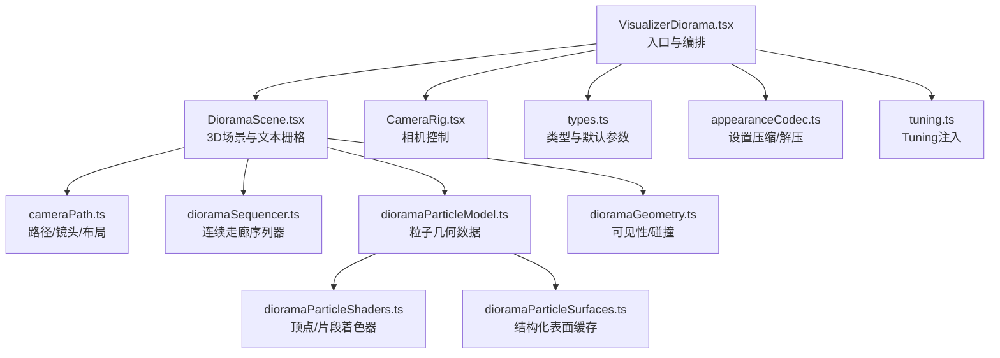
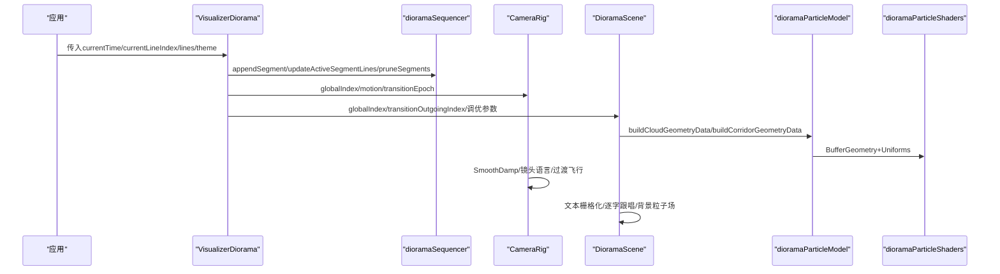
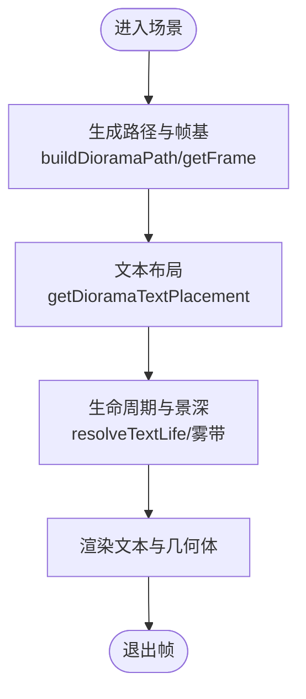
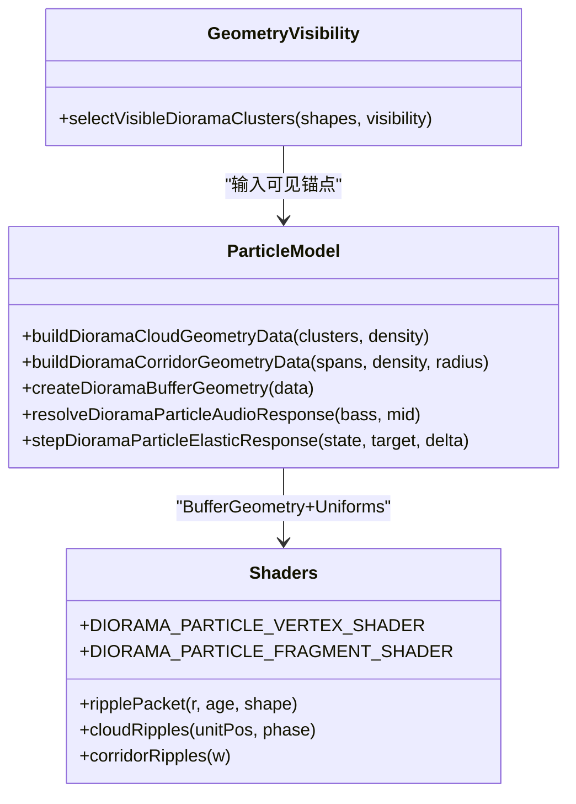
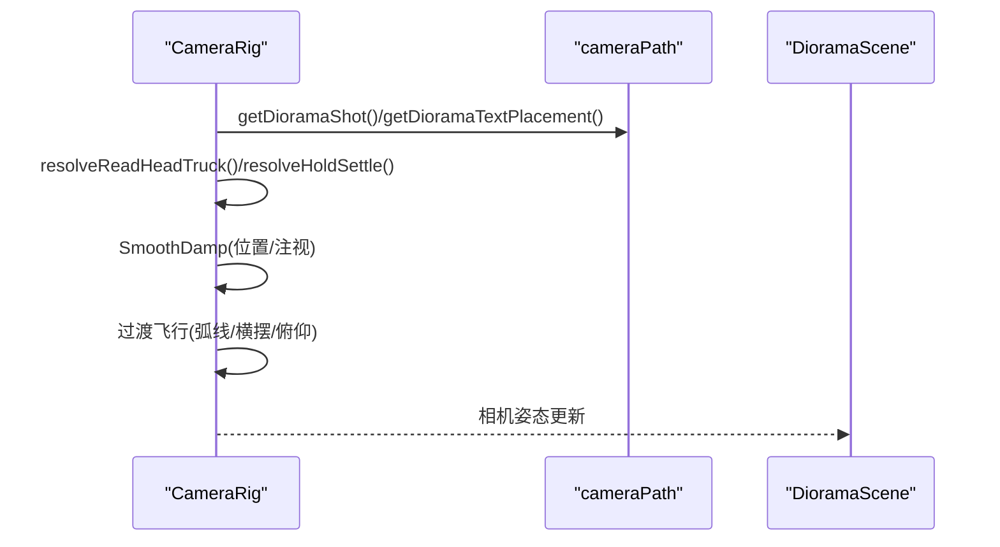
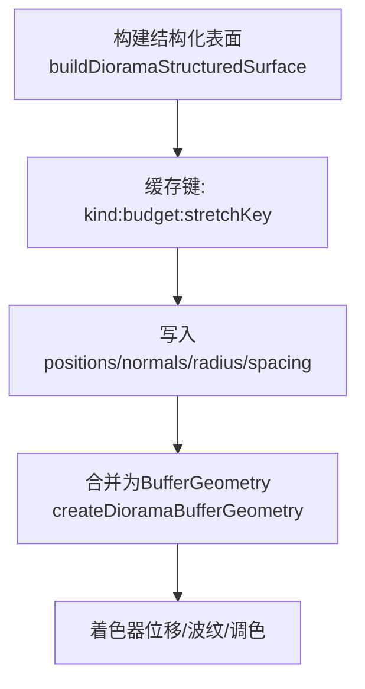
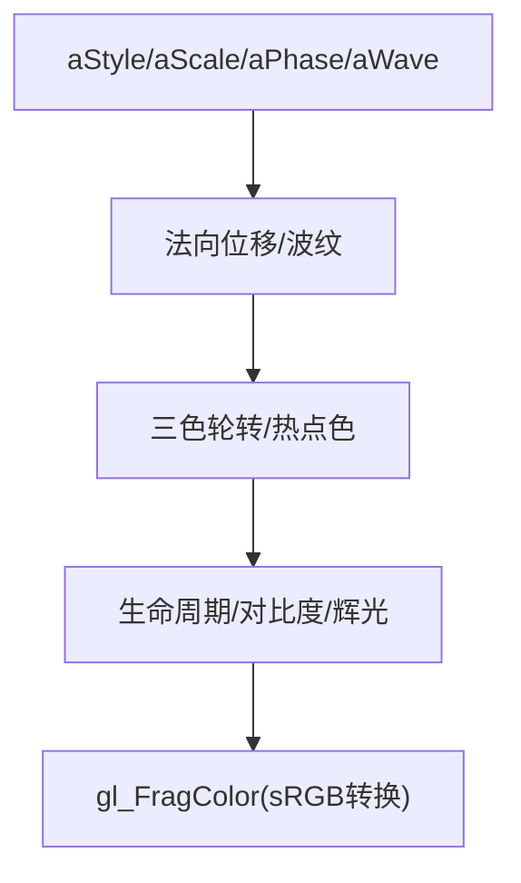
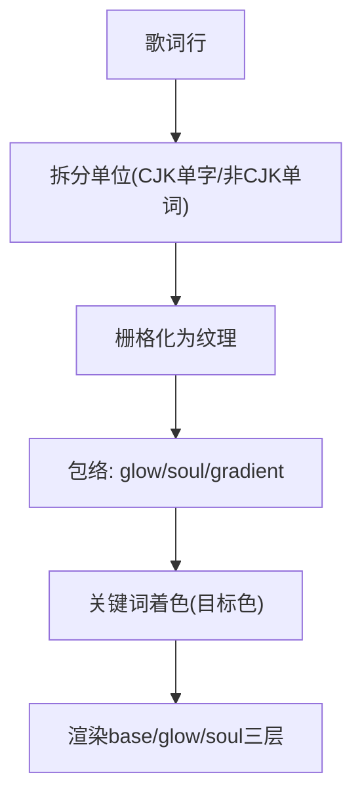
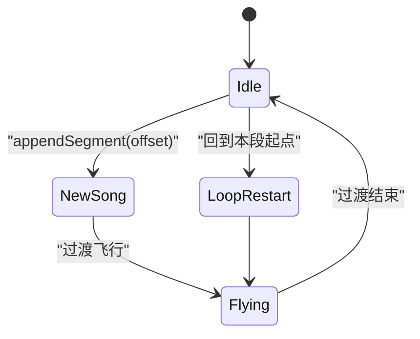
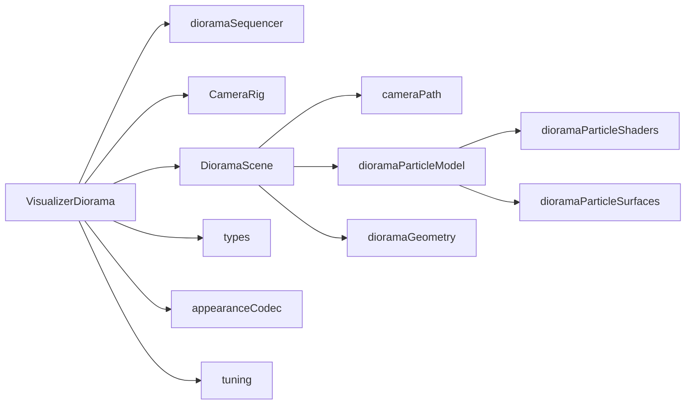

# Diorama模式实现

<cite>
**本文引用的文件**   
- [VisualizerDiorama.tsx](file://src/components/visualizer/diorama/VisualizerDiorama.tsx)
- [DioramaScene.tsx](file://src/components/visualizer/diorama/DioramaScene.tsx)
- [CameraRig.tsx](file://src/components/visualizer/diorama/CameraRig.tsx)
- [cameraPath.ts](file://src/components/visualizer/diorama/cameraPath.ts)
- [dioramaSequencer.ts](file://src/components/visualizer/diorama/dioramaSequencer.ts)
- [dioramaParticleModel.ts](file://src/components/visualizer/diorama/dioramaParticleModel.ts)
- [dioramaParticleShaders.ts](file://src/components/visualizer/diorama/dioramaParticleShaders.ts)
- [dioramaGeometry.ts](file://src/components/visualizer/diorama/dioramaGeometry.ts)
- [dioramaParticleSurfaces.ts](file://src/components/visualizer/diorama/dioramaParticleSurfaces.ts)
- [types.ts](file://src/types.ts)
- [appearanceCodec.ts](file://src/utils/appearanceCodec.ts)
- [tuning.ts](file://src/components/visualizer/diorama/tuning.ts)
</cite>

## 目录
1. [简介](#简介)
2. [项目结构](#项目结构)
3. [核心组件](#核心组件)
4. [架构总览](#架构总览)
5. [详细组件分析](#详细组件分析)
6. [依赖关系分析](#依赖关系分析)
7. [性能与优化](#性能与优化)
8. [故障排查指南](#故障排查指南)
9. [结论](#结论)
10. [附录：自定义扩展指南](#附录自定义扩展指南)

## 简介
本文件为“Diorama（镜台）可视化模式”的完整技术文档。该模式以“沿路径飞行的微缩景观”为核心体验：歌词行被布置在一条程序化生成的三维曲线上，相机跟随阅读进度进行电影式运镜；同时通过粒子系统、几何体生成、光照材质和背景粒子场构建景深与氛围。文档覆盖以下主题：
- 3D场景构建、景深效果与透视变换
- 粒子系统架构（发射器、生命周期、碰撞检测）
- 相机控制系统（路径规划、平滑移动、视角切换）
- 几何体生成算法（程序化建模、网格变形、拓扑优化）
- 光照与材质系统（自发光点、辉光、颜色映射）
- 性能优化策略（视锥剔除、LOD、实例化渲染）
- 自定义场景元素与特效开发指南

## 项目结构
Diorama模式位于可视化子系统中，采用“入口组件 + 场景 + 相机 + 数学工具 + 粒子模型/着色器 + 类型定义”的分层组织方式：
- 入口与编排：VisualizerDiorama.tsx
- 3D场景与文本栅格：DioramaScene.tsx
- 相机控制：CameraRig.tsx
- 路径、镜头语言与布局：cameraPath.ts
- 连续走廊序列器：dioramaSequencer.ts
- 粒子几何与着色器：dioramaParticleModel.ts、dioramaParticleShaders.ts
- 可见性与几何体表面：dioramaGeometry.ts、dioramaParticleSurfaces.ts
- 类型与默认配置：types.ts
- 设置编解码与注入：appearanceCodec.ts、tuning.ts

**图表来源**
- [VisualizerDiorama.tsx:1-498](file://src/components/visualizer/diorama/VisualizerDiorama.tsx#L1-L498)
- [DioramaScene.tsx:1-800](file://src/components/visualizer/diorama/DioramaScene.tsx#L1-L800)
- [CameraRig.tsx:1-437](file://src/components/visualizer/diorama/CameraRig.tsx#L1-L437)
- [cameraPath.ts:1-800](file://src/components/visualizer/diorama/cameraPath.ts#L1-L800)
- [dioramaSequencer.ts:1-154](file://src/components/visualizer/diorama/dioramaSequencer.ts#L1-L154)
- [dioramaParticleModel.ts:1-415](file://src/components/visualizer/diorama/dioramaParticleModel.ts#L1-L415)
- [dioramaParticleShaders.ts:1-361](file://src/components/visualizer/diorama/dioramaParticleShaders.ts#L1-L361)
- [dioramaGeometry.ts:1-87](file://src/components/visualizer/diorama/dioramaGeometry.ts#L1-L87)
- [dioramaParticleSurfaces.ts:42-242](file://src/components/visualizer/diorama/dioramaParticleSurfaces.ts#L42-L242)
- [types.ts:780-979](file://src/types.ts#L780-L979)
- [appearanceCodec.ts:149-183](file://src/utils/appearanceCodec.ts#L149-L183)
- [tuning.ts:1-4](file://src/components/visualizer/diorama/tuning.ts#L1-L4)

**章节来源**
- [VisualizerDiorama.tsx:1-498](file://src/components/visualizer/diorama/VisualizerDiorama.tsx#L1-L498)
- [DioramaScene.tsx:1-800](file://src/components/visualizer/diorama/DioramaScene.tsx#L1-L800)
- [CameraRig.tsx:1-437](file://src/components/visualizer/diorama/CameraRig.tsx#L1-L437)
- [cameraPath.ts:1-800](file://src/components/visualizer/diorama/cameraPath.ts#L1-L800)
- [dioramaSequencer.ts:1-154](file://src/components/visualizer/diorama/dioramaSequencer.ts#L1-L154)
- [dioramaParticleModel.ts:1-415](file://src/components/visualizer/diorama/dioramaParticleModel.ts#L1-L415)
- [dioramaParticleShaders.ts:1-361](file://src/components/visualizer/diorama/dioramaParticleShaders.ts#L1-L361)
- [dioramaGeometry.ts:1-87](file://src/components/visualizer/diorama/dioramaGeometry.ts#L1-L87)
- [dioramaParticleSurfaces.ts:42-242](file://src/components/visualizer/diorama/dioramaParticleSurfaces.ts#L42-L242)
- [types.ts:780-979](file://src/types.ts#L780-L979)
- [appearanceCodec.ts:149-183](file://src/utils/appearanceCodec.ts#L149-L183)
- [tuning.ts:1-4](file://src/components/visualizer/diorama/tuning.ts#L1-L4)

## 核心组件
- VisualizerDiorama.tsx：模式入口，负责歌曲就绪门控、纯音乐占位、过渡状态机、相机与场景的参数下发、字幕叠加。
- DioramaScene.tsx：3D场景主体，负责歌词文本栅格化、逐字跟唱效果、粒子几何选择与窗口管理、背景粒子场、音频响应包络。
- CameraRig.tsx：相机驱动，基于SmoothDamp跟踪阅读头，组合镜头语言、回正对齐、切歌/循环的电影式飞行过渡。
- cameraPath.ts：纯数学库，提供路径生成、帧基、文本布局、镜头语言、读头跟随等。
- dioramaSequencer.ts：连续走廊序列器，将每首歌/每次循环作为一段“走廊”，维护全局索引与裁剪。
- dioramaParticleModel.ts：粒子几何数据构建（云团/隧道）、音频响应、弹性脉冲、波纹源池。
- dioramaParticleShaders.ts：统一自发光点着色器，支持双通道对比度/辉光、波纹位移、色彩映射。
- dioramaGeometry.ts：云团可见性过滤与跨行碰撞避让。
- dioramaParticleSurfaces.ts：结构化表面（立方体/圆柱/四面体/环面）缓存与间距计算。
- types.ts：DioramaTuning、几何可见性等类型与默认值。
- appearanceCodec.ts：Diorama设置的压缩/解压。
- tuning.ts：将DioramaTuning注入到渲染边界。

**章节来源**
- [VisualizerDiorama.tsx:1-498](file://src/components/visualizer/diorama/VisualizerDiorama.tsx#L1-L498)
- [DioramaScene.tsx:1-800](file://src/components/visualizer/diorama/DioramaScene.tsx#L1-L800)
- [CameraRig.tsx:1-437](file://src/components/visualizer/diorama/CameraRig.tsx#L1-L437)
- [cameraPath.ts:1-800](file://src/components/visualizer/diorama/cameraPath.ts#L1-L800)
- [dioramaSequencer.ts:1-154](file://src/components/visualizer/diorama/dioramaSequencer.ts#L1-L154)
- [dioramaParticleModel.ts:1-415](file://src/components/visualizer/diorama/dioramaParticleModel.ts#L1-L415)
- [dioramaParticleShaders.ts:1-361](file://src/components/visualizer/diorama/dioramaParticleShaders.ts#L1-L361)
- [dioramaGeometry.ts:1-87](file://src/components/visualizer/diorama/dioramaGeometry.ts#L1-L87)
- [dioramaParticleSurfaces.ts:42-242](file://src/components/visualizer/diorama/dioramaParticleSurfaces.ts#L42-L242)
- [types.ts:780-979](file://src/types.ts#L780-L979)
- [appearanceCodec.ts:149-183](file://src/utils/appearanceCodec.ts#L149-L183)
- [tuning.ts:1-4](file://src/components/visualizer/diorama/tuning.ts#L1-L4)

## 架构总览
Diorama模式的整体流程如下：
- 入口组件根据当前歌曲与歌词准备“已提交”的数据，处理纯音乐占位与就绪门控。
- 使用序列器将每首歌/每次循环挂载为一段“走廊”，并分配世界坐标偏移。
- 相机在每个帧中根据阅读进度与镜头语言计算目标姿态，执行平滑跟随与过渡飞行。
- 场景侧按全局索引窗口挂载歌词平面与几何体，完成文本栅格化、逐字跟唱、粒子几何与背景粒子场。
- 粒子系统由CPU端构建BufferGeometry，GPU端着色器执行波纹位移、辉光与调色。

**图表来源**
- [VisualizerDiorama.tsx:100-498](file://src/components/visualizer/diorama/VisualizerDiorama.tsx#L100-L498)
- [dioramaSequencer.ts:71-154](file://src/components/visualizer/diorama/dioramaSequencer.ts#L71-L154)
- [CameraRig.tsx:164-437](file://src/components/visualizer/diorama/CameraRig.tsx#L164-L437)
- [DioramaScene.tsx:403-800](file://src/components/visualizer/diorama/DioramaScene.tsx#L403-L800)
- [dioramaParticleModel.ts:115-281](file://src/components/visualizer/diorama/dioramaParticleModel.ts#L115-L281)
- [dioramaParticleShaders.ts:56-361](file://src/components/visualizer/diorama/dioramaParticleShaders.ts#L56-L361)

## 详细组件分析

### 3D场景构建、景深与透视变换
- 路径与帧基：cameraPath.ts中的buildDioramaPath生成蜿蜒路径，并为每行歌词提供forward/right/up局部帧，保证文本朝向与相机运动一致。
- 文本布局：getDioramaTextPlacement为每行歌词提供偏移、缩放、滚转、偏航与构图看距，使文字不在中心线死板排列。
- 透视与视口：CameraRig使用透视相机FOV与宽高比计算可视半宽，确保读头跟随truck不会让歌词出画。
- 景深与生命周期：DioramaScene对文本与几何体分别定义淡入/淡出距离带，配合雾效避免近处穿屏与远处闪烁。

**图表来源**
- [cameraPath.ts:217-254](file://src/components/visualizer/diorama/cameraPath.ts#L217-L254)
- [cameraPath.ts:321-340](file://src/components/visualizer/diorama/cameraPath.ts#L321-L340)
- [DioramaScene.tsx:309-327](file://src/components/visualizer/diorama/DioramaScene.tsx#L309-L327)

**章节来源**
- [cameraPath.ts:217-254](file://src/components/visualizer/diorama/cameraPath.ts#L217-L254)
- [cameraPath.ts:321-340](file://src/components/visualizer/diorama/cameraPath.ts#L321-L340)
- [DioramaScene.tsx:309-327](file://src/components/visualizer/diorama/DioramaScene.tsx#L309-L327)

### 粒子系统架构（发射器、生命周期、碰撞检测）
- 几何数据构建：dioramaParticleModel.ts提供两种模式——“云团”（per-line formations）与“隧道”（path tunnel），共享统一属性布局。
- 波纹与音频响应：每个频段（bass/mid/treble）产生独立的波纹源，GPU着色器中按距离衰减与时间演化形成弹性波前。
- 生命周期：粒子在远端淡入、近端溶解，并通过uFormation/uScatter在歌曲切换时整体消散/聚合。
- 碰撞检测：dioramaGeometry.ts对云团进行跨行碰撞避让，避免不同歌词行的独立云团重叠成亮斑。

**图表来源**
- [dioramaParticleModel.ts:115-281](file://src/components/visualizer/diorama/dioramaParticleModel.ts#L115-L281)
- [dioramaParticleShaders.ts:56-361](file://src/components/visualizer/diorama/dioramaParticleShaders.ts#L56-L361)
- [dioramaGeometry.ts:68-86](file://src/components/visualizer/diorama/dioramaGeometry.ts#L68-L86)

**章节来源**
- [dioramaParticleModel.ts:115-281](file://src/components/visualizer/diorama/dioramaParticleModel.ts#L115-L281)
- [dioramaParticleShaders.ts:56-361](file://src/components/visualizer/diorama/dioramaParticleShaders.ts#L56-L361)
- [dioramaGeometry.ts:68-86](file://src/components/visualizer/diorama/dioramaGeometry.ts#L68-L86)

### 相机控制系统（路径规划、平滑移动、视角切换）
- 路径规划：cameraPath.ts生成路径与帧基，CameraRig在每帧读取当前行帧，计算读头位置与镜头偏移。
- 平滑移动：使用critically-damped SmoothDamp跟踪目标，避免硬切抖动；在切歌/循环时延长smoothTime并施加弧形轨迹。
- 视角切换：镜头语言（pushIn/pullBack/orbit/track/crane/swell/spiral/pendulum/flyby/arc/float/glide/hold）决定相机相对文本的offset；回正机制保证歌词可读性。

**图表来源**
- [CameraRig.tsx:164-437](file://src/components/visualizer/diorama/CameraRig.tsx#L164-L437)
- [cameraPath.ts:531-694](file://src/components/visualizer/diorama/cameraPath.ts#L531-L694)

**章节来源**
- [CameraRig.tsx:164-437](file://src/components/visualizer/diorama/CameraRig.tsx#L164-L437)
- [cameraPath.ts:531-694](file://src/components/visualizer/diorama/cameraPath.ts#L531-L694)

### 几何体生成算法（程序化建模、网格变形、拓扑优化）
- 程序化建模：dioramaParticleSurfaces.ts生成box/sphere/cone/torus的结构化表面，缓存相同stretchKey的网格以减少重复计算。
- 网格变形：dioramaParticleShaders.ts在顶点着色器中对基础形状进行法向位移，波纹位移幅度以本地半径归一化，避免小形体与大形体不一致。
- 拓扑优化：dioramaParticleModel.ts根据实际点阵间距计算最大波数上限，防止波长过短导致相邻点相位相反产生的散乱伪影。

**图表来源**
- [dioramaParticleSurfaces.ts:207-242](file://src/components/visualizer/diorama/dioramaParticleSurfaces.ts#L207-L242)
- [dioramaParticleModel.ts:270-281](file://src/components/visualizer/diorama/dioramaParticleModel.ts#L270-L281)
- [dioramaParticleShaders.ts:210-309](file://src/components/visualizer/diorama/dioramaParticleShaders.ts#L210-L309)

**章节来源**
- [dioramaParticleSurfaces.ts:207-242](file://src/components/visualizer/diorama/dioramaParticleSurfaces.ts#L207-L242)
- [dioramaParticleModel.ts:270-281](file://src/components/visualizer/diorama/dioramaParticleModel.ts#L270-L281)
- [dioramaParticleShaders.ts:210-309](file://src/components/visualizer/diorama/dioramaParticleShaders.ts#L210-L309)

### 光照与材质系统（自发光点、反射折射与环境贴图）
- 自发光点：粒子着色器输出两通道——对比度层（接近不透明圆盘）与辉光层（加法软晕），亮度随波纹位移强度变化。
- 颜色映射：基于primary/accent/secondary三色轮转，活跃区域偏向accent/secondary，光谱质心影响热点色。
- 环境贴图/反射折射：未实现传统PBR反射折射；通过自发光与颜色映射模拟能量感与层次。

**图表来源**
- [dioramaParticleShaders.ts:210-361](file://src/components/visualizer/diorama/dioramaParticleShaders.ts#L210-L361)

**章节来源**
- [dioramaParticleShaders.ts:210-361](file://src/components/visualizer/diorama/dioramaParticleShaders.ts#L210-L361)

### 歌词文本与逐字跟唱
- 文本栅格化：DioramaScene将歌词按词或单字拆分为单位，使用浏览器字体栈绘制到离屏Canvas，再转为纹理。
- 逐字跟唱：active line的单位拥有独立的光照/灵魂/渐变包络，未唱单位较暗，正在唱的单位高亮并带辉光，已完成单位恢复明亮底色。
- 关键字着色：根据theme.wordColors匹配关键词范围，将follow-sing目标色设为强调色，隐藏直到演唱到达。

**图表来源**
- [DioramaScene.tsx:650-755](file://src/components/visualizer/diorama/DioramaScene.tsx#L650-L755)
- [DioramaScene.tsx:703-724](file://src/components/visualizer/diorama/DioramaScene.tsx#L703-L724)

**章节来源**
- [DioramaScene.tsx:650-755](file://src/components/visualizer/diorama/DioramaScene.tsx#L650-L755)
- [DioramaScene.tsx:703-724](file://src/components/visualizer/diorama/DioramaScene.tsx#L703-L724)

### 连续走廊与过渡（切歌/单曲循环无缝衔接）
- 走廊段：每首歌/每次循环作为一段走廊，具有唯一key、seed、round、globalStart、span与placementOrigin。
- 过渡飞行：切歌或循环重启时，新走廊在世界空间中远离旧走廊，相机从旧姿态飞向新走廊的跟随姿态，期间保持两段场景共存。
- 裁剪：按全局索引窗口裁剪走廊，保留即将离开的走廊直至过渡结束。

**图表来源**
- [dioramaSequencer.ts:71-154](file://src/components/visualizer/diorama/dioramaSequencer.ts#L71-L154)
- [VisualizerDiorama.tsx:265-386](file://src/components/visualizer/diorama/VisualizerDiorama.tsx#L265-L386)

**章节来源**
- [dioramaSequencer.ts:71-154](file://src/components/visualizer/diorama/dioramaSequencer.ts#L71-L154)
- [VisualizerDiorama.tsx:265-386](file://src/components/visualizer/diorama/VisualizerDiorama.tsx#L265-L386)

## 依赖关系分析
- 入口依赖：VisualizerDiorama依赖runtime、sequencer、transition、cameraPath、scene、subtitle overlay。
- 场景依赖：DioramaScene依赖cameraPath、sequencer、text raster、particle corridor、mote field、keyword color。
- 粒子依赖：dioramaParticleModel依赖cameraPath、bandOnsetTracker、surfaces；着色器依赖model提供的uniforms。
- 类型依赖：types.ts集中DioramaTuning与默认值，appearanceCodec用于设置序列化，tuning.ts注入到渲染边界。

**图表来源**
- [VisualizerDiorama.tsx:1-498](file://src/components/visualizer/diorama/VisualizerDiorama.tsx#L1-L498)
- [DioramaScene.tsx:1-800](file://src/components/visualizer/diorama/DioramaScene.tsx#L1-L800)
- [dioramaParticleModel.ts:1-415](file://src/components/visualizer/diorama/dioramaParticleModel.ts#L1-L415)
- [dioramaParticleShaders.ts:1-361](file://src/components/visualizer/diorama/dioramaParticleShaders.ts#L1-L361)
- [dioramaGeometry.ts:1-87](file://src/components/visualizer/diorama/dioramaGeometry.ts#L1-L87)
- [dioramaParticleSurfaces.ts:42-242](file://src/components/visualizer/diorama/dioramaParticleSurfaces.ts#L42-L242)
- [types.ts:780-979](file://src/types.ts#L780-L979)
- [appearanceCodec.ts:149-183](file://src/utils/appearanceCodec.ts#L149-L183)
- [tuning.ts:1-4](file://src/components/visualizer/diorama/tuning.ts#L1-L4)

**章节来源**
- [VisualizerDiorama.tsx:1-498](file://src/components/visualizer/diorama/VisualizerDiorama.tsx#L1-L498)
- [DioramaScene.tsx:1-800](file://src/components/visualizer/diorama/DioramaScene.tsx#L1-L800)
- [dioramaParticleModel.ts:1-415](file://src/components/visualizer/diorama/dioramaParticleModel.ts#L1-L415)
- [dioramaParticleShaders.ts:1-361](file://src/components/visualizer/diorama/dioramaParticleShaders.ts#L1-L361)
- [dioramaGeometry.ts:1-87](file://src/components/visualizer/diorama/dioramaGeometry.ts#L1-L87)
- [dioramaParticleSurfaces.ts:42-242](file://src/components/visualizer/diorama/dioramaParticleSurfaces.ts#L42-L242)
- [types.ts:780-979](file://src/types.ts#L780-L979)
- [appearanceCodec.ts:149-183](file://src/utils/appearanceCodec.ts#L149-L183)
- [tuning.ts:1-4](file://src/components/visualizer/diorama/tuning.ts#L1-L4)

## 性能与优化
- 视锥剔除：通过全局索引窗口（mountedIndices）仅挂载附近歌词行与几何体，远距离对象自然不可见。
- LOD系统：粒子密度与规模受DioramaTuning.particleDensity/particleScale限制，结构化表面按stretchKey缓存，减少重复构建。
- 实例化渲染：所有粒子使用单一BufferGeometry与着色器，通过样式属性区分族类与颜色槽，降低draw call数量。
- 文本栅格增量构建：邻居行纹理分批次异步构建，避免歌曲切换时的主线程卡顿。
- 颜色阻尼：主题颜色每帧指数平滑追赶目标，避免主题/AI主题切换时的跳变。
- 音频响应包络：fast-attack/slow-release包络避免FFT瞬时值导致的闪烁。

[本节为通用性能指导，无需具体文件引用]

## 故障排查指南
- 歌词加载延迟导致空场景：入口组件有就绪门控与纯音乐占位逻辑，若长时间无歌词会触发instrumental走廊；检查READY_GRACE_MS与INSTRUMENTAL_COMMIT_SECONDS相关逻辑。
- 歌词晚到导致硬切：updateActiveSegmentLines会在原地重建走廊几何，避免二次走廊与相机硬切；确认linesEpoch是否递增。
- 歌词错位或NaN颜色：shouldResetDioramaUnitState在活跃全局行变化或单位长度变化时重置包络数组；检查activeLineUnits与unitLightValsRef/unitSoulValsRef分配。
- 粒子闪烁或散乱：检查uWaveNumberMax与buffer spacing关系，避免波长小于4个采样点；确认波纹源池长度与RIPPLE_COUNT一致。
- 隧道接缝问题：着色器中角度差通过corridorSurfaceDelta包裹至[-π, π]，空闲与细节函数使用整数谐波闭合，避免接缝撕裂。

**章节来源**
- [VisualizerDiorama.tsx:143-198](file://src/components/visualizer/diorama/VisualizerDiorama.tsx#L143-L198)
- [dioramaSequencer.ts:105-122](file://src/components/visualizer/diorama/dioramaSequencer.ts#L105-L122)
- [DioramaScene.tsx:282-303](file://src/components/visualizer/diorama/DioramaScene.tsx#L282-L303)
- [dioramaParticleModel.ts:83-92](file://src/components/visualizer/diorama/dioramaParticleModel.ts#L83-L92)
- [dioramaParticleShaders.ts:149-159](file://src/components/visualizer/diorama/dioramaParticleShaders.ts#L149-L159)

## 结论
Diorama模式通过“路径+镜头语言+粒子几何+文本栅格”的组合，实现了流畅的微缩景观体验。其关键优势在于：
- 连续走廊与无缝过渡消除了切歌/循环的黑屏与硬切。
- 统一的粒子几何与着色器保证了视觉一致性与高性能。
- 可调的DioramaTuning与主题动画强度提供了丰富的风格空间。
- 文本栅格与逐字跟唱确保了多脚本与字体栈的完美呈现。

[本节为总结性内容，无需具体文件引用]

## 附录：自定义扩展指南
- 新增镜头语言：在cameraPath.ts的SHOT_KINDS与resolveShotOffset中添加新的镜头类型，并在CameraRig中适配回正与对齐天花板。
- 新增几何体家族：在dioramaParticleSurfaces.ts中实现新的结构化表面（如棱柱/螺旋），并在dioramaGeometry.ts中注册可见性开关。
- 调整粒子波纹：在dioramaParticleModel.ts中扩展RIPPLE_BANDS或RIPPLE_SLOTS_PER_BAND，并在着色器中对应修改uniform数组长度。
- 自定义背景粒子场：在DioramaScene.tsx中调整backgroundParticleCircumference/backgroundParticleRadial，或扩展moteField逻辑。
- 扩展逐字效果：在DioramaScene.tsx中增加新的单位包络（如轮廓描边、阴影拖尾），并确保与keywordColoringEnabled兼容。
- 设置项扩展：在types.ts中扩展DioramaTuning，并在appearanceCodec.ts中补充compressDiorama/decompressDiorama字段。

**章节来源**
- [cameraPath.ts:359-362](file://src/components/visualizer/diorama/cameraPath.ts#L359-L362)
- [cameraPath.ts:574-694](file://src/components/visualizer/diorama/cameraPath.ts#L574-L694)
- [dioramaParticleSurfaces.ts:207-242](file://src/components/visualizer/diorama/dioramaParticleSurfaces.ts#L207-L242)
- [dioramaGeometry.ts:17-25](file://src/components/visualizer/diorama/dioramaGeometry.ts#L17-L25)
- [dioramaParticleModel.ts:306-328](file://src/components/visualizer/diorama/dioramaParticleModel.ts#L306-L328)
- [DioramaScene.tsx:621-643](file://src/components/visualizer/diorama/DioramaScene.tsx#L621-L643)
- [types.ts:841-898](file://src/types.ts#L841-L898)
- [appearanceCodec.ts:149-183](file://src/utils/appearanceCodec.ts#L149-L183)