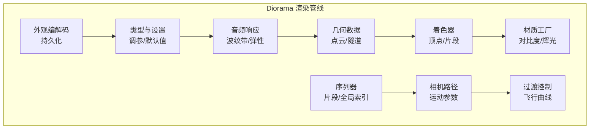
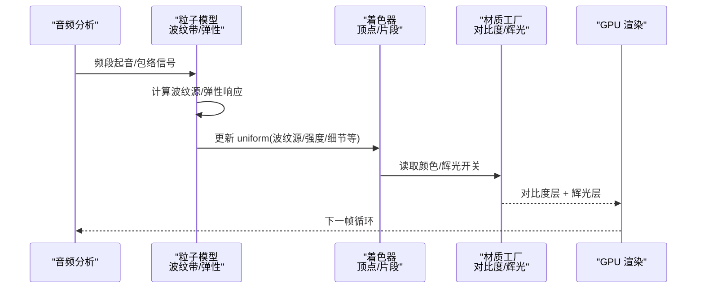
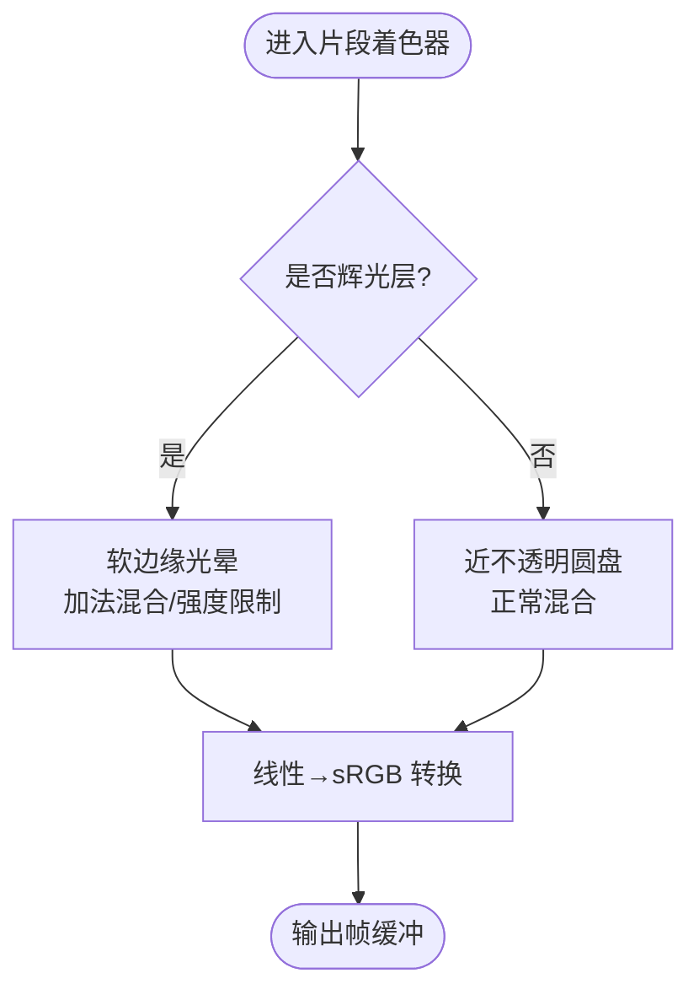
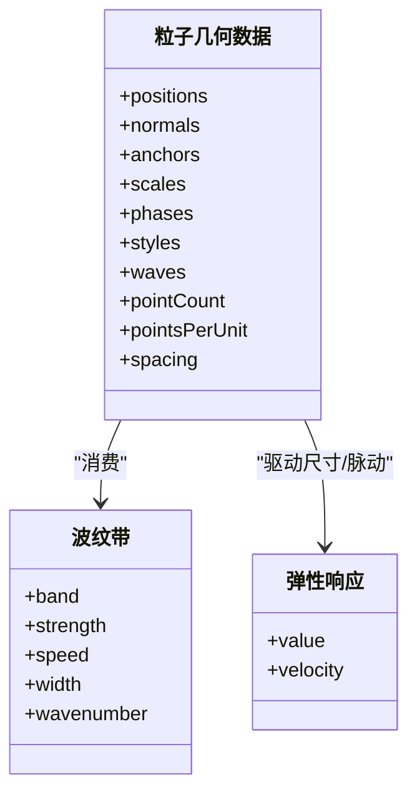
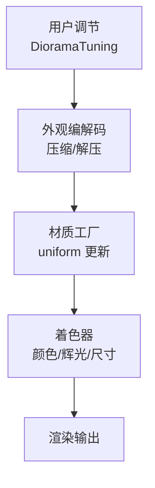
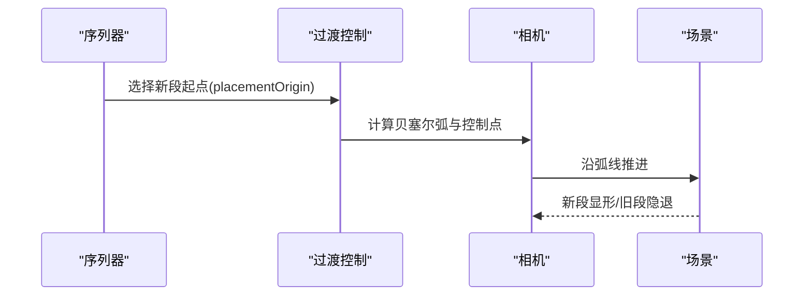
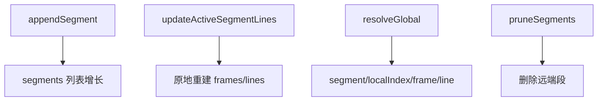
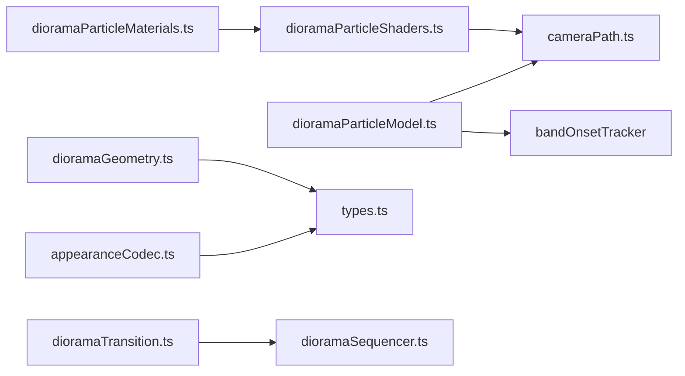

# 光照与材质

<cite>
**本文引用的文件**   
- [dioramaParticleShaders.ts](file://src/components/visualizer/diorama/dioramaParticleShaders.ts)
- [dioramaParticleMaterials.ts](file://src/components/visualizer/diorama/dioramaParticleMaterials.ts)
- [dioramaParticleModel.ts](file://src/components/visualizer/diorama/dioramaParticleModel.ts)
- [dioramaGeometry.ts](file://src/components/visualizer/diorama/dioramaGeometry.ts)
- [dioramaTransition.ts](file://src/components/visualizer/diorama/dioramaTransition.ts)
- [dioramaSequencer.ts](file://src/components/visualizer/diorama/dioramaSequencer.ts)
- [cameraPath.ts](file://src/components/visualizer/diorama/cameraPath.ts)
- [types.ts](file://src/types.ts)
- [appearanceCodec.ts](file://src/utils/appearanceCodec.ts)
- [settingsPanels.tsx](file://src/components/visualizer/settingsPanels.tsx)
- [lightFieldShader.ts](file://src/components/visualizer/lumiere/light/lightFieldShader.ts)
</cite>

## 目录
1. [引言](#引言)
2. [项目结构](#项目结构)
3. [核心组件](#核心组件)
4. [架构总览](#架构总览)
5. [详细组件分析](#详细组件分析)
6. [依赖关系分析](#依赖关系分析)
7. [性能考虑](#性能考虑)
8. [故障排查指南](#故障排查指南)
9. [结论](#结论)
10. [附录](#附录)

## 引言
本文件面向 Diorama 模式的光照与材质系统，聚焦以下目标：
- 解释当前实现中的“自发光点云”光照模型（无传统环境光/方向光/点光源），并说明如何通过颜色、辉光与对比度策略达到可读性与视觉层次。
- 阐述粒子几何与着色器管线：顶点位移、波纹响应、尺寸与颜色混合、sRGB 输出。
- 说明材质参数绑定、实时调节与状态同步机制。
- 梳理过渡效果系统（切歌飞行、淡入淡出、形状变换）与时间轴控制（全局索引、片段序列）。
- 提供调试、预览与性能优化建议，以及自定义着色器的最佳实践。

注意：本项目未实现标准 PBR 材质（漫反射/镜面反射/金属度工作流），Diorama 使用自发光粒子与后处理式辉光层。

## 项目结构
Diorama 可视化相关代码集中在 visualizer/diorama 子目录，关键模块职责如下：
- 着色器与材质：顶点/片段着色器、材质工厂、颜色对比度适配。
- 几何与数据：点云几何构建、可见性裁剪、波纹带与音频响应。
- 相机与过渡：路径帧、运动参数、切歌飞行曲线。
- 序列与时间轴：多段走廊拼接、全局行索引、片段修剪。
- 类型与设置：调参接口、默认值、压缩/解压、UI 面板。

**图表来源**
- [dioramaParticleShaders.ts:56-360](file://src/components/visualizer/diorama/dioramaParticleShaders.ts#L56-L360)
- [dioramaParticleMaterials.ts:117-178](file://src/components/visualizer/diorama/dioramaParticleMaterials.ts#L117-L178)
- [dioramaParticleModel.ts:114-281](file://src/components/visualizer/diorama/dioramaParticleModel.ts#L114-L281)
- [dioramaTransition.ts:15-102](file://src/components/visualizer/diorama/dioramaTransition.ts#L15-L102)
- [dioramaSequencer.ts:26-153](file://src/components/visualizer/diorama/dioramaSequencer.ts#L26-L153)
- [cameraPath.ts:143-193](file://src/components/visualizer/diorama/cameraPath.ts#L143-L193)
- [types.ts:780-898](file://src/types.ts#L780-L898)
- [appearanceCodec.ts:149-204](file://src/utils/appearanceCodec.ts#L149-L204)

**章节来源**
- [dioramaParticleShaders.ts:56-360](file://src/components/visualizer/diorama/dioramaParticleShaders.ts#L56-L360)
- [dioramaParticleMaterials.ts:117-178](file://src/components/visualizer/diorama/dioramaParticleMaterials.ts#L117-L178)
- [dioramaParticleModel.ts:114-281](file://src/components/visualizer/diorama/dioramaParticleModel.ts#L114-L281)
- [dioramaTransition.ts:15-102](file://src/components/visualizer/diorama/dioramaTransition.ts#L15-L102)
- [dioramaSequencer.ts:26-153](file://src/components/visualizer/diorama/dioramaSequencer.ts#L26-L153)
- [cameraPath.ts:143-193](file://src/components/visualizer/diorama/cameraPath.ts#L143-L193)
- [types.ts:780-898](file://src/types.ts#L780-L898)
- [appearanceCodec.ts:149-204](file://src/utils/appearanceCodec.ts#L149-L204)

## 核心组件
- 着色器与材质
  - 顶点着色器负责位移、尺寸、颜色混合与 sRGB 转换前的计算。
  - 片段着色器负责软盘/辉光两层的合成与 sRGB 输出。
  - 材质工厂创建对比度层与辉光层，统一 uniform 布局。
- 几何与数据
  - 点云几何按密度预算生成，支持“云团”和“隧道”两种模式。
  - 波纹带将低频到高频的音频能量映射为不同速度/宽度/波数的脉冲。
- 相机与过渡
  - 相机运动由主题强度与用户调参共同决定；切歌时通过贝塞尔弧线平滑飞行。
- 序列与时间轴
  - 每首歌作为一段走廊，世界坐标拼接；全局行索引保证跨片段定位。
- 类型与设置
  - DioramaTuning 定义所有可调参数；appearanceCodec 负责压缩/解压与默认值回退。

**章节来源**
- [dioramaParticleShaders.ts:56-360](file://src/components/visualizer/diorama/dioramaParticleShaders.ts#L56-L360)
- [dioramaParticleMaterials.ts:117-178](file://src/components/visualizer/diorama/dioramaParticleMaterials.ts#L117-L178)
- [dioramaParticleModel.ts:114-281](file://src/components/visualizer/diorama/dioramaParticleModel.ts#L114-L281)
- [dioramaTransition.ts:15-102](file://src/components/visualizer/diorama/dioramaTransition.ts#L15-L102)
- [dioramaSequencer.ts:26-153](file://src/components/visualizer/diorama/dioramaSequencer.ts#L26-L153)
- [types.ts:780-898](file://src/types.ts#L780-L898)
- [appearanceCodec.ts:149-204](file://src/utils/appearanceCodec.ts#L149-L204)

## 架构总览
下图展示从音频输入到屏幕输出的完整链路：音频驱动波纹源，几何根据波纹位移，材质进行颜色与辉光合成，最终经 sRGB 输出。

**图表来源**
- [dioramaParticleModel.ts:291-414](file://src/components/visualizer/diorama/dioramaParticleModel.ts#L291-L414)
- [dioramaParticleShaders.ts:56-360](file://src/components/visualizer/diorama/dioramaParticleShaders.ts#L56-L360)
- [dioramaParticleMaterials.ts:117-178](file://src/components/visualizer/diorama/dioramaParticleMaterials.ts#L117-L178)

## 详细组件分析

### 光照模型：自发光点云与对比度策略
- 自发光：每个点以自身颜色为基础，在静息状态下保留一定亮度，避免完全黑暗。
- 辉光层：第二遍渲染采用加法混合，强度由滑块控制，限制叠加上限防止过曝。
- 对比度：基于 WCAG 相对亮度的二分搜索，将前景色向白或黑微调，确保最小对比度阈值。
- 色彩空间：片段着色器手动执行线性到 sRGB 转换，避免 Three.js ShaderMaterial 的颜色空间问题。

**图表来源**
- [dioramaParticleShaders.ts:312-360](file://src/components/visualizer/diorama/dioramaParticleShaders.ts#L312-L360)
- [dioramaParticleMaterials.ts:17-115](file://src/components/visualizer/diorama/dioramaParticleMaterials.ts#L17-L115)

**章节来源**
- [dioramaParticleShaders.ts:312-360](file://src/components/visualizer/diorama/dioramaParticleShaders.ts#L312-L360)
- [dioramaParticleMaterials.ts:17-115](file://src/components/visualizer/diorama/dioramaParticleMaterials.ts#L17-L115)

### 几何与位移：波纹场与连续性约束
- 两种模式共享同一套位移形状：基础位置 + 法线方向 × (膨胀 × 局部半径)。
- 波纹源来自音频，按频段分配不同速度/宽度/波数；在云团与隧道中分别用 3D 距离与曲面距离度量。
- 为避免接缝与混叠：
  - 隧道角度差通过 atan(sin, cos) 包裹到 [-π, π]，保证周期性。
  - 细节频率受 uWaveNumberMax 限制，基于实际网格间距推导 Nyquist 上限。
- 整体平移（偏移增益）与散开（溶解）保持连续，不撕裂面片。

**图表来源**
- [dioramaParticleModel.ts:49-105](file://src/components/visualizer/diorama/dioramaParticleModel.ts#L49-L105)
- [dioramaParticleModel.ts:306-328](file://src/components/visualizer/diorama/dioramaParticleModel.ts#L306-L328)
- [dioramaParticleModel.ts:383-414](file://src/components/visualizer/diorama/dioramaParticleModel.ts#L383-L414)

**章节来源**
- [dioramaParticleShaders.ts:56-310](file://src/components/visualizer/diorama/dioramaParticleShaders.ts#L56-L310)
- [dioramaParticleModel.ts:114-281](file://src/components/visualizer/diorama/dioramaParticleModel.ts#L114-L281)
- [dioramaParticleModel.ts:306-414](file://src/components/visualizer/diorama/dioramaParticleModel.ts#L306-L414)

### 材质系统与参数绑定
- 材质工厂创建两个 ShaderMaterial：对比度层（NormalBlending）与辉光层（AdditiveBlending）。
- Uniform 布局包含时间、模式切换、振幅、波纹源数组、细节、尺寸基值/增益、光谱质心、视口高度、辉光开关/强度、三色主色。
- 颜色对比度自适应：对背景进行显示模拟（考虑图层透明度与 sRGB 合成），二分搜索最小修正量，保持色调尽可能不变。
- 实时调节：通过 UI 面板修改 DioramaTuning，外观编解码持久化，运行时 lerp 平滑过渡。

**图表来源**
- [dioramaParticleMaterials.ts:117-178](file://src/components/visualizer/diorama/dioramaParticleMaterials.ts#L117-L178)
- [appearanceCodec.ts:149-204](file://src/utils/appearanceCodec.ts#L149-L204)
- [settingsPanels.tsx:955-1065](file://src/components/visualizer/settingsPanels.tsx#L955-L1065)

**章节来源**
- [dioramaParticleMaterials.ts:117-178](file://src/components/visualizer/diorama/dioramaParticleMaterials.ts#L117-L178)
- [appearanceCodec.ts:149-204](file://src/utils/appearanceCodec.ts#L149-L204)
- [settingsPanels.tsx:955-1065](file://src/components/visualizer/settingsPanels.tsx#L955-L1065)

### 过渡效果系统：切歌飞行与淡入淡出
- 过渡持续时间、世界偏移、峰值滚转、瞄准扫描等常量定义飞行姿态。
- 选择随机但可复现的飞行侧向（seeded），构造贝塞尔控制点形成弧线。
- 新场景在世界远处生成，随相机接近逐渐显形；旧场景渐隐于雾中，无遮罩层。
- 时间轴：transitionEase 使用更平滑的缓动函数，确保两端速度为零。

**图表来源**
- [dioramaTransition.ts:15-102](file://src/components/visualizer/diorama/dioramaTransition.ts#L15-L102)
- [dioramaSequencer.ts:75-122](file://src/components/visualizer/diorama/dioramaSequencer.ts#L75-L122)

**章节来源**
- [dioramaTransition.ts:15-102](file://src/components/visualizer/diorama/dioramaTransition.ts#L15-L102)
- [dioramaSequencer.ts:75-122](file://src/components/visualizer/diorama/dioramaSequencer.ts#L75-L122)

### 时间轴控制：片段序列与全局索引
- 每首歌（或单曲循环一轮）作为一个 CorridorSegment，携带本地行索引与世界帧。
- appendSegment 将新段追加到末尾，updateActiveSegmentLines 原地重建歌词（保持 key 与 placementOrigin）。
- resolveGlobal 将全局索引映射到具体段/本地行/帧/歌词。
- pruneSegments 清理已飞过的段，保持内存有界。

**图表来源**
- [dioramaSequencer.ts:75-153](file://src/components/visualizer/diorama/dioramaSequencer.ts#L75-L153)

**章节来源**
- [dioramaSequencer.ts:75-153](file://src/components/visualizer/diorama/dioramaSequencer.ts#L75-L153)

### 相机与运动参数
- 主题动画强度决定子模式（calm/normal/chaotic），用户调参乘以基础预设。
- moveScale/driftTime/smoothTime/audioLevel/weaveScale 等参数影响镜头运动与几何反应。
- 子模式改变镜头动作库权重，使 calm 偏向稳定构图，chaotic 偏向动态位移。

**章节来源**
- [cameraPath.ts:143-193](file://src/components/visualizer/diorama/cameraPath.ts#L143-L193)
- [cameraPath.ts:472-525](file://src/components/visualizer/diorama/cameraPath.ts#L472-L525)

### 几何可见性与碰撞剔除
- 根据几何可见性配置过滤簇（strands/blobs/ribbons/rings）。
- 跨行簇碰撞检测：仅移除相邻行的冲突簇，保持单行内组合完整性。
- 滑动窗口：只维护有限邻域，避免全量重算。

**章节来源**
- [dioramaGeometry.ts:17-86](file://src/components/visualizer/diorama/dioramaGeometry.ts#L17-L86)

### 后处理效果：泛光与模糊
- 本项目未实现通用后处理管线；Diorama 的“泛光”通过第二遍加法混合材质实现。
- 若需扩展模糊/色彩校正，可参考 Lumiere 光场的 uniform 结构（glare/caustic/wave 等）作为思路。

**章节来源**
- [dioramaParticleMaterials.ts:143-168](file://src/components/visualizer/diorama/dioramaParticleMaterials.ts#L143-L168)
- [lightFieldShader.ts:335-412](file://src/components/visualizer/lumiere/light/lightFieldShader.ts#L335-L412)

### 材质参数绑定：实时调节、关键帧与状态同步
- 实时调节：UI 面板直接修改 DioramaTuning，appearanceCodec 负责持久化。
- 关键帧：可在上层应用（如播放器时间轴）对 cameraSpeed/motionAmount/audioReactivity 等参数做插值。
- 状态同步：材质颜色通过 lerpDioramaParticleMaterialColors 平滑过渡，避免突变。

**章节来源**
- [appearanceCodec.ts:149-204](file://src/utils/appearanceCodec.ts#L149-L204)
- [settingsPanels.tsx:955-1065](file://src/components/visualizer/settingsPanels.tsx#L955-L1065)
- [dioramaParticleMaterials.ts:170-178](file://src/components/visualizer/diorama/dioramaParticleMaterials.ts#L170-L178)

## 依赖关系分析
- dioramaParticleShaders.ts 依赖 cameraPath 中的常量（淡入淡出区间）。
- dioramaParticleModel.ts 依赖 cameraPath 的哈希/种子工具与步长常量，依赖 bandOnsetTracker 的频段检测。
- dioramaParticleMaterials.ts 依赖 dioramaParticleShaders 的着色器字符串与 DIORAMA_RIPPLE_COUNT。
- dioramaGeometry.ts 依赖 types 中的 DioramaGeometryVisibility。
- dioramaTransition.ts 与 dioramaSequencer.ts 协作完成切歌飞行与片段管理。
- appearanceCodec.ts 与 types.ts 的 DEFAULT_DIORAMA_TUNING 对齐字段。

**图表来源**
- [dioramaParticleShaders.ts:1-8](file://src/components/visualizer/diorama/dioramaParticleShaders.ts#L1-L8)
- [dioramaParticleModel.ts:1-27](file://src/components/visualizer/diorama/dioramaParticleModel.ts#L1-L27)
- [dioramaParticleMaterials.ts:1-6](file://src/components/visualizer/diorama/dioramaParticleMaterials.ts#L1-L6)
- [dioramaGeometry.ts:1-5](file://src/components/visualizer/diorama/dioramaGeometry.ts#L1-L5)
- [dioramaTransition.ts:1-13](file://src/components/visualizer/diorama/dioramaTransition.ts#L1-L13)
- [dioramaSequencer.ts:17-24](file://src/components/visualizer/diorama/dioramaSequencer.ts#L17-L24)
- [appearanceCodec.ts:149-204](file://src/utils/appearanceCodec.ts#L149-L204)
- [types.ts:780-898](file://src/types.ts#L780-L898)

**章节来源**
- [dioramaParticleShaders.ts:1-8](file://src/components/visualizer/diorama/dioramaParticleShaders.ts#L1-L8)
- [dioramaParticleModel.ts:1-27](file://src/components/visualizer/diorama/dioramaParticleModel.ts#L1-L27)
- [dioramaParticleMaterials.ts:1-6](file://src/components/visualizer/diorama/dioramaParticleMaterials.ts#L1-L6)
- [dioramaGeometry.ts:1-5](file://src/components/visualizer/diorama/dioramaGeometry.ts#L1-L5)
- [dioramaTransition.ts:1-13](file://src/components/visualizer/diorama/dioramaTransition.ts#L1-L13)
- [dioramaSequencer.ts:17-24](file://src/components/visualizer/diorama/dioramaSequencer.ts#L17-L24)
- [appearanceCodec.ts:149-204](file://src/utils/appearanceCodec.ts#L149-L204)
- [types.ts:780-898](file://src/types.ts#L780-L898)

## 性能考虑
- 波纹带宽宽与数量：RIPPLE_BANDS 与 RIPPLE_SLOTS_PER_BAND 决定最大活跃波纹源数量，避免过多脉冲导致 GPU 压力。
- 网格采样与细节上限：uWaveNumberMax 基于实际 spacing 限制最高波数，防止混叠导致的“散射点”伪影。
- 点云预算：按密度预算固定每簇/每跨度点数，避免随挂载窗口变化而抖动重分。
- 双层渲染：对比度层与辉光层分离，辉光层加法混合需控制强度上限，避免过曝。
- 片段修剪：pruneSegments 定期清理远端段，保持内存有界。

[本节为通用指导，无需特定文件引用]

## 故障排查指南
- 颜色偏暗/饱和度异常：检查片段着色器是否正确执行线性到 sRGB 转换；Three.js ShaderMaterial 不会自动转换 gl_FragColor。
- 隧道接缝错位：确认角度差通过 atan(sin, cos) 包裹，且空闲/细节场使用整数谐波闭合。
- 波纹断裂/散射：检查 uWaveNumberMax 是否被正确设置，避免超过 Nyquist 上限。
- 对比度不足：确认对比度自适应逻辑是否运行，背景色与前景色的显示模拟是否考虑图层透明度与 sRGB 合成。
- 切歌卡顿/闪烁：检查过渡时长与缓动函数，确保相机两端速度为零；确认新段在世界远处生成，避免突然显形。

**章节来源**
- [dioramaParticleShaders.ts:312-360](file://src/components/visualizer/diorama/dioramaParticleShaders.ts#L312-L360)
- [dioramaParticleShaders.ts:149-192](file://src/components/visualizer/diorama/dioramaParticleShaders.ts#L149-L192)
- [dioramaParticleModel.ts:83-92](file://src/components/visualizer/diorama/dioramaParticleModel.ts#L83-L92)
- [dioramaParticleMaterials.ts:17-115](file://src/components/visualizer/diorama/dioramaParticleMaterials.ts#L17-L115)
- [dioramaTransition.ts:65-102](file://src/components/visualizer/diorama/dioramaTransition.ts#L65-L102)

## 结论
Diorama 的光照与材质系统以自发光点云为核心，通过波纹场驱动几何位移、双层材质合成与 sRGB 输出，实现高可读性与丰富的音乐响应。过渡系统以世界空间飞行与雾掩蔽实现无缝切歌，序列器提供稳定的时间轴与内存管理。尽管未实现标准 PBR 材质，但其对比度自适应与辉光层提供了实用的视觉效果。建议在扩展后处理与自定义着色器时遵循连续性、Nyquist 限制与色彩空间规范。

[本节为总结，无需特定文件引用]

## 附录

### GLSL 编程要点与优化
- 顶点着色器
  - 使用局部半径归一化位移，确保不同尺寸几何一致响应。
  - 波纹场在云团与隧道共用一套参数，仅距离度量不同。
  - 尺寸计算结合 d（响应强度）与细节项，避免逐点随机缩放。
- 片段着色器
  - 手动线性→sRGB 转换，确保颜色准确。
  - 辉光层限制叠加上限，避免过曝。
- 优化建议
  - 限制波纹波数至 uWaveNumberMax。
  - 使用 smoothstep/hermite 等平滑函数减少跳变。
  - 将颜色混合保持在线性空间，仅在输出前转换。

**章节来源**
- [dioramaParticleShaders.ts:56-360](file://src/components/visualizer/diorama/dioramaParticleShaders.ts#L56-L360)

### 自定义着色器开发教程与最佳实践
- 步骤
  - 定义属性布局（position/normals/anchors/scales/phases/styles/waves）。
  - 实现位移场（波纹+空闲+细节），确保连续性。
  - 实现颜色混合（主色/强调色/次色）与响应强度映射。
  - 实现 sRGB 输出与双层合成（对比度/辉光）。
- 最佳实践
  - 所有角度相关计算必须周期闭合（整数谐波或 atan(sin, cos)）。
  - 波纹波数受网格间距限制，避免混叠。
  - 颜色对比度在显示空间评估，考虑图层透明度与 sRGB 合成。
  - 使用均匀变量（uniform）传递外部状态，避免在着色器内硬编码。

**章节来源**
- [dioramaParticleModel.ts:49-105](file://src/components/visualizer/diorama/dioramaParticleModel.ts#L49-L105)
- [dioramaParticleShaders.ts:56-360](file://src/components/visualizer/diorama/dioramaParticleShaders.ts#L56-L360)
- [dioramaParticleMaterials.ts:117-178](file://src/components/visualizer/diorama/dioramaParticleMaterials.ts#L117-L178)