# 几何体生成

<cite>
**本文引用的文件**   
- [cameraPath.ts](file://src/components/visualizer/diorama/cameraPath.ts)
- [dioramaGeometry.ts](file://src/components/visualizer/diorama/dioramaGeometry.ts)
- [dioramaParticleSurfaces.ts](file://src/components/visualizer/diorama/dioramaParticleSurfaces.ts)
- [dioramaParticleCorridor.ts](file://src/components/visualizer/diorama/dioramaParticleCorridor.ts)
- [dioramaParticleModel.ts](file://src/components/visualizer/diorama/dioramaParticleModel.ts)
- [dioramaParticleShaders.ts](file://src/components/visualizer/diorama/dioramaParticleShaders.ts)
- [types.ts](file://src/types.ts)
- [visualizerSettingsPersistence.ts](file://src/stores/visualizerSettingsPersistence.ts)
- [appearanceCodec.ts](file://src/utils/appearanceCodec.ts)
</cite>

## 目录
1. [引言](#引言)
2. [项目结构](#项目结构)
3. [核心组件](#核心组件)
4. [架构总览](#架构总览)
5. [详细组件分析](#详细组件分析)
6. [依赖关系分析](#依赖关系分析)
7. [性能与优化](#性能与优化)
8. [材质与着色器绑定](#材质与着色器绑定)
9. [几何体缓存机制](#几何体缓存机制)
10. [走廊生成算法](#走廊生成算法)
11. [自定义几何体创建指南](#自定义几何体创建指南)
12. [参数调节工具](#参数调节工具)
13. [质量与兼容性要求](#质量与兼容性要求)
14. [故障排查](#故障排查)
15. [结论](#结论)

## 引言
本文面向 Diorama 模式的几何体生成系统，系统性说明程序化建模、网格变形、走廊生成、几何体优化、材质绑定与缓存机制。文档以代码级实现为依据，重点覆盖：
- 数学函数生成与噪声式扰动
- 分形/结构化点云表面（立方体壳、圆柱壳、四面体面、环面）
- 顶点位移、法线连续性、UV/波坐标更新
- 走廊路径拉伸、截面复制与连接缝合
- 顶点合并、法线平滑、LOD 与密度上限
- 纹理坐标映射、法线贴图处理、着色器参数传递
- 内存管理、增量更新与版本迁移

## 项目结构
Diorama 几何体子系统位于可视化模块的 diorama 子目录中，围绕“路径 + 文本布局 + 镜头语言 + 程序化形体 + 粒子模型 + 着色器”分层组织：
- cameraPath.ts：路径、帧、文本布局、镜头选择与偏移、形体放置与生命周期
- dioramaGeometry.ts：可见性过滤与跨行碰撞避让
- dioramaParticleSurfaces.ts：结构化点阵表面构建与缓存
- dioramaParticleCorridor.ts：走廊段与窗口扩展
- dioramaParticleModel.ts：双模式几何数据构建、音频响应、波纹槽位
- dioramaParticleShaders.ts：统一顶点/片段着色器，位移、波纹、颜色与辉光
- types.ts：Diorama 调参与可见性类型定义
- visualizerSettingsPersistence.ts / appearanceCodec.ts：设置持久化与压缩/解压缩

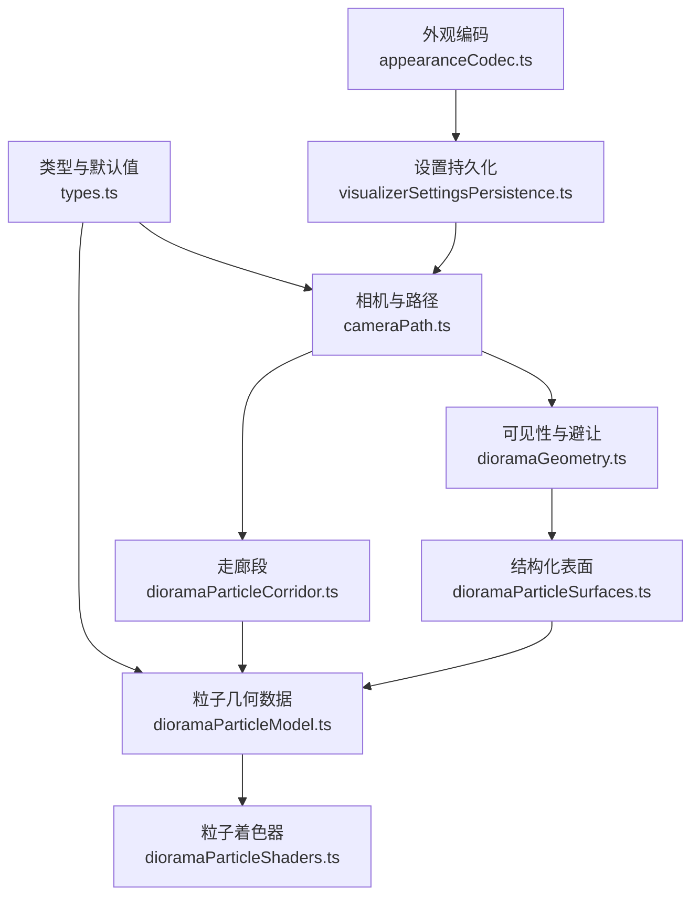

**图示来源**
- [cameraPath.ts:1-800](file://src/components/visualizer/diorama/cameraPath.ts#L1-L800)
- [dioramaGeometry.ts:1-87](file://src/components/visualizer/diorama/dioramaGeometry.ts#L1-L87)
- [dioramaParticleSurfaces.ts:1-243](file://src/components/visualizer/diorama/dioramaParticleSurfaces.ts#L1-L243)
- [dioramaParticleCorridor.ts:1-101](file://src/components/visualizer/diorama/dioramaParticleCorridor.ts#L1-L101)
- [dioramaParticleModel.ts:1-415](file://src/components/visualizer/diorama/dioramaParticleModel.ts#L1-L415)
- [dioramaParticleShaders.ts:1-361](file://src/components/visualizer/diorama/dioramaParticleShaders.ts#L1-L361)
- [types.ts:780-979](file://src/types.ts#L780-L979)
- [visualizerSettingsPersistence.ts:581-600](file://src/stores/visualizerSettingsPersistence.ts#L581-L600)
- [appearanceCodec.ts:149-183](file://src/utils/appearanceCodec.ts#L149-L183)

**章节来源**
- [cameraPath.ts:1-800](file://src/components/visualizer/diorama/cameraPath.ts#L1-L800)
- [dioramaGeometry.ts:1-87](file://src/components/visualizer/diorama/dioramaGeometry.ts#L1-L87)
- [dioramaParticleSurfaces.ts:1-243](file://src/components/visualizer/diorama/dioramaParticleSurfaces.ts#L1-L243)
- [dioramaParticleCorridor.ts:1-101](file://src/components/visualizer/diorama/dioramaParticleCorridor.ts#L1-L101)
- [dioramaParticleModel.ts:1-415](file://src/components/visualizer/diorama/dioramaParticleModel.ts#L1-L415)
- [dioramaParticleShaders.ts:1-361](file://src/components/visualizer/diorama/dioramaParticleShaders.ts#L1-L361)
- [types.ts:780-979](file://src/types.ts#L780-L979)
- [visualizerSettingsPersistence.ts:581-600](file://src/stores/visualizerSettingsPersistence.ts#L581-L600)
- [appearanceCodec.ts:149-183](file://src/utils/appearanceCodec.ts#L149-L183)

## 核心组件
- 路径与镜头：按歌词行生成蜿蜒路径、局部帧、自由文本布局、镜头原型与偏移、生命周期淡入淡出。
- 可见性与避让：按形状族开关控制可见，计算簇半径并做跨行碰撞剔除，保证稳定可复现。
- 结构化表面：为 box/sphere/cone/torus 构建连续法线的点阵，支持 yStretch 与预算分配。
- 走廊生成：沿飞行路径构造固定半径圆环截面，支持窗口外延与索引全局化。
- 粒子模型：统一属性布局，双模式（云/走廊）共享缓冲；音频驱动波纹源与弹性响应。
- 着色器：统一顶点/片段着色器，基于局部半径的位移、波纹叠加、细节纹理、颜色渐变与辉光。

**章节来源**
- [cameraPath.ts:1-800](file://src/components/visualizer/diorama/cameraPath.ts#L1-L800)
- [dioramaGeometry.ts:1-87](file://src/components/visualizer/diorama/dioramaGeometry.ts#L1-L87)
- [dioramaParticleSurfaces.ts:1-243](file://src/components/visualizer/diorama/dioramaParticleSurfaces.ts#L1-L243)
- [dioramaParticleCorridor.ts:1-101](file://src/components/visualizer/diorama/dioramaParticleCorridor.ts#L1-L101)
- [dioramaParticleModel.ts:1-415](file://src/components/visualizer/diorama/dioramaParticleModel.ts#L1-L415)
- [dioramaParticleShaders.ts:1-361](file://src/components/visualizer/diorama/dioramaParticleShaders.ts#L1-L361)

## 架构总览
Diorama 几何体管线遵循“纯数学 → 几何数据 → GPU 缓冲区 → 着色器”的分层：
- 纯数学层：路径、帧、文本布局、镜头、形体放置、生命周期等不依赖 Three.js，便于单元测试。
- 几何数据层：将可见形体与走廊段转换为统一属性的 Float32Array 缓冲。
- GPU 层：BufferGeometry 一次性提交，着色器在顶点阶段完成位移、尺寸与颜色计算。

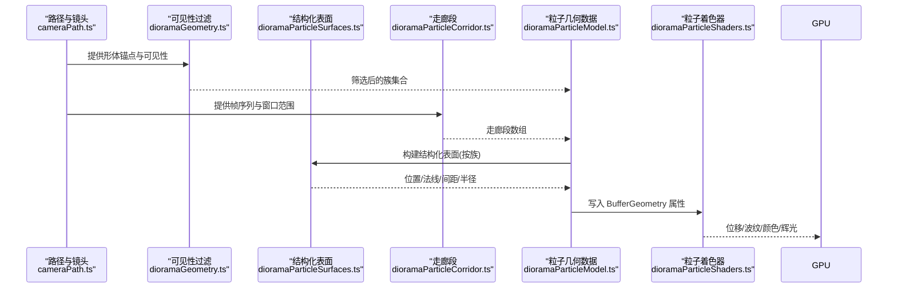

**图示来源**
- [cameraPath.ts:1-800](file://src/components/visualizer/diorama/cameraPath.ts#L1-L800)
- [dioramaGeometry.ts:1-87](file://src/components/visualizer/diorama/dioramaGeometry.ts#L1-L87)
- [dioramaParticleSurfaces.ts:1-243](file://src/components/visualizer/diorama/dioramaParticleSurfaces.ts#L1-L243)
- [dioramaParticleCorridor.ts:1-101](file://src/components/visualizer/diorama/dioramaParticleCorridor.ts#L1-L101)
- [dioramaParticleModel.ts:1-415](file://src/components/visualizer/diorama/dioramaParticleModel.ts#L1-L415)
- [dioramaParticleShaders.ts:1-361](file://src/components/visualizer/diorama/dioramaParticleShaders.ts#L1-L361)

## 详细组件分析

### 程序化建模与数学函数
- 路径生成：使用有界 yaw/pitch 的正弦组合推进，确保始终向前且避免折返；每行生成局部帧（forward/right/up）。
- 文本布局：每行获得随机但稳定的偏移、缩放、滚动与偏航，以及构图上的 look-offset，使文字不在中心线上死板排列。
- 镜头语言：根据歌词段落、字数、音符时长等特征加权选择镜头原型（推近、拉远、环绕、轨道、摇臂、悬停、膨胀、螺旋、钟摆、掠过、弧线、漂浮、滑翔），并通过 SmoothDamp 平滑过渡。
- 形体放置：按镜头匹配建筑感形体（环、柱廊、拱门、螺旋等），统一族保持一致性；通过分离算法避免重叠，保持文本前方空间。

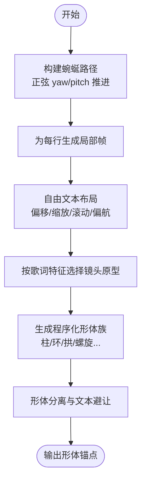

**图示来源**
- [cameraPath.ts:223-254](file://src/components/visualizer/diorama/cameraPath.ts#L223-L254)
- [cameraPath.ts:321-340](file://src/components/visualizer/diorama/cameraPath.ts#L321-L340)
- [cameraPath.ts:531-547](file://src/components/visualizer/diorama/cameraPath.ts#L531-L547)
- [cameraPath.ts:574-694](file://src/components/visualizer/diorama/cameraPath.ts#L574-L694)
- [cameraPath.ts:791-800](file://src/components/visualizer/diorama/cameraPath.ts#L791-L800)

**章节来源**
- [cameraPath.ts:1-800](file://src/components/visualizer/diorama/cameraPath.ts#L1-L800)

### 噪声函数与分形结构
- 确定性伪随机：seededUnit/hashSeed 保证同一条歌词行在不同 seek 下仍一致。
- 噪声式扰动：idle breath 使用多层低频正弦叠加，形成持续微动但不破坏拓扑的扰动场。
- 波纹传播：音频触发波纹源，每个源贡献一个高斯包络+正弦振荡的脉冲，沿表面扩散并衰减，形成“波峰-回弹-回落”的弹性效果。
- 细节纹理：高频项由 sustained treble 门控，仅在已有波峰上增加细纹，避免无音乐时产生噪声。

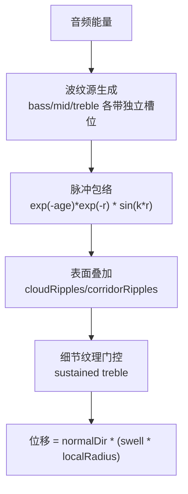

**图示来源**
- [dioramaParticleShaders.ts:119-173](file://src/components/visualizer/diorama/dioramaParticleShaders.ts#L119-L173)
- [dioramaParticleShaders.ts:175-208](file://src/components/visualizer/diorama/dioramaParticleShaders.ts#L175-L208)
- [dioramaParticleModel.ts:306-328](file://src/components/visualizer/diorama/dioramaParticleModel.ts#L306-L328)

**章节来源**
- [dioramaParticleShaders.ts:1-361](file://src/components/visualizer/diorama/dioramaParticleShaders.ts#L1-L361)
- [dioramaParticleModel.ts:1-415](file://src/components/visualizer/diorama/dioramaParticleModel.ts#L1-L415)

### 网格变形技术
- 顶点位移：所有位移均为 primitive 自身半径的分数，避免世界常量位移导致小云团被撕裂或隧道形变过大。
- 法线重计算：结构化表面保证法线是位置的连续函数，避免边缘处法线跳变导致位移撕裂。
- UV/波坐标更新：走廊使用 (along, angle) 作为表面参数，角度差通过 corridorSurfaceDelta 包裹到 [-π, π]，消除接缝；云模式使用 unitPos 与相位。

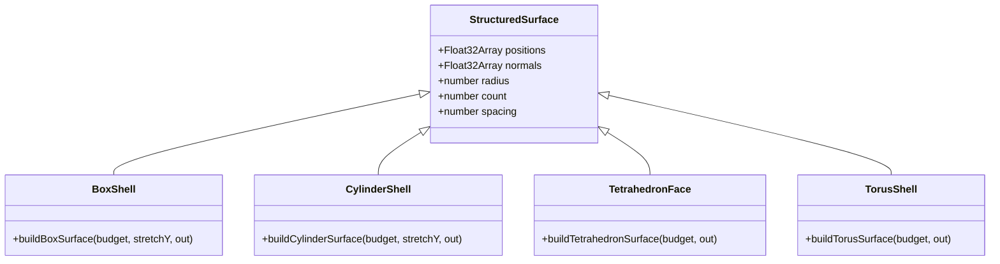

**图示来源**
- [dioramaParticleSurfaces.ts:20-40](file://src/components/visualizer/diorama/dioramaParticleSurfaces.ts#L20-L40)
- [dioramaParticleSurfaces.ts:107-125](file://src/components/visualizer/diorama/dioramaParticleSurfaces.ts#L107-L125)
- [dioramaParticleSurfaces.ts:127-147](file://src/components/visualizer/diorama/dioramaParticleSurfaces.ts#L127-L147)
- [dioramaParticleSurfaces.ts:154-179](file://src/components/visualizer/diorama/dioramaParticleSurfaces.ts#L154-L179)
- [dioramaParticleSurfaces.ts:181-205](file://src/components/visualizer/diorama/dioramaParticleSurfaces.ts#L181-L205)

**章节来源**
- [dioramaParticleSurfaces.ts:1-243](file://src/components/visualizer/diorama/dioramaParticleSurfaces.ts#L1-L243)
- [dioramaParticleShaders.ts:210-267](file://src/components/visualizer/diorama/dioramaParticleShaders.ts#L210-L267)

### 走廊生成算法
- 路径拉伸：走廊段由 start/end 帧决定，end 若为空则按 forward 方向延伸一步，保证窗口外延不断链。
- 截面复制：每段生成 rings × ringSegments 个圆环点，ringSegments 随密度自适应，保证均匀采样。
- 连接缝合：相邻 span 的 end 与下一 span 的 start 完全重合；角度差用 atan(sin, cos) 包裹，消除接缝。

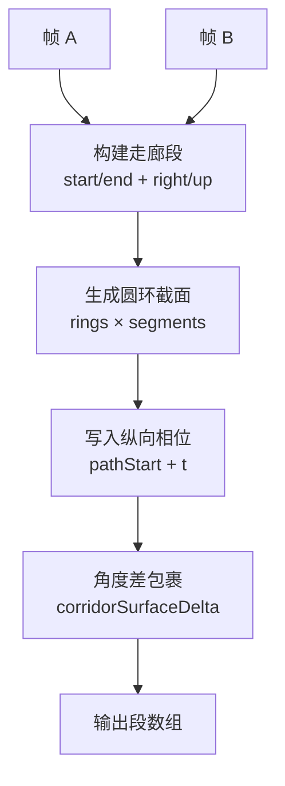

**图示来源**
- [dioramaParticleCorridor.ts:36-61](file://src/components/visualizer/diorama/dioramaParticleCorridor.ts#L36-L61)
- [dioramaParticleCorridor.ts:78-100](file://src/components/visualizer/diorama/dioramaParticleCorridor.ts#L78-L100)
- [dioramaParticleModel.ts:185-267](file://src/components/visualizer/diorama/dioramaParticleModel.ts#L185-L267)
- [dioramaParticleShaders.ts:149-173](file://src/components/visualizer/diorama/dioramaParticleShaders.ts#L149-L173)

**章节来源**
- [dioramaParticleCorridor.ts:1-101](file://src/components/visualizer/diorama/dioramaParticleCorridor.ts#L1-L101)
- [dioramaParticleModel.ts:185-267](file://src/components/visualizer/diorama/dioramaParticleModel.ts#L185-L267)
- [dioramaParticleShaders.ts:149-173](file://src/components/visualizer/diorama/dioramaParticleShaders.ts#L149-L173)

### 几何体优化技术
- 顶点合并：结构化表面采用焊接策略，避免独立面片拼接导致的接缝；四面体面包含边界点，共边点坐标一致，无需去重。
- 法线平滑：径向法线作为连续场，避免平面法线在边缘处的突变；yStretch 下仍保持均匀采样。
- LOD 与密度：density 归一化为步长倍数，限制最大点数；spacing 决定最大波数，防止混叠。
- 可见性裁剪：跨行碰撞剔除，仅保留必要簇，减少绘制量。

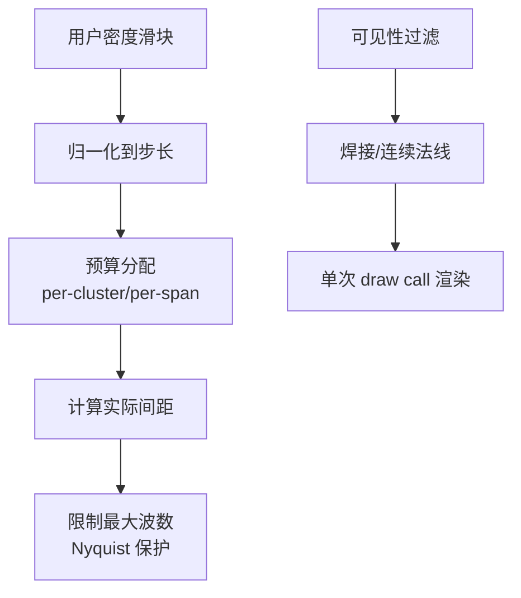

**图示来源**
- [dioramaParticleModel.ts:75-92](file://src/components/visualizer/diorama/dioramaParticleModel.ts#L75-L92)
- [dioramaParticleModel.ts:115-167](file://src/components/visualizer/diorama/dioramaParticleModel.ts#L115-L167)
- [dioramaParticleModel.ts:185-201](file://src/components/visualizer/diorama/dioramaParticleModel.ts#L185-L201)
- [dioramaGeometry.ts:68-86](file://src/components/visualizer/diorama/dioramaGeometry.ts#L68-L86)
- [dioramaParticleSurfaces.ts:107-125](file://src/components/visualizer/diorama/dioramaParticleSurfaces.ts#L107-L125)

**章节来源**
- [dioramaParticleModel.ts:1-415](file://src/components/visualizer/diorama/dioramaParticleModel.ts#L1-L415)
- [dioramaGeometry.ts:1-87](file://src/components/visualizer/diorama/dioramaGeometry.ts#L1-L87)
- [dioramaParticleSurfaces.ts:1-243](file://src/components/visualizer/diorama/dioramaParticleSurfaces.ts#L1-L243)

### 材质绑定系统
- 纹理坐标映射：走廊使用 (along, angle)，云模式使用 unitPos 与相位；两者均进入 aWave/aPhase，供着色器计算波纹与细节。
- 法线贴图处理：本系统不使用传统法线贴图，而是通过连续法线场与位移场模拟表面起伏；着色器直接读取 aNormal 作为位移方向。
- 着色器参数传递：通过 uniform 传入时间、振幅、波纹源、流动速度、脉冲、颜色等；属性数组携带每点样式、相位、波坐标。

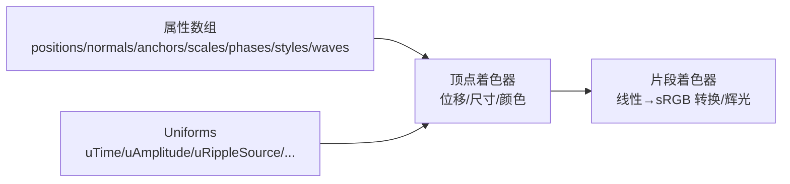

**图示来源**
- [dioramaParticleModel.ts:49-73](file://src/components/visualizer/diorama/dioramaParticleModel.ts#L49-L73)
- [dioramaParticleModel.ts:270-281](file://src/components/visualizer/diorama/dioramaParticleModel.ts#L270-L281)
- [dioramaParticleShaders.ts:56-90](file://src/components/visualizer/diorama/dioramaParticleShaders.ts#L56-L90)
- [dioramaParticleShaders.ts:312-361](file://src/components/visualizer/diorama/dioramaParticleShaders.ts#L312-L361)

**章节来源**
- [dioramaParticleModel.ts:49-73](file://src/components/visualizer/diorama/dioramaParticleModel.ts#L49-L73)
- [dioramaParticleShaders.ts:56-90](file://src/components/visualizer/diorama/dioramaParticleShaders.ts#L56-L90)
- [dioramaParticleShaders.ts:312-361](file://src/components/visualizer/diorama/dioramaParticleShaders.ts#L312-L361)

## 依赖关系分析
- cameraPath.ts 为其他模块提供路径、帧、文本布局、镜头、形体放置与生命周期常量。
- dioramaGeometry.ts 依赖 cameraPath.ts 的形状放置类型，并输出可见簇。
- dioramaParticleSurfaces.ts 依赖 dioramaGeometry.ts 的簇类型，输出结构化表面。
- dioramaParticleCorridor.ts 依赖 cameraPath.ts 的帧与步距，输出走廊段。
- dioramaParticleModel.ts 聚合上述结果，构建统一几何数据与音频响应。
- dioramaParticleShaders.ts 消费 BufferGeometry 属性与 uniforms，执行最终渲染。

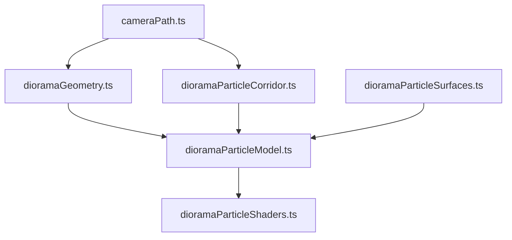

**图示来源**
- [cameraPath.ts:1-800](file://src/components/visualizer/diorama/cameraPath.ts#L1-L800)
- [dioramaGeometry.ts:1-87](file://src/components/visualizer/diorama/dioramaGeometry.ts#L1-L87)
- [dioramaParticleCorridor.ts:1-101](file://src/components/visualizer/diorama/dioramaParticleCorridor.ts#L1-L101)
- [dioramaParticleSurfaces.ts:1-243](file://src/components/visualizer/diorama/dioramaParticleSurfaces.ts#L1-L243)
- [dioramaParticleModel.ts:1-415](file://src/components/visualizer/diorama/dioramaParticleModel.ts#L1-L415)
- [dioramaParticleShaders.ts:1-361](file://src/components/visualizer/diorama/dioramaParticleShaders.ts#L1-L361)

**章节来源**
- [cameraPath.ts:1-800](file://src/components/visualizer/diorama/cameraPath.ts#L1-L800)
- [dioramaGeometry.ts:1-87](file://src/components/visualizer/diorama/dioramaGeometry.ts#L1-L87)
- [dioramaParticleCorridor.ts:1-101](file://src/components/visualizer/diorama/dioramaParticleCorridor.ts#L1-L101)
- [dioramaParticleSurfaces.ts:1-243](file://src/components/visualizer/diorama/dioramaParticleSurfaces.ts#L1-L243)
- [dioramaParticleModel.ts:1-415](file://src/components/visualizer/diorama/dioramaParticleModel.ts#L1-L415)
- [dioramaParticleShaders.ts:1-361](file://src/components/visualizer/diorama/dioramaParticleShaders.ts#L1-L361)

## 性能与优化
- 预算与密度：density 归一化到步长，限制 per-cluster/per-span 的最大点数，避免抖动与过度细分。
- 间距与波数：spacing 决定 uWaveNumberMax，防止波长过短导致混叠。
- 单一 draw call：两种模式共享同一 BufferGeometry 布局，减少状态切换。
- 可见性裁剪：跨行碰撞剔除，降低冗余点数量。
- 平滑过渡：SmoothDamp 与 hold settle 避免镜头跳跃；形体生命周期淡入淡出避免穿模。

[本节为通用性能指导，不直接分析具体文件]

## 材质与着色器绑定
- 顶点着色器：
  - 位移：basePos + normalDir * (swell * localRadius)，swell 来自波纹与 idle 场的标量和。
  - 尺寸：sizeBase + d^3 + detail*0.35，受 uSizeGain 与 uGlowPass 影响。
  - 颜色：三原色权重随相位与光谱质心变化，热点区域偏向 accent/secondary。
  - 生命周期：距离相机远近控制 fade-in/dissolve。
- 片段着色器：
  - 线性→sRGB 转换，确保主题色正确显示。
  - 对比层与辉光层分离，辉光层使用加法混合，强度受 uGlow 与 vReaction 控制。

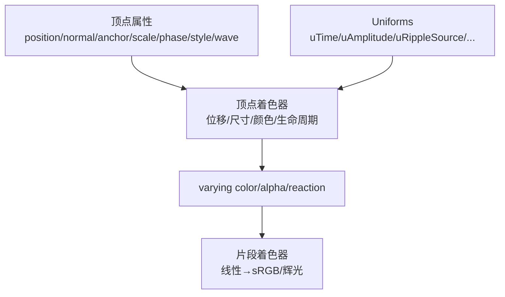

**图示来源**
- [dioramaParticleShaders.ts:210-309](file://src/components/visualizer/diorama/dioramaParticleShaders.ts#L210-L309)
- [dioramaParticleShaders.ts:312-361](file://src/components/visualizer/diorama/dioramaParticleShaders.ts#L312-L361)

**章节来源**
- [dioramaParticleShaders.ts:1-361](file://src/components/visualizer/diorama/dioramaParticleShaders.ts#L1-L361)

## 几何体缓存机制
- 结构化表面缓存：按 kind/budget/stretchKey 键缓存，避免重复构建相同预算与拉伸比的表面。
- 几何数据复用：BufferGeometry 在替换或卸载时释放，避免泄漏。
- 波纹槽位池：每频段固定槽位数，轮询替换，避免新击打覆盖仍在衰减的低频波。
- 设置持久化与迁移：解析存储的设置时填充默认值与边界检查，兼容旧配置。

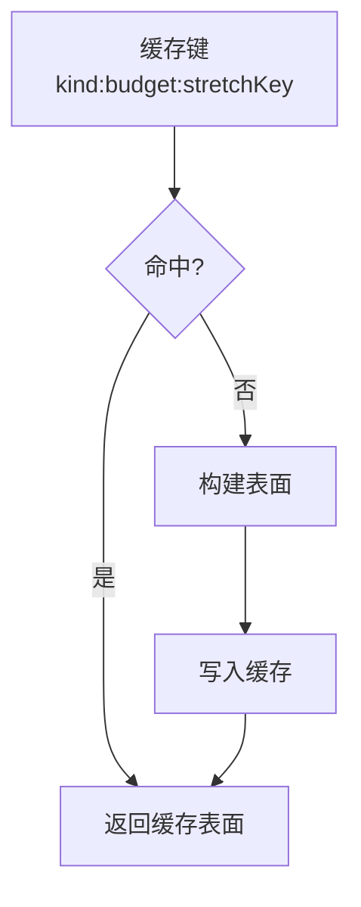

**图示来源**
- [dioramaParticleSurfaces.ts:42-43](file://src/components/visualizer/diorama/dioramaParticleSurfaces.ts#L42-L43)
- [dioramaParticleSurfaces.ts:207-242](file://src/components/visualizer/diorama/dioramaParticleSurfaces.ts#L207-L242)
- [dioramaParticleModel.ts:270-281](file://src/components/visualizer/diorama/dioramaParticleModel.ts#L270-L281)
- [dioramaParticleModel.ts:312-328](file://src/components/visualizer/diorama/dioramaParticleModel.ts#L312-L328)
- [visualizerSettingsPersistence.ts:581-600](file://src/stores/visualizerSettingsPersistence.ts#L581-L600)
- [appearanceCodec.ts:149-183](file://src/utils/appearanceCodec.ts#L149-L183)

**章节来源**
- [dioramaParticleSurfaces.ts:1-243](file://src/components/visualizer/diorama/dioramaParticleSurfaces.ts#L1-L243)
- [dioramaParticleModel.ts:1-415](file://src/components/visualizer/diorama/dioramaParticleModel.ts#L1-L415)
- [visualizerSettingsPersistence.ts:581-600](file://src/stores/visualizerSettingsPersistence.ts#L581-L600)
- [appearanceCodec.ts:149-183](file://src/utils/appearanceCodec.ts#L149-L183)

## 走廊生成算法
- 输入：帧序列、窗口中心、前后跨度。
- 步骤：
  1) 解析全局锚点，确定当前 segment。
  2) 对窗口内每个 index，获取 frameAt(i) 与 frameAt(i+1)。
  3) 构建 span：start/end 位置、right/up 基向量、pathStart、enabled 标志。
  4) 生成 rings × segments 圆环点，写入位置、法线、锚点、尺度、相位、波坐标与样式。
- 关键约束：
  - 角度差包裹，消除接缝。
  - 绝对纵向坐标，避免窗口滑动导致相位滚动。
  - 窗口外延，保证歌词范围外仍有连续隧道。

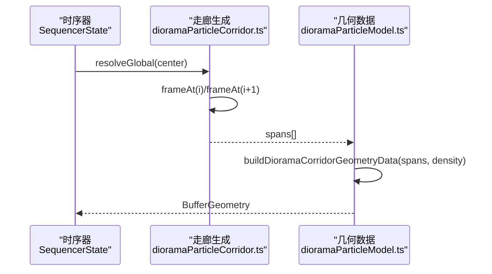

**图示来源**
- [dioramaParticleCorridor.ts:78-100](file://src/components/visualizer/diorama/dioramaParticleCorridor.ts#L78-L100)
- [dioramaParticleModel.ts:185-267](file://src/components/visualizer/diorama/dioramaParticleModel.ts#L185-L267)

**章节来源**
- [dioramaParticleCorridor.ts:1-101](file://src/components/visualizer/diorama/dioramaParticleCorridor.ts#L1-L101)
- [dioramaParticleModel.ts:185-267](file://src/components/visualizer/diorama/dioramaParticleModel.ts#L185-L267)

## 自定义几何体创建指南
- 新增形状族：
  1) 在结构化表面构建器中添加对应 case。
  2) 确保法线为位置的连续函数，避免边缘撕裂。
  3) 计算 spacing 与 radius，用于 shader 的相对位移与波数限制。
  4) 在 FAMILY_INDEX 与 isKindVisible 中注册。
- 调整预算：
  - 通过 density 滑块控制 per-cluster/per-span 点数，注意 spacing 与 Nyquist 限制。
- 测试建议：
  - 验证不同 stretchY 下的采样均匀性。
  - 验证大振幅位移下是否出现面片分离。
  - 验证窗口滑动时相位是否稳定。

[本节为通用指导，不直接分析具体文件]

## 参数调节工具
- 调参入口：
  - 相机速度、运动幅度、音频反应强度。
  - 几何体可见性开关（strands/blobs/ribbons/rings）、模式（clouds/corridor）。
  - 粒子密度、粒子缩放、背景粒子密度、辉光强度等。
- 设置持久化：
  - 解析存储设置时填充默认值与边界检查，兼容旧配置。
- 外观编码：
  - 压缩/解压缩 diorama 相关参数，便于存储与传输。

**章节来源**
- [types.ts:780-979](file://src/types.ts#L780-L979)
- [visualizerSettingsPersistence.ts:581-600](file://src/stores/visualizerSettingsPersistence.ts#L581-L600)
- [appearanceCodec.ts:149-183](file://src/utils/appearanceCodec.ts#L149-L183)

## 质量与兼容性要求
- 视觉质量：
  - 位移必须基于 localRadius，避免世界常量位移导致撕裂。
  - 法线必须连续，避免边缘分离。
  - 角度差必须包裹，消除走廊接缝。
  - 波数必须受 spacing 限制，防止混叠。
- 性能质量：
  - 预算与密度需归一化，避免抖动。
  - 可见性裁剪需稳定，避免相机移动时重新洗牌。
  - 单一 draw call，减少状态切换。
- 兼容性：
  - 设置迁移需填充默认值与边界检查。
  - 外观编码需兼容旧配置。

**章节来源**
- [dioramaParticleShaders.ts:1-56](file://src/components/visualizer/diorama/dioramaParticleShaders.ts#L1-L56)
- [dioramaParticleModel.ts:75-92](file://src/components/visualizer/diorama/dioramaParticleModel.ts#L75-L92)
- [visualizerSettingsPersistence.ts:581-600](file://src/stores/visualizerSettingsPersistence.ts#L581-L600)
- [appearanceCodec.ts:149-183](file://src/utils/appearanceCodec.ts#L149-L183)

## 故障排查
- 现象：隧道接缝明显
  - 原因：角度差未包裹或相位含角项
  - 解决：使用 corridorSurfaceDelta 包裹角度差；移除相位中的角项
- 现象：立方体边缘撕裂
  - 原因：法线不连续或位移非相对 localRadius
  - 解决：使用径向法线；位移基于 localRadius
- 现象：高密度下波纹呈散点
  - 原因：波数超过 Nyquist 限制
  - 解决：限制 uWaveNumberMax 为 spacing 的函数
- 现象：设置变更后行为异常
  - 原因：旧配置缺失字段或越界
  - 解决：使用 resolveStoredDioramaTuning 填充默认值与边界检查

**章节来源**
- [dioramaParticleShaders.ts:149-173](file://src/components/visualizer/diorama/dioramaParticleShaders.ts#L149-L173)
- [dioramaParticleSurfaces.ts:76-90](file://src/components/visualizer/diorama/dioramaParticleSurfaces.ts#L76-L90)
- [dioramaParticleModel.ts:75-92](file://src/components/visualizer/diorama/dioramaParticleModel.ts#L75-L92)
- [visualizerSettingsPersistence.ts:581-600](file://src/stores/visualizerSettingsPersistence.ts#L581-L600)

## 结论
Diorama 几何体生成系统通过“路径 + 镜头 + 形体族 + 结构化表面 + 统一着色器”的架构，实现了高质量、高性能的程序化几何体。其关键点在于：
- 位移与法线的连续性保障拓扑稳定
- 波纹驱动的弹性动画避免机械抖动
- 预算与间距控制保证视觉质量与性能平衡
- 走廊接缝与相位稳定性确保无缝体验
- 设置迁移与外观编码提升兼容性

[本节为总结性内容，不直接分析具体文件]