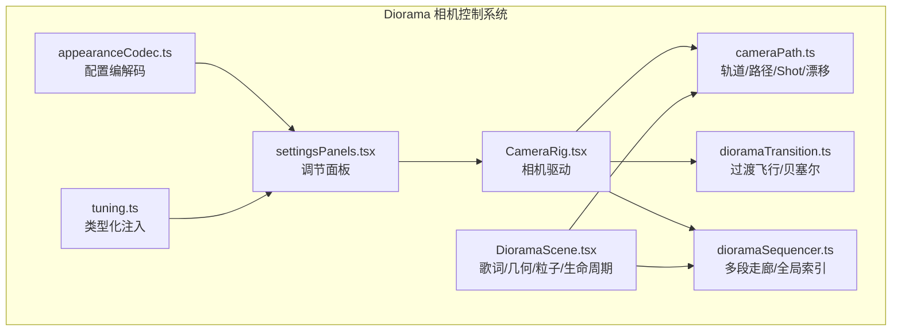
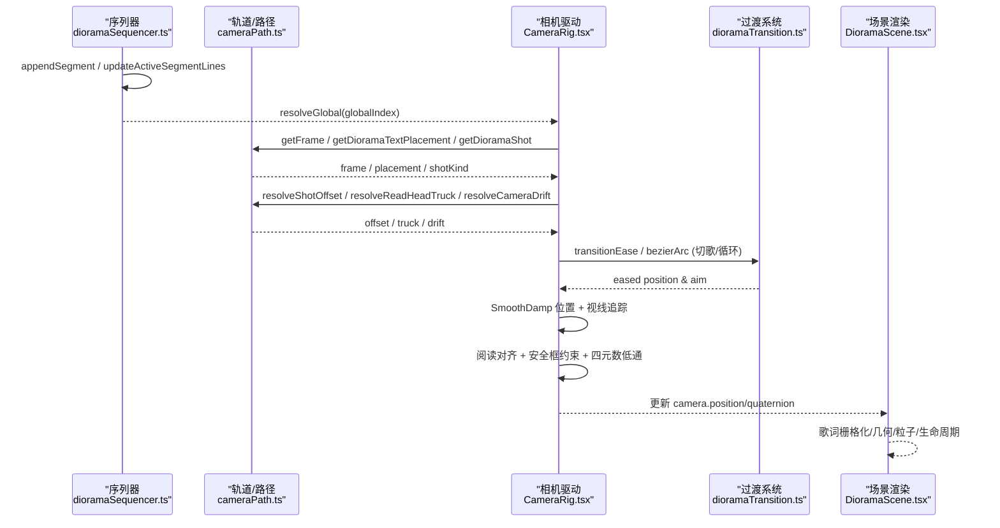
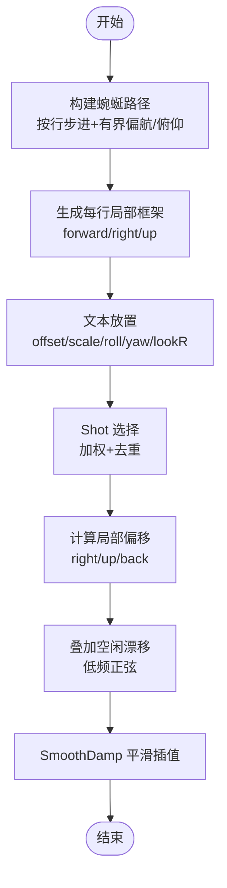
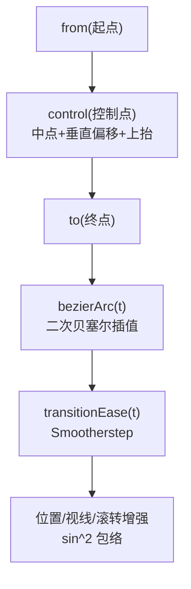
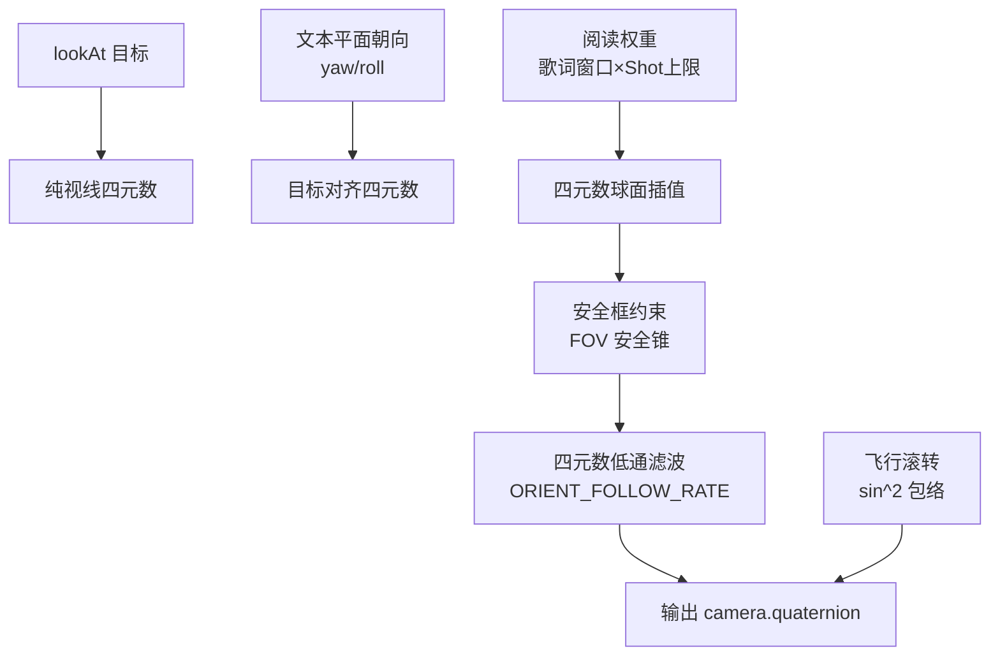
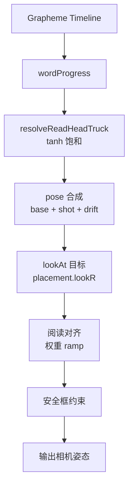
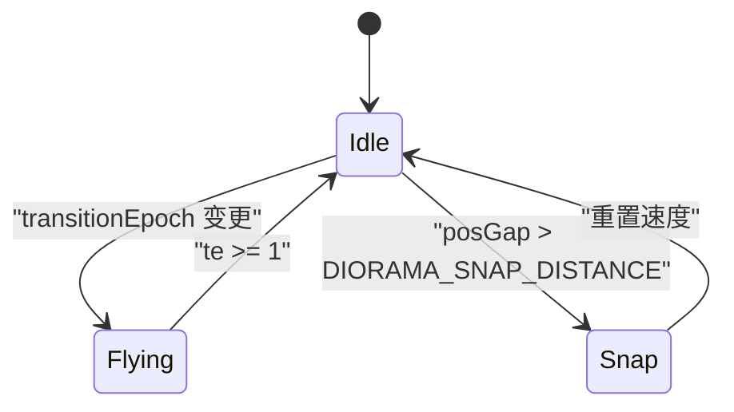
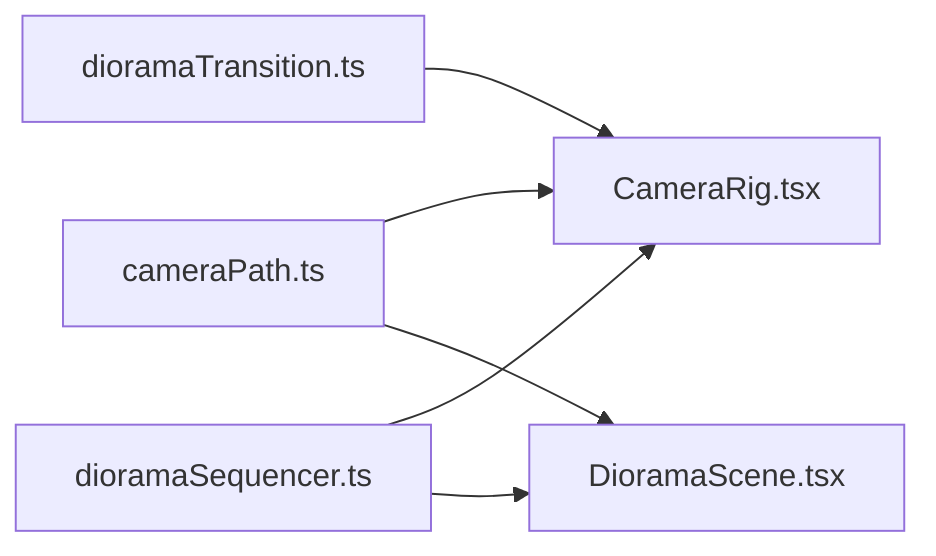

# 相机控制系统

<cite>
**本文引用的文件**   
- [CameraRig.tsx](file://src/components/visualizer/diorama/CameraRig.tsx)
- [cameraPath.ts](file://src/components/visualizer/diorama/cameraPath.ts)
- [dioramaTransition.ts](file://src/components/visualizer/diorama/dioramaTransition.ts)
- [dioramaSequencer.ts](file://src/components/visualizer/diorama/dioramaSequencer.ts)
- [DioramaScene.tsx](file://src/components/visualizer/diorama/DioramaScene.tsx)
- [settingsPanels.tsx](file://src/components/visualizer/settingsPanels.tsx)
- [appearanceCodec.ts](file://src/utils/appearanceCodec.ts)
- [tuning.ts](file://src/components/visualizer/diorama/tuning.ts)
- [diorama_hold_framing.mts](file://test/manual/diorama_hold_framing.mts)
</cite>

## 目录
1. [简介](#简介)
2. [项目结构](#项目结构)
3. [核心组件](#核心组件)
4. [架构总览](#架构总览)
5. [详细组件分析](#详细组件分析)
6. [依赖关系分析](#依赖关系分析)
7. [性能考量](#性能考量)
8. [故障排查指南](#故障排查指南)
9. [结论](#结论)
10. [附录](#附录)

## 简介
本文件为 Diorama 模式的相机控制系统提供系统化技术文档，覆盖轨道系统、路径插值与平滑过渡、视角切换算法、贝塞尔曲线路径规划、相机姿态控制（朝向计算、滚动补偿、防抖动）、镜头效果（景深模拟、焦距变化、透视变换）、歌词同步机制（文本跟随、焦点锁定、自动构图）、过渡动画系统（缓动函数、时间控制、状态机管理），以及相机预设、自定义路径编辑与调试可视化工具。同时给出行为调优指南与性能优化建议，帮助开发者在保持电影感运镜的同时获得稳定流畅的播放体验。

## 项目结构
Diorama 相机控制系统由以下关键模块组成：
- 轨道与路径：cameraPath.ts 负责生成蜿蜒路径、每行局部坐标系、文本放置、镜头语言（Shot）选择与偏移、空闲漂移等。
- 相机驱动：CameraRig.tsx 每帧驱动相机位置与朝向，组合 Shot 偏移、歌词跟随、阅读对齐、过渡飞行与防抖。
- 场景渲染：DioramaScene.tsx 负责歌词栅格化、几何体生成、粒子场、生命周期淡入淡出、主题色阻尼等。
- 过渡系统：dioramaTransition.ts 提供切歌/循环时的世界内飞行弧线、贝塞尔控制点与缓动。
- 序列器：dioramaSequencer.ts 维护多段走廊（歌曲/循环）的世界坐标拼接、全局索引解析与内存修剪。
- 设置与持久化：settingsPanels.tsx 暴露调节项；appearanceCodec.ts 序列化/反序列化；tuning.ts 注入类型化配置。

**图示来源** 
- [CameraRig.tsx:1-58](file://src/components/visualizer/diorama/CameraRig.tsx#L1-L58)
- [cameraPath.ts:1-34](file://src/components/visualizer/diorama/cameraPath.ts#L1-L34)
- [dioramaTransition.ts:1-11](file://src/components/visualizer/diorama/dioramaTransition.ts#L1-L11)
- [dioramaSequencer.ts:1-15](file://src/components/visualizer/diorama/dioramaSequencer.ts#L1-L15)
- [DioramaScene.tsx:47-68](file://src/components/visualizer/diorama/DioramaScene.tsx#L47-L68)
- [settingsPanels.tsx:955-988](file://src/components/visualizer/settingsPanels.tsx#L955-L988)
- [appearanceCodec.ts:149-183](file://src/utils/appearanceCodec.ts#L149-L183)
- [tuning.ts:1-4](file://src/components/visualizer/diorama/tuning.ts#L1-L4)

**章节来源**
- [CameraRig.tsx:1-58](file://src/components/visualizer/diorama/CameraRig.tsx#L1-L58)
- [cameraPath.ts:1-34](file://src/components/visualizer/diorama/cameraPath.ts#L1-L34)
- [dioramaTransition.ts:1-11](file://src/components/visualizer/diorama/dioramaTransition.ts#L1-L11)
- [dioramaSequencer.ts:1-15](file://src/components/visualizer/diorama/dioramaSequencer.ts#L1-L15)
- [DioramaScene.tsx:47-68](file://src/components/visualizer/diorama/DioramaScene.tsx#L47-L68)
- [settingsPanels.tsx:955-988](file://src/components/visualizer/settingsPanels.tsx#L955-L988)
- [appearanceCodec.ts:149-183](file://src/utils/appearanceCodec.ts#L149-L183)
- [tuning.ts:1-4](file://src/components/visualizer/diorama/tuning.ts#L1-L4)

## 核心组件
- 轨道与路径（cameraPath.ts）
  - 蜿蜒路径构建：按歌词行数步进，受有界偏航/俯仰的正弦扰动，保证始终向前不回头。
  - 局部坐标系：每行生成 forward/right/up 框架，用于文本、相机与几何体的统一表达。
  - 文本放置：每行独立偏移、缩放、平面内滚动与轻微偏航，并带构图视轴偏移（三分法）。
  - 镜头语言（Shot）：根据歌词特征（副歌、段落起始、音符长短、词数）加权选择运镜类型，再输出局部偏移。
  - 空闲漂移：叠加低频正弦层，营造手持呼吸感。
  - SmoothDamp：临界阻尼平滑跟随，避免阶跃目标导致的抖动。
- 相机驱动（CameraRig.tsx）
  - 位置跟踪：对目标 pose 使用 SmoothDamp，超大位移在非飞行时直接 Snap。
  - 过渡飞行：切歌/循环时以贝塞尔弧慢速飞向新场景，期间拉伸平滑时间、叠加横向拱形与滚转。
  - 视线追踪：lookAt 目标随歌词“读头”移动，飞行中附加侧向扫视。
  - 阅读对齐：将相机朝向向文本平面的朝向靠拢，权重由歌词窗口与 Shot 上限共同决定，最终经四元数低通滤波输出，杜绝抖动。
  - 安全框约束：若对齐导致读头偏离 FOV 安全锥，则回拉目标朝向，确保歌词永不离屏。
- 过渡系统（dioramaTransition.ts）
  - 世界内飞行：新走廊在世界空间偏移处生成，相机沿贝塞尔曲线飞行，新旧场景通过雾效自然交接。
  - 贝塞尔控制点：基于飞行方向垂直向量与随机侧向，构造上抬拱形控制点。
  - 缓动函数：Smootherstep 两端速度为零，避免起落抖动。
- 序列器（dioramaSequencer.ts）
  - 多段走廊：每首歌/每次循环作为一段，保留各自种子与全局索引映射。
  - 全局解析：将全局索引映射到具体段、局部行、世界框架与歌词对象。
  - 内存修剪：丢弃已飞越的旧段，保持长会话内存稳定。
- 场景渲染（DioramaScene.tsx）
  - 歌词栅格化：Canvas 绘制，保留字体栈与字距；活跃行按单位拆分，支持跟唱辉光、灵魂出窍、渐变着色等。
  - 几何体与粒子：按 Shot 生成建筑式集合，点云自发光，距离生命周期淡入淡出。
  - 主题色阻尼：颜色变化缓慢追赶目标，避免切歌或换主题时的突变。

**章节来源**
- [cameraPath.ts:37-72](file://src/components/visualizer/diorama/cameraPath.ts#L37-L72)
- [cameraPath.ts:115-141](file://src/components/visualizer/diorama/cameraPath.ts#L115-L141)
- [cameraPath.ts:217-254](file://src/components/visualizer/diorama/cameraPath.ts#L217-L254)
- [cameraPath.ts:300-340](file://src/components/visualizer/diorama/cameraPath.ts#L300-L340)
- [cameraPath.ts:344-547](file://src/components/visualizer/diorama/cameraPath.ts#L344-L547)
- [cameraPath.ts:570-694](file://src/components/visualizer/diorama/cameraPath.ts#L570-L694)
- [cameraPath.ts:726-746](file://src/components/visualizer/diorama/cameraPath.ts#L726-L746)
- [CameraRig.tsx:60-138](file://src/components/visualizer/diorama/CameraRig.tsx#L60-L138)
- [CameraRig.tsx:164-230](file://src/components/visualizer/diorama/CameraRig.tsx#L164-L230)
- [CameraRig.tsx:278-337](file://src/components/visualizer/diorama/CameraRig.tsx#L278-L337)
- [CameraRig.tsx:339-430](file://src/components/visualizer/diorama/CameraRig.tsx#L339-L430)
- [dioramaTransition.ts:15-26](file://src/components/visualizer/diorama/dioramaTransition.ts#L15-L26)
- [dioramaTransition.ts:46-63](file://src/components/visualizer/diorama/dioramaTransition.ts#L46-L63)
- [dioramaTransition.ts:65-102](file://src/components/visualizer/diorama/dioramaTransition.ts#L65-L102)
- [dioramaSequencer.ts:26-52](file://src/components/visualizer/diorama/dioramaSequencer.ts#L26-L52)
- [dioramaSequencer.ts:82-103](file://src/components/visualizer/diorama/dioramaSequencer.ts#L82-L103)
- [dioramaSequencer.ts:127-141](file://src/components/visualizer/diorama/dioramaSequencer.ts#L127-L141)
- [dioramaSequencer.ts:143-153](file://src/components/visualizer/diorama/dioramaSequencer.ts#L143-L153)
- [DioramaScene.tsx:47-68](file://src/components/visualizer/diorama/DioramaScene.tsx#L47-L68)
- [DioramaScene.tsx:123-197](file://src/components/visualizer/diorama/DioramaScene.tsx#L123-L197)

## 架构总览
下图展示从歌词数据到相机运动的端到端流程：序列器将多段走廊拼接为连续隧道，相机驱动读取当前行局部框架与文本放置，结合 Shot 偏移与空闲漂移得到目标 pose，再通过 SmoothDamp 与贝塞尔过渡飞行更新相机位置；朝向方面先 lookAt 视线目标，再融合文本平面朝向与安全框约束，最后经四元数低通滤波输出，避免抖动。

**图示来源**
- [dioramaSequencer.ts:82-103](file://src/components/visualizer/diorama/dioramaSequencer.ts#L82-L103)
- [dioramaSequencer.ts:127-141](file://src/components/visualizer/diorama/dioramaSequencer.ts#L127-L141)
- [cameraPath.ts:217-254](file://src/components/visualizer/diorama/cameraPath.ts#L217-L254)
- [cameraPath.ts:300-340](file://src/components/visualizer/diorama/cameraPath.ts#L300-L340)
- [cameraPath.ts:570-694](file://src/components/visualizer/diorama/cameraPath.ts#L570-L694)
- [cameraPath.ts:726-746](file://src/components/visualizer/diorama/cameraPath.ts#L726-L746)
- [CameraRig.tsx:278-430](file://src/components/visualizer/diorama/CameraRig.tsx#L278-L430)
- [dioramaTransition.ts:65-102](file://src/components/visualizer/diorama/dioramaTransition.ts#L65-L102)
- [DioramaScene.tsx:47-68](file://src/components/visualizer/diorama/DioramaScene.tsx#L47-L68)

## 详细组件分析

### 轨道系统与路径插值
- 蜿蜒路径构建
  - 每行推进固定步长，偏航/俯仰由有界正弦叠加，保证前进方向稳定。
  - 每行生成局部框架：forward 为切线，right = forward × worldUp，up 完成右手系。
- 文本放置
  - 每行独立 lateral/vertical 偏移、缩放、平面内 roll 与 yaw，以及构图 lookR 偏移。
  - 所有变量由确定性种子派生，seek 不重随机，保证可复现。
- 镜头语言（Shot）
  - 根据歌词特征（副歌、段落起始、词数、音符长度分布）加权选择 Shot 类型。
  - 每种 Shot 输出 local right/up/back 偏移，配合 moveScale 控制幅度。
- 空闲漂移
  - 多层低频正弦叠加，产生手持呼吸感，幅度由 driftScale 控制。
- 平滑插值
  - SmoothDamp 实现临界阻尼跟随，避免目标阶跃造成的抖动。

**图示来源**
- [cameraPath.ts:217-254](file://src/components/visualizer/diorama/cameraPath.ts#L217-L254)
- [cameraPath.ts:300-340](file://src/components/visualizer/diorama/cameraPath.ts#L300-L340)
- [cameraPath.ts:344-547](file://src/components/visualizer/diorama/cameraPath.ts#L344-L547)
- [cameraPath.ts:570-694](file://src/components/visualizer/diorama/cameraPath.ts#L570-L694)
- [cameraPath.ts:726-746](file://src/components/visualizer/diorama/cameraPath.ts#L726-L746)
- [cameraPath.ts:115-141](file://src/components/visualizer/diorama/cameraPath.ts#L115-L141)

**章节来源**
- [cameraPath.ts:217-254](file://src/components/visualizer/diorama/cameraPath.ts#L217-L254)
- [cameraPath.ts:300-340](file://src/components/visualizer/diorama/cameraPath.ts#L300-L340)
- [cameraPath.ts:344-547](file://src/components/visualizer/diorama/cameraPath.ts#L344-L547)
- [cameraPath.ts:570-694](file://src/components/visualizer/diorama/cameraPath.ts#L570-L694)
- [cameraPath.ts:726-746](file://src/components/visualizer/diorama/cameraPath.ts#L726-L746)
- [cameraPath.ts:115-141](file://src/components/visualizer/diorama/cameraPath.ts#L115-L141)

### 贝塞尔曲线路径规划与过渡动画
- 过渡飞行
  - 切歌/循环时，新走廊在世界空间偏移处生成，相机沿贝塞尔曲线飞行至新场景。
  - 飞行期间拉伸 SmoothDamp 时间常数，使远跳变为慢速 sweep，避免硬切。
- 贝塞尔控制点
  - 取 from→to 中点，沿飞行方向垂直向量加向上抬升，形成明显拱形。
  - 随机侧向选择让连续过渡方向多样化。
- 缓动函数
  - Smootherstep 两端速度为零，确保起落无抖动。
- 视觉增强
  - 飞行中段叠加横向拱形位移、侧向扫视与滚转，增强电影感。

**图示来源**
- [dioramaTransition.ts:46-63](file://src/components/visualizer/diorama/dioramaTransition.ts#L46-L63)
- [dioramaTransition.ts:65-102](file://src/components/visualizer/diorama/dioramaTransition.ts#L65-L102)
- [CameraRig.tsx:278-337](file://src/components/visualizer/diorama/CameraRig.tsx#L278-L337)

**章节来源**
- [dioramaTransition.ts:15-26](file://src/components/visualizer/diorama/dioramaTransition.ts#L15-L26)
- [dioramaTransition.ts:46-63](file://src/components/visualizer/diorama/dioramaTransition.ts#L46-L63)
- [dioramaTransition.ts:65-102](file://src/components/visualizer/diorama/dioramaTransition.ts#L65-L102)
- [CameraRig.tsx:278-337](file://src/components/visualizer/diorama/CameraRig.tsx#L278-L337)

### 相机姿态控制：朝向、滚动补偿与防抖动
- 朝向计算
  - 先通过 lookAt 设定纯视线朝向，随后融合文本平面朝向（含 yaw/roll）。
  - 融合权重由歌词窗口 ramp 与 Shot 上限共同决定，表达“阅读辅助”而非强锁定。
- 滚动补偿
  - 文本平面 roll 被纳入对齐朝向，倾斜行在屏幕上接近水平，提升可读性。
- 防抖动
  - 目标朝向允许瞬时跳变，但相机实际朝向通过四元数低通滤波器（指数平滑）输出，任何上游抖动都被吸收。
  - 安全框约束：若对齐导致读头偏离 FOV 安全锥，则回拉目标朝向，确保歌词不离屏。
- 过渡中的滚转
  - 飞行中段叠加滚转（bank），峰值在中点，结束时归零，无缝回归水平。

**图示来源**
- [CameraRig.tsx:339-430](file://src/components/visualizer/diorama/CameraRig.tsx#L339-L430)
- [diorama_hold_framing.mts:32-56](file://test/manual/diorama_hold_framing.mts#L32-L56)

**章节来源**
- [CameraRig.tsx:60-138](file://src/components/visualizer/diorama/CameraRig.tsx#L60-L138)
- [CameraRig.tsx:339-430](file://src/components/visualizer/diorama/CameraRig.tsx#L339-L430)
- [diorama_hold_framing.mts:32-56](file://test/manual/diorama_hold_framing.mts#L32-L56)

### 镜头效果：景深、焦距与透视
- 透视投影
  - 使用 THREE.PerspectiveCamera，FOV 与 aspect 决定视野范围。
- 焦距变化
  - 代码未动态修改 FOV；相机运动通过 dolly（前后位移）与 Shot 偏移改变主体大小，体现真实摄影推拉。
- 景深模拟
  - 未启用 GPU 景深；通过雾效（fog near/far）与距离生命周期（fade in/out）模拟远近层次。
- 透视变换
  - 文本与几何体均位于世界空间，相机运动带来真实透视缩短与视差。

**章节来源**
- [DioramaScene.tsx:123-197](file://src/components/visualizer/diorama/DioramaScene.tsx#L123-L197)
- [CameraRig.tsx:232-235](file://src/components/visualizer/diorama/CameraRig.tsx#L232-L235)

### 歌词同步机制：文本跟随、焦点锁定与自动构图
- 文本跟随
  - 读头进度由 grapheme timeline 计算，相机 lateral truck 跟随已唱字，使用 tanh 饱和曲线避免硬限抖动。
- 焦点锁定
  - 非强锁定：阅读对齐仅在歌词窗口内生效，且受 Shot 上限限制；间隙时权重归零，保持自由空间运动。
- 自动构图
  - 文本放置包含 lookR 偏移，使歌词处于三分法位置，留出生动背景空间；Shot 选择与偏移进一步丰富构图。

**图示来源**
- [CameraRig.tsx:140-162](file://src/components/visualizer/diorama/CameraRig.tsx#L140-L162)
- [CameraRig.tsx:248-276](file://src/components/visualizer/diorama/CameraRig.tsx#L248-L276)
- [CameraRig.tsx:339-430](file://src/components/visualizer/diorama/CameraRig.tsx#L339-L430)
- [cameraPath.ts:281-296](file://src/components/visualizer/diorama/cameraPath.ts#L281-L296)

**章节来源**
- [CameraRig.tsx:140-162](file://src/components/visualizer/diorama/CameraRig.tsx#L140-L162)
- [CameraRig.tsx:248-276](file://src/components/visualizer/diorama/CameraRig.tsx#L248-L276)
- [CameraRig.tsx:339-430](file://src/components/visualizer/diorama/CameraRig.tsx#L339-L430)
- [cameraPath.ts:281-296](file://src/components/visualizer/diorama/cameraPath.ts#L281-L296)

### 过渡动画系统：缓动、时间控制与状态机
- 缓动函数
  - Smootherstep 两端速度为零，确保起落无抖动。
- 时间控制
  - 飞行持续时间 TRANSITION_DURATION，期间平滑时间拉伸，结束后恢复。
- 状态机管理
  - SequencerState 维护多段走廊与全局索引；appendSegment/updateActiveSegmentLines 处理新增与歌词延迟到达；pruneSegments 清理旧段。
  - CameraRig 内部 flightRef 记录飞行状态（epoch/start/perp/side/flightLen），在 epoch 变更时启动飞行。

**图示来源**
- [dioramaTransition.ts:65-102](file://src/components/visualizer/diorama/dioramaTransition.ts#L65-L102)
- [dioramaSequencer.ts:82-103](file://src/components/visualizer/diorama/dioramaSequencer.ts#L82-L103)
- [dioramaSequencer.ts:143-153](file://src/components/visualizer/diorama/dioramaSequencer.ts#L143-L153)
- [CameraRig.tsx:172-182](file://src/components/visualizer/diorama/CameraRig.tsx#L172-L182)
- [CameraRig.tsx:278-337](file://src/components/visualizer/diorama/CameraRig.tsx#L278-L337)

**章节来源**
- [dioramaTransition.ts:65-102](file://src/components/visualizer/diorama/dioramaTransition.ts#L65-L102)
- [dioramaSequencer.ts:82-103](file://src/components/visualizer/diorama/dioramaSequencer.ts#L82-L103)
- [dioramaSequencer.ts:143-153](file://src/components/visualizer/diorama/dioramaSequencer.ts#L143-L153)
- [CameraRig.tsx:172-182](file://src/components/visualizer/diorama/CameraRig.tsx#L172-L182)
- [CameraRig.tsx:278-337](file://src/components/visualizer/diorama/CameraRig.tsx#L278-L337)

### 相机预设与自定义路径编辑
- 预设
  - subMode（calm/normal/chaotic）影响 Shot 选择倾向与幅度；motionAmount/cameraSpeed/audioReactivity 作为乘数叠加。
- 自定义路径
  - buildDioramaPath 接受 seed 与行数，生成确定性路径；translateFrames 可将整条走廊平移至世界任意位置。
  - 过渡系统 pickTransitionOffset 为新走廊选择世界偏移，使相机在不同方向/高度间飞行。
- 调试可视化
  - test/manual/diorama_hold_framing.mts 复制 CameraRig 常量进行离线验证，确保控制参数与运行时一致。

**章节来源**
- [cameraPath.ts:164-194](file://src/components/visualizer/diorama/cameraPath.ts#L164-L194)
- [cameraPath.ts:217-254](file://src/components/visualizer/diorama/cameraPath.ts#L217-L254)
- [cameraPath.ts:263-271](file://src/components/visualizer/diorama/cameraPath.ts#L263-L271)
- [dioramaTransition.ts:46-63](file://src/components/visualizer/diorama/dioramaTransition.ts#L46-L63)
- [diorama_hold_framing.mts:32-56](file://test/manual/diorama_hold_framing.mts#L32-L56)

### 调试与测试工具
- 手动探针
  - diorama_hold_framing.mts 校验阅读对齐与安全框约束，确保歌词不离屏。
- 单元测试
  - dioramaGeometry.test.ts / dioramaSequencer.test.ts 验证几何与序列器逻辑。
- 设置面板
  - settingsPanels.tsx 暴露相机速度等调节项；appearanceCodec.ts 持久化配置；tuning.ts 注入类型化配置。

**章节来源**
- [diorama_hold_framing.mts:32-56](file://test/manual/diorama_hold_framing.mts#L32-L56)
- [settingsPanels.tsx:955-988](file://src/components/visualizer/settingsPanels.tsx#L955-L988)
- [appearanceCodec.ts:149-183](file://src/utils/appearanceCodec.ts#L149-L183)
- [tuning.ts:1-4](file://src/components/visualizer/diorama/tuning.ts#L1-L4)

## 依赖关系分析
- 耦合与内聚
  - CameraRig 高内聚于相机运动逻辑，依赖 cameraPath 提供轨道/Shot/漂移，依赖 dioramaTransition 提供过渡数学，依赖 dioramaSequencer 提供全局索引解析。
  - DioramaScene 与 cameraPath/dioramaSequencer 解耦，仅消费数据接口，保持渲染与运动分离。
- 外部依赖
  - Three.js 用于透视相机与四元数运算；React Three Fiber 提供 useFrame 与 Canvas 集成。
- 潜在环依赖
  - 各模块均为纯函数或单向依赖，未见循环引用。

**图示来源**
- [CameraRig.tsx:1-34](file://src/components/visualizer/diorama/CameraRig.tsx#L1-L34)
- [DioramaScene.tsx:9-19](file://src/components/visualizer/diorama/DioramaScene.tsx#L9-L19)

**章节来源**
- [CameraRig.tsx:1-34](file://src/components/visualizer/diorama/CameraRig.tsx#L1-L34)
- [DioramaScene.tsx:9-19](file://src/components/visualizer/diorama/DioramaScene.tsx#L9-L19)

## 性能考量
- 每帧分配最小化
  - CameraRig 使用复用临时向量/四元数，避免 per-frame 分配。
- 平滑与稳定性
  - SmoothDamp 与四元数低通滤波避免高频抖动，减少不必要的渲染抖动。
- 渲染预算
  - 邻居行栅格化预算 NEIGHBOR_RASTER_BUDGET 分摊 song change 时的批量栅格化成本。
- 生命周期裁剪
  - 走廊与文本的距离生命周期避免近处穿模与远处闪烁。
- 主题色阻尼
  - COLOR_DAMP_RATE 使颜色变化平滑，避免频繁重绘带来的突变。

**章节来源**
- [CameraRig.tsx:111-125](file://src/components/visualizer/diorama/CameraRig.tsx#L111-L125)
- [CameraRig.tsx:418-427](file://src/components/visualizer/diorama/CameraRig.tsx#L418-L427)
- [DioramaScene.tsx:143-197](file://src/components/visualizer/diorama/DioramaScene.tsx#L143-L197)

## 故障排查指南
- 歌词离屏
  - 检查 FRAME_KEEP_FRACTION 与 ALIGN_SHOT_CEILING 是否过大；确认 resolveHoldSettle 在长停留时释放构图偏移。
- 过渡抖动
  - 检查 transitionEase 与 sin^2 包络是否正确应用；确认飞行期间不触发 Snap。
- 切歌卡顿
  - 检查 NEIGHBOR_RASTER_BUDGET 是否过小；确认 pruneSegments 正常清理旧段。
- 主题色突变
  - 调整 COLOR_DAMP_RATE；确认主题切换时颜色目标正确更新。

**章节来源**
- [CameraRig.tsx:387-430](file://src/components/visualizer/diorama/CameraRig.tsx#L387-L430)
- [dioramaTransition.ts:65-102](file://src/components/visualizer/diorama/dioramaTransition.ts#L65-L102)
- [DioramaScene.tsx:143-197](file://src/components/visualizer/diorama/DioramaScene.tsx#L143-L197)

## 结论
Diorama 相机控制系统以“轨道+Shot+过渡”为核心，通过确定性路径、加权镜头语言与贝塞尔过渡飞行，实现电影感运镜；通过阅读对齐与安全框约束保障歌词可读性；通过 SmoothDamp 与四元数低通滤波确保姿态稳定；通过序列器与过渡系统实现无遮罩的场景切换。系统在性能上采用复用临时对象、预算化栅格化与距离生命周期裁剪，兼顾流畅与稳定。

## 附录
- 相机行为调优建议
  - 提高 motionAmount 增加 Shot 幅度；降低 cameraSpeed 增大 smoothTime 以获得更柔和跟随。
  - 在 calm 模式下减少 orbit/spiral/flyby 等动态 Shot；在 chaotic 模式增加其权重。
  - 调整 driftScale 控制手持呼吸感强度；调整 weaveScale 控制文本布局多样性。
- 自定义路径编辑
  - 修改 buildDioramaPath 的偏航/俯仰振幅与步长；使用 translateFrames 将走廊置于世界任意位置。
  - 通过 pickTransitionOffset 调整新走廊偏移方向与距离，控制飞行轨迹。
- 调试工具
  - 使用 diorama_hold_framing.mts 校验阅读对齐与安全框；通过设置面板实时观察相机速度与运动幅度变化。

**章节来源**
- [cameraPath.ts:164-194](file://src/components/visualizer/diorama/cameraPath.ts#L164-L194)
- [cameraPath.ts:217-254](file://src/components/visualizer/diorama/cameraPath.ts#L217-L254)
- [dioramaTransition.ts:46-63](file://src/components/visualizer/diorama/dioramaTransition.ts#L46-L63)
- [diorama_hold_framing.mts:32-56](file://test/manual/diorama_hold_framing.mts#L32-L56)
- [settingsPanels.tsx:955-988](file://src/components/visualizer/settingsPanels.tsx#L955-L988)