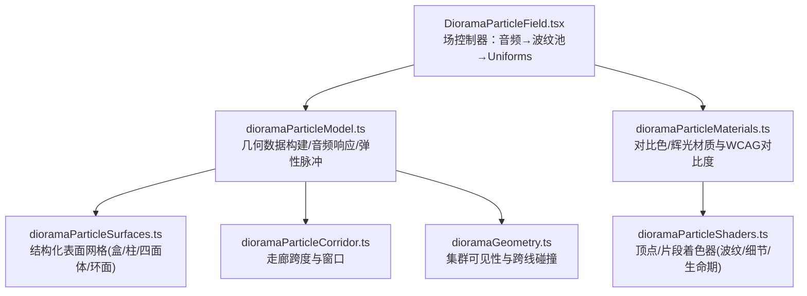
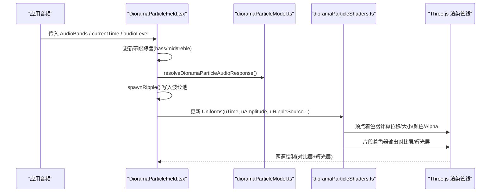
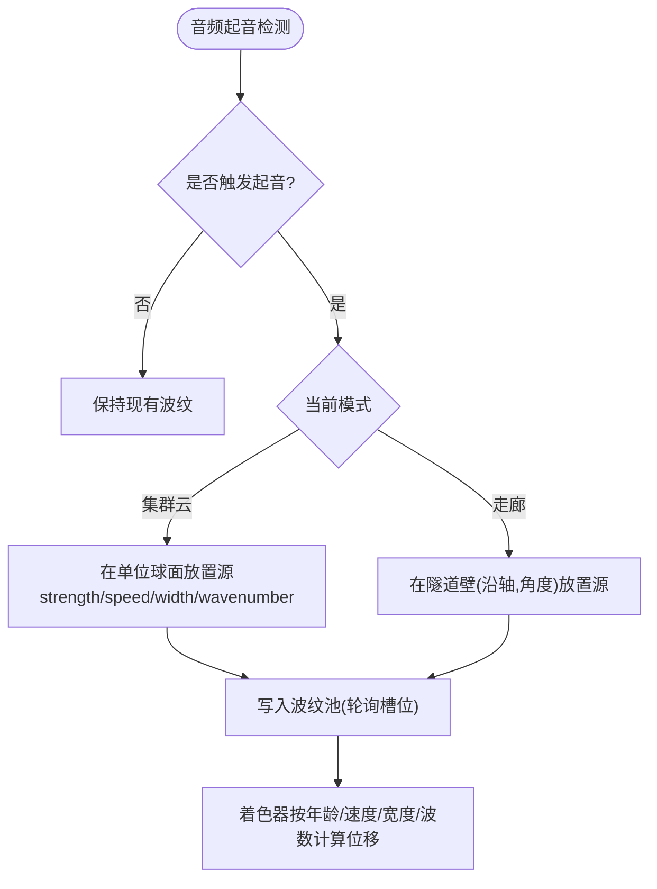
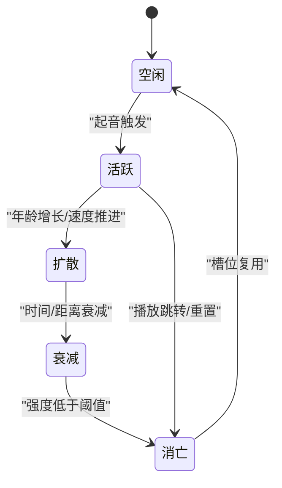
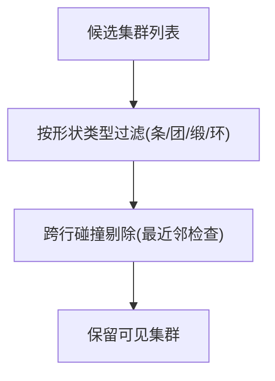
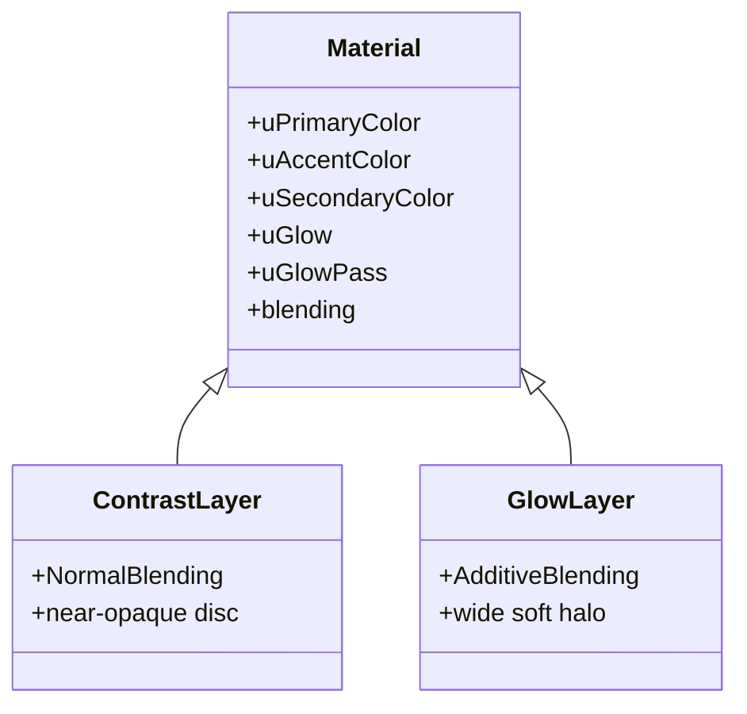
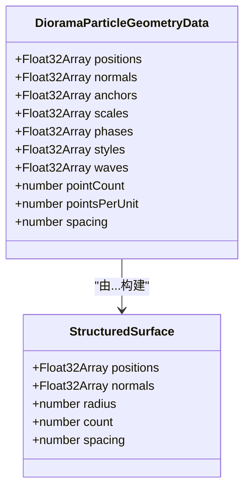
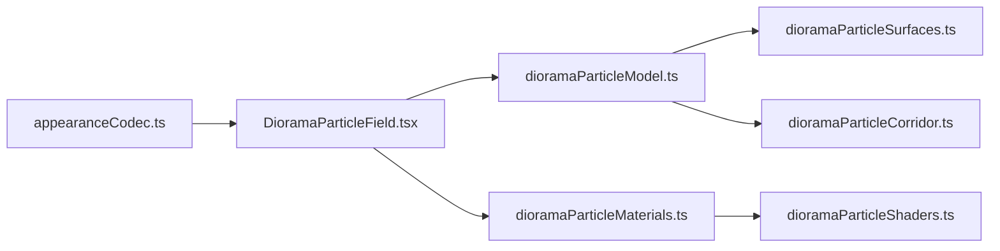

# 粒子系统

<cite>
**本文引用的文件**   
- [dioramaParticleModel.ts](file://src/components/visualizer/diorama/dioramaParticleModel.ts)
- [dioramaGeometry.ts](file://src/components/visualizer/diorama/dioramaGeometry.ts)
- [dioramaParticleCorridor.ts](file://src/components/visualizer/diorama/dioramaParticleCorridor.ts)
- [dioramaParticleSurfaces.ts](file://src/components/visualizer/diorama/dioramaParticleSurfaces.ts)
- [dioramaParticleMaterials.ts](file://src/components/visualizer/diorama/dioramaParticleMaterials.ts)
- [dioramaParticleShaders.ts](file://src/components/visualizer/diorama/dioramaParticleShaders.ts)
- [DioramaParticleField.tsx](file://src/components/visualizer/diorama/DioramaParticleField.tsx)
- [appearanceCodec.ts](file://src/utils/appearanceCodec.ts)
</cite>

## 目录
1. [引言](#引言)
2. [项目结构](#项目结构)
3. [核心组件](#核心组件)
4. [架构总览](#架构总览)
5. [详细组件分析](#详细组件分析)
6. [依赖关系分析](#依赖关系分析)
7. [性能与优化](#性能与优化)
8. [故障排查指南](#故障排查指南)
9. [结论](#结论)
10. [附录：配置参数与调优清单](#附录配置参数与调优清单)

## 引言
本文面向 Diorama 模式的粒子系统，系统性说明其发射器设计、生命周期管理、碰撞检测、材质与着色、以及性能优化策略。该系统以“音频驱动 + GPU 自演化”为核心：CPU 仅负责将音频事件转化为有限数量的波纹源，GPU 在顶点/片段着色器中完成位移、衰减、发光和颜色渐变等视觉效果；渲染采用单缓冲点云 + 双层材质（对比层 + 辉光层）实现实例化批处理绘制。

## 项目结构
Diorama 粒子系统位于可视化模块的 diorama 子目录，按职责拆分为几何生成、通道走廊、结构化表面、材质与着色、场控制器等文件：

**图表来源**
- [DioramaParticleField.tsx:169-383](file://src/components/visualizer/diorama/DioramaParticleField.tsx#L169-L383)
- [dioramaParticleModel.ts:30-73](file://src/components/visualizer/diorama/dioramaParticleModel.ts#L30-L73)
- [dioramaParticleSurfaces.ts:207-242](file://src/components/visualizer/diorama/dioramaParticleSurfaces.ts#L207-L242)
- [dioramaParticleCorridor.ts:36-100](file://src/components/visualizer/diorama/dioramaParticleCorridor.ts#L36-L100)
- [dioramaGeometry.ts:68-86](file://src/components/visualizer/diorama/dioramaGeometry.ts#L68-L86)
- [dioramaParticleMaterials.ts:117-178](file://src/components/visualizer/diorama/dioramaParticleMaterials.ts#L117-L178)
- [dioramaParticleShaders.ts:56-360](file://src/components/visualizer/diorama/dioramaParticleShaders.ts#L56-L360)

**章节来源**
- [DioramaParticleField.tsx:1-67](file://src/components/visualizer/diorama/DioramaParticleField.tsx#L1-L67)
- [dioramaParticleModel.ts:1-27](file://src/components/visualizer/diorama/dioramaParticleModel.ts#L1-L27)

## 核心组件
- 场控制器：订阅音频带信号，维护波纹池、流动时间、弹性脉冲与形成状态，每帧更新 Uniforms 并触发两次绘制（对比层 + 可选辉光层）。
- 几何模型：统一属性布局，支持“集群云”和“路径走廊”两种模式，提供波纹带宽上限、音频响应与弹性步进。
- 结构化表面：为不同基元（盒、柱、四面体、环面）生成连续法向的焊接网格，保证大振幅下不撕裂。
- 走廊：沿相机路径生成固定半径的圆柱段，确保无缝衔接与相位稳定。
- 材质与着色：双材质共享着色器，实现对比度自适应、透明度混合、发光叠加与颜色渐变。
- 几何可见性：基于形状类型与可视开关过滤，并进行跨行聚类碰撞剔除。

**章节来源**
- [DioramaParticleField.tsx:169-383](file://src/components/visualizer/diorama/DioramaParticleField.tsx#L169-L383)
- [dioramaParticleModel.ts:49-73](file://src/components/visualizer/diorama/dioramaParticleModel.ts#L49-L73)
- [dioramaParticleSurfaces.ts:207-242](file://src/components/visualizer/diorama/dioramaParticleSurfaces.ts#L207-L242)
- [dioramaParticleCorridor.ts:36-100](file://src/components/visualizer/diorama/dioramaParticleCorridor.ts#L36-L100)
- [dioramaParticleMaterials.ts:117-178](file://src/components/visualizer/diorama/dioramaParticleMaterials.ts#L117-L178)
- [dioramaGeometry.ts:68-86](file://src/components/visualizer/diorama/dioramaGeometry.ts#L68-L86)

## 架构总览
下图展示从音频输入到最终像素输出的完整流程，强调 CPU/GPU 边界与关键数据结构。

**图表来源**
- [DioramaParticleField.tsx:249-362](file://src/components/visualizer/diorama/DioramaParticleField.tsx#L249-L362)
- [dioramaParticleModel.ts:346-381](file://src/components/visualizer/diorama/dioramaParticleModel.ts#L346-L381)
- [dioramaParticleShaders.ts:56-360](file://src/components/visualizer/diorama/dioramaParticleShaders.ts#L56-L360)

## 详细组件分析

### 粒子发射器设计模式
系统提供两类“发射器”：
- 点源发射：在集群模式下，每个波纹源对应单位球面上的一个点，随时间扩散并在形状表面产生弹性波前。
- 面源/体积发射：走廊模式下，波纹源位于隧道壁的参数空间 (沿轴, 角度)，沿周向与轴向传播，形成连续的环形波前。

两者共用同一套波纹包络函数，区别仅在距离度量空间：
- 集群模式：三维欧氏距离。
- 走廊模式：隧道壁上的二维测地距离（经角度包裹）。

**图表来源**
- [DioramaParticleField.tsx:104-143](file://src/components/visualizer/diorama/DioramaParticleField.tsx#L104-L143)
- [dioramaParticleShaders.ts:119-173](file://src/components/visualizer/diorama/dioramaParticleShaders.ts#L119-L173)

**章节来源**
- [DioramaParticleField.tsx:104-143](file://src/components/visualizer/diorama/DioramaParticleField.tsx#L104-L143)
- [dioramaParticleModel.ts:306-328](file://src/components/visualizer/diorama/dioramaParticleModel.ts#L306-L328)
- [dioramaParticleShaders.ts:119-173](file://src/components/visualizer/diorama/dioramaParticleShaders.ts#L119-L173)

### 粒子生命周期管理
生命周期包含出生条件、运动轨迹、衰减动画与死亡清理：
- 出生条件：三频段（低音/中音/高音）各自独立跟踪起音，触发时按频段特性生成波纹源。
- 运动轨迹：由“年龄×速度”决定波前位置，结合正弦振荡模拟弹性回弹；同时叠加低频“呼吸”与高频“细节”。
- 衰减动画：高斯包络控制宽度，指数衰减控制时间与距离，避免波前过早消失或无限延续。
- 死亡清理：波纹池使用固定槽位轮询覆盖，旧源被新源自然淘汰；播放跳转/循环时重置波纹池与流动时间，避免“未来出生”的源导致冻结。

**图表来源**
- [DioramaParticleField.tsx:249-300](file://src/components/visualizer/diorama/DioramaParticleField.tsx#L249-L300)
- [dioramaParticleShaders.ts:119-126](file://src/components/visualizer/diorama/dioramaParticleShaders.ts#L119-L126)

**章节来源**
- [DioramaParticleField.tsx:249-300](file://src/components/visualizer/diorama/DioramaParticleField.tsx#L249-L300)
- [dioramaParticleShaders.ts:119-126](file://src/components/visualizer/diorama/dioramaParticleShaders.ts#L119-L126)

### 碰撞检测算法
- 边界检测：通过“远端淡入/近端消散”的生命期函数，根据点到相机距离平滑控制 Alpha，避免硬切边。
- 障碍物碰撞：对“集群云”模式进行跨行聚类碰撞剔除，防止相邻歌词行的独立云团重叠成亮斑。
- 粒子间相互作用：不直接做 O(N^2) 碰撞，而是通过“波纹场”间接作用——多个波纹叠加形成连续波前，避免随机散射。

**图表来源**
- [dioramaGeometry.ts:68-86](file://src/components/visualizer/diorama/dioramaGeometry.ts#L68-L86)

**章节来源**
- [dioramaGeometry.ts:68-86](file://src/components/visualizer/diorama/dioramaGeometry.ts#L68-L86)
- [dioramaParticleShaders.ts:101-109](file://src/components/visualizer/diorama/dioramaParticleShaders.ts#L101-L109)

### 粒子材质系统
- 透明度混合：对比层使用 NormalBlending，辉光层使用 AdditiveBlending，分别承担可读性与发光效果。
- 发光效果：辉光层尺寸更大、强度受滑块控制，且仅对“实际位移区域”发光，避免静止点误发光。
- 颜色渐变：主色/强调色/次色在三相余弦权重下混合，热点区随能量向强调色偏移；频谱质心影响热点色选择。
- 对比度自适应：基于 WCAG 相对亮度，对主题色进行最小修正，确保在不同背景下的可读性。

**图表来源**
- [dioramaParticleMaterials.ts:143-168](file://src/components/visualizer/diorama/dioramaParticleMaterials.ts#L143-L168)
- [dioramaParticleShaders.ts:312-360](file://src/components/visualizer/diorama/dioramaParticleShaders.ts#L312-L360)

**章节来源**
- [dioramaParticleMaterials.ts:17-115](file://src/components/visualizer/diorama/dioramaParticleMaterials.ts#L17-L115)
- [dioramaParticleMaterials.ts:143-178](file://src/components/visualizer/diorama/dioramaParticleMaterials.ts#L143-L178)
- [dioramaParticleShaders.ts:282-309](file://src/components/visualizer/diorama/dioramaParticleShaders.ts#L282-L309)

### 几何与表面建模
- 统一属性布局：positions/normals/anchors/scales/phases/styles/waves，使两种模式共享同一着色器。
- 结构化表面：盒壳、柱面、四面体三角网格、环面均保证法向连续性，避免大振幅撕裂。
- 密度与采样：按预算分配行列/步数，考虑 yStretch 后仍保持均匀采样；spacing 用于限制最大波数，防止混叠。

**图表来源**
- [dioramaParticleModel.ts:49-73](file://src/components/visualizer/diorama/dioramaParticleModel.ts#L49-L73)
- [dioramaParticleSurfaces.ts:20-40](file://src/components/visualizer/diorama/dioramaParticleSurfaces.ts#L20-L40)

**章节来源**
- [dioramaParticleModel.ts:114-167](file://src/components/visualizer/diorama/dioramaParticleModel.ts#L114-L167)
- [dioramaParticleModel.ts:185-267](file://src/components/visualizer/diorama/dioramaParticleModel.ts#L185-L267)
- [dioramaParticleSurfaces.ts:107-205](file://src/components/visualizer/diorama/dioramaParticleSurfaces.ts#L107-L205)

### 走廊与路径
- 走廊跨度：每行生成一段固定半径的圆柱段，左右/上向量插值保证方向一致。
- 窗口扩展：超出歌词范围的路径继续延伸，避免镜头看到“开口”，并保持相位连续。
- 索引解析：相对于窗口自身分段解析，避免歌曲切换时新旧走廊互相串扰。

**章节来源**
- [dioramaParticleCorridor.ts:36-100](file://src/components/visualizer/diorama/dioramaParticleCorridor.ts#L36-L100)

## 依赖关系分析
- DioramaParticleField.tsx 依赖 dioramaParticleModel.ts 提供的几何构建、音频响应与弹性步进。
- dioramaParticleModel.ts 依赖 dioramaParticleSurfaces.ts 的结构化表面与 dioramaParticleCorridor.ts 的走廊跨度。
- dioramaParticleMaterials.ts 与 dioramaParticleShaders.ts 共同定义材质与着色逻辑。
- appearanceCodec.ts 压缩/解压 Diorama 设置，包括粒子密度、缩放、发光强度等。

**图表来源**
- [DioramaParticleField.tsx:1-67](file://src/components/visualizer/diorama/DioramaParticleField.tsx#L1-L67)
- [dioramaParticleModel.ts:1-27](file://src/components/visualizer/diorama/dioramaParticleModel.ts#L1-L27)
- [appearanceCodec.ts:149-183](file://src/utils/appearanceCodec.ts#L149-L183)

**章节来源**
- [DioramaParticleField.tsx:1-67](file://src/components/visualizer/diorama/DioramaParticleField.tsx#L1-L67)
- [appearanceCodec.ts:149-183](file://src/utils/appearanceCodec.ts#L149-L183)

## 性能与优化
- 实例化渲染：所有粒子使用单一 BufferGeometry 与两个 ShaderMaterial，减少 draw call。
- 批处理渲染：对比层与辉光层分别一次绘制，避免逐点状态切换。
- GPU 加速计算：位移、衰减、颜色与 Alpha 均在着色器中计算，CPU 仅维护波纹池与 Uniforms。
- 密度与波数上限：根据实际 lattice spacing 动态计算 uWaveNumberMax，避免混叠导致的随机散射。
- 纹理/细节门控：高频细节仅在已有波峰处叠加，避免无音乐时的噪声闪烁。
- 资源生命周期：geometry/material/glowMaterial 在卸载时释放，避免内存泄漏。

[本节为通用指导，不直接分析具体文件]

## 故障排查指南
- 画面撕裂/边缘开裂：检查结构化表面的法向连续性；确认未使用独立平面拼接。
- 走廊接缝可见：确保角度项为整数谐波或使用 corridorSurfaceDelta 包裹角度差。
- 粒子过亮/过暗：核对 sRGB 转换与对比度自适应；确认 uGlowPass 与 vReaction 的映射。
- 波纹不动/冻结：检查 flowTime 与播放时间连续性；跳转/循环时重置波纹池。
- 混叠/散射：确认 uWaveNumberMax 与实际 spacing 匹配，避免波长小于约 4 个格点。

**章节来源**
- [dioramaParticleSurfaces.ts:1-19](file://src/components/visualizer/diorama/dioramaParticleSurfaces.ts#L1-L19)
- [dioramaParticleShaders.ts:34-51](file://src/components/visualizer/diorama/dioramaParticleShaders.ts#L34-L51)
- [dioramaParticleShaders.ts:320-337](file://src/components/visualizer/diorama/dioramaParticleShaders.ts#L320-L337)
- [DioramaParticleField.tsx:270-286](file://src/components/visualizer/diorama/DioramaParticleField.tsx#L270-L286)

## 结论
Diorama 粒子系统通过“音频事件→波纹池→GPU 自演化”的架构，在保证视觉质量的同时实现了高性能渲染。其关键优势在于：
- 统一的几何属性布局与着色器，简化了模式切换。
- 严格的法向连续性与角度包裹，避免大振幅撕裂与接缝。
- 对比度自适应与双层材质，提升可读性与视觉层次。
- 基于 lattice spacing 的波数上限，杜绝混叠。
- 明确的资源生命周期与批处理绘制，保障稳定性与性能。

[本节为总结性内容，不直接分析具体文件]

## 附录：配置参数与调优清单
- 粒子密度：控制每单元点数，影响波纹细节与性能。
- 粒子缩放：整体缩放系数，影响点尺寸与视觉尺度。
- 粒子发光：开关与强度，控制辉光层可见性与叠加强度。
- 背景粒子周长/径向：背景装饰相关参数（若启用）。
- 发光/灵魂/渐变/关键词着色：各视觉效果的开关与强度。
- 相机速度/运动量/音频反应：影响走廊流动与整体节奏。

上述参数通过 appearanceCodec.ts 进行压缩/解压，便于持久化与主题切换。

**章节来源**
- [appearanceCodec.ts:149-183](file://src/utils/appearanceCodec.ts#L149-L183)