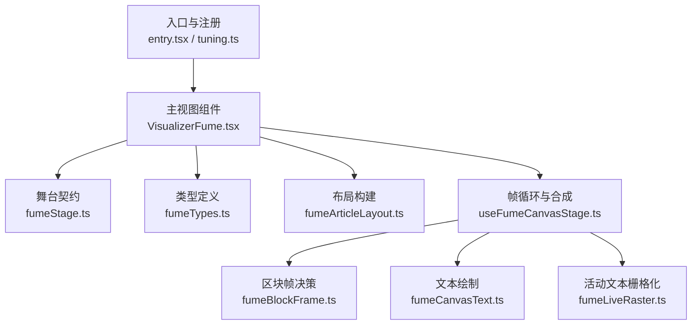
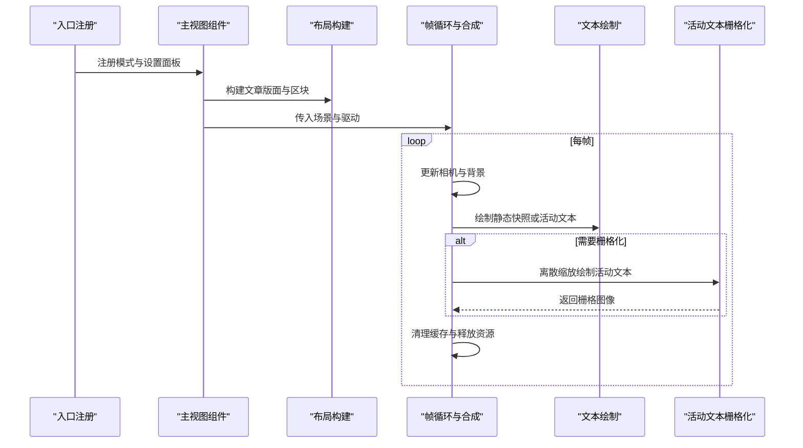
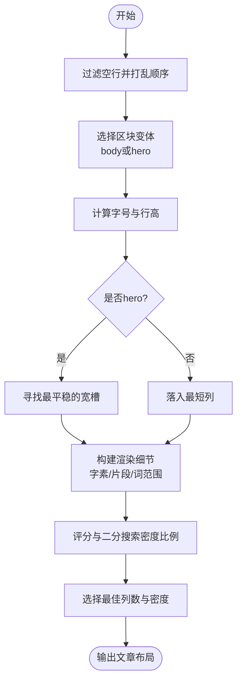
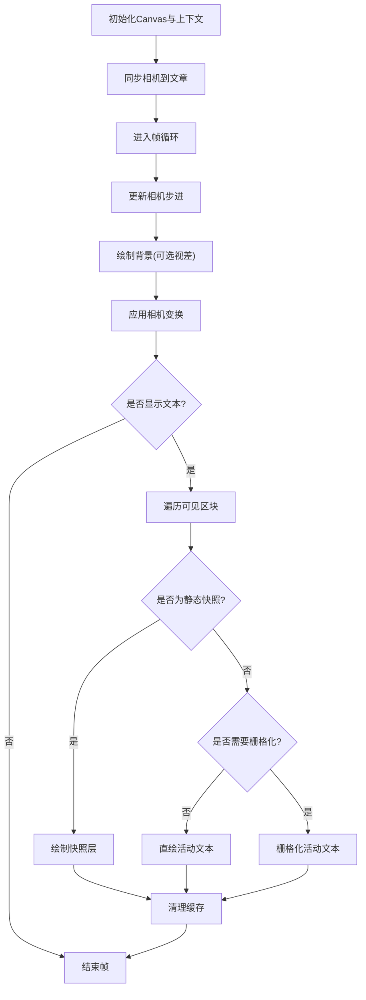
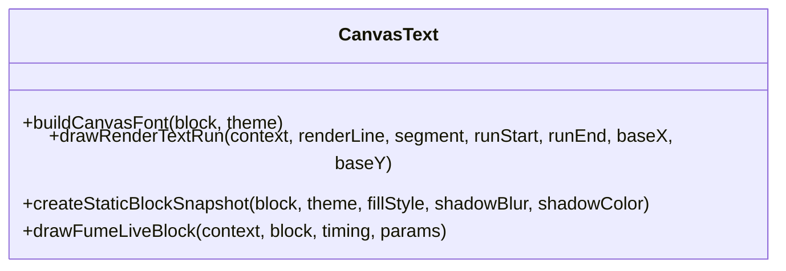
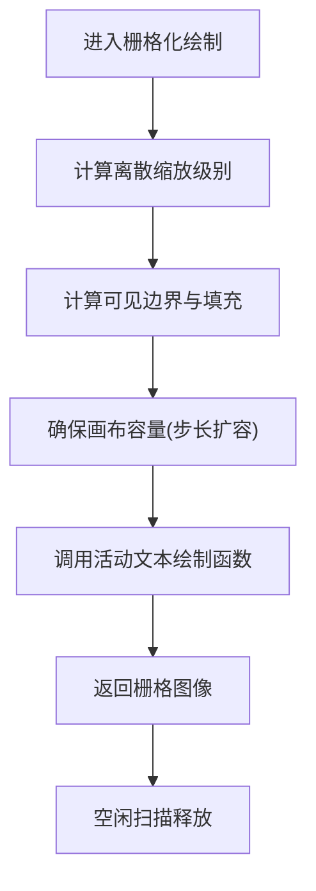
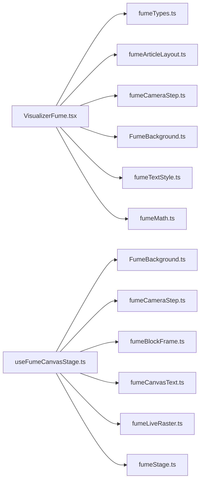

# Fume模式实现

<cite>
**本文引用的文件**   
- [entry.tsx](file://src/components/visualizer/fume/entry.tsx)
- [tuning.ts](file://src/components/visualizer/fume/tuning.ts)
- [VisualizerFume.tsx](file://src/components/visualizer/fume/VisualizerFume.tsx)
- [fumeTypes.ts](file://src/components/visualizer/fume/fumeTypes.ts)
- [fumeStage.ts](file://src/components/visualizer/fume/fumeStage.ts)
- [useFumeCanvasStage.ts](file://src/components/visualizer/fume/useFumeCanvasStage.ts)
- [fumeArticleLayout.ts](file://src/components/visualizer/fume/fumeArticleLayout.ts)
- [fumeBlockFrame.ts](file://src/components/visualizer/fume/fumeBlockFrame.ts)
- [fumeCanvasText.ts](file://src/components/visualizer/fume/fumeCanvasText.ts)
- [fumeLiveRaster.ts](file://src/components/visualizer/fume/fumeLiveRaster.ts)
</cite>

## 目录
1. [简介](#简介)
2. [项目结构](#项目结构)
3. [核心组件](#核心组件)
4. [架构总览](#架构总览)
5. [详细组件分析](#详细组件分析)
6. [依赖关系分析](#依赖关系分析)
7. [性能与优化](#性能与优化)
8. [故障排查指南](#故障排查指南)
9. [结论](#结论)
10. [附录：调优参数说明](#附录：调优参数说明)

## 简介
本文件为“Fume可视化模式”的完整技术文档。该模式将歌词文本组织成“文章式版面”，通过相机在版面中移动，配合背景、纸张纹理和逐字打印效果，形成具有沉浸感的视觉体验。文档重点覆盖以下方面：
- 舞台管理系统：场景层次结构、对象池化与内存优化
- 文本渲染系统：字形布局、笔画描边、动态变形（逐字打印、颜色拖尾、发光）
- 颜色混合算法：主题色、强调色、透明度混合与亮度映射
- 实时性能优化：增量更新、栅格化缓存、阴影模糊量化、视口裁剪
- 自定义烟雾效果与物理参数调优：基于现有可调参数的实践建议

需要特别说明的是：当前仓库中的Fume模式以Canvas 2D文本渲染为主，并未实现流体动力学模拟、Navier-Stokes方程求解或体积渲染等真实烟雾物理计算。因此，文档不会虚构相关算法；若未来扩展此类能力，可在现有舞台管线之上叠加GPU着色器与密度场通道。

## 项目结构
Fume模式位于可视化子系统下，采用按功能模块划分的文件组织方式：
- 入口与注册：定义可视化模式元数据、预览种子、设置面板注入
- 类型与契约：统一数据结构、相机状态、布局指标
- 舞台驱动：帧循环、相机步进、背景绘制、文本层合成
- 布局构建：文章版面生成、区块划分、行列度量
- 文本绘制：逐字打印、颜色过渡、发光与描边
- 性能优化：活动文本栅格化、快照缓存、空闲释放

图表来源
- [entry.tsx:10-24](file://src/components/visualizer/fume/entry.tsx#L10-L24)
- [tuning.ts:1-5](file://src/components/visualizer/fume/tuning.ts#L1-L5)
- [VisualizerFume.tsx:43-295](file://src/components/visualizer/fume/VisualizerFume.tsx#L43-L295)
- [fumeStage.ts:11-49](file://src/components/visualizer/fume/fumeStage.ts#L11-L49)
- [fumeTypes.ts:8-160](file://src/components/visualizer/fume/fumeTypes.ts#L8-L160)
- [fumeArticleLayout.ts:449-582](file://src/components/visualizer/fume/fumeArticleLayout.ts#L449-L582)
- [useFumeCanvasStage.ts:25-286](file://src/components/visualizer/fume/useFumeCanvasStage.ts#L25-L286)
- [fumeBlockFrame.ts:17-176](file://src/components/visualizer/fume/fumeBlockFrame.ts#L17-L176)
- [fumeCanvasText.ts:15-409](file://src/components/visualizer/fume/fumeCanvasText.ts#L15-L409)
- [fumeLiveRaster.ts:55-119](file://src/components/visualizer/fume/fumeLiveRaster.ts#L55-L119)

章节来源
- [entry.tsx:10-24](file://src/components/visualizer/fume/entry.tsx#L10-L24)
- [tuning.ts:1-5](file://src/components/visualizer/fume/tuning.ts#L1-L5)
- [VisualizerFume.tsx:43-295](file://src/components/visualizer/fume/VisualizerFume.tsx#L43-L295)

## 核心组件
- 入口与注册：定义Fume模式的标识、顺序、标签、预览种子、设置面板注入与重置逻辑
- 主视图组件：负责歌词运行时数据、布局构建、相机状态、舞台场景与驱动的装配，以及子标题叠加层
- 舞台契约：定义场景数据与驱动接口，提供音频电平读取工具
- 类型定义：区块、渲染行、片段、相机目标、布局指标等共享结构
- 布局构建：根据视口、主题、歌词密度自动选择列数与密度比例，生成文章版面与区块
- 帧循环与合成：每帧更新相机、绘制背景、绘制静态快照与活动文本，管理缓存与释放
- 区块帧决策：判断区块是否可见、计算等待/活跃/已过时间线样式与发光基值
- 文本绘制：逐字打印、颜色过渡、发光与描边、打印印章动画
- 活动文本栅格化：避免频繁改变字体尺寸导致的Linux端字体缓存泄漏，使用离散缩放级别与增量画布

章节来源
- [entry.tsx:10-24](file://src/components/visualizer/fume/entry.tsx#L10-L24)
- [VisualizerFume.tsx:43-295](file://src/components/visualizer/fume/VisualizerFume.tsx#L43-L295)
- [fumeStage.ts:11-49](file://src/components/visualizer/fume/fumeStage.ts#L11-L49)
- [fumeTypes.ts:8-160](file://src/components/visualizer/fume/fumeTypes.ts#L8-L160)
- [fumeArticleLayout.ts:449-582](file://src/components/visualizer/fume/fumeArticleLayout.ts#L449-L582)
- [useFumeCanvasStage.ts:25-286](file://src/components/visualizer/fume/useFumeCanvasStage.ts#L25-L286)
- [fumeBlockFrame.ts:17-176](file://src/components/visualizer/fume/fumeBlockFrame.ts#L17-L176)
- [fumeCanvasText.ts:15-409](file://src/components/visualizer/fume/fumeCanvasText.ts#L15-L409)
- [fumeLiveRaster.ts:55-119](file://src/components/visualizer/fume/fumeLiveRaster.ts#L55-L119)

## 架构总览
Fume模式的整体流程如下：
1. 入口注册模式并注入设置面板
2. 主视图组件组装运行时数据、主题、布局与相机状态
3. 布局构建器生成文章版面与区块
4. 帧循环驱动相机步进，绘制背景与文本层
5. 静态区块使用快照缓存，活动区块使用栅格化或直绘
6. 子标题叠加层显示当前行、即将行与翻译字幕

图表来源
- [entry.tsx:10-24](file://src/components/visualizer/fume/entry.tsx#L10-L24)
- [VisualizerFume.tsx:150-295](file://src/components/visualizer/fume/VisualizerFume.tsx#L150-L295)
- [fumeArticleLayout.ts:449-582](file://src/components/visualizer/fume/fumeArticleLayout.ts#L449-L582)
- [useFumeCanvasStage.ts:91-286](file://src/components/visualizer/fume/useFumeCanvasStage.ts#L91-L286)
- [fumeCanvasText.ts:118-409](file://src/components/visualizer/fume/fumeCanvasText.ts#L118-L409)
- [fumeLiveRaster.ts:58-119](file://src/components/visualizer/fume/fumeLiveRaster.ts#L58-L119)

## 详细组件分析

### 入口与注册
- 定义可视化模式标识、顺序、标签键与回退标签
- 指定预览种子与起始偏移
- 注入强类型设置与设置面板
- 提供重置设置回调，恢复默认配置

章节来源
- [entry.tsx:10-24](file://src/components/visualizer/fume/entry.tsx#L10-L24)
- [tuning.ts:1-5](file://src/components/visualizer/fume/tuning.ts#L1-L5)

### 主视图组件
职责包括：
- 解析运行时数据：当前行、最近完成行、即将行
- 合并与校验Fume调优参数
- 构建布局主题与布局调优
- 防抖与缓存文章布局
- 构建背景场景与概览相机
- 组装舞台场景与驱动
- 挂载Canvas阶段钩子
- 渲染Shell与子标题叠加层

关键行为：
- 布局重建使用requestAnimationFrame与setTimeout组合，首次构建无延迟，后续有防抖
- 布局缓存键包含视口、主题字体信息、歌词字体缩放与heroScale
- 背景场景根据文章宽度/高度与视口计算世界尺寸
- 概览相机用于初始展示整篇文章

章节来源
- [VisualizerFume.tsx:43-295](file://src/components/visualizer/fume/VisualizerFume.tsx#L43-L295)

### 舞台契约
- 场景数据：文章布局、歌词、主题、视口、背景场景、概览相机、过场参数、相机速度与跟踪模式、发光强度、背景对象不透明度、打印符号开关、文本保持比例、显示开关、静态模式
- 驱动数据：当前时间、音频功率、音频频段、相机状态、获取行索引回调、首次打印内容回调
- 音频电平读取工具：从驱动中提取功率与各频段值

章节来源
- [fumeStage.ts:11-49](file://src/components/visualizer/fume/fumeStage.ts#L11-L49)

### 类型定义
- 视口尺寸、片段元数据、词范围、渲染行切片、渲染片段切片
- 区块：包含源行索引、变体(body/hero)、几何尺寸、字体大小、行高、预排版、布局、字素数组、片段元数据、词范围、索引映射、渲染行
- 文章布局：宽高、视口高度、列数、间距、纸张边界、区块集合、按源行索引映射、时序区块、首末可渲染时间
- 相机目标与重定向状态：位置、速度、焦点、缩放、桥接模式与路点
- 视图目标：位置与缩放

章节来源
- [fumeTypes.ts:8-160](file://src/components/visualizer/fume/fumeTypes.ts#L8-L160)

### 布局构建
- 自动选择区块变体：根据歌词长度、是否副歌、居中程度与随机扰动决定body或hero
- 字体大小选择：依据密度与变体计算基础字号，再乘以歌词字体缩放与密度缩放
- 列数与密度搜索：尝试不同列数与密度比例，二分逼近目标高度，评分函数考虑覆盖度与溢出惩罚
- 放置策略：hero区块优先占据宽槽，body区块落入最短列
- 渲染细节：构建字素、片段、词范围、颜色范围、渲染行与偏移
- 输出文章布局：包含区块集合、时序信息与首末可渲染时间

图表来源
- [fumeArticleLayout.ts:27-136](file://src/components/visualizer/fume/fumeArticleLayout.ts#L27-L136)
- [fumeArticleLayout.ts:169-447](file://src/components/visualizer/fume/fumeArticleLayout.ts#L169-L447)
- [fumeArticleLayout.ts:449-582](file://src/components/visualizer/fume/fumeArticleLayout.ts#L449-L582)

章节来源
- [fumeArticleLayout.ts:27-136](file://src/components/visualizer/fume/fumeArticleLayout.ts#L27-L136)
- [fumeArticleLayout.ts:169-447](file://src/components/visualizer/fume/fumeArticleLayout.ts#L169-L447)
- [fumeArticleLayout.ts:449-582](file://src/components/visualizer/fume/fumeArticleLayout.ts#L449-L582)

### 帧循环与合成
- 初始化Canvas尺寸与设备像素比
- 同步相机到文章布局
- 每帧计算dt并更新相机步进
- 绘制背景（支持视差）
- 应用相机变换后绘制文本层
- 静态区块使用快照缓存，活动区块使用直绘或栅格化
- 清理活动栅格与快照缓存

图表来源
- [useFumeCanvasStage.ts:53-286](file://src/components/visualizer/fume/useFumeCanvasStage.ts#L53-L286)

章节来源
- [useFumeCanvasStage.ts:53-286](file://src/components/visualizer/fume/useFumeCanvasStage.ts#L53-L286)

### 区块帧决策
- 计算等待/活跃/已过时间线的样式与不透明度
- 计算基线偏移、行结束时间、通过截止时间与颜色拖尾时长
- 判断静态状态：waiting/passed或null（活动）
- 计算发光基值：活跃发光增强与已过文本发光基底
- 生成静态图层：可能包含两层（标准与淡化）交叉淡入淡出

章节来源
- [fumeBlockFrame.ts:17-176](file://src/components/visualizer/fume/fumeBlockFrame.ts#L17-L176)

### 文本绘制
- 构建Canvas字体规格
- 绘制渲染文本运行：按片段裁剪区域绘制文字
- 创建静态区块快照：按填充、阴影模糊与颜色生成离屏Canvas
- 绘制活动区块：逐字打印、颜色过渡、发光与描边、打印印章动画
- 阴影模糊量化：避免Linux端字体缓存泄漏

图表来源
- [fumeCanvasText.ts:15-409](file://src/components/visualizer/fume/fumeCanvasText.ts#L15-L409)

章节来源
- [fumeCanvasText.ts:15-409](file://src/components/visualizer/fume/fumeCanvasText.ts#L15-L409)

### 活动文本栅格化
- 目的：避免在相机缩放变化时频繁请求新字体尺寸导致Linux端字体缓存泄漏
- 方法：将活动文本绘制到独立Canvas，使用离散缩放级别（每倍频程48级），仅绘制可见区域
- 生命周期：按需扩容画布，空闲后释放

图表来源
- [fumeLiveRaster.ts:55-119](file://src/components/visualizer/fume/fumeLiveRaster.ts#L55-L119)

章节来源
- [fumeLiveRaster.ts:55-119](file://src/components/visualizer/fume/fumeLiveRaster.ts#L55-L119)

## 依赖关系分析
- VisualizerFume依赖：
  - 类型定义：FumeArticleLayout、ViewportSize、CameraViewTarget等
  - 布局构建：buildArticleLayout、buildLayoutCacheKey
  - 相机：resolveArticleOverviewCamera、createFumeCameraState
  - 背景：buildFumeBackgroundScene
  - 文本样式：resolveFumePassedFadeDuration
  - 数学工具：clamp
- useFumeCanvasStage依赖：
  - 背景绘制：drawFumeBackground
  - 相机步进：stepFumeCamera、syncFumeCameraToArticle、resolveFumeBackgroundView
  - 区块帧：isFumeBlockOnScreen、resolveFumeBlockTiming、resolveFumeGlowBases、resolveFumeStaticLayers
  - 文本绘制：createStaticBlockSnapshot、drawFumeLiveBlock
  - 栅格化：FumeLiveRaster
  - 音频电平：readFumeAudioLevels

图表来源
- [VisualizerFume.tsx:1-24](file://src/components/visualizer/fume/VisualizerFume.tsx#L1-L24)
- [useFumeCanvasStage.ts:1-10](file://src/components/visualizer/fume/useFumeCanvasStage.ts#L1-L10)

章节来源
- [VisualizerFume.tsx:1-24](file://src/components/visualizer/fume/VisualizerFume.tsx#L1-L24)
- [useFumeCanvasStage.ts:1-10](file://src/components/visualizer/fume/useFumeCanvasStage.ts#L1-L10)

## 性能与优化
- 布局缓存与防抖：
  - 布局缓存键忽略短生命周期播放状态，仅几何相关输入失效
  - 首次构建无延迟，后续构建使用防抖减少重复计算
- 视口裁剪与可见性检测：
  - 仅绘制屏幕附近区块，带overscan提升流畅度
- 静态快照缓存：
  - 对等待与已过区块使用离屏Canvas快照，按风格与缩放级别缓存
  - 空闲超过阈值释放底层存储，避免内存堆积
- 活动文本栅格化：
  - 离散缩放级别避免频繁字体尺寸变化导致的字体缓存泄漏
  - 增量扩容画布，减少分配开销
- 阴影模糊量化：
  - 量化阴影模糊半径，避免Linux端字体缓存泄漏
- 增量更新：
  - 每帧仅更新必要状态，避免全量重建
- 多线程与GPU加速：
  - 当前实现未使用Web Worker或WebGL；如需扩展，可在布局构建或文本测量阶段引入Worker，或将背景与体积效果迁移至GPU着色器

[本节为通用指导，不涉及具体文件分析]

## 故障排查指南
- Linux端字体缓存泄漏：
  - 现象：长时间运行后文件描述符增长
  - 原因：活动文本在连续缩放下频繁请求新字体尺寸
  - 解决：启用栅格化路径与阴影模糊量化
- 布局卡顿：
  - 现象：切换歌词或主题时出现明显延迟
  - 原因：布局重建频繁或列数/密度搜索耗时
  - 解决：检查布局缓存键是否合理，确认防抖生效，必要时降低densityScale搜索迭代次数
- 文本闪烁或错位：
  - 现象：打印过程中字形跳动或位置偏移
  - 原因：基线偏移与CJK处理不一致
  - 解决：核对baselineOffset计算与CJK分支
- 内存占用过高：
  - 现象：长时间运行后内存持续增长
  - 原因：快照或栅格画布未及时释放
  - 解决：确认空闲释放逻辑与Sweep周期

章节来源
- [useFumeCanvasStage.ts:289-299](file://src/components/visualizer/fume/useFumeCanvasStage.ts#L289-L299)
- [fumeLiveRaster.ts:106-119](file://src/components/visualizer/fume/fumeLiveRaster.ts#L106-L119)
- [fumeCanvasText.ts:378-382](file://src/components/visualizer/fume/fumeCanvasText.ts#L378-L382)

## 结论
Fume模式通过文章式布局与相机运动，结合逐字打印、颜色拖尾与发光效果，提供了沉浸式的歌词可视化体验。其核心优势在于：
- 清晰的舞台契约与模块化组件
- 高效的布局构建与缓存机制
- 针对Linux端的字体缓存泄漏防护
- 可扩展的设置系统与主题集成

由于当前实现未包含流体动力学模拟或体积渲染，若需扩展烟雾物理效果，建议在现有舞台管线之上增加GPU着色器通道与密度场计算，并保持与文本层的解耦。

[本节为总结性内容，不涉及具体文件分析]

## 附录：调优参数说明
以下为Fume模式的可调参数及其作用与建议：
- hidePrintSymbols：隐藏打印印章动画；适合追求简洁风格的场景
- disableGeometricBackground：禁用几何背景；适合需要突出文本的场景
- backgroundObjectOpacity：背景对象不透明度；建议0~1之间，过小会削弱氛围
- textHoldRatio：文本保持比例；控制已过文本的淡化节奏，1为标准保持，小于1为淡化
- cameraTrackingMode：相机跟踪模式；stepped为步进，smooth为平滑；根据音乐节奏选择
- cameraSpeed：相机速度；建议0.55~1.85，过快会导致阅读困难
- glowIntensity：发光强度；影响活跃与已过文本的发光效果，建议0~1.8
- heroScale：英雄区块缩放；影响hero区块的视觉权重，建议0.82~1.32

章节来源
- [VisualizerFume.tsx:119-134](file://src/components/visualizer/fume/VisualizerFume.tsx#L119-L134)