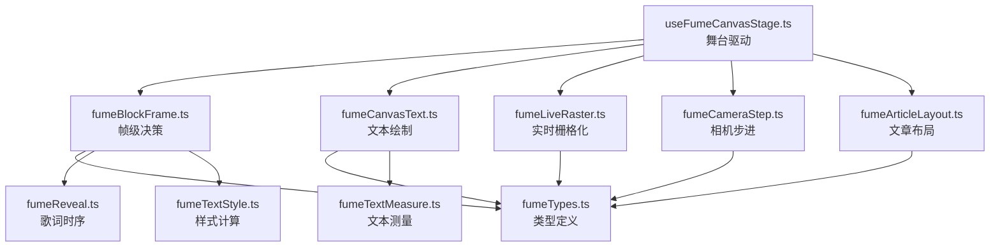
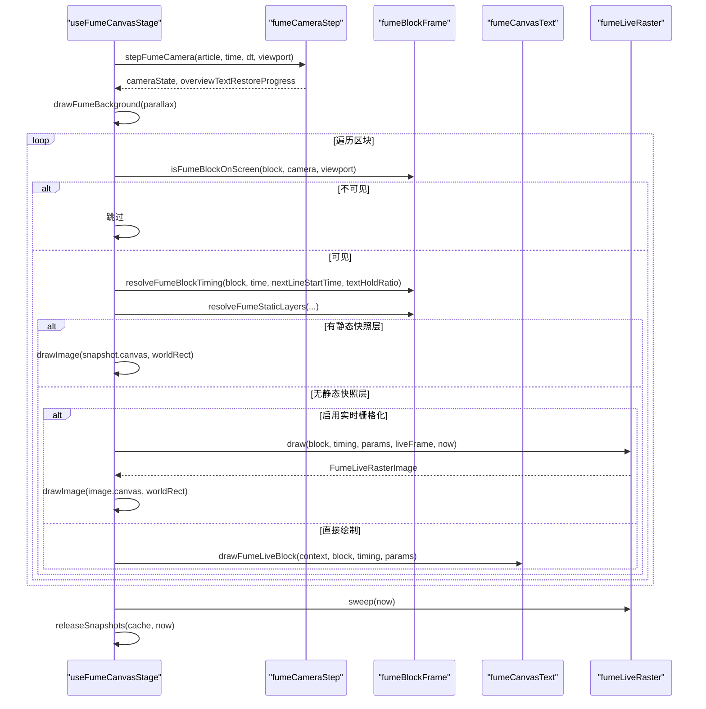
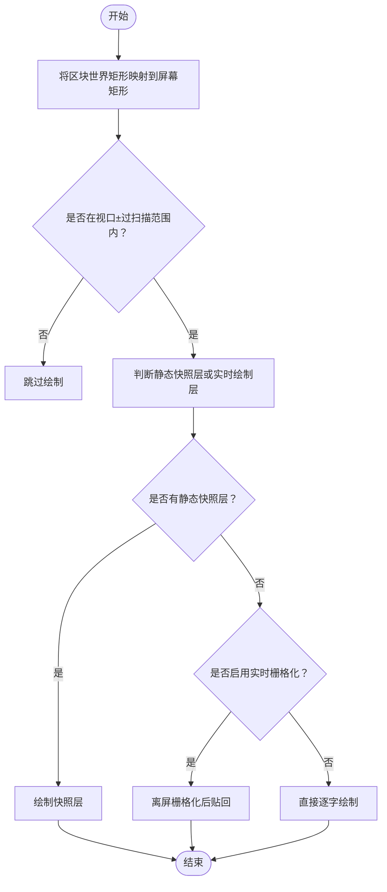
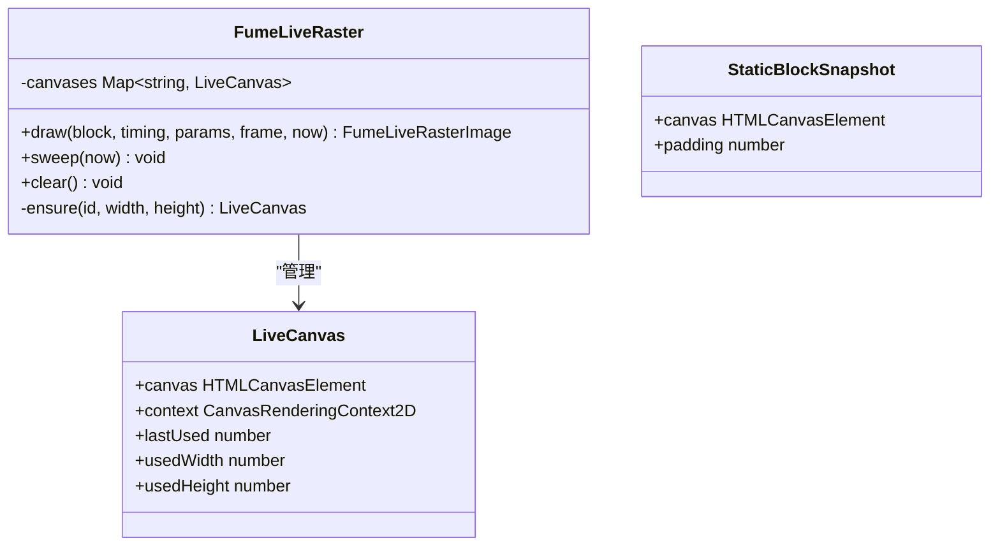
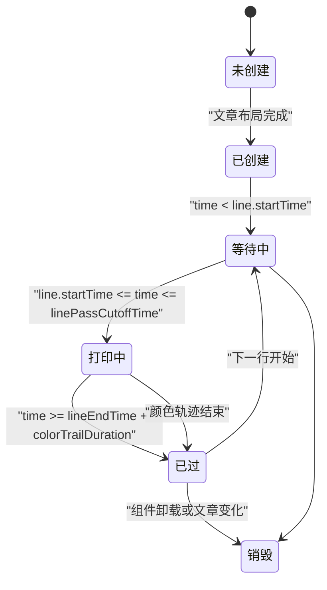
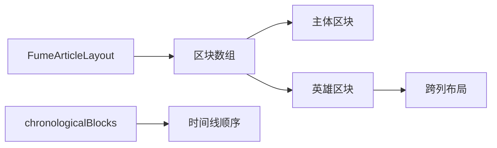
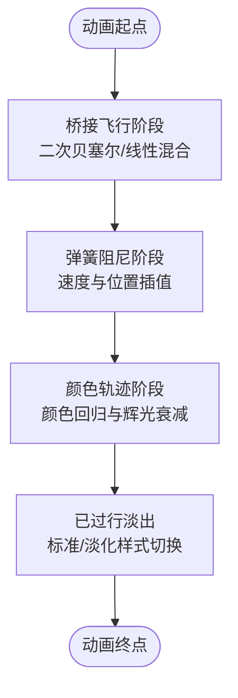
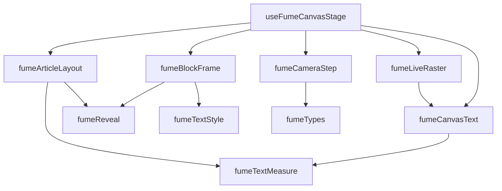

# 区块帧系统

<cite>
**本文引用的文件**   
- [fumeTypes.ts](file://src/components/visualizer/fume/fumeTypes.ts)
- [fumeArticleLayout.ts](file://src/components/visualizer/fume/fumeArticleLayout.ts)
- [fumeBlockFrame.ts](file://src/components/visualizer/fume/fumeBlockFrame.ts)
- [fumeCanvasText.ts](file://src/components/visualizer/fume/fumeCanvasText.ts)
- [fumeLiveRaster.ts](file://src/components/visualizer/fume/fumeLiveRaster.ts)
- [useFumeCanvasStage.ts](file://src/components/visualizer/fume/useFumeCanvasStage.ts)
- [fumeCameraStep.ts](file://src/components/visualizer/fume/fumeCameraStep.ts)
- [fumeReveal.ts](file://src/components/visualizer/fume/fumeReveal.ts)
- [fumeTextStyle.ts](file://src/components/visualizer/fume/fumeTextStyle.ts)
- [fumeTextMeasure.ts](file://src/components/visualizer/fume/fumeTextMeasure.ts)
</cite>

## 目录
1. [引言](#引言)
2. [项目结构](#项目结构)
3. [核心组件](#核心组件)
4. [架构总览](#架构总览)
5. [详细组件分析](#详细组件分析)
6. [依赖关系分析](#依赖关系分析)
7. [性能与优化](#性能与优化)
8. [故障排查指南](#故障排查指南)
9. [结论](#结论)

## 引言
本技术文档聚焦 Fume 模式的“区块帧系统”，围绕歌词可视化中的区块划分、视口裁剪、层次管理、可见性检测、帧缓冲机制、离屏绘制、纹理复用、内存池管理、区块生命周期、区块间依赖关系（父子层级、遮挡检测、排序）、动画系统（过渡效果、缓动函数、时间插值）以及性能优化与调试方法展开。目标是帮助开发者理解并扩展该子系统，同时为使用者提供可操作的排障与调优建议。

## 项目结构
Fume 区块帧系统位于视觉化模块的 fume 子目录中，采用按职责划分的模块化组织方式：
- 类型定义：统一区块、布局、相机、渲染切片等数据结构
- 文章布局：根据视口、主题和歌词生成多列块布局
- 帧级决策：计算每个区块的可见性、时序、静态快照层
- 文本测量与绘制：字形切分、行段测量、逐字绘制、打印特效
- 实时栅格化：避免频繁创建 Canvas，使用离散缩放级别复用离屏纹理
- 舞台驱动：React Hook 集成，负责每帧调度、背景绘制、相机步进、缓存回收
- 相机步进：目标选择、桥接飞行、弹簧阻尼、视差背景视图
- 歌词时序：词范围、逐字进度、通过判定、颜色轨迹
- 样式计算：已过行样式、淡出、活跃词色

**图表来源**
- [useFumeCanvasStage.ts:1-299](file://src/components/visualizer/fume/useFumeCanvasStage.ts#L1-L299)
- [fumeBlockFrame.ts:1-176](file://src/components/visualizer/fume/fumeBlockFrame.ts#L1-L176)
- [fumeCanvasText.ts:1-409](file://src/components/visualizer/fume/fumeCanvasText.ts#L1-L409)
- [fumeLiveRaster.ts:1-120](file://src/components/visualizer/fume/fumeLiveRaster.ts#L1-L120)
- [fumeCameraStep.ts:1-413](file://src/components/visualizer/fume/fumeCameraStep.ts#L1-L413)
- [fumeArticleLayout.ts:1-582](file://src/components/visualizer/fume/fumeArticleLayout.ts#L1-L582)
- [fumeTypes.ts:1-160](file://src/components/visualizer/fume/fumeTypes.ts#L1-L160)
- [fumeReveal.ts:1-218](file://src/components/visualizer/fume/fumeReveal.ts#L1-L218)
- [fumeTextStyle.ts:1-89](file://src/components/visualizer/fume/fumeTextStyle.ts#L1-L89)
- [fumeTextMeasure.ts:1-328](file://src/components/visualizer/fume/fumeTextMeasure.ts#L1-L328)

**章节来源**
- [useFumeCanvasStage.ts:1-299](file://src/components/visualizer/fume/useFumeCanvasStage.ts#L1-L299)
- [fumeTypes.ts:1-160](file://src/components/visualizer/fume/fumeTypes.ts#L1-L160)

## 核心组件
- 区块数据模型：包含区块几何、文本准备、渲染行、词范围、字形偏移等
- 文章布局器：决定区块变体（主体/英雄）、字号、列数、间距、位置
- 帧级决策器：计算可见性、时序、静态快照层、过行样式
- 文本测量器：基于 pretext 进行段落与行布局，构建字形偏移与片段
- 文本绘制器：逐字绘制、辉光、打印印章、颜色轨迹
- 实时栅格化器：将正在绘制的区块以离散设备像素缩放绘制到离屏 Canvas，并按世界坐标贴回
- 舞台驱动 Hook：每帧更新相机、背景、区块绘制、缓存释放
- 相机步进器：选择焦点区块或概览镜头，执行桥接飞行与弹簧阻尼运动
- 歌词时序器：计算已打印字数、进度、通过截止时间和颜色轨迹
- 样式计算器：已过行样式、淡出时长、活跃词色

**章节来源**
- [fumeTypes.ts:54-109](file://src/components/visualizer/fume/fumeTypes.ts#L54-L109)
- [fumeArticleLayout.ts:169-447](file://src/components/visualizer/fume/fumeArticleLayout.ts#L169-L447)
- [fumeBlockFrame.ts:31-176](file://src/components/visualizer/fume/fumeBlockFrame.ts#L31-L176)
- [fumeTextMeasure.ts:12-328](file://src/components/visualizer/fume/fumeTextMeasure.ts#L12-L328)
- [fumeCanvasText.ts:15-409](file://src/components/visualizer/fume/fumeCanvasText.ts#L15-L409)
- [fumeLiveRaster.ts:23-120](file://src/components/visualizer/fume/fumeLiveRaster.ts#L23-L120)
- [useFumeCanvasStage.ts:25-299](file://src/components/visualizer/fume/useFumeCanvasStage.ts#L25-L299)
- [fumeCameraStep.ts:13-413](file://src/components/visualizer/fume/fumeCameraStep.ts#L13-L413)
- [fumeReveal.ts:10-218](file://src/components/visualizer/fume/fumeReveal.ts#L10-L218)
- [fumeTextStyle.ts:14-89](file://src/components/visualizer/fume/fumeTextStyle.ts#L14-L89)

## 架构总览
Fume 区块帧系统的运行时流程如下：
- 舞台驱动 Hook 初始化 Canvas、读取场景与驱动状态
- 相机步进器根据当前播放时间与歌词进度计算目标相机参数，执行桥接飞行或弹簧阻尼
- 背景层根据相机视差独立绘制
- 对每个区块执行可见性检测；若不可见则跳过
- 对可见区块计算帧级时序与样式，决定是否使用静态快照层
- 若处于等待或已过阶段且快照可用，则直接绘制快照层
- 否则进入实时绘制：优先走实时栅格化路径（在特定条件下），否则直接逐字绘制
- 每帧结束清理闲置的离屏 Canvas 与静态快照缓存

**图表来源**
- [useFumeCanvasStage.ts:91-279](file://src/components/visualizer/fume/useFumeCanvasStage.ts#L91-L279)
- [fumeCameraStep.ts:98-375](file://src/components/visualizer/fume/fumeCameraStep.ts#L98-L375)
- [fumeBlockFrame.ts:31-176](file://src/components/visualizer/fume/fumeBlockFrame.ts#L31-L176)
- [fumeCanvasText.ts:118-409](file://src/components/visualizer/fume/fumeCanvasText.ts#L118-L409)
- [fumeLiveRaster.ts:55-119](file://src/components/visualizer/fume/fumeLiveRaster.ts#L55-L119)

## 详细组件分析

### 区块划分算法：视口裁剪、层次管理与可见性检测
- 视口裁剪
  - 使用相机缩放与世界坐标转换，计算区块屏幕矩形，并与视口边界加上过扫描距离比较，判断是否可见
  - 可见性阈值默认过扫描距离用于提前绘制即将进入视口的字符，减少闪烁
- 层次管理
  - 静态快照层：等待与已过阶段的区块优先从缓存中获取快照，按 alpha 叠加
  - 实时绘制层：正在打印或颜色轨迹中的区块走实时绘制路径
- 可见性检测
  - 基于相机 scale 与 viewport 中心点，将世界坐标映射到屏幕坐标，再与带过扫描的视口矩形相交测试

**图表来源**
- [fumeBlockFrame.ts:31-39](file://src/components/visualizer/fume/fumeBlockFrame.ts#L31-L39)
- [useFumeCanvasStage.ts:223-270](file://src/components/visualizer/fume/useFumeCanvasStage.ts#L223-L270)

**章节来源**
- [fumeBlockFrame.ts:31-39](file://src/components/visualizer/fume/fumeBlockFrame.ts#L31-L39)
- [useFumeCanvasStage.ts:223-270](file://src/components/visualizer/fume/useFumeCanvasStage.ts#L223-L270)

### 帧缓冲机制：离屏绘制、纹理复用与内存池管理
- 离屏绘制
  - 静态快照：为等待与已过区块创建离屏 Canvas，缓存键包含区块 ID、状态、样式与缩放级别
  - 实时栅格化：将正在绘制的区块绘制到独立的离屏 Canvas，按离散设备像素缩放级别复用
- 纹理复用
  - 实时栅格化使用 Map 存储每个区块的离屏 Canvas，容量按固定粒度增长，避免频繁分配
  - 静态快照缓存使用 Map 存储快照对象，按最后使用时间标记，定期释放
- 内存池管理
  - 实时栅格化空闲超过阈值时清空 Canvas 尺寸并从池中移除
  - 静态快照闲置超过阈值时清空 Canvas 尺寸并从缓存中删除

**图表来源**
- [fumeLiveRaster.ts:28-119](file://src/components/visualizer/fume/fumeLiveRaster.ts#L28-L119)
- [fumeTypes.ts:106-109](file://src/components/visualizer/fume/fumeTypes.ts#L106-L109)
- [useFumeCanvasStage.ts:235-274](file://src/components/visualizer/fume/useFumeCanvasStage.ts#L235-L274)

**章节来源**
- [fumeLiveRaster.ts:23-119](file://src/components/visualizer/fume/fumeLiveRaster.ts#L23-L119)
- [useFumeCanvasStage.ts:235-274](file://src/components/visualizer/fume/useFumeCanvasStage.ts#L235-L274)

### 区块生命周期：创建、更新、销毁与资源清理
- 创建
  - 文章布局器根据歌词与视口生成区块数组，包含几何、文本准备、渲染行、词范围等
  - 首次渲染时，舞台驱动 Hook 初始化相机与背景场景
- 更新
  - 每帧调用相机步进器更新相机状态
  - 对每个区块计算时序与样式，决定静态快照层或实时绘制
  - 实时栅格化按需更新离屏 Canvas 尺寸与内容
- 销毁
  - 组件卸载时清理实时栅格化器与静态快照缓存
  - 主题或文章变化时清空静态快照缓存，避免样式不一致导致的脏渲染

**图表来源**
- [fumeArticleLayout.ts:429-447](file://src/components/visualizer/fume/fumeArticleLayout.ts#L429-L447)
- [useFumeCanvasStage.ts:35-51](file://src/components/visualizer/fume/useFumeCanvasStage.ts#L35-L51)
- [fumeBlockFrame.ts:58-101](file://src/components/visualizer/fume/fumeBlockFrame.ts#L58-L101)

**章节来源**
- [fumeArticleLayout.ts:429-447](file://src/components/visualizer/fume/fumeArticleLayout.ts#L429-L447)
- [useFumeCanvasStage.ts:35-51](file://src/components/visualizer/fume/useFumeCanvasStage.ts#L35-L51)
- [fumeBlockFrame.ts:58-101](file://src/components/visualizer/fume/fumeBlockFrame.ts#L58-L101)

### 区块间的依赖关系：父子层级、遮挡检测与排序算法
- 父子层级
  - 区块由文章布局器生成，分为主体与英雄两种变体；英雄区块可跨列占据更大空间
  - 区块之间不存在显式父子关系，但通过列高与水平边距形成隐式层级
- 遮挡检测
  - 主要依赖视口裁剪与静态快照层优先级；已过区块优先绘制，打印区块覆盖其上
- 排序算法
  - 文章布局器按源歌词顺序维护 chronologicalBlocks，确保时间线一致
  - 渲染时按区块数组顺序绘制，先静态快照层，再实时绘制层

**图表来源**
- [fumeArticleLayout.ts:229-407](file://src/components/visualizer/fume/fumeArticleLayout.ts#L229-L407)
- [fumeArticleLayout.ts:429-447](file://src/components/visualizer/fume/fumeArticleLayout.ts#L429-L447)

**章节来源**
- [fumeArticleLayout.ts:229-407](file://src/components/visualizer/fume/fumeArticleLayout.ts#L229-L407)
- [fumeArticleLayout.ts:429-447](file://src/components/visualizer/fume/fumeArticleLayout.ts#L429-L447)

### 区块动画系统：过渡效果、缓动函数与时间插值
- 过渡效果
  - 相机桥接飞行：当目标相机距离较大时，使用二次贝塞尔曲线或直接混合实现平滑过渡
  - 已过行样式淡出：根据已过时间与淡出时长计算淡出比例，支持标准与淡化两种样式
  - 颜色轨迹：打印完成后，颜色逐渐回归主题主色，伴随辉光衰减
- 缓动函数
  - 使用 easeInOutCubic、easeOutCubic、easeInCubic 等函数控制不同阶段的动画节奏
- 时间插值
  - 相机步进器根据 dt 与阻尼系数计算速度与位置插值
  - 歌词时序器根据 word/syllable 时间戳计算逐字进度与已打印字数

**图表来源**
- [fumeCameraStep.ts:235-375](file://src/components/visualizer/fume/fumeCameraStep.ts#L235-L375)
- [fumeTextStyle.ts:33-81](file://src/components/visualizer/fume/fumeTextStyle.ts#L33-L81)
- [fumeCanvasText.ts:264-296](file://src/components/visualizer/fume/fumeCanvasText.ts#L264-L296)

**章节来源**
- [fumeCameraStep.ts:235-375](file://src/components/visualizer/fume/fumeCameraStep.ts#L235-L375)
- [fumeTextStyle.ts:33-81](file://src/components/visualizer/fume/fumeTextStyle.ts#L33-L81)
- [fumeCanvasText.ts:264-296](file://src/components/visualizer/fume/fumeCanvasText.ts#L264-L296)

## 依赖关系分析
- 模块耦合
  - useFumeCanvasStage 作为入口，依赖所有其他模块完成一帧渲染
  - fumeBlockFrame 依赖 fumeTypes、fumeReveal、fumeTextStyle 计算帧级决策
  - fumeCanvasText 依赖 fumeTextMeasure 与 fumeMath 进行文本测量与绘制
  - fumeLiveRaster 依赖 fumeCanvasText 与 fumeTypes 进行离屏栅格化
  - fumeCameraStep 依赖 fumeTypes 与 fumeMath 计算相机运动
  - fumeArticleLayout 依赖 fumeTextMeasure 与 fumeReveal 生成布局
- 外部依赖
  - @chenglou/pretext 用于文本准备与行布局
  - React Hooks 用于舞台驱动与状态管理
  - Canvas 2D API 用于绘制与离屏纹理

**图表来源**
- [useFumeCanvasStage.ts:1-299](file://src/components/visualizer/fume/useFumeCanvasStage.ts#L1-L299)
- [fumeBlockFrame.ts:1-176](file://src/components/visualizer/fume/fumeBlockFrame.ts#L1-L176)
- [fumeCanvasText.ts:1-409](file://src/components/visualizer/fume/fumeCanvasText.ts#L1-L409)
- [fumeLiveRaster.ts:1-120](file://src/components/visualizer/fume/fumeLiveRaster.ts#L1-L120)
- [fumeCameraStep.ts:1-413](file://src/components/visualizer/fume/fumeCameraStep.ts#L1-L413)
- [fumeArticleLayout.ts:1-582](file://src/components/visualizer/fume/fumeArticleLayout.ts#L1-L582)

**章节来源**
- [useFumeCanvasStage.ts:1-299](file://src/components/visualizer/fume/useFumeCanvasStage.ts#L1-L299)
- [fumeBlockFrame.ts:1-176](file://src/components/visualizer/fume/fumeBlockFrame.ts#L1-L176)
- [fumeCanvasText.ts:1-409](file://src/components/visualizer/fume/fumeCanvasText.ts#L1-L409)
- [fumeLiveRaster.ts:1-120](file://src/components/visualizer/fume/fumeLiveRaster.ts#L1-L120)
- [fumeCameraStep.ts:1-413](file://src/components/visualizer/fume/fumeCameraStep.ts#L1-L413)
- [fumeArticleLayout.ts:1-582](file://src/components/visualizer/fume/fumeArticleLayout.ts#L1-L582)

## 性能与优化
- 视口裁剪与过扫描
  - 通过 overscan 提前绘制即将进入视口的区块，减少闪烁与跳变
- 静态快照缓存
  - 等待与已过区块优先绘制快照，避免重复文本测量与绘制
  - 快照键包含缩放级别，避免不同 DPR 下的重复绘制
- 实时栅格化
  - 将正在绘制的区块以离散设备像素缩放级别绘制到离屏 Canvas，避免频繁触发浏览器字形缓存重建
  - 离屏 Canvas 容量按固定粒度增长，减少内存分配频率
- 内存池管理
  - 闲置超时的离屏 Canvas 与静态快照被及时释放，降低内存占用
- 相机步进优化
  - 桥接飞行与弹簧阻尼结合，避免剧烈抖动与过度计算
- 文本测量缓存
  - 字形偏移与片段宽度测量结果缓存，减少重复测量开销

**章节来源**
- [fumeBlockFrame.ts:31-39](file://src/components/visualizer/fume/fumeBlockFrame.ts#L31-L39)
- [useFumeCanvasStage.ts:235-274](file://src/components/visualizer/fume/useFumeCanvasStage.ts#L235-L274)
- [fumeLiveRaster.ts:17-119](file://src/components/visualizer/fume/fumeLiveRaster.ts#L17-L119)
- [fumeTextMeasure.ts:182-217](file://src/components/visualizer/fume/fumeTextMeasure.ts#L182-L217)
- [fumeCameraStep.ts:235-375](file://src/components/visualizer/fume/fumeCameraStep.ts#L235-L375)

## 故障排查指南
- 常见问题
  - 文本模糊或锯齿：检查设备像素比与实时栅格化缩放级别是否正确
  - 内存泄漏：确认离屏 Canvas 与静态快照缓存是否按策略释放
  - 动画卡顿：检查相机步进器的桥接飞行与弹簧阻尼参数是否合理
  - 歌词错位：核对词范围与字形偏移计算是否正确
- 调试建议
  - 在开发模式下查看布局计时日志，分析测量、放置与渲染细节耗时
  - 使用可视化工具观察视口裁剪与区块可见性
  - 监控离屏 Canvas 数量与大小，评估内存使用情况

**章节来源**
- [fumeArticleLayout.ts:542-577](file://src/components/visualizer/fume/fumeArticleLayout.ts#L542-L577)
- [useFumeCanvasStage.ts:289-299](file://src/components/visualizer/fume/useFumeCanvasStage.ts#L289-L299)
- [fumeLiveRaster.ts:106-119](file://src/components/visualizer/fume/fumeLiveRaster.ts#L106-L119)

## 结论
Fume 区块帧系统通过精细的区块划分、视口裁剪、静态快照缓存与实时栅格化机制，实现了高性能的歌词可视化。其相机步进与动画系统提供了流畅的过渡效果，而内存池管理与文本测量缓存进一步优化了性能。开发者可在此基础上扩展更多视觉效果与交互行为，同时借助调试工具与性能指标持续优化用户体验。