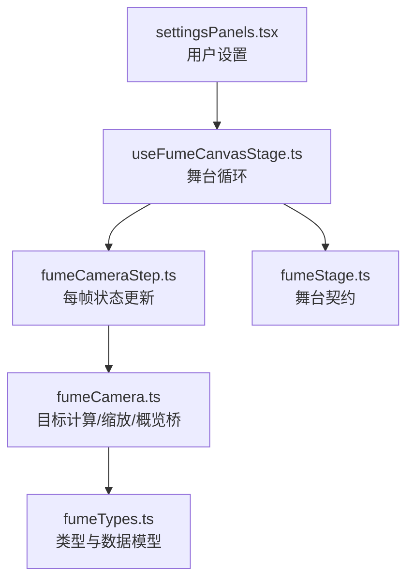
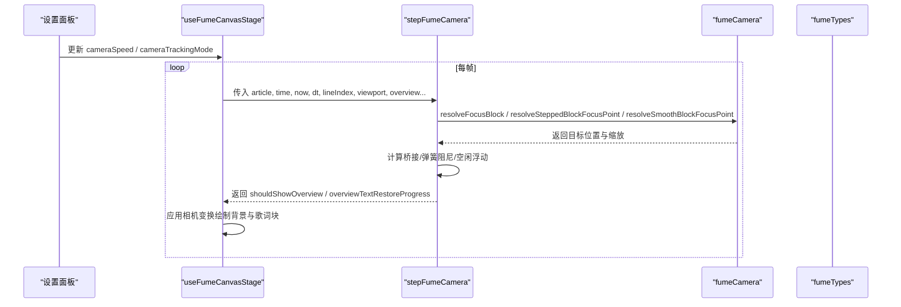
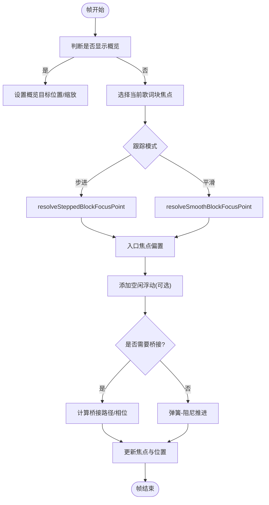
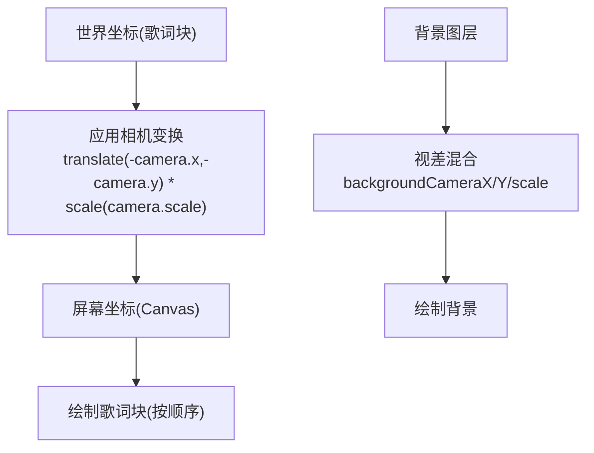
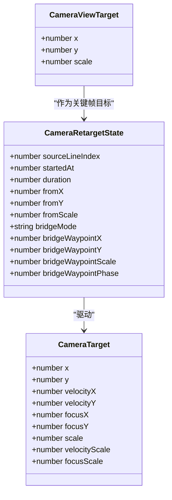
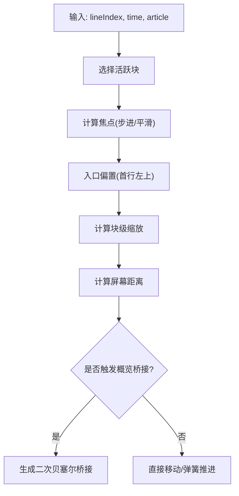
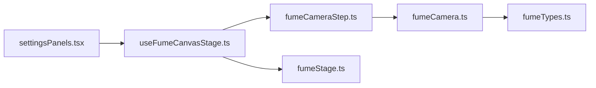

# 摄像机控制系统

<cite>
**本文引用的文件**   
- [fumeCameraStep.ts](file://src/components/visualizer/fume/fumeCameraStep.ts)
- [fumeCamera.ts](file://src/components/visualizer/fume/fumeCamera.ts)
- [fumeTypes.ts](file://src/components/visualizer/fume/fumeTypes.ts)
- [fumeStage.ts](file://src/components/visualizer/fume/fumeStage.ts)
- [useFumeCanvasStage.ts](file://src/components/visualizer/fume/useFumeCanvasStage.ts)
- [settingsPanels.tsx](file://src/components/visualizer/settingsPanels.tsx)
</cite>

## 目录
1. [简介](#简介)
2. [项目结构](#项目结构)
3. [核心组件](#核心组件)
4. [架构总览](#架构总览)
5. [详细组件分析](#详细组件分析)
6. [依赖关系分析](#依赖关系分析)
7. [性能与渲染管线](#性能与渲染管线)
8. [故障排查指南](#故障排查指南)
9. [结论](#结论)

## 简介
本技术文档聚焦 Fume 模式的摄像机控制系统，围绕以下目标展开：
- 摄像机状态管理：位置追踪、旋转插值（缩放）、视野调整。
- 相机运动算法：平滑跟随、步进模式、自动漫游（概览镜头）。
- 视口投影转换：3D/世界坐标到屏幕坐标映射、透视校正思路、深度测试说明。
- 关键帧系统：路径规划、时间轴控制、动画曲线。
- 与歌词内容的交互：焦点锁定、距离计算、避让策略。
- 调试工具与性能监控方法。

该子系统以“无渲染器”的纯数学驱动为核心，将摄像机状态与绘制解耦，便于在 Canvas 或 WebGL 中复用。

## 项目结构
Fume 摄像机相关代码集中在 visualizer/fume 子模块，采用“类型定义 + 相机逻辑 + 舞台调度 + UI 设置”的分层组织方式：
- fumeTypes.ts：共享数据结构与类型（视口、区块、相机目标、重定向状态等）。
- fumeCamera.ts：相机目标选择、块级焦点、缩放、概览飞行桥接等“目标计算”。
- fumeCameraStep.ts：每帧更新的状态机（弹簧阻尼、过渡桥、空闲浮动、背景视差）。
- fumeStage.ts：舞台契约（场景与驱动），连接上层可视化与底层绘制。
- useFumeCanvasStage.ts：Canvas 舞台循环，调用 stepFumeCamera 并绘制背景与歌词块。
- settingsPanels.tsx：用户可调节 cameraSpeed 与 cameraTrackingMode。

**图表来源**
- [useFumeCanvasStage.ts:1-299](file://src/components/visualizer/fume/useFumeCanvasStage.ts#L1-L299)
- [fumeCameraStep.ts:1-413](file://src/components/visualizer/fume/fumeCameraStep.ts#L1-L413)
- [fumeCamera.ts:1-342](file://src/components/visualizer/fume/fumeCamera.ts#L1-L342)
- [fumeTypes.ts:1-160](file://src/components/visualizer/fume/fumeTypes.ts#L1-L160)
- [fumeStage.ts:1-49](file://src/components/visualizer/fume/fumeStage.ts#L1-L49)
- [settingsPanels.tsx:357-384](file://src/components/visualizer/settingsPanels.tsx#L357-L384)

**章节来源**
- [fumeTypes.ts:1-160](file://src/components/visualizer/fume/fumeTypes.ts#L1-L160)
- [fumeCamera.ts:1-342](file://src/components/visualizer/fume/fumeCamera.ts#L1-L342)
- [fumeCameraStep.ts:1-413](file://src/components/visualizer/fume/fumeCameraStep.ts#L1-L413)
- [fumeStage.ts:1-49](file://src/components/visualizer/fume/fumeStage.ts#L1-L49)
- [useFumeCanvasStage.ts:1-299](file://src/components/visualizer/fume/useFumeCanvasStage.ts#L1-L299)
- [settingsPanels.tsx:357-384](file://src/components/visualizer/settingsPanels.tsx#L357-L384)

## 核心组件
- 相机状态与重定向
  - CameraTarget：包含位置、速度、焦点位置、缩放及缩放速度，用于物理式推进。
  - CameraRetargetState：记录重定向起点、时长、桥接模式与中间点，支持直接桥接与概览桥接。
  - FumeCameraState：组合上述两者，并提供初始化标志。
- 目标计算
  - 步进/平滑两种跟踪模式，分别基于已打印字符数或进度插值计算行内焦点。
  - 块级缩放根据视口与行高自适应，限制在全局最小/最大缩放范围内。
  - 概览镜头：当进入概览时，计算全局包围盒与适配缩放，并生成飞行桥接路径。
- 舞台与绘制
  - FumeStageScene/FumeStageDriver：抽象场景与驱动接口，隔离渲染细节。
  - useFumeCanvasStage：Canvas 主循环，负责 dt 计算、相机步进、背景视差与歌词块绘制。

**章节来源**
- [fumeTypes.ts:129-159](file://src/components/visualizer/fume/fumeTypes.ts#L129-L159)
- [fumeCameraStep.ts:13-45](file://src/components/visualizer/fume/fumeCameraStep.ts#L13-L45)
- [fumeCamera.ts:11-12](file://src/components/visualizer/fume/fumeCamera.ts#L11-L12)
- [fumeStage.ts:11-39](file://src/components/visualizer/fume/fumeStage.ts#L11-L39)
- [useFumeCanvasStage.ts:1-299](file://src/components/visualizer/fume/useFumeCanvasStage.ts#L1-L299)

## 架构总览
Fume 摄像机系统遵循“目标计算与状态推进分离”的架构：
- 上层提供当前歌词行索引、播放时间、视口尺寸、主题强度等输入。
- fumeCamera.ts 决定“应该看哪里”，包括块焦点、缩放、概览目标。
- fumeCameraStep.ts 决定“如何到达那里”，包括桥接路径、弹簧阻尼、空闲浮动。
- useFumeCanvasStage.ts 每帧驱动一次 stepFumeCamera，并将结果应用到 Canvas 变换矩阵。

**图表来源**
- [useFumeCanvasStage.ts:145-170](file://src/components/visualizer/fume/useFumeCanvasStage.ts#L145-L170)
- [fumeCameraStep.ts:98-375](file://src/components/visualizer/fume/fumeCameraStep.ts#L98-L375)
- [fumeCamera.ts:308-341](file://src/components/visualizer/fume/fumeCamera.ts#L308-L341)
- [fumeTypes.ts:129-159](file://src/components/visualizer/fume/fumeTypes.ts#L129-L159)

## 详细组件分析

### 摄像机状态管理与运动算法
- 状态结构
  - CameraTarget：维护当前位置、速度与焦点位置、缩放与缩放速度，体现二阶物理推进。
  - CameraRetargetState：记录重定向起止、时长、桥接模式（none/direct/overview）与中间点。
- 步进推进
  - 桥接阶段：按 retargetPhase 插值或直接二次贝塞尔曲线，配合指数追赶系数避免抖动。
  - 非桥接阶段：弹簧-阻尼系统，依据目标与速度的差值产生加速度，并对速度进行限幅。
  - 空闲浮动：基于 wall clock 的正弦叠加，按 animationIntensity 调整幅度与频率；概览模式下衰减。
- 步进与平滑跟踪
  - 步进模式：根据已打印字符数定位到具体行与列偏移，适合“逐字对齐”的强调效果。
  - 平滑模式：按打印进度插值，跨行边界使用缓动混合，避免跳变。
- 缩放控制
  - 块级缩放由视口与行高推导，限制在全局最小/最大缩放范围。
  - 概览缩放根据整体布局包围盒计算，确保内容完整可见。

**图表来源**
- [fumeCameraStep.ts:98-375](file://src/components/visualizer/fume/fumeCameraStep.ts#L98-L375)
- [fumeCamera.ts:17-149](file://src/components/visualizer/fume/fumeCamera.ts#L17-L149)

**章节来源**
- [fumeCameraStep.ts:13-45](file://src/components/visualizer/fume/fumeCameraStep.ts#L13-L45)
- [fumeCameraStep.ts:98-375](file://src/components/visualizer/fume/fumeCameraStep.ts#L98-L375)
- [fumeCamera.ts:17-149](file://src/components/visualizer/fume/fumeCamera.ts#L17-L149)

### 视口投影转换与深度测试
- 3D/世界到屏幕映射
  - Canvas 变换：先平移至视口中心，再按 camera.scale 缩放，最后平移至相机负坐标，实现“世界坐标 → 屏幕坐标”的统一变换。
  - 背景视差：背景相机位置与缩放独立于前景相机，通过固定比例混合与垂直偏移营造景深。
- 透视校正
  - 当前为 2D Canvas 渲染，未启用真实透视投影；所有变换均为仿射变换（平移+缩放）。
  - 若未来引入 WebGL/透视投影，需增加投影矩阵与视锥裁剪，并在着色器中进行深度测试。
- 深度测试
  - 当前歌词块按顺序绘制，未进行深度缓冲比较；可通过分层渲染或排序策略模拟遮挡。

**图表来源**
- [useFumeCanvasStage.ts:163-197](file://src/components/visualizer/fume/useFumeCanvasStage.ts#L163-L197)
- [fumeCameraStep.ts:377-412](file://src/components/visualizer/fume/fumeCameraStep.ts#L377-L412)

**章节来源**
- [useFumeCanvasStage.ts:163-197](file://src/components/visualizer/fume/useFumeCanvasStage.ts#L163-L197)
- [fumeCameraStep.ts:377-412](file://src/components/visualizer/fume/fumeCameraStep.ts#L377-L412)

### 相机关键帧系统与路径规划
- 关键帧概念
  - 概览镜头作为“关键帧目标”，由 resolveArticleOverviewCamera 计算，包含中心与缩放。
  - 飞行桥接（overview flight bridge）将普通目标与概览目标用二次贝塞尔曲线连接，形成关键帧路径。
- 时间轴控制
  - retarget.startedAt 与 duration 控制过渡时长，retargetPhase 归一化进度。
  - 概览文本恢复进度 overviewTextRestoreProgress 与 retargetPhase 关联，用于 UI 同步。
- 动画曲线
  - 直接使用 easeInOutCubic/easeOutCubic 与 quadraticBezier 构建平滑曲线。
  - 桥接模式分为 direct（线性插值）与 overview（二次贝塞尔），根据屏幕距离与视口大小动态选择。

**图表来源**
- [fumeTypes.ts:129-159](file://src/components/visualizer/fume/fumeTypes.ts#L129-L159)
- [fumeCamera.ts:188-261](file://src/components/visualizer/fume/fumeCamera.ts#L188-L261)
- [fumeCameraStep.ts:111-131](file://src/components/visualizer/fume/fumeCameraStep.ts#L111-L131)

**章节来源**
- [fumeCamera.ts:188-261](file://src/components/visualizer/fume/fumeCamera.ts#L188-L261)
- [fumeCameraStep.ts:111-131](file://src/components/visualizer/fume/fumeCameraStep.ts#L111-L131)
- [fumeTypes.ts:129-159](file://src/components/visualizer/fume/fumeTypes.ts#L129-L159)

### 与歌词内容的交互：焦点锁定、距离计算与避让
- 焦点锁定
  - resolveFocusBlock 根据当前行索引与时间选择活跃歌词块；若无活跃块则回退到最近已打印块。
  - 步进/平滑模式分别计算行内焦点，步进模式考虑已打印字符数，平滑模式考虑打印进度。
- 距离计算
  - 桥接判定使用屏幕距离（worldDistance × safeScale），超过阈值才触发概览桥接，避免短距离抖动。
- 避让策略
  - 入口焦点偏置：在块开始时偏向首行左上角，增强阅读起始感。
  - 缩放自适应：根据行高与视口计算缩放，避免过小导致拥挤或过大导致内容溢出。
  - 概览避让：概览缩放限制上限，保证整体内容可见。

**图表来源**
- [fumeCamera.ts:308-341](file://src/components/visualizer/fume/fumeCamera.ts#L308-L341)
- [fumeCamera.ts:17-149](file://src/components/visualizer/fume/fumeCamera.ts#L17-L149)
- [fumeCamera.ts:188-261](file://src/components/visualizer/fume/fumeCamera.ts#L188-L261)

**章节来源**
- [fumeCamera.ts:308-341](file://src/components/visualizer/fume/fumeCamera.ts#L308-L341)
- [fumeCamera.ts:17-149](file://src/components/visualizer/fume/fumeCamera.ts#L17-L149)
- [fumeCamera.ts:188-261](file://src/components/visualizer/fume/fumeCamera.ts#L188-L261)

### 相机调试工具与性能监控
- 调试开关
  - showPrintStamp：可在绘制时输出打印信息，辅助定位歌词块时序问题。
  - staticMode：关闭相机运动，便于静态排版验证。
- 性能指标
  - SNAPSHOT_IDLE_MS：静态快照缓存释放阈值，避免内存泄漏。
  - liveRasterRef：按需栅格化正在打印的歌词块，减少重复测量开销。
  - isGlowBlurQuantized：根据主题辉光模糊量化策略选择绘制路径，降低 GPU/CPU 压力。
- 监控建议
  - 观察 dt 变化，确保帧间隔稳定在合理范围（1/240 ~ 0.05s）。
  - 统计 requestAnimationFrame 调用频率，避免过度绘制。
  - 检查静态快照缓存命中率与释放时机，防止内存增长。

**章节来源**
- [useFumeCanvasStage.ts:22-23](file://src/components/visualizer/fume/useFumeCanvasStage.ts#L22-L23)
- [useFumeCanvasStage.ts:210-274](file://src/components/visualizer/fume/useFumeCanvasStage.ts#L210-L274)
- [useFumeCanvasStage.ts:289-299](file://src/components/visualizer/fume/useFumeCanvasStage.ts#L289-L299)

## 依赖关系分析
- 组件耦合
  - useFumeCanvasStage 强依赖 fumeCameraStep 与 fumeStage 契约，弱依赖 fumeCamera 的目标计算。
  - fumeCameraStep 依赖 fumeCamera 提供的目标函数与常量，以及 fumeTypes 的数据结构。
  - settingsPanels 仅影响 cameraSpeed 与 cameraTrackingMode，不直接参与运行时计算。
- 外部依赖
  - 主题与歌词渲染提示：从 types 与 utils/lyrics 获取行过渡与词揭示模式，影响重定向时长。
  - Canvas API：用于绘制背景与歌词块，不涉及 WebGL。

**图表来源**
- [settingsPanels.tsx:357-384](file://src/components/visualizer/settingsPanels.tsx#L357-L384)
- [useFumeCanvasStage.ts:1-299](file://src/components/visualizer/fume/useFumeCanvasStage.ts#L1-L299)
- [fumeCameraStep.ts:1-413](file://src/components/visualizer/fume/fumeCameraStep.ts#L1-L413)
- [fumeCamera.ts:1-342](file://src/components/visualizer/fume/fumeCamera.ts#L1-L342)
- [fumeTypes.ts:1-160](file://src/components/visualizer/fume/fumeTypes.ts#L1-L160)
- [fumeStage.ts:1-49](file://src/components/visualizer/fume/fumeStage.ts#L1-L49)

**章节来源**
- [settingsPanels.tsx:357-384](file://src/components/visualizer/settingsPanels.tsx#L357-L384)
- [useFumeCanvasStage.ts:1-299](file://src/components/visualizer/fume/useFumeCanvasStage.ts#L1-L299)
- [fumeCameraStep.ts:1-413](file://src/components/visualizer/fume/fumeCameraStep.ts#L1-L413)
- [fumeCamera.ts:1-342](file://src/components/visualizer/fume/fumeCamera.ts#L1-L342)
- [fumeTypes.ts:1-160](file://src/components/visualizer/fume/fumeTypes.ts#L1-L160)
- [fumeStage.ts:1-49](file://src/components/visualizer/fume/fumeStage.ts#L1-L49)

## 性能与渲染管线
- 帧循环
  - 使用 performance.now() 计算 dt，限制在 1/240 ~ 0.05s，避免极端掉帧导致的数值爆炸。
  - 通过 requestAnimationFrame 驱动绘制，暂停时取消帧请求。
- 相机步进
  - 桥接阶段使用指数追赶系数，快速收敛到目标，避免长尾抖动。
  - 弹簧-阻尼参数随 retargetBoost 动态调整，兼顾响应性与稳定性。
- 背景视差
  - 背景相机位置与缩放独立计算，减少前景绘制的复杂度。
- 歌词块绘制
  - 静态快照缓存：对已完成的歌词块生成离屏 canvas，命中后直接绘制，降低重复测量成本。
  - 实时栅格化：对正在打印的歌词块，按有限缩放级别栅格化，避免频繁字体度量。
- 资源回收
  - 静态快照超过 SNAPSHOT_IDLE_MS 未使用即释放，及时归还 GPU/CPU 资源。

**章节来源**
- [useFumeCanvasStage.ts:91-110](file://src/components/visualizer/fume/useFumeCanvasStage.ts#L91-L110)
- [useFumeCanvasStage.ts:199-274](file://src/components/visualizer/fume/useFumeCanvasStage.ts#L199-L274)
- [useFumeCanvasStage.ts:289-299](file://src/components/visualizer/fume/useFumeCanvasStage.ts#L289-L299)

## 故障排查指南
- 相机抖动或过冲
  - 检查 retarget.duration 是否过小，导致 springStrength 过大。
  - 确认 cameraSpeed 设置是否过高，缩短过渡时间引发不稳定。
- 概览镜头异常
  - 校验 overviewCamera 是否为空或缩放超出上限。
  - 检查 screenDistance 是否低于阈值，导致未触发桥接。
- 歌词块错位
  - 确认 block.renderLines 与 graphemes 长度一致，避免越界。
  - 检查 isFumeBlockOnScreen 的可见性判断是否过于严格。
- 性能下降
  - 观察静态快照缓存命中率，必要时增大 SNAPSHOT_IDLE_MS。
  - 检查 isGlowBlurQuantized 分支是否频繁切换，导致绘制路径不稳定。

**章节来源**
- [fumeCameraStep.ts:190-375](file://src/components/visualizer/fume/fumeCameraStep.ts#L190-L375)
- [fumeCamera.ts:188-261](file://src/components/visualizer/fume/fumeCamera.ts#L188-L261)
- [useFumeCanvasStage.ts:210-274](file://src/components/visualizer/fume/useFumeCanvasStage.ts#L210-L274)

## 结论
Fume 摄像机控制系统以清晰的职责划分与稳定的数值驱动为核心：
- 目标计算与状态推进分离，便于扩展与测试。
- 步进/平滑双模式满足不同视觉风格需求。
- 概览桥接提供自然的“关键帧”体验，结合动画曲线实现流畅过渡。
- 视口投影采用仿射变换，简洁高效；如需透视与深度测试，可在 WebGL 层扩展。
- 通过快照缓存与栅格化策略，平衡了质量与性能。