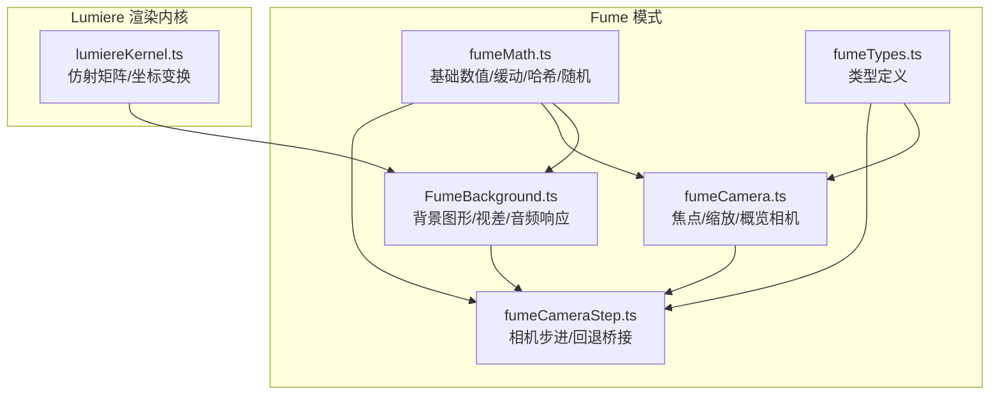
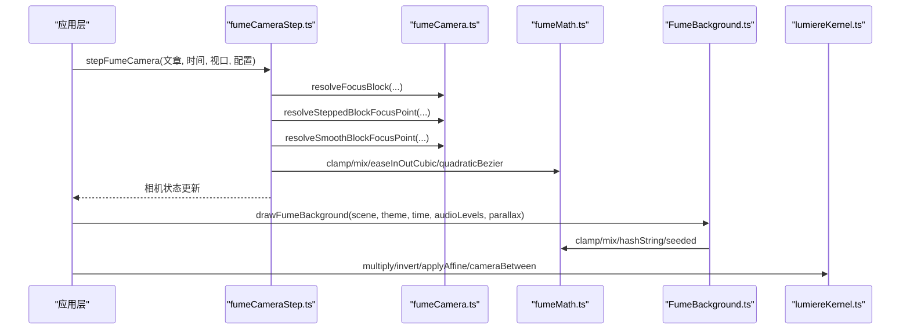
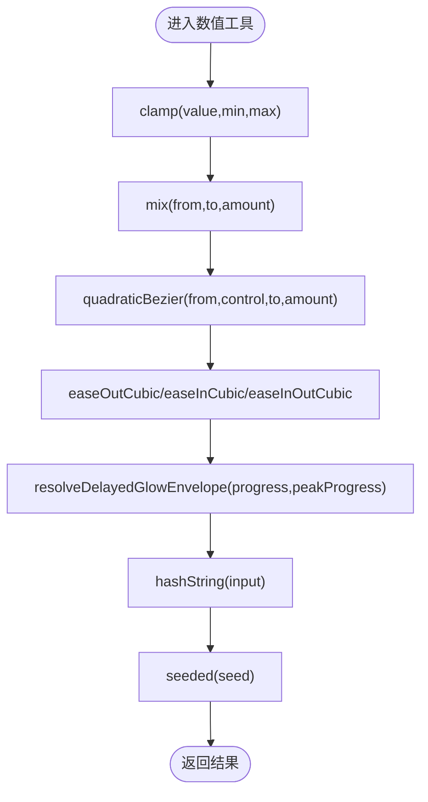
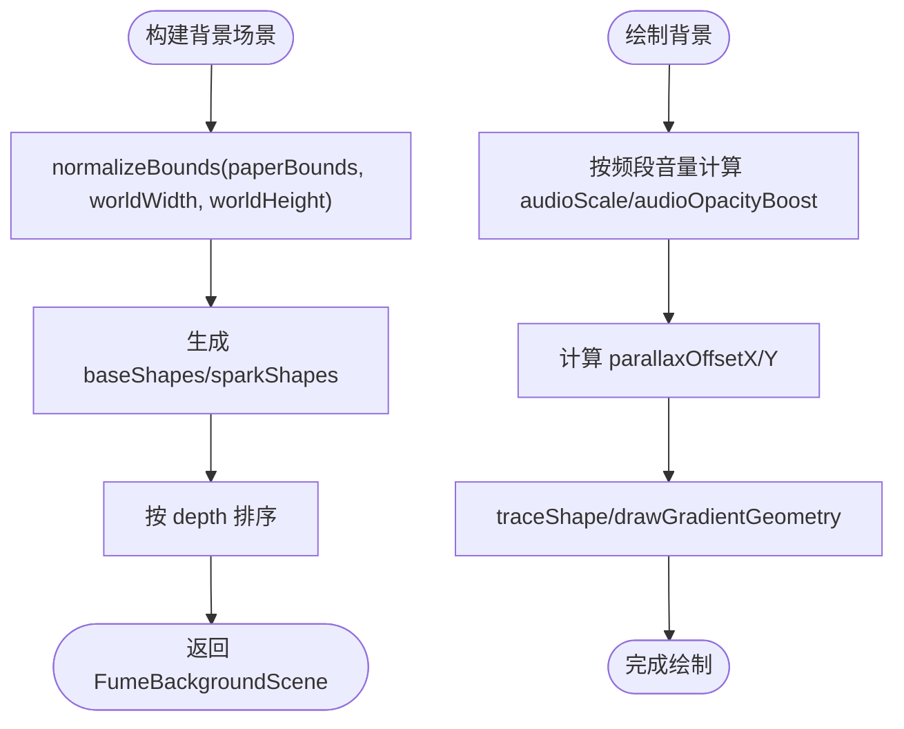
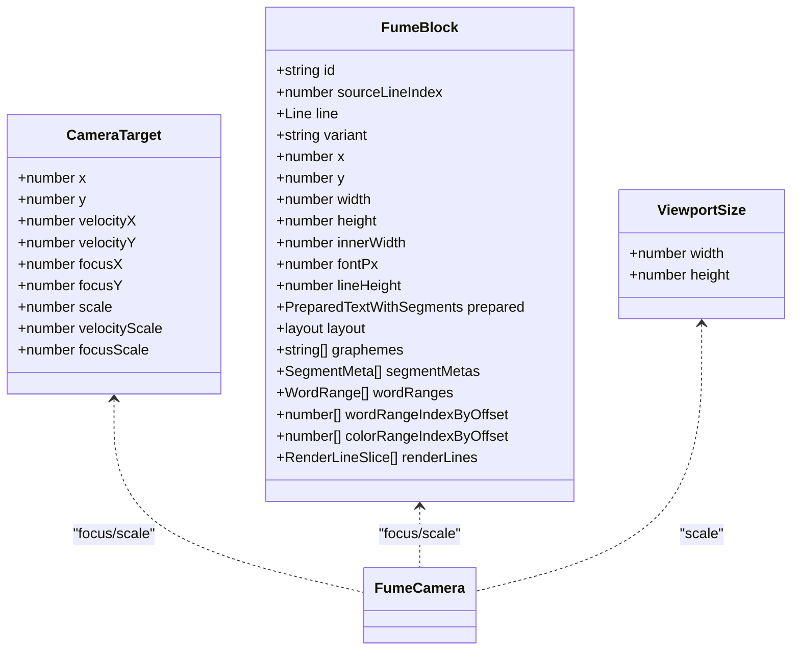
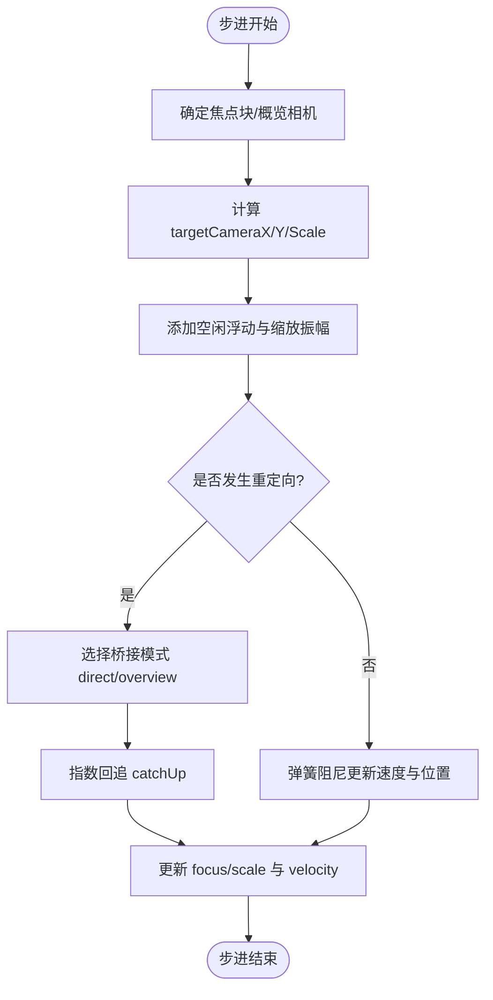
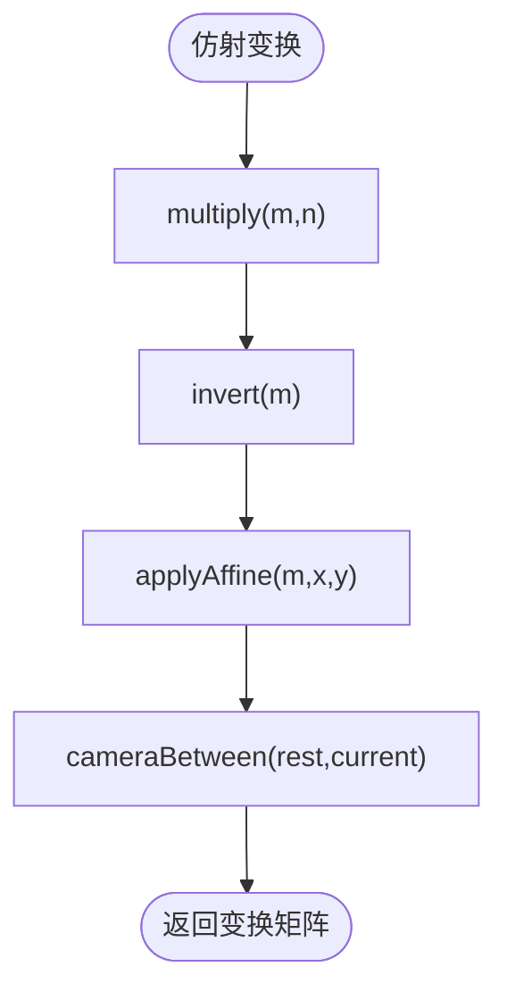
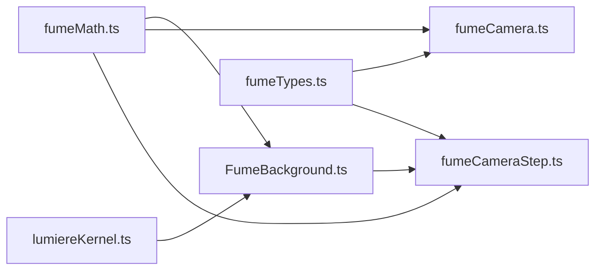

# 数学工具库

<cite>
**本文引用的文件**   
- [fumeMath.ts](file://src/components/visualizer/fume/fumeMath.ts)
- [FumeBackground.ts](file://src/components/visualizer/FumeBackground.ts)
- [fumeCameraStep.ts](file://src/components/visualizer/fume/fumeCameraStep.ts)
- [fumeCamera.ts](file://src/components/visualizer/fume/fumeCamera.ts)
- [fumeTypes.ts](file://src/components/visualizer/fume/fumeTypes.ts)
- [lumiereKernel.ts](file://src/components/visualizer/lumiere/lumiereKernel.ts)
</cite>

## 目录
1. [引言](#引言)
2. [项目结构](#项目结构)
3. [核心组件](#核心组件)
4. [架构总览](#架构总览)
5. [详细组件分析](#详细组件分析)
6. [依赖关系分析](#依赖关系分析)
7. [性能与数值精度](#性能与数值精度)
8. [故障排查指南](#故障排查指南)
9. [结论](#结论)
10. [附录：使用示例与基准测试建议](#附录使用示例与基准测试建议)

## 引言
本技术文档聚焦 Fume 模式的数学工具库，围绕以下目标展开：
- 向量运算函数：点积、叉积、归一化、插值（mix）等。
- 矩阵变换操作：平移、旋转、缩放、透视投影相关思路。
- 几何算法：距离计算、碰撞检测、形状判断。
- 数值处理：四舍五入、范围限制、精度控制。
- 随机数生成：种子设置、分布函数、序列控制。
- 数学函数的使用示例与性能基准测试方法。

需要特别说明的是：仓库中并未提供统一的“数学工具库”入口；数学能力分散在 Fume 模式与 Lumiere 渲染内核中。因此，本文以这些实际实现为依据进行归纳与扩展说明，帮助读者理解现有实现并补充缺失的通用数学原语。

## 项目结构
Fume 模式相关的数学与几何逻辑主要分布在以下位置：
- fumeMath.ts：基础数值、缓动、哈希与随机种子工具。
- FumeBackground.ts：背景图形构建、绘制、视差与音频响应。
- fumeCamera.ts / fumeCameraStep.ts：相机目标、焦点、缩放、回退桥接与步进更新。
- fumeTypes.ts：布局、块、相机状态等类型定义。
- lumiereKernel.ts：仿射矩阵乘法、求逆、坐标变换与运镜矩阵。

**图表来源** 
- [fumeMath.ts:1-60](file://src/components/visualizer/fume/fumeMath.ts#L1-L60)
- [FumeBackground.ts:1-468](file://src/components/visualizer/FumeBackground.ts#L1-L468)
- [fumeCamera.ts:1-342](file://src/components/visualizer/fume/fumeCamera.ts#L1-L342)
- [fumeCameraStep.ts:1-413](file://src/components/visualizer/fume/fumeCameraStep.ts#L1-L413)
- [fumeTypes.ts:1-160](file://src/components/visualizer/fume/fumeTypes.ts#L1-L160)
- [lumiereKernel.ts:76-105](file://src/components/visualizer/lumiere/lumiereKernel.ts#L76-L105)

**章节来源**
- [fumeMath.ts:1-60](file://src/components/visualizer/fume/fumeMath.ts#L1-L60)
- [FumeBackground.ts:1-468](file://src/components/visualizer/FumeBackground.ts#L1-L468)
- [fumeCamera.ts:1-342](file://src/components/visualizer/fume/fumeCamera.ts#L1-L342)
- [fumeCameraStep.ts:1-413](file://src/components/visualizer/fume/fumeCameraStep.ts#L1-L413)
- [fumeTypes.ts:1-160](file://src/components/visualizer/fume/fumeTypes.ts#L1-L160)
- [lumiereKernel.ts:76-105](file://src/components/visualizer/lumiere/lumiereKernel.ts#L76-L105)

## 核心组件
本节梳理与数学工具库直接相关的核心能力：
- 基础数值与插值：clamp、mix、quadraticBezier、ease* 缓动。
- 哈希与随机种子：hashString、seeded。
- 相机与几何：焦点定位、缩放适配、视差、距离与边界限制。
- 矩阵变换：仿射矩阵乘法、求逆、坐标应用、运镜矩阵。

**章节来源**
- [fumeMath.ts:16-30](file://src/components/visualizer/fume/fumeMath.ts#L16-L30)
- [fumeMath.ts:47-59](file://src/components/visualizer/fume/fumeMath.ts#L47-L59)
- [FumeBackground.ts:61-76](file://src/components/visualizer/FumeBackground.ts#L61-L76)
- [fumeCamera.ts:17-149](file://src/components/visualizer/fume/fumeCamera.ts#L17-L149)
- [fumeCameraStep.ts:98-374](file://src/components/visualizer/fume/fumeCameraStep.ts#L98-L374)
- [lumiereKernel.ts:76-105](file://src/components/visualizer/lumiere/lumiereKernel.ts#L76-L105)

## 架构总览
Fume 模式的数学与几何流程可概括为：
- 输入：歌词布局、当前行号、时间、视口尺寸、主题动画强度。
- 计算：焦点定位、缩放适配、回退桥接、弹簧阻尼运动、视差背景。
- 输出：相机状态（位置、速度、缩放）、背景视图参数、绘制指令。

**图表来源** 
- [fumeCameraStep.ts:98-374](file://src/components/visualizer/fume/fumeCameraStep.ts#L98-L374)
- [fumeCamera.ts:17-149](file://src/components/visualizer/fume/fumeCamera.ts#L17-L149)
- [fumeMath.ts:16-30](file://src/components/visualizer/fume/fumeMath.ts#L16-L30)
- [FumeBackground.ts:363-467](file://src/components/visualizer/FumeBackground.ts#L363-L467)
- [lumiereKernel.ts:76-105](file://src/components/visualizer/lumiere/lumiereKernel.ts#L76-L105)

## 详细组件分析

### 基础数学与数值工具（fumeMath.ts）
- 范围限制：clamp(value, min, max)。
- 线性插值：mix(from, to, amount)。
- 二次贝塞尔插值：quadraticBezier(from, control, to, amount)。
- 缓动函数：easeOutCubic、easeInCubic、easeInOutCubic。
- 延迟发光包络：resolveDelayedGlowEnvelope(progress, peakProgress)。
- 字符分割与 CJK 识别：splitGraphemes、isCJK。
- 哈希与随机种子：hashString(input)、seeded(seed)。

复杂度与特性：
- clamp/mix 为 O(1)，无额外分配。
- ease* 系列为 O(1)，仅基本算术与幂运算。
- hashString 为 O(n)，n 为字符串长度；seeded 基于 hashString 返回 [0,1) 均匀分布近似值。
- splitGraphemes 依赖 Intl.Segmenter，若不可用则退化到 Array.from(text)。

**图表来源** 
- [fumeMath.ts:16-43](file://src/components/visualizer/fume/fumeMath.ts#L16-L43)
- [fumeMath.ts:47-59](file://src/components/visualizer/fume/fumeMath.ts#L47-L59)

**章节来源**
- [fumeMath.ts:16-43](file://src/components/visualizer/fume/fumeMath.ts#L16-L43)
- [fumeMath.ts:47-59](file://src/components/visualizer/fume/fumeMath.ts#L47-L59)

### 背景图形与视差（FumeBackground.ts）
- 图形构建：ring/square/cross/spark 多种形状路径。
- 视差：根据相机偏移计算背景层的 cameraX/cameraY/originX/originY/strength。
- 音频响应：按频段音量调整形状大小与透明度。
- 随机种子：通过 seedKey 派生局部种子，保证不同设备与歌曲的一致性。

关键流程：
- buildFumeBackgroundScene：根据视口与世界尺寸生成形状集合，排序 depth。
- drawFumeBackground：遍历形状，应用视差、音频缩放、旋转与渐变描边。

**图表来源** 
- [FumeBackground.ts:144-153](file://src/components/visualizer/FumeBackground.ts#L144-L153)
- [FumeBackground.ts:243-360](file://src/components/visualizer/FumeBackground.ts#L243-L360)
- [FumeBackground.ts:363-467](file://src/components/visualizer/FumeBackground.ts#L363-L467)

**章节来源**
- [FumeBackground.ts:61-76](file://src/components/visualizer/FumeBackground.ts#L61-L76)
- [FumeBackground.ts:144-153](file://src/components/visualizer/FumeBackground.ts#L144-L153)
- [FumeBackground.ts:243-360](file://src/components/visualizer/FumeBackground.ts#L243-L360)
- [FumeBackground.ts:363-467](file://src/components/visualizer/FumeBackground.ts#L363-L467)

### 相机焦点与缩放（fumeCamera.ts）
- 步进焦点：resolveSteppedBlockFocusPoint(block, printedCount)。
- 平滑焦点：resolveSmoothBlockFocusPoint(block, printedProgress)，跨行过渡使用 easeInOutCubic 混合。
- 入场焦点：resolveBlockEntryFocusPoint(block)。
- 缩放适配：resolveCameraScaleForBlock(block, viewport)，基于行高与视口最小边计算。
- 概览相机：resolveArticleOverviewCamera(article, viewport)，包围盒内填充 padding 后 fit。
- 飞行桥接：resolveOverviewFlightBridge(...)，根据屏幕距离与缩放决定中间点与阶段。

**图表来源** 
- [fumeTypes.ts:129-139](file://src/components/visualizer/fume/fumeTypes.ts#L129-L139)
- [fumeTypes.ts:54-74](file://src/components/visualizer/fume/fumeTypes.ts#L54-L74)
- [fumeTypes.ts:8-11](file://src/components/visualizer/fume/fumeTypes.ts#L8-L11)
- [fumeCamera.ts:17-149](file://src/components/visualizer/fume/fumeCamera.ts#L17-L149)

**章节来源**
- [fumeCamera.ts:17-149](file://src/components/visualizer/fume/fumeCamera.ts#L17-L149)
- [fumeCamera.ts:188-261](file://src/components/visualizer/fume/fumeCamera.ts#L188-L261)
- [fumeCamera.ts:263-306](file://src/components/visualizer/fume/fumeCamera.ts#L263-L306)
- [fumeCamera.ts:308-341](file://src/components/visualizer/fume/fumeCamera.ts#L308-L341)

### 相机步进与回退桥接（fumeCameraStep.ts）
- 每帧步进：stepFumeCamera(state, input) 计算目标相机位置与缩放，加入空闲浮动与弹簧阻尼。
- 回退桥接：当目标变化时，选择 direct 或 overview 桥接模式，使用 quadraticBezier 或 mix 插值。
- 背景视差：resolveFumeBackgroundView(backgroundScene, camera, viewport) 计算背景层相机与缩放。

**图表来源** 
- [fumeCameraStep.ts:98-374](file://src/components/visualizer/fume/fumeCameraStep.ts#L98-L374)
- [fumeCameraStep.ts:382-412](file://src/components/visualizer/fume/fumeCameraStep.ts#L382-L412)

**章节来源**
- [fumeCameraStep.ts:98-374](file://src/components/visualizer/fume/fumeCameraStep.ts#L98-L374)
- [fumeCameraStep.ts:382-412](file://src/components/visualizer/fume/fumeCameraStep.ts#L382-L412)

### 矩阵变换与坐标映射（lumiereKernel.ts）
- 仿射矩阵乘法：multiply(m, n) 表示先 n 再 m 的组合。
- 矩阵求逆：invert(m)，用于反变换。
- 坐标应用：applyAffine(m, x, y)。
- 运镜矩阵：cameraBetween(rest, current) 将“无运镜容器变换”映射到“有运镜容器变换”。

**图表来源** 
- [lumiereKernel.ts:76-105](file://src/components/visualizer/lumiere/lumiereKernel.ts#L76-L105)

**章节来源**
- [lumiereKernel.ts:76-105](file://src/components/visualizer/lumiere/lumiereKernel.ts#L76-L105)

## 依赖关系分析
- fumeMath.ts 被 FumeBackground.ts、fumeCamera.ts、fumeCameraStep.ts 共同依赖，作为基础数值与随机种子工具。
- fumeTypes.ts 为 fumeCamera.ts 与 fumeCameraStep.ts 提供共享类型。
- FumeBackground.ts 依赖 fumeMath.ts 与颜色工具（colorMix），并在绘制时受相机视差影响。
- lumiereKernel.ts 提供底层矩阵运算，供渲染内核使用，间接影响背景与字幕装饰的跟随变换。

**图表来源** 
- [fumeMath.ts:1-60](file://src/components/visualizer/fume/fumeMath.ts#L1-L60)
- [FumeBackground.ts:1-468](file://src/components/visualizer/FumeBackground.ts#L1-L468)
- [fumeCamera.ts:1-342](file://src/components/visualizer/fume/fumeCamera.ts#L1-L342)
- [fumeCameraStep.ts:1-413](file://src/components/visualizer/fume/fumeCameraStep.ts#L1-L413)
- [fumeTypes.ts:1-160](file://src/components/visualizer/fume/fumeTypes.ts#L1-L160)
- [lumiereKernel.ts:76-105](file://src/components/visualizer/lumiere/lumiereKernel.ts#L76-L105)

**章节来源**
- [fumeMath.ts:1-60](file://src/components/visualizer/fume/fumeMath.ts#L1-L60)
- [FumeBackground.ts:1-468](file://src/components/visualizer/FumeBackground.ts#L1-L468)
- [fumeCamera.ts:1-342](file://src/components/visualizer/fume/fumeCamera.ts#L1-L342)
- [fumeCameraStep.ts:1-413](file://src/components/visualizer/fume/fumeCameraStep.ts#L1-L413)
- [fumeTypes.ts:1-160](file://src/components/visualizer/fume/fumeTypes.ts#L1-L160)
- [lumiereKernel.ts:76-105](file://src/components/visualizer/lumiere/lumiereKernel.ts#L76-L105)

## 性能与数值精度
- 数值稳定性：
  - invert 中使用 det || 1e-12 防止除零，避免奇异矩阵导致的数值爆炸。
  - clamp 广泛用于相机缩放与速度限制，确保物理量在合理范围内。
- 性能特征：
  - 背景形状数量随视口宽高比变化，spark 区域按行列网格划分，减少极端密集情况。
  - 相机步进使用指数回追与弹簧阻尼，避免高频抖动，降低 CPU/GPU 压力。
- 精度控制：
  - 缩放与速度上限/下限由常量约束，如 CAMERA_SCALE_MIN/MAX。
  - 随机种子通过 hashString+seeded 产生稳定分布，避免浮点误差累积。

[本节为一般性指导，不直接分析具体文件]

## 故障排查指南
- 相机跳动或卡顿：
  - 检查 retarget.duration 与 bridgeMode 是否正确触发；过大或过小会导致回追不足或过度。
  - 确认 springStrength 与 damping 参数是否在合理区间，避免过冲或迟滞。
- 背景闪烁或错位：
  - 校验 paperBounds 是否越界，normalizeBounds 会将其限制到世界尺寸内。
  - 检查 audioLevels 频段值是否异常导致过度缩放或透明度过高。
- 随机结果不一致：
  - 确认 seedKey 是否稳定；不同 seedKey 会产生不同但稳定的随机序列。
- 矩阵变换异常：
  - 检查 invert 的 det 是否为极小值；必要时增加阈值保护。
  - 确认 applyAffine 的输入坐标是否与期望坐标系一致。

**章节来源**
- [fumeCameraStep.ts:98-374](file://src/components/visualizer/fume/fumeCameraStep.ts#L98-L374)
- [FumeBackground.ts:144-153](file://src/components/visualizer/FumeBackground.ts#L144-L153)
- [lumiereKernel.ts:86-96](file://src/components/visualizer/lumiere/lumiereKernel.ts#L86-L96)

## 结论
Fume 模式的数学工具库以 fumeMath.ts 为基础，结合 FumeBackground.ts 的图形与视差、fumeCamera.ts 与 fumeCameraStep.ts 的相机控制，以及 lumiereKernel.ts 的矩阵变换，形成一套完整的视觉数学管线。尽管未提供统一的数学库入口，但这些模块已覆盖插值、缓动、哈希、随机种子、范围限制、距离计算、缩放适配与仿射变换等核心能力。对于缺失的原语（如点积、叉积、归一化、透视投影），可在现有 clamp/mix/ease* 基础上扩展，保持与现有风格一致的数值稳定性与性能特征。

[本节为总结性内容，不直接分析具体文件]

## 附录：使用示例与基准测试建议
- 使用示例（概念性描述）：
  - 点积：对两个二维向量 (x1,y1) 与 (x2,y2)，计算 x1*x2 + y1*y2，用于角度与投影。
  - 叉积：对两个二维向量，计算 x1*y2 - y2*x1，用于方向判定与面积估算。
  - 归一化：对向量 v=(x,y)，计算 length=Math.hypot(x,y)，若 length>0，则 v=v/length。
  - 插值：使用 mix(a,b,t) 在 a 与 b 之间按 t∈[0,1] 插值。
  - 矩阵变换：使用 multiply(A,B) 组合变换，invert(M) 求逆，applyAffine(M,x,y) 应用坐标。
- 基准测试建议：
  - 热点函数：stepFumeCamera、drawFumeBackground、multiply/invert/applyAffine。
  - 指标：帧时间、CPU 占用、GPU 绘制调用次数、内存分配频率。
  - 场景：不同视口尺寸、不同形状数量、不同相机移动速度、不同音频频段强度。
  - 对比：开启/关闭视差、开启/关闭桥接模式、不同缓动策略。

[本节为概念性指导，不直接分析具体文件]